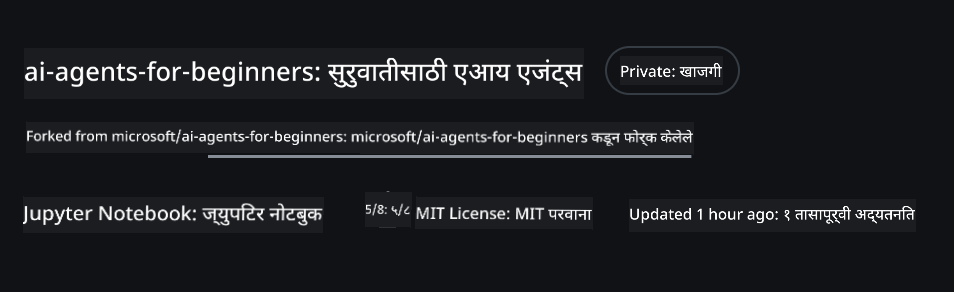
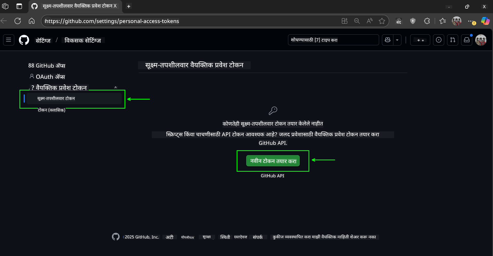
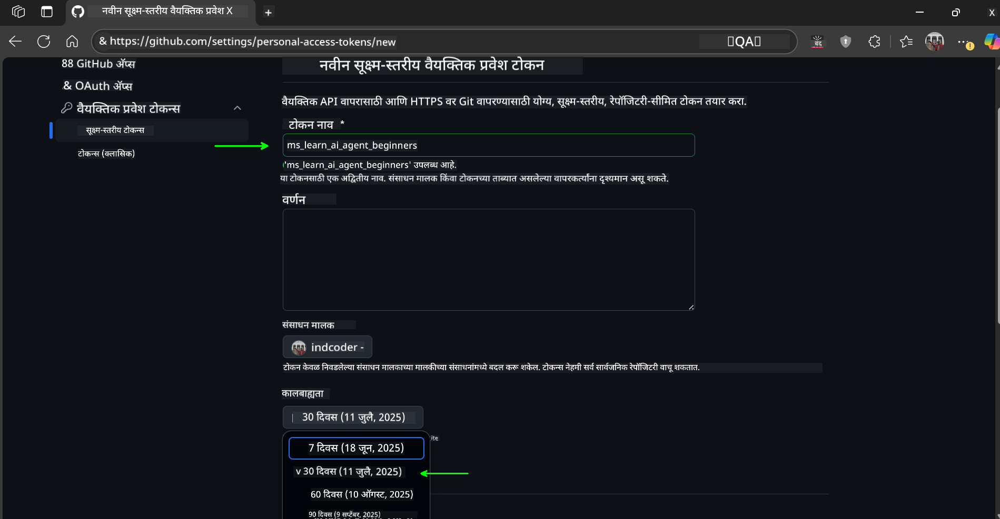
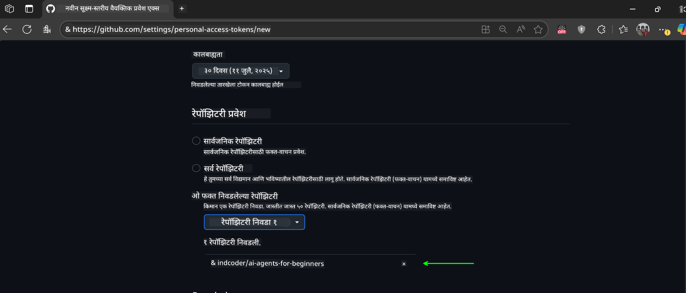
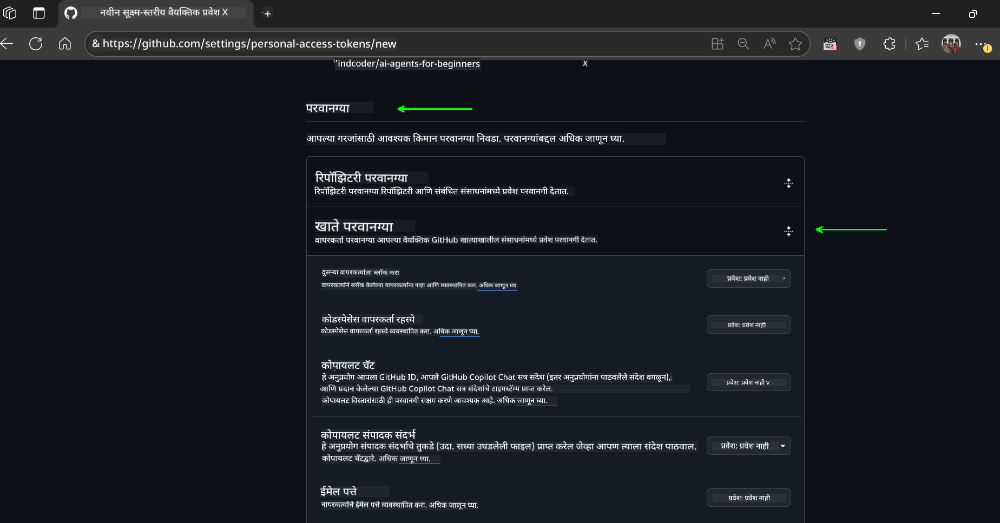
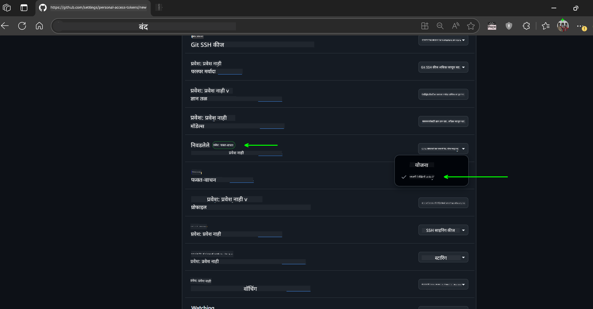
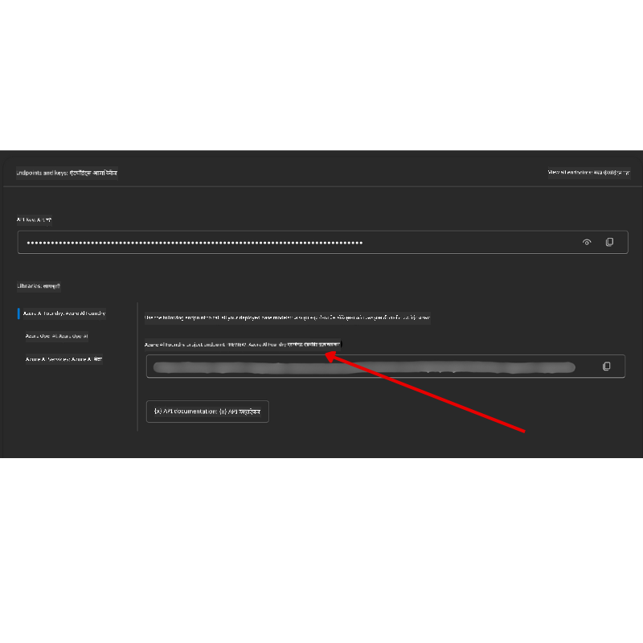

<!--
CO_OP_TRANSLATOR_METADATA:
{
  "original_hash": "c6a79c8f2b56a80370ff7e447765524f",
  "translation_date": "2025-07-23T08:29:59+00:00",
  "source_file": "00-course-setup/README.md",
  "language_code": "mr"
}
-->
# कोर्स सेटअप

## परिचय

या धड्यात तुम्हाला या कोर्समधील कोड नमुने कसे चालवायचे ते शिकवले जाईल.

## या रिपॉजिटरीला क्लोन किंवा फोर्क करा

सुरुवात करण्यासाठी, कृपया GitHub रिपॉजिटरी क्लोन किंवा फोर्क करा. यामुळे तुम्हाला कोर्स मटेरियलची स्वतःची आवृत्ती मिळेल ज्यामुळे तुम्ही कोड चालवू, चाचणी करू आणि बदल करू शकाल!

हे खालील लिंकवर क्लिक करून करता येईल:



## कोड चालवणे

या कोर्समध्ये Jupyter Notebooks चा एक संच दिला आहे ज्याद्वारे तुम्ही AI एजंट्स तयार करण्याचा प्रत्यक्ष अनुभव घेऊ शकता.

कोड नमुने खालीलपैकी एक वापरतात:

**GitHub खाते आवश्यक - मोफत**:

1) Semantic Kernel Agent Framework + GitHub Models Marketplace. (semantic-kernel.ipynb) म्हणून लेबल केलेले.
2) AutoGen Framework + GitHub Models Marketplace. (autogen.ipynb) म्हणून लेबल केलेले.

**Azure सदस्यता आवश्यक**:
3) Azure AI Foundry + Azure AI Agent Service. (azureaiagent.ipynb) म्हणून लेबल केलेले.

तुम्हाला सर्व तीन प्रकारचे उदाहरणे वापरून पाहण्याची शिफारस केली जाते, जेणेकरून तुमच्यासाठी सर्वात चांगले कोणते कार्य करते ते तुम्हाला समजेल.

तुम्ही कोणता पर्याय निवडता, त्यावर आधारित खालील सेटअप चरण ठरतील:

## आवश्यकताः

- Python 3.12+
  - **NOTE**: जर तुमच्याकडे Python3.12 स्थापित नसेल, तर ते स्थापित करा. नंतर requirements.txt फाइलमधून योग्य आवृत्त्या स्थापित करण्यासाठी python3.12 वापरून तुमचे venv तयार करा.
- GitHub खाते - GitHub Models Marketplace मध्ये प्रवेशासाठी.
- Azure सदस्यता - Azure AI Foundry मध्ये प्रवेशासाठी.
- Azure AI Foundry खाते - Azure AI Agent Service मध्ये प्रवेशासाठी.

या रिपॉजिटरीच्या मूळ फोल्डरमध्ये `requirements.txt` फाइल समाविष्ट आहे ज्यामध्ये कोड नमुने चालवण्यासाठी आवश्यक असलेल्या सर्व Python पॅकेजेस आहेत.

तुम्ही ती खालील कमांड चालवून स्थापित करू शकता:

```bash
pip install -r requirements.txt
```

कोणत्याही संघर्ष आणि समस्यांपासून बचाव करण्यासाठी Python व्हर्च्युअल एन्व्हायर्नमेंट तयार करण्याची शिफारस केली जाते.

## VSCode सेटअप
VSCode मध्ये योग्य Python आवृत्ती वापरत असल्याची खात्री करा.


## GitHub Models वापरण्यासाठी नमुन्यांची सेटअप

### चरण 1: तुमचा GitHub Personal Access Token (PAT) मिळवा

हा कोर्स GitHub Models Marketplace वापरतो, ज्यामुळे तुम्हाला मोठ्या भाषेचे मॉडेल्स (LLMs) मोफत मिळतात, ज्याचा उपयोग तुम्ही AI एजंट्स तयार करण्यासाठी करू शकता.

GitHub Models वापरण्यासाठी तुम्हाला [GitHub Personal Access Token](https://docs.github.com/en/authentication/keeping-your-account-and-data-secure/managing-your-personal-access-tokens) तयार करावा लागेल.

हे तुमच्या GitHub खात्यात जाऊन करता येईल.

कृपया [Principle of Least Privilege](https://docs.github.com/en/get-started/learning-to-code/storing-your-secrets-safely) चे पालन करा जेव्हा तुम्ही तुमचा टोकन तयार करता. याचा अर्थ असा की तुम्ही टोकनला फक्त कोर्समधील कोड नमुने चालवण्यासाठी आवश्यक असलेल्या परवानग्या द्याव्यात.

1. तुमच्या स्क्रीनच्या डाव्या बाजूला `Fine-grained tokens` पर्याय निवडा.

    नंतर `Generate new token` निवडा.

    

1. तुमच्या टोकनसाठी एक वर्णनात्मक नाव प्रविष्ट करा जे त्याच्या उद्देशाचे प्रतिबिंबित करते, ज्यामुळे नंतर ओळखणे सोपे होईल. समाप्ती तारीख सेट करा (शिफारस: 30 दिवस; तुम्ही अधिक सुरक्षितता हवी असल्यास 7 दिवस निवडू शकता.)

    

1. टोकनचा उपयोग फक्त या रिपॉजिटरीच्या फोर्कसाठी मर्यादित करा.

    

1. टोकनच्या परवानग्या मर्यादित करा: **Permissions** अंतर्गत, **Account Permissions** टॉगल करा, **Models** पर्यंत जा आणि GitHub Models साठी आवश्यक असलेला फक्त वाचन-अधिकार सक्षम करा.

    

    

तुम्ही नुकतेच तयार केलेले तुमचे नवीन टोकन कॉपी करा. आता तुम्ही हे टोकन या कोर्समध्ये समाविष्ट असलेल्या `.env` फाइलमध्ये जोडाल.

### चरण 2: तुमची `.env` फाइल तयार करा

तुमच्या टर्मिनलमध्ये खालील कमांड चालवून तुमची `.env` फाइल तयार करा.

```bash
cp .env.example .env
```

हे उदाहरण फाइल कॉपी करेल आणि तुमच्या डिरेक्टरीमध्ये `.env` तयार करेल जिथे तुम्ही पर्यावरणीय व्हेरिएबल्ससाठी मूल्ये भराल.

तुमचे टोकन कॉपी करून, तुमच्या आवडत्या टेक्स्ट एडिटरमध्ये `.env` फाइल उघडा आणि `GITHUB_TOKEN` फील्डमध्ये तुमचे टोकन पेस्ट करा.

आता तुम्ही या कोर्सचे कोड नमुने चालवू शकता.

## Azure AI Foundry आणि Azure AI Agent Service वापरण्यासाठी नमुन्यांची सेटअप

### चरण 1: तुमचा Azure प्रोजेक्ट एंडपॉइंट मिळवा

Azure AI Foundry मध्ये हब आणि प्रोजेक्ट तयार करण्यासाठी [Hub resources overview](https://learn.microsoft.com/en-us/azure/ai-foundry/concepts/ai-resources) येथे दिलेल्या चरणांचे अनुसरण करा.

तुमचा प्रोजेक्ट तयार झाल्यानंतर, तुम्हाला तुमच्या प्रोजेक्टसाठी कनेक्शन स्ट्रिंग मिळवणे आवश्यक आहे.

हे Azure AI Foundry पोर्टलमधील तुमच्या प्रोजेक्टच्या **Overview** पेजवर जाऊन करता येईल.



### चरण 2: तुमची `.env` फाइल तयार करा

तुमच्या टर्मिनलमध्ये खालील कमांड चालवून तुमची `.env` फाइल तयार करा.

```bash
cp .env.example .env
```

हे उदाहरण फाइल कॉपी करेल आणि तुमच्या डिरेक्टरीमध्ये `.env` तयार करेल जिथे तुम्ही पर्यावरणीय व्हेरिएबल्ससाठी मूल्ये भराल.

तुमचे टोकन कॉपी करून, तुमच्या आवडत्या टेक्स्ट एडिटरमध्ये `.env` फाइल उघडा आणि `PROJECT_ENDPOINT` फील्डमध्ये तुमचे टोकन पेस्ट करा.

### चरण 3: Azure मध्ये साइन इन करा

सुरक्षिततेच्या सर्वोत्तम पद्धती म्हणून, Microsoft Entra ID सह Azure OpenAI मध्ये [keyless authentication](https://learn.microsoft.com/azure/developer/ai/keyless-connections?tabs=csharp%2Cazure-cli?WT.mc_id=academic-105485-koreyst) वापरू.

त्यानंतर, टर्मिनल उघडा आणि `az login --use-device-code` चालवून तुमच्या Azure खात्यात साइन इन करा.

तुम्ही लॉग इन केल्यानंतर, टर्मिनलमध्ये तुमची सदस्यता निवडा.

## अतिरिक्त पर्यावरणीय व्हेरिएबल्स - Azure Search आणि Azure OpenAI

Agentic RAG Lesson - Lesson 5 साठी नमुने आहेत जे Azure Search आणि Azure OpenAI वापरतात.

जर तुम्हाला हे नमुने चालवायचे असतील, तर तुम्हाला तुमच्या `.env` फाइलमध्ये खालील पर्यावरणीय व्हेरिएबल्स जोडणे आवश्यक आहे:

### Overview Page (Project)

- `AZURE_SUBSCRIPTION_ID` - तुमच्या प्रोजेक्टच्या **Overview** पेजवरील **Project details** तपासा.

- `AZURE_AI_PROJECT_NAME` - तुमच्या प्रोजेक्टच्या **Overview** पेजच्या शीर्षस्थानी पहा.

- `AZURE_OPENAI_SERVICE` - **Overview** पेजवरील **Included capabilities** टॅबमध्ये **Azure OpenAI Service** साठी शोधा.

### Management Center

- `AZURE_OPENAI_RESOURCE_GROUP` - **Management Center** च्या **Overview** पेजवरील **Project properties** मध्ये जा.

- `GLOBAL_LLM_SERVICE` - **Connected resources** अंतर्गत, **Azure AI Services** कनेक्शनचे नाव शोधा. जर सूचीबद्ध नसेल, तर तुमच्या संसाधन गटातील AI Services संसाधनाचे नाव **Azure portal** मध्ये तपासा.

### Models + Endpoints Page

- `AZURE_OPENAI_EMBEDDING_DEPLOYMENT_NAME` - तुमच्या एम्बेडिंग मॉडेल (उदा. `text-embedding-ada-002`) निवडा आणि मॉडेल तपशीलांमधून **Deployment name** लक्षात ठेवा.

- `AZURE_OPENAI_CHAT_DEPLOYMENT_NAME` - तुमच्या चॅट मॉडेल (उदा. `gpt-4o-mini`) निवडा आणि मॉडेल तपशीलांमधून **Deployment name** लक्षात ठेवा.

### Azure Portal

- `AZURE_OPENAI_ENDPOINT` - **Azure AI services** शोधा, त्यावर क्लिक करा, नंतर **Resource Management**, **Keys and Endpoint** मध्ये जा, "Azure OpenAI endpoints" पर्यंत स्क्रोल करा आणि "Language APIs" म्हणणारे कॉपी करा.

- `AZURE_OPENAI_API_KEY` - त्याच स्क्रीनवरून, KEY 1 किंवा KEY 2 कॉपी करा.

- `AZURE_SEARCH_SERVICE_ENDPOINT` - तुमच्या **Azure AI Search** संसाधन शोधा, त्यावर क्लिक करा आणि **Overview** पहा.

- `AZURE_SEARCH_API_KEY` - नंतर **Settings** मध्ये जा आणि **Keys** मध्ये प्राथमिक किंवा दुय्यम प्रशासकीय की कॉपी करा.

### External Webpage

- `AZURE_OPENAI_API_VERSION` - [API version lifecycle](https://learn.microsoft.com/en-us/azure/ai-services/openai/api-version-deprecation#latest-ga-api-release) पेजवर **Latest GA API release** अंतर्गत भेट द्या.

### Keyless Authentication सेटअप

तुमचे क्रेडेन्शियल्स हार्डकोड करण्याऐवजी, आम्ही Azure OpenAI सह keyless कनेक्शन वापरू. यासाठी, आम्ही `DefaultAzureCredential` आयात करू आणि नंतर `DefaultAzureCredential` फंक्शन कॉल करून क्रेडेन्शियल मिळवू.

```python
from azure.identity import DefaultAzureCredential, InteractiveBrowserCredential
```

## कुठे अडले?

जर तुम्हाला या सेटअपमध्ये कोणत्याही समस्या आल्या, तर आमच्या

## पुढील धडा

आता तुम्ही या कोर्ससाठी कोड चालवण्यास तयार आहात. AI एजंट्सच्या जगाबद्दल अधिक शिकण्याचा आनंद घ्या!

[AI एजंट्स आणि एजंट वापर प्रकरणांची ओळख](../01-intro-to-ai-agents/README.md)

**अस्वीकरण**:  
हा दस्तऐवज AI भाषांतर सेवा [Co-op Translator](https://github.com/Azure/co-op-translator) वापरून भाषांतरित करण्यात आला आहे. आम्ही अचूकतेसाठी प्रयत्नशील असलो तरी कृपया लक्षात ठेवा की स्वयंचलित भाषांतरांमध्ये त्रुटी किंवा अचूकतेचा अभाव असू शकतो. मूळ भाषेतील दस्तऐवज हा अधिकृत स्रोत मानला जावा. महत्त्वाच्या माहितीसाठी व्यावसायिक मानवी भाषांतराची शिफारस केली जाते. या भाषांतराचा वापर करून उद्भवलेल्या कोणत्याही गैरसमज किंवा चुकीच्या अर्थासाठी आम्ही जबाबदार राहणार नाही.