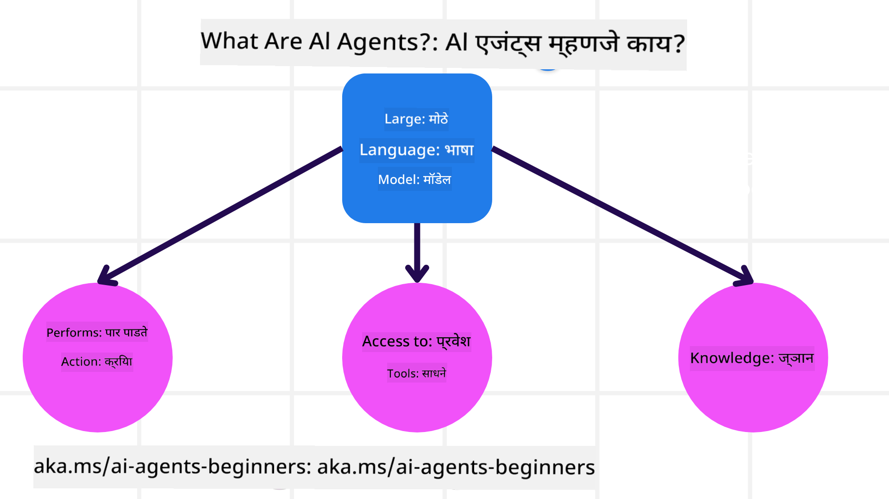
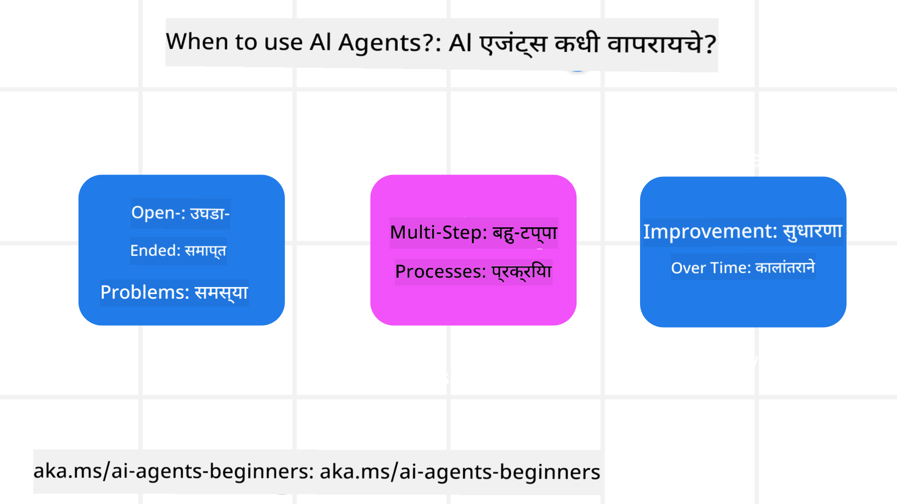

<!--
CO_OP_TRANSLATOR_METADATA:
{
  "original_hash": "d84943abc8f001ad4670418d32c2d899",
  "translation_date": "2025-07-12T08:04:29+00:00",
  "source_file": "01-intro-to-ai-agents/README.md",
  "language_code": "mr"
}
-->
इतर शिकणाऱ्यांशी आणि AI एजंट बिल्डर्सशी भेटण्यासाठी आणि या कोर्सबद्दल तुमचे कोणतेही प्रश्न विचारण्यासाठी सामील व्हा.

हा कोर्स सुरू करण्यासाठी, आपण प्रथम AI एजंट म्हणजे काय आणि आपण त्यांचा वापर आपल्या तयार केलेल्या अनुप्रयोगांमध्ये आणि कार्यप्रवाहांमध्ये कसा करू शकतो याचा अधिक चांगला आढावा घेऊ.

## परिचय

या धड्यात आपण पाहणार आहोत:

- AI एजंट म्हणजे काय आणि एजंटचे वेगवेगळे प्रकार कोणते आहेत?
- AI एजंटसाठी कोणते वापर प्रकरणे सर्वोत्तम आहेत आणि ते आपल्याला कसे मदत करू शकतात?
- एजंटिक सोल्यूशन्स डिझाइन करताना काही मूलभूत घटक कोणते असतात?

## शिकण्याचे उद्दिष्टे
हा धडा पूर्ण केल्यानंतर, तुम्ही सक्षम असाल:

- AI एजंट संकल्पना समजून घेणे आणि ते इतर AI सोल्यूशन्सपासून कसे वेगळे आहेत हे जाणून घेणे.
- AI एजंटचा सर्वात प्रभावीपणे वापर करणे.
- वापरकर्ते आणि ग्राहकांसाठी उत्पादकपणे एजंटिक सोल्यूशन्स डिझाइन करणे.

## AI एजंटची व्याख्या आणि AI एजंटचे प्रकार

### AI एजंट म्हणजे काय?

AI एजंट हे **सिस्टम** आहेत जे **लार्ज लँग्वेज मॉडेल्स (LLMs)** ला **क्रिया करण्यास** सक्षम करतात, त्यांची क्षमता वाढवून LLMs ला **टूल्स** आणि **ज्ञान** यांचा प्रवेश देतात.

चला या व्याख्येला लहान भागांमध्ये विभागूया:

- **सिस्टम** - एजंट्सना फक्त एक घटक म्हणून नव्हे तर अनेक घटकांच्या प्रणाली म्हणून पाहणे महत्त्वाचे आहे. मूलभूत स्तरावर, AI एजंटचे घटक आहेत:
  - **पर्यावरण** - तो निश्चित केलेला क्षेत्र जिथे AI एजंट कार्यरत असतो. उदाहरणार्थ, जर आपल्याकडे प्रवास बुकिंग AI एजंट असेल, तर पर्यावरण म्हणजे प्रवास बुकिंग सिस्टम ज्याचा AI एजंट कार्य पूर्ण करण्यासाठी वापर करतो.
  - **सेन्सर्स** - पर्यावरणात माहिती असते आणि प्रतिक्रिया दिली जाते. AI एजंट सेन्सर्सचा वापर करून पर्यावरणाच्या वर्तमान स्थितीबद्दल माहिती गोळा करतो आणि समजून घेतो. प्रवास बुकिंग एजंटच्या उदाहरणात, प्रवास बुकिंग सिस्टम हॉटेल उपलब्धता किंवा फ्लाइट किमती यासारखी माहिती देऊ शकते.
  - **ऍक्च्युएटर्स** - AI एजंट पर्यावरणाची वर्तमान स्थिती प्राप्त केल्यानंतर, तो सध्याच्या कार्यासाठी कोणती क्रिया करावी हे ठरवतो ज्यामुळे पर्यावरण बदलू शकते. प्रवास बुकिंग एजंटसाठी, वापरकर्त्यासाठी उपलब्ध खोली बुक करणे ही क्रिया असू शकते.

**लार्ज लँग्वेज मॉडेल्स** - एजंट्सची संकल्पना LLMs तयार होण्यापूर्वीही अस्तित्वात होती. LLMs सह AI एजंट तयार करण्याचा फायदा म्हणजे त्यांची मानवी भाषा आणि डेटा समजून घेण्याची क्षमता. ही क्षमता LLMs ला पर्यावरणीय माहिती समजून घेण्यास आणि पर्यावरण बदलण्यासाठी योजना तयार करण्यास सक्षम करते.

**क्रिया करणे** - AI एजंट सिस्टमच्या बाहेर, LLMs फक्त वापरकर्त्याच्या प्रॉम्प्टवर आधारित सामग्री किंवा माहिती तयार करण्यापुरते मर्यादित असतात. AI एजंट सिस्टममध्ये, LLMs वापरकर्त्याच्या विनंतीचे अर्थ लावून आणि पर्यावरणात उपलब्ध टूल्स वापरून कार्ये पूर्ण करू शकतात.

**टूल्सचा प्रवेश** - LLM ला कोणते टूल्स वापरता येतील हे 1) तो कार्यरत असलेल्या पर्यावरणावर आणि 2) AI एजंटच्या डेव्हलपरवर अवलंबून असते. आमच्या प्रवास एजंट उदाहरणात, एजंटचे टूल्स बुकिंग सिस्टममध्ये उपलब्ध ऑपरेशन्सने मर्यादित असतात, आणि/किंवा डेव्हलपर एजंटच्या टूल प्रवेशाला फ्लाइट्सपुरते मर्यादित करू शकतो.

**स्मृती+ज्ञान** - स्मृती संभाषणाच्या संदर्भात अल्पकालीन असू शकते. दीर्घकालीन, पर्यावरणाद्वारे दिलेल्या माहितीव्यतिरिक्त, AI एजंट इतर सिस्टम्स, सेवा, टूल्स आणि अगदी इतर एजंट्सकडूनही ज्ञान प्राप्त करू शकतात. प्रवास एजंट उदाहरणात, हे ज्ञान वापरकर्त्याच्या प्रवास प्राधान्यांची माहिती असू शकते जी ग्राहक डेटाबेसमध्ये साठवलेली आहे.

### एजंटचे वेगवेगळे प्रकार

आता आपल्याकडे AI एजंटची सामान्य व्याख्या आहे, तर काही विशिष्ट एजंट प्रकार पाहू आणि ते प्रवास बुकिंग AI एजंटमध्ये कसे लागू होऊ शकतात ते पाहू.

| **एजंट प्रकार**               | **वर्णन**                                                                                                                           | **उदाहरण**                                                                                                                                                                                                                   |
| ----------------------------- | ---------------------------------------------------------------------------------------------------------------------------------- | ----------------------------------------------------------------------------------------------------------------------------------------------------------------------------------------------------------------------------- |
| **सिंपल रिफ्लेक्स एजंट्स**    | पूर्वनिर्धारित नियमांवर आधारित त्वरित क्रिया करतात.                                                                                 | प्रवास एजंट ईमेलचा संदर्भ समजून घेऊन प्रवास तक्रारी ग्राहक सेवा विभागाकडे पाठवतो.                                                                                                                                          |
| **मॉडेल-आधारित रिफ्लेक्स एजंट्स** | जगाच्या मॉडेलवर आणि त्या मॉडेलमधील बदलांवर आधारित क्रिया करतात.                                                                   | प्रवास एजंट ऐतिहासिक किमतींच्या डेटावरून महत्त्वपूर्ण किंमत बदल असलेल्या मार्गांना प्राधान्य देतो.                                                                                                                           |
| **गोल-आधारित एजंट्स**         | विशिष्ट उद्दिष्टे साध्य करण्यासाठी योजना तयार करतात आणि त्या उद्दिष्टापर्यंत पोहोचण्यासाठी क्रिया ठरवतात.                              | प्रवास एजंट सध्याच्या ठिकाणाहून गंतव्यस्थानापर्यंत आवश्यक प्रवास व्यवस्था (कार, सार्वजनिक वाहतूक, फ्लाइट्स) ठरवून प्रवास बुक करतो.                                                                                              |
| **युटिलिटी-आधारित एजंट्स**    | प्राधान्ये विचारात घेऊन आणि संख्यात्मक तडजोड करून उद्दिष्टे साध्य करण्याचा निर्णय घेतात.                                            | प्रवास एजंट प्रवास बुक करताना सोयीस्करपणा आणि खर्च यांच्यातील तडजोड करून युटिलिटी जास्तीत जास्त करतो.                                                                                                                       |
| **लर्निंग एजंट्स**             | अभिप्रायावर प्रतिक्रिया देऊन आणि त्यानुसार क्रिया समायोजित करून वेळोवेळी सुधारणा करतात.                                            | प्रवास एजंट प्रवासानंतरच्या सर्व्हे अभिप्रायाचा वापर करून भविष्यातील बुकिंगमध्ये सुधारणा करतो.                                                                                                                               |
| **हायरेरकिकल एजंट्स**         | अनेक एजंट्स टियर प्रणालीमध्ये असतात, ज्यात उच्च-स्तरीय एजंट्स कार्ये उपकार्यांमध्ये विभागतात आणि खालच्या स्तरावरील एजंट्स ती पूर्ण करतात. | प्रवास एजंट प्रवास रद्द करताना कार्य उपकार्यांमध्ये विभागतो (उदा. विशिष्ट बुकिंग रद्द करणे) आणि खालच्या स्तरावरील एजंट्स त्यांना पूर्ण करतात, नंतर उच्च-स्तरीय एजंटला अहवाल देतात.                                            |
| **मल्टी-एजंट सिस्टम्स (MAS)**  | एजंट्स स्वतंत्रपणे कार्य पूर्ण करतात, सहकार्याने किंवा स्पर्धात्मकपणे.                                                               | सहकार्यात्मक: अनेक एजंट्स विशिष्ट प्रवास सेवा जसे की हॉटेल, फ्लाइट्स, आणि मनोरंजन बुक करतात. स्पर्धात्मक: अनेक एजंट्स एकत्रित हॉटेल बुकिंग कॅलेंडरवर ग्राहकांसाठी जागा मिळवण्यासाठी स्पर्धा करतात.                              |

## AI एजंट कधी वापरायचे

पूर्वीच्या विभागात, आपण प्रवास एजंट वापर प्रकरण वापरून वेगवेगळ्या प्रकारच्या एजंट्सना प्रवास बुकिंगच्या वेगवेगळ्या परिस्थितींमध्ये कसे वापरायचे ते समजावले. आपण हा अनुप्रयोग संपूर्ण कोर्समध्ये वापरत राहू.

चला पाहूया AI एजंटसाठी सर्वोत्तम वापर प्रकरणे कोणती आहेत:

- **मोकळे प्रश्न** - LLM ला कार्य पूर्ण करण्यासाठी आवश्यक पावले ठरवण्याची मुभा देणे कारण ती नेहमी वर्कफ्लोमध्ये हार्डकोड केली जाऊ शकत नाहीत.
- **अनेक टप्प्यांचे प्रक्रिया** - अशा कार्यांसाठी ज्यात AI एजंटला अनेक टप्प्यांत टूल्स किंवा माहिती वापरावी लागते, एकदाच माहिती मिळवण्याऐवजी.
- **वेळोवेळी सुधारणा** - अशा कार्यांसाठी जिथे एजंट पर्यावरण किंवा वापरकर्त्यांकडून अभिप्राय घेऊन वेळोवेळी सुधारणा करू शकतो आणि अधिक चांगली सेवा देऊ शकतो.

AI एजंट वापरण्याच्या अधिक विचारसरणीबद्दल आपण "Building Trustworthy AI Agents" धड्यात चर्चा करू.

## एजंटिक सोल्यूशन्सची मूलतत्त्वे

### एजंट विकास

AI एजंट सिस्टम डिझाइन करण्याचा पहिला टप्पा म्हणजे टूल्स, क्रिया आणि वर्तन निश्चित करणे. या कोर्समध्ये, आपण **Azure AI Agent Service** वापरून एजंट्स परिभाषित करण्यावर लक्ष केंद्रित करतो. यात खालील वैशिष्ट्ये आहेत:

- OpenAI, Mistral, आणि Llama सारख्या Open Models ची निवड
- Tripadvisor सारख्या प्रदात्यांद्वारे परवानाधारित डेटा वापर
- OpenAPI 3.0 टूल्सचा मानकीकृत वापर

### एजंटिक पॅटर्न्स

LLMs सोबत संवाद प्रॉम्प्ट्सद्वारे होतो. AI एजंट्सच्या अर्ध-स्वायत्त स्वरूपामुळे, पर्यावरणात बदल झाल्यानंतर LLM ला मॅन्युअली पुन्हा प्रॉम्प्ट करणे नेहमी शक्य किंवा आवश्यक नसते. आपण **एजंटिक पॅटर्न्स** वापरतो जे LLM ला अनेक टप्प्यांत अधिक प्रमाणात प्रॉम्प्ट करण्यास परवानगी देतात.

हा कोर्स सध्याच्या लोकप्रिय एजंटिक पॅटर्न्समध्ये विभागलेला आहे.

### एजंटिक फ्रेमवर्क्स

एजंटिक फ्रेमवर्क्स डेव्हलपरना कोडद्वारे एजंटिक पॅटर्न्स अंमलात आणण्याची परवानगी देतात. हे फ्रेमवर्क्स टेम्पलेट्स, प्लगइन्स, आणि टूल्स प्रदान करतात ज्यामुळे AI एजंट्सच्या सहकार्याची क्षमता वाढते. यामुळे AI एजंट सिस्टम्सचे निरीक्षण आणि समस्या निवारण अधिक सुलभ होते.

या कोर्समध्ये, आपण संशोधन-आधारित AutoGen फ्रेमवर्क आणि उत्पादनासाठी तयार Semantic Kernel चा Agent फ्रेमवर्क यांचा अभ्यास करू.

## मागील धडा

[Course Setup](../00-course-setup/README.md)

## पुढील धडा

[Exploring Agentic Frameworks](../02-explore-agentic-frameworks/README.md)

**अस्वीकरण**:  
हा दस्तऐवज AI अनुवाद सेवा [Co-op Translator](https://github.com/Azure/co-op-translator) वापरून अनुवादित केला आहे. आम्ही अचूकतेसाठी प्रयत्नशील असलो तरी, कृपया लक्षात घ्या की स्वयंचलित अनुवादांमध्ये चुका किंवा अचूकतेची कमतरता असू शकते. मूळ दस्तऐवज त्याच्या स्थानिक भाषेत अधिकृत स्रोत मानला जावा. महत्त्वाच्या माहितीसाठी व्यावसायिक मानवी अनुवाद करण्याची शिफारस केली जाते. या अनुवादाच्या वापरामुळे उद्भवणाऱ्या कोणत्याही गैरसमजुती किंवा चुकीच्या अर्थलागी आम्ही जबाबदार नाही.