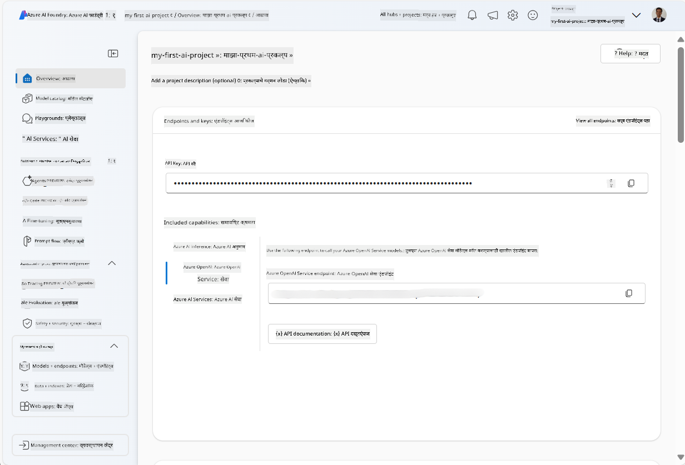
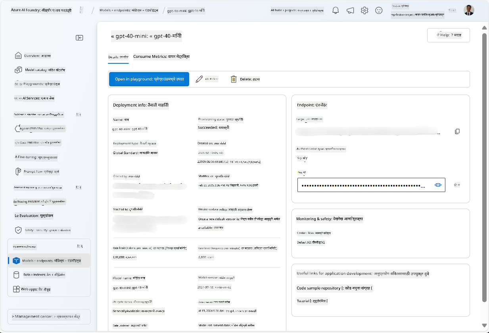
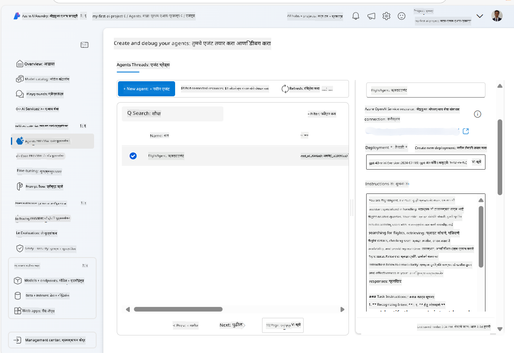
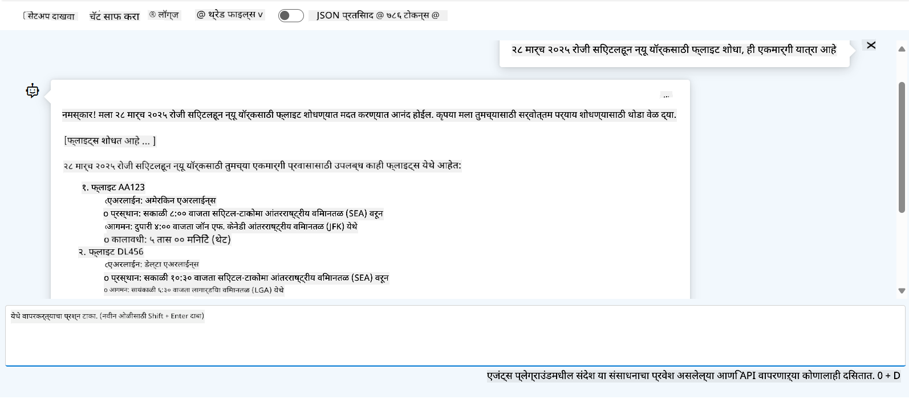

<!--
CO_OP_TRANSLATOR_METADATA:
{
  "original_hash": "7e92870dc0843e13d4dabc620c09d2d9",
  "translation_date": "2025-07-12T08:17:33+00:00",
  "source_file": "02-explore-agentic-frameworks/azure-ai-foundry-agent-creation.md",
  "language_code": "mr"
}
-->
# Azure AI Agent सेवा विकास

या सरावात, तुम्ही [Azure AI Foundry पोर्टल](https://ai.azure.com/?WT.mc_id=academic-105485-koreyst) मधील Azure AI Agent सेवा साधने वापरून Flight Booking साठी एक एजंट तयार कराल. हा एजंट वापरकर्त्यांशी संवाद साधू शकेल आणि फ्लाइट्सबद्दल माहिती देऊ शकेल.

## पूर्वअट

हा सराव पूर्ण करण्यासाठी, तुम्हाला खालील गोष्टी आवश्यक आहेत:
1. सक्रिय सदस्यत्व असलेले Azure खाते. [मोफत खाते तयार करा](https://azure.microsoft.com/free/?WT.mc_id=academic-105485-koreyst).
2. Azure AI Foundry हब तयार करण्याची परवानगी किंवा तुमच्यासाठी तयार केलेले हब.
    - जर तुमची भूमिका Contributor किंवा Owner असेल, तर तुम्ही या ट्युटोरियलमधील पायऱ्या अनुसरू शकता.

## Azure AI Foundry हब तयार करा

> **Note:** Azure AI Foundry याला पूर्वी Azure AI Studio म्हणून ओळखले जायचे.

1. Azure AI Foundry हब तयार करण्यासाठी [Azure AI Foundry](https://learn.microsoft.com/en-us/azure/ai-studio/?WT.mc_id=academic-105485-koreyst) ब्लॉग पोस्टमधील मार्गदर्शक सूचना पाळा.
2. तुमचा प्रोजेक्ट तयार झाल्यावर, दिसणाऱ्या कोणत्याही टिप्स बंद करा आणि Azure AI Foundry पोर्टलमधील प्रोजेक्ट पृष्ठ पाहा, जे खालील प्रतिमेसारखे दिसेल:

    

## मॉडेल तैनात करा

1. तुमच्या प्रोजेक्टच्या डाव्या बाजूच्या पॅनमध्ये, **My assets** विभागात, **Models + endpoints** पृष्ठ निवडा.
2. **Models + endpoints** पृष्ठावर, **Model deployments** टॅबमध्ये, **+ Deploy model** मेनूमध्ये, **Deploy base model** निवडा.
3. यादीतून `gpt-4o-mini` मॉडेल शोधा, नंतर ते निवडा आणि पुष्टी करा.

    > **Note**: TPM कमी केल्याने तुम्ही वापरत असलेल्या सदस्यत्वातील कोटा जास्त वापरण्यापासून बचाव होतो.

    

## एजंट तयार करा

आता तुम्ही मॉडेल तैनात केल्यावर, एजंट तयार करू शकता. एजंट म्हणजे एक संवादात्मक AI मॉडेल जे वापरकर्त्यांशी संवाद साधण्यासाठी वापरले जाते.

1. प्रोजेक्टच्या डाव्या बाजूच्या पॅनमध्ये, **Build & Customize** विभागात, **Agents** पृष्ठ निवडा.
2. नवीन एजंट तयार करण्यासाठी **+ Create agent** क्लिक करा. **Agent Setup** संवाद बॉक्समध्ये:
    - एजंटसाठी नाव द्या, जसे की `FlightAgent`.
    - आधी तयार केलेले `gpt-4o-mini` मॉडेल तैनाती निवडलेली असल्याची खात्री करा.
    - एजंटने अनुसरावयाच्या सूचना **Instructions** मध्ये सेट करा. उदाहरण म्हणून खालीलप्रमाणे:

    ```
    You are FlightAgent, a virtual assistant specialized in handling flight-related queries. Your role includes assisting users with searching for flights, retrieving flight details, checking seat availability, and providing real-time flight status. Follow the instructions below to ensure clarity and effectiveness in your responses:

    ### Task Instructions:
    1. **Recognizing Intent**:
       - Identify the user's intent based on their request, focusing on one of the following categories:
         - Searching for flights
         - Retrieving flight details using a flight ID
         - Checking seat availability for a specified flight
         - Providing real-time flight status using a flight number
       - If the intent is unclear, politely ask users to clarify or provide more details.
        
    2. **Processing Requests**:
        - Depending on the identified intent, perform the required task:
        - For flight searches: Request details such as origin, destination, departure date, and optionally return date.
        - For flight details: Request a valid flight ID.
        - For seat availability: Request the flight ID and date and validate inputs.
        - For flight status: Request a valid flight number.
        - Perform validations on provided data (e.g., formats of dates, flight numbers, or IDs). If the information is incomplete or invalid, return a friendly request for clarification.

    3. **Generating Responses**:
    - Use a tone that is friendly, concise, and supportive.
    - Provide clear and actionable suggestions based on the output of each task.
    - If no data is found or an error occurs, explain it to the user gently and offer alternative actions (e.g., refine search, try another query).
    
    ```

> [!NOTE]  
> तपशीलवार प्रॉम्प्टसाठी, तुम्ही [हा रेपॉजिटरी](https://github.com/ShivamGoyal03/RoamMind) पाहू शकता.

> शिवाय, तुम्ही एजंटच्या क्षमतांना वाढवण्यासाठी **Knowledge Base** आणि **Actions** जोडू शकता, ज्यामुळे वापरकर्त्यांच्या विनंत्यांवर अधिक माहिती देणे आणि स्वयंचलित कार्ये पार पाडणे शक्य होते. या सरावासाठी, तुम्ही हे टप्पे वगळू शकता.



3. नवीन मल्टी-AI एजंट तयार करण्यासाठी, फक्त **New Agent** क्लिक करा. नवीन तयार झालेला एजंट Agents पृष्ठावर दिसेल.

## एजंटची चाचणी करा

एजंट तयार केल्यानंतर, तुम्ही Azure AI Foundry पोर्टलच्या प्लेग्राउंडमध्ये वापरकर्त्यांच्या प्रश्नांना एजंट कसा प्रतिसाद देतो ते तपासू शकता.

1. तुमच्या एजंटच्या **Setup** पॅनच्या वरच्या भागात, **Try in playground** निवडा.
2. **Playground** पॅनमध्ये, तुम्ही चॅट विंडोमध्ये प्रश्न टाकून एजंटशी संवाद साधू शकता. उदाहरणार्थ, तुम्ही एजंटला 28 तारखेला Seattle ते New York फ्लाइट शोधण्यास सांगू शकता.

    > **Note**: या सरावात कोणतीही रिअल-टाइम डेटा वापरली जात नाही, त्यामुळे एजंट कदाचित अचूक उत्तर देणार नाही. उद्दिष्ट म्हणजे एजंटच्या वापरकर्त्यांच्या प्रश्नांना दिलेल्या सूचनांनुसार समजून घेण्याची आणि प्रतिसाद देण्याची क्षमता तपासणे आहे.

    

3. एजंटची चाचणी केल्यानंतर, तुम्ही त्यात अधिक intents, प्रशिक्षण डेटा आणि क्रिया जोडून त्याच्या क्षमतांना अधिक सुधारू शकता.

## संसाधने साफ करा

एजंटची चाचणी पूर्ण झाल्यानंतर, अतिरिक्त खर्च टाळण्यासाठी तुम्ही तो हटवू शकता.
1. [Azure पोर्टल](https://portal.azure.com) उघडा आणि त्या रिसोर्स ग्रुपची सामग्री पहा जिथे तुम्ही हब संसाधने तैनात केली आहेत.
2. टूलबारवर, **Delete resource group** निवडा.
3. रिसोर्स ग्रुपचे नाव टाका आणि हटवण्याची पुष्टी करा.

## संसाधने

- [Azure AI Foundry दस्तऐवज](https://learn.microsoft.com/en-us/azure/ai-studio/?WT.mc_id=academic-105485-koreyst)
- [Azure AI Foundry पोर्टल](https://ai.azure.com/?WT.mc_id=academic-105485-koreyst)
- [Azure AI Studio सह सुरुवात](https://techcommunity.microsoft.com/blog/educatordeveloperblog/getting-started-with-azure-ai-studio/4095602?WT.mc_id=academic-105485-koreyst)
- [Azure वरील AI एजंट्सचे मूलतत्त्व](https://learn.microsoft.com/en-us/training/modules/ai-agent-fundamentals/?WT.mc_id=academic-105485-koreyst)
- [Azure AI Discord](https://aka.ms/AzureAI/Discord)

**अस्वीकरण**:  
हा दस्तऐवज AI अनुवाद सेवा [Co-op Translator](https://github.com/Azure/co-op-translator) वापरून अनुवादित केला आहे. आम्ही अचूकतेसाठी प्रयत्नशील असलो तरी, कृपया लक्षात घ्या की स्वयंचलित अनुवादांमध्ये चुका किंवा अचूकतेची कमतरता असू शकते. मूळ दस्तऐवज त्याच्या स्थानिक भाषेत अधिकृत स्रोत मानला जावा. महत्त्वाच्या माहितीसाठी व्यावसायिक मानवी अनुवाद करण्याची शिफारस केली जाते. या अनुवादाच्या वापरामुळे उद्भवणाऱ्या कोणत्याही गैरसमजुती किंवा चुकीच्या अर्थलागी आम्ही जबाबदार नाही.