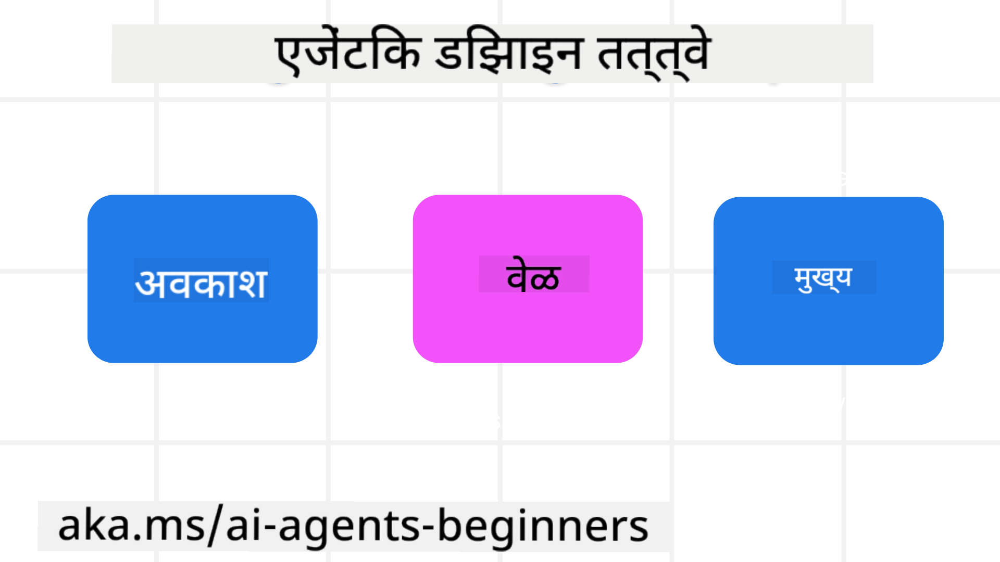

<!--
CO_OP_TRANSLATOR_METADATA:
{
  "original_hash": "4c46e4ff9e349c521e2b0b17f51afa64",
  "translation_date": "2025-08-29T10:09:23+00:00",
  "source_file": "03-agentic-design-patterns/README.md",
  "language_code": "mr"
}
-->

> _(वरील प्रतिमेवर क्लिक करून या धड्याचा व्हिडिओ पहा)_
# AI एजंटिक डिझाइन तत्त्वे

## परिचय

AI एजंटिक सिस्टम्स तयार करण्याच्या अनेक पद्धती आहेत. जनरेटिव्ह AI डिझाइनमध्ये अस्पष्टता ही एक वैशिष्ट्य आहे, दोष नाही, त्यामुळे अभियंत्यांना सुरुवात कुठून करावी हे कधीकधी समजणे कठीण जाते. आम्ही विकसकांना त्यांच्या व्यवसायाच्या गरजा पूर्ण करण्यासाठी ग्राहक-केंद्रित एजंटिक सिस्टम्स तयार करण्यासाठी सक्षम करण्यासाठी मानव-केंद्रित UX डिझाइन तत्त्वांचा संच तयार केला आहे. ही डिझाइन तत्त्वे एक ठराविक आर्किटेक्चर नाहीत, तर एजंट अनुभव परिभाषित आणि तयार करणाऱ्या संघांसाठी एक प्रारंभिक बिंदू आहेत.

सामान्यतः, एजंटने हे करावे:

- मानवी क्षमता विस्तृत करणे आणि त्याचा विस्तार करणे (मंथन, समस्या सोडवणे, स्वयंचलितता इ.)
- ज्ञानातील अंतर भरून काढणे (मला ज्ञान क्षेत्रांबद्दल माहिती द्या, भाषांतर इ.)
- आम्ही व्यक्ती म्हणून इतरांसोबत काम करण्यास प्राधान्य देतो अशा प्रकारे सहकार्य सुलभ करणे आणि समर्थन करणे
- आपल्याला स्वतःची चांगली आवृत्ती बनवणे (उदा., जीवन प्रशिक्षक/कार्य मास्टर, आपल्याला भावनिक नियमन आणि मनःशांती कौशल्ये शिकण्यास मदत करणे, लवचिकता निर्माण करणे इ.)

## या धड्यात आपण शिकणार आहोत

- एजंटिक डिझाइन तत्त्वे काय आहेत
- ही डिझाइन तत्त्वे अंमलात आणताना कोणत्या मार्गदर्शक तत्त्वांचे पालन करावे
- डिझाइन तत्त्वांचा वापर करण्याची काही उदाहरणे काय आहेत

## शिकण्याची उद्दिष्टे

हा धडा पूर्ण केल्यानंतर, तुम्ही हे करू शकाल:

1. एजंटिक डिझाइन तत्त्वे काय आहेत हे स्पष्ट करा
2. एजंटिक डिझाइन तत्त्वांचा वापर करण्यासाठी मार्गदर्शक तत्त्वे स्पष्ट करा
3. एजंटिक डिझाइन तत्त्वांचा वापर करून एजंट कसा तयार करायचा हे समजून घ्या

## एजंटिक डिझाइन तत्त्वे

### एजंट (स्पेस)

हे एजंट कार्यरत असलेले वातावरण आहे. ही तत्त्वे भौतिक आणि डिजिटल जगात गुंतण्यासाठी एजंट डिझाइन कसे करावे याबद्दल माहिती देतात.

- **जोडणे, न तोडणे** – लोकांना इतर लोक, घटना आणि कृतीक्षम ज्ञानाशी जोडण्यात मदत करा जेणेकरून सहकार्य आणि कनेक्शन सक्षम होईल.
  - एजंट लोक, घटना आणि ज्ञान यांना जोडण्यात मदत करतात.
  - एजंट लोकांना जवळ आणतात. ते लोकांना बदलण्यासाठी किंवा कमी लेखण्यासाठी डिझाइन केलेले नाहीत.
- **सुलभ प्रवेशयोग्यता परंतु कधीकधी अदृश्यता** – एजंट प्रामुख्याने पार्श्वभूमीत कार्य करतो आणि केवळ ते संबंधित आणि योग्य असल्यावर आपल्याला सूचित करतो.
  - एजंट अधिकृत वापरकर्त्यांसाठी कोणत्याही डिव्हाइस किंवा प्लॅटफॉर्मवर सहज शोधण्यायोग्य आणि प्रवेशयोग्य आहे.
  - एजंट मल्टीमोडल इनपुट्स आणि आउटपुट्सला समर्थन देतो (आवाज, मजकूर, इ.).
  - एजंट वापरकर्त्याच्या गरजांची जाणीव करून पार्श्वभूमी आणि अग्रभाग, सक्रिय आणि प्रतिक्रियाशील यामध्ये सहज संक्रमण करू शकतो.
  - एजंट अदृश्य स्वरूपात कार्य करू शकतो, तरीही त्याचा पार्श्वभूमी प्रक्रिया मार्ग आणि इतर एजंट्ससोबतचा सहयोग वापरकर्त्यासाठी पारदर्शक आणि नियंत्रित करण्यायोग्य आहे.

### एजंट (वेळ)

हे एजंट वेळोवेळी कसे कार्य करते. ही तत्त्वे भूतकाळ, वर्तमान आणि भविष्याशी संवाद साधणारे एजंट डिझाइन कसे करावे याबद्दल माहिती देतात.

- **भूतकाळ**: राज्य आणि संदर्भ यांचा समावेश असलेल्या इतिहासावर विचार करणे.
  - एजंट केवळ घटना, लोक किंवा राज्यांव्यतिरिक्त समृद्ध ऐतिहासिक डेटाच्या विश्लेषणावर आधारित अधिक संबंधित परिणाम प्रदान करतो.
  - एजंट भूतकाळातील घटनांमधून कनेक्शन तयार करतो आणि वर्तमान परिस्थितीशी संवाद साधण्यासाठी सक्रियपणे स्मृतीवर विचार करतो.
- **आता**: सूचित करण्यापेक्षा सूचित करणे.
  - एजंट लोकांशी संवाद साधण्यासाठी सर्वसमावेशक दृष्टिकोन स्वीकारतो. जेव्हा एखादी घटना घडते, तेव्हा एजंट स्थिर सूचना किंवा इतर स्थिर औपचारिकतेच्या पलीकडे जातो. एजंट प्रवाह सुलभ करू शकतो किंवा वापरकर्त्याचे लक्ष योग्य क्षणी निर्देशित करण्यासाठी गतिशीलपणे संकेत तयार करू शकतो.
  - एजंट संदर्भात्मक वातावरण, सामाजिक आणि सांस्कृतिक बदलांवर आधारित आणि वापरकर्त्याच्या हेतूशी जुळवून घेत माहिती वितरीत करतो.
  - एजंट परस्परसंवाद हळूहळू, दीर्घकालीन वापरकर्त्यांना सक्षम करण्यासाठी विकसित/वाढत असतो.
- **भविष्य**: जुळवून घेणे आणि विकसित होणे.
  - एजंट विविध उपकरणे, प्लॅटफॉर्म आणि पद्धतींशी जुळवून घेतो.
  - एजंट वापरकर्त्याच्या वर्तनाशी, प्रवेशयोग्यता गरजांशी जुळवून घेतो आणि मुक्तपणे सानुकूल करण्यायोग्य आहे.
  - एजंट सततच्या वापरकर्त्याच्या परस्परसंवादाद्वारे आकार घेतो आणि विकसित होतो.

### एजंट (कोर)

हे एजंटच्या डिझाइनच्या मुख्य घटकांतील प्रमुख घटक आहेत.

- **अस्पष्टतेला स्वीकारा पण विश्वास प्रस्थापित करा**.
  - एजंट अस्पष्टतेची एक विशिष्ट पातळी अपेक्षित आहे. अस्पष्टता ही एजंट डिझाइनची एक प्रमुख बाब आहे.
  - विश्वास आणि पारदर्शकता ही एजंट डिझाइनची मूलभूत स्तर आहेत.
  - एजंट कधी चालू/बंद आहे यावर नियंत्रण ठेवण्याचा अधिकार मानवांकडे आहे आणि एजंटची स्थिती नेहमी स्पष्टपणे दृश्यमान आहे.

## ही तत्त्वे अंमलात आणण्यासाठी मार्गदर्शक तत्त्वे

वरील डिझाइन तत्त्वांचा वापर करताना, खालील मार्गदर्शक तत्त्वांचा वापर करा:

1. **पारदर्शकता**: वापरकर्त्याला कळवा की AI समाविष्ट आहे, ते कसे कार्य करते (भूतकाळातील क्रिया समाविष्ट करून) आणि अभिप्राय कसा द्यायचा आणि प्रणाली कशी सुधारायची.
2. **नियंत्रण**: वापरकर्त्याला सानुकूलित करण्यास, प्राधान्ये निर्दिष्ट करण्यास आणि प्रणाली आणि तिच्या गुणधर्मांवर नियंत्रण ठेवण्यास सक्षम करा (भूतकाळातील माहिती विसरण्याची क्षमता समाविष्ट आहे).
3. **सुसंगतता**: उपकरणे आणि टोकांवर सुसंगत, मल्टी-मोडल अनुभवांचे लक्ष्य ठेवा. शक्य असल्यास परिचित UI/UX घटकांचा वापर करा (उदा., व्हॉइस इंटरॅक्शनसाठी मायक्रोफोन चिन्ह) आणि ग्राहकाचा संज्ञानात्मक भार शक्य तितका कमी करा (उदा., संक्षिप्त प्रतिसाद, व्हिज्युअल एड्स आणि 'अधिक जाणून घ्या' सामग्रीचे लक्ष्य ठेवा).

## या तत्त्वे आणि मार्गदर्शक तत्त्वांचा वापर करून ट्रॅव्हल एजंट कसा डिझाइन करायचा

कल्पना करा की तुम्ही ट्रॅव्हल एजंट डिझाइन करत आहात, येथे तुम्ही डिझाइन तत्त्वे आणि मार्गदर्शक तत्त्वांचा वापर कसा करू शकता याचा विचार करू शकता:

1. **पारदर्शकता** – वापरकर्त्याला कळवा की ट्रॅव्हल एजंट हा AI-सक्षम एजंट आहे. प्रारंभ कसा करायचा याबद्दल काही मूलभूत सूचना प्रदान करा (उदा., "हॅलो" संदेश, नमुना प्रॉम्प्ट). हे उत्पादन पृष्ठावर स्पष्टपणे दस्तऐवजीकरण करा. वापरकर्त्याने भूतकाळात विचारलेल्या प्रॉम्प्टची यादी दर्शवा. अभिप्राय कसा द्यायचा हे स्पष्ट करा (थंब्स अप आणि डाउन, अभिप्राय पाठवा बटण, इ.). एजंटला वापर किंवा विषय निर्बंध असल्यास स्पष्टपणे सांगा.
2. **नियंत्रण** – एजंट तयार झाल्यानंतर ते कसे सुधारायचे हे वापरकर्त्याला स्पष्ट करा, जसे की सिस्टम प्रॉम्प्टसह. एजंट किती विस्तृत आहे, त्याची लेखन शैली आणि एजंटने कोणत्या गोष्टींबद्दल बोलू नये याबद्दल कोणतीही अटी निवडण्यास वापरकर्त्याला सक्षम करा. संबंधित फाइल्स किंवा डेटा, प्रॉम्प्ट आणि भूतकाळातील संभाषणे पाहण्याची आणि हटवण्याची परवानगी द्या.
3. **सुसंगतता** – प्रॉम्प्ट शेअर करा, फाइल किंवा फोटो जोडा आणि कोणाला किंवा कशाला टॅग करा यासाठी चिन्हे मानक आणि ओळखण्यायोग्य आहेत याची खात्री करा. एजंटसह फाइल अपलोड/शेअरिंग दर्शविण्यासाठी पेपरक्लिप चिन्ह आणि ग्राफिक्स अपलोड दर्शविण्यासाठी प्रतिमा चिन्ह वापरा.

### AI एजंटिक डिझाइन पॅटर्नबद्दल अधिक प्रश्न आहेत का?

[Azure AI Foundry Discord](https://aka.ms/ai-agents/discord) मध्ये सामील व्हा, इतर शिकणाऱ्यांशी भेटा, ऑफिस तासांमध्ये सहभागी व्हा आणि तुमचे AI एजंट्स संबंधित प्रश्न विचारून उत्तर मिळवा.

## अतिरिक्त संसाधने

## मागील धडा

[एजंटिक फ्रेमवर्क्सचा अभ्यास](../02-explore-agentic-frameworks/README.md)

## पुढील धडा

[टूल युज डिझाइन पॅटर्न](../04-tool-use/README.md)

---

**अस्वीकरण**:  
हा दस्तऐवज AI भाषांतर सेवा [Co-op Translator](https://github.com/Azure/co-op-translator) चा वापर करून भाषांतरित करण्यात आला आहे. आम्ही अचूकतेसाठी प्रयत्नशील असलो तरी, कृपया लक्षात घ्या की स्वयंचलित भाषांतरांमध्ये त्रुटी किंवा अचूकतेचा अभाव असू शकतो. मूळ भाषेतील मूळ दस्तऐवज हा अधिकृत स्रोत मानला जावा. महत्त्वाच्या माहितीसाठी व्यावसायिक मानवी भाषांतराची शिफारस केली जाते. या भाषांतराचा वापर केल्यामुळे उद्भवणाऱ्या कोणत्याही गैरसमज किंवा चुकीच्या अर्थासाठी आम्ही जबाबदार राहणार नाही.