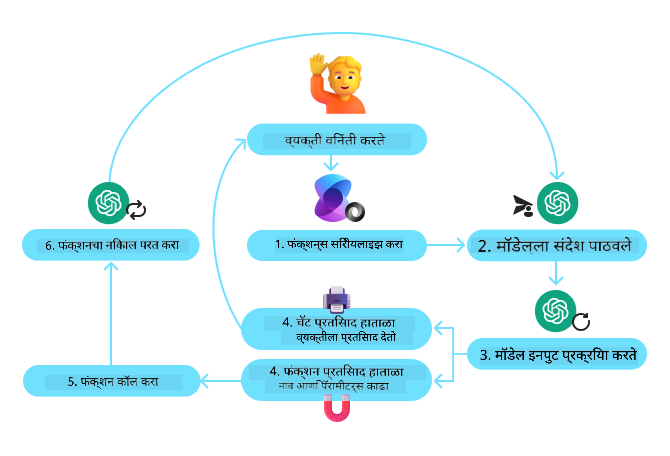
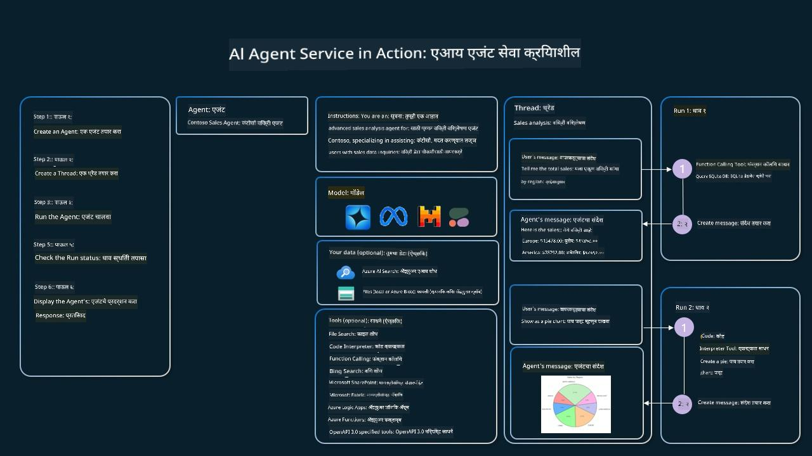

<!--
CO_OP_TRANSLATOR_METADATA:
{
  "original_hash": "88258b03f2893aa2e69eb8fb24baabbc",
  "translation_date": "2025-07-12T09:29:37+00:00",
  "source_file": "04-tool-use/README.md",
  "language_code": "mr"
}
-->
[](https://youtu.be/vieRiPRx-gI?si=cEZ8ApnT6Sus9rhn)

> _(वरील प्रतिमा क्लिक करून या धड्याचा व्हिडिओ पाहा)_

# टूल वापर डिझाइन पॅटर्न

टूल्स मनोरंजक आहेत कारण ते AI एजंट्सना अधिक विस्तृत क्षमता देतात. एजंटकडे केवळ काही मर्यादित क्रिया करण्याची क्षमता असण्याऐवजी, टूल जोडल्याने एजंट आता अनेक प्रकारच्या क्रिया करू शकतो. या प्रकरणात, आपण टूल वापर डिझाइन पॅटर्न पाहणार आहोत, जो AI एजंट्सना विशिष्ट टूल्स वापरून त्यांचे उद्दिष्ट साध्य करण्याचा मार्ग दाखवतो.

## परिचय

या धड्यात आपण खालील प्रश्नांची उत्तरे शोधणार आहोत:

- टूल वापर डिझाइन पॅटर्न म्हणजे काय?
- कोणत्या वापराच्या प्रकरणांमध्ये ते लागू होऊ शकते?
- डिझाइन पॅटर्न अंमलात आणण्यासाठी कोणते घटक/बिल्डिंग ब्लॉक्स आवश्यक आहेत?
- विश्वासार्ह AI एजंट तयार करण्यासाठी टूल वापर डिझाइन पॅटर्न वापरताना कोणत्या विशेष बाबी लक्षात घ्याव्यात?

## शिकण्याचे उद्दिष्ट

हा धडा पूर्ण केल्यानंतर, तुम्ही सक्षम असाल:

- टूल वापर डिझाइन पॅटर्न आणि त्याचा उद्देश समजावून सांगू शकणे.
- ज्या वापराच्या प्रकरणांमध्ये टूल वापर डिझाइन पॅटर्न लागू होतो ते ओळखणे.
- डिझाइन पॅटर्न अंमलात आणण्यासाठी आवश्यक मुख्य घटक समजून घेणे.
- या डिझाइन पॅटर्नचा वापर करून AI एजंट्समध्ये विश्वासार्हता सुनिश्चित करण्यासाठी आवश्यक बाबी ओळखणे.

## टूल वापर डिझाइन पॅटर्न म्हणजे काय?

**टूल वापर डिझाइन पॅटर्न** LLMs (Large Language Models) ना बाह्य टूल्सशी संवाद साधण्याची क्षमता देण्यावर लक्ष केंद्रित करतो, ज्यामुळे ते विशिष्ट उद्दिष्टे साध्य करू शकतात. टूल म्हणजे कोडचा तो भाग जो एजंटद्वारे क्रिया करण्यासाठी चालवला जाऊ शकतो. टूल एक सोपी फंक्शन असू शकते जसे कॅल्क्युलेटर, किंवा तृतीय-पक्ष सेवा जसे स्टॉक किंमत शोधणे किंवा हवामान अंदाजासाठी API कॉल. AI एजंटच्या संदर्भात, टूल्स एजंटद्वारे **मॉडेल-निर्मित फंक्शन कॉल्स** च्या प्रतिसादात चालविण्यासाठी डिझाइन केलेले असतात.

## कोणत्या वापराच्या प्रकरणांमध्ये ते लागू होऊ शकते?

AI एजंट्स टूल्सचा वापर करून गुंतागुंतीची कामे पूर्ण करू शकतात, माहिती मिळवू शकतात किंवा निर्णय घेऊ शकतात. टूल वापर डिझाइन पॅटर्न बहुधा अशा परिस्थितींमध्ये वापरला जातो जिथे बाह्य प्रणालींसोबत गतिशील संवाद आवश्यक असतो, जसे डेटाबेस, वेब सेवा किंवा कोड इंटरप्रेटर्स. ही क्षमता खालील विविध वापराच्या प्रकरणांसाठी उपयुक्त आहे:

- **गतिशील माहिती मिळवणे:** एजंट्स बाह्य API किंवा डेटाबेसवरून अद्ययावत डेटा मिळवू शकतात (उदा. SQLite डेटाबेसमध्ये क्वेरी करणे, स्टॉक किंमती किंवा हवामान माहिती मिळवणे).
- **कोड अंमलबजावणी आणि व्याख्या:** एजंट्स गणिती समस्या सोडवण्यासाठी, अहवाल तयार करण्यासाठी किंवा सिम्युलेशन्स करण्यासाठी कोड किंवा स्क्रिप्ट्स चालवू शकतात.
- **वर्कफ्लो ऑटोमेशन:** टास्क शेड्युलर्स, ईमेल सेवा किंवा डेटा पाईपलाईन्स सारख्या टूल्स एकत्र करून पुनरावृत्ती होणाऱ्या किंवा बहु-टप्प्यांच्या वर्कफ्लोचे स्वयंचलीतकरण.
- **ग्राहक समर्थन:** एजंट्स CRM प्रणाली, तिकीट व्यवस्थापन प्लॅटफॉर्म किंवा ज्ञानाधारांशी संवाद साधून वापरकर्त्यांच्या प्रश्नांची उत्तरे देऊ शकतात.
- **सामग्री निर्मिती आणि संपादन:** एजंट्स व्याकरण तपासणी, मजकूर संक्षेपण किंवा सामग्री सुरक्षितता मूल्यांकन करणारे टूल्स वापरून सामग्री निर्मितीत मदत करू शकतात.

## टूल वापर डिझाइन पॅटर्न अंमलात आणण्यासाठी कोणते घटक/बिल्डिंग ब्लॉक्स आवश्यक आहेत?

हे बिल्डिंग ब्लॉक्स AI एजंटला विविध कामे करण्यास सक्षम करतात. टूल वापर डिझाइन पॅटर्न अंमलात आणण्यासाठी आवश्यक मुख्य घटक पाहूया:

- **फंक्शन/टूल स्कीमाज:** उपलब्ध टूल्सची सविस्तर व्याख्या, ज्यात फंक्शनचे नाव, उद्देश, आवश्यक पॅरामीटर्स आणि अपेक्षित आउटपुट्स यांचा समावेश असतो. या स्कीमांमुळे LLM ला कोणते टूल्स उपलब्ध आहेत आणि वैध विनंत्या कशा तयार करायच्या हे समजते.

- **फंक्शन अंमलबजावणी लॉजिक:** वापरकर्त्याच्या हेतू आणि संभाषणाच्या संदर्भानुसार टूल्स कधी आणि कसे वापरायचे हे ठरवते. यात प्लॅनर मॉड्यूल्स, राउटिंग यंत्रणा किंवा सशर्त प्रवाह असू शकतात जे टूल वापर गतिशीलपणे ठरवतात.

- **मेसेज हँडलिंग सिस्टम:** वापरकर्ता इनपुट, LLM प्रतिसाद, टूल कॉल्स आणि टूल आउटपुट यांच्यातील संभाषण प्रवाह व्यवस्थापित करणारे घटक.

- **टूल इंटिग्रेशन फ्रेमवर्क:** एजंटला विविध टूल्सशी जोडणारे पायाभूत सुविधा, ज्या सोप्या फंक्शन्स असोत किंवा जटिल बाह्य सेवा असोत.

- **एरर हँडलिंग आणि व्हॅलिडेशन:** टूल अंमलबजावणीतील अपयश हाताळणे, पॅरामीटर्सची पडताळणी करणे आणि अनपेक्षित प्रतिसाद व्यवस्थापित करणे.

- **स्टेट मॅनेजमेंट:** संभाषणाचा संदर्भ, मागील टूल संवाद आणि सातत्यपूर्ण डेटा ट्रॅक करणे जेणेकरून बहु-टप्प्यांच्या संवादात सुसंगतता राखता येईल.

आता, फंक्शन/टूल कॉलिंग अधिक तपशीलात पाहूया.

### फंक्शन/टूल कॉलिंग

फंक्शन कॉलिंग हा मुख्य मार्ग आहे ज्याद्वारे आपण LLMs ना टूल्सशी संवाद साधण्यास सक्षम करतो. तुम्हाला 'फंक्शन' आणि 'टूल' हे शब्द अनेकदा एकमेकांच्या जागी वापरलेले दिसतील कारण 'फंक्शन्स' (पुन्हा वापरता येणाऱ्या कोडचे ब्लॉक्स) हेच एजंट्स कामे करण्यासाठी वापरतात. एखाद्या फंक्शनचा कोड चालवण्यासाठी, LLM ला वापरकर्त्याच्या विनंतीची तुलना फंक्शनच्या वर्णनाशी करावी लागते. यासाठी सर्व उपलब्ध फंक्शन्सच्या वर्णनांचा समावेश असलेली स्कीमा LLM कडे पाठवली जाते. LLM नंतर कामासाठी सर्वात योग्य फंक्शन निवडतो आणि त्याचे नाव व आर्ग्युमेंट्स परत करतो. निवडलेले फंक्शन चालवले जाते, त्याचा प्रतिसाद LLM कडे परत पाठवला जातो, जो वापरकर्त्याच्या विनंतीला प्रतिसाद देण्यासाठी वापरला जातो.

डेव्हलपर्सना एजंटसाठी फंक्शन कॉलिंग अंमलात आणण्यासाठी खालील गोष्टी आवश्यक असतात:

1. फंक्शन कॉलिंगला समर्थन देणारे LLM मॉडेल
2. फंक्शन वर्णनांची स्कीमा
3. प्रत्येक फंक्शनसाठी कोड

सध्याचा वेळ एका शहरात मिळवण्याचा उदाहरण घेऊया:

1. **फंक्शन कॉलिंगला समर्थन देणारे LLM इनिशियलाइझ करा:**

    सर्व मॉडेल्स फंक्शन कॉलिंगला समर्थन देत नाहीत, त्यामुळे तुम्ही वापरत असलेले LLM हे समर्थन करते का ते तपासणे महत्त्वाचे आहे. <a href="https://learn.microsoft.com/azure/ai-services/openai/how-to/function-calling" target="_blank">Azure OpenAI</a> फंक्शन कॉलिंगला समर्थन देते. आपण Azure OpenAI क्लायंट सुरू करून सुरुवात करू शकतो.

    ```python
    # Initialize the Azure OpenAI client
    client = AzureOpenAI(
        azure_endpoint = os.getenv("AZURE_OPENAI_ENDPOINT"), 
        api_key=os.getenv("AZURE_OPENAI_API_KEY"),  
        api_version="2024-05-01-preview"
    )
    ```

1. **फंक्शन स्कीमा तयार करा:**

    पुढे आपण JSON स्कीमा तयार करू ज्यात फंक्शनचे नाव, फंक्शन काय करते याचे वर्णन, आणि फंक्शन पॅरामीटर्सची नावे व वर्णने असतील.
    नंतर ही स्कीमा पूर्वी तयार केलेल्या क्लायंटकडे पाठवू, वापरकर्त्याची विनंती (सॅन फ्रान्सिस्कोमध्ये वेळ शोधणे) सोबत. महत्त्वाचे म्हणजे, **टूल कॉल** परत येतो, **प्रश्नाचे अंतिम उत्तर नाही**. जसे आधी सांगितले, LLM कामासाठी निवडलेले फंक्शनचे नाव आणि त्याला दिले जाणारे आर्ग्युमेंट्स परत करतो.

    ```python
    # Function description for the model to read
    tools = [
        {
            "type": "function",
            "function": {
                "name": "get_current_time",
                "description": "Get the current time in a given location",
                "parameters": {
                    "type": "object",
                    "properties": {
                        "location": {
                            "type": "string",
                            "description": "The city name, e.g. San Francisco",
                        },
                    },
                    "required": ["location"],
                },
            }
        }
    ]
    ```
   
    ```python
  
    # Initial user message
    messages = [{"role": "user", "content": "What's the current time in San Francisco"}] 
  
    # First API call: Ask the model to use the function
      response = client.chat.completions.create(
          model=deployment_name,
          messages=messages,
          tools=tools,
          tool_choice="auto",
      )
  
      # Process the model's response
      response_message = response.choices[0].message
      messages.append(response_message)
  
      print("Model's response:")  

      print(response_message)
  
    ```

    ```bash
    Model's response:
    ChatCompletionMessage(content=None, role='assistant', function_call=None, tool_calls=[ChatCompletionMessageToolCall(id='call_pOsKdUlqvdyttYB67MOj434b', function=Function(arguments='{"location":"San Francisco"}', name='get_current_time'), type='function')])
    ```
  
1. **काम करण्यासाठी आवश्यक फंक्शन कोड:**

    आता LLM ने कोणते फंक्शन चालवायचे ते निवडले आहे, ते फंक्शन चालविणारा कोड तयार करणे आणि चालवणे आवश्यक आहे.
    आपण Python मध्ये सध्याचा वेळ मिळविण्यासाठी कोड लिहू शकतो. तसेच response_message मधून नाव आणि आर्ग्युमेंट्स काढण्यासाठी कोड लिहावा लागेल जेणेकरून अंतिम निकाल मिळेल.

    ```python
      def get_current_time(location):
        """Get the current time for a given location"""
        print(f"get_current_time called with location: {location}")  
        location_lower = location.lower()
        
        for key, timezone in TIMEZONE_DATA.items():
            if key in location_lower:
                print(f"Timezone found for {key}")  
                current_time = datetime.now(ZoneInfo(timezone)).strftime("%I:%M %p")
                return json.dumps({
                    "location": location,
                    "current_time": current_time
                })
      
        print(f"No timezone data found for {location_lower}")  
        return json.dumps({"location": location, "current_time": "unknown"})
    ```

    ```python
     # Handle function calls
      if response_message.tool_calls:
          for tool_call in response_message.tool_calls:
              if tool_call.function.name == "get_current_time":
     
                  function_args = json.loads(tool_call.function.arguments)
     
                  time_response = get_current_time(
                      location=function_args.get("location")
                  )
     
                  messages.append({
                      "tool_call_id": tool_call.id,
                      "role": "tool",
                      "name": "get_current_time",
                      "content": time_response,
                  })
      else:
          print("No tool calls were made by the model.")  
  
      # Second API call: Get the final response from the model
      final_response = client.chat.completions.create(
          model=deployment_name,
          messages=messages,
      )
  
      return final_response.choices[0].message.content
     ```

    ```bash
      get_current_time called with location: San Francisco
      Timezone found for san francisco
      The current time in San Francisco is 09:24 AM.
     ```

फंक्शन कॉलिंग हे बहुतेक, कदाचित सर्व, एजंट टूल वापर डिझाइनचा मुख्य भाग आहे, पण ते सुरुवातीपासून अंमलात आणणे कधी कधी आव्हानात्मक असू शकते.
[Lesson 2](../../../02-explore-agentic-frameworks) मध्ये शिकल्याप्रमाणे, एजंटिक फ्रेमवर्क्स आपल्याला टूल वापर अंमलात आणण्यासाठी पूर्वनिर्मित बिल्डिंग ब्लॉक्स पुरवतात.

## एजंटिक फ्रेमवर्क्ससह टूल वापर उदाहरणे

टूल वापर डिझाइन पॅटर्न विविध एजंटिक फ्रेमवर्क्स वापरून कसे अंमलात आणता येईल याची काही उदाहरणे येथे आहेत:

### Semantic Kernel

<a href="https://learn.microsoft.com/azure/ai-services/agents/overview" target="_blank">Semantic Kernel</a> हे .NET, Python, आणि Java डेव्हलपर्ससाठी एक ओपन-सोर्स AI फ्रेमवर्क आहे जे LLMs सोबत काम करते. हे फंक्शन कॉलिंग वापरण्याची प्रक्रिया सुलभ करते कारण ते आपोआप तुमच्या फंक्शन्स आणि त्यांचे पॅरामीटर्स मॉडेलला <a href="https://learn.microsoft.com/semantic-kernel/concepts/ai-services/chat-completion/function-calling/?pivots=programming-language-python#1-serializing-the-functions" target="_blank">सिरियलाइजिंग</a> द्वारे वर्णन करते. तसेच मॉडेल आणि तुमच्या कोडमधील संवाद सांभाळते. Semantic Kernel सारखा एजंटिक फ्रेमवर्क वापरण्याचा आणखी एक फायदा म्हणजे तुम्हाला पूर्वनिर्मित टूल्स जसे <a href="https://github.com/microsoft/semantic-kernel/blob/main/python/samples/getting_started_with_agents/openai_assistant/step4_assistant_tool_file_search.py" target="_blank">File Search</a> आणि <a href="https://github.com/microsoft/semantic-kernel/blob/main/python/samples/getting_started_with_agents/openai_assistant/step3_assistant_tool_code_interpreter.py" target="_blank">Code Interpreter</a> वापरण्याची संधी मिळते.

खालील आकृती Semantic Kernel सह फंक्शन कॉलिंगची प्रक्रिया दाखवते:



Semantic Kernel मध्ये फंक्शन्स/टूल्सना <a href="https://learn.microsoft.com/semantic-kernel/concepts/plugins/?pivots=programming-language-python" target="_blank">Plugins</a> म्हणतात. आपण आधी पाहिलेला `get_current_time` फंक्शन प्लगइनमध्ये रूपांतरित करू शकतो, ज्यात तो फंक्शन असलेल्या क्लासमध्ये बदलला जातो. तसेच `kernel_function` डेकोरेटर आयात करू शकतो, जो फंक्शनचे वर्णन घेतो. जेव्हा तुम्ही GetCurrentTimePlugin सह kernel तयार करता, तेव्हा kernel आपोआप फंक्शन आणि त्याचे पॅरामीटर्स सिरियलाइज करतो आणि LLM कडे पाठवण्यासाठी स्कीमा तयार करतो.

```python
from semantic_kernel.functions import kernel_function

class GetCurrentTimePlugin:
    async def __init__(self, location):
        self.location = location

    @kernel_function(
        description="Get the current time for a given location"
    )
    def get_current_time(location: str = ""):
        ...

```

```python 
from semantic_kernel import Kernel

# Create the kernel
kernel = Kernel()

# Create the plugin
get_current_time_plugin = GetCurrentTimePlugin(location)

# Add the plugin to the kernel
kernel.add_plugin(get_current_time_plugin)
```
  
### Azure AI Agent Service

<a href="https://learn.microsoft.com/azure/ai-services/agents/overview" target="_blank">Azure AI Agent Service</a> हा एक नवीन एजंटिक फ्रेमवर्क आहे जो डेव्हलपर्सना सुरक्षितपणे उच्च-गुणवत्तेचे, विस्तारयोग्य AI एजंट तयार, तैनात आणि स्केल करण्यास सक्षम करतो, ज्यासाठी अंतर्गत संगणन आणि संग्रहण संसाधने व्यवस्थापित करण्याची गरज नाही. हे विशेषतः एंटरप्राइझ अनुप्रयोगांसाठी उपयुक्त आहे कारण ते पूर्णपणे व्यवस्थापित सेवा असून एंटरप्राइझ दर्जाची सुरक्षा प्रदान करते.

थेट LLM API वापरून विकास करण्याच्या तुलनेत, Azure AI Agent Service काही फायदे देते, जसे:

- स्वयंचलित टूल कॉलिंग – टूल कॉल पार्स करण्याची, टूल चालवण्याची आणि प्रतिसाद हाताळण्याची गरज नाही; हे सर्व आता सर्व्हर-साइडवर होते
- सुरक्षितपणे व्यवस्थापित डेटा – स्वतःचा संभाषण स्थिती व्यवस्थापित करण्याऐवजी, तुम्ही थ्रेड्सवर विश्वास ठेवू शकता जे सर्व आवश्यक माहिती साठवतात
- तयार टूल्स – Bing, Azure AI Search, आणि Azure Functions सारख्या डेटा स्रोतांशी संवाद साधण्यासाठी वापरता येणारे टूल्स

Azure AI Agent Service मधील टूल्स दोन वर्गांमध्ये विभागले जाऊ शकतात:

1. ज्ञान टूल्स:
    - <a href="https://learn.microsoft.com/azure/ai-services/agents/how-to/tools/bing-grounding?tabs=python&pivots=overview" target="_blank">Bing Search सह ग्राउंडिंग</a>
    - <a href="https://learn.microsoft.com/azure/ai-services/agents/how-to/tools/file-search?tabs=python&pivots=overview" target="_blank">File Search</a>
    - <a href="https://learn.microsoft.com/azure/ai-services/agents/how-to/tools/azure-ai-search?tabs=azurecli%2Cpython&pivots=overview-azure-ai-search" target="_blank">Azure AI Search</a>

2. क्रिया टूल्स:
    - <a href="https://learn.microsoft.com/azure/ai-services/agents/how-to/tools/function-calling?tabs=python&pivots=overview" target="_blank">Function Calling</a>
    - <a href="https://learn.microsoft.com/azure/ai-services/agents/how-to/tools/code-interpreter?tabs=python&pivots=overview" target="_blank">Code Interpreter</a>
    - <a href="https://learn.microsoft.com/azure/ai-services/agents/how-to/tools/openapi-spec?tabs=python&pivots=overview" target="_blank">OpenAI परिभाषित टूल्स</a>
    - <a href="https://learn.microsoft.com/azure/ai-services/agents/how-to/tools/azure-functions?pivots=overview" target="_blank">Azure Functions</a>

Agent Service आपल्याला या टूल्सना `toolset` म्हणून एकत्र वापरण्याची परवानगी देते. तसेच `threads` वापरते जे विशिष्ट संभाषणातील संदेशांचा इतिहास ठेवतात.

कल्पना करा की तुम्ही Contoso नावाच्या कंपनीत विक्री एजंट आहात. तुम्हाला असा संभाषणात्मक एजंट तयार करायचा आहे जो तुमच्या विक्री डेटाविषयी प्रश्नांची उत्तरे देऊ शकेल.

खालील प्रतिमा दाखवते की तुम्ही Azure AI Agent Service वापरून तुमच्या विक्री डेटाचा कसा विश्लेषण करू शकता:



सेवेबरोबर कोणतेही टूल वापरण्यासाठी आपण क्लायंट तयार करू शकतो आणि टूल किंवा टूलसेट परिभाषित करू शकतो. हे प्रत्यक्षात अंमलात आणण्यासाठी खालील Python कोड वापरू शकतो. LLM टूलसेट पाहून वापरकर्त्याच्या विनंतीनुसार वापरकर्त्याने तयार केलेले फंक्शन `fetch_sales_data_using_sqlite_query` वापरायचे की पूर्वनिर्मित Code Interpreter वापरायचा हे ठरवेल.

```python 
import os
from azure.ai.projects import AIProjectClient
from azure.identity import DefaultAzureCredential
from fecth_sales_data_functions import fetch_sales_data_using_sqlite_query # fetch_sales_data_using_sqlite_query function which can be found in a fetch_sales_data_functions.py file.
from azure.ai.projects.models import ToolSet, FunctionTool, CodeInterpreterTool

project_client = AIProjectClient.from_connection_string(
    credential=DefaultAzureCredential(),
    conn_str=os.environ["PROJECT_CONNECTION_STRING"],
)

# Initialize function calling agent with the fetch_sales_data_using_sqlite_query function and adding it to the toolset
fetch_data_function = FunctionTool(fetch_sales_data_using_sqlite_query)
toolset = ToolSet()
toolset.add(fetch_data_function)

# Initialize Code Interpreter tool and adding it to the toolset. 
code_interpreter = code_interpreter = CodeInterpreterTool()
toolset = ToolSet()
toolset.add(code_interpreter)

agent = project_client.agents.create_agent(
    model="gpt-4o-mini", name="my-agent", instructions="You are helpful agent", 
    toolset=toolset
)
```

## विश्वासार्ह AI एजंट तयार करण्यासाठी टूल वापर डिझाइन पॅटर्न वापरताना कोणत्या विशेष बाबी लक्षात घ्याव्यात?

LLM द्वारे डायनॅमिकली तयार होणाऱ्या SQL संदर्भात सामान्य चिंता म्हणजे सुरक्षा, विशेषतः SQL इंजेक्शन किंवा दुर्भावनायुक्त क्रिया जसे डेटाबेस ड्रॉप करणे किंवा त्यात फेरफार करणे. या चिंता योग्य आहेत, पण

Azure AI Agents Service कार्यशाळा</a>
- <a href="https://github.com/Azure-Samples/contoso-creative-writer/tree/main/docs/workshop" target="_blank">Contoso Creative Writer मल्टी-एजंट कार्यशाळा</a>
- <a href="https://learn.microsoft.com/semantic-kernel/concepts/ai-services/chat-completion/function-calling/?pivots=programming-language-python#1-serializing-the-functions" target="_blank">Semantic Kernel फंक्शन कॉलिंग ट्युटोरियल</a>
- <a href="https://github.com/microsoft/semantic-kernel/blob/main/python/samples/getting_started_with_agents/openai_assistant/step3_assistant_tool_code_interpreter.py" target="_blank">Semantic Kernel कोड इंटरप्रिटर</a>
- <a href="https://microsoft.github.io/autogen/dev/user-guide/core-user-guide/components/tools.html" target="_blank">Autogen टूल्स</a>

## मागील धडा

[Agentic Design Patterns समजून घेणे](../03-agentic-design-patterns/README.md)

## पुढील धडा

[Agentic RAG](../05-agentic-rag/README.md)

**अस्वीकरण**:  
हा दस्तऐवज AI अनुवाद सेवा [Co-op Translator](https://github.com/Azure/co-op-translator) वापरून अनुवादित केला आहे. आम्ही अचूकतेसाठी प्रयत्नशील असलो तरी, कृपया लक्षात घ्या की स्वयंचलित अनुवादांमध्ये चुका किंवा अचूकतेची कमतरता असू शकते. मूळ दस्तऐवज त्याच्या स्थानिक भाषेत अधिकृत स्रोत मानला जावा. महत्त्वाच्या माहितीसाठी व्यावसायिक मानवी अनुवाद करण्याची शिफारस केली जाते. या अनुवादाच्या वापरामुळे उद्भवलेल्या कोणत्याही गैरसमजुती किंवा चुकीच्या अर्थलागी आम्ही जबाबदार नाही.