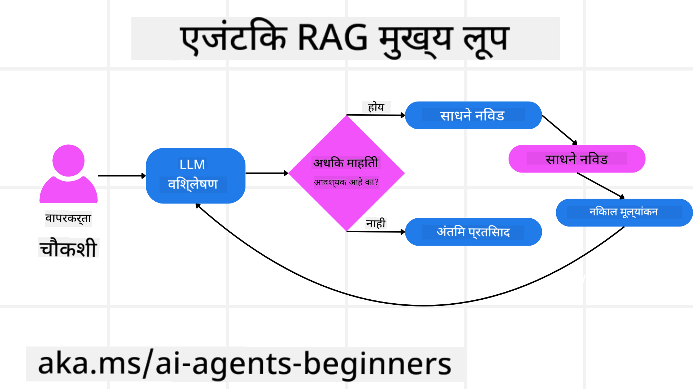
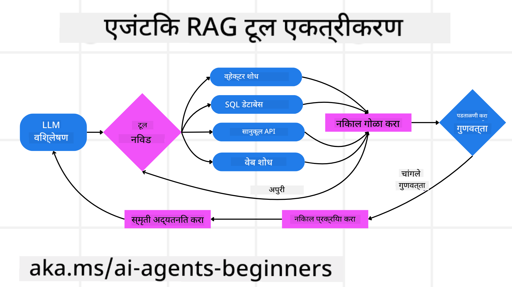
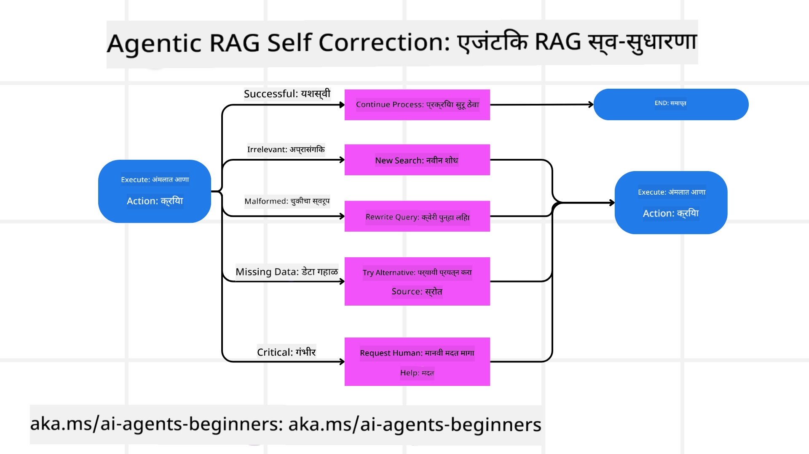

<!--
CO_OP_TRANSLATOR_METADATA:
{
  "original_hash": "7622aa72f9e676e593339f5f694ecd7d",
  "translation_date": "2025-07-12T09:57:21+00:00",
  "source_file": "05-agentic-rag/README.md",
  "language_code": "mr"
}
-->

> _(वरील प्रतिमा क्लिक करून या धड्याचा व्हिडिओ पाहा)_

# Agentic RAG

हा धडा Agentic Retrieval-Augmented Generation (Agentic RAG) याचा सखोल आढावा देतो, जो एक उदयोन्मुख AI पॅराडाइम आहे जिथे मोठे भाषा मॉडेल्स (LLMs) स्वयंचलितपणे पुढील पावले आखतात आणि बाह्य स्रोतांकडून माहिती घेतात. स्थिर retrieval-नंतर-वाचनाच्या पद्धतींपेक्षा वेगळे, Agentic RAG मध्ये LLM ला पुनरावृत्तीने कॉल केले जातात, ज्यामध्ये टूल किंवा फंक्शन कॉल्स आणि संरचित आउटपुट्स असतात. प्रणाली निकालांचे मूल्यमापन करते, क्वेरीज सुधारते, आवश्यक असल्यास अतिरिक्त टूल्स वापरते आणि समाधानकारक उत्तर मिळेपर्यंत हा चक्र चालू ठेवते.

## परिचय

हा धडा खालील गोष्टींचा आढावा घेईल

- **Agentic RAG समजून घेणे:** AI मधील हा उदयोन्मुख पॅराडाइम जाणून घ्या जिथे मोठे भाषा मॉडेल्स (LLMs) स्वयंचलितपणे पुढील पावले आखतात आणि बाह्य डेटास्रोतांकडून माहिती घेतात.
- **पुनरावृत्ती करणाऱ्या मेकर-चेककर शैलीची समज:** LLM ला पुनरावृत्तीने कॉल करण्याचा लूप समजून घ्या, ज्यामध्ये टूल किंवा फंक्शन कॉल्स आणि संरचित आउटपुट्स असतात, जे अचूकता सुधारण्यासाठी आणि चुकीच्या क्वेरीज हाताळण्यासाठी डिझाइन केलेले आहेत.
- **व्यावहारिक अनुप्रयोगांचा शोध:** Agentic RAG जिथे उत्कृष्ट काम करतो अशा परिस्थिती ओळखा, जसे की अचूकता-प्रथम वातावरण, गुंतागुंतीचे डेटाबेस इंटरॅक्शन्स, आणि विस्तारित वर्कफ्लोज.

## शिकण्याचे उद्दिष्टे

हा धडा पूर्ण केल्यानंतर, तुम्हाला खालील गोष्टी कळतील/समजतील:

- **Agentic RAG समजून घेणे:** AI मधील हा उदयोन्मुख पॅराडाइम जाणून घ्या जिथे मोठे भाषा मॉडेल्स (LLMs) स्वयंचलितपणे पुढील पावले आखतात आणि बाह्य डेटास्रोतांकडून माहिती घेतात.
- **पुनरावृत्ती करणाऱ्या मेकर-चेककर शैलीची समज:** LLM ला पुनरावृत्तीने कॉल करण्याचा लूप समजून घ्या, ज्यामध्ये टूल किंवा फंक्शन कॉल्स आणि संरचित आउटपुट्स असतात, जे अचूकता सुधारण्यासाठी आणि चुकीच्या क्वेरीज हाताळण्यासाठी डिझाइन केलेले आहेत.
- **तर्कशक्ती प्रक्रियेचे स्वामित्व:** प्रणालीची स्वतःची तर्कशक्ती प्रक्रिया कशी असते हे समजून घ्या, ज्यात पूर्वनिर्धारित मार्गांवर अवलंबून न राहता समस्या कशी हाताळायची हे ठरवले जाते.
- **वर्कफ्लो:** समजून घ्या की एखादे agentic मॉडेल स्वतंत्रपणे कसे मार्केट ट्रेंड रिपोर्ट्स मिळवते, स्पर्धकांची माहिती ओळखते, अंतर्गत विक्री मेट्रिक्सशी तुलना करते, निष्कर्ष एकत्र करते आणि धोरणाचे मूल्यमापन करते.
- **पुनरावृत्ती लूप्स, टूल इंटिग्रेशन, आणि मेमरी:** प्रणाली कशी लूप केलेल्या संवाद पद्धतीवर अवलंबून असते, ज्यात स्टेट आणि मेमरी राखली जाते जेणेकरून पुनरावृत्ती टाळता येते आणि सूज्ञ निर्णय घेता येतात.
- **अपयश हाताळणे आणि स्व-सुधारणा:** प्रणालीच्या मजबूत स्व-सुधारणा यंत्रणा जाणून घ्या, ज्यात पुनरावृत्ती आणि पुनःक्वेरी करणे, डायग्नोस्टिक टूल्स वापरणे, आणि मानवी देखरेखीवर अवलंबून राहणे यांचा समावेश आहे.
- **एजन्सीची मर्यादा:** Agentic RAG च्या मर्यादा समजून घ्या, ज्यात डोमेन-विशिष्ट स्वायत्तता, इन्फ्रास्ट्रक्चर अवलंबित्व, आणि गार्डरेल्सचा आदर यांचा समावेश आहे.
- **व्यावहारिक वापर आणि मूल्य:** Agentic RAG जिथे उत्कृष्ट काम करतो अशा परिस्थिती ओळखा, जसे की अचूकता-प्रथम वातावरण, गुंतागुंतीचे डेटाबेस इंटरॅक्शन्स, आणि विस्तारित वर्कफ्लोज.
- **शासन, पारदर्शकता, आणि विश्वास:** शासन आणि पारदर्शकतेचे महत्त्व जाणून घ्या, ज्यात स्पष्टीकरणीय तर्क, पूर्वाग्रह नियंत्रण, आणि मानवी देखरेख यांचा समावेश आहे.

## Agentic RAG म्हणजे काय?

Agentic Retrieval-Augmented Generation (Agentic RAG) हा एक उदयोन्मुख AI पॅराडाइम आहे जिथे मोठे भाषा मॉडेल्स (LLMs) स्वयंचलितपणे पुढील पावले आखतात आणि बाह्य स्रोतांकडून माहिती घेतात. स्थिर retrieval-नंतर-वाचनाच्या पद्धतींपेक्षा वेगळे, Agentic RAG मध्ये LLM ला पुनरावृत्तीने कॉल केले जातात, ज्यामध्ये टूल किंवा फंक्शन कॉल्स आणि संरचित आउटपुट्स असतात. प्रणाली निकालांचे मूल्यमापन करते, क्वेरीज सुधारते, आवश्यक असल्यास अतिरिक्त टूल्स वापरते आणि समाधानकारक उत्तर मिळेपर्यंत हा चक्र चालू ठेवते. ही पुनरावृत्ती करणारी “मेकर-चेककर” शैली अचूकता सुधारते, चुकीच्या क्वेरीज हाताळते, आणि उच्च दर्जाचे निकाल सुनिश्चित करते.

प्रणाली सक्रियपणे स्वतःच्या तर्कशक्ती प्रक्रियेचे स्वामित्व घेते, अपयशी क्वेरीज पुन्हा लिहिते, वेगवेगळ्या retrieval पद्धती निवडते, आणि अनेक टूल्स एकत्र करते—जसे की Azure AI Search मधील व्हेक्टर सर्च, SQL डेटाबेस, किंवा कस्टम API—आणि नंतर अंतिम उत्तर निश्चित करते. एजंटिक प्रणालीची वेगळी वैशिष्ट्य म्हणजे तिचे स्वतःच्या तर्कशक्ती प्रक्रियेचे स्वामित्व. पारंपरिक RAG अंमलबजावणी पूर्वनिर्धारित मार्गांवर अवलंबून असतात, पण एजंटिक प्रणाली माहितीच्या गुणवत्तेनुसार पावलांची मालिका स्वयंचलितपणे ठरवते.

## Agentic Retrieval-Augmented Generation (Agentic RAG) ची व्याख्या

Agentic Retrieval-Augmented Generation (Agentic RAG) हा AI विकासातील एक उदयोन्मुख पॅराडाइम आहे जिथे LLMs केवळ बाह्य डेटास्रोतांकडून माहिती घेत नाहीत तर स्वयंचलितपणे पुढील पावले आखतात. स्थिर retrieval-नंतर-वाचनाच्या पद्धती किंवा काळजीपूर्वक स्क्रिप्ट केलेल्या प्रॉम्प्ट साखळ्यांपेक्षा वेगळे, Agentic RAG मध्ये LLM ला पुनरावृत्तीने कॉल केले जातात, ज्यामध्ये टूल किंवा फंक्शन कॉल्स आणि संरचित आउटपुट्स असतात. प्रत्येक टप्प्यावर, प्रणाली मिळालेल्या निकालांचे मूल्यमापन करते, क्वेरीज सुधारायच्या आहेत का ठरवते, आवश्यक असल्यास अतिरिक्त टूल्स वापरते, आणि समाधानकारक उत्तर मिळेपर्यंत हा चक्र चालू ठेवते.

ही पुनरावृत्ती करणारी “मेकर-चेककर” शैली अचूकता सुधारण्यासाठी, संरचित डेटाबेससाठी चुकीच्या क्वेरीज हाताळण्यासाठी (उदा. NL2SQL), आणि संतुलित, उच्च दर्जाचे निकाल सुनिश्चित करण्यासाठी डिझाइन केलेली आहे. काळजीपूर्वक तयार केलेल्या प्रॉम्प्ट साखळ्यांवर अवलंबून राहण्याऐवजी, प्रणाली सक्रियपणे स्वतःच्या तर्कशक्ती प्रक्रियेचे स्वामित्व घेते. ती अपयशी क्वेरीज पुन्हा लिहू शकते, वेगवेगळ्या retrieval पद्धती निवडू शकते, आणि अनेक टूल्स एकत्र करू शकते—जसे की Azure AI Search मधील व्हेक्टर सर्च, SQL डेटाबेस, किंवा कस्टम API—आणि नंतर अंतिम उत्तर निश्चित करते. त्यामुळे अत्यंत गुंतागुंतीच्या ऑर्केस्ट्रेशन फ्रेमवर्कची गरज नाही. त्याऐवजी, “LLM कॉल → टूल वापर → LLM कॉल → …” या तुलनेने सोप्या लूपमुळे प्रगत आणि ठोस आउटपुट्स मिळू शकतात.

## तर्कशक्ती प्रक्रियेचे स्वामित्व

“एजंटिक” प्रणाली बनवणारी वेगळी वैशिष्ट्य म्हणजे तिचे स्वतःच्या तर्कशक्ती प्रक्रियेचे स्वामित्व. पारंपरिक RAG अंमलबजावणी अनेकदा मानवी हस्तक्षेपाने मॉडेलसाठी मार्ग पूर्वनिर्धारित करतात: म्हणजे काय मिळवायचे आणि कधी हे ठरवणारी विचारसाखळी.
पण जेव्हा प्रणाली खरोखरच एजंटिक असते, तेव्हा ती अंतर्गतपणे समस्या कशी हाताळायची हे ठरवते. ती फक्त स्क्रिप्ट चालवत नाही; ती माहितीच्या गुणवत्तेनुसार पावलांची मालिका स्वयंचलितपणे ठरवते.
उदाहरणार्थ, जर तिला उत्पादन लॉन्च धोरण तयार करायचे असेल, तर ती संपूर्ण संशोधन आणि निर्णय प्रक्रियेचा प्रॉम्प्टवर अवलंबून राहत नाही. त्याऐवजी, एजंटिक मॉडेल स्वतंत्रपणे ठरवते:

1. Bing Web Grounding वापरून सध्याच्या मार्केट ट्रेंड रिपोर्ट्स मिळवणे
2. Azure AI Search वापरून संबंधित स्पर्धकांची माहिती ओळखणे
3. Azure SQL Database वापरून ऐतिहासिक अंतर्गत विक्री मेट्रिक्सशी तुलना करणे
4. Azure OpenAI Service द्वारे निष्कर्ष एकत्र करून एकसंध धोरण तयार करणे
5. धोरणातील त्रुटी किंवा विसंगती तपासणे, आवश्यक असल्यास आणखी एक retrieval चक्र सुरू करणे
हे सर्व टप्पे—क्वेरीज सुधारणे, स्रोत निवडणे, समाधानकारक उत्तर मिळेपर्यंत पुनरावृत्ती करणे—मॉडेलने ठरवलेले असतात, मानवी हस्तक्षेपाने पूर्वनिर्धारित नाहीत.

## पुनरावृत्ती लूप्स, टूल इंटिग्रेशन, आणि मेमरी

एजंटिक प्रणाली लूप केलेल्या संवाद पद्धतीवर अवलंबून असते:

- **प्रारंभिक कॉल:** वापरकर्त्याचा उद्देश (उदा. वापरकर्ता प्रॉम्प्ट) LLM कडे सादर केला जातो.
- **टूल कॉल:** जर मॉडेलला माहिती कमी वाटली किंवा सूचना अस्पष्ट वाटल्या, तर ते टूल किंवा retrieval पद्धत निवडते—जसे की व्हेक्टर डेटाबेस क्वेरी (उदा. Azure AI Search Hybrid search खाजगी डेटावर) किंवा संरचित SQL कॉल—अधिक संदर्भ मिळवण्यासाठी.
- **मूल्यमापन आणि सुधारणा:** परत आलेल्या डेटाचा आढावा घेऊन, मॉडेल ठरवते की माहिती पुरेशी आहे का. नसेल तर, क्वेरी सुधारते, वेगळे टूल वापरते, किंवा आपला दृष्टिकोन बदलते.
- **समाधानकारक उत्तर मिळेपर्यंत पुनरावृत्ती:** हा चक्र चालू राहतो जोपर्यंत मॉडेलला पुरेशी स्पष्टता आणि पुरावे मिळतात आणि ते अंतिम, तर्कसंगत उत्तर देऊ शकते.
- **मेमरी आणि स्टेट:** प्रणाली स्टेट आणि मेमरी राखते, ज्यामुळे ती मागील प्रयत्न आणि निकाल आठवू शकते, पुनरावृत्ती टाळते आणि अधिक सूज्ञ निर्णय घेते.

कालांतराने, यामुळे समज वाढण्याची भावना निर्माण होते, ज्यामुळे मॉडेल गुंतागुंतीच्या, बहु-टप्पा कामांमध्ये मानवी हस्तक्षेपाशिवाय किंवा प्रॉम्प्ट पुन्हा तयार न करता मार्गक्रमण करू शकते.

## अपयश हाताळणे आणि स्व-सुधारणा

Agentic RAG ची स्वायत्तता मजबूत स्व-सुधारणा यंत्रणाही समाविष्ट करते. जेव्हा प्रणाली अडचणीत येते—उदा. अप्रासंगिक दस्तऐवज मिळवणे किंवा चुकीच्या क्वेरीज येणे—तेव्हा ती:

- **पुनरावृत्ती आणि पुनःक्वेरी:** कमी मूल्याचे उत्तर देण्याऐवजी, मॉडेल नवीन शोध धोरणे वापरते, डेटाबेस क्वेरीज पुन्हा लिहिते, किंवा पर्यायी डेटासेट्स पाहते.
- **डायग्नोस्टिक टूल्स वापरणे:** प्रणाली अतिरिक्त फंक्शन्स वापरू शकते ज्यामुळे तर्कशक्ती पायऱ्यांचे डिबगिंग किंवा मिळालेल्या डेटाची अचूकता तपासता येते. Azure AI Tracing सारखी टूल्स मजबूत निरीक्षण आणि मॉनिटरिंग सक्षम करतील.
- **मानवी देखरेखीवर अवलंबून राहणे:** उच्च जोखमीच्या किंवा वारंवार अयशस्वी परिस्थितीत, मॉडेल अनिश्चितता दर्शवू शकते आणि मानवी मार्गदर्शन मागू शकते. मानवी सुधारणा मिळाल्यानंतर, मॉडेल ती शिकून पुढे वापरू शकते.

ही पुनरावृत्ती आणि गतिशील पद्धत मॉडेलला सातत्याने सुधारण्यास मदत करते, ज्यामुळे ते फक्त एकदाच काम करणारे नाही तर सत्रादरम्यान चुकांमधून शिकणारे बनते.

## एजन्सीची मर्यादा

तिच्या कार्यात स्वायत्त असली तरी, Agentic RAG ही Artificial General Intelligence सारखी नाही. तिची “एजंटिक” क्षमता मानवी विकासकांनी दिलेल्या टूल्स, डेटास्रोत, आणि धोरणांपुरती मर्यादित आहे. ती स्वतःची टूल्स तयार करू शकत नाही किंवा सेट केलेल्या डोमेनच्या बाहेर जाऊ शकत नाही. ती उपलब्ध संसाधनांचे गतिशील नियोजन करण्यात उत्कृष्ट आहे.
अधिक प्रगत AI प्रकारांपासून मुख्य फरक:

1. **डोमेन-विशिष्ट स्वायत्तता:** Agentic RAG प्रणाली वापरकर्त्याद्वारे निश्चित केलेल्या उद्दिष्टांवर लक्ष केंद्रित करतात, क्वेरी पुन्हा लिहिणे किंवा टूल निवडणे यांसारख्या धोरणांचा वापर करून निकाल सुधारतात.
2. **इन्फ्रास्ट्रक्चर अवलंबित्व:** प्रणालीच्या क्षमतांचा आधार विकासकांनी एकत्र केलेल्या टूल्स आणि डेटावर असतो. मानवी हस्तक्षेपाशिवाय ती या मर्यादेपलीकडे जाऊ शकत नाही.
3. **गार्डरेल्सचा आदर:** नैतिक मार्गदर्शक तत्त्वे, नियमांचे पालन, आणि व्यवसाय धोरणे फार महत्त्वाची आहेत. एजंटची स्वातंत्र्य नेहमी सुरक्षा उपाय आणि देखरेखीच्या यंत्रणांनी मर्यादित असते (आशेने).

## व्यावहारिक वापर आणि मूल्य

Agentic RAG पुनरावृत्ती सुधारणा आणि अचूकता आवश्यक असलेल्या परिस्थितीत उत्कृष्ट काम करतो:

1. **अचूकता-प्रथम वातावरण:** अनुपालन तपासणी, नियामक विश्लेषण, किंवा कायदेशीर संशोधनात, एजंटिक मॉडेल वारंवार तथ्ये तपासू शकते, अनेक स्रोतांचा सल्ला घेऊ शकते, आणि क्वेरी पुन्हा लिहून पूर्णपणे तपासलेले उत्तर तयार करू शकते.
2. **गुंतागुंतीचे डेटाबेस इंटरॅक्शन्स:** जेव्हा संरचित डेटासह काम करायचे असते आणि क्वेरी वारंवार अयशस्वी होऊ शकतात किंवा सुधारणा आवश्यक असते, तेव्हा प्रणाली Azure SQL किंवा Microsoft Fabric OneLake वापरून क्वेरी स्वयंचलितपणे सुधारते, जेणेकरून अंतिम retrieval वापरकर्त्याच्या हेतूस अनुरूप असेल.
3. **विस्तारित वर्कफ्लोज:** दीर्घकालीन सत्रांमध्ये नवीन माहिती समोर येते. Agentic RAG सतत नवीन डेटा समाविष्ट करू शकतो, आणि समस्या क्षेत्राबद्दल अधिक शिकत धोरणे बदलू शकतो.

## शासन, पारदर्शकता, आणि विश्वास

या प्रणाली जसे अधिक स्वायत्त होतात, तर्कशक्तीमध्ये शासन आणि पारदर्शकता फार महत्त्वाची ठरते:

- **स्पष्टीकरणीय तर्क:** मॉडेल केलेल्या क्वेरीजचा, वापरलेल्या स्रोतांचा, आणि घेतलेल्या तर्कशक्ती पायऱ्यांचा ऑडिट ट्रेल देऊ शकते. Azure AI Content Safety आणि Azure AI Tracing / GenAIOps सारखी टूल्स पारदर्शकता राखण्यासाठी आणि धोके कमी करण्यासाठी मदत करतात.
- **पूर्वाग्रह नियंत्रण आणि संतुलित retrieval:** विकासक retrieval धोरणे समायोजित करू शकतात जेणेकरून संतुलित, प्रतिनिधित्व करणारे डेटास्रोत विचारात घेतले जातील, आणि नियमितपणे आउटपुट्सचे ऑडिट करून पूर्वाग्रह किंवा विकृती शोधली जाईल, ज्यासाठी Azure Machine Learning वापरून प्रगत डेटा सायन्स संघटना कस्टम मॉडेल्स वापरू शकतात.
- **मानवी देखरेख आणि अनुपालन:** संवेदनशील कामांस

- <a href="https://learn.microsoft.com/azure/ai-studio/concepts/evaluation-approach-gen-ai" target="_blank">Azure AI Foundry सह जनरेटिव AI अनुप्रयोगांचे मूल्यांकन: हा लेख सार्वजनिकपणे उपलब्ध डेटासेट्सवर मॉडेल्सचे मूल्यांकन आणि तुलना करतो, ज्यात Agentic AI अनुप्रयोग आणि RAG आर्किटेक्चर्स यांचा समावेश आहे</a>
- <a href="https://weaviate.io/blog/what-is-agentic-rag" target="_blank">Agentic RAG म्हणजे काय | Weaviate</a>
- <a href="https://ragaboutit.com/agentic-rag-a-complete-guide-to-agent-based-retrieval-augmented-generation/" target="_blank">Agentic RAG: एजंट-आधारित रिट्रीव्हल ऑगमेंटेड जनरेशनसाठी संपूर्ण मार्गदर्शक – जनरेशन RAG मधील बातम्या</a>
- <a href="https://huggingface.co/learn/cookbook/agent_rag" target="_blank">Agentic RAG: क्वेरी पुनर्रचना आणि स्व-क्वेरीसह तुमचा RAG टर्बोचार्ज करा! Hugging Face Open-Source AI Cookbook</a>
- <a href="https://youtu.be/aQ4yQXeB1Ss?si=2HUqBzHoeB5tR04U" target="_blank">RAG मध्ये Agentic लेयर्स जोडणे</a>
- <a href="https://www.youtube.com/watch?v=zeAyuLc_f3Q&t=244s" target="_blank">ज्ञान सहाय्यकांचे भविष्य: जेरी लियू</a>
- <a href="https://www.youtube.com/watch?v=AOSjiXP1jmQ" target="_blank">Agentic RAG सिस्टम्स कसे तयार करायचे</a>
- <a href="https://ignite.microsoft.com/sessions/BRK102?source=sessions" target="_blank">Azure AI Foundry Agent Service वापरून तुमचे AI एजंट्स स्केल करा</a>

### अकादमिक पेपर्स

- <a href="https://arxiv.org/abs/2303.17651" target="_blank">2303.17651 Self-Refine: स्व-प्रतिसादासह पुनरावृत्ती सुधारणा</a>
- <a href="https://arxiv.org/abs/2303.11366" target="_blank">2303.11366 Reflexion: मौखिक पुनर्बलन शिक्षणासह भाषा एजंट्स</a>
- <a href="https://arxiv.org/abs/2305.11738" target="_blank">2305.11738 CRITIC: मोठे भाषा मॉडेल्स टूल-इंटरऐक्टिव क्रिटीकिंगसह स्वतः सुधारू शकतात</a>
- <a href="https://arxiv.org/abs/2501.09136" target="_blank">2501.09136 Agentic Retrieval-Augmented Generation: Agentic RAG वर सर्वेक्षण</a>

## मागील धडा

[Tool Use Design Pattern](../04-tool-use/README.md)

## पुढील धडा

[Building Trustworthy AI Agents](../06-building-trustworthy-agents/README.md)

**अस्वीकरण**:  
हा दस्तऐवज AI अनुवाद सेवा [Co-op Translator](https://github.com/Azure/co-op-translator) वापरून अनुवादित केला आहे. आम्ही अचूकतेसाठी प्रयत्नशील असलो तरी, कृपया लक्षात घ्या की स्वयंचलित अनुवादांमध्ये चुका किंवा अचूकतेची कमतरता असू शकते. मूळ दस्तऐवज त्याच्या स्थानिक भाषेत अधिकृत स्रोत मानला जावा. महत्त्वाच्या माहितीसाठी व्यावसायिक मानवी अनुवाद करण्याची शिफारस केली जाते. या अनुवादाच्या वापरामुळे उद्भवणाऱ्या कोणत्याही गैरसमजुती किंवा चुकीच्या अर्थलागी आम्ही जबाबदार नाही.