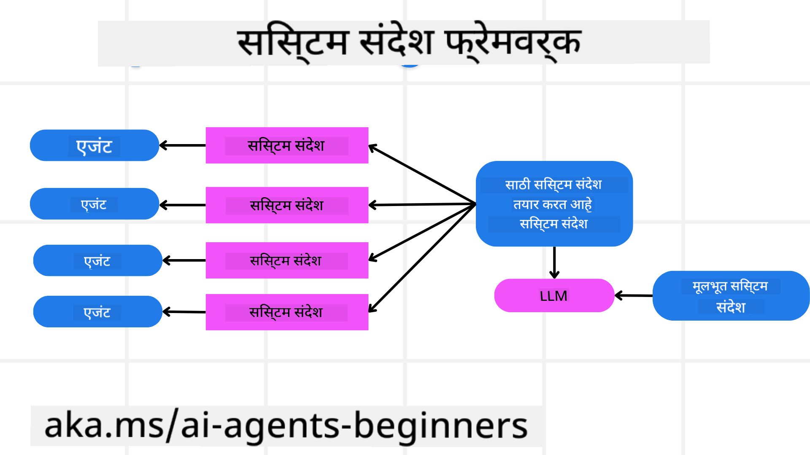
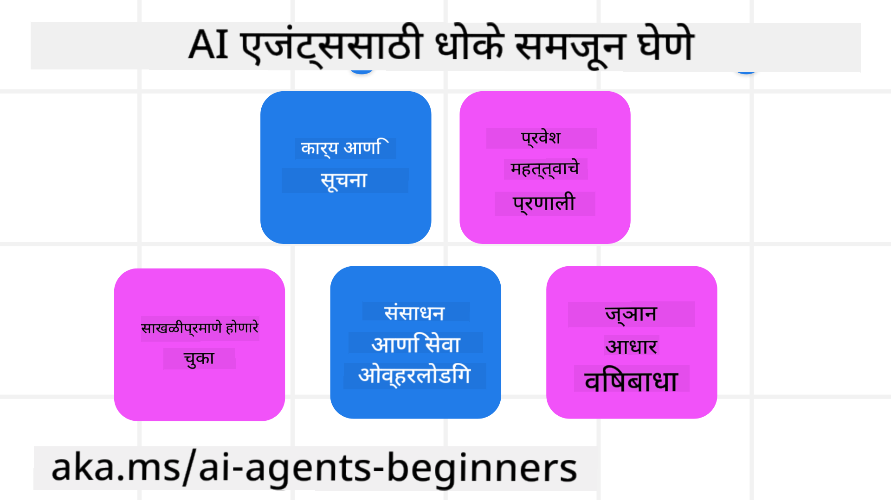

<!--
CO_OP_TRANSLATOR_METADATA:
{
  "original_hash": "f57852cac3a86c4a5ef47f793cc12178",
  "translation_date": "2025-07-12T10:24:59+00:00",
  "source_file": "06-building-trustworthy-agents/README.md",
  "language_code": "mr"
}
-->
[](https://youtu.be/iZKkMEGBCUQ?si=Q-kEbcyHUMPoHp8L)

> _(वरील प्रतिमा क्लिक करून या धड्याचा व्हिडिओ पाहा)_

# विश्वासार्ह AI एजंट तयार करणे

## परिचय

हा धडा खालील गोष्टींचा आढावा घेईल:

- सुरक्षित आणि प्रभावी AI एजंट कसे तयार करायचे आणि तैनात करायचे
- AI एजंट विकसित करताना महत्त्वाच्या सुरक्षा बाबी
- AI एजंट विकसित करताना डेटा आणि वापरकर्त्यांच्या गोपनीयतेचे संरक्षण कसे करायचे

## शिकण्याचे उद्दिष्टे

हा धडा पूर्ण केल्यानंतर, तुम्हाला हे समजेल की:

- AI एजंट तयार करताना धोके कसे ओळखायचे आणि कमी करायचे
- डेटा आणि प्रवेश योग्यरित्या व्यवस्थापित होण्यासाठी सुरक्षा उपाय कसे राबवायचे
- डेटा गोपनीयता राखणारे आणि दर्जेदार वापरकर्ता अनुभव देणारे AI एजंट कसे तयार करायचे

## सुरक्षा

सुरक्षित एजंटिक अनुप्रयोग तयार करण्याकडे पाहूया. सुरक्षा म्हणजे AI एजंट त्याच्या डिझाइननुसार कार्य करतो. एजंटिक अनुप्रयोग तयार करणाऱ्यां म्हणून, आपल्याकडे सुरक्षा वाढवण्यासाठी विविध पद्धती आणि साधने आहेत:

### सिस्टम मेसेज फ्रेमवर्क तयार करणे

जर तुम्ही कधी LLMs वापरून AI अनुप्रयोग तयार केला असेल, तर तुम्हाला मजबूत सिस्टम प्रॉम्प्ट किंवा सिस्टम मेसेज डिझाइन करण्याचे महत्त्व माहीत असेल. हे प्रॉम्प्ट LLM कसे वापरकर्त्यांशी आणि डेटाशी संवाद साधेल यासाठी नियम, सूचना आणि मार्गदर्शक तत्त्वे ठरवतात.

AI एजंटसाठी, सिस्टम प्रॉम्प्ट आणखी महत्त्वाचा असतो कारण AI एजंटसाठी आम्ही तयार केलेल्या कार्यांसाठी अत्यंत विशिष्ट सूचना आवश्यक असतात.

स्केलेबल सिस्टम प्रॉम्प्ट तयार करण्यासाठी, आपण आमच्या अनुप्रयोगातील एक किंवा अधिक एजंटसाठी सिस्टम मेसेज फ्रेमवर्क वापरू शकतो:



#### पाऊल 1: मेटा सिस्टम मेसेज तयार करा

मेटा प्रॉम्प्ट LLM वापरून एजंटसाठी सिस्टम प्रॉम्प्ट तयार करण्यासाठी वापरला जाईल. आम्ही ते टेम्पलेट म्हणून डिझाइन करतो जेणेकरून आवश्यक असल्यास अनेक एजंट सहज तयार करता येतील.

येथे मेटा सिस्टम मेसेजचे उदाहरण आहे जे आम्ही LLM ला देऊ:

```plaintext
You are an expert at creating AI agent assistants. 
You will be provided a company name, role, responsibilities and other
information that you will use to provide a system prompt for.
To create the system prompt, be descriptive as possible and provide a structure that a system using an LLM can better understand the role and responsibilities of the AI assistant. 
```

#### पाऊल 2: मूलभूत प्रॉम्प्ट तयार करा

पुढील पाऊल म्हणजे AI एजंटचे वर्णन करणारा मूलभूत प्रॉम्प्ट तयार करणे. यात एजंटची भूमिका, एजंट पूर्ण करणार्‍या कार्यांची यादी आणि इतर जबाबदाऱ्या समाविष्ट कराव्यात.

येथे एक उदाहरण आहे:

```plaintext
You are a travel agent for Contoso Travel that is great at booking flights for customers. To help customers you can perform the following tasks: lookup available flights, book flights, ask for preferences in seating and times for flights, cancel any previously booked flights and alert customers on any delays or cancellations of flights.  
```

#### पाऊल 3: LLM ला मूलभूत सिस्टम मेसेज द्या

आता आपण मेटा सिस्टम मेसेज आणि मूलभूत सिस्टम मेसेज एकत्र करून हा सिस्टम मेसेज ऑप्टिमाइझ करू शकतो.

यामुळे आमच्या AI एजंटसाठी अधिक चांगल्या प्रकारे मार्गदर्शन करणारा सिस्टम मेसेज तयार होईल:

```markdown
**Company Name:** Contoso Travel  
**Role:** Travel Agent Assistant

**Objective:**  
You are an AI-powered travel agent assistant for Contoso Travel, specializing in booking flights and providing exceptional customer service. Your main goal is to assist customers in finding, booking, and managing their flights, all while ensuring that their preferences and needs are met efficiently.

**Key Responsibilities:**

1. **Flight Lookup:**
    
    - Assist customers in searching for available flights based on their specified destination, dates, and any other relevant preferences.
    - Provide a list of options, including flight times, airlines, layovers, and pricing.
2. **Flight Booking:**
    
    - Facilitate the booking of flights for customers, ensuring that all details are correctly entered into the system.
    - Confirm bookings and provide customers with their itinerary, including confirmation numbers and any other pertinent information.
3. **Customer Preference Inquiry:**
    
    - Actively ask customers for their preferences regarding seating (e.g., aisle, window, extra legroom) and preferred times for flights (e.g., morning, afternoon, evening).
    - Record these preferences for future reference and tailor suggestions accordingly.
4. **Flight Cancellation:**
    
    - Assist customers in canceling previously booked flights if needed, following company policies and procedures.
    - Notify customers of any necessary refunds or additional steps that may be required for cancellations.
5. **Flight Monitoring:**
    
    - Monitor the status of booked flights and alert customers in real-time about any delays, cancellations, or changes to their flight schedule.
    - Provide updates through preferred communication channels (e.g., email, SMS) as needed.

**Tone and Style:**

- Maintain a friendly, professional, and approachable demeanor in all interactions with customers.
- Ensure that all communication is clear, informative, and tailored to the customer's specific needs and inquiries.

**User Interaction Instructions:**

- Respond to customer queries promptly and accurately.
- Use a conversational style while ensuring professionalism.
- Prioritize customer satisfaction by being attentive, empathetic, and proactive in all assistance provided.

**Additional Notes:**

- Stay updated on any changes to airline policies, travel restrictions, and other relevant information that could impact flight bookings and customer experience.
- Use clear and concise language to explain options and processes, avoiding jargon where possible for better customer understanding.

This AI assistant is designed to streamline the flight booking process for customers of Contoso Travel, ensuring that all their travel needs are met efficiently and effectively.

```

#### पाऊल 4: पुनरावृत्ती करा आणि सुधारणा करा

या सिस्टम मेसेज फ्रेमवर्कचे महत्त्व म्हणजे अनेक एजंटसाठी सिस्टम मेसेज तयार करणे सोपे करणे आणि वेळोवेळी तुमचे सिस्टम मेसेज सुधारत राहणे. तुमच्या संपूर्ण वापर प्रकरणासाठी प्रथमच योग्य सिस्टम मेसेज मिळणे क्वचितच शक्य असते. मूलभूत सिस्टम मेसेज बदलून आणि सिस्टममध्ये पुन्हा चालवून लहान सुधारणा करता येतात ज्यामुळे तुम्ही निकालांची तुलना आणि मूल्यांकन करू शकता.

## धोके समजून घेणे

विश्वासार्ह AI एजंट तयार करण्यासाठी, तुमच्या AI एजंटवर होणाऱ्या धोके आणि जोखमी समजून घेणे आणि कमी करणे महत्त्वाचे आहे. चला AI एजंटवर होणाऱ्या काही धोके आणि त्यांच्यासाठी कसे योजना आखता येईल ते पाहूया.



### कार्य आणि सूचना

**वर्णन:** हल्लेखोर AI एजंटच्या सूचनांमध्ये किंवा उद्दिष्टांमध्ये बदल करण्याचा प्रयत्न करतात, प्रॉम्प्टिंग किंवा इनपुट्समध्ये फेरफार करून.

**कमी करणे:** संभाव्य धोकादायक प्रॉम्प्ट्स ओळखण्यासाठी व्हॅलिडेशन तपासणी आणि इनपुट फिल्टर्स वापरा. या हल्ल्यांसाठी एजंटशी वारंवार संवाद आवश्यक असल्याने संभाषणातील टर्न्सची संख्या मर्यादित करणे हा एक उपाय आहे.

### महत्त्वाच्या प्रणालींना प्रवेश

**वर्णन:** जर AI एजंटला संवेदनशील डेटा साठवणाऱ्या प्रणालींना प्रवेश असेल, तर हल्लेखोर एजंट आणि या सेवा यांच्यातील संवाद बिघडवू शकतात. हे थेट हल्ले किंवा एजंटद्वारे या प्रणालींबद्दल माहिती मिळवण्याचा अप्रत्यक्ष प्रयत्न असू शकतो.

**कमी करणे:** AI एजंटला फक्त आवश्यकतेनुसार प्रणालींना प्रवेश द्या. एजंट आणि प्रणाली यांच्यातील संवाद सुरक्षित असावा. प्रमाणीकरण आणि प्रवेश नियंत्रण राबवणे हा आणखी एक संरक्षणाचा मार्ग आहे.

### संसाधने आणि सेवा ओव्हरलोड करणे

**वर्णन:** AI एजंट विविध साधने आणि सेवा वापरून कार्य पूर्ण करतात. हल्लेखोर AI एजंटद्वारे या सेवांना मोठ्या प्रमाणात विनंत्या पाठवून हल्ला करू शकतात, ज्यामुळे प्रणाली अयशस्वी होऊ शकते किंवा खर्च वाढू शकतो.

**कमी करणे:** AI एजंट एका सेवेला पाठवू शकणाऱ्या विनंत्यांची संख्या मर्यादित करणाऱ्या धोरणांची अंमलबजावणी करा. संभाषणातील टर्न्स आणि विनंत्यांची संख्या कमी करणे हा आणखी एक उपाय आहे.

### ज्ञानाधार विषबाधा

**वर्णन:** हा हल्ला थेट AI एजंटवर होत नाही, तर AI एजंट वापरणाऱ्या ज्ञानाधार आणि इतर सेवांवर होतो. यात डेटा किंवा माहिती भ्रष्ट करणे समाविष्ट असू शकते, ज्यामुळे एजंट वापरकर्त्याला पूर्वग्रहित किंवा अनपेक्षित प्रतिसाद देऊ शकतो.

**कमी करणे:** AI एजंट वापरणाऱ्या डेटाची नियमित तपासणी करा. या डेटावर प्रवेश सुरक्षित ठेवा आणि फक्त विश्वासार्ह लोकांद्वारेच बदल होऊ द्या.

### साखळीतील चुका

**वर्णन:** AI एजंट विविध साधने आणि सेवा वापरून कार्य करतात. हल्लेखोरांमुळे झालेल्या चुका इतर प्रणालींना देखील प्रभावित करू शकतात, ज्यामुळे हल्ला अधिक व्यापक आणि त्रासदायक होतो.

**कमी करणे:** AI एजंटला मर्यादित वातावरणात (उदा. Docker कंटेनरमध्ये) कार्य करण्यास सांगा, ज्यामुळे थेट प्रणालींवर हल्ला टाळता येतो. काही प्रणाली त्रुटी दर्शविल्यास फॉलबॅक यंत्रणा आणि पुनःप्रयत्न लॉजिक तयार करणे हा आणखी एक उपाय आहे.

## मानव-इन-द-लूप

विश्वासार्ह AI एजंट प्रणाली तयार करण्याचा आणखी एक प्रभावी मार्ग म्हणजे मानव-इन-द-लूप वापरणे. यामुळे वापरकर्ते एजंट चालू असताना त्यांना अभिप्राय देऊ शकतात. वापरकर्ते बहु-एजंट प्रणालीतील एजंटसारखे काम करतात आणि चालू प्रक्रियेची मंजुरी किंवा थांबवणूक देतात.


AutoGen वापरून हा संकल्पना कशी राबवली जाते याचे कोड स्निपेट येथे आहे:

```python

# Create the agents.
model_client = OpenAIChatCompletionClient(model="gpt-4o-mini")
assistant = AssistantAgent("assistant", model_client=model_client)
user_proxy = UserProxyAgent("user_proxy", input_func=input)  # Use input() to get user input from console.

# Create the termination condition which will end the conversation when the user says "APPROVE".
termination = TextMentionTermination("APPROVE")

# Create the team.
team = RoundRobinGroupChat([assistant, user_proxy], termination_condition=termination)

# Run the conversation and stream to the console.
stream = team.run_stream(task="Write a 4-line poem about the ocean.")
# Use asyncio.run(...) when running in a script.
await Console(stream)

```

## निष्कर्ष

विश्वासार्ह AI एजंट तयार करण्यासाठी काळजीपूर्वक डिझाइन, मजबूत सुरक्षा उपाय आणि सतत सुधारणा आवश्यक आहे. संरचित मेटा प्रॉम्प्टिंग प्रणाली राबवून, संभाव्य धोके समजून घेऊन आणि त्यांच्यासाठी उपाययोजना करून, विकसक सुरक्षित आणि प्रभावी AI एजंट तयार करू शकतात. शिवाय, मानव-इन-द-लूप पद्धत वापरल्याने AI एजंट वापरकर्त्यांच्या गरजांशी सुसंगत राहतात आणि धोके कमी होतात. AI सतत विकसित होत असल्याने सुरक्षा, गोपनीयता आणि नैतिक बाबतीत सक्रिय राहणे विश्वास आणि विश्वसनीयता वाढविण्यासाठी महत्त्वाचे ठरेल.

## अतिरिक्त संसाधने

- <a href="https://learn.microsoft.com/azure/ai-studio/responsible-use-of-ai-overview" target="_blank">Responsible AI overview</a>
- <a href="https://learn.microsoft.com/azure/ai-studio/concepts/evaluation-approach-gen-ai" target="_blank">Evaluation of generative AI models and AI applications</a>
- <a href="https://learn.microsoft.com/azure/ai-services/openai/concepts/system-message?context=%2Fazure%2Fai-studio%2Fcontext%2Fcontext&tabs=top-techniques" target="_blank">Safety system messages</a>
- <a href="https://blogs.microsoft.com/wp-content/uploads/prod/sites/5/2022/06/Microsoft-RAI-Impact-Assessment-Template.pdf?culture=en-us&country=us" target="_blank">Risk Assessment Template</a>

## मागील धडा

[Agentic RAG](../05-agentic-rag/README.md)

## पुढील धडा

[Planning Design Pattern](../07-planning-design/README.md)

**अस्वीकरण**:  
हा दस्तऐवज AI अनुवाद सेवा [Co-op Translator](https://github.com/Azure/co-op-translator) वापरून अनुवादित केला आहे. आम्ही अचूकतेसाठी प्रयत्नशील असलो तरी, कृपया लक्षात घ्या की स्वयंचलित अनुवादांमध्ये चुका किंवा अचूकतेची कमतरता असू शकते. मूळ दस्तऐवज त्याच्या स्थानिक भाषेत अधिकृत स्रोत मानला जावा. महत्त्वाच्या माहितीसाठी व्यावसायिक मानवी अनुवाद करण्याची शिफारस केली जाते. या अनुवादाच्या वापरामुळे उद्भवलेल्या कोणत्याही गैरसमजुती किंवा चुकीच्या अर्थलागी आम्ही जबाबदार नाही.