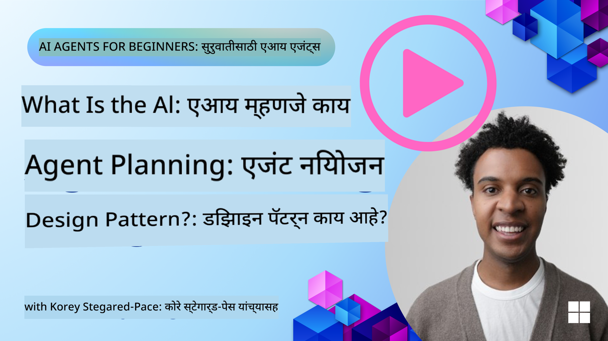
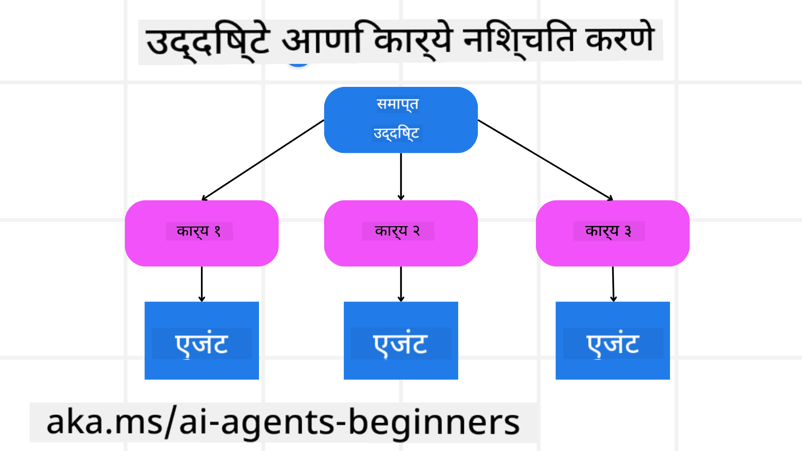

<!--
CO_OP_TRANSLATOR_METADATA:
{
  "original_hash": "a28d30590704ea13b6a08d4793cf9c2b",
  "translation_date": "2025-08-29T10:08:52+00:00",
  "source_file": "07-planning-design/README.md",
  "language_code": "mr"
}
-->
[](https://youtu.be/kPfJ2BrBCMY?si=9pYpPXp0sSbK91Dr)

> _(वरील प्रतिमेवर क्लिक करून या धड्याचा व्हिडिओ पहा)_

# नियोजन डिझाइन

## परिचय

या धड्यात आपण शिकणार आहोत:

* एक स्पष्ट अंतिम उद्दिष्ट निश्चित करणे आणि गुंतागुंतीच्या कार्याला व्यवस्थापनीय कार्यांमध्ये विभागणे.
* संरचित आउटपुटचा उपयोग करून अधिक विश्वासार्ह आणि मशीन-रीड करण्यायोग्य प्रतिसाद मिळवणे.
* डायनॅमिक कार्ये आणि अनपेक्षित इनपुट हाताळण्यासाठी इव्हेंट-ड्रिव्हन दृष्टिकोन लागू करणे.

## शिकण्याची उद्दिष्टे

हा धडा पूर्ण केल्यानंतर, तुम्हाला खालील गोष्टींची समज होईल:

* AI एजंटसाठी एकूण उद्दिष्ट ओळखणे आणि निश्चित करणे, जेणेकरून त्याला काय साध्य करायचे आहे हे स्पष्टपणे समजेल.
* गुंतागुंतीच्या कार्याचे व्यवस्थापनीय उपकार्यांमध्ये विघटन करणे आणि त्यांना तार्किक क्रमात आयोजित करणे.
* एजंट्सना योग्य साधने (उदा. शोध साधने किंवा डेटा अॅनालिटिक्स साधने) प्रदान करणे, ती कधी आणि कशी वापरायची याचा निर्णय घेणे आणि उद्भवणाऱ्या अनपेक्षित परिस्थिती हाताळणे.
* उपकार्यांचे परिणाम मूल्यांकन करणे, कार्यक्षमता मोजणे आणि अंतिम आउटपुट सुधारण्यासाठी कृतींवर पुनरावलोकन करणे.

## एकूण उद्दिष्ट निश्चित करणे आणि कार्याचे विघटन करणे



बहुतेक वास्तविक-जगातील कार्ये एका टप्प्यात हाताळण्यासाठी खूप गुंतागुंतीची असतात. AI एजंटला त्याच्या नियोजन आणि कृतींसाठी मार्गदर्शन करण्यासाठी एक संक्षिप्त उद्दिष्ट आवश्यक असते. उदाहरणार्थ, खालील उद्दिष्ट विचार करा:

    "3 दिवसांचा प्रवासाचा आराखडा तयार करा."

हे सांगणे सोपे असले तरी, त्यात अजूनही सुधारणा आवश्यक आहे. उद्दिष्ट जितके स्पष्ट असेल, तितके एजंट (आणि कोणतेही मानवी सहकारी) योग्य परिणाम साध्य करण्यावर लक्ष केंद्रित करू शकतात, जसे की फ्लाइट पर्याय, हॉटेल शिफारसी आणि क्रियाकलापांच्या सूचना यांसह एक व्यापक आराखडा तयार करणे.

### कार्याचे विघटन

मोठी किंवा गुंतागुंतीची कार्ये लहान, उद्दिष्ट-केंद्रित उपकार्यांमध्ये विभागल्यास अधिक व्यवस्थापनीय होतात. 
प्रवासाच्या आराखड्याच्या उदाहरणासाठी, तुम्ही उद्दिष्ट खालीलप्रमाणे विभागू शकता:

* फ्लाइट बुकिंग
* हॉटेल बुकिंग
* कार भाड्याने घेणे
* वैयक्तिकरण

प्रत्येक उपकार्य समर्पित एजंट्स किंवा प्रक्रियांद्वारे हाताळले जाऊ शकते. एक एजंट सर्वोत्तम फ्लाइट डील शोधण्यात तज्ज्ञ असू शकतो, तर दुसरा हॉटेल बुकिंगवर लक्ष केंद्रित करू शकतो. एक समन्वयक किंवा "डाउनस्ट्रीम" एजंट नंतर हे परिणाम एकत्र करून अंतिम वापरकर्त्यासाठी एक सुसंगत आराखडा तयार करू शकतो.

हा मॉड्यूलर दृष्टिकोन टप्प्याटप्प्याने सुधारणा करण्यास देखील परवानगी देतो. उदाहरणार्थ, तुम्ही फूड शिफारसी किंवा स्थानिक क्रियाकलापांच्या सूचना यासाठी विशेष एजंट जोडू शकता आणि वेळोवेळी आराखड्याला अधिक परिष्कृत करू शकता.

### संरचित आउटपुट

मोठ्या भाषा मॉडेल्स (LLMs) संरचित आउटपुट (उदा. JSON) तयार करू शकतात, जे डाउनस्ट्रीम एजंट्स किंवा सेवांसाठी पार्स आणि प्रक्रिया करणे सोपे असते. हे विशेषतः मल्टी-एजंट संदर्भात उपयुक्त आहे, जिथे नियोजन आउटपुट प्राप्त झाल्यानंतर या कार्यांवर कृती केली जाऊ शकते. 

### जलद आढावा

खालील Python कोड स्निपेट एक साधा नियोजन एजंट कसा उद्दिष्ट उपकार्यांमध्ये विभागतो आणि संरचित योजना तयार करतो हे दर्शवितो:

```python
from pydantic import BaseModel
from enum import Enum
from typing import List, Optional, Union
import json
import os
from typing import Optional
from pprint import pprint
from autogen_core.models import UserMessage, SystemMessage, AssistantMessage
from autogen_ext.models.azure import AzureAIChatCompletionClient
from azure.core.credentials import AzureKeyCredential

class AgentEnum(str, Enum):
    FlightBooking = "flight_booking"
    HotelBooking = "hotel_booking"
    CarRental = "car_rental"
    ActivitiesBooking = "activities_booking"
    DestinationInfo = "destination_info"
    DefaultAgent = "default_agent"
    GroupChatManager = "group_chat_manager"

# Travel SubTask Model
class TravelSubTask(BaseModel):
    task_details: str
    assigned_agent: AgentEnum  # we want to assign the task to the agent

class TravelPlan(BaseModel):
    main_task: str
    subtasks: List[TravelSubTask]
    is_greeting: bool

client = AzureAIChatCompletionClient(
    model="gpt-4o-mini",
    endpoint="https://models.inference.ai.azure.com",
    # To authenticate with the model you will need to generate a personal access token (PAT) in your GitHub settings.
    # Create your PAT token by following instructions here: https://docs.github.com/en/authentication/keeping-your-account-and-data-secure/managing-your-personal-access-tokens
    credential=AzureKeyCredential(os.environ["GITHUB_TOKEN"]),
    model_info={
        "json_output": False,
        "function_calling": True,
        "vision": True,
        "family": "unknown",
    },
)

# Define the user message
messages = [
    SystemMessage(content="""You are an planner agent.
    Your job is to decide which agents to run based on the user's request.
                      Provide your response in JSON format with the following structure:
{'main_task': 'Plan a family trip from Singapore to Melbourne.',
 'subtasks': [{'assigned_agent': 'flight_booking',
               'task_details': 'Book round-trip flights from Singapore to '
                               'Melbourne.'}
    Below are the available agents specialised in different tasks:
    - FlightBooking: For booking flights and providing flight information
    - HotelBooking: For booking hotels and providing hotel information
    - CarRental: For booking cars and providing car rental information
    - ActivitiesBooking: For booking activities and providing activity information
    - DestinationInfo: For providing information about destinations
    - DefaultAgent: For handling general requests""", source="system"),
    UserMessage(
        content="Create a travel plan for a family of 2 kids from Singapore to Melboune", source="user"),
]

response = await client.create(messages=messages, extra_create_args={"response_format": 'json_object'})

response_content: Optional[str] = response.content if isinstance(
    response.content, str) else None
if response_content is None:
    raise ValueError("Response content is not a valid JSON string" )

pprint(json.loads(response_content))

# # Ensure the response content is a valid JSON string before loading it
# response_content: Optional[str] = response.content if isinstance(
#     response.content, str) else None
# if response_content is None:
#     raise ValueError("Response content is not a valid JSON string")

# # Print the response content after loading it as JSON
# pprint(json.loads(response_content))

# Validate the response content with the MathReasoning model
# TravelPlan.model_validate(json.loads(response_content))
```

### मल्टी-एजंट ऑर्केस्ट्रेशनसह नियोजन एजंट

या उदाहरणात, एक सेमॅंटिक राउटर एजंट वापरकर्त्याच्या विनंतीला (उदा. "माझ्या प्रवासासाठी हॉटेल योजना हवी आहे.") प्राप्त करतो.

नियोजक नंतर:

* हॉटेल योजना प्राप्त करतो: नियोजक वापरकर्त्याचा संदेश घेतो आणि, सिस्टम प्रॉम्प्ट (उपलब्ध एजंट तपशीलांसह) आधारित, एक संरचित प्रवास योजना तयार करतो.
* एजंट्स आणि त्यांच्या साधनांची यादी करतो: एजंट रजिस्ट्रीमध्ये एजंट्सची यादी (उदा. फ्लाइट, हॉटेल, कार भाड्याने घेणे आणि क्रियाकलाप) आणि त्यांनी ऑफर केलेल्या फंक्शन्स किंवा साधनांचा समावेश असतो.
* योजना संबंधित एजंट्सकडे पाठवतो: उपकार्यांच्या संख्येवर अवलंबून, नियोजक संदेश थेट समर्पित एजंटकडे (सिंगल-टास्क परिस्थितीसाठी) पाठवतो किंवा मल्टी-एजंट सहयोगासाठी ग्रुप चॅट मॅनेजरद्वारे समन्वय साधतो.
* परिणामाचा सारांश तयार करतो: शेवटी, नियोजक स्पष्टतेसाठी तयार केलेल्या योजनेचा सारांश तयार करतो.

खालील Python कोड नमुना या टप्प्यांचे वर्णन करतो:

```python

from pydantic import BaseModel

from enum import Enum
from typing import List, Optional, Union

class AgentEnum(str, Enum):
    FlightBooking = "flight_booking"
    HotelBooking = "hotel_booking"
    CarRental = "car_rental"
    ActivitiesBooking = "activities_booking"
    DestinationInfo = "destination_info"
    DefaultAgent = "default_agent"
    GroupChatManager = "group_chat_manager"

# Travel SubTask Model

class TravelSubTask(BaseModel):
    task_details: str
    assigned_agent: AgentEnum # we want to assign the task to the agent

class TravelPlan(BaseModel):
    main_task: str
    subtasks: List[TravelSubTask]
    is_greeting: bool
import json
import os
from typing import Optional

from autogen_core.models import UserMessage, SystemMessage, AssistantMessage
from autogen_ext.models.openai import AzureOpenAIChatCompletionClient

# Create the client with type-checked environment variables

client = AzureOpenAIChatCompletionClient(
    azure_deployment=os.getenv("AZURE_OPENAI_DEPLOYMENT_NAME"),
    model=os.getenv("AZURE_OPENAI_DEPLOYMENT_NAME"),
    api_version=os.getenv("AZURE_OPENAI_API_VERSION"),
    azure_endpoint=os.getenv("AZURE_OPENAI_ENDPOINT"),
    api_key=os.getenv("AZURE_OPENAI_API_KEY"),
)

from pprint import pprint

# Define the user message

messages = [
    SystemMessage(content="""You are an planner agent.
    Your job is to decide which agents to run based on the user's request.
    Below are the available agents specialized in different tasks:
    - FlightBooking: For booking flights and providing flight information
    - HotelBooking: For booking hotels and providing hotel information
    - CarRental: For booking cars and providing car rental information
    - ActivitiesBooking: For booking activities and providing activity information
    - DestinationInfo: For providing information about destinations
    - DefaultAgent: For handling general requests""", source="system"),
    UserMessage(content="Create a travel plan for a family of 2 kids from Singapore to Melbourne", source="user"),
]

response = await client.create(messages=messages, extra_create_args={"response_format": TravelPlan})

# Ensure the response content is a valid JSON string before loading it

response_content: Optional[str] = response.content if isinstance(response.content, str) else None
if response_content is None:
    raise ValueError("Response content is not a valid JSON string")

# Print the response content after loading it as JSON

pprint(json.loads(response_content))
```

वरील कोडमधून तयार झालेला आउटपुट खालीलप्रमाणे आहे आणि तुम्ही हा संरचित आउटपुट `assigned_agent` कडे रूट करण्यासाठी आणि अंतिम वापरकर्त्यासाठी प्रवास योजनेचा सारांश तयार करण्यासाठी वापरू शकता.

```json
{
    "is_greeting": "False",
    "main_task": "Plan a family trip from Singapore to Melbourne.",
    "subtasks": [
        {
            "assigned_agent": "flight_booking",
            "task_details": "Book round-trip flights from Singapore to Melbourne."
        },
        {
            "assigned_agent": "hotel_booking",
            "task_details": "Find family-friendly hotels in Melbourne."
        },
        {
            "assigned_agent": "car_rental",
            "task_details": "Arrange a car rental suitable for a family of four in Melbourne."
        },
        {
            "assigned_agent": "activities_booking",
            "task_details": "List family-friendly activities in Melbourne."
        },
        {
            "assigned_agent": "destination_info",
            "task_details": "Provide information about Melbourne as a travel destination."
        }
    ]
}
```

वरील कोड नमुन्यासह एक उदाहरण नोटबुक [येथे](07-autogen.ipynb) उपलब्ध आहे.

### पुनरावृत्ती नियोजन

काही कार्यांसाठी परत-फिरणे किंवा पुन्हा नियोजन आवश्यक असते, जिथे एका उपकार्याचा परिणाम पुढील उपकार्यावर परिणाम करतो. उदाहरणार्थ, जर एजंटला फ्लाइट बुक करताना अनपेक्षित डेटा स्वरूप सापडले, तर पुढे जाण्यापूर्वी त्याला त्याची रणनीती अनुकूल करावी लागेल.

याशिवाय, वापरकर्त्याच्या अभिप्रायामुळे (उदा. एखाद्या व्यक्तीने लवकर फ्लाइटला प्राधान्य दिले) आंशिक पुनर्नियोजन होऊ शकते. हा डायनॅमिक, पुनरावृत्ती दृष्टिकोन सुनिश्चित करतो की अंतिम समाधान वास्तविक-जगातील मर्यादा आणि विकसित होणाऱ्या वापरकर्ता प्राधान्यांशी सुसंगत आहे.

उदा. नमुना कोड:

```python
from autogen_core.models import UserMessage, SystemMessage, AssistantMessage
#.. same as previous code and pass on the user history, current plan
messages = [
    SystemMessage(content="""You are a planner agent to optimize the
    Your job is to decide which agents to run based on the user's request.
    Below are the available agents specialized in different tasks:
    - FlightBooking: For booking flights and providing flight information
    - HotelBooking: For booking hotels and providing hotel information
    - CarRental: For booking cars and providing car rental information
    - ActivitiesBooking: For booking activities and providing activity information
    - DestinationInfo: For providing information about destinations
    - DefaultAgent: For handling general requests""", source="system"),
    UserMessage(content="Create a travel plan for a family of 2 kids from Singapore to Melbourne", source="user"),
    AssistantMessage(content=f"Previous travel plan - {TravelPlan}", source="assistant")
]
# .. re-plan and send the tasks to respective agents
```

अधिक व्यापक नियोजनासाठी Magnetic One तपासा, जे गुंतागुंतीच्या कार्ये सोडवण्यासाठी उपयुक्त आहे.

## सारांश

या लेखात आपण पाहिले की, कसे एक नियोजक तयार करता येतो जो उपलब्ध एजंट्सची निवड करून कार्ये विशिष्ट एजंट्सना सोपवतो. नियोजकाचे आउटपुट कार्यांचे विघटन करते आणि एजंट्सना कार्ये नियुक्त करते, जेणेकरून ती कार्यान्वित केली जाऊ शकतील. असे गृहीत धरले जाते की एजंट्सना कार्य करण्यासाठी आवश्यक असलेल्या फंक्शन्स/साधनांमध्ये प्रवेश आहे. एजंट्स व्यतिरिक्त, तुम्ही रिफ्लेक्शन, सारांश तयार करणे, आणि राउंड रॉबिन चॅट यांसारख्या इतर पद्धतींचा समावेश करून अधिक सानुकूलित करू शकता.

## अतिरिक्त संसाधने

* AutoGen Magnetic One - एक सर्वसामान्य मल्टी-एजंट प्रणाली जी गुंतागुंतीच्या कार्ये सोडवण्यासाठी उपयुक्त आहे आणि अनेक आव्हानात्मक एजंटिक बेंचमार्कवर प्रभावी परिणाम साध्य केले आहेत. संदर्भ:

. या अंमलबजावणीत ऑर्केस्ट्रेटर कार्य-विशिष्ट योजना तयार करतो आणि ही कार्ये उपलब्ध एजंट्सना सोपवतो. नियोजनाशिवाय, ऑर्केस्ट्रेटर प्रगतीचे निरीक्षण करण्यासाठी ट्रॅकिंग यंत्रणा देखील वापरतो आणि आवश्यकतेनुसार पुन्हा नियोजन करतो.

### नियोजन डिझाइन पॅटर्नबद्दल अधिक प्रश्न आहेत?

[Azure AI Foundry Discord](https://aka.ms/ai-agents/discord) मध्ये सामील व्हा, इतर शिकणाऱ्यांशी भेटा, ऑफिस तासांमध्ये सहभागी व्हा आणि तुमचे AI एजंट्सशी संबंधित प्रश्न विचारून उत्तरे मिळवा.

## मागील धडा

[विश्वसनीय AI एजंट्स तयार करणे](../06-building-trustworthy-agents/README.md)

## पुढील धडा

[मल्टी-एजंट डिझाइन पॅटर्न](../08-multi-agent/README.md)

---

**अस्वीकरण**:  
हा दस्तऐवज AI भाषांतर सेवा [Co-op Translator](https://github.com/Azure/co-op-translator) चा वापर करून भाषांतरित करण्यात आला आहे. आम्ही अचूकतेसाठी प्रयत्नशील असलो तरी, कृपया लक्षात घ्या की स्वयंचलित भाषांतरांमध्ये त्रुटी किंवा अचूकतेचा अभाव असू शकतो. मूळ भाषेतील दस्तऐवज हा अधिकृत स्रोत मानला जावा. महत्त्वाच्या माहितीसाठी व्यावसायिक मानवी भाषांतराची शिफारस केली जाते. या भाषांतराचा वापर केल्यामुळे उद्भवणाऱ्या कोणत्याही गैरसमज किंवा चुकीच्या अर्थासाठी आम्ही जबाबदार राहणार नाही.