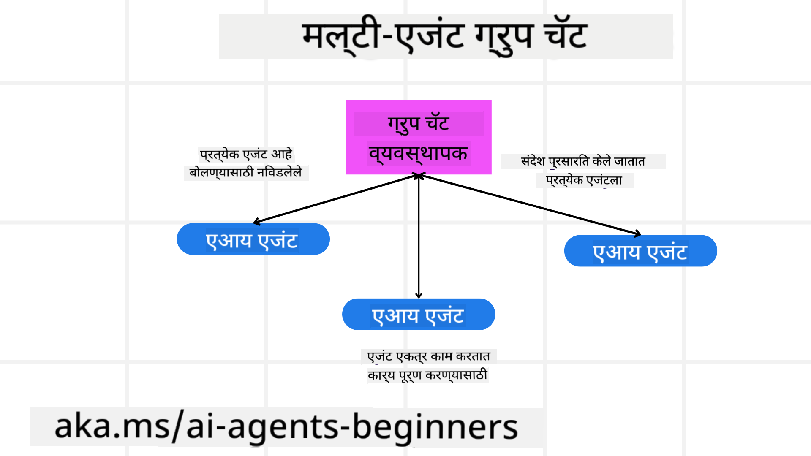
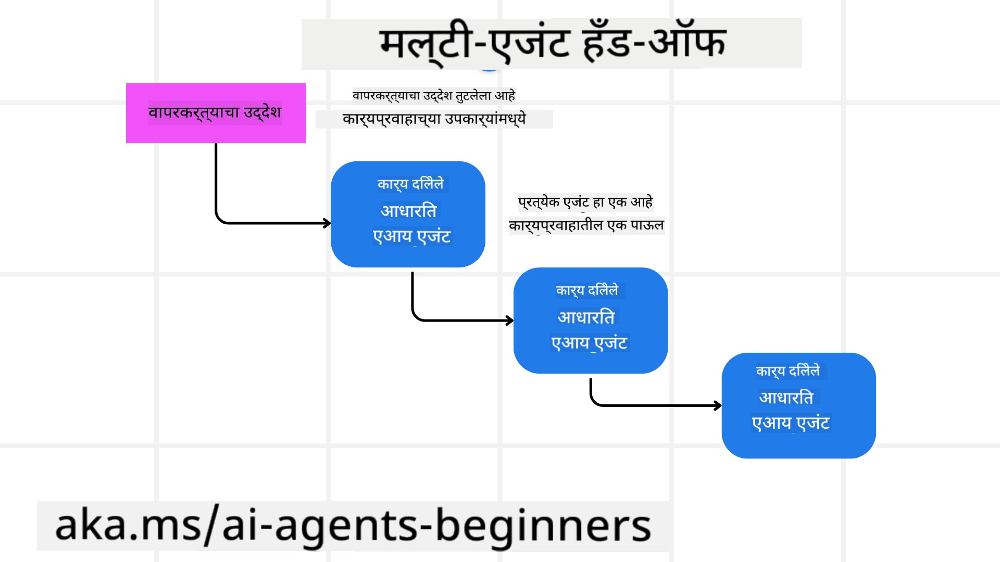

<!--
CO_OP_TRANSLATOR_METADATA:
{
  "original_hash": "c692a8975d7d5b99575a553de1c5e8a7",
  "translation_date": "2025-07-12T11:02:59+00:00",
  "source_file": "08-multi-agent/README.md",
  "language_code": "mr"
}
-->

> _(वरील प्रतिमा क्लिक करून या धड्याचा व्हिडिओ पाहा)_

# मल्टी-एजंट डिझाइन पॅटर्न्स

जसेच तुम्ही अनेक एजंट्सचा समावेश असलेल्या प्रोजेक्टवर काम सुरू करता, तुम्हाला मल्टी-एजंट डिझाइन पॅटर्नचा विचार करावा लागेल. मात्र, मल्टी-एजंट्स कधी वापरायचे आणि त्याचे फायदे काय आहेत हे लगेच स्पष्ट होणार नाही.

## परिचय

या धड्यात आपण खालील प्रश्नांची उत्तरे शोधणार आहोत:

- कोणत्या परिस्थितींमध्ये मल्टी-एजंट्स लागू होतात?
- एकाच एजंटने अनेक कामे करण्याऐवजी मल्टी-एजंट्स वापरण्याचे काय फायदे आहेत?
- मल्टी-एजंट डिझाइन पॅटर्न अंमलात आणण्यासाठी कोणते घटक आवश्यक आहेत?
- अनेक एजंट्स एकमेकांशी कसे संवाद साधत आहेत याची आपल्याला कशी माहिती मिळू शकते?

## शिकण्याचे उद्दिष्टे

हा धडा पूर्ण केल्यानंतर, तुम्ही सक्षम असाल:

- मल्टी-एजंट्स कुठल्या परिस्थितींमध्ये लागू होतात हे ओळखणे
- एकाच एजंटच्या तुलनेत मल्टी-एजंट्स वापरण्याचे फायदे समजून घेणे
- मल्टी-एजंट डिझाइन पॅटर्न अंमलात आणण्यासाठी आवश्यक घटक समजून घेणे

मोठ्या चित्राकडे पाहूया:

*मल्टी-एजंट्स हा एक डिझाइन पॅटर्न आहे जो अनेक एजंट्सना एकत्र काम करून एकसारखा उद्दिष्ट साध्य करण्याची परवानगी देतो.*

हा पॅटर्न रोबोटिक्स, स्वयंचलित प्रणाली आणि वितरित संगणन यांसारख्या विविध क्षेत्रांमध्ये मोठ्या प्रमाणावर वापरला जातो.

## मल्टी-एजंट्स कुठल्या परिस्थितींमध्ये लागू होतात

तर, कोणत्या परिस्थितींमध्ये मल्टी-एजंट्स वापरणे उपयुक्त ठरते? अनेक परिस्थिती आहेत जिथे अनेक एजंट्स वापरणे फायदेशीर ठरते, विशेषतः खालील बाबतीत:

- **मोठे कामाचे ओझे**: मोठे काम छोटे भागांमध्ये विभागून वेगवेगळ्या एजंट्सना दिले जाऊ शकते, ज्यामुळे समांतर प्रक्रिया होऊन काम लवकर पूर्ण होते. उदाहरणार्थ, मोठ्या प्रमाणावर डेटा प्रक्रिया करणे.
- **संकुल कामे**: मोठ्या कामांप्रमाणेच, संकुल कामे देखील छोटे उपकामांमध्ये विभागली जातात आणि प्रत्येक एजंट विशिष्ट भागासाठी तज्ञ असतो. उदाहरणार्थ, स्वयंचलित वाहनांमध्ये वेगवेगळे एजंट्स नेव्हिगेशन, अडथळा शोधणे आणि इतर वाहनांशी संवाद यासाठी काम करतात.
- **विविध कौशल्ये**: वेगवेगळ्या एजंट्सकडे विविध कौशल्ये असू शकतात, ज्यामुळे ते एका एजंटच्या तुलनेत काम अधिक प्रभावीपणे हाताळू शकतात. उदाहरणार्थ, आरोग्यसेवेत एजंट्स निदान, उपचार योजना आणि रुग्ण निरीक्षण यासाठी काम करतात.

## एकाच एजंटच्या तुलनेत मल्टी-एजंट्स वापरण्याचे फायदे

साध्या कामांसाठी एकच एजंट पुरेसा असू शकतो, पण जटिल कामांसाठी अनेक एजंट्स वापरण्याचे काही फायदे आहेत:

- **विशेषीकरण**: प्रत्येक एजंट विशिष्ट कामासाठी तज्ञ असू शकतो. एकाच एजंटमध्ये सर्व कामे करण्याचा प्रयत्न केल्यास तो गोंधळून जाऊ शकतो आणि कदाचित ज्या कामासाठी तो सर्वोत्तम नाही ते करेल.
- **स्केलेबिलिटी**: एकाच एजंटवर जास्त ओझे टाकण्याऐवजी नवीन एजंट्स जोडून प्रणाली वाढवणे सोपे होते.
- **दोष सहिष्णुता**: जर एक एजंट अयशस्वी झाला, तर इतर एजंट्स काम चालू ठेवू शकतात, ज्यामुळे प्रणाली विश्वसनीय राहते.

उदाहरणार्थ, एखाद्या वापरकर्त्यासाठी प्रवास बुक करण्याचा विचार करूया. एकाच एजंटला फ्लाइट शोधणे, हॉटेल बुक करणे आणि कार भाड्याने घेणे यासारखी सर्व कामे हाताळावी लागतील. यासाठी त्या एजंटकडे सर्व कामांसाठी साधने असणे आवश्यक आहे, ज्यामुळे प्रणाली जटिल आणि देखभाल करणे कठीण होऊ शकते. दुसरीकडे, मल्टी-एजंट प्रणालीमध्ये वेगवेगळे एजंट्स फ्लाइट शोधणे, हॉटेल बुक करणे आणि कार भाड्याने देणे यासाठी तज्ञ असतील. त्यामुळे प्रणाली अधिक मॉड्युलर, देखभाल करणे सोपे आणि स्केलेबल होईल.

हे तुलना करा एका लहान प्रवास कार्यालयाशी (mom-and-pop store) आणि एका फ्रँचायझी कार्यालयाशी. लहान कार्यालयात एकच एजंट सर्व कामे करेल, तर फ्रँचायझीमध्ये वेगवेगळे एजंट्स वेगवेगळ्या कामांसाठी असतील.

## मल्टी-एजंट डिझाइन पॅटर्न अंमलात आणण्यासाठी घटक

मल्टी-एजंट डिझाइन पॅटर्न अंमलात आणण्यापूर्वी, त्याचे घटक समजून घेणे आवश्यक आहे.

पुन्हा प्रवास बुकिंगच्या उदाहरणाकडे पाहूया. या प्रकरणात घटकांमध्ये समाविष्ट आहे:

- **एजंट संवाद**: फ्लाइट शोधणारा, हॉटेल बुक करणारा आणि कार भाड्याने देणारा एजंट्स वापरकर्त्याच्या पसंती आणि अटींबाबत माहिती शेअर करतात. तुम्हाला या संवादासाठी प्रोटोकॉल आणि पद्धती ठरवाव्या लागतील. उदाहरणार्थ, फ्लाइट एजंटने हॉटेल एजंटशी संवाद साधून हॉटेल बुकिंग फ्लाइटच्या तारखांशी जुळवून घ्यावी लागेल. म्हणजे कोणते एजंट्स माहिती शेअर करत आहेत आणि कशी शेअर करत आहेत हे ठरवणे आवश्यक आहे.
- **समन्वय यंत्रणा**: एजंट्सनी त्यांच्या क्रिया समन्वयित कराव्या लागतात जेणेकरून वापरकर्त्याच्या पसंती आणि अटी पूर्ण होतील. उदाहरणार्थ, वापरकर्त्याला विमानतळाजवळ हॉटेल हवे असू शकते, तर कार भाड्याने देणारा एजंट फक्त विमानतळावर उपलब्ध असू शकतो. त्यामुळे हॉटेल बुक करणारा एजंट कार भाड्याने देणाऱ्या एजंटशी समन्वय साधेल. म्हणजे एजंट्स कशा प्रकारे समन्वय साधत आहेत हे ठरवणे आवश्यक आहे.
- **एजंट आर्किटेक्चर**: एजंट्सना निर्णय घेण्याची आणि वापरकर्त्याशी संवादातून शिकण्याची अंतर्गत रचना असावी लागते. उदाहरणार्थ, फ्लाइट शोधणारा एजंट वापरकर्त्याच्या मागील पसंतीनुसार फ्लाइट शिफारस करण्यासाठी मशीन लर्निंग मॉडेल वापरू शकतो. म्हणजे एजंट्स कसे निर्णय घेतात आणि शिकतात हे ठरवणे आवश्यक आहे.
- **मल्टी-एजंट संवादांमध्ये दृश्यता**: अनेक एजंट्स एकमेकांशी कसे संवाद साधत आहेत याची माहिती असणे आवश्यक आहे. यासाठी लॉगिंग, मॉनिटरिंग, व्हिज्युअलायझेशन टूल्स आणि कार्यक्षमता मोजमाप वापरले जातात.
- **मल्टी-एजंट पॅटर्न्स**: मल्टी-एजंट सिस्टम्ससाठी केंद्रीकृत, विकेंद्रित आणि संकर आर्किटेक्चर यांसारखे विविध पॅटर्न्स असतात. तुमच्या वापरासाठी योग्य पॅटर्न निवडणे आवश्यक आहे.
- **मानव सहभाग**: बहुतेक वेळा, मानव सहभाग असतो आणि एजंट्सना कधी मानवी हस्तक्षेप मागायचा हे सांगणे आवश्यक असते. उदाहरणार्थ, वापरकर्ता विशिष्ट हॉटेल किंवा फ्लाइट मागतो ज्याची शिफारस एजंट्सनी केली नाही किंवा बुकिंगपूर्वी पुष्टी मागतो.

## मल्टी-एजंट संवादांमध्ये दृश्यता

अनेक एजंट्स एकमेकांशी कसे संवाद साधत आहेत याची दृश्यता असणे महत्त्वाचे आहे. ही दृश्यता डिबगिंग, ऑप्टिमायझेशन आणि संपूर्ण प्रणालीच्या कार्यक्षमतेसाठी आवश्यक आहे. यासाठी एजंट क्रिया आणि संवाद ट्रॅक करण्यासाठी साधने आणि तंत्रे वापरली जातात. यामध्ये लॉगिंग, मॉनिटरिंग, व्हिज्युअलायझेशन टूल्स आणि कार्यक्षमता मोजमाप यांचा समावेश होतो.

उदाहरणार्थ, प्रवास बुकिंगच्या प्रकरणात, तुम्ही प्रत्येक एजंटची स्थिती, वापरकर्त्याच्या पसंती आणि अटी, तसेच एजंट्समधील संवाद दाखवणारा डॅशबोर्ड तयार करू शकता. हा डॅशबोर्ड वापरकर्त्याच्या प्रवासाच्या तारखा, फ्लाइट एजंटने शिफारस केलेले फ्लाइट्स, हॉटेल एजंटने शिफारस केलेले हॉटेल्स आणि कार एजंटने शिफारस केलेल्या कार्स दाखवेल. त्यामुळे एजंट्स कसे संवाद साधत आहेत आणि वापरकर्त्याच्या गरजा पूर्ण होत आहेत का हे स्पष्ट दिसेल.

या पैलूंवर अधिक तपशीलवार पाहूया:

- **लॉगिंग आणि मॉनिटरिंग टूल्स**: प्रत्येक एजंटने केलेल्या क्रियांसाठी लॉगिंग करणे आवश्यक आहे. लॉगमध्ये एजंटचे नाव, क्रिया, वेळ आणि परिणाम यांचा समावेश असू शकतो. ही माहिती डिबगिंग, ऑप्टिमायझेशनसाठी उपयुक्त ठरते.
- **व्हिज्युअलायझेशन टूल्स**: एजंट्समधील संवाद अधिक समजण्यास सोपा करण्यासाठी व्हिज्युअलायझेशन टूल्स वापरले जातात. उदाहरणार्थ, एजंट्समधील माहिती प्रवाह दाखवणारा ग्राफ. यामुळे अडथळे, कार्यक्षमतेतील त्रुटी ओळखता येतात.
- **कार्यक्षमता मोजमाप**: मल्टी-एजंट सिस्टमची कार्यक्षमता मोजण्यासाठी वेळ, पूर्ण केलेल्या कामांची संख्या, शिफारशींची अचूकता यांसारखे मोजमाप वापरले जातात. यामुळे सुधारणा करण्याचे क्षेत्र ओळखता येते.

## मल्टी-एजंट पॅटर्न्स

मल्टी-एजंट अॅप्स तयार करण्यासाठी काही ठोस पॅटर्न्स पाहूया. येथे काही महत्त्वाचे पॅटर्न्स आहेत:

### ग्रुप चॅट

हा पॅटर्न तेव्हा उपयुक्त असतो जेव्हा तुम्हाला अनेक एजंट्सना एकत्र संवाद साधता यावा अशी ग्रुप चॅट अॅप तयार करायची असते. याचा वापर टीम सहयोग, ग्राहक समर्थन आणि सोशल नेटवर्किंगमध्ये होतो.

या पॅटर्नमध्ये प्रत्येक एजंट ग्रुप चॅटमधील एका वापरकर्त्याचे प्रतिनिधित्व करतो आणि संदेश विनिमयासाठी मेसेजिंग प्रोटोकॉल वापरला जातो. एजंट्स ग्रुपमध्ये संदेश पाठवू शकतात, प्राप्त करू शकतात आणि प्रतिसाद देऊ शकतात.

हा पॅटर्न केंद्रीकृत आर्किटेक्चर (सर्व संदेश मध्यवर्ती सर्व्हरमार्फत जातात) किंवा विकेंद्रित आर्किटेक्चर (संदेश थेट विनिमय होतात) वापरून अंमलात आणला जाऊ शकतो.

### हँड-ऑफ

हा पॅटर्न तेव्हा उपयुक्त असतो जेव्हा अनेक एजंट्स एकमेकांना कामे हस्तांतरित करू शकतात.

याचा वापर ग्राहक समर्थन, काम व्यवस्थापन आणि वर्कफ्लो ऑटोमेशनमध्ये होतो.

या पॅटर्नमध्ये प्रत्येक एजंट एखाद्या कामाचे किंवा वर्कफ्लोच्या टप्प्याचे प्रतिनिधित्व करतो आणि पूर्वनिर्धारित नियमांनुसार कामे दुसऱ्या एजंटला हस्तांतरित करतो.

### सहकार्यात्मक फिल्टरिंग

हा पॅटर्न तेव्हा उपयुक्त असतो जेव्हा अनेक एजंट्स एकत्र येऊन वापरकर्त्यांना शिफारसी देतात.

मल्टीपल एजंट्स सहकार्य करतात कारण प्रत्येक एजंटकडे वेगवेगळे कौशल्य असते आणि ते शिफारस प्रक्रियेत वेगवेगळ्या प्रकारे योगदान देतात.

उदाहरणार्थ, वापरकर्ता स्टॉक मार्केटमध्ये कोणता स्टॉक खरेदी करावा याबाबत शिफारस मागतो.

- **उद्योग तज्ञ**: एक एजंट विशिष्ट उद्योगाचा तज्ञ असू शकतो.
- **तांत्रिक विश्लेषण**: दुसरा एजंट तांत्रिक विश्लेषणात तज्ञ असू शकतो.
- **मूलभूत विश्लेषण**: आणखी एक एजंट मूलभूत विश्लेषणात तज्ञ असू शकतो. सहकार्य करून हे एजंट्स वापरकर्त्यास अधिक व्यापक शिफारस देऊ शकतात.

## उदाहरण: रिफंड प्रक्रिया

समजा ग्राहक एखाद्या उत्पादनासाठी रिफंड मागत आहे, या प्रक्रियेत अनेक एजंट्स सहभागी असू शकतात. चला या एजंट्सना दोन प्रकारात विभागूया: रिफंड प्रक्रियेसाठी विशिष्ट एजंट्स आणि सामान्य एजंट्स जे इतर प्रक्रियांमध्येही वापरले जाऊ शकतात.

**रिफंड प्रक्रियेसाठी विशिष्ट एजंट्स**:

खालील एजंट्स रिफंड प्रक्रियेत सहभागी असू शकतात:

- **ग्राहक एजंट**: ग्राहकाचे प्रतिनिधित्व करतो आणि रिफंड प्रक्रिया सुरू करतो.
- **विक्रेता एजंट**: विक्रेत्याचे प्रतिनिधित्व करतो आणि रिफंड प्रक्रिया हाताळतो.
- **पेमेंट एजंट**: पेमेंट प्रक्रियेसाठी जबाबदार असून ग्राहकाला पैसे परत करतो.
- **निर्णय एजंट**: रिफंड प्रक्रियेदरम्यान उद्भवणाऱ्या समस्यांचे निराकरण करतो.
- **अनुपालन एजंट**: नियम आणि धोरणांचे पालन सुनिश्चित करतो.

**सामान्य एजंट्स**:

हे एजंट्स तुमच्या व्यवसायाच्या इतर भागांमध्ये वापरले जाऊ शकतात.

- **शिपिंग एजंट**: उत्पादन विक्रेत्याकडे परत पाठवण्याची प्रक्रिया हाताळतो. हा एजंट रिफंड प्रक्रियेसाठी तसेच सामान्य शिपिंगसाठी वापरला जाऊ शकतो.
- **फीडबॅक एजंट**: ग्राहकांकडून अभिप्राय गोळा करतो. फीडबॅक कधीही घेतला जाऊ शकतो, फक्त रिफंड प्रक्रियेदरम्यान नाही.
- **एस्कलेशन एजंट**: समस्यांना उच्च स्तरावर पाठवतो. कोणत्याही प्रक्रियेत वापरता येतो.
- **सूचना एजंट**: रिफंड प्रक्रियेच्या विविध टप्प्यांवर ग्राहकाला सूचना पाठवतो.
- **विश्लेषण एजंट**: रिफंड प्रक्रियेतील डेटा विश्लेषित करतो.
- **ऑडिट एजंट**: रिफंड प्रक्रिया योग्यरित्या चालू आहे का याची तपासणी करतो.
- **अहवाल एजंट**: रिफंड प्रक्रियेवर अहवाल तयार करतो.
- **ज्ञान एजंट**: रिफंड आणि व्यवसायाच्या इतर भागांशी संबंधित माहितीचा ज्ञानकोश राखतो.
- **सुरक्षा एजंट**: रिफंड प्रक्रियेची सुरक्षा सुनिश्चित करतो.
- **गुणवत्ता एजंट**: रिफंड प्रक्रियेची गुणवत्ता सुनिश्चित करतो.

वरील यादीत अनेक एजंट्स आहेत, काही विशिष्ट रिफंड प्रक्रियेसाठी तर काही सामान्य व्यवसायासाठी. यामुळे तुम्हाला तुमच्या मल्टी-एजंट सिस्टममध्ये कोणते एजंट्स वापरायचे हे ठरवण्यास मदत होईल.

## Assignment
## मागील धडा

[योजना डिझाइन](../07-planning-design/README.md)

## पुढील धडा

[AI एजंटमधील मेटाकॉग्निशन](../09-metacognition/README.md)

**अस्वीकरण**:  
हा दस्तऐवज AI अनुवाद सेवा [Co-op Translator](https://github.com/Azure/co-op-translator) वापरून अनुवादित केला आहे. आम्ही अचूकतेसाठी प्रयत्नशील असलो तरी, कृपया लक्षात घ्या की स्वयंचलित अनुवादांमध्ये चुका किंवा अचूकतेच्या त्रुटी असू शकतात. मूळ दस्तऐवज त्याच्या स्थानिक भाषेत अधिकृत स्रोत मानला जावा. महत्त्वाच्या माहितीसाठी व्यावसायिक मानवी अनुवाद करण्याची शिफारस केली जाते. या अनुवादाच्या वापरामुळे उद्भवणाऱ्या कोणत्याही गैरसमजुती किंवा चुकीच्या अर्थलागी आम्ही जबाबदार नाही.