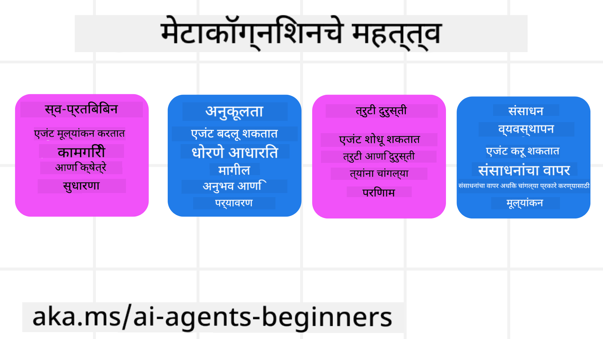
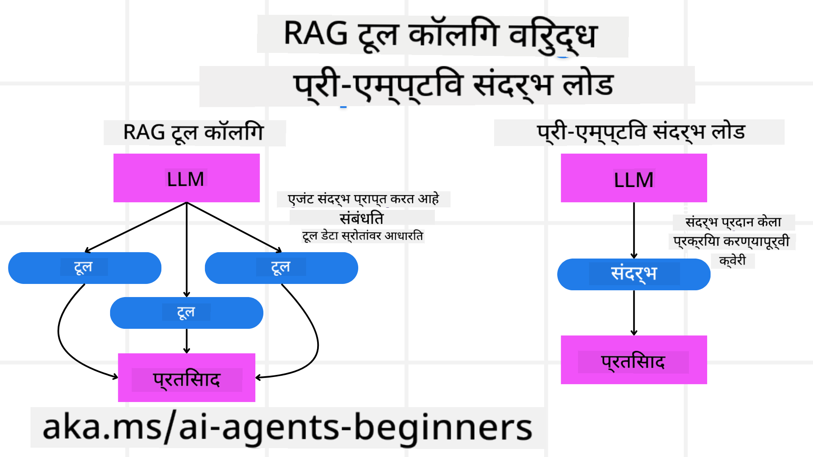

<!--
CO_OP_TRANSLATOR_METADATA:
{
  "original_hash": "8cbf460468c802c7994aa62e0e0779c9",
  "translation_date": "2025-07-12T12:17:52+00:00",
  "source_file": "09-metacognition/README.md",
  "language_code": "mr"
}
-->
[](https://youtu.be/His9R6gw6Ec?si=3_RMb8VprNvdLRhX)

> _(वरील प्रतिमा क्लिक करून या धड्याचा व्हिडिओ पाहा)_
# AI एजंटमधील मेटाकॉग्निशन

## परिचय

AI एजंटमधील मेटाकॉग्निशन या धड्यात तुमचे स्वागत आहे! हा अध्याय नवशिक्यांसाठी तयार केला आहे जे जाणून घेऊ इच्छितात की AI एजंट त्यांच्या स्वतःच्या विचार प्रक्रियेबद्दल कसे विचार करू शकतात. या धड्याच्या शेवटी, तुम्हाला महत्त्वाच्या संकल्पना समजतील आणि मेटाकॉग्निशन AI एजंट डिझाइनमध्ये कसे वापरायचे याचे व्यावहारिक उदाहरणे मिळतील.

## शिकण्याचे उद्दिष्टे

हा धडा पूर्ण केल्यानंतर, तुम्ही सक्षम असाल:

1. एजंट व्याख्यांमधील विचार प्रक्रियेतील पुनरावृत्तींचे परिणाम समजून घेणे.
2. स्वतःला सुधारणा करणाऱ्या एजंटसाठी नियोजन आणि मूल्यांकन तंत्र वापरणे.
3. कोडमध्ये बदल करून कार्ये पूर्ण करण्यास सक्षम स्वतःचे एजंट तयार करणे.

## मेटाकॉग्निशनची ओळख

मेटाकॉग्निशन म्हणजे स्वतःच्या विचारांबद्दल विचार करण्याची उच्चस्तरीय संज्ञानात्मक प्रक्रिया. AI एजंटसाठी याचा अर्थ म्हणजे स्वतःची जाणीव आणि पूर्वीच्या अनुभवांवर आधारित त्यांच्या क्रियांचे मूल्यांकन आणि समायोजन करणे. "विचारांबद्दल विचार" ही संकल्पना एजंटिक AI प्रणालींच्या विकासात महत्त्वाची आहे. यात AI प्रणाली त्यांच्या अंतर्गत प्रक्रियांबद्दल जागरूक असतात आणि त्यांच्या वर्तनाचे निरीक्षण, नियंत्रण आणि अनुकूलन करू शकतात. जसे आपण एखाद्या परिस्थितीचा आढावा घेतो किंवा एखाद्या समस्येकडे पाहतो, तसेच AI सुद्धा असे करू शकतो. ही आत्म-जाणीव AI प्रणालींना चांगले निर्णय घेण्यास, चुका ओळखण्यास आणि कालांतराने कार्यक्षमता सुधारण्यास मदत करते - ज्याचा संबंध ट्यूरिंग चाचणी आणि AI च्या भविष्यातील भूमिकेवर होणाऱ्या चर्चेशी आहे.

एजंटिक AI प्रणालींच्या संदर्भात, मेटाकॉग्निशन खालील आव्हानांवर मात करण्यात मदत करू शकते:
- पारदर्शकता: AI प्रणाली त्यांच्या विचारसरणी आणि निर्णयांची स्पष्टता देऊ शकतील याची खात्री करणे.
- विचारशक्ती: AI प्रणालींना माहिती एकत्र करून योग्य निर्णय घेण्याची क्षमता वाढवणे.
- अनुकूलन: नवीन वातावरण आणि बदलत्या परिस्थितींशी जुळवून घेण्याची क्षमता देणे.
- ग्रहणशक्ती: AI प्रणालींना त्यांच्या पर्यावरणातील माहिती अचूक ओळखण्याची आणि समजण्याची क्षमता सुधारणे.

### मेटाकॉग्निशन म्हणजे काय?

मेटाकॉग्निशन, म्हणजे "विचारांबद्दल विचार," ही एक उच्चस्तरीय संज्ञानात्मक प्रक्रिया आहे ज्यात स्वतःच्या संज्ञानात्मक प्रक्रियेची जाणीव आणि नियंत्रण असते. AI च्या क्षेत्रात, मेटाकॉग्निशन एजंट्सना त्यांच्या धोरणे आणि क्रिया मूल्यांकन करून सुधारण्याची क्षमता देते, ज्यामुळे समस्या सोडवण्याची आणि निर्णय घेण्याची क्षमता वाढते. मेटाकॉग्निशन समजून घेतल्यावर, तुम्ही असे AI एजंट डिझाइन करू शकता जे केवळ बुद्धिमानच नाही तर अधिक अनुकूलनीय आणि कार्यक्षम देखील असतील. खऱ्या मेटाकॉग्निशनमध्ये, AI स्पष्टपणे स्वतःच्या विचारांबद्दल विचार करत असतो.

उदाहरण: “मी स्वस्त फ्लाइट्स प्राधान्य दिली कारण... कदाचित थेट फ्लाइट्स चुकत आहेत, त्यामुळे मी पुन्हा तपास करतो.”
कसे किंवा का एखाद्या मार्गाची निवड केली हे लक्षात ठेवणे.
- चुकीचे निर्णय घेतल्याचे नोंदवणे कारण मागील वेळी वापरकर्त्याच्या पसंतींवर जास्त अवलंबून राहिले, त्यामुळे अंतिम शिफारशीऐवजी निर्णय घेण्याची धोरणे बदलणे.
- नमुने ओळखणे जसे, “जेव्हा वापरकर्ता ‘जास्त गर्दी’ म्हणतो, तेव्हा फक्त काही आकर्षणे काढून टाकणे नाही तर ‘टॉप आकर्षणे’ निवडण्याच्या माझ्या पद्धतीत त्रुटी आहे कारण मी नेहमी लोकप्रियतेनुसार क्रमवारी लावतो.”

### AI एजंटमधील मेटाकॉग्निशनचे महत्त्व

मेटाकॉग्निशन AI एजंट डिझाइनमध्ये खालील कारणांसाठी महत्त्वपूर्ण आहे:



- आत्मपरीक्षण: एजंट त्यांच्या कामगिरीचे मूल्यांकन करू शकतात आणि सुधारणा आवश्यक भाग ओळखू शकतात.
- अनुकूलता: एजंट पूर्वीच्या अनुभवांवर आणि बदलत्या परिस्थितींवर आधारित धोरणे बदलू शकतात.
- चुका सुधारणा: एजंट स्वयंचलितपणे चुका शोधून त्यांना दुरुस्त करू शकतात, ज्यामुळे परिणाम अधिक अचूक होतात.
- संसाधन व्यवस्थापन: एजंट त्यांच्या क्रिया नियोजन आणि मूल्यांकन करून वेळ आणि संगणकीय शक्ती यांसारख्या संसाधनांचा अधिक चांगला वापर करू शकतात.

## AI एजंटचे घटक

मेटाकॉग्निशन प्रक्रियेत प्रवेश करण्यापूर्वी, AI एजंटचे मूलभूत घटक समजून घेणे आवश्यक आहे. AI एजंट सामान्यतः खालील घटकांनी बनलेला असतो:

- व्यक्तिमत्व: एजंटची व्यक्तिमत्व आणि वैशिष्ट्ये, ज्यामुळे तो वापरकर्त्यांशी कसा संवाद साधतो हे ठरते.
- साधने: एजंट जे कार्य करू शकतो त्या क्षमता आणि फंक्शन्स.
- कौशल्ये: एजंटकडे असलेले ज्ञान आणि तज्ज्ञता.

हे घटक एकत्र काम करून एक "तज्ज्ञता युनिट" तयार करतात जे विशिष्ट कार्ये पार पाडू शकते.

**उदाहरण**:
एका ट्रॅव्हल एजंटचा विचार करा, जो फक्त तुमची सुट्टी नियोजित करत नाही तर रिअल-टाइम डेटा आणि मागील ग्राहकांच्या अनुभवांवर आधारित त्याचा मार्गही समायोजित करतो.

### उदाहरण: ट्रॅव्हल एजंट सेवेमध्ये मेटाकॉग्निशन

कल्पना करा की तुम्ही AI चालित ट्रॅव्हल एजंट सेवा डिझाइन करत आहात. हा एजंट, "ट्रॅव्हल एजंट," वापरकर्त्यांना त्यांच्या सुट्टीचे नियोजन करण्यात मदत करतो. मेटाकॉग्निशन समाविष्ट करण्यासाठी, ट्रॅव्हल एजंटला स्वतःची जाणीव आणि पूर्वीच्या अनुभवांवर आधारित त्याच्या क्रियांचे मूल्यांकन आणि समायोजन करणे आवश्यक आहे. मेटाकॉग्निशन कसे काम करू शकते ते पाहूया:

#### सध्याचे कार्य

वापरकर्त्याला पॅरिसला ट्रिप नियोजित करण्यात मदत करणे.

#### कार्य पूर्ण करण्याची पावले

1. **वापरकर्त्याच्या पसंती गोळा करा**: प्रवासाच्या तारखा, बजेट, आवडीनिवडी (उदा. संग्रहालये, खाद्यसंस्कृती, खरेदी) आणि कोणत्याही विशिष्ट गरजा विचारा.
2. **माहिती मिळवा**: फ्लाइट पर्याय, निवासस्थान, आकर्षणे आणि रेस्टॉरंट्स शोधा जे वापरकर्त्याच्या पसंतीशी जुळतात.
3. **शिफारसी तयार करा**: वैयक्तिकृत प्रवास आराखडा तयार करा ज्यात फ्लाइट तपशील, हॉटेल आरक्षणे आणि सुचवलेले उपक्रम असतील.
4. **अभिप्रायानुसार समायोजन करा**: वापरकर्त्याचा अभिप्राय घ्या आणि आवश्यक ते बदल करा.

#### आवश्यक संसाधने

- फ्लाइट आणि हॉटेल बुकिंग डेटाबेसची प्रवेश.
- पॅरिसमधील आकर्षणे आणि रेस्टॉरंट्सची माहिती.
- मागील संवादांमधून वापरकर्त्याचा अभिप्राय डेटा.

#### अनुभव आणि आत्मपरीक्षण

ट्रॅव्हल एजंट मेटाकॉग्निशन वापरून त्याच्या कामगिरीचे मूल्यांकन करतो आणि पूर्वीच्या अनुभवांमधून शिकतो. उदाहरणार्थ:

1. **वापरकर्त्याचा अभिप्राय विश्लेषण**: ट्रॅव्हल एजंट वापरकर्त्याचा अभिप्राय तपासतो की कोणत्या शिफारसींना चांगला प्रतिसाद मिळाला आणि कोणत्या नाही. त्यानुसार भविष्यातील शिफारसी सुधारतो.
2. **अनुकूलता**: जर वापरकर्त्याने पूर्वी गर्दीची नापसंती व्यक्त केली असेल, तर ट्रॅव्हल एजंट भविष्यात गर्दीच्या वेळात लोकप्रिय पर्यटन स्थळे सुचवणार नाही.
3. **चुका सुधारणा**: जर ट्रॅव्हल एजंटने पूर्वी एखाद्या बुकिंगमध्ये चूक केली असेल, जसे की पूर्ण बुक झालेला हॉटेल सुचवणे, तर तो पुढील वेळी उपलब्धता अधिक काटेकोरपणे तपासतो.

#### व्यावहारिक डेव्हलपर उदाहरण

मेटाकॉग्निशन समाविष्ट करताना ट्रॅव्हल एजंटचा कोड कसा दिसू शकतो याचे साधे उदाहरण:

```python
class Travel_Agent:
    def __init__(self):
        self.user_preferences = {}
        self.experience_data = []

    def gather_preferences(self, preferences):
        self.user_preferences = preferences

    def retrieve_information(self):
        # Search for flights, hotels, and attractions based on preferences
        flights = search_flights(self.user_preferences)
        hotels = search_hotels(self.user_preferences)
        attractions = search_attractions(self.user_preferences)
        return flights, hotels, attractions

    def generate_recommendations(self):
        flights, hotels, attractions = self.retrieve_information()
        itinerary = create_itinerary(flights, hotels, attractions)
        return itinerary

    def adjust_based_on_feedback(self, feedback):
        self.experience_data.append(feedback)
        # Analyze feedback and adjust future recommendations
        self.user_preferences = adjust_preferences(self.user_preferences, feedback)

# Example usage
travel_agent = Travel_Agent()
preferences = {
    "destination": "Paris",
    "dates": "2025-04-01 to 2025-04-10",
    "budget": "moderate",
    "interests": ["museums", "cuisine"]
}
travel_agent.gather_preferences(preferences)
itinerary = travel_agent.generate_recommendations()
print("Suggested Itinerary:", itinerary)
feedback = {"liked": ["Louvre Museum"], "disliked": ["Eiffel Tower (too crowded)"]}
travel_agent.adjust_based_on_feedback(feedback)
```

#### मेटाकॉग्निशन का महत्त्वाचे आहे

- **आत्मपरीक्षण**: एजंट त्यांच्या कामगिरीचे विश्लेषण करू शकतात आणि सुधारणा आवश्यक भाग ओळखू शकतात.
- **अनुकूलता**: अभिप्राय आणि बदलत्या परिस्थितींनुसार धोरणे बदलू शकतात.
- **चुका सुधारणा**: स्वयंचलितपणे चुका शोधून दुरुस्त करू शकतात.
- **संसाधन व्यवस्थापन**: वेळ आणि संगणकीय शक्ती यांसारख्या संसाधनांचा अधिक चांगला वापर करू शकतात.

मेटाकॉग्निशन समाविष्ट करून, ट्रॅव्हल एजंट अधिक वैयक्तिकृत आणि अचूक प्रवास शिफारसी देऊ शकतो, ज्यामुळे वापरकर्त्याचा अनुभव सुधारतो.

---

## 2. एजंटमधील नियोजन

नियोजन हे AI एजंटच्या वर्तनाचा एक महत्त्वाचा घटक आहे. यात उद्दिष्ट साध्य करण्यासाठी आवश्यक पावले आखणे, सध्याच्या स्थिती, संसाधने आणि संभाव्य अडथळे विचारात घेणे यांचा समावेश होतो.

### नियोजनाचे घटक

- **सध्याचे कार्य**: कार्य स्पष्टपणे परिभाषित करा.
- **कार्य पूर्ण करण्याची पावले**: कार्य सोप्या टप्प्यांमध्ये विभागा.
- **आवश्यक संसाधने**: आवश्यक संसाधने ओळखा.
- **अनुभव**: नियोजनासाठी पूर्वीच्या अनुभवांचा वापर करा.

**उदाहरण**:
ट्रॅव्हल एजंटला वापरकर्त्याच्या प्रवासाचे नियोजन प्रभावीपणे करण्यासाठी खालील पावले घ्यावी लागतात:

### ट्रॅव्हल एजंटसाठी पावले

1. **वापरकर्त्याच्या पसंती गोळा करा**
   - प्रवासाच्या तारखा, बजेट, आवडीनिवडी आणि कोणत्याही विशिष्ट गरजा विचारा.
   - उदाहरणे: "तुम्ही कधी प्रवास करणार आहात?" "तुमचा बजेट किती आहे?" "तुम्हाला सुट्टीत कोणत्या उपक्रमांची आवड आहे?"

2. **माहिती मिळवा**
   - वापरकर्त्याच्या पसंतीनुसार प्रवास पर्याय शोधा.
   - **फ्लाइट्स**: वापरकर्त्याच्या बजेट आणि प्रवासाच्या तारखांमध्ये उपलब्ध फ्लाइट्स शोधा.
   - **निवासस्थान**: स्थान, किंमत आणि सुविधा यानुसार हॉटेल किंवा भाड्याने घर शोधा.
   - **आकर्षणे आणि रेस्टॉरंट्स**: वापरकर्त्याच्या आवडीनुसार लोकप्रिय आकर्षणे, उपक्रम आणि जेवणाच्या ठिकाणांची ओळख करा.

3. **शिफारसी तयार करा**
   - मिळालेली माहिती वैयक्तिकृत प्रवास आराखड्यात एकत्र करा.
   - फ्लाइट पर्याय, हॉटेल आरक्षणे आणि सुचवलेले उपक्रम यांचा तपशील द्या, वापरकर्त्याच्या पसंतीनुसार सानुकूल करा.

4. **प्रवास आराखडा वापरकर्त्यास सादर करा**
   - प्रस्तावित प्रवास आराखडा वापरकर्त्यास पुनरावलोकनासाठी द्या.
   - उदाहरण: "पॅरिससाठी तुमच्या प्रवासाचा प्रस्तावित आराखडा येथे आहे. यात फ्लाइट तपशील, हॉटेल बुकिंग आणि शिफारस केलेले उपक्रम व रेस्टॉरंट्स यांचा समावेश आहे. तुमचे मत सांगा!"

5. **अभिप्राय गोळा करा**
   - प्रस्तावित आराखड्याबाबत वापरकर्त्याचा अभिप्राय विचारा.
   - उदाहरणे: "तुम्हाला फ्लाइट पर्याय कसे वाटले?" "हॉटेल तुमच्या गरजांसाठी योग्य आहे का?" "कोणतेही उपक्रम जोडायचे किंवा काढायचे आहेत का?"

6. **अभिप्रायानुसार समायोजन करा**
   - वापरकर्त्याच्या अभिप्रायानुसार आराखडा बदला.
   - फ्लाइट, निवासस्थान आणि उपक्रमांच्या शिफारसीत आवश्यक बदल करा.

7. **अंतिम पुष्टी**
   - अद्ययावत आराखडा वापरकर्त्यास अंतिम पुष्टीसाठी सादर करा.
   - उदाहरण: "तुमच्या अभिप्रायानुसार बदल केले आहेत. अद्ययावत आराखडा येथे आहे. सर्व काही ठीक आहे का?"

8. **बुकिंग आणि पुष्टीकरण**
   - वापरकर्त्याच्या मंजुरीनंतर फ्लाइट, निवासस्थान आणि पूर्वनियोजित उपक्रमांची बुकिंग करा.
   - पुष्टीकरण तपशील वापरकर्त्यास पाठवा.

9. **सतत सहाय्य पुरवा**
   - प्रवासादरम्यान किंवा आधी कोणत्याही बदलांसाठी किंवा अतिरिक्त विनंत्यांसाठी वापरकर्त्याला मदत करण्यासाठी उपलब्ध रहा.
   - उदाहरण: "तुमच्या प्रवासादरम्यान आणखी काही मदत हवी असल्यास, मला कधीही संपर्क करा!"

### उदाहरण संवाद

```python
class Travel_Agent:
    def __init__(self):
        self.user_preferences = {}
        self.experience_data = []

    def gather_preferences(self, preferences):
        self.user_preferences = preferences

    def retrieve_information(self):
        flights = search_flights(self.user_preferences)
        hotels = search_hotels(self.user_preferences)
        attractions = search_attractions(self.user_preferences)
        return flights, hotels, attractions

    def generate_recommendations(self):
        flights, hotels, attractions = self.retrieve_information()
        itinerary = create_itinerary(flights, hotels, attractions)
        return itinerary

    def adjust_based_on_feedback(self, feedback):
        self.experience_data.append(feedback)
        self.user_preferences = adjust_preferences(self.user_preferences, feedback)

# Example usage within a booing request
travel_agent = Travel_Agent()
preferences = {
    "destination": "Paris",
    "dates": "2025-04-01 to 2025-04-10",
    "budget": "moderate",
    "interests": ["museums", "cuisine"]
}
travel_agent.gather_preferences(preferences)
itinerary = travel_agent.generate_recommendations()
print("Suggested Itinerary:", itinerary)
feedback = {"liked": ["Louvre Museum"], "disliked": ["Eiffel Tower (too crowded)"]}
travel_agent.adjust_based_on_feedback(feedback)
```

## 3. सुधारात्मक RAG प्रणाली

सर्वप्रथम, RAG टूल आणि प्री-एम्प्टिव्ह कॉन्टेक्स्ट लोड यातील फरक समजून घेऊया.



### Retrieval-Augmented Generation (RAG)

RAG ही पुनर्प्राप्ती प्रणाली आणि जनरेटिव्ह मॉडेल यांचा संगम आहे. जेव्हा एखादा प्रश्न विचारला जातो, तेव्हा पुनर्प्राप्ती प्रणाली बाह्य स्रोताकडून संबंधित दस्तऐवज किंवा डेटा आणते, आणि हा डेटा जनरेटिव्ह मॉडेलच्या इनपुटमध्ये वाढवला जातो. यामुळे मॉडेल अधिक अचूक आणि संदर्भानुसार योग्य प्रतिसाद तयार करू शकते.

RAG प्रणालीमध्ये, एजंट ज्ञानसंग्रहातून संबंधित माहिती मिळवतो आणि त्याचा वापर योग्य प्रतिसाद किंवा क्रिया तयार करण्यासाठी करतो.

### सुधारात्मक RAG दृष्टिकोन

सुधारात्मक RAG दृष्टिकोन RAG तंत्रांचा वापर करून चुका दुरुस्त करण्यावर आणि AI एजंटची अचूकता वाढवण्यावर लक्ष केंद्रित करतो. यात समाविष्ट आहे:

1. **प्रॉम्प्टिंग तंत्र**: एजंटला संबंधित माहिती मिळवण्यासाठी विशिष्ट प्रॉम्प्ट वापरणे.
2. **साधन**: एजंटला मिळालेल्या माहितीची सुसंगतता तपासण्यासाठी आणि अचूक प्रतिसाद तयार करण्यासाठी अल्गोरिदम आणि यंत्रणा वापरणे.
3. **मूल्यांकन**: एजंटच्या कामगिरीचे सतत परीक्षण करून त्याची अचूकता आणि कार्यक्षमता सुधारण्यासाठी बदल करणे.

#### उदाहरण: शोध एजंटमधील सुधारात्मक RAG

वेबवरून माहिती मिळवणाऱ्या शोध एजंटचा विचार करा जो वापरकर्त्याच्या प्रश्नांची उत्तरे देतो. सुधारात्मक RAG दृष्टिकोनात समाविष्ट असू शकते:

1. **प्रॉम्प्टिंग तंत्र**: वापरकर्त्याच्या इनपुटवर आधारित शोध प्रश्न तयार करणे.
2. **साधन**: नैसर्गिक भाषा प्रक्रिया आणि मशीन लर्निंग अल्गोरिदम वापरून शोध निकालांचे क्रमवारीकरण आणि फिल्टरिंग करणे.
3. **मूल्यांकन**: वापरकर्त्याचा अभिप्राय विश्लेषित करून मिळालेल्या माहितीतील चुका शोधणे आणि दुरुस्त करणे.

### ट्रॅव्हल एजंटमधील सुधारात्मक RAG

सुधारात्मक RAG (Retrieval-Augmented Generation) AI च्या माहिती मिळवण्याची आणि तयार करण्याची क्षमता सुधारते, तसेच चुका दुरुस्त करते. पाहूया ट्रॅव्हल एजंट कसा सुधारात्मक RAG दृष्टिकोन वापरून अधिक अचूक आणि संबंधित प्रवास शिफारसी देऊ शकतो.

यामध्ये समाविष्ट आहे:

- **प्रॉम्प्टिंग तंत्र:** एजंटला संबंधित माहिती मिळवण्यासाठी विशिष्ट प्रॉम्प्ट वापरणे.
- **साधन:** एजंटला मिळालेल्या माहितीची सुसंगतता तपासण्यासाठी आणि अचूक प्रतिसाद तयार करण्यासाठी अल्गोरिदम आणि यंत्रणा वापरणे.
- **मूल्यांकन:** एजंटच्या कामगिरी
### प्री-एम्प्टिव कॉन्टेक्स्ट लोड

प्री-एम्प्टिव कॉन्टेक्स्ट लोड म्हणजे क्वेरी प्रक्रिया करण्यापूर्वी संबंधित संदर्भ किंवा पार्श्वभूमीची माहिती मॉडेलमध्ये लोड करणे. याचा अर्थ मॉडेलला सुरुवातीपासूनच ही माहिती उपलब्ध असते, ज्यामुळे त्याला अधिक माहितीपूर्ण उत्तर तयार करण्यास मदत होते आणि प्रक्रियेदरम्यान अतिरिक्त डेटा शोधण्याची गरज कमी होते.

खाली Python मध्ये ट्रॅव्हल एजंट अॅप्लिकेशनसाठी प्री-एम्प्टिव कॉन्टेक्स्ट लोड कसा दिसू शकतो याचे एक सोपे उदाहरण दिले आहे:

#### स्पष्टीकरण

1. **इनिशियलायझेशन (`__init__` मेथड)**: `TravelAgent` क्लासमध्ये पॅरिस, टोकियो, न्यू यॉर्क, सिडनी यांसारख्या लोकप्रिय ठिकाणांची माहिती असलेली एक डिक्शनरी प्रीलोड केली जाते. या डिक्शनरीमध्ये देश, चलन, भाषा आणि प्रमुख आकर्षणे यांचा समावेश असतो.

2. **माहिती मिळवणे (`get_destination_info` मेथड)**: जेव्हा वापरकर्ता एखाद्या विशिष्ट ठिकाणाबद्दल विचारतो, तेव्हा `get_destination_info` मेथड प्रीलोड केलेल्या संदर्भ डिक्शनरीमधून संबंधित माहिती मिळवते.

संदर्भ प्रीलोड केल्यामुळे, ट्रॅव्हल एजंट अॅप्लिकेशन वापरकर्त्याच्या क्वेरींना जलद प्रतिसाद देऊ शकते, बाह्य स्रोताकडून रिअल-टाइममध्ये माहिती शोधण्याची गरज नाही. त्यामुळे अॅप्लिकेशन अधिक कार्यक्षम आणि प्रतिसादक्षम होते.

### उद्दिष्टासह योजना तयार करून पुनरावृत्ती करणे

एखाद्या उद्दिष्टासह योजना तयार करणे म्हणजे सुरुवातीला स्पष्ट ध्येय किंवा अपेक्षित निकाल निश्चित करणे. हे ध्येय ठरवल्यामुळे मॉडेलला पुनरावृत्ती प्रक्रियेदरम्यान मार्गदर्शक तत्व म्हणून वापरता येते. त्यामुळे प्रत्येक पुनरावृत्तीमध्ये अपेक्षित निकाल जवळ जातो, ज्यामुळे प्रक्रिया अधिक कार्यक्षम आणि लक्ष केंद्रीत होते.

खाली Python मध्ये ट्रॅव्हल एजंटसाठी उद्दिष्टासह योजना तयार करून पुनरावृत्ती कशी करावी याचे उदाहरण दिले आहे:

### परिस्थिती

ट्रॅव्हल एजंट एका ग्राहकासाठी सानुकूलित सुट्टीची योजना तयार करू इच्छितो. उद्दिष्ट म्हणजे ग्राहकाच्या पसंती आणि बजेटनुसार त्याच्या समाधानाला जास्तीत जास्त वाढवणारी प्रवास योजना तयार करणे.

### टप्पे

1. ग्राहकाच्या पसंती आणि बजेटची व्याख्या करा.
2. या पसंतींवर आधारित प्राथमिक योजना तयार करा.
3. ग्राहकाच्या समाधानासाठी योजना पुनरावृत्ती करून सुधारित करा.

#### Python कोड

#### कोड स्पष्टीकरण

1. **इनिशियलायझेशन (`__init__` मेथड)**: `TravelAgent` क्लास संभाव्य प्रवास स्थळांची यादी घेऊन इनिशियलाइझ केला जातो, ज्यात नाव, खर्च आणि क्रियाकलाप प्रकार यांसारखे गुणधर्म असतात.

2. **योजना तयार करणे (`bootstrap_plan` मेथड)**: ग्राहकाच्या पसंती आणि बजेटनुसार प्राथमिक प्रवास योजना तयार केली जाते. यादीतील प्रवास स्थळे तपासून, जर ती ग्राहकाच्या पसंतीशी जुळत असतील आणि बजेटमध्ये बसत असतील तर ती योजनेत समाविष्ट केली जातात.

3. **पसंत जुळवणे (`match_preferences` मेथड)**: एखादे ठिकाण ग्राहकाच्या पसंतीशी जुळते का हे तपासले जाते.

4. **योजना पुनरावृत्ती करणे (`iterate_plan` मेथड)**: प्राथमिक योजनेतील प्रत्येक ठिकाणाला अधिक चांगल्या पर्यायाने बदलण्याचा प्रयत्न करून योजना सुधारित केली जाते, ग्राहकाच्या पसंती आणि बजेटच्या मर्यादांचा विचार करून.

5. **खर्च मोजणे (`calculate_cost` मेथड)**: सध्याच्या योजनेचा एकूण खर्च, नवीन ठिकाण समाविष्ट केल्यास किती होईल हे मोजले जाते.

#### उदाहरण वापर

- **प्राथमिक योजना**: ट्रॅव्हल एजंट ग्राहकाच्या साईटसीइंगसाठी पसंती आणि $2000 च्या बजेटवर आधारित प्राथमिक योजना तयार करतो.
- **सुधारित योजना**: ट्रॅव्हल एजंट योजना पुनरावृत्ती करून ग्राहकाच्या पसंती आणि बजेटनुसार ती सुधारित करतो.

उद्दिष्टासह योजना तयार करून आणि पुनरावृत्ती करून, ट्रॅव्हल एजंट ग्राहकासाठी सानुकूलित आणि ऑप्टिमाइझ्ड प्रवास योजना तयार करू शकतो. या पद्धतीने सुरुवातीपासूनच योजना ग्राहकाच्या पसंती आणि बजेटशी सुसंगत राहते आणि प्रत्येक पुनरावृत्तीने ती अधिक सुधारते.

### LLM चा पुनर्रँकिंग आणि स्कोअरिंगसाठी फायदा घेणे

मोठे भाषा मॉडेल (LLM) पुनर्रँकिंग आणि स्कोअरिंगसाठी वापरले जाऊ शकतात, ज्यामुळे मिळालेल्या दस्तऐवजांची किंवा तयार केलेल्या उत्तरांची सुसंगतता आणि गुणवत्ता तपासली जाते. हे कसे कार्य करते:

**रिट्रीव्हल:** सुरुवातीला क्वेरीवर आधारित संभाव्य दस्तऐवज किंवा उत्तरांची यादी मिळवली जाते.

**पुनर्रँकिंग:** LLM या उमेदवारांची सुसंगतता आणि गुणवत्ता तपासून त्यांना पुन्हा क्रमवारी लावते. यामुळे सर्वात सुसंगत आणि दर्जेदार माहिती प्रथम सादर केली जाते.

**स्कोअरिंग:** LLM प्रत्येक उमेदवाराला त्याच्या सुसंगतता आणि गुणवत्तेनुसार गुण देतो. यामुळे सर्वोत्तम उत्तर किंवा दस्तऐवज निवडणे सोपे होते.

LLM चा पुनर्रँकिंग आणि स्कोअरिंगसाठी वापर केल्याने प्रणाली अधिक अचूक आणि संदर्भानुसार योग्य माहिती देऊ शकते, ज्यामुळे वापरकर्त्याचा अनुभव सुधारतो.

खाली Python मध्ये वापरकर्त्याच्या पसंतीनुसार प्रवास स्थळांची पुनर्रँकिंग आणि स्कोअरिंग करण्यासाठी ट्रॅव्हल एजंट LLM कसा वापरू शकतो याचे उदाहरण दिले आहे:

#### परिस्थिती - पसंतीनुसार प्रवास

ट्रॅव्हल एजंट ग्राहकाच्या पसंतीनुसार सर्वोत्तम प्रवास स्थळे सुचवू इच्छितो. LLM प्रवास स्थळांची पुनर्रँकिंग आणि स्कोअरिंग करण्यात मदत करेल, ज्यामुळे सर्वात सुसंगत पर्याय सादर होतील.

#### टप्पे:

1. वापरकर्त्याच्या पसंती गोळा करा.
2. संभाव्य प्रवास स्थळांची यादी मिळवा.
3. LLM वापरून वापरकर्त्याच्या पसंतीनुसार स्थळांची पुनर्रँकिंग आणि स्कोअरिंग करा.

Azure OpenAI Services वापरण्यासाठी खालीलप्रमाणे आधीचे उदाहरण अपडेट करा:

#### आवश्यकताः

1. Azure सदस्यता असणे आवश्यक आहे.
2. Azure OpenAI रिसोर्स तयार करा आणि API की मिळवा.

#### Python कोड उदाहरण

#### कोड स्पष्टीकरण - Preference Booker

1. **इनिशियलायझेशन**: `TravelAgent` क्लास संभाव्य प्रवास स्थळांची यादी घेऊन इनिशियलाइझ केला जातो, ज्यात नाव आणि वर्णन यांसारखे गुणधर्म असतात.

2. **शिफारसी मिळवणे (`get_recommendations` मेथड)**: वापरकर्त्याच्या पसंतीनुसार Azure OpenAI सेवेसाठी प्रॉम्प्ट तयार करतो आणि HTTP POST विनंती करून पुनर्रँकिंग आणि स्कोअरिंग केलेली स्थळे मिळवतो.

3. **प्रॉम्प्ट तयार करणे (`generate_prompt` मेथड)**: वापरकर्त्याच्या पसंती आणि प्रवास स्थळांची यादी समाविष्ट करणारा Azure OpenAI साठी प्रॉम्प्ट तयार करतो. हा प्रॉम्प्ट मॉडेलला स्थळांची पुनर्रँकिंग आणि स्कोअरिंग करण्यासाठी मार्गदर्शन करतो.

4. **API कॉल**: `requests` लायब्ररी वापरून Azure OpenAI API ला HTTP POST विनंती पाठवली जाते. प्रतिसादात पुनर्रँकिंग आणि स्कोअरिंग केलेली स्थळे मिळतात.

5. **उदाहरण वापर**: ट्रॅव्हल एजंट वापरकर्त्याच्या साईटसीइंग आणि विविध संस्कृतीतील रस यांसारख्या पसंती गोळा करतो आणि Azure OpenAI सेवा वापरून पुनर्रँकिंग आणि स्कोअरिंग केलेल्या शिफारसी मिळवतो.

`your_azure_openai_api_key` आणि `https://your-endpoint.com/...` या जागी तुमची खरी Azure OpenAI API की आणि एन्डपॉइंट URL वापरा.

LLM चा पुनर्रँकिंग आणि स्कोअरिंगसाठी वापर केल्याने ट्रॅव्हल एजंट ग्राहकांना अधिक वैयक्तिकृत आणि सुसंगत प्रवास शिफारसी देऊ शकतो, ज्यामुळे त्यांचा अनुभव सुधारतो.

### RAG: प्रॉम्प्टिंग तंत्रज्ञान विरुद्ध टूल

Retrieval-Augmented Generation (RAG) हे AI एजंट्सच्या विकासात प्रॉम्प्टिंग तंत्रज्ञान आणि टूल दोन्ही स्वरूपात वापरले जाऊ शकते. या दोघांतील फरक समजून घेणे RAG चा अधिक प्रभावी वापर करण्यास मदत करते.

#### RAG प्रॉम्प्टिंग तंत्रज्ञान म्हणून

**हे काय आहे?**

- प्रॉम्प्टिंग तंत्रज्ञान म्हणून, RAG विशिष्ट क्वेरी किंवा प्रॉम्प्ट तयार करून मोठ्या डेटाबेसमधून संबंधित माहिती शोधण्यास मदत करते. नंतर ही माहिती वापरून उत्तर किंवा क्रिया तयार केली जाते.

**कसे कार्य करते:**

1. **प्रॉम्प्ट तयार करणे**: कार्य किंवा वापरकर्त्याच्या इनपुटनुसार चांगले रचलेले प्रॉम्प्ट तयार करा.
2. **माहिती शोधणे**: प्रॉम्प्ट वापरून आधीपासून असलेल्या ज्ञानसंग्रहातून संबंधित माहिती शोधा.
3. **उत्तर तयार करणे**: मिळालेली माहिती जनरेटिव्ह AI मॉडेल्ससह एकत्र करून सुसंगत आणि संपूर्ण उत्तर तयार करा.

**ट्रॅव्हल एजंटमध्ये उदाहरण:**

- वापरकर्ता इनपुट: "मला पॅरिसमधील संग्रहालये पाहायची आहेत."
- प्रॉम्प्ट: "पॅरिसमधील प्रमुख संग्रहालये शोधा."
- मिळालेली माहिती: Louvre Museum, Musée d'Orsay इत्यादींची माहिती.
- तयार उत्तर: "पॅरिसमधील काही प्रमुख संग्रहालये आहेत: Louvre Museum, Musée d'Orsay, आणि Centre Pompidou."

#### RAG टूल म्हणून

**हे काय आहे?**

- टूल म्हणून, RAG एक एकत्रित प्रणाली आहे जी शोध आणि जनरेशन प्रक्रिया स्वयंचलित करते, ज्यामुळे विकसकांना प्रत्येक क्वेरीसाठी प्रॉम्प्ट तयार न करता जटिल AI कार्ये सुलभपणे अंमलात आणता येतात.

**कसे कार्य करते:**

1. **एकत्रीकरण**: AI एजंटच्या आर्किटेक्चरमध्ये RAG समाविष्ट करा, ज्यामुळे तो स्वयंचलितपणे शोध आणि जनरेशन हाताळू शकतो.
2. **स्वयंचलन**: वापरकर्त्याचा इनपुट मिळाल्यानंतर अंतिम उत्तर तयार होईपर्यंत संपूर्ण प्रक्रिया टूल स्वयंचलितपणे पार पाडते.
3. **कार्यक्षमता**: शोध आणि जनरेशन प्रक्रिया सुलभ करून एजंटची कार्यक्षमता वाढवते, ज्यामुळे जलद आणि अचूक प्रतिसाद मिळतात.

**ट्रॅव्हल एजंटमध्ये उदाहरण:**

- वापरकर्ता इनपुट: "मला पॅरिसमधील संग्रहालये पाहायची आहेत."
- RAG टूल: संग्रहालयांची माहिती स्वयंचलितपणे शोधून उत्तर तयार करते.
- तयार उत्तर: "पॅरिसमधील काही प्रमुख संग्रहालये आहेत: Louvre Museum, Musée d'Orsay, आणि Centre Pompidou."

### तुलना

| पैलू                  | प्रॉम्प्टिंग तंत्रज्ञान                                  | टूल                                                  |
|-----------------------|---------------------------------------------------------|-------------------------------------------------------|
| **मॅन्युअल विरुद्ध स्वयंचलित** | प्रत्येक क्वेरीसाठी मॅन्युअल प्रॉम्प्ट तयार करणे          | शोध आणि जनरेशन प्रक्रिया स्वयंचलित करणे               |
| **नियंत्रण**           | शोध प्रक्रियेवर अधिक नियंत्रण देते                      | शोध आणि जनरेशन सुलभ आणि स्वयंचलित करते               |
| **लवचिकता**            | विशिष्ट गरजांनुसार सानुकूल प्रॉम्प्ट तयार करता येतात   | मोठ्या प्रमाणावर वापरासाठी अधिक कार्यक्षम               |
| **संकुलता**            | प्रॉम्प्ट तयार करण्यासाठी अधिक मेहनत लागते               | AI एजंटच्या आर्किटेक्चरमध्ये सहज समाकलित करता येते   |

### व्यावहारिक उदाहरणे

**प्रॉम्प्टिंग तंत्रज्ञान उदाहरण:**

**टूल उदाहरण:**

### सुसंगतता मूल्यांकन

सुसंगतता मूल्यांकन हे AI एजंटच्या कार्यक्षमतेचा एक महत्त्वाचा भाग आहे. यामुळे एजंटने मिळवलेली आणि तयार केलेली माहिती वापरकर्त्यासाठी योग्य, अचूक आणि उपयुक्त आहे याची खात्री होते. चला पाहूया AI एजंटमध्ये सुसंगतता कशी मूल्यांकन करायची, व्यावहारिक उदाहरणे आणि तंत्रांसह.

#### सुसंगतता मूल्यांकनातील मुख्य संकल्पना

1. **संदर्भ जागरूकता**:
   - एजंटने वापरकर्त्याच्या क्वेरीचा संदर्भ समजून घेणे आवश्यक आहे, जेणेकरून संबंधित माहिती मिळवता येईल.
   - उदाहरण: "पॅरिसमधील सर्वोत्तम रेस्टॉरंट्स" विचारल्यास, एजंटने वापरकर्त्याच्या आवडीनिवडी जसे की स्वयंपाक प्रकार आणि बजेट लक्षात घ्यावे.

2. **अचूकता**:
   - एजंटने दिलेली माहिती तथ्यात्मकदृष्ट्या बरोबर आणि अद्ययावत असावी.
   - उदाहरण: सध्या खुले असलेली आणि चांगल्या पुनरावलोकनांची रेस्टॉरंट्स सुचवणे, जुनी किंवा बंद झालेली नाही.

3. **वापरकर्त्याचा हेतू**:
   - एजंटने क्वेरीमागील वापरकर्त्याचा हेतू समजून घेऊन सर्वात सुसंगत माहिती द्यावी.
   - उदाहरण: "बजेट-फ्रेंडली हॉटेल्स" विचारल्यास, स्वस्त पर्याय प्राधान्याने सुचवणे.

4. **फीडबॅक लूप**:
   - वापरकर्त्याचा फीडबॅक सतत गोळा करून आणि विश्लेषण करून एजंट सुसंगतता मूल्यांकन सुधारू शकतो.
   - उदाहरण: मागील शिफारसींवर वापरकर्त्याचे रेटिंग आणि अभिप्राय समाविष्ट करणे.

#### सुसंगतता मूल्यांकनासाठी व्यावहारिक तंत्रे

1. **सुसंगतता गुणांकन**:
   - प्रत्येक मिळालेल्या आयटमला वापरकर्त्याच्या क्वेरी आणि पसंतीशी किती जुळते यानुसार गुण द्या.
   - उदाहरण:

2. **फिल्टरिंग आणि रँकिंग**:
   - अप्रासंगिक आयटम काढून टाका आणि उरलेल्या आयटमना त्यांच्या सुसंगतता गुणांनुसार क्रमवारी लावा.
   - उदाहरण:

3. **नॅचरल लँग्वेज प्रोसेसिंग (NLP)**:
   - वापरकर्त्याच्या क्वेरी समजून घेण्यासाठी NLP तंत्र वापरा आणि संबंधित माहिती मिळवा.
   - उदाहरण:

4. **वापरकर्ता फीडबॅक समाकलन**:
   - दिलेल्या शिफारसींवर वापरकर्त्याचा फीडबॅक गोळा करा आणि भविष्यातील सुसंगतता मूल्यांकन सुधारण्यासाठी वापरा.
   - उदाहरण:

#### उदाहरण: ट्रॅव्हल एजंटमध्ये सुसंगतता मूल्यांकन

खाली ट्रॅव्हल एजंट कसा प्रवास शिफारसींची सुसंगतता मूल्यांकन करू शकतो याचे व्यावहारिक उदाहरण आहे:

### हेतूने शोधणे

हेतूने शोधणे म्हणजे वापरकर्त्याच्या क्वेरीमागील मूळ उद्दिष्ट किंवा ध्येय समजून घेऊन सर्वात सुसंगत आणि उपयुक्त माहिती मिळवणे आणि तयार करणे. हे फक्त कीवर्ड जुळवण्यापेक्षा पुढे जाऊन वापरकर्त्याच्या खरी गरज आणि संदर्भ समजून घेण्यावर भर देते.

#### हेतूने शोधण्यातील मुख्य संकल्पना

1. **वापरकर्त्याचा हेतू समजून घेणे**:
   - वापरकर्त्याचा हेतू मुख्यतः तीन प्रकारांमध्ये विभागला जाऊ शकतो: माहितीपर, नेव्हिगेशनल, आणि व्यवहारिक.
     - **माहितीपर हेतू**: वापरकर्ता एखाद्या विषयाबद्दल माहिती शोधत आहे (उदा. "पॅरिसमधील सर्वोत्तम संग्रहालये कोणती?").
     - **नेव्हिगेशनल हेतू**: वापरकर्ता एखाद्या विशिष्ट वेबसाइट किंवा पृष्ठावर जाण्याचा प्रयत्न करतो (उदा. "Louvre Museum ची अधिकृत वेबसाइट").
     - **व्यवहारिक हेतू**: वापरकर्ता एखादी व्यवहारिक क्रिया करायची आहे, जसे की फ्लाइट बुक करणे किंवा खरेदी
#### व्यावहारिक उदाहरण: ट्रॅव्हल एजंटमध्ये हेतूने शोध घेणे

चला ट्रॅव्हल एजंटचा उदाहरण घेऊन पाहूया की हेतूने शोध कसा राबवता येतो.

1. **वापरकर्त्याच्या पसंती गोळा करणे**

   ```python
   class Travel_Agent:
       def __init__(self):
           self.user_preferences = {}

       def gather_preferences(self, preferences):
           self.user_preferences = preferences
   ```

2. **वापरकर्त्याचा हेतू समजून घेणे**

   ```python
   def identify_intent(query):
       if "book" in query or "purchase" in query:
           return "transactional"
       elif "website" in query or "official" in query:
           return "navigational"
       else:
           return "informational"
   ```

3. **संदर्भाची जाणीव**

   ```python
   def analyze_context(query, user_history):
       # Combine current query with user history to understand context
       context = {
           "current_query": query,
           "user_history": user_history
       }
       return context
   ```

4. **शोध घेणे आणि परिणाम वैयक्तिकृत करणे**

   ```python
   def search_with_intent(query, preferences, user_history):
       intent = identify_intent(query)
       context = analyze_context(query, user_history)
       if intent == "informational":
           search_results = search_information(query, preferences)
       elif intent == "navigational":
           search_results = search_navigation(query)
       elif intent == "transactional":
           search_results = search_transaction(query, preferences)
       personalized_results = personalize_results(search_results, user_history)
       return personalized_results

   def search_information(query, preferences):
       # Example search logic for informational intent
       results = search_web(f"best {preferences['interests']} in {preferences['destination']}")
       return results

   def search_navigation(query):
       # Example search logic for navigational intent
       results = search_web(query)
       return results

   def search_transaction(query, preferences):
       # Example search logic for transactional intent
       results = search_web(f"book {query} to {preferences['destination']}")
       return results

   def personalize_results(results, user_history):
       # Example personalization logic
       personalized = [result for result in results if result not in user_history]
       return personalized[:10]  # Return top 10 personalized results
   ```

5. **उदाहरण वापर**

   ```python
   travel_agent = Travel_Agent()
   preferences = {
       "destination": "Paris",
       "interests": ["museums", "cuisine"]
   }
   travel_agent.gather_preferences(preferences)
   user_history = ["Louvre Museum website", "Book flight to Paris"]
   query = "best museums in Paris"
   results = search_with_intent(query, preferences, user_history)
   print("Search Results:", results)
   ```

---

## 4. टूल म्हणून कोड तयार करणे

कोड तयार करणारे एजंट AI मॉडेल्सचा वापर करून कोड लिहितात आणि चालवतात, ज्यामुळे गुंतागुंतीच्या समस्या सोडवता येतात आणि कामे स्वयंचलित करता येतात.

### कोड तयार करणारे एजंट

कोड तयार करणारे एजंट जनरेटिव्ह AI मॉडेल्सचा वापर करून कोड लिहितात आणि चालवतात. हे एजंट विविध प्रोग्रामिंग भाषांमध्ये कोड तयार करून आणि चालवून गुंतागुंतीच्या समस्या सोडवू शकतात, कामे स्वयंचलित करू शकतात आणि महत्त्वपूर्ण माहिती देऊ शकतात.

#### व्यावहारिक उपयोग

1. **स्वयंचलित कोड निर्मिती**: विशिष्ट कामांसाठी कोड स्निपेट्स तयार करणे, जसे की डेटा विश्लेषण, वेब स्क्रॅपिंग, किंवा मशीन लर्निंग.
2. **SQL as a RAG**: डेटाबेसमधून डेटा मिळवण्यासाठी आणि त्यावर प्रक्रिया करण्यासाठी SQL क्वेरीज वापरणे.
3. **समस्या सोडवणे**: विशिष्ट समस्या सोडवण्यासाठी कोड तयार करणे आणि चालवणे, जसे की अल्गोरिदम ऑप्टिमायझेशन किंवा डेटा विश्लेषण.

#### उदाहरण: डेटा विश्लेषणासाठी कोड तयार करणारा एजंट

कल्पना करा की तुम्ही एक कोड तयार करणारा एजंट डिझाइन करत आहात. तो कसा काम करू शकतो ते पाहूया:

1. **काम**: डेटासेटमधील ट्रेंड्स आणि पॅटर्न ओळखणे.
2. **पायऱ्या**:
   - डेटासेट डेटा विश्लेषण साधनात लोड करणे.
   - डेटा फिल्टर आणि एकत्रित करण्यासाठी SQL क्वेरीज तयार करणे.
   - क्वेरीज चालवणे आणि निकाल मिळवणे.
   - निकालांचा वापर करून व्हिज्युअलायझेशन आणि अंतर्दृष्टी तयार करणे.
3. **आवश्यक संसाधने**: डेटासेट, डेटा विश्लेषण साधने, आणि SQL क्षमता.
4. **अनुभव**: मागील विश्लेषणांच्या निकालांचा वापर करून भविष्यातील विश्लेषणांची अचूकता आणि सुसंगतता सुधारणा करणे.

### उदाहरण: ट्रॅव्हल एजंटसाठी कोड तयार करणारा एजंट

या उदाहरणात, आपण ट्रॅव्हल एजंट नावाचा कोड तयार करणारा एजंट डिझाइन करू, जो वापरकर्त्यांना प्रवास नियोजनात मदत करेल. हा एजंट प्रवासाच्या पर्यायांची माहिती मिळवणे, निकाल फिल्टर करणे, आणि जनरेटिव्ह AI वापरून प्रवासाचा आराखडा तयार करणे यांसारखी कामे करू शकतो.

#### कोड तयार करणाऱ्या एजंटचे आढावा

1. **वापरकर्त्याच्या पसंती गोळा करणे**: गंतव्य, प्रवासाच्या तारखा, बजेट, आणि आवडी यांसारखी माहिती गोळा करणे.
2. **डेटा मिळवण्यासाठी कोड तयार करणे**: फ्लाइट्स, हॉटेल्स, आणि आकर्षणे यांची माहिती मिळवण्यासाठी कोड स्निपेट्स तयार करणे.
3. **तयार केलेला कोड चालवणे**: रिअल-टाइम माहिती मिळवण्यासाठी कोड चालवणे.
4. **प्रवासाचा आराखडा तयार करणे**: मिळालेल्या डेटावरून वैयक्तिकृत प्रवास योजना तयार करणे.
5. **अभिप्रायानुसार सुधारणा करणे**: वापरकर्त्याचा अभिप्राय घेऊन आवश्यक असल्यास कोड पुन्हा तयार करणे आणि निकाल सुधारणा करणे.

#### टप्प्याटप्प्याने अंमलबजावणी

1. **वापरकर्त्याच्या पसंती गोळा करणे**

   ```python
   class Travel_Agent:
       def __init__(self):
           self.user_preferences = {}

       def gather_preferences(self, preferences):
           self.user_preferences = preferences
   ```

2. **डेटा मिळवण्यासाठी कोड तयार करणे**

   ```python
   def generate_code_to_fetch_data(preferences):
       # Example: Generate code to search for flights based on user preferences
       code = f"""
       def search_flights():
           import requests
           response = requests.get('https://api.example.com/flights', params={preferences})
           return response.json()
       """
       return code

   def generate_code_to_fetch_hotels(preferences):
       # Example: Generate code to search for hotels
       code = f"""
       def search_hotels():
           import requests
           response = requests.get('https://api.example.com/hotels', params={preferences})
           return response.json()
       """
       return code
   ```

3. **तयार केलेला कोड चालवणे**

   ```python
   def execute_code(code):
       # Execute the generated code using exec
       exec(code)
       result = locals()
       return result

   travel_agent = Travel_Agent()
   preferences = {
       "destination": "Paris",
       "dates": "2025-04-01 to 2025-04-10",
       "budget": "moderate",
       "interests": ["museums", "cuisine"]
   }
   travel_agent.gather_preferences(preferences)
   
   flight_code = generate_code_to_fetch_data(preferences)
   hotel_code = generate_code_to_fetch_hotels(preferences)
   
   flights = execute_code(flight_code)
   hotels = execute_code(hotel_code)

   print("Flight Options:", flights)
   print("Hotel Options:", hotels)
   ```

4. **प्रवासाचा आराखडा तयार करणे**

   ```python
   def generate_itinerary(flights, hotels, attractions):
       itinerary = {
           "flights": flights,
           "hotels": hotels,
           "attractions": attractions
       }
       return itinerary

   attractions = search_attractions(preferences)
   itinerary = generate_itinerary(flights, hotels, attractions)
   print("Suggested Itinerary:", itinerary)
   ```

5. **अभिप्रायानुसार सुधारणा करणे**

   ```python
   def adjust_based_on_feedback(feedback, preferences):
       # Adjust preferences based on user feedback
       if "liked" in feedback:
           preferences["favorites"] = feedback["liked"]
       if "disliked" in feedback:
           preferences["avoid"] = feedback["disliked"]
       return preferences

   feedback = {"liked": ["Louvre Museum"], "disliked": ["Eiffel Tower (too crowded)"]}
   updated_preferences = adjust_based_on_feedback(feedback, preferences)
   
   # Regenerate and execute code with updated preferences
   updated_flight_code = generate_code_to_fetch_data(updated_preferences)
   updated_hotel_code = generate_code_to_fetch_hotels(updated_preferences)
   
   updated_flights = execute_code(updated_flight_code)
   updated_hotels = execute_code(updated_hotel_code)
   
   updated_itinerary = generate_itinerary(updated_flights, updated_hotels, attractions)
   print("Updated Itinerary:", updated_itinerary)
   ```

### पर्यावरणीय जाणीव आणि तर्कशक्तीचा वापर

टेबलच्या स्कीमावर आधारित क्वेरी तयार करण्याच्या प्रक्रियेत पर्यावरणीय जाणीव आणि तर्कशक्तीचा वापर करून सुधारणा करता येते.

हे कसे करता येईल याचे उदाहरण:

1. **स्कीमा समजून घेणे**: सिस्टम टेबलची स्कीमा समजून घेईल आणि त्याचा वापर क्वेरी तयार करण्यासाठी करेल.
2. **अभिप्रायानुसार सुधारणा करणे**: वापरकर्त्याच्या अभिप्रायानुसार पसंती सुधारेल आणि स्कीमामधील कोणत्या फील्ड्स अपडेट करायच्या आहेत हे ठरवेल.
3. **क्वेरी तयार करणे आणि चालवणे**: नवीन पसंतीनुसार फ्लाइट आणि हॉटेल डेटा मिळवण्यासाठी क्वेरी तयार करेल आणि चालवेल.

खालील Python कोड उदाहरण या संकल्पनांचा समावेश करते:

```python
def adjust_based_on_feedback(feedback, preferences, schema):
    # Adjust preferences based on user feedback
    if "liked" in feedback:
        preferences["favorites"] = feedback["liked"]
    if "disliked" in feedback:
        preferences["avoid"] = feedback["disliked"]
    # Reasoning based on schema to adjust other related preferences
    for field in schema:
        if field in preferences:
            preferences[field] = adjust_based_on_environment(feedback, field, schema)
    return preferences

def adjust_based_on_environment(feedback, field, schema):
    # Custom logic to adjust preferences based on schema and feedback
    if field in feedback["liked"]:
        return schema[field]["positive_adjustment"]
    elif field in feedback["disliked"]:
        return schema[field]["negative_adjustment"]
    return schema[field]["default"]

def generate_code_to_fetch_data(preferences):
    # Generate code to fetch flight data based on updated preferences
    return f"fetch_flights(preferences={preferences})"

def generate_code_to_fetch_hotels(preferences):
    # Generate code to fetch hotel data based on updated preferences
    return f"fetch_hotels(preferences={preferences})"

def execute_code(code):
    # Simulate execution of code and return mock data
    return {"data": f"Executed: {code}"}

def generate_itinerary(flights, hotels, attractions):
    # Generate itinerary based on flights, hotels, and attractions
    return {"flights": flights, "hotels": hotels, "attractions": attractions}

# Example schema
schema = {
    "favorites": {"positive_adjustment": "increase", "negative_adjustment": "decrease", "default": "neutral"},
    "avoid": {"positive_adjustment": "decrease", "negative_adjustment": "increase", "default": "neutral"}
}

# Example usage
preferences = {"favorites": "sightseeing", "avoid": "crowded places"}
feedback = {"liked": ["Louvre Museum"], "disliked": ["Eiffel Tower (too crowded)"]}
updated_preferences = adjust_based_on_feedback(feedback, preferences, schema)

# Regenerate and execute code with updated preferences
updated_flight_code = generate_code_to_fetch_data(updated_preferences)
updated_hotel_code = generate_code_to_fetch_hotels(updated_preferences)

updated_flights = execute_code(updated_flight_code)
updated_hotels = execute_code(updated_hotel_code)

updated_itinerary = generate_itinerary(updated_flights, updated_hotels, feedback["liked"])
print("Updated Itinerary:", updated_itinerary)
```

#### स्पष्टीकरण - अभिप्रायावर आधारित बुकिंग

1. **स्कीमा जाणीव**: `schema` डिक्शनरीमध्ये अभिप्रायानुसार पसंती कशी सुधारायची याचे नियम आहेत. यात `favorites` आणि `avoid` सारखे फील्ड्स आणि त्यांचे समायोजन आहेत.
2. **पसंत्या सुधारणा (`adjust_based_on_feedback` पद्धत)**: वापरकर्त्याच्या अभिप्रायानुसार पसंती सुधारते.
3. **पर्यावरणावर आधारित सुधारणा (`adjust_based_on_environment` पद्धत)**: स्कीमा आणि अभिप्रायानुसार सुधारणा सानुकूलित करते.
4. **क्वेरी तयार करणे आणि चालवणे**: सुधारित पसंतीनुसार फ्लाइट आणि हॉटेल डेटा मिळवण्यासाठी कोड तयार करते आणि त्या क्वेरीजची सिम्युलेशन करते.
5. **प्रवासाचा आराखडा तयार करणे**: नवीन फ्लाइट, हॉटेल, आणि आकर्षणे यावर आधारित अद्ययावत प्रवास योजना तयार करते.

सिस्टमला पर्यावरण-जाणिवानं आणि स्कीमावर आधारित तर्कशक्ती वापरून अधिक अचूक आणि सुसंगत क्वेरीज तयार करता येतात, ज्यामुळे प्रवासाच्या शिफारशी सुधारतात आणि वापरकर्त्याचा अनुभव वैयक्तिकृत होतो.

### SQL चा Retrieval-Augmented Generation (RAG) तंत्र म्हणून वापर

SQL (Structured Query Language) हा डेटाबेसशी संवाद साधण्यासाठी एक शक्तिशाली साधन आहे. Retrieval-Augmented Generation (RAG) पद्धतीत SQL वापरून डेटाबेसमधून संबंधित डेटा मिळवून AI एजंट्सना उत्तरे किंवा क्रिया तयार करण्यासाठी मदत केली जाते. ट्रॅव्हल एजंटच्या संदर्भात SQL कसा वापरता येतो ते पाहूया.

#### मुख्य संकल्पना

1. **डेटाबेसशी संवाद**:
   - SQL वापरून डेटाबेसमधून माहिती मिळवणे आणि डेटा प्रक्रिया करणे.
   - उदाहरण: प्रवास डेटाबेसमधून फ्लाइट, हॉटेल, आणि आकर्षणे मिळवणे.

2. **RAG सह एकत्रीकरण**:
   - वापरकर्त्याच्या इनपुट आणि पसंतीनुसार SQL क्वेरीज तयार करणे.
   - मिळालेला डेटा वैयक्तिकृत शिफारशी किंवा क्रिया तयार करण्यासाठी वापरणे.

3. **डायनॅमिक क्वेरी तयार करणे**:
   - संदर्भ आणि वापरकर्त्याच्या गरजेनुसार AI एजंट डायनॅमिक SQL क्वेरीज तयार करतो.
   - उदाहरण: बजेट, तारखा, आणि आवडींनुसार निकाल फिल्टर करण्यासाठी SQL क्वेरीज सानुकूल करणे.

#### उपयोग

- **स्वयंचलित कोड निर्मिती**: विशिष्ट कामांसाठी कोड स्निपेट्स तयार करणे.
- **SQL as a RAG**: डेटा प्रक्रियेसाठी SQL क्वेरीज वापरणे.
- **समस्या सोडवणे**: समस्या सोडवण्यासाठी कोड तयार करणे आणि चालवणे.

**उदाहरण**:
डेटा विश्लेषण एजंट:

1. **काम**: डेटासेटमधील ट्रेंड शोधणे.
2. **पायऱ्या**:
   - डेटासेट लोड करणे.
   - डेटा फिल्टर करण्यासाठी SQL क्वेरीज तयार करणे.
   - क्वेरीज चालवणे आणि निकाल मिळवणे.
   - व्हिज्युअलायझेशन आणि अंतर्दृष्टी तयार करणे.
3. **संसाधने**: डेटासेट प्रवेश, SQL क्षमता.
4. **अनुभव**: मागील निकालांचा वापर करून भविष्यातील विश्लेषण सुधारणा करणे.

#### व्यावहारिक उदाहरण: ट्रॅव्हल एजंटमध्ये SQL वापरणे

1. **वापरकर्त्याच्या पसंती गोळा करणे**

   ```python
   class Travel_Agent:
       def __init__(self):
           self.user_preferences = {}

       def gather_preferences(self, preferences):
           self.user_preferences = preferences
   ```

2. **SQL क्वेरीज तयार करणे**

   ```python
   def generate_sql_query(table, preferences):
       query = f"SELECT * FROM {table} WHERE "
       conditions = []
       for key, value in preferences.items():
           conditions.append(f"{key}='{value}'")
       query += " AND ".join(conditions)
       return query
   ```

3. **SQL क्वेरीज चालवणे**

   ```python
   import sqlite3

   def execute_sql_query(query, database="travel.db"):
       connection = sqlite3.connect(database)
       cursor = connection.cursor()
       cursor.execute(query)
       results = cursor.fetchall()
       connection.close()
       return results
   ```

4. **शिफारशी तयार करणे**

   ```python
   def generate_recommendations(preferences):
       flight_query = generate_sql_query("flights", preferences)
       hotel_query = generate_sql_query("hotels", preferences)
       attraction_query = generate_sql_query("attractions", preferences)
       
       flights = execute_sql_query(flight_query)
       hotels = execute_sql_query(hotel_query)
       attractions = execute_sql_query(attraction_query)
       
       itinerary = {
           "flights": flights,
           "hotels": hotels,
           "attractions": attractions
       }
       return itinerary

   travel_agent = Travel_Agent()
   preferences = {
       "destination": "Paris",
       "dates": "2025-04-01 to 2025-04-10",
       "budget": "moderate",
       "interests": ["museums", "cuisine"]
   }
   travel_agent.gather_preferences(preferences)
   itinerary = generate_recommendations(preferences)
   print("Suggested Itinerary:", itinerary)
   ```

#### SQL क्वेरीजची उदाहरणे

1. **फ्लाइट क्वेरी**

   ```sql
   SELECT * FROM flights WHERE destination='Paris' AND dates='2025-04-01 to 2025-04-10' AND budget='moderate';
   ```

2. **हॉटेल क्वेरी**

   ```sql
   SELECT * FROM hotels WHERE destination='Paris' AND budget='moderate';
   ```

3. **आकर्षणे क्वेरी**

   ```sql
   SELECT * FROM attractions WHERE destination='Paris' AND interests='museums, cuisine';
   ```

Retrieval-Augmented Generation (RAG) तंत्राचा भाग म्हणून SQL वापरून, ट्रॅव्हल एजंटसारखे AI एजंट्स संबंधित डेटा गतिशीलपणे मिळवू शकतात आणि अचूक, वैयक्तिकृत शिफारशी देऊ शकतात.

### मेटाकॉग्निशनचे उदाहरण

मेटाकॉग्निशनची अंमलबजावणी दाखवण्यासाठी, चला एक सोपा एजंट तयार करू जो *त्याच्या निर्णय प्रक्रियेवर विचार करतो* आणि समस्या सोडवताना त्याचा वापर करतो. या उदाहरणात, एजंट हॉटेल निवडताना किंमत आणि गुणवत्ता यांचा विचार करतो, पण नंतर त्याच्या निर्णयावर पुनर्विचार करतो आणि चुका किंवा कमी चांगल्या निवडी आढळल्यास त्याची रणनीती सुधारतो.

हे एक सोपं उदाहरण आहे जिथे एजंट किंमतीच्या आधारे सर्वात स्वस्त हॉटेल निवडतो, पण नंतर वापरकर्त्याच्या अभिप्रायावरून त्याच्या निर्णयावर विचार करतो आणि पुढील वेळी "सर्वात चांगली गुणवत्ता" या निकषावर निवड सुधारतो.

#### मेटाकॉग्निशन कसे दाखवते:

1. **प्रारंभिक निर्णय**: एजंट सर्वात स्वस्त हॉटेल निवडतो, गुणवत्ता विचारात न घेता.
2. **पुनर्विचार आणि मूल्यांकन**: सुरुवातीच्या निवडीवर वापरकर्त्याचा अभिप्राय तपासतो. जर हॉटेलची गुणवत्ता कमी आढळली तर तो त्याच्या निर्णयावर विचार करतो.
3. **रणनीती सुधारणा**: पुनर्विचारानुसार एजंटची रणनीती बदलते, "स्वस्त" पासून "उच्च गुणवत्ता" कडे वळतो, ज्यामुळे पुढील निर्णय अधिक चांगले होतात.

उदाहरण:

```python
class HotelRecommendationAgent:
    def __init__(self):
        self.previous_choices = []  # Stores the hotels chosen previously
        self.corrected_choices = []  # Stores the corrected choices
        self.recommendation_strategies = ['cheapest', 'highest_quality']  # Available strategies

    def recommend_hotel(self, hotels, strategy):
        """
        Recommend a hotel based on the chosen strategy.
        The strategy can either be 'cheapest' or 'highest_quality'.
        """
        if strategy == 'cheapest':
            recommended = min(hotels, key=lambda x: x['price'])
        elif strategy == 'highest_quality':
            recommended = max(hotels, key=lambda x: x['quality'])
        else:
            recommended = None
        self.previous_choices.append((strategy, recommended))
        return recommended

    def reflect_on_choice(self):
        """
        Reflect on the last choice made and decide if the agent should adjust its strategy.
        The agent considers if the previous choice led to a poor outcome.
        """
        if not self.previous_choices:
            return "No choices made yet."

        last_choice_strategy, last_choice = self.previous_choices[-1]
        # Let's assume we have some user feedback that tells us whether the last choice was good or not
        user_feedback = self.get_user_feedback(last_choice)

        if user_feedback == "bad":
            # Adjust strategy if the previous choice was unsatisfactory
            new_strategy = 'highest_quality' if last_choice_strategy == 'cheapest' else 'cheapest'
            self.corrected_choices.append((new_strategy, last_choice))
            return f"Reflecting on choice. Adjusting strategy to {new_strategy}."
        else:
            return "The choice was good. No need to adjust."

    def get_user_feedback(self, hotel):
        """
        Simulate user feedback based on hotel attributes.
        For simplicity, assume if the hotel is too cheap, the feedback is "bad".
        If the hotel has quality less than 7, feedback is "bad".
        """
        if hotel['price'] < 100 or hotel['quality'] < 7:
            return "bad"
        return "good"

# Simulate a list of hotels (price and quality)
hotels = [
    {'name': 'Budget Inn', 'price': 80, 'quality': 6},
    {'name': 'Comfort Suites', 'price': 120, 'quality': 8},
    {'name': 'Luxury Stay', 'price': 200, 'quality': 9}
]

# Create an agent
agent = HotelRecommendationAgent()

# Step 1: The agent recommends a hotel using the "cheapest" strategy
recommended_hotel = agent.recommend_hotel(hotels, 'cheapest')
print(f"Recommended hotel (cheapest): {recommended_hotel['name']}")

# Step 2: The agent reflects on the choice and adjusts strategy if necessary
reflection_result = agent.reflect_on_choice()
print(reflection_result)

# Step 3: The agent recommends again, this time using the adjusted strategy
adjusted_recommendation = agent.recommend_hotel(hotels, 'highest_quality')
print(f"Adjusted hotel recommendation (highest_quality): {adjusted_recommendation['name']}")
```

#### एजंटची मेटाकॉग्निशन क्षमता

येथे मुख्य म्हणजे एजंटची क्षमता:
- त्याच्या मागील निवडी आणि निर्णय प्रक्रियेचे मूल्यांकन करणे.
- त्या पुनर्विचारावर आधारित रणनीती सुधारणा करणे, म्हणजेच मेटाकॉग्निशनचा वापर.

ही मेटाकॉग्निशनची एक सोपी रूपरेषा आहे जिथे सिस्टम अंतर्गत अभिप्रायावर आधारित त्याच्या तर्कशक्तीची सुधारणा करू शकतो.

### निष्कर्ष

मेटाकॉग्निशन ही एक शक्तिशाली साधन आहे जी AI एजंट्सच्या क्षमतांमध्ये मोठी वाढ करू शकते. मेटाकॉग्निटिव्ह प्रक्रिया समाविष्ट करून, तुम्ही अधिक बुद्धिमान, अनुकूलनीय आणि कार्यक्षम एजंट्स डिझाइन करू शकता. मेटाकॉग्निशनच्या या रोचक जगात अधिक शोध घेण्यासाठी अतिरिक्त संसाधने वापरा.

## मागील धडा

[Multi-Agent Design Pattern](../08-multi-agent/README.md)

## पुढील धडा

[AI Agents in Production](../10-ai-agents-production/README.md)

**अस्वीकरण**:  
हा दस्तऐवज AI अनुवाद सेवा [Co-op Translator](https://github.com/Azure/co-op-translator) वापरून अनुवादित केला आहे. आम्ही अचूकतेसाठी प्रयत्नशील असलो तरी, कृपया लक्षात घ्या की स्वयंचलित अनुवादांमध्ये चुका किंवा अचूकतेची कमतरता असू शकते. मूळ दस्तऐवज त्याच्या स्थानिक भाषेत अधिकृत स्रोत मानला जावा. महत्त्वाच्या माहितीसाठी व्यावसायिक मानवी अनुवाद करण्याची शिफारस केली जाते. या अनुवादाच्या वापरामुळे उद्भवलेल्या कोणत्याही गैरसमजुती किंवा चुकीच्या अर्थलागी आम्ही जबाबदार नाही.