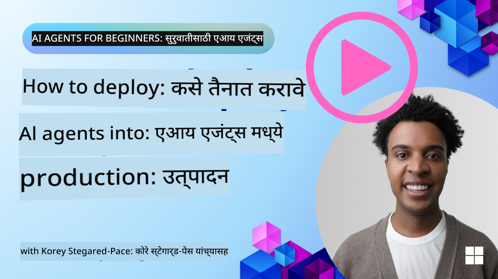

<!--
CO_OP_TRANSLATOR_METADATA:
{
  "original_hash": "1ad5de6a6388d02c145a92dd04358bab",
  "translation_date": "2025-07-12T13:37:07+00:00",
  "source_file": "10-ai-agents-production/README.md",
  "language_code": "mr"
}
-->

> _(वरील प्रतिमा क्लिक करून या धड्याचा व्हिडिओ पाहा)_
# उत्पादनात AI एजंट्स

## परिचय

हा धडा खालील गोष्टींचा आढावा घेईल:

- आपल्या AI एजंटचे उत्पादनात प्रभावीपणे तैनात करण्याचे नियोजन कसे करावे.
- उत्पादनात AI एजंट तैनात करताना येणाऱ्या सामान्य चुका आणि समस्या.
- आपल्या AI एजंटच्या कामगिरीसह खर्च कसे नियंत्रित करावे.

## शिकण्याचे उद्दिष्टे

हा धडा पूर्ण केल्यानंतर, आपण खालील गोष्टी जाणून घेणार/समजून घेणार आहात:

- उत्पादनातील AI एजंट प्रणालीची कामगिरी, खर्च आणि कार्यक्षमता सुधारण्यासाठी तंत्रे.
- आपल्या AI एजंटचे काय आणि कसे मूल्यांकन करायचे.
- AI एजंट्स उत्पादनात तैनात करताना खर्च कसा नियंत्रित करायचा.

विश्वसनीय AI एजंट्स तैनात करणे महत्त्वाचे आहे. "Building Trustworthy AI Agents" हा धडा देखील पहा.

## AI एजंट्सचे मूल्यांकन

AI एजंट्स तैनात करण्यापूर्वी, दरम्यान आणि नंतर, आपल्या AI एजंटचे योग्य प्रकारे मूल्यांकन करण्यासाठी एक प्रणाली असणे अत्यंत आवश्यक आहे. यामुळे आपली प्रणाली आपल्याशी आणि वापरकर्त्यांच्या उद्दिष्टांशी सुसंगत राहील.

AI एजंटचे मूल्यांकन करताना, फक्त एजंटच्या आउटपुटचेच नव्हे तर संपूर्ण प्रणालीचे मूल्यांकन करणे महत्त्वाचे आहे ज्यात आपला AI एजंट कार्यरत आहे. यात खालील गोष्टींचा समावेश आहे पण त्यापुरता मर्यादित नाही:

- प्रारंभिक मॉडेल विनंती.
- वापरकर्त्याच्या हेतूची ओळख करण्याची एजंटची क्षमता.
- कार्य करण्यासाठी योग्य साधन ओळखण्याची एजंटची क्षमता.
- एजंटच्या विनंतीवर साधनाचे प्रतिसाद.
- साधनाच्या प्रतिसादाचे एजंटकडून अर्थ लावण्याची क्षमता.
- एजंटच्या प्रतिसादावर वापरकर्त्याचे अभिप्राय.

यामुळे सुधारणा करण्याच्या भागांची अधिक विभागणी करून ओळख करता येते. नंतर मॉडेल्स, प्रॉम्प्ट्स, साधने आणि इतर घटकांमध्ये बदल केल्याचा परिणाम अधिक कार्यक्षमतेने पाहता येतो.

## AI एजंट्सशी संबंधित सामान्य समस्या आणि संभाव्य उपाय

| **समस्या**                                    | **संभाव्य उपाय**                                                                                                                                                                                                            |
| ---------------------------------------------- | -------------------------------------------------------------------------------------------------------------------------------------------------------------------------------------------------------------------------- |
| AI एजंट सतत कार्ये नीट पार पाडत नाही          | - AI एजंटला दिलेला प्रॉम्प्ट अधिक स्पष्ट करा; उद्दिष्टे स्पष्ट ठेवा. - कार्यांना उपकार्यांमध्ये विभागून अनेक एजंट्सद्वारे हाताळल्यास मदत होईल का ते तपासा.                                                        |
| AI एजंट सतत लूपमध्ये अडकतो                     | - एजंटला प्रक्रिया कधी थांबवायची हे स्पष्टपणे सांगणारे नियम ठेवा. - विचार आणि नियोजन आवश्यक असलेल्या जटिल कार्यांसाठी, विचार करण्यासाठी विशेषीकृत मोठा मॉडेल वापरा.                                               |
| AI एजंटचे साधन कॉल नीट काम करत नाही          | - एजंट प्रणालीच्या बाहेर साधनाचे आउटपुट तपासा आणि सत्यापित करा. - साधनांच्या परिमाणे, प्रॉम्प्ट्स आणि नावांमध्ये सुधारणा करा.                                                                                         |
| मल्टी-एजंट प्रणाली सतत नीट काम करत नाही      | - प्रत्येक एजंटला दिलेले प्रॉम्प्ट अधिक विशिष्ट आणि वेगळे करा. - योग्य एजंट कोणता हे ठरवण्यासाठी "राउटिंग" किंवा कंट्रोलर एजंट वापरून एक श्रेणीबद्ध प्रणाली तयार करा.                                                  |

## खर्च व्यवस्थापन

AI एजंट्स उत्पादनात तैनात करताना खर्च व्यवस्थापित करण्यासाठी काही धोरणे:

- **प्रतिक्रिया कॅशिंग** - सामान्य विनंत्या आणि कार्ये ओळखून, त्यांचे प्रतिसाद एजंट प्रणालीत जाण्यापूर्वीच देणे, अशा समान विनंत्यांच्या प्रमाणात घट करण्याचा चांगला मार्ग आहे. आपण अधिक मूलभूत AI मॉडेल्स वापरून विनंती किती समान आहे हे ओळखण्यासाठी एक प्रवाह देखील तयार करू शकता.

- **लहान मॉडेल्स वापरणे** - लहान भाषा मॉडेल्स (SLMs) काही एजंट वापराच्या प्रकरणांवर चांगले काम करू शकतात आणि खर्च लक्षणीयरीत्या कमी करतात. आधी नमूद केल्याप्रमाणे, मोठ्या मॉडेल्सच्या तुलनेत कामगिरीचे मूल्यांकन करण्यासाठी एक प्रणाली तयार करणे हे SLM च्या कार्यक्षमतेचा अंदाज घेण्याचा सर्वोत्तम मार्ग आहे.

- **राउटर मॉडेल वापरणे** - एक समान धोरण म्हणजे विविध मॉडेल्स आणि आकार वापरणे. आपण LLM/SLM किंवा सर्व्हरलेस फंक्शन वापरून विनंत्यांना त्यांच्या जटिलतेनुसार योग्य मॉडेलकडे मार्गदर्शन करू शकता. यामुळे खर्च कमी होण्यास मदत होईल आणि योग्य कार्यांवर कामगिरी सुनिश्चित होईल.

## अभिनंदन

हा सध्या "AI Agents for Beginners" या मालिकेचा शेवटचा धडा आहे.

आम्ही या सतत वाढणाऱ्या उद्योगातील अभिप्राय आणि बदलांनुसार नवीन धडे जोडण्याची योजना आखत आहोत, त्यामुळे लवकरच पुन्हा भेट द्या.

जर आपण AI एजंट्ससह आपले शिक्षण आणि निर्मिती सुरू ठेवू इच्छित असाल, तर <a href="https://discord.gg/kzRShWzttr" target="_blank">Azure AI Community Discord</a> मध्ये सहभागी व्हा.

आम्ही तिथे कार्यशाळा, समुदाय चर्चा आणि "मला काहीही विचारा" सत्र आयोजित करतो.

तसेच उत्पादनात AI एजंट्स तयार करण्यास मदत करणारे अतिरिक्त साहित्य असलेली Learn संग्रह देखील उपलब्ध आहे.

## मागील धडा

[Metacognition Design Pattern](../09-metacognition/README.md)

**अस्वीकरण**:  
हा दस्तऐवज AI अनुवाद सेवा [Co-op Translator](https://github.com/Azure/co-op-translator) वापरून अनुवादित केला आहे. आम्ही अचूकतेसाठी प्रयत्नशील असलो तरी, कृपया लक्षात घ्या की स्वयंचलित अनुवादांमध्ये चुका किंवा अचूकतेची कमतरता असू शकते. मूळ दस्तऐवज त्याच्या स्थानिक भाषेत अधिकृत स्रोत मानला जावा. महत्त्वाच्या माहितीसाठी व्यावसायिक मानवी अनुवाद करण्याची शिफारस केली जाते. या अनुवादाच्या वापरामुळे उद्भवणाऱ्या कोणत्याही गैरसमजुती किंवा चुकीच्या अर्थलागी आम्ही जबाबदार नाही.