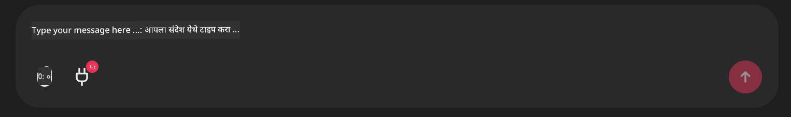

<!--
CO_OP_TRANSLATOR_METADATA:
{
  "original_hash": "9bf0395cbc541ce8db2a9699c8678dfc",
  "translation_date": "2025-07-12T14:21:27+00:00",
  "source_file": "11-mcp/code_samples/github-mcp/README.md",
  "language_code": "mr"
}
-->
# Github MCP Server उदाहरण

## वर्णन

हा एक डेमो आहे जो Microsoft Reactor द्वारे आयोजित AI Agents Hackathon साठी तयार केला गेला होता.

हे टूल वापरकर्त्याच्या Github रेपॉजिटरीजवर आधारित हॅकाथॉन प्रोजेक्ट्स शिफारस करण्यासाठी वापरले जाते.  
हे खालीलप्रमाणे केले जाते:

1. **Github Agent** - Github MCP Server वापरून रेपॉजिटरीज आणि त्या रेपॉजिटरीजची माहिती मिळवणे.  
2. **Hackathon Agent** - Github Agent कडून मिळालेली माहिती वापरून वापरकर्त्याच्या प्रोजेक्ट्स, वापरलेल्या भाषांवर आणि AI Agents हॅकाथॉनच्या प्रोजेक्ट ट्रॅक्सवर आधारित सर्जनशील हॅकाथॉन प्रोजेक्ट आयडिया तयार करणे.  
3. **Events Agent** - हॅकाथॉन एजंटच्या सूचनेनुसार, Events Agent AI Agent Hackathon सिरीजमधील संबंधित इव्हेंट्स शिफारस करेल.  

## कोड चालविणे

### पर्यावरण चल (Environment Variables)

हा डेमो Azure Open AI Service, Semantic Kernel, Github MCP Server आणि Azure AI Search वापरतो.

हे टूल्स वापरण्यासाठी योग्य पर्यावरण चल सेट केलेले आहेत याची खात्री करा:

```python
AZURE_OPENAI_CHAT_DEPLOYMENT_NAME=""
AZURE_OPENAI_EMBEDDING_DEPLOYMENT_NAME=""
AZURE_OPENAI_ENDPOINT=""
AZURE_OPENAI_API_KEY=""
AZURE_OPENAI_API_VERSION=""
AZURE_SEARCH_SERVICE_ENDPOINT=""
AZURE_SEARCH_API_KEY=""
```

## Chainlit Server चालविणे

MCP सर्व्हरशी कनेक्ट होण्यासाठी, हा डेमो Chainlit चॅट इंटरफेस म्हणून वापरतो.

सर्व्हर चालविण्यासाठी, तुमच्या टर्मिनलमध्ये खालील कमांड वापरा:

```bash
chainlit run app.py -w
```

यामुळे तुमचा Chainlit सर्व्हर `localhost:8000` वर सुरू होईल आणि `event-descriptions.md` चा कंटेंट Azure AI Search Index मध्ये भरला जाईल.

## MCP Server शी कनेक्ट होणे

Github MCP Server शी कनेक्ट होण्यासाठी, "Type your message here.." चॅट बॉक्सखालील "plug" आयकॉन निवडा:



तिथून "Connect an MCP" वर क्लिक करा जेणेकरून Github MCP Server शी कनेक्ट होण्यासाठी कमांड जोडता येईल:

```bash
npx -y @modelcontextprotocol/server-github --env GITHUB_PERSONAL_ACCESS_TOKEN=[YOUR PERSONAL ACCESS TOKEN]
```

"[YOUR PERSONAL ACCESS TOKEN]" या ठिकाणी तुमचा खरा Personal Access Token टाका.

कनेक्ट झाल्यानंतर, plug आयकॉनच्या बाजूला (1) दिसेल ज्यामुळे कनेक्शनची पुष्टी होईल. जर दिसले नाही, तर `chainlit run app.py -w` वापरून Chainlit सर्व्हर पुन्हा सुरू करण्याचा प्रयत्न करा.

## डेमो वापरणे

हॅकाथॉन प्रोजेक्ट्स शिफारस करण्यासाठी एजंट वर्कफ्लो सुरू करण्यासाठी, तुम्ही असा मेसेज टाइप करू शकता:

"Recommend hackathon projects for the Github user koreyspace"

Router Agent तुमच्या विनंतीचे विश्लेषण करेल आणि कोणत्या एजंट्सच्या (GitHub, Hackathon, आणि Events) संयोजनाने तुमचा प्रश्न उत्तम प्रकारे हाताळता येईल हे ठरवेल. एजंट्स एकत्र काम करून GitHub रेपॉजिटरी विश्लेषण, प्रोजेक्ट कल्पना आणि संबंधित तंत्रज्ञान इव्हेंट्सवर आधारित सखोल शिफारसी देतील.

**अस्वीकरण**:  
हा दस्तऐवज AI अनुवाद सेवा [Co-op Translator](https://github.com/Azure/co-op-translator) वापरून अनुवादित केला आहे. आम्ही अचूकतेसाठी प्रयत्नशील असलो तरी, कृपया लक्षात घ्या की स्वयंचलित अनुवादांमध्ये चुका किंवा अचूकतेची कमतरता असू शकते. मूळ दस्तऐवज त्याच्या स्थानिक भाषेत अधिकृत स्रोत मानला जावा. महत्त्वाच्या माहितीसाठी व्यावसायिक मानवी अनुवाद करण्याची शिफारस केली जाते. या अनुवादाच्या वापरामुळे उद्भवणाऱ्या कोणत्याही गैरसमजुती किंवा चुकीच्या अर्थलागी आम्ही जबाबदार नाही.