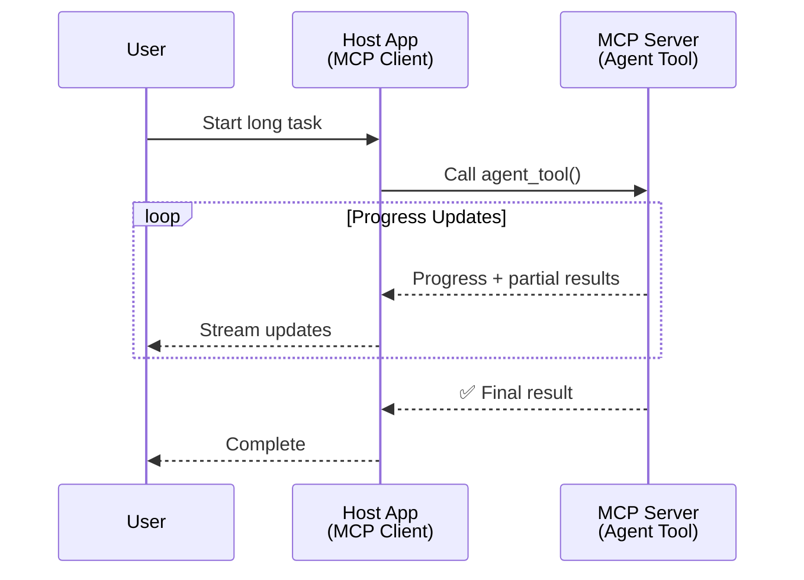
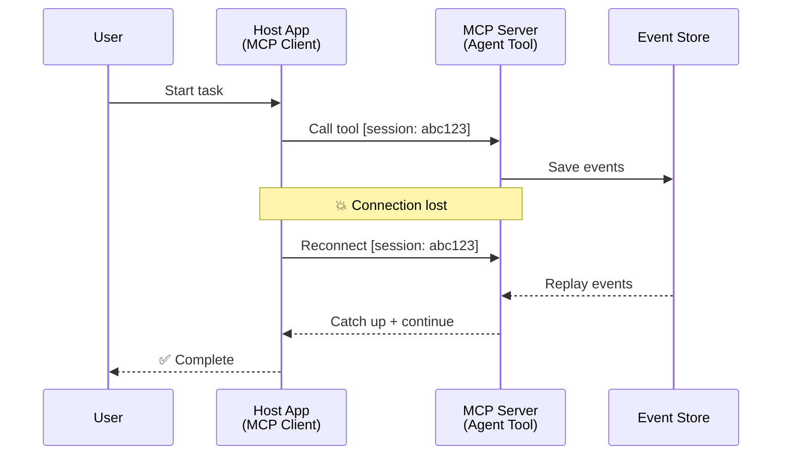
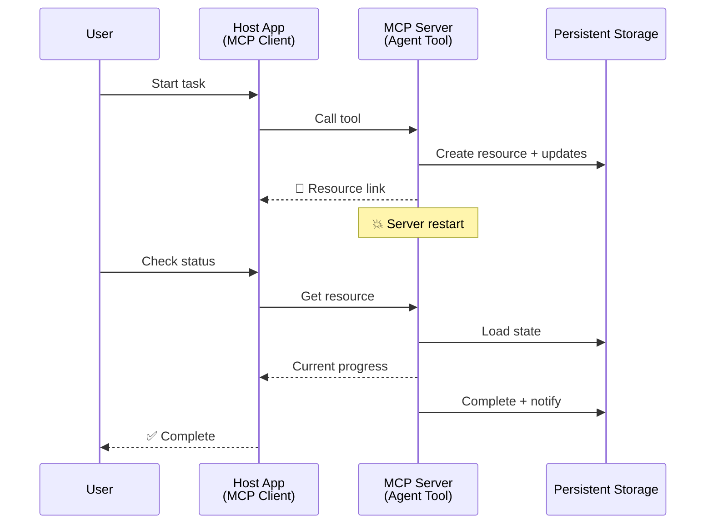
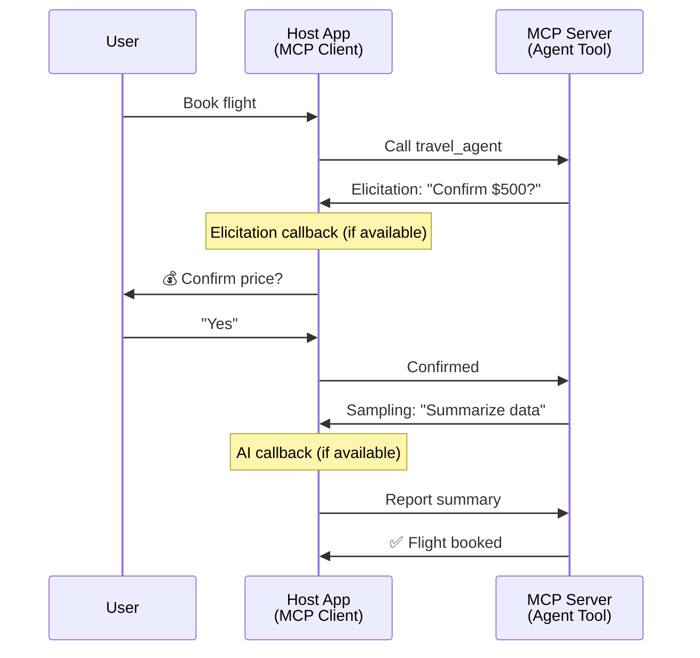
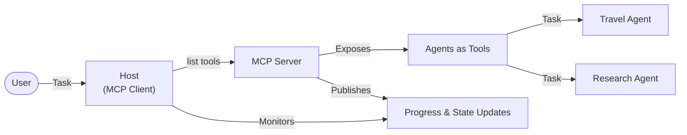

<!--
CO_OP_TRANSLATOR_METADATA:
{
  "original_hash": "5cc6836626047aa055e8960c8484a7d0",
  "translation_date": "2025-08-21T14:30:08+00:00",
  "source_file": "11-mcp/code_samples/mcp-agents/README.md",
  "language_code": "mr"
}
-->
# MCP वापरून एजंट-टू-एजंट संवाद प्रणाली तयार करणे

> TL;DR - MCP वर Agent2Agent संवाद तयार करू शकता का? होय!

MCP ने "LLMs साठी संदर्भ प्रदान करणे" या मूळ उद्दिष्टापलीकडे लक्षणीय प्रगती केली आहे. [resumable streams](https://modelcontextprotocol.io/docs/concepts/transports#resumability-and-redelivery), [elicitation](https://modelcontextprotocol.io/specification/2025-06-18/client/elicitation), [sampling](https://modelcontextprotocol.io/specification/2025-06-18/client/sampling), आणि सूचना ([progress](https://modelcontextprotocol.io/specification/2025-06-18/basic/utilities/progress) आणि [resources](https://modelcontextprotocol.io/specification/2025-06-18/schema#resourceupdatednotification)) यांसारख्या अलीकडील सुधारणा MCP ला जटिल एजंट-टू-एजंट संवाद प्रणाली तयार करण्यासाठी एक मजबूत पाया प्रदान करतात.

## एजंट/टूल विषयी गैरसमज

जसे अधिकाधिक विकसक एजंटिक वर्तन असलेल्या टूल्सचा (जसे की दीर्घकाळ चालणारे, अंमलबजावणीदरम्यान अतिरिक्त इनपुट आवश्यक असलेले इ.) शोध घेत आहेत, MCP चा उपयोग अशक्य आहे असा एक सामान्य गैरसमज आहे, कारण त्याच्या सुरुवातीच्या टूल्सच्या उदाहरणांमध्ये साध्या विनंती-प्रतिसाद पद्धतींवर लक्ष केंद्रित केले होते.

हा दृष्टिकोन आता कालबाह्य झाला आहे. MCP स्पेसिफिकेशनमध्ये गेल्या काही महिन्यांत लक्षणीय सुधारणा करण्यात आल्या आहेत, ज्यामुळे दीर्घकाळ चालणाऱ्या एजंटिक वर्तनासाठी आवश्यक असलेल्या क्षमतांमध्ये अंतर भरून काढले आहे:

- **स्ट्रीमिंग आणि आंशिक निकाल**: अंमलबजावणीदरम्यान रिअल-टाइम प्रगती अद्यतने
- **Resumability**: डिस्कनेक्शननंतर क्लायंट पुन्हा कनेक्ट होऊ शकतो आणि सुरू ठेवू शकतो
- **Durability**: सर्व्हर रीस्टार्ट्सनंतरही निकाल टिकून राहतात (उदा. resource links च्या माध्यमातून)
- **Multi-turn**: अंमलबजावणीदरम्यान इंटरॅक्टिव्ह इनपुट (elicitation आणि sampling च्या माध्यमातून)

या वैशिष्ट्यांचा एकत्रित वापर करून जटिल एजंटिक आणि मल्टी-एजंट अनुप्रयोग सक्षम केले जाऊ शकतात, जे सर्व MCP प्रोटोकॉलवर तैनात केले जाऊ शकतात.

संदर्भासाठी, आम्ही MCP सर्व्हरवर उपलब्ध असलेल्या "टूल" ला एजंट म्हणू. याचा अर्थ असा की MCP क्लायंट अंमलबजावणी करणारे होस्ट अॅप्लिकेशन अस्तित्वात आहे, जे MCP सर्व्हरशी सत्र स्थापन करते आणि एजंटला कॉल करू शकते.

## MCP टूल "एजंटिक" काय बनवते?

अंमलबजावणीमध्ये जाण्यापूर्वी, दीर्घकाळ चालणाऱ्या एजंट्सना समर्थन देण्यासाठी कोणत्या पायाभूत सुविधांची आवश्यकता आहे हे स्पष्ट करूया.

> आम्ही एजंटला अशी एक घटक म्हणून परिभाषित करू जी विस्तारित कालावधीसाठी स्वायत्तपणे कार्य करू शकते, जटिल कार्ये हाताळण्यास सक्षम आहे ज्यासाठी अनेक संवाद किंवा रिअल-टाइम अभिप्रायावर आधारित समायोजन आवश्यक असू शकते.

### 1. स्ट्रीमिंग आणि आंशिक निकाल

पारंपरिक विनंती-प्रतिसाद पद्धती दीर्घकाळ चालणाऱ्या कार्यांसाठी कार्य करत नाहीत. एजंट्सना प्रदान करणे आवश्यक आहे:

- रिअल-टाइम प्रगती अद्यतने
- आंतरिम निकाल

**MCP समर्थन**: Resource update notifications स्ट्रीमिंग आंशिक निकाल सक्षम करतात, परंतु JSON-RPC च्या 1:1 विनंती/प्रतिसाद मॉडेलशी संघर्ष टाळण्यासाठी काळजीपूर्वक डिझाइन आवश्यक आहे.

| वैशिष्ट्य                     | उपयोग प्रकरण                                                                                                                                                                       | MCP समर्थन                                                                                |
| -------------------------- | ------------------------------------------------------------------------------------------------------------------------------------------------------------------------------ | ------------------------------------------------------------------------------------------ |
| रिअल-टाइम प्रगती अद्यतने | वापरकर्ता कोडबेस माइग्रेशन कार्याची विनंती करतो. एजंट प्रगती प्रवाहित करतो: "10% - अवलंबित्वांचे विश्लेषण करत आहे... 25% - टाइपस्क्रिप्ट फाइल्स रूपांतरित करत आहे... 50% - आयात अद्यतनित करत आहे..."          | ✅ प्रगती सूचना                                                                  |
| आंशिक निकाल            | "पुस्तक तयार करा" कार्य आंशिक निकाल प्रवाहित करते, उदा., 1) कथा आर्क रूपरेषा, 2) अध्याय यादी, 3) प्रत्येक अध्याय पूर्ण झाल्याप्रमाणे. होस्ट तपासू शकतो, रद्द करू शकतो किंवा कोणत्याही टप्प्यावर पुनर्निर्देशित करू शकतो. | ✅ सूचना "विस्तारित" केल्या जाऊ शकतात, आंशिक निकाल समाविष्ट करण्यासाठी PR 383, 776 वर प्रस्ताव पहा |

<div align="center" style="font-style: italic; font-size: 0.95em; margin-bottom: 0.5em;">
<strong>आकृती 1:</strong> ही आकृती MCP एजंट कसे रिअल-टाइम प्रगती अद्यतने आणि आंशिक निकाल होस्ट अॅप्लिकेशनला प्रवाहित करतात हे दर्शवते, ज्यामुळे वापरकर्त्याला अंमलबजावणी रिअल-टाइममध्ये निरीक्षण करण्यास सक्षम करते.
</div>



### 2. Resumability

एजंट्सना नेटवर्क व्यत्यय सहजतेने हाताळण्याची आवश्यकता आहे:

- (क्लायंट) डिस्कनेक्शननंतर पुन्हा कनेक्ट करा
- जिथे थांबले होते तिथून सुरू ठेवा (संदेश पुन्हा वितरित करणे)

**MCP समर्थन**: MCP StreamableHTTP ट्रान्सपोर्ट सत्र पुनरारंभ आणि संदेश पुन्हा वितरित करणे सत्र IDs आणि शेवटच्या इव्हेंट IDs सह समर्थन करते. येथे महत्त्वाची गोष्ट म्हणजे सर्व्हरने EventStore अंमलबजावणी करणे आवश्यक आहे जे क्लायंट पुन्हा कनेक्शनवर इव्हेंट रीप्ले सक्षम करते.  
सर्व्हर क्लायंट/होस्ट अॅप्लिकेशनला अद्यतनांची सूचना देण्यासाठी कॉल करू शकतो अशा वेबहुक्स किंवा ट्रिगर्स समाविष्ट करण्याच्या शक्यतेचा शोध घेणारा एक समुदाय प्रस्ताव (PR #975) आहे.

| वैशिष्ट्य      | उपयोग प्रकरण                                                                                                                                                   | MCP समर्थन                                                                |
| ------------ | ---------------------------------------------------------------------------------------------------------------------------------------------------------- | -------------------------------------------------------------------------- |
| Resumability | क्लायंट दीर्घकाळ चालणाऱ्या कार्यादरम्यान डिस्कनेक्ट होतो. पुन्हा कनेक्शन केल्यावर, सत्र गमावलेल्या इव्हेंट्ससह पुन्हा सुरू होते, जिथे थांबले होते तिथून अखंडपणे सुरू राहते. | ✅ StreamableHTTP ट्रान्सपोर्ट सत्र IDs, इव्हेंट रीप्ले, आणि EventStore सह |

<div align="center" style="font-style: italic; font-size: 0.95em; margin-bottom: 0.5em;">
<strong>आकृती 2:</strong> ही आकृती दर्शवते की MCP च्या StreamableHTTP ट्रान्सपोर्ट आणि इव्हेंट स्टोअर सत्र पुनरारंभ कसे सक्षम करतात: जर क्लायंट डिस्कनेक्ट झाला, तर तो पुन्हा कनेक्ट होऊ शकतो आणि गमावलेले इव्हेंट रीप्ले करू शकतो, प्रगती गमावल्याशिवाय कार्य सुरू ठेवतो.
</div>



### 3. Durability

दीर्घकाळ चालणाऱ्या एजंट्सना टिकाऊ स्थितीची आवश्यकता आहे:

- निकाल सर्व्हर रीस्टार्ट्सनंतर टिकून राहतात
- स्थिती बाहेरून पुनर्प्राप्त केली जाऊ शकते
- सत्रांमध्ये प्रगती ट्रॅकिंग

**MCP समर्थन**: MCP आता टूल कॉलसाठी Resource link परतावा प्रकार समर्थन करते. आज, एक संभाव्य पद्धत म्हणजे टूल डिझाइन करणे जे एक resource तयार करते आणि त्वरित resource link परत करते. टूल पार्श्वभूमीत कार्य सुरू ठेवू शकते आणि resource अद्यतनित करू शकते. याउलट, क्लायंटला या resource ची स्थिती तपासण्याचा किंवा resource अद्यतनांसाठी सदस्यता घेण्याचा पर्याय आहे.

येथे एक मर्यादा अशी आहे की resource ची स्थिती तपासणे किंवा अद्यतनांसाठी सदस्यता घेणे संसाधने वापरू शकते, ज्यामुळे स्केलवर परिणाम होतो. वेबहुक्स किंवा ट्रिगर्स समाविष्ट करण्याच्या शक्यतेचा शोध घेणारा एक समुदाय प्रस्ताव (PR #992) आहे.

| वैशिष्ट्य    | उपयोग प्रकरण                                                                                                                                        | MCP समर्थन                                                        |
| ---------- | ----------------------------------------------------------------------------------------------------------------------------------------------- | ------------------------------------------------------------------ |
| Durability | डेटा माइग्रेशन कार्यादरम्यान सर्व्हर क्रॅश होतो. निकाल आणि प्रगती रीस्टार्टनंतर टिकून राहते, क्लायंट स्थिती तपासू शकतो आणि टिकाऊ resource वरून सुरू ठेवू शकतो. | ✅ Resource links टिकाऊ स्टोरेज आणि स्थिती सूचना |

आज, एक सामान्य पद्धत म्हणजे टूल डिझाइन करणे जे एक resource तयार करते आणि त्वरित resource link परत करते. टूल पार्श्वभूमीत कार्य सुरू ठेवू शकते, resource सूचना जारी करू शकते, ज्या प्रगती अद्यतन म्हणून काम करतात किंवा आंशिक निकाल समाविष्ट करतात, आणि आवश्यकतेनुसार resource मधील सामग्री अद्यतनित करू शकते.

<div align="center" style="font-style: italic; font-size: 0.95em; margin-bottom: 0.5em;">
<strong>आकृती 3:</strong> ही आकृती दर्शवते की MCP एजंट्स टिकाऊ resources आणि स्थिती सूचना कशा वापरतात, जेणेकरून दीर्घकाळ चालणारी कार्ये सर्व्हर रीस्टार्ट्सनंतर टिकून राहतील, ज्यामुळे क्लायंट प्रगती तपासू शकतो आणि अपयशानंतरही निकाल पुनर्प्राप्त करू शकतो.
</div>



### 4. Multi-Turn संवाद

एजंट्सना अंमलबजावणीदरम्यान अतिरिक्त इनपुटची आवश्यकता असते:

- मानवी स्पष्टीकरण किंवा मान्यता
- जटिल निर्णयांसाठी AI सहाय्य
- डायनॅमिक पॅरामीटर समायोजन

**MCP समर्थन**: Sampling (AI इनपुटसाठी) आणि elicitation (मानवी इनपुटसाठी) द्वारे पूर्णपणे समर्थित.

| वैशिष्ट्य                 | उपयोग प्रकरण                                                                                                                                     | MCP समर्थन                                           |
| ----------------------- | -------------------------------------------------------------------------------------------------------------------------------------------- | ----------------------------------------------------- |
| Multi-Turn संवाद | प्रवास बुकिंग एजंट वापरकर्त्याकडून किंमत पुष्टीकरणाची विनंती करतो, नंतर बुकिंग व्यवहार पूर्ण करण्यापूर्वी प्रवास डेटा सारांशित करण्यासाठी AI ला विचारतो. | ✅ मानवी इनपुटसाठी elicitation, AI इनपुटसाठी sampling |

<div align="center" style="font-style: italic; font-size: 0.95em; margin-bottom: 0.5em;">
<strong>आकृती 4:</strong> ही आकृती दर्शवते की MCP एजंट्स अंमलबजावणीदरम्यान मानवी इनपुट किंवा AI सहाय्य कसे संवादात्मकपणे प्राप्त करू शकतात, पुष्टीकरणे आणि डायनॅमिक निर्णय घेण्यासारख्या जटिल, मल्टी-टर्न वर्कफ्लोना समर्थन देतात.
</div>



## MCP वर दीर्घकाळ चालणारे एजंट्स अंमलबजावणी करणे - कोड विहंगावलोकन

या लेखाचा भाग म्हणून, आम्ही [कोड रिपॉझिटरी](https://github.com/victordibia/ai-tutorials/tree/main/MCP%20Agents) प्रदान करतो, ज्यामध्ये StreamableHTTP ट्रान्सपोर्टसह MCP Python SDK वापरून सत्र पुनरारंभ आणि संदेश पुन्हा वितरित करण्यासाठी दीर्घकाळ चालणाऱ्या एजंट्सची संपूर्ण अंमलबजावणी समाविष्ट आहे. अंमलबजावणी MCP क्षमतांचा एकत्रित वापर करून प्रगत एजंटसारखे वर्तन सक्षम कसे करावे हे दर्शवते.

विशेषतः, आम्ही दोन प्राथमिक एजंट टूल्ससह सर्व्हर अंमलबजावणी करतो:

- **Travel Agent** - elicitation च्या माध्यमातून किंमत पुष्टीकरणासह प्रवास बुकिंग सेवा अनुकरण करते
- **Research Agent** - sampling च्या माध्यमातून AI सहाय्यित सारांशांसह संशोधन कार्ये करते

दोन्ही एजंट्स रिअल-टाइम प्रगती अद्यतने, संवादात्मक पुष्टीकरणे, आणि पूर्ण सत्र पुनरारंभ क्षमता दर्शवतात.

### मुख्य अंमलबजावणी संकल्पना

खालील विभाग प्रत्येक क्षमतेसाठी सर्व्हर-साइड एजंट अंमलबजावणी आणि क्लायंट-साइड होस्ट हाताळणी दर्शवतात:

#### स्ट्रीमिंग आणि प्रगती अद्यतने - रिअल-टाइम कार्य स्थिती

स्ट्रीमिंग एजंट्सना दीर्घकाळ चालणाऱ्या कार्यांदरम्यान रिअल-टाइम प्रगती अद्यतने प्रदान करण्यास सक्षम करते, ज्यामुळे वापरकर्त्यांना कार्य स्थिती आणि आंतरिम निकालांची माहिती मिळते.

**सर्व्हर अंमलबजावणी (एजंट प्रगती सूचना पाठवतो):**

```python
# From server/server.py - Travel agent sending progress updates
for i, step in enumerate(steps):
    await ctx.session.send_progress_notification(
        progress_token=ctx.request_id,
        progress=i * 25,
        total=100,
        message=step,
        related_request_id=str(ctx.request_id)
    )
    await anyio.sleep(2)  # Simulate work

# Alternative: Log messages for detailed step-by-step updates
await ctx.session.send_log_message(
    level="info",
    data=f"Processing step {current_step}/{steps} ({progress_percent}%)",
    logger="long_running_agent",
    related_request_id=ctx.request_id,
)
```

**क्लायंट अंमलबजावणी (होस्ट प्रगती अद्यतने प्राप्त करतो):**

```python
# From client/client.py - Client handling real-time notifications
async def message_handler(message) -> None:
    if isinstance(message, types.ServerNotification):
        if isinstance(message.root, types.LoggingMessageNotification):
            console.print(f"📡 [dim]{message.root.params.data}[/dim]")
        elif isinstance(message.root, types.ProgressNotification):
            progress = message.root.params
            console.print(f"🔄 [yellow]{progress.message} ({progress.progress}/{progress.total})[/yellow]")

# Register message handler when creating session
async with ClientSession(
    read_stream, write_stream,
    message_handler=message_handler
) as session:
```

#### Elicitation - वापरकर्त्याच्या इनपुटची विनंती करणे

Elicitation एजंट्सना अंमलबजावणीदरम्यान वापरकर्त्याच्या इनपुटची विनंती करण्यास सक्षम करते. हे दीर्घकाळ चालणाऱ्या कार्यांदरम्यान पुष्टीकरणे, स्पष्टीकरणे किंवा मान्यता यासाठी आवश्यक आहे.

**सर्व्हर अंमलबजावणी (एजंट पुष्टीकरणाची विनंती करतो):**

```python
# From server/server.py - Travel agent requesting price confirmation
elicit_result = await ctx.session.elicit(
    message=f"Please confirm the estimated price of $1200 for your trip to {destination}",
    requestedSchema=PriceConfirmationSchema.model_json_schema(),
    related_request_id=ctx.request_id,
)

if elicit_result and elicit_result.action == "accept":
    # Continue with booking
    logger.info(f"User confirmed price: {elicit_result.content}")
elif elicit_result and elicit_result.action == "decline":
    # Cancel the booking
    booking_cancelled = True
```

**क्लायंट अंमलबजावणी (होस्ट elicitation callback प्रदान करतो):**

```python
# From client/client.py - Client handling elicitation requests
async def elicitation_callback(context, params):
    console.print(f"💬 Server is asking for confirmation:")
    console.print(f"   {params.message}")

    response = console.input("Do you accept? (y/n): ").strip().lower()

    if response in ['y', 'yes']:
        return types.ElicitResult(
            action="accept",
            content={"confirm": True, "notes": "Confirmed by user"}
        )
    else:
        return types.ElicitResult(
            action="decline",
            content={"confirm": False, "notes": "Declined by user"}
        )

# Register the callback when creating the session
async with ClientSession(
    read_stream, write_stream,
    elicitation_callback=elicitation_callback
) as session:
```

#### Sampling - AI सहाय्याची विनंती करणे

Sampling एजंट्सना अंमलबजावणीदरम्यान जटिल निर्णय किंवा सामग्री निर्मितीसाठी LLM सहाय्याची विनंती करण्यास सक्षम करते. हे हायब्रिड मानवी-AI वर्कफ्लो सक्षम करते.

**सर्व्हर अंमलबजावणी (एजंट AI सहाय्याची विनंती करतो):**

```python
# From server/server.py - Research agent requesting AI summary
sampling_result = await ctx.session.create_message(
    messages=[
        SamplingMessage(
            role="user",
            content=TextContent(type="text", text=f"Please summarize the key findings for research on: {topic}")
        )
    ],
    max_tokens=100,
    related_request_id=ctx.request_id,
)

if sampling_result and sampling_result.content:
    if sampling_result.content.type == "text":
        sampling_summary = sampling_result.content.text
        logger.info(f"Received sampling summary: {sampling_summary}")
```

**क्लायंट अंमलबजावणी (होस्ट sampling callback प्रदान करतो):**

```python
# From client/client.py - Client handling sampling requests
async def sampling_callback(context, params):
    message_text = params.messages[0].content.text if params.messages else 'No message'
    console.print(f"🧠 Server requested sampling: {message_text}")

    # In a real application, this could call an LLM API
    # For demo purposes, we provide a mock response
    mock_response = "Based on current research, MCP has evolved significantly..."

    return types.CreateMessageResult(
        role="assistant",
        content=types.TextContent(type="text", text=mock_response),
        model="interactive-client",
        stopReason="endTurn"
    )

# Register the callback when creating the session
async with ClientSession(
    read_stream, write_stream,
    sampling_callback=sampling_callback,
    elicitation_callback=elicitation_callback
) as session:
```

#### Resumability - डिस्कनेक्शननंतर सत्र सातत्य

Resumability सुनिश्चित करते की दीर्घकाळ चालणारी एजंट कार्ये क्लायंट डिस्कनेक्शन टिकून राहतील आणि पुन्हा कनेक्शन केल्यावर अखंडपणे सुरू राहतील. हे इव्हेंट स्टोअर्स आणि पुनरारंभ टोकनद्वारे अंमलबजावणी केले जाते.

**इव्हेंट स्टोअर अंमलबजावणी (सर्व्हर सत्र स्थिती ठेवतो):**

```python
# From server/event_store.py - Simple in-memory event store
class SimpleEventStore(EventStore):
    def __init__(self):
        self._events: list[tuple[StreamId, EventId, JSONRPCMessage]] = []
        self._event_id_counter = 0

    async def store_event(self, stream_id: StreamId, message: JSONRPCMessage) -> EventId:
        """Store an event and return its ID."""
        self._event_id_counter += 1
        event_id = str(self._event_id_counter)
        self._events.append((stream_id, event_id, message))
        return event_id

    async def replay_events_after(self, last_event_id: EventId, send_callback: EventCallback) -> StreamId | None:
        """Replay events after the specified ID for resumption."""
        # Find events after the last known event and replay them
        for _, event_id, message in self._events[start_index:]:
            await send_callback(EventMessage(message, event_id))

# From server/server.py - Passing event store to session manager
def create_server_app(event_store: Optional[EventStore] = None) -> Starlette:
    server = ResumableServer()

    # Create session manager with event store for resumption
    session_manager = StreamableHTTPSessionManager(
        app=server,
        event_store=event_store,  # Event store enables session resumption
        json_response=False,
        security_settings=security_settings,
    )

    return Starlette(routes=[Mount("/mcp", app=session_manager.handle_request)])

# Usage: Initialize with event store
event_store = SimpleEventStore()
app = create_server_app(event_store)
```

**क्लायंट मेटाडेटा पुनरारंभ टोकनसह (क्लायंट साठवलेल्या स्थितीचा वापर करून पुन्हा कनेक्ट होतो):**

```python
# From client/client.py - Client resumption with metadata
if existing_tokens and existing_tokens.get("resumption_token"):
    # Use existing resumption token to continue where we left off
    metadata = ClientMessageMetadata(
        resumption_token=existing_tokens["resumption_token"],
    )
else:
    # Create callback to save resumption token when received
    def enhanced_callback(token: str):
        protocol_version = getattr(session, 'protocol_version', None)
        token_manager.save_tokens(session_id, token, protocol_version, command, args)

    metadata = ClientMessageMetadata(
        on_resumption_token_update=enhanced_callback,
    )

# Send request with resumption metadata
result = await session.send_request(
    types.ClientRequest(
        types.CallToolRequest(
            method="tools/call",
            params=types.CallToolRequestParams(name=command, arguments=args)
        )
    ),
    types.CallToolResult,
    metadata=metadata,
)
```

होस्ट अॅप्लिकेशन स्थानिकरित्या सत्र IDs आणि पुनरारंभ टोकन ठेवते, ज्यामुळे ते प्रगती किंवा स्थिती गमावल्याशिवाय विद्यमान सत्रांशी पुन्हा कनेक्ट होऊ शकते.

### कोड संघटना

<div align="center" style="font-style: italic; font-size: 0.95em; margin-bottom: 0.5em;">
<strong>आकृती 5:</strong> MCP-आधारित एजंट प्रणाली आर्किटेक्चर
</div>



**मुख्य फाइल्स:**

- **`server/server.py`** - Travel आणि research एजंट्ससह पुनरारंभ MCP सर्व्हर, जे elicitation, sampling, आणि प्रगती अद्यतने दर्शवतात
- **`client/client.py`** - संवादात्मक होस्ट अॅप्लिकेशन पुनरारंभ समर्थन, callback हँडलर्स, आणि टोकन व्यवस्थापनासह
- **`server/event_store.py`** - सत्र पुनरारंभ आणि संदेश पुन्हा वितरित करण्यासाठी इव्हेंट स्टोअर अंमलबजावणी

## MCP वर मल्टी-एजंट संवादाकडे विस्तार

वरील अंमलबजावणी होस्ट अॅप्लिकेशनची बुद्धिमत्ता आणि व्याप्ती वाढवून मल्टी-एजंट प्रणालींमध्ये विस्तारित केली जाऊ शकते:

- **बुद्धिमान कार्य विघटन**: होस्ट जटिल वापरकर्ता विनंत्या विश्लेषित करतो आणि त्यांना विविध विशेष एजंट्ससाठी उपकार्यांमध्ये विभागतो
- **मल्टी-सर्व्हर समन्वय**: होस्ट अनेक MCP सर्व्हर्सशी कनेक्शन राखतो, प्रत्येक वेगवेगळ

**अस्वीकरण**:  
हा दस्तऐवज AI भाषांतर सेवा [Co-op Translator](https://github.com/Azure/co-op-translator) चा वापर करून भाषांतरित करण्यात आला आहे. आम्ही अचूकतेसाठी प्रयत्नशील असलो तरी कृपया लक्षात ठेवा की स्वयंचलित भाषांतरे त्रुटी किंवा अचूकतेच्या अभावाने युक्त असू शकतात. मूळ भाषेतील दस्तऐवज हा अधिकृत स्रोत मानला जावा. महत्त्वाच्या माहितीसाठी, व्यावसायिक मानवी भाषांतराची शिफारस केली जाते. या भाषांतराचा वापर करून उद्भवलेल्या कोणत्याही गैरसमज किंवा चुकीच्या अर्थासाठी आम्ही जबाबदार नाही.