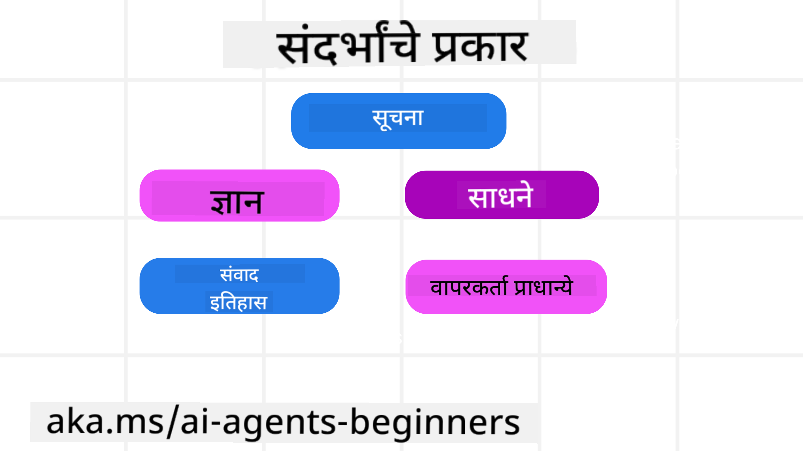
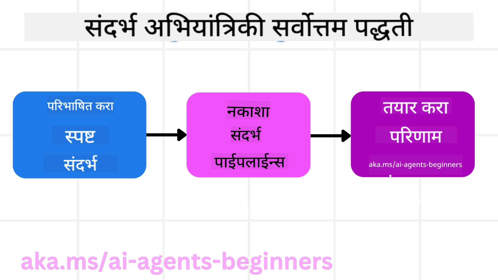

<!--
CO_OP_TRANSLATOR_METADATA:
{
  "original_hash": "cb7e50f471905ce6fdb92a30269a7a98",
  "translation_date": "2025-09-04T09:56:49+00:00",
  "source_file": "12-context-engineering/README.md",
  "language_code": "mr"
}
-->
# एआय एजंट्ससाठी संदर्भ अभियांत्रिकी

> _(वरील प्रतिमेवर क्लिक करून या धड्याचा व्हिडिओ पहा)_

तुम्ही ज्या अनुप्रयोगासाठी एआय एजंट तयार करत आहात त्याची गुंतागुंत समजून घेणे एक विश्वासार्ह एजंट तयार करण्यासाठी महत्त्वाचे आहे. आपल्याला अशा एआय एजंट्स तयार करायचे आहेत जे माहिती प्रभावीपणे व्यवस्थापित करून प्रॉम्प्ट अभियांत्रिकीच्या पलीकडे जाऊन जटिल गरजा पूर्ण करू शकतील.

या धड्यात, आपण संदर्भ अभियांत्रिकी म्हणजे काय आणि एआय एजंट्स तयार करण्यात त्याची भूमिका यावर चर्चा करू.

## परिचय

या धड्यात आपण शिकणार आहोत:

• **संदर्भ अभियांत्रिकी म्हणजे काय** आणि ती प्रॉम्प्ट अभियांत्रिकीपेक्षा कशी वेगळी आहे.

• **प्रभावी संदर्भ अभियांत्रिकीसाठी रणनीती**, ज्यामध्ये माहिती लिहिणे, निवडणे, संक्षेप करणे आणि वेगळे करणे याचा समावेश आहे.

• **सामान्य संदर्भ अपयश** जे तुमच्या एआय एजंटला अडथळा आणू शकते आणि त्यावर उपाय कसा करायचा.

## शिकण्याची उद्दिष्टे

हा धडा पूर्ण केल्यानंतर, तुम्हाला खालील गोष्टी समजतील:

• **संदर्भ अभियांत्रिकीची व्याख्या करा** आणि ती प्रॉम्प्ट अभियांत्रिकीपासून वेगळी कशी आहे हे ओळखा.

• **एलएलएम अनुप्रयोगांमध्ये संदर्भाचे मुख्य घटक ओळखा**.

• **संदर्भ लिहिणे, निवडणे, संक्षेप करणे आणि वेगळे करणे यासाठी रणनीती लागू करा** जेणेकरून एजंटची कार्यक्षमता सुधारेल.

• **सामान्य संदर्भ अपयश ओळखा** जसे की विषबाधा, विचलन, गोंधळ आणि संघर्ष, आणि त्यावर उपाययोजना करा.

## संदर्भ अभियांत्रिकी म्हणजे काय?

एआय एजंट्ससाठी, संदर्भ म्हणजे एआय एजंटला विशिष्ट कृती करण्यासाठी योजना तयार करण्यास प्रवृत्त करणारी गोष्ट. संदर्भ अभियांत्रिकी म्हणजे एआय एजंटकडे कार्याचा पुढचा टप्पा पूर्ण करण्यासाठी योग्य माहिती असल्याची खात्री करण्याची प्रक्रिया आहे. संदर्भ विंडोची क्षमता मर्यादित असते, त्यामुळे एजंट तयार करणाऱ्या व्यक्तींनी माहिती जोडणे, काढून टाकणे आणि संक्षेप करणे व्यवस्थापित करण्यासाठी प्रणाली आणि प्रक्रिया तयार करणे आवश्यक आहे.

### प्रॉम्प्ट अभियांत्रिकी विरुद्ध संदर्भ अभियांत्रिकी

प्रॉम्प्ट अभियांत्रिकी एका स्थिर सूचना संचावर केंद्रित असते ज्यामुळे एआय एजंट्सला नियमांच्या संचासह प्रभावीपणे मार्गदर्शन करता येते. संदर्भ अभियांत्रिकी म्हणजे गतिशील माहिती संच व्यवस्थापित करणे, ज्यामध्ये प्रारंभिक प्रॉम्प्टचा समावेश असतो, जेणेकरून एआय एजंटकडे वेळोवेळी आवश्यक माहिती असेल. संदर्भ अभियांत्रिकीचा मुख्य उद्देश म्हणजे ही प्रक्रिया पुनरावृत्ती करण्यायोग्य आणि विश्वासार्ह बनवणे.

### संदर्भाचे प्रकार

हे लक्षात ठेवणे महत्त्वाचे आहे की संदर्भ ही एकच गोष्ट नाही. एआय एजंटला आवश्यक असलेली माहिती विविध स्रोतांमधून येऊ शकते आणि एजंटला या स्रोतांमध्ये प्रवेश मिळावा याची खात्री करणे आपले काम आहे:

एआय एजंटला व्यवस्थापित कराव्या लागणाऱ्या संदर्भाच्या प्रकारांमध्ये समाविष्ट आहे:

• **सूचना:** या एजंटच्या "नियमां"सारख्या आहेत – प्रॉम्प्ट्स, सिस्टम संदेश, फ्यू-शॉट उदाहरणे (एआयला काहीतरी कसे करायचे ते दाखवणे) आणि ते वापरू शकणाऱ्या साधनांचे वर्णन. येथे प्रॉम्प्ट अभियांत्रिकी आणि संदर्भ अभियांत्रिकी एकत्र येते.

• **ज्ञान:** यात तथ्य, डेटाबेसमधून मिळवलेली माहिती किंवा एजंटने जमा केलेल्या दीर्घकालीन आठवणींचा समावेश आहे. यामध्ये एखाद्या एजंटला वेगवेगळ्या ज्ञान साठ्यांमध्ये आणि डेटाबेसमध्ये प्रवेश आवश्यक असल्यास रिट्रीव्हल ऑगमेंटेड जनरेशन (RAG) प्रणाली समाकलित करणे समाविष्ट आहे.

• **साधने:** बाह्य फंक्शन्स, APIs आणि MCP सर्व्हर्सची व्याख्या ज्याला एजंट कॉल करू शकतो, तसेच त्यांना वापरून मिळालेला फीडबॅक (परिणाम).

• **संवाद इतिहास:** वापरकर्त्यासोबत चालू असलेला संवाद. वेळ जसजसा पुढे जातो, हे संवाद लांब आणि अधिक जटिल होतात, ज्यामुळे ते संदर्भ विंडोमध्ये जागा घेतात.

• **वापरकर्ता प्राधान्ये:** वापरकर्त्याच्या आवडी किंवा नापसंतीबद्दल वेळोवेळी शिकलेली माहिती. महत्त्वाचे निर्णय घेताना वापरकर्त्याला मदत करण्यासाठी ही माहिती संग्रहित केली जाऊ शकते आणि आवश्यकतेनुसार वापरली जाऊ शकते.

## प्रभावी संदर्भ अभियांत्रिकीसाठी रणनीती

### नियोजन रणनीती

चांगली संदर्भ अभियांत्रिकी चांगल्या नियोजनाने सुरू होते. संदर्भ अभियांत्रिकीची संकल्पना कशी लागू करायची याचा विचार करण्यासाठी येथे एक दृष्टिकोन दिला आहे:

1. **स्पष्ट परिणाम ठरवा** - एआय एजंट्सना दिल्या जाणाऱ्या कार्यांचे परिणाम स्पष्टपणे ठरवले पाहिजेत. प्रश्नाचे उत्तर द्या - "एआय एजंटने आपले कार्य पूर्ण केल्यानंतर जग कसे दिसेल?" दुसऱ्या शब्दांत, वापरकर्त्याने एआय एजंटशी संवाद साधल्यानंतर कोणता बदल, माहिती किंवा प्रतिसाद मिळायला हवा.

2. **संदर्भाचा नकाशा तयार करा** - एकदा तुम्ही एआय एजंटचे परिणाम ठरवले की, तुम्हाला "एआय एजंटला हे कार्य पूर्ण करण्यासाठी कोणती माहिती आवश्यक आहे?" या प्रश्नाचे उत्तर द्यावे लागेल. यामुळे तुम्ही ती माहिती कुठे सापडू शकते याचा संदर्भ नकाशा तयार करू शकता.

3. **संदर्भ पाइपलाइन तयार करा** - आता तुम्हाला माहिती कुठे आहे हे माहित आहे, तुम्हाला "एजंटला ही माहिती कशी मिळेल?" या प्रश्नाचे उत्तर द्यावे लागेल. हे RAG, MCP सर्व्हर्सचा वापर आणि इतर साधनांचा वापर करून विविध प्रकारे केले जाऊ शकते.

### व्यावहारिक रणनीती

नियोजन महत्त्वाचे आहे, परंतु एकदा माहिती आमच्या एजंटच्या संदर्भ विंडोमध्ये प्रवाहित होऊ लागली की, ती व्यवस्थापित करण्यासाठी व्यावहारिक रणनीती असणे आवश्यक आहे:

#### संदर्भ व्यवस्थापित करणे

काही माहिती संदर्भ विंडोमध्ये आपोआप जोडली जाईल, परंतु संदर्भ अभियांत्रिकी म्हणजे या माहितीची अधिक सक्रिय भूमिका घेणे, जे काही रणनीतींनी केले जाऊ शकते:

1. **एजंट स्क्रॅचपॅड**
एआय एजंटला एका सत्रादरम्यान चालू कार्ये आणि वापरकर्ता संवादांबद्दल संबंधित माहितीची नोंद घेण्याची परवानगी देते. हे संदर्भ विंडोच्या बाहेर फाइल किंवा रनटाइम ऑब्जेक्टमध्ये अस्तित्वात असावे जे एजंट नंतर या सत्रादरम्यान आवश्यक असल्यास पुन्हा प्राप्त करू शकतो.

2. **आठवणी**
स्क्रॅचपॅड्स एकाच सत्राच्या संदर्भ विंडोच्या बाहेर माहिती व्यवस्थापित करण्यासाठी चांगले आहेत. आठवणी एजंट्सना अनेक सत्रांमध्ये संबंधित माहिती संग्रहित आणि पुनर्प्राप्त करण्यास सक्षम करतात. यामध्ये सारांश, वापरकर्ता प्राधान्ये आणि भविष्यात सुधारण्यासाठी फीडबॅक समाविष्ट असू शकतो.

3. **संदर्भ संक्षेप करणे**
जेव्हा संदर्भ विंडो वाढते आणि त्याच्या मर्यादेपर्यंत पोहोचते, तेव्हा सारांश आणि ट्रिमिंगसारख्या तंत्रांचा वापर केला जाऊ शकतो. यामध्ये फक्त सर्वात संबंधित माहिती ठेवणे किंवा जुन्या संदेश काढून टाकणे समाविष्ट आहे.

4. **मल्टी-एजंट प्रणाली**
मल्टी-एजंट प्रणाली विकसित करणे ही संदर्भ अभियांत्रिकीची एक प्रकार आहे कारण प्रत्येक एजंटची स्वतःची संदर्भ विंडो असते. ही संदर्भ कशी सामायिक केली जाते आणि वेगवेगळ्या एजंट्सकडे कशी हस्तांतरित केली जाते हे या प्रणाली तयार करताना नियोजन करणे आवश्यक आहे.

5. **सँडबॉक्स वातावरण**
जर एखाद्या एजंटला काही कोड चालवायचा असेल किंवा दस्तऐवजामध्ये मोठ्या प्रमाणात माहिती प्रक्रिया करायची असेल, तर परिणाम प्रक्रिया करण्यासाठी मोठ्या प्रमाणात टोकन्स लागतात. हे सर्व संदर्भ विंडोमध्ये संग्रहित करण्याऐवजी, एजंट असे कोड चालवू शकणारे सँडबॉक्स वातावरण वापरू शकतो आणि फक्त परिणाम आणि इतर संबंधित माहिती वाचू शकतो.

6. **रनटाइम स्टेट ऑब्जेक्ट्स**
हे एजंटला विशिष्ट माहितीमध्ये प्रवेश करण्याची आवश्यकता असलेल्या परिस्थिती व्यवस्थापित करण्यासाठी माहिती कंटेनर तयार करून केले जाते. जटिल कार्यासाठी, यामुळे एजंटला प्रत्येक उपकार्याचा परिणाम टप्प्याटप्प्याने संग्रहित करण्यास सक्षम होईल, ज्यामुळे संदर्भ विशिष्ट उपकार्याशीच जोडलेला राहील.

### संदर्भ अभियांत्रिकीचे उदाहरण

समजा, तुम्हाला एआय एजंटला **"माझ्यासाठी पॅरिसला प्रवास बुक करा."** असे सांगायचे आहे.

• फक्त प्रॉम्प्ट अभियांत्रिकी वापरणारा साधा एजंट कदाचित फक्त प्रतिसाद देईल: **"ठीक आहे, तुम्हाला पॅरिसला कधी जायचे आहे?"**. त्याने फक्त वापरकर्त्याने विचारलेल्या प्रश्नावर प्रक्रिया केली.

• संदर्भ अभियांत्रिकीच्या रणनीती वापरणारा एजंट खूप काही करेल. प्रतिसाद देण्यापूर्वी, त्याची प्रणाली कदाचित:

  ◦ **तुमच्या कॅलेंडरची तपासणी करा** उपलब्ध तारखांसाठी (रिअल-टाइम डेटा मिळवणे).

 ◦ **मागील प्रवास प्राधान्ये आठवा** (दीर्घकालीन आठवणींमधून) जसे की तुमची आवडती विमान कंपनी, बजेट किंवा तुम्हाला थेट फ्लाइट्स आवडतात का.

 ◦ **उपलब्ध साधने ओळखा** फ्लाइट आणि हॉटेल बुकिंगसाठी.

- मग, एक उदाहरण प्रतिसाद असा असू शकतो: "हाय [तुमचे नाव]! मला दिसते की तुम्ही ऑक्टोबरच्या पहिल्या आठवड्यात मोकळे आहात. मी [आवडत्या विमान कंपनी] वर थेट फ्लाइट्स शोधू का, तुमच्या नेहमीच्या [बजेट] च्या आत?" हा समृद्ध, संदर्भ-जाणकार प्रतिसाद संदर्भ अभियांत्रिकीची ताकद दाखवतो.

## सामान्य संदर्भ अपयश

### संदर्भ विषबाधा

**ते काय आहे:** जेव्हा एलएलएमद्वारे तयार केलेली चुकीची माहिती (हॅल्युसिनेशन) किंवा त्रुटी संदर्भात प्रवेश करते आणि वारंवार संदर्भित केली जाते, ज्यामुळे एजंट अशक्य उद्दिष्टे साध्य करण्याचा प्रयत्न करतो किंवा निरर्थक रणनीती विकसित करतो.

**काय करावे:** **संदर्भ सत्यापन** आणि **अलग ठेवणे** लागू करा. दीर्घकालीन आठवणीत माहिती जोडण्यापूर्वी ती सत्यापित करा. संभाव्य विषबाधा आढळल्यास, खराब माहिती पसरू नये म्हणून नवीन संदर्भ थ्रेड्स सुरू करा.

**प्रवास बुकिंग उदाहरण:** तुमचा एजंट **लहान स्थानिक विमानतळावरून दूरच्या आंतरराष्ट्रीय शहरात थेट फ्लाइट** असल्याचे हॅल्युसिनेट करतो, जे प्रत्यक्षात आंतरराष्ट्रीय फ्लाइट्स ऑफर करत नाही. ही अस्तित्वात नसलेली फ्लाइट माहिती संदर्भात जतन केली जाते. नंतर, जेव्हा तुम्ही एजंटला बुक करण्यास सांगता, तेव्हा तो या अशक्य मार्गासाठी तिकीट शोधण्याचा प्रयत्न करत राहतो, ज्यामुळे वारंवार त्रुटी येतात.

**उपाय:** फ्लाइट अस्तित्व आणि मार्गांची **रिअल-टाइम API** सह सत्यता पडताळणी करण्याचा टप्पा लागू करा _आधी_ फ्लाइट तपशील एजंटच्या कार्यरत संदर्भात जोडण्याआधी. जर सत्यापन अयशस्वी झाले, तर चुकीची माहिती "अलग ठेवली" जाते आणि पुढे वापरली जात नाही.

### संदर्भ विचलन

**ते काय आहे:** जेव्हा संदर्भ इतका मोठा होतो की मॉडेल जमा झालेल्या इतिहासावर खूप लक्ष केंद्रित करते आणि प्रशिक्षणादरम्यान शिकलेल्या गोष्टींचा वापर करण्याऐवजी पुनरावृत्ती किंवा निरुपयोगी कृती करते. संदर्भ विंडो पूर्ण होण्यापूर्वी मॉडेल चुका करू लागतात.

**काय करावे:** **संदर्भ सारांश** वापरा. जमा झालेली माहिती वेळोवेळी संक्षिप्त सारांशांमध्ये संक्षेप करा, महत्त्वाचे तपशील ठेवून पुनरावृत्ती इतिहास काढून टाका. यामुळे लक्ष "रीसेट" करण्यात मदत होते.

**प्रवास बुकिंग उदाहरण:** तुम्ही विविध स्वप्नातील प्रवास स्थळांबद्दल बराच वेळ चर्चा केली आहे, ज्यामध्ये दोन वर्षांपूर्वीच्या तुमच्या बॅकपॅकिंग ट्रिपचा तपशीलवार वर्णन समाविष्ट आहे. शेवटी तुम्ही विचारता **"माझ्यासाठी पुढच्या महिन्यासाठी स्वस्त फ्लाइट शोधा,"** एजंट जुन्या, अप्रासंगिक तपशीलांमध्ये अडकतो आणि तुमच्या बॅकपॅकिंग गिअर किंवा मागील प्रवास योजनांबद्दल विचारत राहतो, तुमच्या सध्याच्या विनंतीकडे दुर्लक्ष करतो.

**उपाय:** काही टप्प्यांनंतर किंवा संदर्भ खूप मोठा झाल्यावर, एजंटने **संवादाचा सर्वात अलीकडील आणि संबंधित भाग सारांशित करावा** – तुमच्या सध्याच्या प्रवासाच्या तारखा आणि गंतव्यस्थानावर लक्ष केंद्रित करून – आणि पुढील एलएलएम कॉलसाठी तो संक्षिप्त सारांश वापरावा, कमी संबंधित ऐतिहासिक संभाषण काढून टाकावे.

### संदर्भ गोंधळ

**ते काय आहे:** जेव्हा अनावश्यक संदर्भ, अनेक उपलब्ध साधनांच्या स्वरूपात, मॉडेलला खराब प्रतिसाद निर्माण करण्यास किंवा अप्रासंगिक साधने कॉल करण्यास कारणीभूत ठरतो. लहान मॉडेल्स विशेषतः यासाठी संवेदनशील असतात.

**काय करावे:** RAG तंत्र वापरून **साधन लोडआउट व्यवस्थापन** लागू करा. साधनांचे वर्णन व्हेक्टर डेटाबेसमध्ये संग्रहित करा आणि प्रत्येक विशिष्ट कार्यासाठी _फक्त_ सर्वात संबंधित साधने निवडा. संशोधन दर्शवते की साधन निवडी 30 पेक्षा कमी मर्यादित करणे फायदेशीर आहे.

**प्रवास बुकिंग उदाहरण:** तुमच्या एजंटकडे डझनभर साधनांचा प्रवेश आहे: `book_flight`, `book_hotel`, `rent_car`, `find_tours`, `currency_converter`, `weather_forecast`, `restaurant_reservations`, इत्यादी. तुम्ही विचारता, **"पॅरिसमध्ये फिरण्यासाठी सर्वोत्तम मार्ग कोणता आहे?"** साधनांची प्रचंड संख्या असल्यामुळे, एजंट गोंधळात पडतो आणि पॅरिसमध्ये `book_flight` कॉल करण्याचा प्रयत्न करतो किंवा `rent_car` वापरतो जरी तुम्हाला सार्वजनिक वाहतूक आवडत असली तरी, कारण साधनांचे वर्णन ओव्हरलॅप होऊ शकते किंवा त्याला सर्वोत्तम साधन ओळखता येत नाही.

**उपाय:** **साधन वर्णनांवर RAG वापरा**. जेव्हा तुम्ही पॅरिसमध्ये फिरण्याबद्दल विचारता, तेव्हा प्रणाली तुमच्या क्वेरीच्या आधारे `rent_car` किंवा `public_transport_info` सारखी _फक्त_ सर्वात संबंधित साधने गतिशीलपणे पुनर्प्राप्त करते, एलएलएमसाठी साधनांचा लक्ष केंद्रित "लोडआउट" सादर करते.

### संदर्भ संघर्ष

**ते काय आहे:** जेव्हा संदर्भात विरोधाभासी माहिती असते, ज्यामुळे विसंगत विचार किंवा खराब अंतिम प्रतिसाद मिळतो. हे सहसा माहिती टप्प्याटप्प्याने येते आणि सुरुवातीच्या चुकीच्या गृहितक संदर्भात राहतात.

**काय करावे:** **संदर्भ छाटणी** आणि **ऑफलोडिंग** वापरा. छाटणी म्हणजे नवीन तपशील आल्यावर जुनी किंवा विरोधाभासी माहिती काढून टाकणे. ऑफलोडिंग मॉडेलला मुख्य संदर्भ गोंधळ न करता माहिती प्रक्रिया करण्यासाठी स्वतंत्र "स्क्र

---

**अस्वीकरण**:  
हा दस्तऐवज AI भाषांतर सेवा [Co-op Translator](https://github.com/Azure/co-op-translator) वापरून भाषांतरित करण्यात आला आहे. आम्ही अचूकतेसाठी प्रयत्नशील असलो तरी कृपया लक्षात ठेवा की स्वयंचलित भाषांतरांमध्ये त्रुटी किंवा अचूकतेचा अभाव असू शकतो. मूळ भाषेतील दस्तऐवज हा अधिकृत स्रोत मानला जावा. महत्त्वाच्या माहितीसाठी व्यावसायिक मानवी भाषांतराची शिफारस केली जाते. या भाषांतराचा वापर करून निर्माण होणाऱ्या कोणत्याही गैरसमज किंवा चुकीच्या अर्थासाठी आम्ही जबाबदार राहणार नाही.