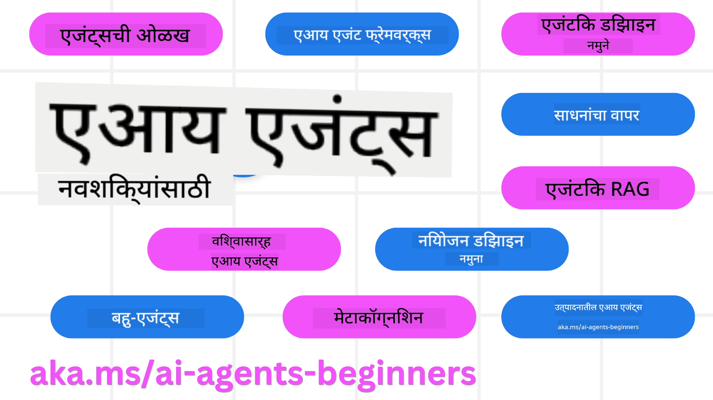

<!--
CO_OP_TRANSLATOR_METADATA:
{
  "original_hash": "6b07046397366e6f6f4524c9ddeba1e1",
  "translation_date": "2025-07-12T14:47:09+00:00",
  "source_file": "README.md",
  "language_code": "mr"
}
-->
# AI एजंट्स फॉर बिगिनर्स - एक कोर्स

## AI एजंट्स तयार करण्यासाठी आवश्यक असलेली सर्व काही शिकवणारे 11 धडे

  
  
  
  

### 🌐 बहुभाषिक समर्थन

#### GitHub Action द्वारे समर्थित (स्वयंचलित आणि नेहमी अद्ययावत)

[French](../fr/README.md) | [Spanish](../es/README.md) | [German](../de/README.md) | [Russian](../ru/README.md) | [Arabic](../ar/README.md) | [Persian (Farsi)](../fa/README.md) | [Urdu](../ur/README.md) | [Chinese (Simplified)](../zh/README.md) | [Chinese (Traditional, Macau)](../mo/README.md) | [Chinese (Traditional, Hong Kong)](../hk/README.md) | [Chinese (Traditional, Taiwan)](../tw/README.md) | [Japanese](../ja/README.md) | [Korean](../ko/README.md) | [Hindi](../hi/README.md) | [Bengali](../bn/README.md) | [Marathi](./README.md) | [Nepali](../ne/README.md) | [Punjabi (Gurmukhi)](../pa/README.md) | [Portuguese (Portugal)](../pt/README.md) | [Portuguese (Brazil)](../br/README.md) | [Italian](../it/README.md) | [Polish](../pl/README.md) | [Turkish](../tr/README.md) | [Greek](../el/README.md) | [Thai](../th/README.md) | [Swedish](../sv/README.md) | [Danish](../da/README.md) | [Norwegian](../no/README.md) | [Finnish](../fi/README.md) | [Dutch](../nl/README.md) | [Hebrew](../he/README.md) | [Vietnamese](../vi/README.md) | [Indonesian](../id/README.md) | [Malay](../ms/README.md) | [Tagalog (Filipino)](../tl/README.md) | [Swahili](../sw/README.md) | [Hungarian](../hu/README.md) | [Czech](../cs/README.md) | [Slovak](../sk/README.md) | [Romanian](../ro/README.md) | [Bulgarian](../bg/README.md) | [Serbian (Cyrillic)](../sr/README.md) | [Croatian](../hr/README.md) | [Slovenian](../sl/README.md) | [Ukrainian](../uk/README.md) | [Burmese (Myanmar)](../my/README.md)

**जर तुम्हाला आणखी भाषांमध्ये अनुवाद हवा असेल तर ते [येथे](https://github.com/Azure/co-op-translator/blob/main/getting_started/supported-languages.md) पाहू शकता**

  
  

## 🌱 सुरुवात कशी करावी

हा कोर्स AI एजंट्स तयार करण्याच्या मूलभूत गोष्टींवर 11 धडे देतो. प्रत्येक धडा वेगळ्या विषयावर आहे, त्यामुळे तुम्हाला जिथून सुरुवात करायची आहे तिथून सुरुवात करा!

या कोर्ससाठी बहुभाषिक समर्थन उपलब्ध आहे. आमच्या [उपलब्ध भाषांमध्ये येथे](../..) पहा.

जर तुम्ही Generative AI मॉडेल्ससह पहिल्यांदा काम करत असाल, तर आमचा [Generative AI For Beginners](https://aka.ms/genai-beginners) कोर्स पहा, ज्यात GenAI वापरून तयार करण्याचे 21 धडे आहेत.

हा रेपो [स्टार (🌟) करायला](https://docs.github.com/en/get-started/exploring-projects-on-github/saving-repositories-with-stars?WT.mc_id=academic-105485-koreyst) आणि [फोर्क करायला](https://github.com/microsoft/ai-agents-for-beginners/fork) विसरू नका, जेणेकरून तुम्ही कोड चालवू शकता.

### काय लागेल

या कोर्समधील प्रत्येक धड्यात कोड उदाहरणे आहेत, जी code_samples फोल्डरमध्ये मिळतील. तुम्ही [हा रेपो फोर्क](https://github.com/microsoft/ai-agents-for-beginners/fork) करून तुमची स्वतःची कॉपी तयार करू शकता.

या व्यायामांमध्ये वापरलेले कोड उदाहरणे Azure AI Foundry आणि GitHub Model Catalogs वापरून Language Models सोबत संवाद साधतात:

- [Github Models](https://aka.ms/ai-agents-beginners/github-models) - मोफत / मर्यादित  
- [Azure AI Foundry](https://aka.ms/ai-agents-beginners/ai-foundry) - Azure Account आवश्यक

हा कोर्स Microsoft कडून खालील AI Agent फ्रेमवर्क्स आणि सेवा देखील वापरतो:

- [Azure AI Agent Service](https://aka.ms/ai-agents-beginners/ai-agent-service)  
- [Semantic Kernel](https://aka.ms/ai-agents-beginners/semantic-kernel)  
- [AutoGen](https://aka.ms/ai-agents/autogen)

या कोर्ससाठी कोड कसा चालवायचा याबद्दल अधिक माहितीसाठी, [Course Setup](./00-course-setup/README.md) पहा.

## 🙏 मदत करायची आहे का?

तुमच्याकडे काही सूचना आहेत का किंवा स्पेलिंग किंवा कोडमध्ये चुका सापडल्या आहेत का? [इश्यू उघडा](https://github.com/microsoft/ai-agents-for-beginners/issues?WT.mc_id=academic-105485-koreyst) किंवा [पुल रिक्वेस्ट तयार करा](https://github.com/microsoft/ai-agents-for-beginners/pulls?WT.mc_id=academic-105485-koreyst)

जर तुम्हाला अडचण आली किंवा AI एजंट्स तयार करताना काही प्रश्न असतील, तर आमच्या [Azure AI Foundry Community Discord](https://discord.gg/kzRShWzttr) मध्ये सामील व्हा.

जर तुम्हाला उत्पादनाबाबत अभिप्राय द्यायचा असेल किंवा चुका आढळल्या तर आमच्या [Azure AI Foundry Developer Forum](https://aka.ms/azureaifoundry/forum) ला भेट द्या.

## 📂 प्रत्येक धड्यात काय आहे

- README मध्ये लिहिलेला धडा आणि एक लहान व्हिडिओ  
- Azure AI Foundry आणि Github Models (मोफत) साठी Python कोड उदाहरणे  
- तुमचे शिक्षण सुरू ठेवण्यासाठी अतिरिक्त संसाधनांचे दुवे  

## 🗃️ धडे

| **धडा**                                | **माहिती आणि कोड**                                  | **व्हिडिओ**                                                | **अतिरिक्त शिक्षण**                                                                    |
|----------------------------------------|----------------------------------------------------|------------------------------------------------------------|----------------------------------------------------------------------------------------|
| AI एजंट्स आणि एजंट वापर प्रकरणांची ओळख | [Link](./01-intro-to-ai-agents/README.md)          | [Video](https://youtu.be/3zgm60bXmQk?si=z8QygFvYQv-9WtO1)  | [Link](https://aka.ms/ai-agents-beginners/collection?WT.mc_id=academic-105485-koreyst) |
| AI एजंटिक फ्रेमवर्क्सचा अभ्यास         | [Link](./02-explore-agentic-frameworks/README.md)  | [Video](https://youtu.be/ODwF-EZo_O8?si=Vawth4hzVaHv-u0H)  | [Link](https://aka.ms/ai-agents-beginners/collection?WT.mc_id=academic-105485-koreyst) |
| AI एजंटिक डिझाइन पॅटर्न समजून घेणे    | [Link](./03-agentic-design-patterns/README.md)     | [Video](https://youtu.be/m9lM8qqoOEA?si=BIzHwzstTPL8o9GF)  | [Link](https://aka.ms/ai-agents-beginners/collection?WT.mc_id=academic-105485-koreyst) |
| टूल वापर डिझाइन पॅटर्न                 | [Link](./04-tool-use/README.md)                    | [Video](https://youtu.be/vieRiPRx-gI?si=2z6O2Xu2cu_Jz46N)  | [Link](https://aka.ms/ai-agents-beginners/collection?WT.mc_id=academic-105485-koreyst) |
| एजंटिक RAG                            | [Link](./05-agentic-rag/README.md)                 | [Video](https://youtu.be/WcjAARvdL7I?si=gKPWsQpKiIlDH9A3)  | [Link](https://aka.ms/ai-agents-beginners/collection?WT.mc_id=academic-105485-koreyst) |
| विश्वासार्ह AI एजंट्स तयार करणे         | [Link](./06-building-trustworthy-agents/README.md) | [Video](https://youtu.be/iZKkMEGBCUQ?si=jZjpiMnGFOE9L8OK ) | [Link](https://aka.ms/ai-agents-beginners/collection?WT.mc_id=academic-105485-koreyst) |
| नियोजन डिझाइन पॅटर्न                  | [Link](./07-planning-design/README.md)             | [Video](https://youtu.be/kPfJ2BrBCMY?si=6SC_iv_E5-mzucnC)  | [Link](https://aka.ms/ai-agents-beginners/collection?WT.mc_id=academic-105485-koreyst) |
| मल्टी-एजंट डिझाइन पॅटर्न              | [Link](./08-multi-agent/README.md)                 | [Video](https://youtu.be/V6HpE9hZEx0?si=rMgDhEu7wXo2uo6g)  | [Link](https://aka.ms/ai-agents-beginners/collection?WT.mc_id=academic-105485-koreyst) |
| मेटाकॉग्निशन डिझाइन पॅटर्न            | [Link](./09-metacognition/README.md)               | [Video](https://youtu.be/His9R6gw6Ec?si=8gck6vvdSNCt6OcF)  | [Link](https://aka.ms/ai-agents-beginners/collection?WT.mc_id=academic-105485-koreyst) |
| उत्पादनात AI एजंट्स                    | [Link](./10-ai-agents-production/README.md)        | [Video](https://youtu.be/l4TP6IyJxmQ?si=31dnhexRo6yLRJDl)  | [Link](https://aka.ms/ai-agents-beginners/collection?WT.mc_id=academic-105485-koreyst) |
| MCP सह AI एजंट्स                      | [Link](./11-mcp/README.md)                         |                                                            | [Link](https://aka.ms/mcp-for-beginners)                                               |

## 🎒 इतर कोर्सेस

आमची टीम इतर कोर्सेस देखील तयार करते! ते पाहा:
- [**नवीन** Model Context Protocol (MCP) सुरुवातीसाठी](https://github.com/microsoft/mcp-for-beginners?WT.mc_id=academic-105485-koreyst)
- [.NET वापरून सुरुवातीसाठी Generative AI](https://github.com/microsoft/Generative-AI-for-beginners-dotnet?WT.mc_id=academic-105485-koreyst)
- [सुरुवातीसाठी Generative AI](https://github.com/microsoft/generative-ai-for-beginners?WT.mc_id=academic-105485-koreyst)
- [सुरुवातीसाठी ML](https://aka.ms/ml-beginners?WT.mc_id=academic-105485-koreyst)
- [सुरुवातीसाठी Data Science](https://aka.ms/datascience-beginners?WT.mc_id=academic-105485-koreyst)
- [सुरुवातीसाठी AI](https://aka.ms/ai-beginners?WT.mc_id=academic-105485-koreyst)
- [सुरुवातीसाठी Cybersecurity](https://github.com/microsoft/Security-101??WT.mc_id=academic-96948-sayoung)
- [सुरुवातीसाठी Web Dev](https://aka.ms/webdev-beginners?WT.mc_id=academic-105485-koreyst)
- [सुरुवातीसाठी IoT](https://aka.ms/iot-beginners?WT.mc_id=academic-105485-koreyst)
- [सुरुवातीसाठी XR Development](https://github.com/microsoft/xr-development-for-beginners?WT.mc_id=academic-105485-koreyst)
- [AI Paired Programming साठी GitHub Copilot मध्ये प्रावीण्य मिळवा](https://aka.ms/GitHubCopilotAI?WT.mc_id=academic-105485-koreyst)
- [C#/.NET Developers साठी GitHub Copilot मध्ये प्रावीण्य मिळवा](https://github.com/microsoft/mastering-github-copilot-for-dotnet-csharp-developers?WT.mc_id=academic-105485-koreyst)
- [तुमची स्वतःची Copilot साहस निवडा](https://github.com/microsoft/CopilotAdventures?WT.mc_id=academic-105485-koreyst)

## 🌟 समुदायाचे आभार

Agentic RAG दाखवणारे महत्त्वाचे कोड नमुने देण्यासाठी [Shivam Goyal](https://www.linkedin.com/in/shivam2003/) यांचे आभार.

## योगदान देणे

हा प्रकल्प योगदान आणि सूचना स्वागत करतो. बहुतेक योगदानांसाठी तुम्हाला Contributor License Agreement (CLA) सहमत व्हावे लागते, ज्यात तुम्ही हे मान्य करता की तुम्हाला तुमचे योगदान वापरण्याचा अधिकार आहे आणि तुम्ही तो आम्हाला दिला आहे. तपशीलांसाठी भेट द्या <https://cla.opensource.microsoft.com>.

जेव्हा तुम्ही pull request सबमिट करता, तेव्हा CLA bot आपोआप ठरवेल की तुम्हाला CLA द्यावे लागेल का आणि PR योग्यरित्या (उदा., status check, comment) सजवेल. फक्त bot कडून दिलेल्या सूचनांचे पालन करा. आमच्या CLA वापरणाऱ्या सर्व रेपॉजमध्ये तुम्हाला हे फक्त एकदाच करावे लागेल.

हा प्रकल्प [Microsoft Open Source Code of Conduct](https://opensource.microsoft.com/codeofconduct/) स्वीकारतो. अधिक माहितीसाठी [Code of Conduct FAQ](https://opensource.microsoft.com/codeofconduct/faq/) पहा किंवा कोणत्याही अतिरिक्त प्रश्नांसाठी किंवा टिप्पण्यांसाठी [opencode@microsoft.com](mailto:opencode@microsoft.com) शी संपर्क करा.

## ट्रेडमार्क

हा प्रकल्प प्रकल्प, उत्पादने किंवा सेवा यांचे ट्रेडमार्क किंवा लोगो असू शकतात. Microsoft ट्रेडमार्क किंवा लोगोचा अधिकृत वापर [Microsoft's Trademark & Brand Guidelines](https://www.microsoft.com/legal/intellectualproperty/trademarks/usage/general) नुसार असावा. या प्रकल्पाच्या सुधारित आवृत्त्यांमध्ये Microsoft ट्रेडमार्क किंवा लोगोचा वापर गोंधळ निर्माण करू नये किंवा Microsoft च्या प्रायोजकत्वाचा भास देऊ नये. तृतीय पक्षांच्या ट्रेडमार्क किंवा लोगोचा वापर त्या तृतीय पक्षांच्या धोरणांनुसार असतो.

**अस्वीकरण**:  
हा दस्तऐवज AI अनुवाद सेवा [Co-op Translator](https://github.com/Azure/co-op-translator) वापरून अनुवादित केला आहे. आम्ही अचूकतेसाठी प्रयत्नशील असलो तरी, कृपया लक्षात घ्या की स्वयंचलित अनुवादांमध्ये चुका किंवा अचूकतेची कमतरता असू शकते. मूळ दस्तऐवज त्याच्या स्थानिक भाषेत अधिकृत स्रोत मानला जावा. महत्त्वाच्या माहितीसाठी व्यावसायिक मानवी अनुवाद करण्याची शिफारस केली जाते. या अनुवादाच्या वापरामुळे उद्भवलेल्या कोणत्याही गैरसमजुती किंवा चुकीच्या अर्थलागी आम्ही जबाबदार नाही.