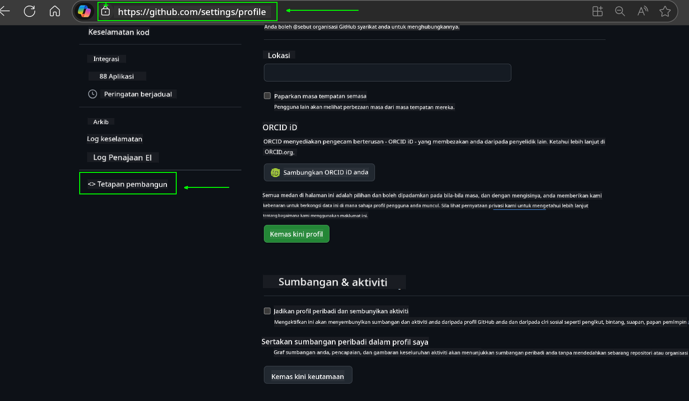
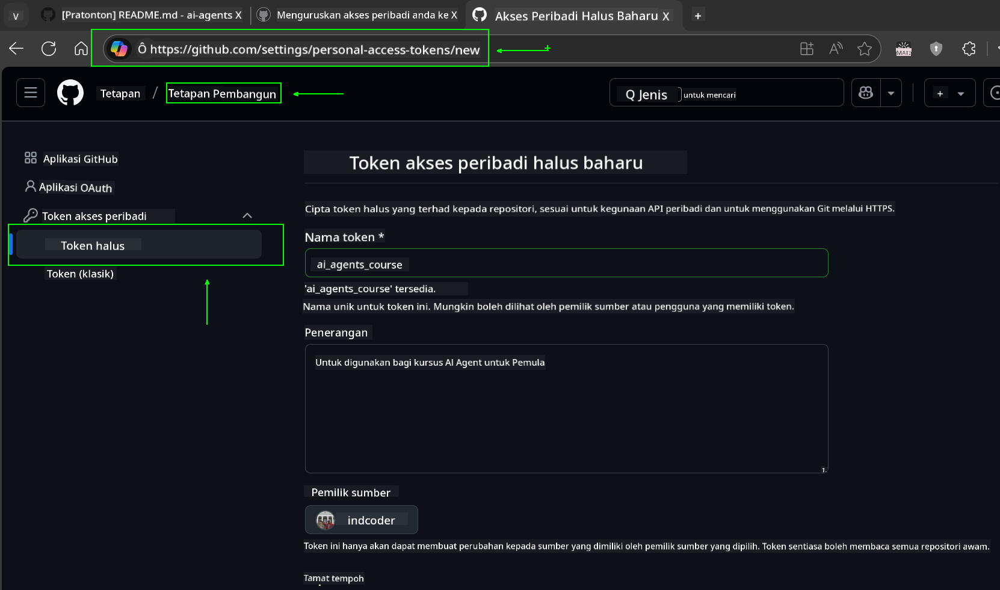
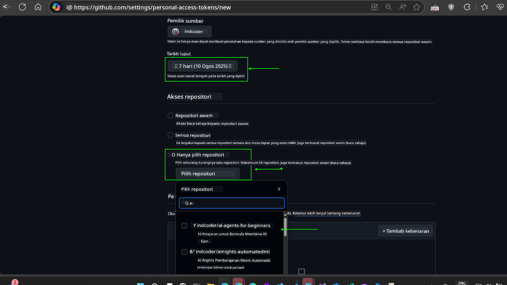
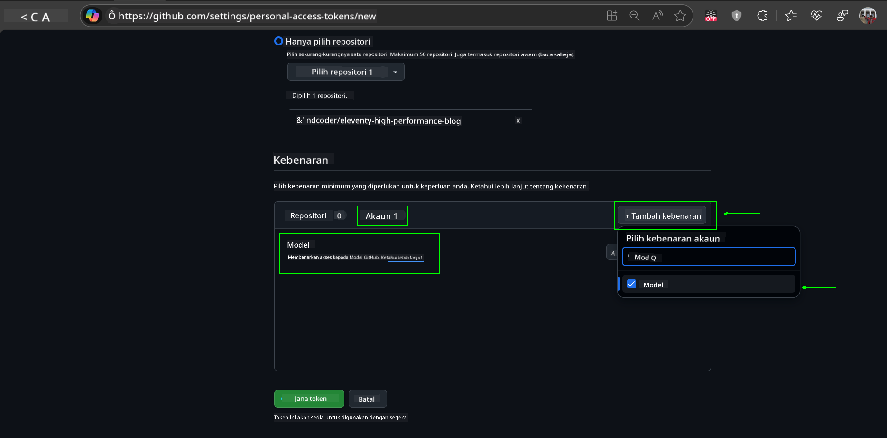
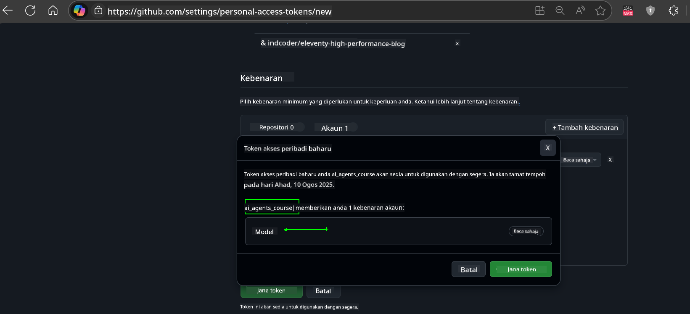
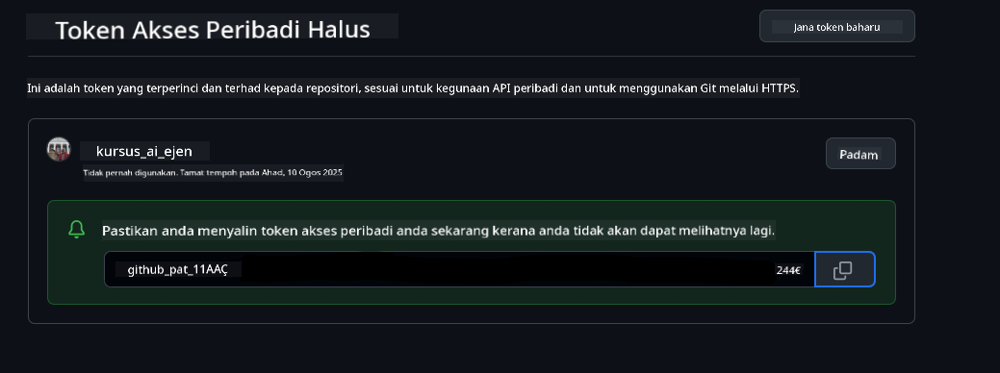
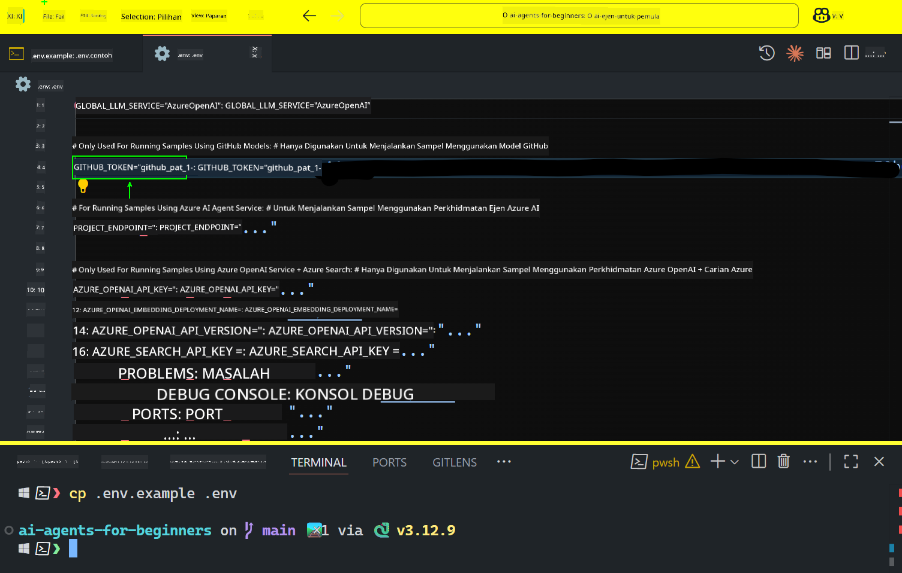

<!--
CO_OP_TRANSLATOR_METADATA:
{
  "original_hash": "c55b973b1562abf5aadf6a4028265ac5",
  "translation_date": "2025-08-29T18:17:54+00:00",
  "source_file": "00-course-setup/README.md",
  "language_code": "ms"
}
-->
# Persediaan Kursus

## Pengenalan

Pelajaran ini akan membincangkan cara menjalankan contoh kod dalam kursus ini.

## Sertai Pelajar Lain dan Dapatkan Bantuan

Sebelum anda mula mengklon repositori anda, sertai [saluran Discord AI Agents For Beginners](https://aka.ms/ai-agents/discord) untuk mendapatkan bantuan dengan persediaan, sebarang soalan tentang kursus, atau untuk berhubung dengan pelajar lain.

## Klon atau Fork Repositori Ini

Untuk memulakan, sila klon atau fork Repositori GitHub. Ini akan mencipta versi kursus anda sendiri supaya anda boleh menjalankan, menguji, dan mengubah suai kod!

Ini boleh dilakukan dengan mengklik pautan berikut:


## Menjalankan Kod

Kursus ini menyediakan siri Jupyter Notebooks yang boleh anda jalankan untuk mendapatkan pengalaman langsung membina AI Agents.

Contoh kod menggunakan:

**Memerlukan Akaun GitHub - Percuma**:

1) Rangka Kerja Semantic Kernel Agent + Pasar Model GitHub. Dilabelkan sebagai (semantic-kernel.ipynb)
2) Rangka Kerja AutoGen + Pasar Model GitHub. Dilabelkan sebagai (autogen.ipynb)

**Memerlukan Langganan Azure**:
3) Azure AI Foundry + Perkhidmatan Azure AI Agent. Dilabelkan sebagai (azureaiagent.ipynb)

Kami menggalakkan anda mencuba ketiga-tiga jenis contoh untuk melihat mana yang paling sesuai untuk anda.

Pilihan yang anda pilih akan menentukan langkah persediaan yang perlu anda ikuti di bawah:

## Keperluan

- Python 3.12+
  - **NOTE**: Jika anda belum memasang Python3.12, pastikan anda memasangnya. Kemudian buat venv anda menggunakan python3.12 untuk memastikan versi yang betul dipasang daripada fail requirements.txt.
- Akaun GitHub - Untuk Akses ke Pasar Model GitHub
- Langganan Azure - Untuk Akses ke Azure AI Foundry
- Akaun Azure AI Foundry - Untuk Akses ke Perkhidmatan Azure AI Agent

Kami telah menyertakan fail `requirements.txt` di akar repositori ini yang mengandungi semua pakej Python yang diperlukan untuk menjalankan contoh kod.

Anda boleh memasangnya dengan menjalankan arahan berikut di terminal anda di akar repositori:

```bash
pip install -r requirements.txt
```
Kami mengesyorkan membuat persekitaran maya Python untuk mengelakkan sebarang konflik dan masalah.

## Persediaan VSCode
Pastikan anda menggunakan versi Python yang betul dalam VSCode.


## Persediaan untuk Contoh Menggunakan Model GitHub 

### Langkah 1: Dapatkan Token Akses Peribadi (PAT) GitHub Anda

Kursus ini menggunakan Pasar Model GitHub, yang menyediakan akses percuma ke Model Bahasa Besar (LLMs) yang akan anda gunakan untuk membina AI Agents.

Untuk menggunakan Model GitHub, anda perlu mencipta [Token Akses Peribadi GitHub](https://docs.github.com/en/authentication/keeping-your-account-and-data-secure/managing-your-personal-access-tokens).

Ini boleh dilakukan dengan pergi ke akaun GitHub anda.

Sila ikuti [Prinsip Privasi Minimum](https://docs.github.com/en/get-started/learning-to-code/storing-your-secrets-safely) semasa mencipta token anda. Ini bermaksud anda hanya perlu memberikan token kebenaran yang diperlukan untuk menjalankan contoh kod dalam kursus ini.

1. Pilih pilihan `Fine-grained tokens` di sebelah kiri skrin anda dengan pergi ke **Developer settings**
   

    Kemudian pilih `Generate new token`.

    

2. Masukkan nama deskriptif untuk token anda yang mencerminkan tujuannya, supaya mudah dikenali kemudian.


    🔐 Cadangan Tempoh Token

    Tempoh yang disyorkan: 30 hari
    Untuk postur keselamatan yang lebih baik, anda boleh memilih tempoh yang lebih pendek—seperti 7 hari 🛡️
    Ini adalah cara yang baik untuk menetapkan sasaran peribadi dan menyelesaikan kursus semasa momentum pembelajaran anda tinggi 🚀.

    

3. Hadkan skop token kepada fork repositori ini.

    

4. Hadkan kebenaran token: Di bawah **Permissions**, klik tab **Account**, dan klik butang "+ Add permissions". Senarai dropdown akan muncul. Sila cari **Models** dan tandakan kotak untuknya.
    

5. Sahkan kebenaran yang diperlukan sebelum menjana token. 

6. Sebelum menjana token, pastikan anda bersedia untuk menyimpan token di tempat yang selamat seperti peti simpanan pengurus kata laluan, kerana ia tidak akan ditunjukkan lagi selepas anda menciptanya. 

Salin token baru anda yang baru sahaja anda cipta. Anda kini akan menambahkannya ke fail `.env` yang disertakan dalam kursus ini.


### Langkah 2: Cipta Fail `.env` Anda

Untuk mencipta fail `.env` anda, jalankan arahan berikut di terminal anda.

```bash
cp .env.example .env
```

Ini akan menyalin fail contoh dan mencipta `.env` dalam direktori anda di mana anda mengisi nilai untuk pembolehubah persekitaran.

Dengan token anda disalin, buka fail `.env` dalam editor teks kegemaran anda dan tampal token anda ke medan `GITHUB_TOKEN`.



Anda kini sepatutnya dapat menjalankan contoh kod dalam kursus ini.

## Persediaan untuk Contoh Menggunakan Azure AI Foundry dan Perkhidmatan Azure AI Agent

### Langkah 1: Dapatkan Endpoint Projek Azure Anda


Ikuti langkah-langkah untuk mencipta hub dan projek dalam Azure AI Foundry yang terdapat di sini: [Hub resources overview](https://learn.microsoft.com/en-us/azure/ai-foundry/concepts/ai-resources)


Setelah anda mencipta projek anda, anda perlu mendapatkan string sambungan untuk projek anda.

Ini boleh dilakukan dengan pergi ke halaman **Overview** projek anda di portal Azure AI Foundry.


### Langkah 2: Cipta Fail `.env` Anda

Untuk mencipta fail `.env` anda, jalankan arahan berikut di terminal anda.

```bash
cp .env.example .env
```

Ini akan menyalin fail contoh dan mencipta `.env` dalam direktori anda di mana anda mengisi nilai untuk pembolehubah persekitaran.

Dengan token anda disalin, buka fail `.env` dalam editor teks kegemaran anda dan tampal token anda ke medan `PROJECT_ENDPOINT`.

### Langkah 3: Log Masuk ke Azure

Sebagai amalan keselamatan terbaik, kita akan menggunakan [pengesahan tanpa kunci](https://learn.microsoft.com/azure/developer/ai/keyless-connections?tabs=csharp%2Cazure-cli?WT.mc_id=academic-105485-koreyst) untuk mengesahkan ke Azure OpenAI dengan Microsoft Entra ID. 

Seterusnya, buka terminal dan jalankan `az login --use-device-code` untuk log masuk ke akaun Azure anda.

Setelah anda log masuk, pilih langganan anda di terminal.


## Pembolehubah Persekitaran Tambahan - Azure Search dan Azure OpenAI 

Untuk Pelajaran Agentic RAG - Pelajaran 5 - terdapat contoh yang menggunakan Azure Search dan Azure OpenAI.

Jika anda ingin menjalankan contoh ini, anda perlu menambah pembolehubah persekitaran berikut ke fail `.env` anda:

### Halaman Overview (Projek)

- `AZURE_SUBSCRIPTION_ID` - Semak **Project details** di halaman **Overview** projek anda.

- `AZURE_AI_PROJECT_NAME` - Lihat di bahagian atas halaman **Overview** projek anda.

- `AZURE_OPENAI_SERVICE` - Cari ini di tab **Included capabilities** untuk **Azure OpenAI Service** di halaman **Overview**.

### Pusat Pengurusan

- `AZURE_OPENAI_RESOURCE_GROUP` - Pergi ke **Project properties** di halaman **Overview** di **Management Center**.

- `GLOBAL_LLM_SERVICE` - Di bawah **Connected resources**, cari nama sambungan **Azure AI Services**. Jika tidak disenaraikan, semak **Azure portal** di bawah kumpulan sumber anda untuk nama sumber AI Services.

### Halaman Models + Endpoints

- `AZURE_OPENAI_EMBEDDING_DEPLOYMENT_NAME` - Pilih model embedding anda (contohnya, `text-embedding-ada-002`) dan catat **Deployment name** dari butiran model.

- `AZURE_OPENAI_CHAT_DEPLOYMENT_NAME` - Pilih model chat anda (contohnya, `gpt-4o-mini`) dan catat **Deployment name** dari butiran model.

### Portal Azure

- `AZURE_OPENAI_ENDPOINT` - Cari **Azure AI services**, klik padanya, kemudian pergi ke **Resource Management**, **Keys and Endpoint**, skrol ke bawah ke "Azure OpenAI endpoints", dan salin yang mengatakan "Language APIs".

- `AZURE_OPENAI_API_KEY` - Dari skrin yang sama, salin KEY 1 atau KEY 2.

- `AZURE_SEARCH_SERVICE_ENDPOINT` - Cari sumber **Azure AI Search** anda, klik padanya, dan lihat **Overview**.

- `AZURE_SEARCH_API_KEY` - Kemudian pergi ke **Settings** dan kemudian **Keys** untuk menyalin kunci admin utama atau sekunder.

### Halaman Luar

- `AZURE_OPENAI_API_VERSION` - Lawati halaman [API version lifecycle](https://learn.microsoft.com/en-us/azure/ai-services/openai/api-version-deprecation#latest-ga-api-release) di bawah **Latest GA API release**.

### Persediaan pengesahan tanpa kunci

Daripada mengekodkan kelayakan anda, kita akan menggunakan sambungan tanpa kunci dengan Azure OpenAI. Untuk melakukannya, kita akan mengimport `DefaultAzureCredential` dan kemudian memanggil fungsi `DefaultAzureCredential` untuk mendapatkan kelayakan.

```python
from azure.identity import DefaultAzureCredential, InteractiveBrowserCredential
```

## Tersangkut di Mana-Mana?

Jika anda menghadapi sebarang masalah menjalankan persediaan ini, sertai kami di saluran Discord untuk mendapatkan bantuan.

## Pelajaran Seterusnya

Anda kini bersedia untuk menjalankan kod untuk kursus ini. Selamat belajar lebih lanjut tentang dunia AI Agents! 

[Introduction to AI Agents and Agent Use Cases](../01-intro-to-ai-agents/README.md)

---

**Penafian**:  
Dokumen ini telah diterjemahkan menggunakan perkhidmatan terjemahan AI [Co-op Translator](https://github.com/Azure/co-op-translator). Walaupun kami berusaha untuk memastikan ketepatan, sila ambil perhatian bahawa terjemahan automatik mungkin mengandungi kesilapan atau ketidaktepatan. Dokumen asal dalam bahasa asalnya harus dianggap sebagai sumber yang berwibawa. Untuk maklumat yang kritikal, terjemahan manusia profesional adalah disyorkan. Kami tidak bertanggungjawab atas sebarang salah faham atau salah tafsir yang timbul daripada penggunaan terjemahan ini.