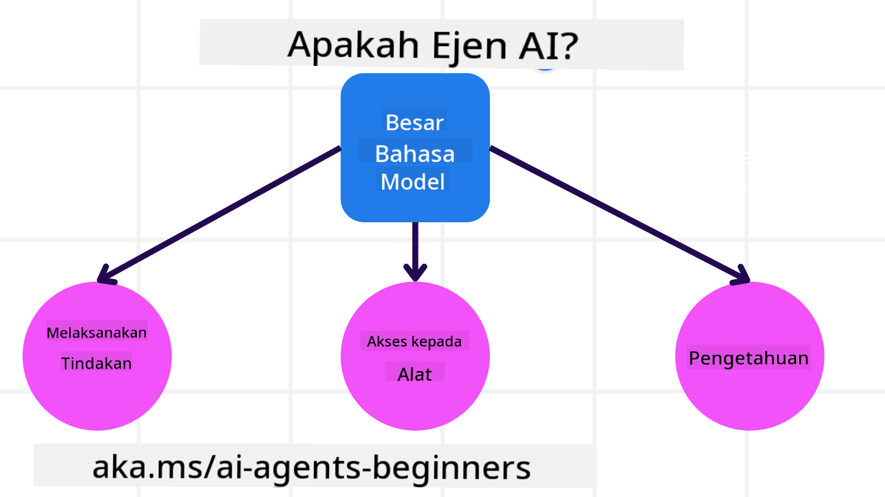
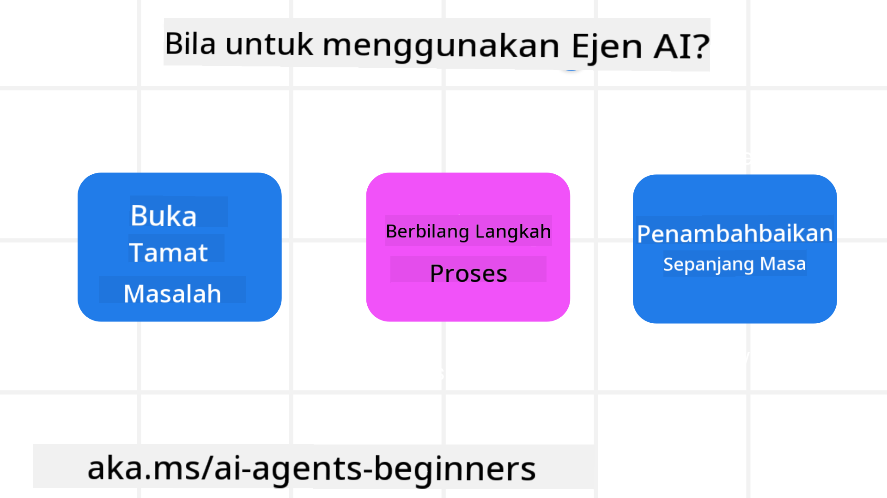

<!--
CO_OP_TRANSLATOR_METADATA:
{
  "original_hash": "d84943abc8f001ad4670418d32c2d899",
  "translation_date": "2025-07-12T08:10:02+00:00",
  "source_file": "01-intro-to-ai-agents/README.md",
  "language_code": "ms"
}
-->
untuk bertemu dengan pelajar lain dan Pembina Agen AI serta bertanya apa-apa soalan yang anda ada mengenai kursus ini.

Untuk memulakan kursus ini, kita akan mula dengan memahami dengan lebih baik apa itu Agen AI dan bagaimana kita boleh menggunakannya dalam aplikasi dan aliran kerja yang kita bina.

## Pengenalan

Pelajaran ini merangkumi:

- Apa itu Agen AI dan apakah jenis-jenis agen yang berbeza?
- Apakah kes penggunaan terbaik untuk Agen AI dan bagaimana ia boleh membantu kita?
- Apakah beberapa blok binaan asas apabila mereka bentuk Penyelesaian Agentik?

## Matlamat Pembelajaran
Selepas menamatkan pelajaran ini, anda sepatutnya dapat:

- Memahami konsep Agen AI dan bagaimana ia berbeza daripada penyelesaian AI lain.
- Mengaplikasikan Agen AI dengan cara yang paling cekap.
- Mereka bentuk penyelesaian Agentik dengan produktif untuk pengguna dan pelanggan.

## Mendefinisikan Agen AI dan Jenis-Jenis Agen AI

### Apa itu Agen AI?

Agen AI adalah **sistem** yang membolehkan **Model Bahasa Besar (LLMs)** untuk **melakukan tindakan** dengan memperluaskan keupayaan mereka dengan memberikan LLM akses kepada **alat** dan **pengetahuan**.

Mari kita pecahkan definisi ini kepada bahagian yang lebih kecil:

- **Sistem** - Penting untuk memikirkan agen bukan hanya sebagai satu komponen tunggal tetapi sebagai sistem yang terdiri daripada banyak komponen. Pada tahap asas, komponen Agen AI adalah:
  - **Persekitaran** - Ruang yang ditakrifkan di mana Agen AI beroperasi. Contohnya, jika kita mempunyai agen tempahan perjalanan, persekitaran itu boleh menjadi sistem tempahan perjalanan yang digunakan oleh Agen AI untuk melengkapkan tugasan.
  - **Sensor** - Persekitaran mempunyai maklumat dan memberikan maklum balas. Agen AI menggunakan sensor untuk mengumpul dan mentafsir maklumat ini tentang keadaan semasa persekitaran. Dalam contoh Agen Tempahan Perjalanan, sistem tempahan boleh memberikan maklumat seperti ketersediaan hotel atau harga penerbangan.
  - **Aktuator** - Setelah Agen AI menerima keadaan semasa persekitaran, untuk tugasan semasa agen menentukan tindakan apa yang perlu dilakukan untuk mengubah persekitaran. Untuk agen tempahan perjalanan, ia mungkin menempah bilik yang tersedia untuk pengguna.

**Model Bahasa Besar** - Konsep agen wujud sebelum penciptaan LLM. Kelebihan membina Agen AI dengan LLM adalah keupayaan mereka untuk mentafsir bahasa manusia dan data. Keupayaan ini membolehkan LLM mentafsir maklumat persekitaran dan merangka pelan untuk mengubah persekitaran.

**Melakukan Tindakan** - Di luar sistem Agen AI, LLM terhad kepada situasi di mana tindakan adalah menjana kandungan atau maklumat berdasarkan arahan pengguna. Dalam sistem Agen AI, LLM boleh melaksanakan tugasan dengan mentafsir permintaan pengguna dan menggunakan alat yang tersedia dalam persekitaran mereka.

**Akses Kepada Alat** - Alat yang boleh diakses oleh LLM ditentukan oleh 1) persekitaran di mana ia beroperasi dan 2) pembangun Agen AI. Untuk contoh agen perjalanan kita, alat agen terhad oleh operasi yang tersedia dalam sistem tempahan, dan/atau pembangun boleh mengehadkan akses alat agen kepada penerbangan sahaja.

**Memori+Pengetahuan** - Memori boleh bersifat jangka pendek dalam konteks perbualan antara pengguna dan agen. Dalam jangka panjang, di luar maklumat yang disediakan oleh persekitaran, Agen AI juga boleh mendapatkan pengetahuan dari sistem lain, perkhidmatan, alat, dan juga agen lain. Dalam contoh agen perjalanan, pengetahuan ini boleh menjadi maklumat tentang keutamaan perjalanan pengguna yang disimpan dalam pangkalan data pelanggan.

### Jenis-jenis Agen

Sekarang kita mempunyai definisi umum tentang Agen AI, mari kita lihat beberapa jenis agen khusus dan bagaimana ia boleh digunakan pada agen tempahan perjalanan.

| **Jenis Agen**                | **Penerangan**                                                                                                                       | **Contoh**                                                                                                                                                                                                                   |
| ----------------------------- | ------------------------------------------------------------------------------------------------------------------------------------- | ----------------------------------------------------------------------------------------------------------------------------------------------------------------------------------------------------------------------------- |
| **Agen Refleks Mudah**        | Melakukan tindakan segera berdasarkan peraturan yang telah ditetapkan.                                                               | Agen perjalanan mentafsir konteks e-mel dan menghantar aduan perjalanan kepada perkhidmatan pelanggan.                                                                                                                      |
| **Agen Refleks Berasaskan Model** | Melakukan tindakan berdasarkan model dunia dan perubahan pada model tersebut.                                                        | Agen perjalanan mengutamakan laluan dengan perubahan harga yang ketara berdasarkan akses kepada data harga sejarah.                                                                                                         |
| **Agen Berasaskan Matlamat**  | Membuat pelan untuk mencapai matlamat tertentu dengan mentafsir matlamat dan menentukan tindakan untuk mencapainya.                   | Agen perjalanan menempah perjalanan dengan menentukan susunan perjalanan yang diperlukan (kereta, pengangkutan awam, penerbangan) dari lokasi semasa ke destinasi.                                                             |
| **Agen Berasaskan Utiliti**   | Mengambil kira keutamaan dan menimbang pertukaran secara numerik untuk menentukan cara mencapai matlamat.                             | Agen perjalanan memaksimumkan utiliti dengan menimbang kemudahan berbanding kos semasa menempah perjalanan.                                                                                                                  |
| **Agen Pembelajaran**         | Membaiki prestasi dari masa ke masa dengan bertindak balas kepada maklum balas dan menyesuaikan tindakan.                             | Agen perjalanan memperbaiki perkhidmatan dengan menggunakan maklum balas pelanggan dari tinjauan selepas perjalanan untuk membuat penyesuaian pada tempahan akan datang.                                                      |
| **Agen Hierarki**             | Mempunyai beberapa agen dalam sistem bertingkat, dengan agen tahap tinggi membahagikan tugasan kepada agen tahap rendah untuk diselesaikan. | Agen perjalanan membatalkan perjalanan dengan membahagikan tugasan kepada subtugasan (contohnya, membatalkan tempahan tertentu) dan agen tahap rendah menyelesaikannya, kemudian melaporkan kembali kepada agen tahap tinggi. |
| **Sistem Multi-Agen (MAS)**   | Agen menyelesaikan tugasan secara bebas, sama ada secara kerjasama atau bersaing.                                                    | Kerjasama: Beberapa agen menempah perkhidmatan perjalanan tertentu seperti hotel, penerbangan, dan hiburan. Persaingan: Beberapa agen mengurus dan bersaing untuk tempahan hotel yang sama bagi menempatkan pelanggan.           |

## Bila Menggunakan Agen AI

Dalam bahagian sebelum ini, kita menggunakan kes penggunaan Agen Perjalanan untuk menerangkan bagaimana jenis-jenis agen yang berbeza boleh digunakan dalam senario tempahan perjalanan yang berbeza. Kita akan terus menggunakan aplikasi ini sepanjang kursus.

Mari kita lihat jenis kes penggunaan yang paling sesuai untuk Agen AI:

- **Masalah Terbuka** - membenarkan LLM menentukan langkah yang diperlukan untuk melengkapkan tugasan kerana ia tidak selalu boleh diprogramkan secara keras dalam aliran kerja.
- **Proses Berbilang Langkah** - tugasan yang memerlukan tahap kerumitan di mana Agen AI perlu menggunakan alat atau maklumat dalam beberapa pusingan dan bukan hanya pengambilan sekali sahaja.
- **Penambahbaikan Dari Masa ke Masa** - tugasan di mana agen boleh memperbaiki prestasi dari masa ke masa dengan menerima maklum balas sama ada dari persekitarannya atau pengguna untuk memberikan utiliti yang lebih baik.

Kami akan membincangkan lebih banyak pertimbangan menggunakan Agen AI dalam pelajaran Membina Agen AI yang Boleh Dipercayai.

## Asas Penyelesaian Agentik

### Pembangunan Agen

Langkah pertama dalam mereka bentuk sistem Agen AI adalah untuk menentukan alat, tindakan, dan tingkah laku. Dalam kursus ini, kita fokus menggunakan **Azure AI Agent Service** untuk mendefinisikan Agen kita. Ia menawarkan ciri-ciri seperti:

- Pemilihan Model Terbuka seperti OpenAI, Mistral, dan Llama
- Penggunaan Data Berlesen melalui penyedia seperti Tripadvisor
- Penggunaan alat OpenAPI 3.0 yang standard

### Corak Agentik

Komunikasi dengan LLM adalah melalui arahan (prompts). Memandangkan sifat separa autonomi Agen AI, tidak selalu mungkin atau diperlukan untuk memberi arahan semula secara manual kepada LLM selepas perubahan dalam persekitaran. Kita menggunakan **Corak Agentik** yang membolehkan kita memberi arahan kepada LLM dalam beberapa langkah dengan cara yang lebih boleh diskala.

Kursus ini dibahagikan kepada beberapa corak Agentik yang popular pada masa kini.

### Rangka Kerja Agentik

Rangka Kerja Agentik membolehkan pembangun melaksanakan corak agentik melalui kod. Rangka kerja ini menawarkan templat, plugin, dan alat untuk kolaborasi Agen AI yang lebih baik. Manfaat ini menyediakan keupayaan untuk pemerhatian dan penyelesaian masalah sistem Agen AI dengan lebih baik.

Dalam kursus ini, kita akan meneroka rangka kerja AutoGen yang berasaskan penyelidikan dan rangka kerja Agent yang sedia untuk produksi dari Semantic Kernel.

## Pelajaran Sebelumnya

[Persediaan Kursus](../00-course-setup/README.md)

## Pelajaran Seterusnya

[Meneroka Rangka Kerja Agentik](../02-explore-agentic-frameworks/README.md)

**Penafian**:  
Dokumen ini telah diterjemahkan menggunakan perkhidmatan terjemahan AI [Co-op Translator](https://github.com/Azure/co-op-translator). Walaupun kami berusaha untuk ketepatan, sila ambil maklum bahawa terjemahan automatik mungkin mengandungi kesilapan atau ketidaktepatan. Dokumen asal dalam bahasa asalnya harus dianggap sebagai sumber yang sahih. Untuk maklumat penting, terjemahan profesional oleh manusia adalah disyorkan. Kami tidak bertanggungjawab atas sebarang salah faham atau salah tafsir yang timbul daripada penggunaan terjemahan ini.