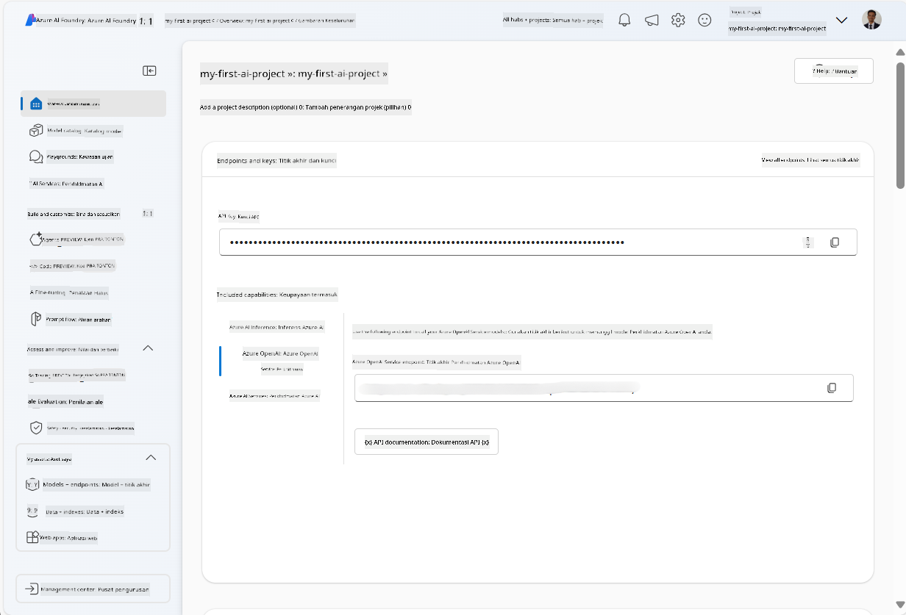
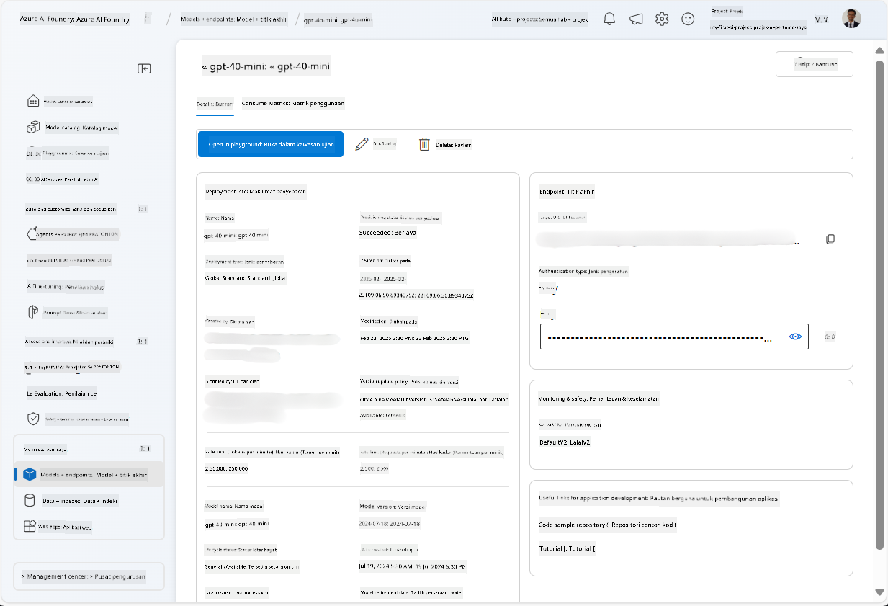
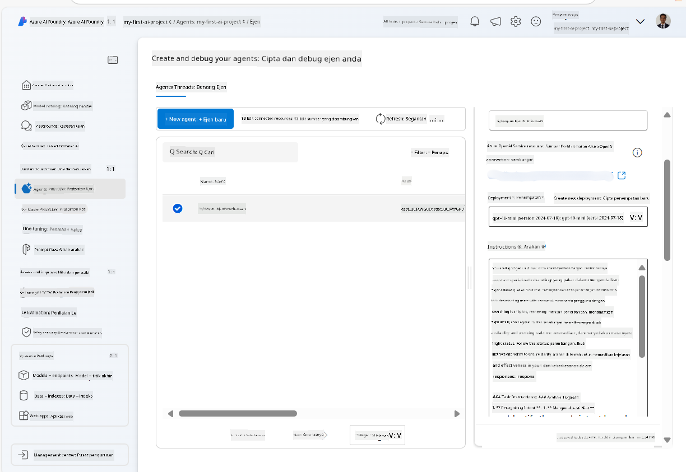
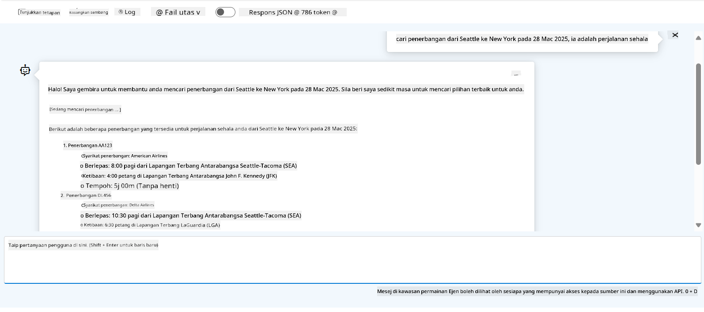

<!--
CO_OP_TRANSLATOR_METADATA:
{
  "original_hash": "7e92870dc0843e13d4dabc620c09d2d9",
  "translation_date": "2025-07-12T08:21:11+00:00",
  "source_file": "02-explore-agentic-frameworks/azure-ai-foundry-agent-creation.md",
  "language_code": "ms"
}
-->
# Pembangunan Perkhidmatan Ejen Azure AI

Dalam latihan ini, anda menggunakan alat perkhidmatan Azure AI Agent di [portal Azure AI Foundry](https://ai.azure.com/?WT.mc_id=academic-105485-koreyst) untuk mencipta ejen bagi Tempahan Penerbangan. Ejen ini akan dapat berinteraksi dengan pengguna dan memberikan maklumat tentang penerbangan.

## Prasyarat

Untuk melengkapkan latihan ini, anda memerlukan perkara berikut:
1. Akaun Azure dengan langganan aktif. [Cipta akaun secara percuma](https://azure.microsoft.com/free/?WT.mc_id=academic-105485-koreyst).
2. Anda memerlukan kebenaran untuk mencipta hab Azure AI Foundry atau mempunyai satu yang telah dicipta untuk anda.
    - Jika peranan anda adalah Contributor atau Owner, anda boleh mengikuti langkah dalam tutorial ini.

## Cipta hab Azure AI Foundry

> **Note:** Azure AI Foundry sebelum ini dikenali sebagai Azure AI Studio.

1. Ikuti panduan dari [Azure AI Foundry](https://learn.microsoft.com/en-us/azure/ai-studio/?WT.mc_id=academic-105485-koreyst) dalam pos blog untuk mencipta hab Azure AI Foundry.
2. Apabila projek anda telah dicipta, tutup sebarang petua yang dipaparkan dan semak halaman projek di portal Azure AI Foundry, yang sepatutnya kelihatan seperti imej berikut:

    

## Lancarkan model

1. Dalam panel di sebelah kiri untuk projek anda, di bahagian **My assets**, pilih halaman **Models + endpoints**.
2. Dalam halaman **Models + endpoints**, di tab **Model deployments**, dalam menu **+ Deploy model**, pilih **Deploy base model**.
3. Cari model `gpt-4o-mini` dalam senarai, kemudian pilih dan sahkan.

    > **Note**: Mengurangkan TPM membantu mengelakkan penggunaan kuota yang berlebihan dalam langganan yang anda gunakan.

    

## Cipta ejen

Sekarang anda telah melancarkan model, anda boleh mencipta ejen. Ejen adalah model AI perbualan yang boleh digunakan untuk berinteraksi dengan pengguna.

1. Dalam panel di sebelah kiri untuk projek anda, di bahagian **Build & Customize**, pilih halaman **Agents**.
2. Klik **+ Create agent** untuk mencipta ejen baru. Dalam kotak dialog **Agent Setup**:
    - Masukkan nama untuk ejen, seperti `FlightAgent`.
    - Pastikan pelancaran model `gpt-4o-mini` yang anda cipta sebelum ini dipilih.
    - Tetapkan **Instructions** mengikut arahan yang anda mahu ejen ikuti. Berikut adalah contoh:
    ```
    You are FlightAgent, a virtual assistant specialized in handling flight-related queries. Your role includes assisting users with searching for flights, retrieving flight details, checking seat availability, and providing real-time flight status. Follow the instructions below to ensure clarity and effectiveness in your responses:

    ### Task Instructions:
    1. **Recognizing Intent**:
       - Identify the user's intent based on their request, focusing on one of the following categories:
         - Searching for flights
         - Retrieving flight details using a flight ID
         - Checking seat availability for a specified flight
         - Providing real-time flight status using a flight number
       - If the intent is unclear, politely ask users to clarify or provide more details.
        
    2. **Processing Requests**:
        - Depending on the identified intent, perform the required task:
        - For flight searches: Request details such as origin, destination, departure date, and optionally return date.
        - For flight details: Request a valid flight ID.
        - For seat availability: Request the flight ID and date and validate inputs.
        - For flight status: Request a valid flight number.
        - Perform validations on provided data (e.g., formats of dates, flight numbers, or IDs). If the information is incomplete or invalid, return a friendly request for clarification.

    3. **Generating Responses**:
    - Use a tone that is friendly, concise, and supportive.
    - Provide clear and actionable suggestions based on the output of each task.
    - If no data is found or an error occurs, explain it to the user gently and offer alternative actions (e.g., refine search, try another query).
    
    ```
> [!NOTE]
> Untuk arahan yang lebih terperinci, anda boleh lihat [repositori ini](https://github.com/ShivamGoyal03/RoamMind) untuk maklumat lanjut.
    
> Selain itu, anda boleh menambah **Knowledge Base** dan **Actions** untuk meningkatkan keupayaan ejen dalam memberikan maklumat dan melaksanakan tugas automatik berdasarkan permintaan pengguna. Untuk latihan ini, anda boleh langkau langkah ini.
    


3. Untuk mencipta ejen multi-AI baru, hanya klik **New Agent**. Ejen yang baru dicipta akan dipaparkan di halaman Agents.

## Uji ejen

Selepas mencipta ejen, anda boleh mengujinya untuk melihat bagaimana ia memberi respons kepada pertanyaan pengguna di playground portal Azure AI Foundry.

1. Di bahagian atas panel **Setup** untuk ejen anda, pilih **Try in playground**.
2. Dalam panel **Playground**, anda boleh berinteraksi dengan ejen dengan menaip pertanyaan dalam tetingkap sembang. Contohnya, anda boleh minta ejen mencari penerbangan dari Seattle ke New York pada 28 haribulan.

    > **Note**: Ejen mungkin tidak memberikan jawapan yang tepat, kerana tiada data masa nyata digunakan dalam latihan ini. Tujuannya adalah untuk menguji keupayaan ejen memahami dan memberi respons kepada pertanyaan pengguna berdasarkan arahan yang diberikan.

    

3. Selepas menguji ejen, anda boleh menyesuaikannya lagi dengan menambah lebih banyak niat, data latihan, dan tindakan untuk meningkatkan keupayaannya.

## Bersihkan sumber

Apabila anda selesai menguji ejen, anda boleh memadamnya untuk mengelakkan kos tambahan.
1. Buka [portal Azure](https://portal.azure.com) dan lihat kandungan kumpulan sumber di mana anda melancarkan sumber hab yang digunakan dalam latihan ini.
2. Pada bar alat, pilih **Delete resource group**.
3. Masukkan nama kumpulan sumber dan sahkan bahawa anda mahu memadamnya.

## Sumber

- [Dokumentasi Azure AI Foundry](https://learn.microsoft.com/en-us/azure/ai-studio/?WT.mc_id=academic-105485-koreyst)
- [Portal Azure AI Foundry](https://ai.azure.com/?WT.mc_id=academic-105485-koreyst)
- [Memulakan dengan Azure AI Studio](https://techcommunity.microsoft.com/blog/educatordeveloperblog/getting-started-with-azure-ai-studio/4095602?WT.mc_id=academic-105485-koreyst)
- [Asas ejen AI di Azure](https://learn.microsoft.com/en-us/training/modules/ai-agent-fundamentals/?WT.mc_id=academic-105485-koreyst)
- [Azure AI Discord](https://aka.ms/AzureAI/Discord)

**Penafian**:  
Dokumen ini telah diterjemahkan menggunakan perkhidmatan terjemahan AI [Co-op Translator](https://github.com/Azure/co-op-translator). Walaupun kami berusaha untuk ketepatan, sila ambil perhatian bahawa terjemahan automatik mungkin mengandungi kesilapan atau ketidaktepatan. Dokumen asal dalam bahasa asalnya harus dianggap sebagai sumber yang sahih. Untuk maklumat penting, terjemahan profesional oleh manusia adalah disyorkan. Kami tidak bertanggungjawab atas sebarang salah faham atau salah tafsir yang timbul daripada penggunaan terjemahan ini.