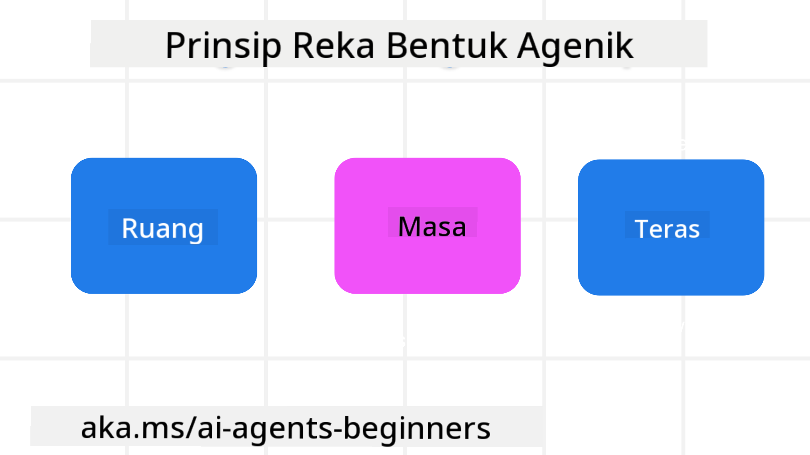

<!--
CO_OP_TRANSLATOR_METADATA:
{
  "original_hash": "4c46e4ff9e349c521e2b0b17f51afa64",
  "translation_date": "2025-08-29T18:22:35+00:00",
  "source_file": "03-agentic-design-patterns/README.md",
  "language_code": "ms"
}
-->

> _(Klik imej di atas untuk menonton video pelajaran ini)_
# Prinsip Reka Bentuk Ejen AI

## Pengenalan

Terdapat banyak cara untuk memikirkan tentang membina Sistem Ejen AI. Memandangkan kekaburan adalah satu ciri dan bukan kelemahan dalam reka bentuk AI Generatif, kadangkala sukar bagi jurutera untuk menentukan titik permulaan. Kami telah mencipta satu set Prinsip Reka Bentuk UX yang berpusatkan manusia untuk membolehkan pembangun membina sistem ejen yang berpusatkan pelanggan bagi memenuhi keperluan perniagaan mereka. Prinsip reka bentuk ini bukanlah satu seni bina yang preskriptif tetapi lebih kepada titik permulaan untuk pasukan yang sedang mentakrifkan dan membangunkan pengalaman ejen.

Secara umum, ejen seharusnya:

- Meluaskan dan meningkatkan keupayaan manusia (brainstorming, penyelesaian masalah, automasi, dll.)
- Mengisi jurang pengetahuan (membantu memahami domain pengetahuan, terjemahan, dll.)
- Memudahkan dan menyokong kerjasama dengan cara yang kita sebagai individu lebih suka bekerja dengan orang lain
- Membantu kita menjadi versi diri kita yang lebih baik (contohnya, jurulatih kehidupan/pengurus tugas, membantu kita mempelajari kemahiran pengawalan emosi dan kesedaran, membina daya tahan, dll.)

## Pelajaran Ini Akan Membincangkan

- Apakah Prinsip Reka Bentuk Ejen
- Apakah garis panduan yang perlu diikuti semasa melaksanakan prinsip reka bentuk ini
- Apakah beberapa contoh penggunaan prinsip reka bentuk ini

## Matlamat Pembelajaran

Selepas melengkapkan pelajaran ini, anda akan dapat:

1. Menerangkan apa itu Prinsip Reka Bentuk Ejen
2. Menerangkan garis panduan untuk menggunakan Prinsip Reka Bentuk Ejen
3. Memahami cara membina ejen menggunakan Prinsip Reka Bentuk Ejen

## Prinsip Reka Bentuk Ejen

### Ejen (Ruang)

Ini adalah persekitaran di mana ejen beroperasi. Prinsip ini memaklumkan cara kita mereka bentuk ejen untuk berinteraksi dalam dunia fizikal dan digital.

- **Menghubungkan, bukan meruntuhkan** – membantu menghubungkan orang kepada orang lain, acara, dan pengetahuan yang boleh diambil tindakan untuk membolehkan kerjasama dan hubungan.
- Ejen membantu menghubungkan acara, pengetahuan, dan orang.
- Ejen membawa orang lebih dekat bersama. Mereka tidak direka untuk menggantikan atau merendahkan manusia.
- **Mudah diakses tetapi kadangkala tidak kelihatan** – ejen kebanyakannya beroperasi di latar belakang dan hanya memberi isyarat apabila ia relevan dan sesuai.
  - Ejen mudah ditemui dan diakses oleh pengguna yang diberi kuasa pada mana-mana peranti atau platform.
  - Ejen menyokong input dan output pelbagai mod (bunyi, suara, teks, dll.).
  - Ejen boleh beralih dengan lancar antara latar depan dan latar belakang; antara proaktif dan reaktif, bergantung pada keperluan pengguna.
  - Ejen mungkin beroperasi dalam bentuk yang tidak kelihatan, tetapi laluan proses latar belakangnya dan kerjasama dengan ejen lain adalah telus dan boleh dikawal oleh pengguna.

### Ejen (Masa)

Ini adalah cara ejen beroperasi dari segi masa. Prinsip ini memaklumkan cara kita mereka bentuk ejen yang berinteraksi merentasi masa lalu, masa kini, dan masa depan.

- **Masa Lalu**: Merenung sejarah yang merangkumi kedua-dua keadaan dan konteks.
  - Ejen menyediakan hasil yang lebih relevan berdasarkan analisis data sejarah yang lebih kaya, bukan hanya acara, orang, atau keadaan.
  - Ejen mencipta hubungan daripada acara masa lalu dan secara aktif merenung memori untuk berinteraksi dengan situasi semasa.
- **Sekarang**: Memberi isyarat lebih daripada sekadar pemberitahuan.
  - Ejen menggabungkan pendekatan menyeluruh untuk berinteraksi dengan manusia. Apabila sesuatu acara berlaku, ejen melangkaui pemberitahuan statik atau formaliti statik lain. Ejen boleh mempermudah aliran atau secara dinamik menjana petunjuk untuk mengarahkan perhatian pengguna pada masa yang tepat.
  - Ejen menyampaikan maklumat berdasarkan persekitaran kontekstual, perubahan sosial dan budaya, dan disesuaikan dengan niat pengguna.
  - Interaksi ejen boleh beransur-ansur, berkembang/meningkat dalam kerumitan untuk memperkasakan pengguna dalam jangka masa panjang.
- **Masa Depan**: Menyesuaikan dan berkembang.
  - Ejen menyesuaikan diri dengan pelbagai peranti, platform, dan mod.
  - Ejen menyesuaikan diri dengan tingkah laku pengguna, keperluan kebolehcapaian, dan boleh disesuaikan secara bebas.
  - Ejen dibentuk oleh dan berkembang melalui interaksi pengguna yang berterusan.

### Ejen (Teras)

Ini adalah elemen utama dalam teras reka bentuk ejen.

- **Menerima ketidakpastian tetapi membina kepercayaan**.
  - Tahap ketidakpastian ejen adalah dijangka. Ketidakpastian adalah elemen utama dalam reka bentuk ejen.
  - Kepercayaan dan ketelusan adalah lapisan asas dalam reka bentuk ejen.
  - Manusia mempunyai kawalan ke atas bila ejen dihidupkan/dimatikan dan status ejen sentiasa kelihatan dengan jelas.

## Garis Panduan untuk Melaksanakan Prinsip Ini

Apabila anda menggunakan prinsip reka bentuk sebelumnya, gunakan garis panduan berikut:

1. **Ketelusan**: Maklumkan kepada pengguna bahawa AI terlibat, bagaimana ia berfungsi (termasuk tindakan masa lalu), dan bagaimana untuk memberikan maklum balas serta mengubah suai sistem.
2. **Kawalan**: Benarkan pengguna untuk menyesuaikan, menentukan keutamaan dan memperibadikan, serta mempunyai kawalan ke atas sistem dan atributnya (termasuk keupayaan untuk melupakan).
3. **Konsistensi**: Sasarkan pengalaman yang konsisten dan pelbagai mod merentasi peranti dan titik akhir. Gunakan elemen UI/UX yang biasa di mana mungkin (contohnya, ikon mikrofon untuk interaksi suara) dan kurangkan beban kognitif pelanggan sebanyak mungkin (contohnya, sasarkan respons yang ringkas, bantuan visual, dan kandungan ‘Ketahui Lebih Lanjut’).

## Cara Merancang Ejen Pelancongan menggunakan Prinsip dan Garis Panduan Ini

Bayangkan anda sedang merancang Ejen Pelancongan, berikut adalah cara anda boleh memikirkan penggunaan Prinsip dan Garis Panduan Reka Bentuk:

1. **Ketelusan** – Maklumkan kepada pengguna bahawa Ejen Pelancongan adalah ejen yang didayakan AI. Sediakan beberapa arahan asas tentang cara untuk bermula (contohnya, mesej “Hello”, contoh arahan). Dokumentasikan ini dengan jelas pada halaman produk. Tunjukkan senarai arahan yang telah diminta oleh pengguna sebelum ini. Jelaskan cara memberikan maklum balas (butang ibu jari ke atas dan ke bawah, butang Hantar Maklum Balas, dll.). Nyatakan dengan jelas jika ejen mempunyai sekatan penggunaan atau topik.
2. **Kawalan** – Pastikan jelas bagaimana pengguna boleh mengubah suai ejen selepas ia dicipta dengan perkara seperti Arahan Sistem. Benarkan pengguna memilih sejauh mana ejen memberikan maklumat, gaya penulisannya, dan sebarang batasan tentang apa yang ejen tidak sepatutnya bincangkan. Benarkan pengguna melihat dan memadam sebarang fail atau data yang berkaitan, arahan, dan perbualan lalu.
3. **Konsistensi** – Pastikan ikon untuk Kongsi Arahan, tambah fail atau foto, dan tag seseorang atau sesuatu adalah standard dan mudah dikenali. Gunakan ikon klip kertas untuk menunjukkan muat naik/ perkongsian fail dengan ejen, dan ikon imej untuk menunjukkan muat naik grafik.

### Ada Lagi Soalan tentang Corak Reka Bentuk Ejen AI?

Sertai [Azure AI Foundry Discord](https://aka.ms/ai-agents/discord) untuk bertemu dengan pelajar lain, menghadiri waktu pejabat, dan mendapatkan jawapan kepada soalan anda tentang Ejen AI.

## Sumber Tambahan

- 

## Pelajaran Sebelumnya

[Meneroka Kerangka Ejen](../02-explore-agentic-frameworks/README.md)

## Pelajaran Seterusnya

[Corak Reka Bentuk Penggunaan Alat](../04-tool-use/README.md)

---

**Penafian**:  
Dokumen ini telah diterjemahkan menggunakan perkhidmatan terjemahan AI [Co-op Translator](https://github.com/Azure/co-op-translator). Walaupun kami berusaha untuk memastikan ketepatan, sila ambil perhatian bahawa terjemahan automatik mungkin mengandungi kesilapan atau ketidaktepatan. Dokumen asal dalam bahasa asalnya harus dianggap sebagai sumber yang berwibawa. Untuk maklumat yang kritikal, terjemahan manusia profesional adalah disyorkan. Kami tidak bertanggungjawab atas sebarang salah faham atau salah tafsir yang timbul daripada penggunaan terjemahan ini.