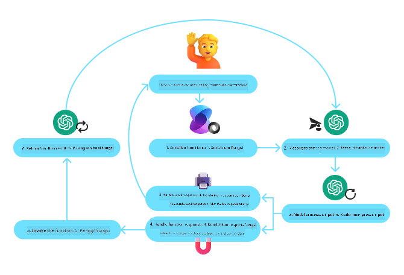
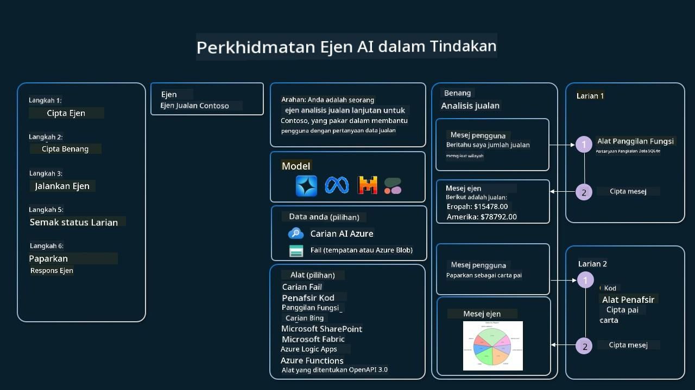

<!--
CO_OP_TRANSLATOR_METADATA:
{
  "original_hash": "88258b03f2893aa2e69eb8fb24baabbc",
  "translation_date": "2025-07-12T09:39:58+00:00",
  "source_file": "04-tool-use/README.md",
  "language_code": "ms"
}
-->
[](https://youtu.be/vieRiPRx-gI?si=cEZ8ApnT6Sus9rhn)

> _(Klik imej di atas untuk menonton video pelajaran ini)_

# Corak Reka Bentuk Penggunaan Alat

Alat adalah menarik kerana ia membolehkan ejen AI mempunyai julat keupayaan yang lebih luas. Daripada ejen hanya mempunyai set tindakan terhad yang boleh dilaksanakan, dengan menambah alat, ejen kini boleh melaksanakan pelbagai tindakan. Dalam bab ini, kita akan melihat Corak Reka Bentuk Penggunaan Alat, yang menerangkan bagaimana ejen AI boleh menggunakan alat tertentu untuk mencapai matlamat mereka.

## Pengenalan

Dalam pelajaran ini, kita akan menjawab soalan-soalan berikut:

- Apakah corak reka bentuk penggunaan alat?
- Apakah kes penggunaan yang boleh diterapkan?
- Apakah elemen/blok binaan yang diperlukan untuk melaksanakan corak reka bentuk ini?
- Apakah pertimbangan khas untuk menggunakan Corak Reka Bentuk Penggunaan Alat bagi membina ejen AI yang boleh dipercayai?

## Matlamat Pembelajaran

Selepas menamatkan pelajaran ini, anda akan dapat:

- Mentakrifkan Corak Reka Bentuk Penggunaan Alat dan tujuannya.
- Mengenal pasti kes penggunaan di mana Corak Reka Bentuk Penggunaan Alat sesuai digunakan.
- Memahami elemen utama yang diperlukan untuk melaksanakan corak reka bentuk ini.
- Mengenal pasti pertimbangan untuk memastikan kebolehpercayaan ejen AI yang menggunakan corak reka bentuk ini.

## Apakah Corak Reka Bentuk Penggunaan Alat?

**Corak Reka Bentuk Penggunaan Alat** memberi tumpuan kepada memberi LLM keupayaan untuk berinteraksi dengan alat luaran bagi mencapai matlamat tertentu. Alat adalah kod yang boleh dilaksanakan oleh ejen untuk melaksanakan tindakan. Alat boleh berupa fungsi mudah seperti kalkulator, atau panggilan API ke perkhidmatan pihak ketiga seperti semakan harga saham atau ramalan cuaca. Dalam konteks ejen AI, alat direka untuk dilaksanakan oleh ejen sebagai tindak balas kepada **panggilan fungsi yang dijana oleh model**.

## Apakah kes penggunaan yang boleh diterapkan?

Ejen AI boleh menggunakan alat untuk menyelesaikan tugasan kompleks, mendapatkan maklumat, atau membuat keputusan. Corak reka bentuk penggunaan alat sering digunakan dalam senario yang memerlukan interaksi dinamik dengan sistem luaran, seperti pangkalan data, perkhidmatan web, atau penafsir kod. Keupayaan ini berguna untuk pelbagai kes penggunaan termasuk:

- **Pengambilan Maklumat Dinamik:** Ejen boleh membuat pertanyaan kepada API luaran atau pangkalan data untuk mendapatkan data terkini (contohnya, membuat pertanyaan ke pangkalan data SQLite untuk analisis data, mendapatkan harga saham atau maklumat cuaca).
- **Pelaksanaan dan Penafsiran Kod:** Ejen boleh melaksanakan kod atau skrip untuk menyelesaikan masalah matematik, menjana laporan, atau menjalankan simulasi.
- **Automasi Aliran Kerja:** Mengautomasikan aliran kerja berulang atau berbilang langkah dengan mengintegrasikan alat seperti penjadual tugas, perkhidmatan emel, atau saluran data.
- **Sokongan Pelanggan:** Ejen boleh berinteraksi dengan sistem CRM, platform tiket, atau pangkalan pengetahuan untuk menyelesaikan pertanyaan pengguna.
- **Penjanaan dan Penyuntingan Kandungan:** Ejen boleh menggunakan alat seperti pemeriksa tatabahasa, peringkas teks, atau penilai keselamatan kandungan untuk membantu dalam tugasan penciptaan kandungan.

## Apakah elemen/blok binaan yang diperlukan untuk melaksanakan corak reka bentuk penggunaan alat?

Blok binaan ini membolehkan ejen AI melaksanakan pelbagai tugasan. Mari kita lihat elemen utama yang diperlukan untuk melaksanakan Corak Reka Bentuk Penggunaan Alat:

- **Skema Fungsi/Alat**: Definisi terperinci alat yang tersedia, termasuk nama fungsi, tujuan, parameter yang diperlukan, dan output yang dijangka. Skema ini membolehkan LLM memahami alat yang ada dan cara membina permintaan yang sah.

- **Logik Pelaksanaan Fungsi**: Mengawal bagaimana dan bila alat dipanggil berdasarkan niat pengguna dan konteks perbualan. Ini mungkin termasuk modul perancang, mekanisme penghalaan, atau aliran bersyarat yang menentukan penggunaan alat secara dinamik.

- **Sistem Pengendalian Mesej**: Komponen yang mengurus aliran perbualan antara input pengguna, respons LLM, panggilan alat, dan output alat.

- **Rangka Kerja Integrasi Alat**: Infrastruktur yang menghubungkan ejen dengan pelbagai alat, sama ada fungsi mudah atau perkhidmatan luaran yang kompleks.

- **Pengendalian Ralat & Pengesahan**: Mekanisme untuk mengendalikan kegagalan dalam pelaksanaan alat, mengesahkan parameter, dan mengurus respons yang tidak dijangka.

- **Pengurusan Keadaan**: Menjejak konteks perbualan, interaksi alat sebelum ini, dan data berterusan untuk memastikan konsistensi dalam interaksi berbilang pusingan.

Seterusnya, mari kita lihat Panggilan Fungsi/Alat dengan lebih terperinci.

### Panggilan Fungsi/Alat

Panggilan fungsi adalah cara utama kita membolehkan Model Bahasa Besar (LLM) berinteraksi dengan alat. Anda sering akan melihat 'Fungsi' dan 'Alat' digunakan secara bergantian kerana 'fungsi' (blok kod yang boleh digunakan semula) adalah 'alat' yang digunakan oleh ejen untuk melaksanakan tugasan. Untuk kod fungsi dipanggil, LLM mesti membandingkan permintaan pengguna dengan penerangan fungsi. Untuk melakukan ini, satu skema yang mengandungi penerangan semua fungsi yang tersedia dihantar kepada LLM. LLM kemudian memilih fungsi yang paling sesuai untuk tugasan tersebut dan mengembalikan nama serta argumennya. Fungsi yang dipilih dipanggil, responsnya dihantar kembali ke LLM, yang menggunakan maklumat itu untuk membalas permintaan pengguna.

Untuk pembangun melaksanakan panggilan fungsi untuk ejen, anda memerlukan:

1. Model LLM yang menyokong panggilan fungsi
2. Skema yang mengandungi penerangan fungsi
3. Kod untuk setiap fungsi yang diterangkan

Mari gunakan contoh mendapatkan masa semasa di sebuah bandar untuk menerangkan:

1. **Inisialisasi LLM yang menyokong panggilan fungsi:**

    Tidak semua model menyokong panggilan fungsi, jadi penting untuk memastikan LLM yang anda gunakan menyokongnya. <a href="https://learn.microsoft.com/azure/ai-services/openai/how-to/function-calling" target="_blank">Azure OpenAI</a> menyokong panggilan fungsi. Kita boleh mula dengan memulakan klien Azure OpenAI.

    ```python
    # Initialize the Azure OpenAI client
    client = AzureOpenAI(
        azure_endpoint = os.getenv("AZURE_OPENAI_ENDPOINT"), 
        api_key=os.getenv("AZURE_OPENAI_API_KEY"),  
        api_version="2024-05-01-preview"
    )
    ```

1. **Cipta Skema Fungsi:**

    Seterusnya kita akan mentakrifkan skema JSON yang mengandungi nama fungsi, penerangan apa yang dilakukan fungsi itu, dan nama serta penerangan parameter fungsi.
    Kita kemudian akan mengambil skema ini dan menghantarnya ke klien yang telah dibuat sebelum ini, bersama dengan permintaan pengguna untuk mendapatkan masa di San Francisco. Yang penting untuk diperhatikan ialah **panggilan alat** adalah apa yang dikembalikan, **bukan** jawapan akhir kepada soalan. Seperti yang disebutkan sebelum ini, LLM mengembalikan nama fungsi yang dipilih untuk tugasan itu, dan argumen yang akan diserahkan kepadanya.

    ```python
    # Function description for the model to read
    tools = [
        {
            "type": "function",
            "function": {
                "name": "get_current_time",
                "description": "Get the current time in a given location",
                "parameters": {
                    "type": "object",
                    "properties": {
                        "location": {
                            "type": "string",
                            "description": "The city name, e.g. San Francisco",
                        },
                    },
                    "required": ["location"],
                },
            }
        }
    ]
    ```
   
    ```python
  
    # Initial user message
    messages = [{"role": "user", "content": "What's the current time in San Francisco"}] 
  
    # First API call: Ask the model to use the function
      response = client.chat.completions.create(
          model=deployment_name,
          messages=messages,
          tools=tools,
          tool_choice="auto",
      )
  
      # Process the model's response
      response_message = response.choices[0].message
      messages.append(response_message)
  
      print("Model's response:")  

      print(response_message)
  
    ```

    ```bash
    Model's response:
    ChatCompletionMessage(content=None, role='assistant', function_call=None, tool_calls=[ChatCompletionMessageToolCall(id='call_pOsKdUlqvdyttYB67MOj434b', function=Function(arguments='{"location":"San Francisco"}', name='get_current_time'), type='function')])
    ```
  
1. **Kod fungsi yang diperlukan untuk melaksanakan tugasan:**

    Setelah LLM memilih fungsi yang perlu dijalankan, kod yang melaksanakan tugasan itu perlu diimplementasikan dan dijalankan.
    Kita boleh melaksanakan kod untuk mendapatkan masa semasa dalam Python. Kita juga perlu menulis kod untuk mengekstrak nama dan argumen dari response_message untuk mendapatkan hasil akhir.

    ```python
      def get_current_time(location):
        """Get the current time for a given location"""
        print(f"get_current_time called with location: {location}")  
        location_lower = location.lower()
        
        for key, timezone in TIMEZONE_DATA.items():
            if key in location_lower:
                print(f"Timezone found for {key}")  
                current_time = datetime.now(ZoneInfo(timezone)).strftime("%I:%M %p")
                return json.dumps({
                    "location": location,
                    "current_time": current_time
                })
      
        print(f"No timezone data found for {location_lower}")  
        return json.dumps({"location": location, "current_time": "unknown"})
    ```

    ```python
     # Handle function calls
      if response_message.tool_calls:
          for tool_call in response_message.tool_calls:
              if tool_call.function.name == "get_current_time":
     
                  function_args = json.loads(tool_call.function.arguments)
     
                  time_response = get_current_time(
                      location=function_args.get("location")
                  )
     
                  messages.append({
                      "tool_call_id": tool_call.id,
                      "role": "tool",
                      "name": "get_current_time",
                      "content": time_response,
                  })
      else:
          print("No tool calls were made by the model.")  
  
      # Second API call: Get the final response from the model
      final_response = client.chat.completions.create(
          model=deployment_name,
          messages=messages,
      )
  
      return final_response.choices[0].message.content
     ```

    ```bash
      get_current_time called with location: San Francisco
      Timezone found for san francisco
      The current time in San Francisco is 09:24 AM.
     ```

Panggilan Fungsi adalah teras kebanyakan, jika tidak semua, reka bentuk penggunaan alat ejen, namun melaksanakannya dari awal kadang-kadang boleh mencabar.
Seperti yang kita pelajari dalam [Pelajaran 2](../../../02-explore-agentic-frameworks), rangka kerja agentic menyediakan blok binaan siap guna untuk melaksanakan penggunaan alat.

## Contoh Penggunaan Alat dengan Rangka Kerja Agentic

Berikut adalah beberapa contoh bagaimana anda boleh melaksanakan Corak Reka Bentuk Penggunaan Alat menggunakan pelbagai rangka kerja agentic:

### Semantic Kernel

<a href="https://learn.microsoft.com/azure/ai-services/agents/overview" target="_blank">Semantic Kernel</a> adalah rangka kerja AI sumber terbuka untuk pembangun .NET, Python, dan Java yang bekerja dengan Model Bahasa Besar (LLM). Ia memudahkan proses menggunakan panggilan fungsi dengan secara automatik menerangkan fungsi dan parameter anda kepada model melalui proses yang dipanggil <a href="https://learn.microsoft.com/semantic-kernel/concepts/ai-services/chat-completion/function-calling/?pivots=programming-language-python#1-serializing-the-functions" target="_blank">serialisasi</a>. Ia juga mengendalikan komunikasi dua hala antara model dan kod anda. Satu lagi kelebihan menggunakan rangka kerja agentic seperti Semantic Kernel ialah ia membolehkan anda mengakses alat siap guna seperti <a href="https://github.com/microsoft/semantic-kernel/blob/main/python/samples/getting_started_with_agents/openai_assistant/step4_assistant_tool_file_search.py" target="_blank">Carian Fail</a> dan <a href="https://github.com/microsoft/semantic-kernel/blob/main/python/samples/getting_started_with_agents/openai_assistant/step3_assistant_tool_code_interpreter.py" target="_blank">Penafsir Kod</a>.

Rajah berikut menggambarkan proses panggilan fungsi dengan Semantic Kernel:



Dalam Semantic Kernel, fungsi/alat dipanggil <a href="https://learn.microsoft.com/semantic-kernel/concepts/plugins/?pivots=programming-language-python" target="_blank">Plugin</a>. Kita boleh menukar fungsi `get_current_time` yang kita lihat sebelum ini menjadi plugin dengan menjadikannya kelas yang mengandungi fungsi tersebut. Kita juga boleh mengimport dekorator `kernel_function`, yang mengambil penerangan fungsi. Apabila anda kemudian mencipta kernel dengan GetCurrentTimePlugin, kernel akan secara automatik menserialkan fungsi dan parameternya, menghasilkan skema untuk dihantar ke LLM dalam proses tersebut.

```python
from semantic_kernel.functions import kernel_function

class GetCurrentTimePlugin:
    async def __init__(self, location):
        self.location = location

    @kernel_function(
        description="Get the current time for a given location"
    )
    def get_current_time(location: str = ""):
        ...

```

```python 
from semantic_kernel import Kernel

# Create the kernel
kernel = Kernel()

# Create the plugin
get_current_time_plugin = GetCurrentTimePlugin(location)

# Add the plugin to the kernel
kernel.add_plugin(get_current_time_plugin)
```
  
### Azure AI Agent Service

<a href="https://learn.microsoft.com/azure/ai-services/agents/overview" target="_blank">Azure AI Agent Service</a> adalah rangka kerja agentic yang lebih baru yang direka untuk membolehkan pembangun membina, melancarkan, dan mengembangkan ejen AI yang berkualiti tinggi dan boleh dikembangkan dengan selamat tanpa perlu mengurus sumber pengkomputeran dan penyimpanan asas. Ia sangat berguna untuk aplikasi perusahaan kerana ia adalah perkhidmatan yang diurus sepenuhnya dengan keselamatan tahap perusahaan.

Dibandingkan dengan pembangunan menggunakan API LLM secara langsung, Azure AI Agent Service menawarkan beberapa kelebihan, termasuk:

- Panggilan alat automatik – tiada keperluan untuk mengurai panggilan alat, melaksanakan alat, dan mengendalikan respons; semua ini kini dilakukan di sisi pelayan
- Data yang diurus dengan selamat – daripada mengurus keadaan perbualan sendiri, anda boleh bergantung pada threads untuk menyimpan semua maklumat yang diperlukan
- Alat sedia guna – Alat yang boleh digunakan untuk berinteraksi dengan sumber data anda, seperti Bing, Azure AI Search, dan Azure Functions.

Alat yang tersedia dalam Azure AI Agent Service boleh dibahagikan kepada dua kategori:

1. Alat Pengetahuan:
    - <a href="https://learn.microsoft.com/azure/ai-services/agents/how-to/tools/bing-grounding?tabs=python&pivots=overview" target="_blank">Grounding dengan Bing Search</a>
    - <a href="https://learn.microsoft.com/azure/ai-services/agents/how-to/tools/file-search?tabs=python&pivots=overview" target="_blank">Carian Fail</a>
    - <a href="https://learn.microsoft.com/azure/ai-services/agents/how-to/tools/azure-ai-search?tabs=azurecli%2Cpython&pivots=overview-azure-ai-search" target="_blank">Azure AI Search</a>

2. Alat Tindakan:
    - <a href="https://learn.microsoft.com/azure/ai-services/agents/how-to/tools/function-calling?tabs=python&pivots=overview" target="_blank">Panggilan Fungsi</a>
    - <a href="https://learn.microsoft.com/azure/ai-services/agents/how-to/tools/code-interpreter?tabs=python&pivots=overview" target="_blank">Penafsir Kod</a>
    - <a href="https://learn.microsoft.com/azure/ai-services/agents/how-to/tools/openapi-spec?tabs=python&pivots=overview" target="_blank">Alat yang ditakrifkan oleh OpenAI</a>
    - <a href="https://learn.microsoft.com/azure/ai-services/agents/how-to/tools/azure-functions?pivots=overview" target="_blank">Azure Functions</a>

Agent Service membolehkan kita menggunakan alat-alat ini bersama sebagai `toolset`. Ia juga menggunakan `threads` yang menjejaki sejarah mesej dari perbualan tertentu.

Bayangkan anda seorang ejen jualan di sebuah syarikat bernama Contoso. Anda ingin membangunkan ejen perbualan yang boleh menjawab soalan mengenai data jualan anda.

Imej berikut menggambarkan bagaimana anda boleh menggunakan Azure AI Agent Service untuk menganalisis data jualan anda:



Untuk menggunakan mana-mana alat ini dengan perkhidmatan, kita boleh mencipta klien dan mentakrifkan alat atau set alat. Untuk melaksanakan ini secara praktikal, kita boleh menggunakan kod Python berikut. LLM akan dapat melihat set alat dan memutuskan sama ada menggunakan fungsi yang dicipta pengguna, `fetch_sales_data_using_sqlite_query`, atau Penafsir Kod yang sedia ada bergantung pada permintaan pengguna.

```python 
import os
from azure.ai.projects import AIProjectClient
from azure.identity import DefaultAzureCredential
from fecth_sales_data_functions import fetch_sales_data_using_sqlite_query # fetch_sales_data_using_sqlite_query function which can be found in a fetch_sales_data_functions.py file.
from azure.ai.projects.models import ToolSet, FunctionTool, CodeInterpreterTool

project_client = AIProjectClient.from_connection_string(
    credential=DefaultAzureCredential(),
    conn_str=os.environ["PROJECT_CONNECTION_STRING"],
)

# Initialize function calling agent with the fetch_sales_data_using_sqlite_query function and adding it to the toolset
fetch_data_function = FunctionTool(fetch_sales_data_using_sqlite_query)
toolset = ToolSet()
toolset.add(fetch_data_function)

# Initialize Code Interpreter tool and adding it to the toolset. 
code_interpreter = code_interpreter = CodeInterpreterTool()
toolset = ToolSet()
toolset.add(code_interpreter)

agent = project_client.agents.create_agent(
    model="gpt-4o-mini", name="my-agent", instructions="You are helpful agent", 
    toolset=toolset
)
```

## Apakah pertimbangan khas untuk menggunakan Corak Reka Bentuk Penggunaan Alat bagi membina ejen AI yang boleh dipercayai?

Kebimbangan biasa dengan SQL yang dijana secara dinamik oleh LLM adalah keselamatan, terutamanya risiko suntikan SQL atau tindakan berniat jahat, seperti memadam atau mengubah suai pangkalan data. Walaupun kebimbangan ini sah, ia boleh diatasi dengan berkesan dengan mengkonfigurasi kebenaran akses pangkalan data dengan betul. Untuk kebanyakan pangkalan data, ini melibatkan konfigurasi pangkalan data sebagai baca sahaja. Untuk perkhidmatan pangkalan data seperti PostgreSQL atau Azure SQL, aplikasi harus diberikan peranan baca sahaja (SELECT).

Menjalankan aplikasi dalam persekitaran yang selamat juga meningkatkan perlindungan. Dalam senario perusahaan, data biasanya diekstrak dan ditransformasikan dari sistem operasi ke dalam pangkalan data baca sahaja atau gudang data dengan skema mesra pengguna. Pendekatan ini memastikan data selamat, dioptimumkan untuk prestasi dan kebolehcapaian, dan aplikasi mempunyai akses terhad, hanya baca sahaja.

## Sumber Tambahan

-
<a href="https://microsoft.github.io/build-your-first-agent-with-azure-ai-agent-service-workshop/" target="_blank">
Azure AI Agents Service Workshop</a>
- <a href="https://github.com/Azure-Samples/contoso-creative-writer/tree/main/docs/workshop" target="_blank">Bengkel Multi-Ejen Contoso Creative Writer</a>
- <a href="https://learn.microsoft.com/semantic-kernel/concepts/ai-services/chat-completion/function-calling/?pivots=programming-language-python#1-serializing-the-functions" target="_blank">Tutorial Panggilan Fungsi Semantic Kernel</a>
- <a href="https://github.com/microsoft/semantic-kernel/blob/main/python/samples/getting_started_with_agents/openai_assistant/step3_assistant_tool_code_interpreter.py" target="_blank">Penafsir Kod Semantic Kernel</a>
- <a href="https://microsoft.github.io/autogen/dev/user-guide/core-user-guide/components/tools.html" target="_blank">Alat Autogen</a>

## Pelajaran Sebelumnya

[Memahami Corak Reka Bentuk Agentic](../03-agentic-design-patterns/README.md)

## Pelajaran Seterusnya

[Agentic RAG](../05-agentic-rag/README.md)

**Penafian**:  
Dokumen ini telah diterjemahkan menggunakan perkhidmatan terjemahan AI [Co-op Translator](https://github.com/Azure/co-op-translator). Walaupun kami berusaha untuk ketepatan, sila ambil maklum bahawa terjemahan automatik mungkin mengandungi kesilapan atau ketidaktepatan. Dokumen asal dalam bahasa asalnya harus dianggap sebagai sumber yang sahih. Untuk maklumat penting, terjemahan profesional oleh manusia adalah disyorkan. Kami tidak bertanggungjawab atas sebarang salah faham atau salah tafsir yang timbul daripada penggunaan terjemahan ini.