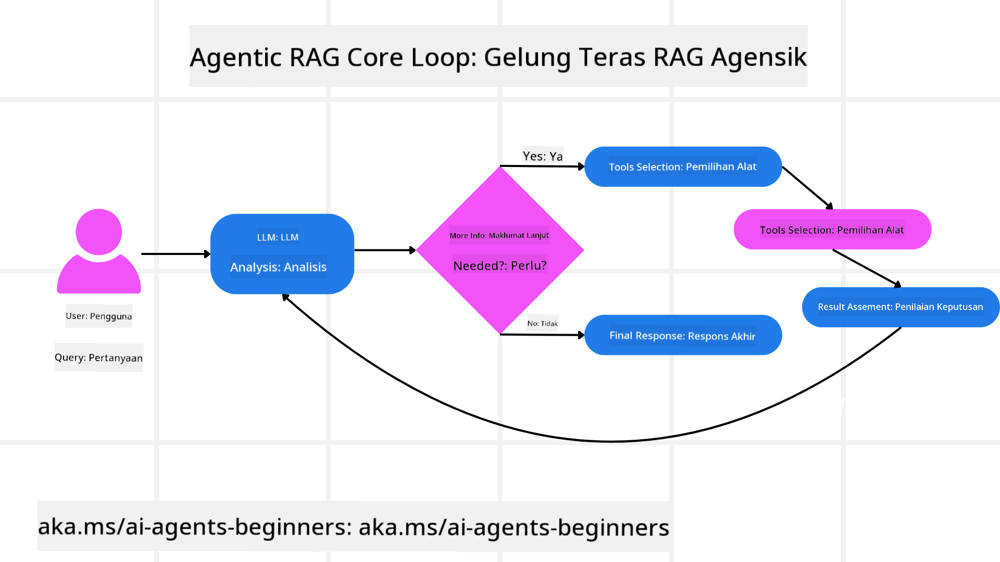
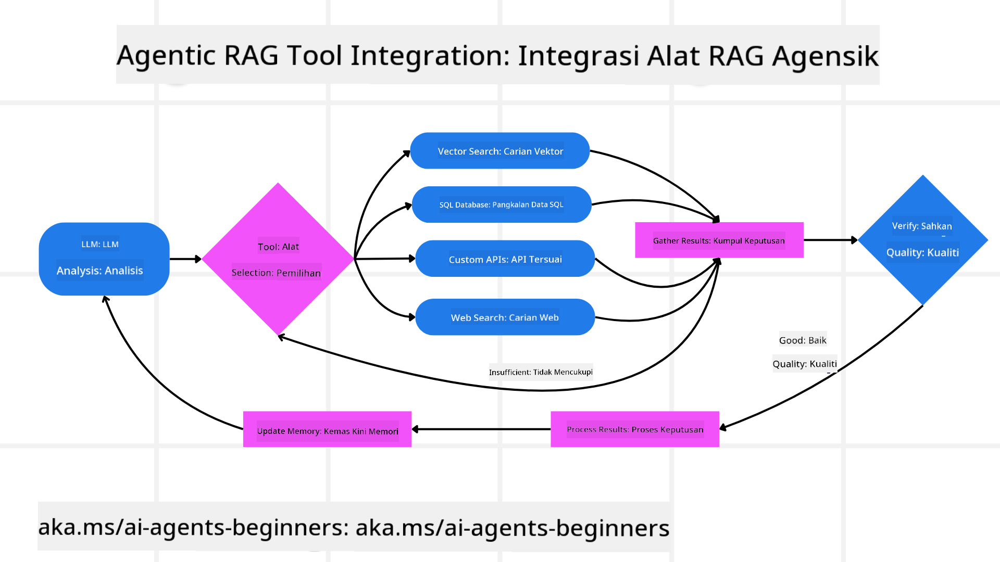
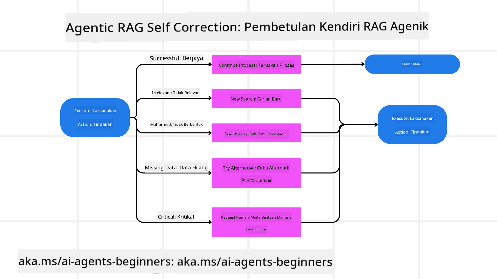
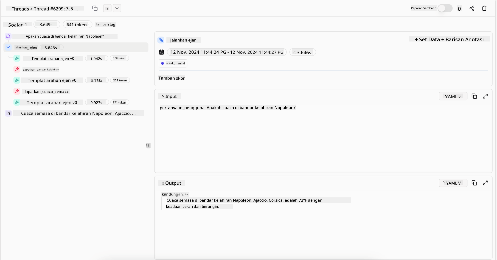
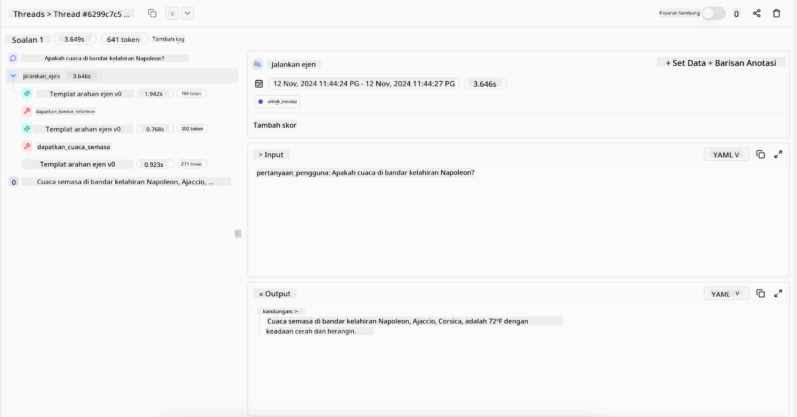

<!--
CO_OP_TRANSLATOR_METADATA:
{
  "original_hash": "7622aa72f9e676e593339f5f694ecd7d",
  "translation_date": "2025-07-12T10:08:44+00:00",
  "source_file": "05-agentic-rag/README.md",
  "language_code": "ms"
}
-->

> _(Klik imej di atas untuk menonton video pelajaran ini)_

# Agentic RAG

Pelajaran ini memberikan gambaran menyeluruh mengenai Agentic Retrieval-Augmented Generation (Agentic RAG), satu paradigma AI yang sedang berkembang di mana model bahasa besar (LLM) merancang langkah seterusnya secara autonomi sambil menarik maklumat dari sumber luaran. Berbeza dengan corak statik ambil-mula-baca, Agentic RAG melibatkan panggilan berulang kepada LLM, diselang-selikan dengan panggilan alat atau fungsi serta output berstruktur. Sistem menilai hasil, memperhalusi pertanyaan, memanggil alat tambahan jika perlu, dan meneruskan kitaran ini sehingga penyelesaian yang memuaskan dicapai.

## Pengenalan

Pelajaran ini akan merangkumi

- **Memahami Agentic RAG:** Ketahui tentang paradigma AI yang sedang berkembang di mana model bahasa besar (LLM) merancang langkah seterusnya secara autonomi sambil menarik maklumat dari sumber data luaran.
- **Memahami Gaya Iteratif Maker-Checker:** Fahami kitaran panggilan berulang kepada LLM, diselang-selikan dengan panggilan alat atau fungsi dan output berstruktur, yang direka untuk meningkatkan ketepatan dan mengendalikan pertanyaan yang tidak betul.
- **Meneroka Aplikasi Praktikal:** Kenal pasti senario di mana Agentic RAG menonjol, seperti persekitaran yang mengutamakan ketepatan, interaksi pangkalan data yang kompleks, dan aliran kerja yang panjang.

## Matlamat Pembelajaran

Selepas menamatkan pelajaran ini, anda akan tahu cara/faham:

- **Memahami Agentic RAG:** Ketahui tentang paradigma AI yang sedang berkembang di mana model bahasa besar (LLM) merancang langkah seterusnya secara autonomi sambil menarik maklumat dari sumber data luaran.
- **Gaya Iteratif Maker-Checker:** Fahami konsep kitaran panggilan berulang kepada LLM, diselang-selikan dengan panggilan alat atau fungsi dan output berstruktur, yang direka untuk meningkatkan ketepatan dan mengendalikan pertanyaan yang tidak betul.
- **Menguasai Proses Pemikiran:** Fahami keupayaan sistem untuk menguasai proses pemikirannya, membuat keputusan tentang cara mendekati masalah tanpa bergantung pada laluan yang telah ditetapkan.
- **Aliran Kerja:** Fahami bagaimana model agentic membuat keputusan secara bebas untuk mendapatkan laporan tren pasaran, mengenal pasti data pesaing, mengaitkan metrik jualan dalaman, mensintesis penemuan, dan menilai strategi.
- **Kitaran Iteratif, Integrasi Alat, dan Memori:** Ketahui tentang kebergantungan sistem pada corak interaksi berulang, mengekalkan keadaan dan memori sepanjang langkah untuk mengelakkan kitaran berulang dan membuat keputusan yang lebih tepat.
- **Mengendalikan Kegagalan dan Pembetulan Diri:** Terokai mekanisme pembetulan diri yang kukuh, termasuk mengulangi dan membuat pertanyaan semula, menggunakan alat diagnostik, dan bergantung pada pengawasan manusia.
- **Had Agen:** Fahami had Agentic RAG, dengan fokus pada autonomi khusus domain, kebergantungan infrastruktur, dan penghormatan terhadap garis panduan.
- **Kes Penggunaan Praktikal dan Nilai:** Kenal pasti senario di mana Agentic RAG menonjol, seperti persekitaran yang mengutamakan ketepatan, interaksi pangkalan data yang kompleks, dan aliran kerja yang panjang.
- **Tadbir Urus, Ketelusan, dan Kepercayaan:** Ketahui kepentingan tadbir urus dan ketelusan, termasuk pemikiran yang boleh dijelaskan, kawalan bias, dan pengawasan manusia.

## Apakah Agentic RAG?

Agentic Retrieval-Augmented Generation (Agentic RAG) adalah paradigma AI yang sedang berkembang di mana model bahasa besar (LLM) merancang langkah seterusnya secara autonomi sambil menarik maklumat dari sumber luaran. Berbeza dengan corak statik ambil-mula-baca, Agentic RAG melibatkan panggilan berulang kepada LLM, diselang-selikan dengan panggilan alat atau fungsi serta output berstruktur. Sistem menilai hasil, memperhalusi pertanyaan, memanggil alat tambahan jika perlu, dan meneruskan kitaran ini sehingga penyelesaian yang memuaskan dicapai. Gaya “maker-checker” iteratif ini meningkatkan ketepatan, mengendalikan pertanyaan yang tidak betul, dan memastikan hasil berkualiti tinggi.

Sistem secara aktif menguasai proses pemikirannya, menulis semula pertanyaan yang gagal, memilih kaedah pengambilan yang berbeza, dan mengintegrasikan pelbagai alat—seperti carian vektor dalam Azure AI Search, pangkalan data SQL, atau API tersuai—sebelum memuktamadkan jawapannya. Ciri utama sistem agentic adalah keupayaannya menguasai proses pemikiran sendiri. Pelaksanaan RAG tradisional bergantung pada laluan yang telah ditetapkan, tetapi sistem agentic menentukan urutan langkah secara autonomi berdasarkan kualiti maklumat yang ditemui.

## Mendefinisikan Agentic Retrieval-Augmented Generation (Agentic RAG)

Agentic Retrieval-Augmented Generation (Agentic RAG) adalah paradigma baru dalam pembangunan AI di mana LLM bukan sahaja menarik maklumat dari sumber data luaran tetapi juga merancang langkah seterusnya secara autonomi. Berbeza dengan corak statik ambil-mula-baca atau urutan prompt yang disusun rapi, Agentic RAG melibatkan kitaran panggilan berulang kepada LLM, diselang-selikan dengan panggilan alat atau fungsi dan output berstruktur. Pada setiap giliran, sistem menilai hasil yang diperoleh, memutuskan sama ada untuk memperhalusi pertanyaan, memanggil alat tambahan jika perlu, dan meneruskan kitaran ini sehingga mencapai penyelesaian yang memuaskan.

Gaya operasi “maker-checker” iteratif ini direka untuk meningkatkan ketepatan, mengendalikan pertanyaan yang tidak betul kepada pangkalan data berstruktur (contohnya NL2SQL), dan memastikan hasil yang seimbang dan berkualiti tinggi. Daripada bergantung sepenuhnya pada rantai prompt yang direka dengan teliti, sistem secara aktif menguasai proses pemikirannya. Ia boleh menulis semula pertanyaan yang gagal, memilih kaedah pengambilan yang berbeza, dan mengintegrasikan pelbagai alat—seperti carian vektor dalam Azure AI Search, pangkalan data SQL, atau API tersuai—sebelum memuktamadkan jawapannya. Ini menghapuskan keperluan untuk rangka kerja orkestrasi yang terlalu kompleks. Sebaliknya, kitaran yang agak mudah “panggilan LLM → penggunaan alat → panggilan LLM → …” boleh menghasilkan output yang canggih dan berasas kukuh.

## Menguasai Proses Pemikiran

Ciri utama yang menjadikan sistem itu “agentic” adalah keupayaannya menguasai proses pemikirannya. Pelaksanaan RAG tradisional sering bergantung pada manusia yang menetapkan laluan untuk model: satu rantai pemikiran yang menggariskan apa yang perlu diambil dan bila.
Tetapi apabila sistem benar-benar agentic, ia membuat keputusan dalaman tentang cara mendekati masalah. Ia bukan sekadar melaksanakan skrip; ia menentukan urutan langkah secara autonomi berdasarkan kualiti maklumat yang ditemui.
Sebagai contoh, jika diminta untuk mencipta strategi pelancaran produk, ia tidak hanya bergantung pada prompt yang menerangkan keseluruhan aliran kerja penyelidikan dan pembuatan keputusan. Sebaliknya, model agentic membuat keputusan secara bebas untuk:

1. Mendapatkan laporan tren pasaran semasa menggunakan Bing Web Grounding
2. Mengenal pasti data pesaing yang relevan menggunakan Azure AI Search.
3. Mengaitkan metrik jualan dalaman sejarah menggunakan Azure SQL Database.
4. Mensintesis penemuan menjadi strategi yang padu yang diorkestrakan melalui Azure OpenAI Service.
5. Menilai strategi untuk jurang atau ketidakkonsistenan, dan memulakan pusingan pengambilan semula jika perlu.
Semua langkah ini—memperhalusi pertanyaan, memilih sumber, mengulangi sehingga “berpuas hati” dengan jawapan—diputuskan oleh model, bukan diskripkan terlebih dahulu oleh manusia.

## Kitaran Iteratif, Integrasi Alat, dan Memori

Sistem agentic bergantung pada corak interaksi berulang:

- **Panggilan Awal:** Matlamat pengguna (iaitu prompt pengguna) disampaikan kepada LLM.
- **Panggilan Alat:** Jika model mengenal pasti maklumat yang hilang atau arahan yang samar, ia memilih alat atau kaedah pengambilan—seperti pertanyaan pangkalan data vektor (contohnya carian hibrid Azure AI Search ke atas data peribadi) atau panggilan SQL berstruktur—untuk mengumpul lebih banyak konteks.
- **Penilaian & Perhalusan:** Selepas menilai data yang dikembalikan, model memutuskan sama ada maklumat itu mencukupi. Jika tidak, ia memperhalusi pertanyaan, mencuba alat lain, atau menyesuaikan pendekatannya.
- **Ulang Sehingga Puas:** Kitaran ini diteruskan sehingga model menentukan bahawa ia mempunyai kejelasan dan bukti yang cukup untuk memberikan jawapan akhir yang beralasan baik.
- **Memori & Keadaan:** Oleh kerana sistem mengekalkan keadaan dan memori sepanjang langkah, ia boleh mengingati cubaan terdahulu dan hasilnya, mengelakkan kitaran berulang dan membuat keputusan yang lebih bermaklumat semasa meneruskan.

Seiring masa, ini mewujudkan rasa pemahaman yang berkembang, membolehkan model mengendalikan tugas kompleks berbilang langkah tanpa memerlukan campur tangan manusia secara berterusan atau mengubah prompt.

## Mengendalikan Kegagalan dan Pembetulan Diri

Autonomi Agentic RAG juga melibatkan mekanisme pembetulan diri yang kukuh. Apabila sistem menghadapi jalan buntu—seperti mengambil dokumen yang tidak relevan atau menghadapi pertanyaan yang tidak betul—ia boleh:

- **Mengulangi dan Membuat Pertanyaan Semula:** Daripada memberikan jawapan bernilai rendah, model mencuba strategi carian baru, menulis semula pertanyaan pangkalan data, atau melihat set data alternatif.
- **Menggunakan Alat Diagnostik:** Sistem mungkin memanggil fungsi tambahan yang direka untuk membantu mengesan kesilapan dalam langkah pemikirannya atau mengesahkan ketepatan data yang diambil. Alat seperti Azure AI Tracing penting untuk membolehkan pemerhatian dan pemantauan yang kukuh.
- **Bergantung pada Pengawasan Manusia:** Untuk senario berisiko tinggi atau yang sering gagal, model mungkin menandakan ketidakpastian dan meminta panduan manusia. Setelah manusia memberikan maklum balas pembetulan, model boleh menggabungkan pelajaran itu untuk masa depan.

Pendekatan iteratif dan dinamik ini membolehkan model sentiasa memperbaiki diri, memastikan ia bukan sistem satu kali tetapi yang belajar daripada kesilapan dalam satu sesi.

## Had Agen

Walaupun mempunyai autonomi dalam sesuatu tugas, Agentic RAG tidak sama dengan Kecerdasan Umum Buatan. Keupayaan “agentic”nya terhad kepada alat, sumber data, dan polisi yang disediakan oleh pembangun manusia. Ia tidak boleh mencipta alat sendiri atau melangkaui sempadan domain yang telah ditetapkan. Sebaliknya, ia cemerlang dalam mengorkestrakan sumber yang ada secara dinamik.
Perbezaan utama berbanding bentuk AI yang lebih maju termasuk:

1. **Autonomi Khusus Domain:** Sistem Agentic RAG fokus mencapai matlamat yang ditetapkan pengguna dalam domain yang diketahui, menggunakan strategi seperti penulisan semula pertanyaan atau pemilihan alat untuk meningkatkan hasil.
2. **Bergantung pada Infrastruktur:** Keupayaan sistem bergantung pada alat dan data yang diintegrasikan oleh pembangun. Ia tidak boleh melepasi sempadan ini tanpa campur tangan manusia.
3. **Menghormati Garis Panduan:** Garis panduan etika, peraturan pematuhan, dan polisi perniagaan kekal sangat penting. Kebebasan agen sentiasa dibatasi oleh langkah keselamatan dan mekanisme pengawasan (harap-harapnya).

## Kes Penggunaan Praktikal dan Nilai

Agentic RAG menonjol dalam senario yang memerlukan penambahbaikan berulang dan ketepatan:

1. **Persekitaran Utamakan Ketepatan:** Dalam pemeriksaan pematuhan, analisis peraturan, atau penyelidikan undang-undang, model agentic boleh berulang kali mengesahkan fakta, merujuk pelbagai sumber, dan menulis semula pertanyaan sehingga menghasilkan jawapan yang disemak dengan teliti.
2. **Interaksi Pangkalan Data Kompleks:** Apabila berurusan dengan data berstruktur di mana pertanyaan mungkin sering gagal atau perlu disesuaikan, sistem boleh memperhalusi pertanyaan secara autonomi menggunakan Azure SQL atau Microsoft Fabric OneLake, memastikan pengambilan akhir selaras dengan niat pengguna.
3. **Aliran Kerja Panjang:** Sesi yang berjalan lebih lama mungkin berkembang apabila maklumat baru muncul. Agentic RAG boleh sentiasa menggabungkan data baru, mengubah strategi apabila ia mempelajari lebih lanjut tentang ruang masalah.

## Tadbir Urus, Ketelusan, dan Kepercayaan

Apabila sistem ini menjadi lebih autonomi dalam pemikiran mereka, tadbir urus dan ketelusan menjadi sangat penting:

- **Pemikiran yang Boleh Dijelaskan:** Model boleh menyediakan jejak audit pertanyaan yang dibuat, sumber yang dirujuk, dan langkah pemikiran yang diambil untuk mencapai kesimpulan. Alat seperti Azure AI Content Safety dan Azure AI Tracing / GenAIOps membantu mengekalkan ketelusan dan mengurangkan risiko.
- **Kawalan Bias dan Pengambilan Seimbang:** Pembangun boleh melaras strategi pengambilan untuk memastikan sumber data yang seimbang dan mewakili dipertimbangkan, serta mengaudit output secara berkala untuk mengesan bias atau corak berat sebelah menggunakan model tersuai untuk organisasi sains data maju yang menggunakan Azure Machine Learning.
- **Pengawasan Manusia dan Pematuhan:** Untuk tugas sensitif, semakan manusia kekal penting. Agentic RAG tidak menggantikan pertimbangan manusia dalam keputusan berisiko tinggi—ia menyokong dengan menyediakan pilihan yang disemak dengan lebih teliti.

Mempunyai alat yang menyediakan rekod jelas tindakan adalah penting. Tanpanya, mengesan kesilapan dalam proses berbilang langkah boleh menjadi sangat sukar. Lihat contoh berikut dari Literal AI (syarikat di belakang Chainlit) untuk satu Agent run:

## Kesimpulan

Agentic RAG mewakili evolusi semula jadi dalam cara sistem AI mengendalikan tugas kompleks yang memerlukan data intensif. Dengan mengamalkan corak interaksi berulang, memilih alat secara autonomi, dan memperhalusi pertanyaan sehingga mencapai hasil berkualiti tinggi, sistem bergerak melepasi pengikut prompt statik kepada pembuat keputusan yang lebih adaptif dan peka konteks. Walaupun masih terhad oleh infrastruktur dan garis panduan etika yang ditetapkan manusia, keupayaan agentic ini membolehkan interaksi AI yang lebih kaya, dinamik, dan akhirnya lebih berguna untuk perusahaan dan pengguna akhir.

## Sumber Tambahan

- <a href="https://learn.microsoft.com/training/modules/use-own-data-azure-openai" target="_blank">Melaksanakan Retrieval Augmented Generation (RAG) dengan Azure OpenAI Service: Pelajari cara menggunakan data anda sendiri dengan Azure OpenAI Service. Modul Microsoft Learn ini menyediakan panduan menyeluruh tentang pelaksanaan RAG</a>

- <a href="https://learn.microsoft.com/azure/ai-studio/concepts/evaluation-approach-gen-ai" target="_blank">Penilaian aplikasi AI generatif dengan Azure AI Foundry: Artikel ini membincangkan penilaian dan perbandingan model menggunakan set data yang tersedia secara umum, termasuk aplikasi Agentic AI dan seni bina RAG</a>
- <a href="https://weaviate.io/blog/what-is-agentic-rag" target="_blank">Apa itu Agentic RAG | Weaviate</a>
- <a href="https://ragaboutit.com/agentic-rag-a-complete-guide-to-agent-based-retrieval-augmented-generation/" target="_blank">Agentic RAG: Panduan Lengkap untuk Penjanaan Dipertingkatkan Berasaskan Ejen – Berita dari generasi RAG</a>
- <a href="https://huggingface.co/learn/cookbook/agent_rag" target="_blank">Agentic RAG: tingkatkan RAG anda dengan reformulasi pertanyaan dan pertanyaan sendiri! Buku Resipi AI Sumber Terbuka Hugging Face</a>
- <a href="https://youtu.be/aQ4yQXeB1Ss?si=2HUqBzHoeB5tR04U" target="_blank">Menambah Lapisan Agentic ke RAG</a>
- <a href="https://www.youtube.com/watch?v=zeAyuLc_f3Q&t=244s" target="_blank">Masa Depan Pembantu Pengetahuan: Jerry Liu</a>
- <a href="https://www.youtube.com/watch?v=AOSjiXP1jmQ" target="_blank">Cara Membina Sistem Agentic RAG</a>
- <a href="https://ignite.microsoft.com/sessions/BRK102?source=sessions" target="_blank">Menggunakan Perkhidmatan Ejen Azure AI Foundry untuk mengembangkan ejen AI anda</a>

### Kertas Akademik

- <a href="https://arxiv.org/abs/2303.17651" target="_blank">2303.17651 Self-Refine: Penambahbaikan Berulang dengan Maklum Balas Diri</a>
- <a href="https://arxiv.org/abs/2303.11366" target="_blank">2303.11366 Reflexion: Ejen Bahasa dengan Pembelajaran Penguatan Verbal</a>
- <a href="https://arxiv.org/abs/2305.11738" target="_blank">2305.11738 CRITIC: Model Bahasa Besar Boleh Membetulkan Diri dengan Kritikan Interaktif Alat</a>
- <a href="https://arxiv.org/abs/2501.09136" target="_blank">2501.09136 Agentic Retrieval-Augmented Generation: Tinjauan mengenai Agentic RAG</a>

## Pelajaran Sebelumnya

[Corak Reka Bentuk Penggunaan Alat](../04-tool-use/README.md)

## Pelajaran Seterusnya

[Membina Ejen AI yang Boleh Dipercayai](../06-building-trustworthy-agents/README.md)

**Penafian**:  
Dokumen ini telah diterjemahkan menggunakan perkhidmatan terjemahan AI [Co-op Translator](https://github.com/Azure/co-op-translator). Walaupun kami berusaha untuk ketepatan, sila ambil maklum bahawa terjemahan automatik mungkin mengandungi kesilapan atau ketidaktepatan. Dokumen asal dalam bahasa asalnya harus dianggap sebagai sumber yang sahih. Untuk maklumat penting, terjemahan profesional oleh manusia adalah disyorkan. Kami tidak bertanggungjawab atas sebarang salah faham atau salah tafsir yang timbul daripada penggunaan terjemahan ini.