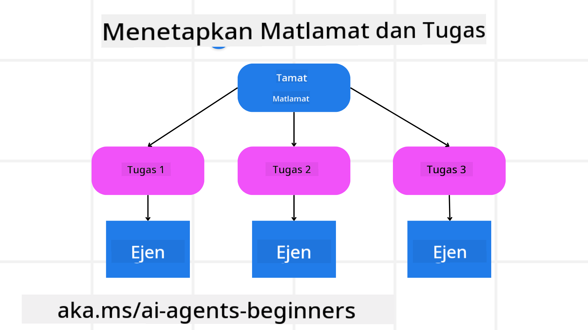

<!--
CO_OP_TRANSLATOR_METADATA:
{
  "original_hash": "a28d30590704ea13b6a08d4793cf9c2b",
  "translation_date": "2025-08-29T18:22:15+00:00",
  "source_file": "07-planning-design/README.md",
  "language_code": "ms"
}
-->
[](https://youtu.be/kPfJ2BrBCMY?si=9pYpPXp0sSbK91Dr)

> _(Klik pada imej di atas untuk menonton video pelajaran ini)_

# Reka Bentuk Perancangan

## Pengenalan

Pelajaran ini akan merangkumi

* Menentukan matlamat keseluruhan yang jelas dan memecahkan tugas kompleks kepada tugas yang boleh diurus.
* Menggunakan output berstruktur untuk respons yang lebih boleh dipercayai dan boleh dibaca oleh mesin.
* Menerapkan pendekatan berasaskan peristiwa untuk mengendalikan tugas dinamik dan input yang tidak dijangka.

## Matlamat Pembelajaran

Selepas menyelesaikan pelajaran ini, anda akan memahami tentang:

* Mengenal pasti dan menetapkan matlamat keseluruhan untuk ejen AI, memastikan ia tahu dengan jelas apa yang perlu dicapai.
* Memecahkan tugas kompleks kepada subtugas yang boleh diurus dan menyusunnya dalam urutan yang logik.
* Melengkapkan ejen dengan alat yang sesuai (contohnya, alat carian atau alat analitik data), memutuskan bila dan bagaimana ia digunakan, dan mengendalikan situasi yang tidak dijangka.
* Menilai hasil subtugas, mengukur prestasi, dan mengulangi tindakan untuk meningkatkan output akhir.

## Menentukan Matlamat Keseluruhan dan Memecahkan Tugas



Kebanyakan tugas dunia nyata terlalu kompleks untuk ditangani dalam satu langkah. Ejen AI memerlukan objektif yang ringkas untuk membimbing perancangan dan tindakannya. Sebagai contoh, pertimbangkan matlamat:

    "Hasilkan jadual perjalanan selama 3 hari."

Walaupun ia mudah dinyatakan, ia masih memerlukan penjelasan. Semakin jelas matlamat, semakin baik ejen (dan mana-mana kolaborator manusia) dapat menumpukan perhatian untuk mencapai hasil yang tepat, seperti mencipta jadual perjalanan yang komprehensif dengan pilihan penerbangan, cadangan hotel, dan aktiviti.

### Pemecahan Tugas

Tugas besar atau rumit menjadi lebih mudah diurus apabila dipecahkan kepada subtugas kecil yang berorientasikan matlamat. 
Untuk contoh jadual perjalanan, anda boleh memecahkan matlamat kepada:

* Tempahan Penerbangan
* Tempahan Hotel
* Sewa Kereta
* Penyesuaian Peribadi

Setiap subtugas kemudian boleh ditangani oleh ejen atau proses khusus. Satu ejen mungkin pakar dalam mencari tawaran penerbangan terbaik, satu lagi memberi tumpuan kepada tempahan hotel, dan sebagainya. Ejen penyelaras atau "downstream" kemudian boleh menyusun hasil ini menjadi satu jadual perjalanan yang padu untuk pengguna akhir.

Pendekatan modular ini juga membolehkan penambahbaikan secara beransur-ansur. Sebagai contoh, anda boleh menambah ejen khusus untuk Cadangan Makanan atau Cadangan Aktiviti Tempatan dan memperhalusi jadual perjalanan dari semasa ke semasa.

### Output Berstruktur

Model Bahasa Besar (LLM) boleh menghasilkan output berstruktur (contohnya, JSON) yang lebih mudah untuk ejen atau perkhidmatan downstream untuk menganalisis dan memproses. Ini sangat berguna dalam konteks multi-ejen, di mana kita boleh melaksanakan tugas ini selepas output perancangan diterima. Rujuk kepada 

untuk gambaran ringkas.

Kod Python berikut menunjukkan ejen perancangan mudah yang memecahkan matlamat kepada subtugas dan menghasilkan rancangan berstruktur:

```python
from pydantic import BaseModel
from enum import Enum
from typing import List, Optional, Union
import json
import os
from typing import Optional
from pprint import pprint
from autogen_core.models import UserMessage, SystemMessage, AssistantMessage
from autogen_ext.models.azure import AzureAIChatCompletionClient
from azure.core.credentials import AzureKeyCredential

class AgentEnum(str, Enum):
    FlightBooking = "flight_booking"
    HotelBooking = "hotel_booking"
    CarRental = "car_rental"
    ActivitiesBooking = "activities_booking"
    DestinationInfo = "destination_info"
    DefaultAgent = "default_agent"
    GroupChatManager = "group_chat_manager"

# Travel SubTask Model
class TravelSubTask(BaseModel):
    task_details: str
    assigned_agent: AgentEnum  # we want to assign the task to the agent

class TravelPlan(BaseModel):
    main_task: str
    subtasks: List[TravelSubTask]
    is_greeting: bool

client = AzureAIChatCompletionClient(
    model="gpt-4o-mini",
    endpoint="https://models.inference.ai.azure.com",
    # To authenticate with the model you will need to generate a personal access token (PAT) in your GitHub settings.
    # Create your PAT token by following instructions here: https://docs.github.com/en/authentication/keeping-your-account-and-data-secure/managing-your-personal-access-tokens
    credential=AzureKeyCredential(os.environ["GITHUB_TOKEN"]),
    model_info={
        "json_output": False,
        "function_calling": True,
        "vision": True,
        "family": "unknown",
    },
)

# Define the user message
messages = [
    SystemMessage(content="""You are an planner agent.
    Your job is to decide which agents to run based on the user's request.
                      Provide your response in JSON format with the following structure:
{'main_task': 'Plan a family trip from Singapore to Melbourne.',
 'subtasks': [{'assigned_agent': 'flight_booking',
               'task_details': 'Book round-trip flights from Singapore to '
                               'Melbourne.'}
    Below are the available agents specialised in different tasks:
    - FlightBooking: For booking flights and providing flight information
    - HotelBooking: For booking hotels and providing hotel information
    - CarRental: For booking cars and providing car rental information
    - ActivitiesBooking: For booking activities and providing activity information
    - DestinationInfo: For providing information about destinations
    - DefaultAgent: For handling general requests""", source="system"),
    UserMessage(
        content="Create a travel plan for a family of 2 kids from Singapore to Melboune", source="user"),
]

response = await client.create(messages=messages, extra_create_args={"response_format": 'json_object'})

response_content: Optional[str] = response.content if isinstance(
    response.content, str) else None
if response_content is None:
    raise ValueError("Response content is not a valid JSON string" )

pprint(json.loads(response_content))

# # Ensure the response content is a valid JSON string before loading it
# response_content: Optional[str] = response.content if isinstance(
#     response.content, str) else None
# if response_content is None:
#     raise ValueError("Response content is not a valid JSON string")

# # Print the response content after loading it as JSON
# pprint(json.loads(response_content))

# Validate the response content with the MathReasoning model
# TravelPlan.model_validate(json.loads(response_content))
```

### Ejen Perancangan dengan Orkestrasi Multi-Ejen

Dalam contoh ini, Ejen Router Semantik menerima permintaan pengguna (contohnya, "Saya perlukan rancangan hotel untuk perjalanan saya.").

Perancang kemudian:

* Menerima Rancangan Hotel: Perancang mengambil mesej pengguna dan, berdasarkan prompt sistem (termasuk butiran ejen yang tersedia), menghasilkan rancangan perjalanan berstruktur.
* Menyenaraikan Ejen dan Alat Mereka: Daftar ejen menyimpan senarai ejen (contohnya, untuk penerbangan, hotel, sewa kereta, dan aktiviti) bersama fungsi atau alat yang mereka tawarkan.
* Mengarahkan Rancangan kepada Ejen Berkaitan: Bergantung pada bilangan subtugas, perancang sama ada menghantar mesej secara langsung kepada ejen khusus (untuk senario tugas tunggal) atau menyelaraskan melalui pengurus sembang kumpulan untuk kerjasama multi-ejen.
* Merumuskan Hasil: Akhirnya, perancang merumuskan rancangan yang dihasilkan untuk kejelasan.

Kod Python berikut menggambarkan langkah-langkah ini:

```python

from pydantic import BaseModel

from enum import Enum
from typing import List, Optional, Union

class AgentEnum(str, Enum):
    FlightBooking = "flight_booking"
    HotelBooking = "hotel_booking"
    CarRental = "car_rental"
    ActivitiesBooking = "activities_booking"
    DestinationInfo = "destination_info"
    DefaultAgent = "default_agent"
    GroupChatManager = "group_chat_manager"

# Travel SubTask Model

class TravelSubTask(BaseModel):
    task_details: str
    assigned_agent: AgentEnum # we want to assign the task to the agent

class TravelPlan(BaseModel):
    main_task: str
    subtasks: List[TravelSubTask]
    is_greeting: bool
import json
import os
from typing import Optional

from autogen_core.models import UserMessage, SystemMessage, AssistantMessage
from autogen_ext.models.openai import AzureOpenAIChatCompletionClient

# Create the client with type-checked environment variables

client = AzureOpenAIChatCompletionClient(
    azure_deployment=os.getenv("AZURE_OPENAI_DEPLOYMENT_NAME"),
    model=os.getenv("AZURE_OPENAI_DEPLOYMENT_NAME"),
    api_version=os.getenv("AZURE_OPENAI_API_VERSION"),
    azure_endpoint=os.getenv("AZURE_OPENAI_ENDPOINT"),
    api_key=os.getenv("AZURE_OPENAI_API_KEY"),
)

from pprint import pprint

# Define the user message

messages = [
    SystemMessage(content="""You are an planner agent.
    Your job is to decide which agents to run based on the user's request.
    Below are the available agents specialized in different tasks:
    - FlightBooking: For booking flights and providing flight information
    - HotelBooking: For booking hotels and providing hotel information
    - CarRental: For booking cars and providing car rental information
    - ActivitiesBooking: For booking activities and providing activity information
    - DestinationInfo: For providing information about destinations
    - DefaultAgent: For handling general requests""", source="system"),
    UserMessage(content="Create a travel plan for a family of 2 kids from Singapore to Melbourne", source="user"),
]

response = await client.create(messages=messages, extra_create_args={"response_format": TravelPlan})

# Ensure the response content is a valid JSON string before loading it

response_content: Optional[str] = response.content if isinstance(response.content, str) else None
if response_content is None:
    raise ValueError("Response content is not a valid JSON string")

# Print the response content after loading it as JSON

pprint(json.loads(response_content))
```

Berikut adalah output daripada kod sebelumnya dan anda kemudian boleh menggunakan output berstruktur ini untuk mengarahkan kepada `assigned_agent` dan merumuskan rancangan perjalanan kepada pengguna akhir.

```json
{
    "is_greeting": "False",
    "main_task": "Plan a family trip from Singapore to Melbourne.",
    "subtasks": [
        {
            "assigned_agent": "flight_booking",
            "task_details": "Book round-trip flights from Singapore to Melbourne."
        },
        {
            "assigned_agent": "hotel_booking",
            "task_details": "Find family-friendly hotels in Melbourne."
        },
        {
            "assigned_agent": "car_rental",
            "task_details": "Arrange a car rental suitable for a family of four in Melbourne."
        },
        {
            "assigned_agent": "activities_booking",
            "task_details": "List family-friendly activities in Melbourne."
        },
        {
            "assigned_agent": "destination_info",
            "task_details": "Provide information about Melbourne as a travel destination."
        }
    ]
}
```

Notebook contoh dengan kod sebelumnya tersedia [di sini](07-autogen.ipynb).

### Perancangan Iteratif

Sesetengah tugas memerlukan ulang-alik atau perancangan semula, di mana hasil satu subtugas mempengaruhi yang berikutnya. Sebagai contoh, jika ejen menemui format data yang tidak dijangka semasa menempah penerbangan, ia mungkin perlu menyesuaikan strateginya sebelum meneruskan tempahan hotel.

Selain itu, maklum balas pengguna (contohnya, manusia memutuskan mereka lebih suka penerbangan lebih awal) boleh mencetuskan perancangan semula separa. Pendekatan dinamik dan iteratif ini memastikan penyelesaian akhir selaras dengan kekangan dunia nyata dan keutamaan pengguna yang berkembang.

Contoh kod:

```python
from autogen_core.models import UserMessage, SystemMessage, AssistantMessage
#.. same as previous code and pass on the user history, current plan
messages = [
    SystemMessage(content="""You are a planner agent to optimize the
    Your job is to decide which agents to run based on the user's request.
    Below are the available agents specialized in different tasks:
    - FlightBooking: For booking flights and providing flight information
    - HotelBooking: For booking hotels and providing hotel information
    - CarRental: For booking cars and providing car rental information
    - ActivitiesBooking: For booking activities and providing activity information
    - DestinationInfo: For providing information about destinations
    - DefaultAgent: For handling general requests""", source="system"),
    UserMessage(content="Create a travel plan for a family of 2 kids from Singapore to Melbourne", source="user"),
    AssistantMessage(content=f"Previous travel plan - {TravelPlan}", source="assistant")
]
# .. re-plan and send the tasks to respective agents
```

Untuk perancangan yang lebih komprehensif, sila lihat Magnetic One 

untuk menyelesaikan tugas kompleks.

## Rumusan

Dalam artikel ini, kita telah melihat contoh bagaimana kita boleh mencipta perancang yang boleh memilih ejen yang tersedia secara dinamik. Output Perancang memecahkan tugas dan menetapkan ejen supaya ia boleh dilaksanakan. Diandaikan ejen mempunyai akses kepada fungsi/alat yang diperlukan untuk melaksanakan tugas. Selain ejen, anda boleh memasukkan corak lain seperti refleksi, perumus, dan sembang round robin untuk penyesuaian lanjut.

## Sumber Tambahan

* AutoGen Magnetic One - Sistem multi-ejen umum untuk menyelesaikan tugas kompleks dan telah mencapai hasil yang mengagumkan pada pelbagai penanda aras ejen yang mencabar. Rujukan: 

Dalam pelaksanaan ini, pengaturcara mencipta rancangan khusus tugas dan mendelegasikan tugas ini kepada ejen yang tersedia. Selain perancangan, pengaturcara juga menggunakan mekanisme penjejakan untuk memantau kemajuan tugas dan merancang semula jika diperlukan.

### Ada Lagi Soalan tentang Corak Reka Bentuk Perancangan?

Sertai [Azure AI Foundry Discord](https://aka.ms/ai-agents/discord) untuk berhubung dengan pelajar lain, menghadiri waktu pejabat, dan mendapatkan jawapan kepada soalan ejen AI anda.

## Pelajaran Sebelumnya

[Building Trustworthy AI Agents](../06-building-trustworthy-agents/README.md)

## Pelajaran Seterusnya

[Multi-Agent Design Pattern](../08-multi-agent/README.md)

---

**Penafian**:  
Dokumen ini telah diterjemahkan menggunakan perkhidmatan terjemahan AI [Co-op Translator](https://github.com/Azure/co-op-translator). Walaupun kami berusaha untuk memastikan ketepatan, sila ambil perhatian bahawa terjemahan automatik mungkin mengandungi kesilapan atau ketidaktepatan. Dokumen asal dalam bahasa asalnya harus dianggap sebagai sumber yang berwibawa. Untuk maklumat yang kritikal, terjemahan manusia profesional adalah disyorkan. Kami tidak bertanggungjawab atas sebarang salah faham atau salah tafsir yang timbul daripada penggunaan terjemahan ini.