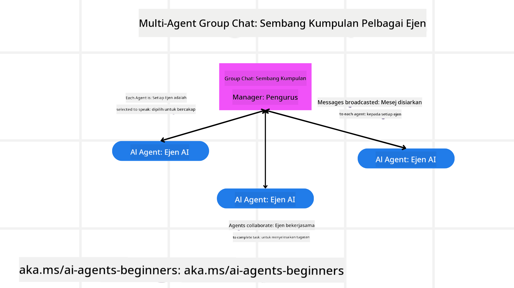
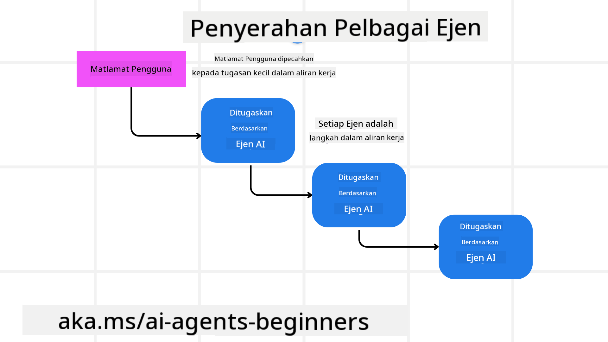
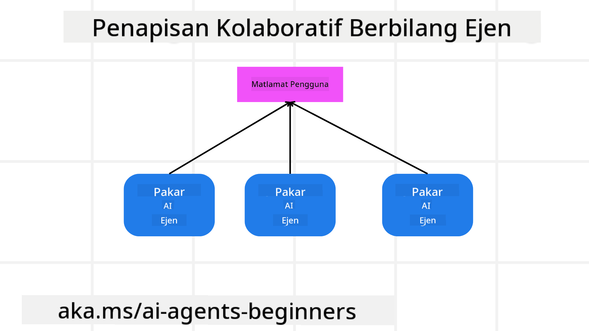

<!--
CO_OP_TRANSLATOR_METADATA:
{
  "original_hash": "c692a8975d7d5b99575a553de1c5e8a7",
  "translation_date": "2025-07-12T11:20:14+00:00",
  "source_file": "08-multi-agent/README.md",
  "language_code": "ms"
}
-->

> _(Klik gambar di atas untuk menonton video pelajaran ini)_

# Corak reka bentuk multi-ejen

Sebaik sahaja anda mula bekerja pada projek yang melibatkan pelbagai ejen, anda perlu mempertimbangkan corak reka bentuk multi-ejen. Namun, mungkin tidak segera jelas bila perlu beralih kepada multi-ejen dan apakah kelebihannya.

## Pengenalan

Dalam pelajaran ini, kita akan menjawab soalan-soalan berikut:

- Apakah senario di mana multi-ejen sesuai digunakan?
- Apakah kelebihan menggunakan multi-ejen berbanding hanya satu ejen yang melakukan pelbagai tugas?
- Apakah blok binaan untuk melaksanakan corak reka bentuk multi-ejen?
- Bagaimana kita dapat melihat bagaimana pelbagai ejen berinteraksi antara satu sama lain?

## Matlamat Pembelajaran

Selepas pelajaran ini, anda sepatutnya dapat:

- Mengenal pasti senario di mana multi-ejen sesuai digunakan
- Mengakui kelebihan menggunakan multi-ejen berbanding ejen tunggal.
- Memahami blok binaan untuk melaksanakan corak reka bentuk multi-ejen.

Apakah gambaran besar?

*Multi-ejen adalah corak reka bentuk yang membolehkan pelbagai ejen bekerjasama untuk mencapai matlamat bersama*.

Corak ini digunakan secara meluas dalam pelbagai bidang, termasuk robotik, sistem autonomi, dan pengkomputeran teragih.

## Senario Di Mana Multi-Ejen Sesuai Digunakan

Jadi, senario apa yang sesuai untuk menggunakan multi-ejen? Jawapannya adalah terdapat banyak senario di mana penggunaan pelbagai ejen memberi manfaat terutamanya dalam kes berikut:

- **Beban kerja besar**: Beban kerja yang besar boleh dibahagikan kepada tugas-tugas kecil dan diberikan kepada ejen yang berbeza, membolehkan pemprosesan selari dan penyelesaian yang lebih pantas. Contohnya adalah dalam kes pemprosesan data yang besar.
- **Tugas kompleks**: Tugas yang kompleks, seperti beban kerja besar, boleh dipecahkan kepada subtugas yang lebih kecil dan diberikan kepada ejen yang berbeza, masing-masing mengkhusus dalam aspek tertentu tugas tersebut. Contoh yang baik adalah dalam kes kenderaan autonomi di mana ejen yang berbeza mengurus navigasi, pengesanan halangan, dan komunikasi dengan kenderaan lain.
- **Kepakaran pelbagai**: Ejen yang berbeza boleh mempunyai kepakaran yang pelbagai, membolehkan mereka mengendalikan aspek tugas yang berbeza dengan lebih berkesan berbanding ejen tunggal. Dalam kes ini, contoh yang baik adalah dalam bidang penjagaan kesihatan di mana ejen boleh mengurus diagnostik, pelan rawatan, dan pemantauan pesakit.

## Kelebihan Menggunakan Multi-Ejen Berbanding Ejen Tunggal

Sistem ejen tunggal mungkin berfungsi dengan baik untuk tugas mudah, tetapi untuk tugas yang lebih kompleks, menggunakan pelbagai ejen boleh memberikan beberapa kelebihan:

- **Pengkhususan**: Setiap ejen boleh mengkhusus untuk tugas tertentu. Kekurangan pengkhususan dalam ejen tunggal bermakna anda mempunyai ejen yang boleh melakukan segala-galanya tetapi mungkin keliru tentang apa yang perlu dilakukan apabila berhadapan dengan tugas yang kompleks. Contohnya, ia mungkin akhirnya melakukan tugas yang bukan kepakarannya.
- **Kebolehsuaian**: Lebih mudah untuk mengembangkan sistem dengan menambah lebih banyak ejen daripada membebankan satu ejen tunggal.
- **Ketahanan Ralat**: Jika satu ejen gagal, ejen lain boleh terus berfungsi, memastikan kebolehpercayaan sistem.

Mari kita ambil contoh, kita ingin menempah perjalanan untuk seorang pengguna. Sistem ejen tunggal perlu mengendalikan semua aspek proses tempahan perjalanan, dari mencari penerbangan hingga menempah hotel dan kereta sewa. Untuk mencapai ini dengan ejen tunggal, ejen tersebut perlu mempunyai alat untuk mengendalikan semua tugas ini. Ini boleh menyebabkan sistem yang kompleks dan monolitik yang sukar untuk diselenggara dan dikembangkan. Sistem multi-ejen, sebaliknya, boleh mempunyai ejen yang berbeza yang mengkhusus dalam mencari penerbangan, menempah hotel, dan kereta sewa. Ini menjadikan sistem lebih modular, mudah diselenggara, dan boleh diskalakan.

Bandingkan ini dengan biro pelancongan yang dijalankan sebagai kedai kecil keluarga berbanding biro pelancongan yang dijalankan sebagai francais. Kedai kecil keluarga akan mempunyai satu ejen yang mengendalikan semua aspek proses tempahan perjalanan, manakala francais akan mempunyai ejen yang berbeza mengendalikan aspek yang berbeza dalam proses tempahan perjalanan.

## Blok Binaan Melaksanakan Corak Reka Bentuk Multi-Ejen

Sebelum anda boleh melaksanakan corak reka bentuk multi-ejen, anda perlu memahami blok binaan yang membentuk corak tersebut.

Mari kita buat ini lebih konkrit dengan melihat semula contoh menempah perjalanan untuk seorang pengguna. Dalam kes ini, blok binaan termasuk:

- **Komunikasi Ejen**: Ejen untuk mencari penerbangan, menempah hotel, dan kereta sewa perlu berkomunikasi dan berkongsi maklumat tentang keutamaan dan kekangan pengguna. Anda perlu memutuskan protokol dan kaedah untuk komunikasi ini. Secara konkrit, ejen mencari penerbangan perlu berkomunikasi dengan ejen menempah hotel untuk memastikan hotel ditempah pada tarikh yang sama dengan penerbangan. Ini bermakna ejen perlu berkongsi maklumat tentang tarikh perjalanan pengguna, jadi anda perlu memutuskan *ejen mana yang berkongsi maklumat dan bagaimana mereka berkongsi maklumat*.
- **Mekanisme Penyelarasan**: Ejen perlu menyelaraskan tindakan mereka untuk memastikan keutamaan dan kekangan pengguna dipenuhi. Contohnya, keutamaan pengguna mungkin mahu hotel yang dekat dengan lapangan terbang manakala kekangan mungkin kereta sewa hanya tersedia di lapangan terbang. Ini bermakna ejen menempah hotel perlu menyelaraskan dengan ejen menempah kereta sewa untuk memastikan keutamaan dan kekangan pengguna dipenuhi. Anda perlu memutuskan *bagaimana ejen menyelaraskan tindakan mereka*.
- **Seni Bina Ejen**: Ejen perlu mempunyai struktur dalaman untuk membuat keputusan dan belajar daripada interaksi dengan pengguna. Ini bermakna ejen mencari penerbangan perlu mempunyai struktur dalaman untuk membuat keputusan tentang penerbangan mana yang hendak dicadangkan kepada pengguna. Anda perlu memutuskan *bagaimana ejen membuat keputusan dan belajar daripada interaksi dengan pengguna*. Contoh bagaimana ejen belajar dan memperbaiki diri adalah ejen mencari penerbangan boleh menggunakan model pembelajaran mesin untuk mencadangkan penerbangan berdasarkan keutamaan lalu pengguna.
- **Keterlihatan Interaksi Multi-Ejen**: Anda perlu mempunyai keterlihatan tentang bagaimana pelbagai ejen berinteraksi antara satu sama lain. Ini bermakna anda perlu mempunyai alat dan teknik untuk menjejak aktiviti dan interaksi ejen. Ini boleh dalam bentuk alat log dan pemantauan, alat visualisasi, dan metrik prestasi.
- **Corak Multi-Ejen**: Terdapat corak yang berbeza untuk melaksanakan sistem multi-ejen, seperti seni bina berpusat, teragih, dan hibrid. Anda perlu memutuskan corak yang paling sesuai dengan kes penggunaan anda.
- **Manusia dalam gelung**: Dalam kebanyakan kes, anda akan mempunyai manusia dalam gelung dan anda perlu mengarahkan ejen bila untuk meminta campur tangan manusia. Ini boleh dalam bentuk pengguna meminta hotel atau penerbangan tertentu yang tidak dicadangkan oleh ejen atau meminta pengesahan sebelum menempah penerbangan atau hotel.

## Keterlihatan Interaksi Multi-Ejen

Adalah penting anda mempunyai keterlihatan tentang bagaimana pelbagai ejen berinteraksi antara satu sama lain. Keterlihatan ini penting untuk penyahpepijatan, pengoptimuman, dan memastikan keberkesanan keseluruhan sistem. Untuk mencapai ini, anda perlu mempunyai alat dan teknik untuk menjejak aktiviti dan interaksi ejen. Ini boleh dalam bentuk alat log dan pemantauan, alat visualisasi, dan metrik prestasi.

Sebagai contoh, dalam kes menempah perjalanan untuk pengguna, anda boleh mempunyai papan pemuka yang menunjukkan status setiap ejen, keutamaan dan kekangan pengguna, serta interaksi antara ejen. Papan pemuka ini boleh menunjukkan tarikh perjalanan pengguna, penerbangan yang dicadangkan oleh ejen penerbangan, hotel yang dicadangkan oleh ejen hotel, dan kereta sewa yang dicadangkan oleh ejen kereta sewa. Ini memberi anda gambaran jelas tentang bagaimana ejen berinteraksi dan sama ada keutamaan dan kekangan pengguna dipenuhi.

Mari kita lihat setiap aspek ini dengan lebih terperinci.

- **Alat Log dan Pemantauan**: Anda mahu setiap tindakan yang diambil oleh ejen direkodkan. Entri log boleh menyimpan maklumat tentang ejen yang mengambil tindakan, tindakan yang diambil, masa tindakan diambil, dan hasil tindakan. Maklumat ini boleh digunakan untuk penyahpepijatan, pengoptimuman dan lain-lain.
- **Alat Visualisasi**: Alat visualisasi boleh membantu anda melihat interaksi antara ejen dengan cara yang lebih intuitif. Contohnya, anda boleh mempunyai graf yang menunjukkan aliran maklumat antara ejen. Ini boleh membantu anda mengenal pasti kesesakan, ketidakcekapan, dan isu lain dalam sistem.
- **Metrik Prestasi**: Metrik prestasi boleh membantu anda menjejak keberkesanan sistem multi-ejen. Contohnya, anda boleh menjejak masa yang diambil untuk menyelesaikan tugas, bilangan tugas yang diselesaikan setiap unit masa, dan ketepatan cadangan yang dibuat oleh ejen. Maklumat ini boleh membantu anda mengenal pasti bidang untuk penambahbaikan dan mengoptimumkan sistem.

## Corak Multi-Ejen

Mari kita terokai beberapa corak konkrit yang boleh digunakan untuk mencipta aplikasi multi-ejen. Berikut adalah beberapa corak menarik yang patut dipertimbangkan:

### Sembang kumpulan

Corak ini berguna apabila anda ingin mencipta aplikasi sembang kumpulan di mana pelbagai ejen boleh berkomunikasi antara satu sama lain. Kegunaan tipikal corak ini termasuk kerjasama pasukan, sokongan pelanggan, dan rangkaian sosial.

Dalam corak ini, setiap ejen mewakili seorang pengguna dalam sembang kumpulan, dan mesej dihantar antara ejen menggunakan protokol pesanan. Ejen boleh menghantar mesej ke sembang kumpulan, menerima mesej dari sembang kumpulan, dan membalas mesej dari ejen lain.

Corak ini boleh dilaksanakan menggunakan seni bina berpusat di mana semua mesej dihantar melalui pelayan pusat, atau seni bina teragih di mana mesej dihantar secara langsung.

### Penyerahan tugas

Corak ini berguna apabila anda ingin mencipta aplikasi di mana pelbagai ejen boleh menyerahkan tugas antara satu sama lain.

Kegunaan tipikal corak ini termasuk sokongan pelanggan, pengurusan tugas, dan automasi aliran kerja.

Dalam corak ini, setiap ejen mewakili satu tugas atau langkah dalam aliran kerja, dan ejen boleh menyerahkan tugas kepada ejen lain berdasarkan peraturan yang telah ditetapkan.

### Penapisan kolaboratif

Corak ini berguna apabila anda ingin mencipta aplikasi di mana pelbagai ejen boleh bekerjasama untuk membuat cadangan kepada pengguna.

Mengapa anda mahu pelbagai ejen bekerjasama adalah kerana setiap ejen boleh mempunyai kepakaran yang berbeza dan boleh menyumbang kepada proses cadangan dengan cara yang berbeza.

Mari kita ambil contoh di mana seorang pengguna mahu cadangan tentang saham terbaik untuk dibeli di pasaran saham.

- **Pakar industri**: Satu ejen boleh menjadi pakar dalam industri tertentu.
- **Analisis teknikal**: Ejen lain boleh menjadi pakar dalam analisis teknikal.
- **Analisis fundamental**: Dan ejen lain boleh menjadi pakar dalam analisis fundamental. Dengan bekerjasama, ejen-ejen ini boleh memberikan cadangan yang lebih menyeluruh kepada pengguna.

## Senario: Proses bayaran balik

Pertimbangkan senario di mana seorang pelanggan cuba mendapatkan bayaran balik untuk produk, terdapat beberapa ejen yang terlibat dalam proses ini tetapi mari kita bahagikan antara ejen khusus untuk proses ini dan ejen umum yang boleh digunakan dalam proses lain.

**Ejen khusus untuk proses bayaran balik**:

Berikut adalah beberapa ejen yang mungkin terlibat dalam proses bayaran balik:

- **Ejen pelanggan**: Ejen ini mewakili pelanggan dan bertanggungjawab memulakan proses bayaran balik.
- **Ejen penjual**: Ejen ini mewakili penjual dan bertanggungjawab memproses bayaran balik.
- **Ejen pembayaran**: Ejen ini mewakili proses pembayaran dan bertanggungjawab mengembalikan bayaran kepada pelanggan.
- **Ejen penyelesaian**: Ejen ini mewakili proses penyelesaian dan bertanggungjawab menyelesaikan sebarang isu yang timbul semasa proses bayaran balik.
- **Ejen pematuhan**: Ejen ini mewakili proses pematuhan dan bertanggungjawab memastikan proses bayaran balik mematuhi peraturan dan polisi.

**Ejen umum**:

Ejen-ejen ini boleh digunakan oleh bahagian lain dalam perniagaan anda.

- **Ejen penghantaran**: Ejen ini mewakili proses penghantaran dan bertanggungjawab menghantar produk kembali kepada penjual. Ejen ini boleh digunakan untuk proses bayaran balik dan juga penghantaran produk secara umum melalui pembelian contohnya.
- **Ejen maklum balas**: Ejen ini mewakili proses maklum balas dan bertanggungjawab mengumpul maklum balas daripada pelanggan. Maklum balas boleh diambil pada bila-bila masa dan bukan hanya semasa proses bayaran balik.
- **Ejen eskalasi**: Ejen ini mewakili proses eskalasi dan bertanggungjawab menaikkan isu ke tahap sokongan yang lebih tinggi. Anda boleh menggunakan jenis ejen ini untuk mana-mana proses yang memerlukan eskalasi isu.
- **Ejen notifikasi**: Ejen ini mewakili proses notifikasi dan bertanggungjawab menghantar notifikasi kepada pelanggan pada pelbagai peringkat proses bayaran balik.
- **Ejen analitik**: Ejen ini mewakili proses analitik dan bertanggungjawab menganalisis data berkaitan proses bayaran balik.
- **Ejen audit**: Ejen ini mewakili proses audit dan bertanggungjawab mengaudit proses bayaran balik untuk memastikan ia dijalankan dengan betul.
- **Ejen laporan**: Ejen ini mewakili proses pelaporan dan bertanggungjawab menghasilkan laporan mengenai proses bayaran balik.
- **Ejen pengetahuan**: Ejen ini mewakili proses pengetahuan dan bertanggungjawab mengekalkan pangkalan pengetahuan berkaitan proses bayaran balik. Ejen ini boleh mempunyai pengetahuan tentang bayaran balik dan juga bahagian lain dalam perniagaan anda.
- **Ejen keselamatan**: Ejen ini mewakili proses keselamatan dan bertanggungjawab memastikan keselamatan proses bayaran balik.
- **Ejen kualiti**: Ejen ini mewakili proses kualiti dan bertanggungjawab memastikan kualiti proses bayaran balik.

Terdapat banyak ejen yang disenaraikan sebelum ini, baik untuk proses bayaran balik khusus tetapi juga untuk ejen umum yang boleh digunakan dalam bahagian lain perniagaan anda. Diharapkan ini memberi anda gambaran tentang bagaimana anda boleh memutuskan ejen mana yang hendak digunakan dalam sistem multi-ejen anda.

## Tugasan
## Pelajaran Sebelumnya

[Reka Bentuk Perancangan](../07-planning-design/README.md)

## Pelajaran Seterusnya

[Metakognisi dalam Ejen AI](../09-metacognition/README.md)

**Penafian**:  
Dokumen ini telah diterjemahkan menggunakan perkhidmatan terjemahan AI [Co-op Translator](https://github.com/Azure/co-op-translator). Walaupun kami berusaha untuk ketepatan, sila ambil perhatian bahawa terjemahan automatik mungkin mengandungi kesilapan atau ketidaktepatan. Dokumen asal dalam bahasa asalnya harus dianggap sebagai sumber yang sahih. Untuk maklumat penting, terjemahan profesional oleh manusia adalah disyorkan. Kami tidak bertanggungjawab atas sebarang salah faham atau salah tafsir yang timbul daripada penggunaan terjemahan ini.