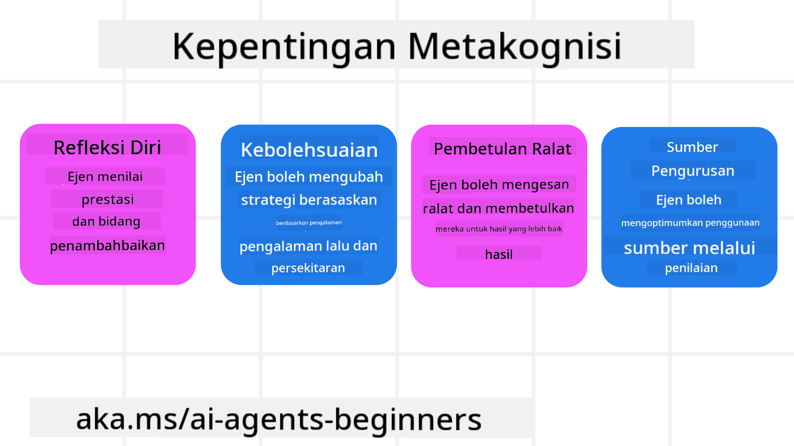
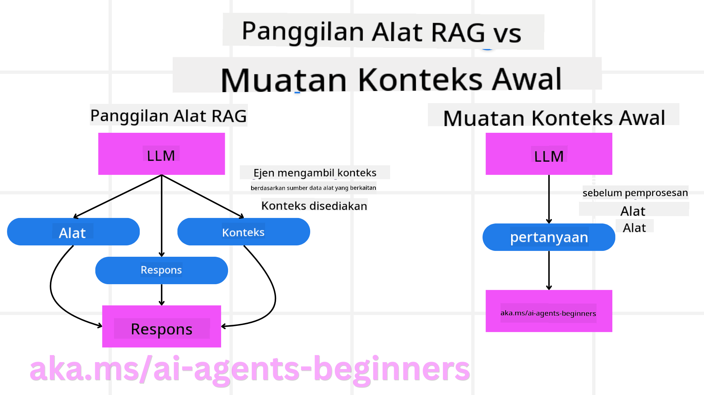

<!--
CO_OP_TRANSLATOR_METADATA:
{
  "original_hash": "8cbf460468c802c7994aa62e0e0779c9",
  "translation_date": "2025-07-12T13:01:39+00:00",
  "source_file": "09-metacognition/README.md",
  "language_code": "ms"
}
-->
[](https://youtu.be/His9R6gw6Ec?si=3_RMb8VprNvdLRhX)

> _(Klik imej di atas untuk menonton video pelajaran ini)_
# Metakognisi dalam Ejen AI

## Pengenalan

Selamat datang ke pelajaran mengenai metakognisi dalam ejen AI! Bab ini direka untuk pemula yang ingin tahu bagaimana ejen AI boleh memikirkan tentang proses pemikiran mereka sendiri. Pada akhir pelajaran ini, anda akan memahami konsep utama dan dilengkapi dengan contoh praktikal untuk menerapkan metakognisi dalam reka bentuk ejen AI.

## Matlamat Pembelajaran

Selepas menamatkan pelajaran ini, anda akan dapat:

1. Memahami implikasi gelung penaakulan dalam definisi ejen.
2. Menggunakan teknik perancangan dan penilaian untuk membantu ejen yang boleh membetulkan diri sendiri.
3. Mencipta ejen anda sendiri yang mampu memanipulasi kod untuk melaksanakan tugasan.

## Pengenalan kepada Metakognisi

Metakognisi merujuk kepada proses kognitif tahap tinggi yang melibatkan pemikiran tentang pemikiran sendiri. Bagi ejen AI, ini bermakna mampu menilai dan menyesuaikan tindakan mereka berdasarkan kesedaran diri dan pengalaman lalu. Metakognisi, atau "berfikir tentang berfikir," adalah konsep penting dalam pembangunan sistem AI ejenik. Ia melibatkan sistem AI yang sedar akan proses dalaman mereka sendiri dan mampu memantau, mengawal, serta menyesuaikan tingkah laku mereka dengan sewajarnya. Sama seperti kita apabila membaca suasana atau melihat sesuatu masalah. Kesedaran diri ini boleh membantu sistem AI membuat keputusan yang lebih baik, mengenal pasti kesilapan, dan meningkatkan prestasi mereka dari masa ke masa—sekali lagi mengaitkan kembali kepada ujian Turing dan perdebatan sama ada AI akan mengambil alih.

Dalam konteks sistem AI ejenik, metakognisi boleh membantu menangani beberapa cabaran, seperti:
- Ketelusan: Memastikan sistem AI boleh menjelaskan penaakulan dan keputusan mereka.
- Penaakulan: Meningkatkan keupayaan sistem AI untuk mensintesis maklumat dan membuat keputusan yang tepat.
- Penyesuaian: Membolehkan sistem AI menyesuaikan diri dengan persekitaran baru dan keadaan yang berubah.
- Persepsi: Memperbaiki ketepatan sistem AI dalam mengenal pasti dan mentafsir data dari persekitaran mereka.

### Apakah Metakognisi?

Metakognisi, atau "berfikir tentang berfikir," adalah proses kognitif tahap tinggi yang melibatkan kesedaran diri dan pengawalan diri terhadap proses kognitif seseorang. Dalam bidang AI, metakognisi memberi kuasa kepada ejen untuk menilai dan menyesuaikan strategi serta tindakan mereka, membawa kepada peningkatan keupayaan menyelesaikan masalah dan membuat keputusan. Dengan memahami metakognisi, anda boleh mereka bentuk ejen AI yang bukan sahaja lebih pintar tetapi juga lebih mudah menyesuaikan diri dan cekap. Dalam metakognisi sebenar, anda akan melihat AI secara eksplisit membuat penaakulan tentang penaakulan sendiri.

Contoh: “Saya mengutamakan penerbangan yang lebih murah kerana… mungkin saya terlepas penerbangan terus, jadi saya akan semak semula.”
Mengawasi bagaimana atau mengapa ia memilih laluan tertentu.
- Menyedari bahawa ia membuat kesilapan kerana terlalu bergantung pada keutamaan pengguna dari kali sebelumnya, jadi ia mengubah strategi membuat keputusan, bukan hanya cadangan akhir.
- Mendiagnosis corak seperti, “Setiap kali saya lihat pengguna menyebut ‘terlalu sesak,’ saya tidak hanya perlu mengeluarkan tarikan tertentu tetapi juga memikirkan bahawa kaedah saya memilih ‘tarikan utama’ adalah cacat jika saya sentiasa mengikut populariti.”

### Kepentingan Metakognisi dalam Ejen AI

Metakognisi memainkan peranan penting dalam reka bentuk ejen AI atas beberapa sebab:



- Refleksi Diri: Ejen boleh menilai prestasi sendiri dan mengenal pasti bidang untuk penambahbaikan.
- Kebolehsuaian: Ejen boleh mengubah strategi berdasarkan pengalaman lalu dan persekitaran yang berubah.
- Pembetulan Kesilapan: Ejen boleh mengesan dan membetulkan kesilapan secara automatik, menghasilkan keputusan yang lebih tepat.
- Pengurusan Sumber: Ejen boleh mengoptimumkan penggunaan sumber, seperti masa dan kuasa pengkomputeran, dengan merancang dan menilai tindakan mereka.

## Komponen Ejen AI

Sebelum menyelami proses metakognitif, adalah penting untuk memahami komponen asas ejen AI. Ejen AI biasanya terdiri daripada:

- Persona: Personaliti dan ciri-ciri ejen yang menentukan bagaimana ia berinteraksi dengan pengguna.
- Alat: Keupayaan dan fungsi yang boleh dilakukan oleh ejen.
- Kemahiran: Pengetahuan dan kepakaran yang dimiliki oleh ejen.

Komponen ini bekerjasama untuk membentuk "unit kepakaran" yang boleh melaksanakan tugasan tertentu.

**Contoh**:
Fikirkan tentang ejen pelancongan, perkhidmatan ejen yang bukan sahaja merancang percutian anda tetapi juga menyesuaikan laluan berdasarkan data masa nyata dan pengalaman perjalanan pelanggan sebelum ini.

### Contoh: Metakognisi dalam Perkhidmatan Ejen Pelancongan

Bayangkan anda mereka bentuk perkhidmatan ejen pelancongan yang dikuasakan oleh AI. Ejen ini, "Travel Agent," membantu pengguna merancang percutian mereka. Untuk memasukkan metakognisi, Travel Agent perlu menilai dan menyesuaikan tindakannya berdasarkan kesedaran diri dan pengalaman lalu. Berikut adalah bagaimana metakognisi boleh berperanan:

#### Tugasan Semasa

Tugasan semasa adalah membantu pengguna merancang perjalanan ke Paris.

#### Langkah-langkah Menyelesaikan Tugasan

1. **Kumpul Keutamaan Pengguna**: Tanyakan kepada pengguna tentang tarikh perjalanan, bajet, minat (contohnya, muzium, masakan, membeli-belah), dan sebarang keperluan khusus.
2. **Dapatkan Maklumat**: Cari pilihan penerbangan, penginapan, tarikan, dan restoran yang sesuai dengan keutamaan pengguna.
3. **Hasilkan Cadangan**: Berikan jadual perjalanan yang diperibadikan dengan butiran penerbangan, tempahan hotel, dan aktiviti yang dicadangkan.
4. **Sesuaikan Berdasarkan Maklum Balas**: Minta maklum balas pengguna tentang cadangan dan buat penyesuaian yang diperlukan.

#### Sumber Diperlukan

- Akses ke pangkalan data tempahan penerbangan dan hotel.
- Maklumat tentang tarikan dan restoran di Paris.
- Data maklum balas pengguna dari interaksi sebelum ini.

#### Pengalaman dan Refleksi Diri

Travel Agent menggunakan metakognisi untuk menilai prestasi dan belajar dari pengalaman lalu. Contohnya:

1. **Menganalisis Maklum Balas Pengguna**: Travel Agent mengkaji maklum balas pengguna untuk menentukan cadangan mana yang diterima baik dan mana yang tidak. Ia menyesuaikan cadangan masa depan mengikut itu.
2. **Kebolehsuaian**: Jika pengguna pernah menyatakan tidak suka tempat yang sesak, Travel Agent akan mengelakkan mencadangkan tempat pelancongan popular pada waktu puncak di masa hadapan.
3. **Pembetulan Kesilapan**: Jika Travel Agent membuat kesilapan dalam tempahan lalu, seperti mencadangkan hotel yang penuh tempahan, ia belajar untuk memeriksa ketersediaan dengan lebih teliti sebelum membuat cadangan.

#### Contoh Praktikal untuk Pembangun

Berikut adalah contoh kod ringkas bagaimana kod Travel Agent mungkin kelihatan apabila memasukkan metakognisi:

```python
class Travel_Agent:
    def __init__(self):
        self.user_preferences = {}
        self.experience_data = []

    def gather_preferences(self, preferences):
        self.user_preferences = preferences

    def retrieve_information(self):
        # Search for flights, hotels, and attractions based on preferences
        flights = search_flights(self.user_preferences)
        hotels = search_hotels(self.user_preferences)
        attractions = search_attractions(self.user_preferences)
        return flights, hotels, attractions

    def generate_recommendations(self):
        flights, hotels, attractions = self.retrieve_information()
        itinerary = create_itinerary(flights, hotels, attractions)
        return itinerary

    def adjust_based_on_feedback(self, feedback):
        self.experience_data.append(feedback)
        # Analyze feedback and adjust future recommendations
        self.user_preferences = adjust_preferences(self.user_preferences, feedback)

# Example usage
travel_agent = Travel_Agent()
preferences = {
    "destination": "Paris",
    "dates": "2025-04-01 to 2025-04-10",
    "budget": "moderate",
    "interests": ["museums", "cuisine"]
}
travel_agent.gather_preferences(preferences)
itinerary = travel_agent.generate_recommendations()
print("Suggested Itinerary:", itinerary)
feedback = {"liked": ["Louvre Museum"], "disliked": ["Eiffel Tower (too crowded)"]}
travel_agent.adjust_based_on_feedback(feedback)
```

#### Mengapa Metakognisi Penting

- **Refleksi Diri**: Ejen boleh menganalisis prestasi dan mengenal pasti bidang untuk penambahbaikan.
- **Kebolehsuaian**: Ejen boleh mengubah strategi berdasarkan maklum balas dan keadaan yang berubah.
- **Pembetulan Kesilapan**: Ejen boleh mengesan dan membetulkan kesilapan secara automatik.
- **Pengurusan Sumber**: Ejen boleh mengoptimumkan penggunaan sumber seperti masa dan kuasa pengkomputeran.

Dengan memasukkan metakognisi, Travel Agent boleh memberikan cadangan perjalanan yang lebih diperibadikan dan tepat, meningkatkan pengalaman pengguna secara keseluruhan.

---

## 2. Perancangan dalam Ejen

Perancangan adalah komponen penting dalam tingkah laku ejen AI. Ia melibatkan merangka langkah-langkah yang diperlukan untuk mencapai matlamat, mengambil kira keadaan semasa, sumber, dan halangan yang mungkin.

### Elemen Perancangan

- **Tugasan Semasa**: Nyatakan tugasan dengan jelas.
- **Langkah-langkah Menyelesaikan Tugasan**: Bahagikan tugasan kepada langkah yang boleh diurus.
- **Sumber Diperlukan**: Kenal pasti sumber yang diperlukan.
- **Pengalaman**: Gunakan pengalaman lalu untuk membantu perancangan.

**Contoh**:
Berikut adalah langkah yang perlu diambil oleh Travel Agent untuk membantu pengguna merancang perjalanan dengan berkesan:

### Langkah untuk Travel Agent

1. **Kumpul Keutamaan Pengguna**
   - Tanyakan kepada pengguna tentang tarikh perjalanan, bajet, minat, dan sebarang keperluan khusus.
   - Contoh: "Bila anda merancang untuk melancong?" "Berapa bajet anda?" "Aktiviti apa yang anda suka semasa bercuti?"

2. **Dapatkan Maklumat**
   - Cari pilihan perjalanan yang relevan berdasarkan keutamaan pengguna.
   - **Penerbangan**: Cari penerbangan yang tersedia dalam bajet dan tarikh pilihan pengguna.
   - **Penginapan**: Cari hotel atau penginapan yang sesuai dengan lokasi, harga, dan kemudahan yang diingini.
   - **Tarikan dan Restoran**: Kenal pasti tarikan, aktiviti, dan tempat makan yang popular dan sesuai dengan minat pengguna.

3. **Hasilkan Cadangan**
   - Susun maklumat yang diperoleh menjadi jadual perjalanan yang diperibadikan.
   - Berikan butiran seperti pilihan penerbangan, tempahan hotel, dan aktiviti yang dicadangkan, pastikan cadangan disesuaikan dengan keutamaan pengguna.

4. **Bentangkan Jadual Perjalanan kepada Pengguna**
   - Kongsi jadual perjalanan yang dicadangkan untuk semakan pengguna.
   - Contoh: "Ini adalah jadual perjalanan yang dicadangkan untuk perjalanan anda ke Paris. Ia termasuk butiran penerbangan, tempahan hotel, dan senarai aktiviti serta restoran yang dicadangkan. Beritahu saya pendapat anda!"

5. **Kumpul Maklum Balas**
   - Minta maklum balas pengguna tentang jadual perjalanan yang dicadangkan.
   - Contoh: "Adakah anda suka pilihan penerbangan ini?" "Adakah hotel ini sesuai dengan keperluan anda?" "Adakah terdapat aktiviti yang anda ingin tambah atau buang?"

6. **Sesuaikan Berdasarkan Maklum Balas**
   - Ubah jadual perjalanan berdasarkan maklum balas pengguna.
   - Buat perubahan yang perlu pada cadangan penerbangan, penginapan, dan aktiviti supaya lebih sesuai dengan keutamaan pengguna.

7. **Pengesahan Akhir**
   - Bentangkan jadual perjalanan yang dikemas kini untuk pengesahan akhir pengguna.
   - Contoh: "Saya telah membuat penyesuaian berdasarkan maklum balas anda. Ini adalah jadual perjalanan yang dikemas kini. Adakah semuanya kelihatan baik?"

8. **Tempah dan Sahkan Tempahan**
   - Setelah pengguna meluluskan jadual perjalanan, teruskan dengan tempahan penerbangan, penginapan, dan aktiviti yang dirancang.
   - Hantar butiran pengesahan kepada pengguna.

9. **Sediakan Sokongan Berterusan**
   - Kekal tersedia untuk membantu pengguna dengan sebarang perubahan atau permintaan tambahan sebelum dan semasa perjalanan mereka.
   - Contoh: "Jika anda memerlukan bantuan lanjut semasa perjalanan, jangan segan untuk menghubungi saya bila-bila masa!"

### Contoh Interaksi

```python
class Travel_Agent:
    def __init__(self):
        self.user_preferences = {}
        self.experience_data = []

    def gather_preferences(self, preferences):
        self.user_preferences = preferences

    def retrieve_information(self):
        flights = search_flights(self.user_preferences)
        hotels = search_hotels(self.user_preferences)
        attractions = search_attractions(self.user_preferences)
        return flights, hotels, attractions

    def generate_recommendations(self):
        flights, hotels, attractions = self.retrieve_information()
        itinerary = create_itinerary(flights, hotels, attractions)
        return itinerary

    def adjust_based_on_feedback(self, feedback):
        self.experience_data.append(feedback)
        self.user_preferences = adjust_preferences(self.user_preferences, feedback)

# Example usage within a booing request
travel_agent = Travel_Agent()
preferences = {
    "destination": "Paris",
    "dates": "2025-04-01 to 2025-04-10",
    "budget": "moderate",
    "interests": ["museums", "cuisine"]
}
travel_agent.gather_preferences(preferences)
itinerary = travel_agent.generate_recommendations()
print("Suggested Itinerary:", itinerary)
feedback = {"liked": ["Louvre Museum"], "disliked": ["Eiffel Tower (too crowded)"]}
travel_agent.adjust_based_on_feedback(feedback)
```

## 3. Sistem RAG Pembetulan

Pertama, mari kita fahami perbezaan antara Alat RAG dan Pemuatan Konteks Prakata



### Retrieval-Augmented Generation (RAG)

RAG menggabungkan sistem pengambilan dengan model generatif. Apabila pertanyaan dibuat, sistem pengambilan mendapatkan dokumen atau data yang relevan dari sumber luaran, dan maklumat yang diperoleh ini digunakan untuk menambah input kepada model generatif. Ini membantu model menghasilkan respons yang lebih tepat dan relevan dengan konteks.

Dalam sistem RAG, ejen mengambil maklumat yang relevan dari pangkalan pengetahuan dan menggunakannya untuk menghasilkan respons atau tindakan yang sesuai.

### Pendekatan RAG Pembetulan

Pendekatan RAG Pembetulan menumpukan pada penggunaan teknik RAG untuk membetulkan kesilapan dan meningkatkan ketepatan ejen AI. Ini melibatkan:

1. **Teknik Prompting**: Menggunakan arahan khusus untuk membimbing ejen dalam mengambil maklumat yang relevan.
2. **Alat**: Melaksanakan algoritma dan mekanisme yang membolehkan ejen menilai kesesuaian maklumat yang diperoleh dan menghasilkan respons yang tepat.
3. **Penilaian**: Menilai prestasi ejen secara berterusan dan membuat penyesuaian untuk meningkatkan ketepatan dan kecekapan.

#### Contoh: RAG Pembetulan dalam Ejen Carian

Fikirkan tentang ejen carian yang mengambil maklumat dari web untuk menjawab pertanyaan pengguna. Pendekatan RAG Pembetulan mungkin melibatkan:

1. **Teknik Prompting**: Merumuskan pertanyaan carian berdasarkan input pengguna.
2. **Alat**: Menggunakan pemprosesan bahasa semula jadi dan algoritma pembelajaran mesin untuk menyusun dan menapis hasil carian.
3. **Penilaian**: Menganalisis maklum balas pengguna untuk mengenal pasti dan membetulkan ketidaktepatan dalam maklumat yang diperoleh.

### RAG Pembetulan dalam Travel Agent

RAG Pembetulan (Retrieval-Augmented Generation) meningkatkan keupayaan AI untuk mengambil dan menghasilkan maklumat sambil membetulkan sebarang ketidaktepatan. Mari lihat bagaimana Travel Agent boleh menggunakan pendekatan RAG Pembetulan untuk memberikan cadangan perjalanan yang lebih tepat dan relevan.

Ini melibatkan:

- **Teknik Prompting:** Menggunakan arahan khusus untuk membimbing ejen dalam mengambil maklumat yang relevan.
- **Alat:** Melaksanakan algoritma dan mekanisme yang membolehkan ejen menilai kesesuaian maklumat yang diperoleh dan menghasilkan respons yang tepat.
- **Penilaian:** Menilai prestasi ejen secara berterusan dan membuat penyesuaian untuk meningkatkan ketepatan dan kecekapan.

#### Langkah-langkah Melaksanakan RAG Pembetulan dalam Travel Agent

1. **Interaksi Awal dengan Pengguna**
   - Travel Agent mengumpul keutamaan awal daripada pengguna, seperti destinasi, tarikh perjalanan, bajet, dan minat.
   - Contoh:

     ```python
     preferences = {
         "destination": "Paris",
         "dates": "2025-04-01 to 2025-04-10",
         "budget": "moderate",
         "interests": ["museums", "cuisine"]
     }
     ```

2. **Pengambilan Maklumat**
   - Travel Agent mengambil maklumat tentang penerbangan, penginapan, tarikan, dan restoran berdasarkan keutamaan pengguna.
   - Contoh:

     ```python
     flights = search_flights(preferences)
     hotels = search_hotels(preferences)
     attractions = search_attractions(preferences)
     ```

3. **Menghasilkan Cadangan Awal**
   - Travel Agent menggunakan maklumat yang diperoleh untuk menghasilkan jadual perjalanan yang diperibadikan.
   - Contoh:

     ```python
     itinerary = create_itinerary(flights, hotels, attractions)
     print("Suggested Itinerary:", itinerary)
     ```

4. **Mengumpul Maklum Balas Pengguna**
   - Travel Agent meminta maklum balas pengguna tentang cadangan awal.
   - Contoh:

     ```python
     feedback = {
         "liked": ["Louvre Museum"],
         "disliked": ["Eiffel Tower (too crowded)"]
     }
     ```

5. **Proses RAG Pembetulan**
   - **Teknik Prompting**: Travel Agent merumuskan pertanyaan carian baru berdasarkan maklum balas pengguna.
     - Contoh:

       ```python
       if "disliked" in feedback:
           preferences["avoid"] = feedback["disliked"]
       ```

   - **Alat**: Travel Agent menggunakan algoritma untuk menyusun dan menapis hasil carian baru, menekankan kesesuaian berdasarkan maklum balas pengguna.
     - Contoh:

       ```python
       new_attractions = search_attractions(preferences)
       new_itinerary = create_itinerary(flights, hotels, new_attractions)
       print("Updated Itinerary:", new_itinerary)
       ```

   - **Penilaian**: Travel Agent menilai secara berterusan kesesuaian dan ketepatan cadangannya dengan menganalisis maklum balas pengguna dan membuat penyesuaian yang diperlukan.
     - Contoh:

       ```python
       def adjust_preferences(preferences, feedback):
           if "liked" in feedback:
               preferences["favorites"] = feedback["liked"]
           if "disliked" in feedback:
               preferences["avoid"] = feedback["disliked"]
           return preferences

       preferences = adjust_preferences(preferences, feedback)
       ```

#### Contoh Praktikal

Berikut adalah contoh kod Python ringkas yang memasukkan pendekatan RAG Pembetulan dalam Travel Agent:
### Muat Turun Konteks Awal

Muat Turun Konteks Awal melibatkan pemuatan maklumat konteks atau latar belakang yang berkaitan ke dalam model sebelum memproses pertanyaan. Ini bermakna model mempunyai akses kepada maklumat ini dari awal, yang boleh membantu menghasilkan jawapan yang lebih bermaklumat tanpa perlu mendapatkan data tambahan semasa proses berlangsung.

Berikut adalah contoh ringkas bagaimana muat turun konteks awal mungkin kelihatan untuk aplikasi ejen pelancongan dalam Python:

```python
class TravelAgent:
    def __init__(self):
        # Pre-load popular destinations and their information
        self.context = {
            "Paris": {"country": "France", "currency": "Euro", "language": "French", "attractions": ["Eiffel Tower", "Louvre Museum"]},
            "Tokyo": {"country": "Japan", "currency": "Yen", "language": "Japanese", "attractions": ["Tokyo Tower", "Shibuya Crossing"]},
            "New York": {"country": "USA", "currency": "Dollar", "language": "English", "attractions": ["Statue of Liberty", "Times Square"]},
            "Sydney": {"country": "Australia", "currency": "Dollar", "language": "English", "attractions": ["Sydney Opera House", "Bondi Beach"]}
        }

    def get_destination_info(self, destination):
        # Fetch destination information from pre-loaded context
        info = self.context.get(destination)
        if info:
            return f"{destination}:\nCountry: {info['country']}\nCurrency: {info['currency']}\nLanguage: {info['language']}\nAttractions: {', '.join(info['attractions'])}"
        else:
            return f"Sorry, we don't have information on {destination}."

# Example usage
travel_agent = TravelAgent()
print(travel_agent.get_destination_info("Paris"))
print(travel_agent.get_destination_info("Tokyo"))
```

#### Penjelasan

1. **Inisialisasi (kaedah `__init__`)**: Kelas `TravelAgent` memuatkan terlebih dahulu sebuah kamus yang mengandungi maklumat tentang destinasi popular seperti Paris, Tokyo, New York, dan Sydney. Kamus ini merangkumi butiran seperti negara, mata wang, bahasa, dan tarikan utama bagi setiap destinasi.

2. **Mengambil Maklumat (kaedah `get_destination_info`)**: Apabila pengguna bertanya tentang destinasi tertentu, kaedah `get_destination_info` mengambil maklumat yang berkaitan dari kamus konteks yang telah dimuatkan.

Dengan memuatkan konteks terlebih dahulu, aplikasi ejen pelancongan dapat memberikan respons dengan cepat tanpa perlu mendapatkan maklumat ini dari sumber luar secara masa nyata. Ini menjadikan aplikasi lebih cekap dan responsif.

### Memulakan Pelan dengan Matlamat Sebelum Melakukan Iterasi

Memulakan pelan dengan matlamat bermaksud bermula dengan objektif atau hasil yang jelas dalam fikiran. Dengan menetapkan matlamat ini dari awal, model boleh menggunakannya sebagai prinsip panduan sepanjang proses iterasi. Ini membantu memastikan setiap iterasi membawa lebih dekat kepada pencapaian hasil yang diinginkan, menjadikan proses lebih cekap dan fokus.

Berikut adalah contoh bagaimana anda boleh memulakan pelan perjalanan dengan matlamat sebelum melakukan iterasi untuk ejen pelancongan dalam Python:

### Senario

Seorang ejen pelancongan ingin merancang percutian yang disesuaikan untuk seorang pelanggan. Matlamatnya adalah untuk mencipta jadual perjalanan yang memaksimumkan kepuasan pelanggan berdasarkan keutamaan dan bajet mereka.

### Langkah-langkah

1. Tetapkan keutamaan dan bajet pelanggan.
2. Mulakan pelan awal berdasarkan keutamaan ini.
3. Lakukan iterasi untuk memperbaiki pelan, mengoptimumkan kepuasan pelanggan.

#### Kod Python

```python
class TravelAgent:
    def __init__(self, destinations):
        self.destinations = destinations

    def bootstrap_plan(self, preferences, budget):
        plan = []
        total_cost = 0

        for destination in self.destinations:
            if total_cost + destination['cost'] <= budget and self.match_preferences(destination, preferences):
                plan.append(destination)
                total_cost += destination['cost']

        return plan

    def match_preferences(self, destination, preferences):
        for key, value in preferences.items():
            if destination.get(key) != value:
                return False
        return True

    def iterate_plan(self, plan, preferences, budget):
        for i in range(len(plan)):
            for destination in self.destinations:
                if destination not in plan and self.match_preferences(destination, preferences) and self.calculate_cost(plan, destination) <= budget:
                    plan[i] = destination
                    break
        return plan

    def calculate_cost(self, plan, new_destination):
        return sum(destination['cost'] for destination in plan) + new_destination['cost']

# Example usage
destinations = [
    {"name": "Paris", "cost": 1000, "activity": "sightseeing"},
    {"name": "Tokyo", "cost": 1200, "activity": "shopping"},
    {"name": "New York", "cost": 900, "activity": "sightseeing"},
    {"name": "Sydney", "cost": 1100, "activity": "beach"},
]

preferences = {"activity": "sightseeing"}
budget = 2000

travel_agent = TravelAgent(destinations)
initial_plan = travel_agent.bootstrap_plan(preferences, budget)
print("Initial Plan:", initial_plan)

refined_plan = travel_agent.iterate_plan(initial_plan, preferences, budget)
print("Refined Plan:", refined_plan)
```

#### Penjelasan Kod

1. **Inisialisasi (kaedah `__init__`)**: Kelas `TravelAgent` diinisialisasi dengan senarai destinasi berpotensi, setiap satu mempunyai atribut seperti nama, kos, dan jenis aktiviti.

2. **Memulakan Pelan (kaedah `bootstrap_plan`)**: Kaedah ini mencipta pelan perjalanan awal berdasarkan keutamaan dan bajet pelanggan. Ia mengulangi senarai destinasi dan menambahkannya ke dalam pelan jika destinasi tersebut memenuhi keutamaan pelanggan dan sesuai dengan bajet.

3. **Memadankan Keutamaan (kaedah `match_preferences`)**: Kaedah ini memeriksa sama ada destinasi sepadan dengan keutamaan pelanggan.

4. **Melakukan Iterasi Pelan (kaedah `iterate_plan`)**: Kaedah ini memperbaiki pelan awal dengan cuba menggantikan setiap destinasi dalam pelan dengan padanan yang lebih baik, mengambil kira keutamaan pelanggan dan had bajet.

5. **Mengira Kos (kaedah `calculate_cost`)**: Kaedah ini mengira jumlah kos pelan semasa, termasuk destinasi baru yang berpotensi.

#### Contoh Penggunaan

- **Pelan Awal**: Ejen pelancongan mencipta pelan awal berdasarkan keutamaan pelanggan untuk melawat tempat menarik dan bajet sebanyak $2000.
- **Pelan Diperbaiki**: Ejen pelancongan melakukan iterasi pelan, mengoptimumkan berdasarkan keutamaan dan bajet pelanggan.

Dengan memulakan pelan dengan matlamat yang jelas (contohnya, memaksimumkan kepuasan pelanggan) dan melakukan iterasi untuk memperbaiki pelan, ejen pelancongan dapat mencipta jadual perjalanan yang disesuaikan dan dioptimumkan untuk pelanggan. Pendekatan ini memastikan pelan perjalanan selaras dengan keutamaan dan bajet pelanggan dari awal dan bertambah baik dengan setiap iterasi.

### Memanfaatkan LLM untuk Penarafan Semula dan Pemarkahan

Model Bahasa Besar (LLM) boleh digunakan untuk penarafan semula dan pemarkahan dengan menilai kesesuaian dan kualiti dokumen yang diperoleh atau jawapan yang dijana. Berikut adalah cara ia berfungsi:

**Pengambilan:** Langkah pengambilan awal mendapatkan satu set dokumen atau jawapan calon berdasarkan pertanyaan.

**Penarafan Semula:** LLM menilai calon-calon ini dan menyusun semula berdasarkan kesesuaian dan kualiti mereka. Langkah ini memastikan maklumat yang paling relevan dan berkualiti tinggi dipaparkan terlebih dahulu.

**Pemarkahan:** LLM memberikan skor kepada setiap calon, mencerminkan kesesuaian dan kualiti mereka. Ini membantu memilih jawapan atau dokumen terbaik untuk pengguna.

Dengan memanfaatkan LLM untuk penarafan semula dan pemarkahan, sistem dapat menyediakan maklumat yang lebih tepat dan relevan mengikut konteks, meningkatkan pengalaman pengguna secara keseluruhan.

Berikut adalah contoh bagaimana ejen pelancongan mungkin menggunakan Model Bahasa Besar (LLM) untuk penarafan semula dan pemarkahan destinasi pelancongan berdasarkan keutamaan pengguna dalam Python:

#### Senario - Perjalanan Berdasarkan Keutamaan

Seorang ejen pelancongan ingin mencadangkan destinasi pelancongan terbaik kepada pelanggan berdasarkan keutamaan mereka. LLM akan membantu menyusun semula dan memarkah destinasi untuk memastikan pilihan yang paling relevan dipaparkan.

#### Langkah-langkah:

1. Kumpulkan keutamaan pengguna.
2. Dapatkan senarai destinasi pelancongan berpotensi.
3. Gunakan LLM untuk menyusun semula dan memarkah destinasi berdasarkan keutamaan pengguna.

Berikut adalah cara anda boleh mengemas kini contoh sebelum ini untuk menggunakan Azure OpenAI Services:

#### Keperluan

1. Anda perlu mempunyai langganan Azure.
2. Cipta sumber Azure OpenAI dan dapatkan kunci API anda.

#### Contoh Kod Python

```python
import requests
import json

class TravelAgent:
    def __init__(self, destinations):
        self.destinations = destinations

    def get_recommendations(self, preferences, api_key, endpoint):
        # Generate a prompt for the Azure OpenAI
        prompt = self.generate_prompt(preferences)
        
        # Define headers and payload for the request
        headers = {
            'Content-Type': 'application/json',
            'Authorization': f'Bearer {api_key}'
        }
        payload = {
            "prompt": prompt,
            "max_tokens": 150,
            "temperature": 0.7
        }
        
        # Call the Azure OpenAI API to get the re-ranked and scored destinations
        response = requests.post(endpoint, headers=headers, json=payload)
        response_data = response.json()
        
        # Extract and return the recommendations
        recommendations = response_data['choices'][0]['text'].strip().split('\n')
        return recommendations

    def generate_prompt(self, preferences):
        prompt = "Here are the travel destinations ranked and scored based on the following user preferences:\n"
        for key, value in preferences.items():
            prompt += f"{key}: {value}\n"
        prompt += "\nDestinations:\n"
        for destination in self.destinations:
            prompt += f"- {destination['name']}: {destination['description']}\n"
        return prompt

# Example usage
destinations = [
    {"name": "Paris", "description": "City of lights, known for its art, fashion, and culture."},
    {"name": "Tokyo", "description": "Vibrant city, famous for its modernity and traditional temples."},
    {"name": "New York", "description": "The city that never sleeps, with iconic landmarks and diverse culture."},
    {"name": "Sydney", "description": "Beautiful harbour city, known for its opera house and stunning beaches."},
]

preferences = {"activity": "sightseeing", "culture": "diverse"}
api_key = 'your_azure_openai_api_key'
endpoint = 'https://your-endpoint.com/openai/deployments/your-deployment-name/completions?api-version=2022-12-01'

travel_agent = TravelAgent(destinations)
recommendations = travel_agent.get_recommendations(preferences, api_key, endpoint)
print("Recommended Destinations:")
for rec in recommendations:
    print(rec)
```

#### Penjelasan Kod - Preference Booker

1. **Inisialisasi**: Kelas `TravelAgent` diinisialisasi dengan senarai destinasi pelancongan berpotensi, setiap satu mempunyai atribut seperti nama dan deskripsi.

2. **Mendapatkan Cadangan (kaedah `get_recommendations`)**: Kaedah ini menjana prompt untuk perkhidmatan Azure OpenAI berdasarkan keutamaan pengguna dan membuat permintaan HTTP POST ke API Azure OpenAI untuk mendapatkan destinasi yang disusun semula dan diparkah.

3. **Menjana Prompt (kaedah `generate_prompt`)**: Kaedah ini membina prompt untuk Azure OpenAI, termasuk keutamaan pengguna dan senarai destinasi. Prompt ini membimbing model untuk menyusun semula dan memarkah destinasi berdasarkan keutamaan yang diberikan.

4. **Panggilan API**: Pustaka `requests` digunakan untuk membuat permintaan HTTP POST ke titik akhir API Azure OpenAI. Respons mengandungi destinasi yang disusun semula dan diparkah.

5. **Contoh Penggunaan**: Ejen pelancongan mengumpul keutamaan pengguna (contohnya, minat dalam melawat tempat menarik dan budaya yang pelbagai) dan menggunakan perkhidmatan Azure OpenAI untuk mendapatkan cadangan destinasi pelancongan yang disusun semula dan diparkah.

Pastikan untuk menggantikan `your_azure_openai_api_key` dengan kunci API Azure OpenAI sebenar anda dan `https://your-endpoint.com/...` dengan URL titik akhir sebenar bagi penyebaran Azure OpenAI anda.

Dengan memanfaatkan LLM untuk penarafan semula dan pemarkahan, ejen pelancongan dapat memberikan cadangan perjalanan yang lebih peribadi dan relevan kepada pelanggan, meningkatkan pengalaman mereka secara keseluruhan.

### RAG: Teknik Prompt vs Alat

Retrieval-Augmented Generation (RAG) boleh menjadi teknik prompting dan juga alat dalam pembangunan agen AI. Memahami perbezaan antara kedua-duanya boleh membantu anda menggunakan RAG dengan lebih berkesan dalam projek anda.

#### RAG sebagai Teknik Prompting

**Apa itu?**

- Sebagai teknik prompting, RAG melibatkan pembentukan pertanyaan atau prompt khusus untuk mengarahkan pengambilan maklumat yang relevan dari korpus atau pangkalan data yang besar. Maklumat ini kemudian digunakan untuk menjana respons atau tindakan.

**Bagaimana ia berfungsi:**

1. **Membentuk Prompt**: Cipta prompt atau pertanyaan yang tersusun dengan baik berdasarkan tugasan atau input pengguna.
2. **Mengambil Maklumat**: Gunakan prompt untuk mencari data yang relevan dari pangkalan pengetahuan atau set data sedia ada.
3. **Menjana Respons**: Gabungkan maklumat yang diperoleh dengan model AI generatif untuk menghasilkan respons yang menyeluruh dan koheren.

**Contoh dalam Ejen Pelancongan**:

- Input Pengguna: "Saya mahu melawat muzium di Paris."
- Prompt: "Cari muzium teratas di Paris."
- Maklumat Diperoleh: Butiran tentang Muzium Louvre, Musée d'Orsay, dan lain-lain.
- Respons Dijana: "Berikut adalah beberapa muzium teratas di Paris: Muzium Louvre, Musée d'Orsay, dan Centre Pompidou."

#### RAG sebagai Alat

**Apa itu?**

- Sebagai alat, RAG adalah sistem bersepadu yang mengautomasikan proses pengambilan dan penjanaan, memudahkan pembangun melaksanakan fungsi AI yang kompleks tanpa perlu membina prompt secara manual untuk setiap pertanyaan.

**Bagaimana ia berfungsi:**

1. **Integrasi**: Tanamkan RAG dalam seni bina agen AI, membolehkan ia mengendalikan tugas pengambilan dan penjanaan secara automatik.
2. **Automasi**: Alat ini mengurus keseluruhan proses, dari menerima input pengguna hingga menjana respons akhir, tanpa memerlukan prompt eksplisit untuk setiap langkah.
3. **Kecekapan**: Meningkatkan prestasi agen dengan mempermudah proses pengambilan dan penjanaan, membolehkan respons yang lebih cepat dan tepat.

**Contoh dalam Ejen Pelancongan**:

- Input Pengguna: "Saya mahu melawat muzium di Paris."
- Alat RAG: Secara automatik mengambil maklumat tentang muzium dan menjana respons.
- Respons Dijana: "Berikut adalah beberapa muzium teratas di Paris: Muzium Louvre, Musée d'Orsay, dan Centre Pompidou."

### Perbandingan

| Aspek                  | Teknik Prompting                                         | Alat                                                  |
|------------------------|---------------------------------------------------------|-------------------------------------------------------|
| **Manual vs Automatik**| Pembentukan prompt secara manual untuk setiap pertanyaan.| Proses automatik untuk pengambilan dan penjanaan.     |
| **Kawalan**            | Memberi kawalan lebih terhadap proses pengambilan.      | Mempermudah dan mengautomasikan pengambilan dan penjanaan.|
| **Fleksibiliti**       | Membenarkan prompt disesuaikan mengikut keperluan spesifik.| Lebih cekap untuk pelaksanaan skala besar.            |
| **Kerumitan**          | Memerlukan pembinaan dan penyelarasan prompt.           | Mudah diintegrasikan dalam seni bina agen AI.          |

### Contoh Praktikal

**Contoh Teknik Prompting:**

```python
def search_museums_in_paris():
    prompt = "Find top museums in Paris"
    search_results = search_web(prompt)
    return search_results

museums = search_museums_in_paris()
print("Top Museums in Paris:", museums)
```

**Contoh Alat:**

```python
class Travel_Agent:
    def __init__(self):
        self.rag_tool = RAGTool()

    def get_museums_in_paris(self):
        user_input = "I want to visit museums in Paris."
        response = self.rag_tool.retrieve_and_generate(user_input)
        return response

travel_agent = Travel_Agent()
museums = travel_agent.get_museums_in_paris()
print("Top Museums in Paris:", museums)
```

### Menilai Kesesuaian

Menilai kesesuaian adalah aspek penting dalam prestasi agen AI. Ia memastikan maklumat yang diperoleh dan dijana oleh agen adalah sesuai, tepat, dan berguna kepada pengguna. Mari kita terokai cara menilai kesesuaian dalam agen AI, termasuk contoh praktikal dan teknik.

#### Konsep Utama dalam Menilai Kesesuaian

1. **Kesedaran Konteks**:
   - Agen mesti memahami konteks pertanyaan pengguna untuk mengambil dan menjana maklumat yang relevan.
   - Contoh: Jika pengguna bertanya tentang "restoran terbaik di Paris," agen harus mempertimbangkan keutamaan pengguna seperti jenis masakan dan bajet.

2. **Ketepatan**:
   - Maklumat yang diberikan oleh agen haruslah betul dari segi fakta dan terkini.
   - Contoh: Mencadangkan restoran yang masih beroperasi dengan ulasan baik, bukan yang sudah tutup atau usang.

3. **Niat Pengguna**:
   - Agen harus menafsirkan niat di sebalik pertanyaan pengguna untuk memberikan maklumat yang paling relevan.
   - Contoh: Jika pengguna bertanya tentang "hotel bajet," agen harus mengutamakan pilihan yang mampu milik.

4. **Kitaran Maklum Balas**:
   - Mengumpul dan menganalisis maklum balas pengguna secara berterusan membantu agen memperbaiki proses penilaian kesesuaian.
   - Contoh: Menggunakan penilaian dan maklum balas pengguna terhadap cadangan sebelum ini untuk memperbaiki respons akan datang.

#### Teknik Praktikal untuk Menilai Kesesuaian

1. **Pemarkahan Kesesuaian**:
   - Berikan skor kesesuaian kepada setiap item yang diperoleh berdasarkan sejauh mana ia memenuhi pertanyaan dan keutamaan pengguna.
   - Contoh:

     ```python
     def relevance_score(item, query):
         score = 0
         if item['category'] in query['interests']:
             score += 1
         if item['price'] <= query['budget']:
             score += 1
         if item['location'] == query['destination']:
             score += 1
         return score
     ```

2. **Penapisan dan Penyusunan**:
   - Tapis item yang tidak relevan dan susun yang tinggal berdasarkan skor kesesuaian.
   - Contoh:

     ```python
     def filter_and_rank(items, query):
         ranked_items = sorted(items, key=lambda item: relevance_score(item, query), reverse=True)
         return ranked_items[:10]  # Return top 10 relevant items
     ```

3. **Pemprosesan Bahasa Semula Jadi (NLP)**:
   - Gunakan teknik NLP untuk memahami pertanyaan pengguna dan mengambil maklumat yang relevan.
   - Contoh:

     ```python
     def process_query(query):
         # Use NLP to extract key information from the user's query
         processed_query = nlp(query)
         return processed_query
     ```

4. **Integrasi Maklum Balas Pengguna**:
   - Kumpul maklum balas pengguna terhadap cadangan yang diberikan dan gunakan untuk menyesuaikan penilaian kesesuaian masa depan.
   - Contoh:

     ```python
     def adjust_based_on_feedback(feedback, items):
         for item in items:
             if item['name'] in feedback['liked']:
                 item['relevance'] += 1
             if item['name'] in feedback['disliked']:
                 item['relevance'] -= 1
         return items
     ```

#### Contoh: Menilai Kesesuaian dalam Ejen Pelancongan

Berikut adalah contoh praktikal bagaimana Ejen Pelancongan boleh menilai kesesuaian cadangan perjalanan:

```python
class Travel_Agent:
    def __init__(self):
        self.user_preferences = {}
        self.experience_data = []

    def gather_preferences(self, preferences):
        self.user_preferences = preferences

    def retrieve_information(self):
        flights = search_flights(self.user_preferences)
        hotels = search_hotels(self.user_preferences)
        attractions = search_attractions(self.user_preferences)
        return flights, hotels, attractions

    def generate_recommendations(self):
        flights, hotels, attractions = self.retrieve_information()
        ranked_hotels = self.filter_and_rank(hotels, self.user_preferences)
        itinerary = create_itinerary(flights, ranked_hotels, attractions)
        return itinerary

    def filter_and_rank(self, items, query):
        ranked_items = sorted(items, key=lambda item: self.relevance_score(item, query), reverse=True)
        return ranked_items[:10]  # Return top 10 relevant items

    def relevance_score(self, item, query):
        score = 0
        if item['category'] in query['interests']:
            score += 1
        if item['price'] <= query['budget']:
            score += 1
        if item['location'] == query['destination']:
            score += 1
        return score

    def adjust_based_on_feedback(self, feedback, items):
        for item in items:
            if item['name'] in feedback['liked']:
                item['relevance'] += 1
            if item['name'] in feedback['disliked']:
                item['relevance'] -= 1
        return items

# Example usage
travel_agent = Travel_Agent()
preferences = {
    "destination": "Paris",
    "dates": "2025-04-01 to 2025-04-10",
    "budget": "moderate",
    "interests": ["museums", "cuisine"]
}
travel_agent.gather_preferences(preferences)
itinerary = travel_agent.generate_recommendations()
print("Suggested Itinerary:", itinerary)
feedback = {"liked": ["Louvre Museum"], "disliked": ["Eiffel Tower (too crowded)"]}
updated_items = travel_agent.adjust_based_on_feedback(feedback, itinerary['hotels'])
print("Updated Itinerary with Feedback:", updated_items)
```

### Carian Berdasarkan Niat

Carian berdasarkan niat melibatkan pemahaman dan tafsiran tujuan atau matlamat di sebalik pertanyaan pengguna untuk mengambil dan menjana maklumat yang paling relevan dan berguna. Pendekatan ini melangkaui sekadar padanan kata kunci dan menumpukan pada memahami keperluan sebenar dan konteks pengguna.

#### Konsep Utama dalam Carian Berdasarkan Niat

1. **Memahami Niat Pengguna**:
   - Niat pengguna boleh dikategorikan kepada tiga jenis utama: informasional, navigasi, dan transaksi.
     - **Niat Informasional**: Pengguna mencari maklumat tentang sesuatu topik (contoh: "Apakah muzium terbaik di Paris?").
     - **Niat Navigasi**: Pengguna mahu melayari ke laman web atau halaman tertentu (contoh: "Laman rasmi Muzium Louvre").
     - **Niat Transaksi**: Pengguna ingin melakukan transaksi, seperti menempah penerbangan atau membuat pembelian (contoh: "Tempah penerbangan ke Paris").

2. **Kesedaran Konteks**:
   - Menganalisis konteks pertanyaan pengguna membantu mengenal pasti niat mereka dengan tepat. Ini termasuk mengambil kira interaksi sebelumnya, keutamaan pengguna, dan butiran khusus pertanyaan semasa.

3. **Pemprosesan Bahasa Semula Jadi (NLP)**:
   - Teknik NLP digunakan untuk memahami dan mentafsir pertanyaan dalam bahasa semula jadi yang diberikan oleh pengguna. Ini termasuk tugas seperti pengecaman entiti, analisis sentimen, dan penguraian pertanyaan.

4. **Personalisasi**:
   - Memperibadikan hasil carian berdasarkan sejarah, keutamaan, dan maklum balas pengguna meningkatkan kesesuaian maklumat yang diperoleh.
#### Contoh Praktikal: Mencari dengan Niat dalam Travel Agent

Mari kita ambil Travel Agent sebagai contoh untuk melihat bagaimana mencari dengan niat boleh dilaksanakan.

1. **Mengumpul Keutamaan Pengguna**

   ```python
   class Travel_Agent:
       def __init__(self):
           self.user_preferences = {}

       def gather_preferences(self, preferences):
           self.user_preferences = preferences
   ```

2. **Memahami Niat Pengguna**

   ```python
   def identify_intent(query):
       if "book" in query or "purchase" in query:
           return "transactional"
       elif "website" in query or "official" in query:
           return "navigational"
       else:
           return "informational"
   ```

3. **Kesedaran Konteks**

   ```python
   def analyze_context(query, user_history):
       # Combine current query with user history to understand context
       context = {
           "current_query": query,
           "user_history": user_history
       }
       return context
   ```

4. **Mencari dan Memperibadikan Keputusan**

   ```python
   def search_with_intent(query, preferences, user_history):
       intent = identify_intent(query)
       context = analyze_context(query, user_history)
       if intent == "informational":
           search_results = search_information(query, preferences)
       elif intent == "navigational":
           search_results = search_navigation(query)
       elif intent == "transactional":
           search_results = search_transaction(query, preferences)
       personalized_results = personalize_results(search_results, user_history)
       return personalized_results

   def search_information(query, preferences):
       # Example search logic for informational intent
       results = search_web(f"best {preferences['interests']} in {preferences['destination']}")
       return results

   def search_navigation(query):
       # Example search logic for navigational intent
       results = search_web(query)
       return results

   def search_transaction(query, preferences):
       # Example search logic for transactional intent
       results = search_web(f"book {query} to {preferences['destination']}")
       return results

   def personalize_results(results, user_history):
       # Example personalization logic
       personalized = [result for result in results if result not in user_history]
       return personalized[:10]  # Return top 10 personalized results
   ```

5. **Contoh Penggunaan**

   ```python
   travel_agent = Travel_Agent()
   preferences = {
       "destination": "Paris",
       "interests": ["museums", "cuisine"]
   }
   travel_agent.gather_preferences(preferences)
   user_history = ["Louvre Museum website", "Book flight to Paris"]
   query = "best museums in Paris"
   results = search_with_intent(query, preferences, user_history)
   print("Search Results:", results)
   ```

---

## 4. Menjana Kod sebagai Alat

Ejen penjana kod menggunakan model AI untuk menulis dan melaksanakan kod, menyelesaikan masalah kompleks dan mengautomasikan tugasan.

### Ejen Penjana Kod

Ejen penjana kod menggunakan model AI generatif untuk menulis dan melaksanakan kod. Ejen ini boleh menyelesaikan masalah kompleks, mengautomasikan tugasan, dan memberikan pandangan berharga dengan menjana dan menjalankan kod dalam pelbagai bahasa pengaturcaraan.

#### Aplikasi Praktikal

1. **Penjanaan Kod Automatik**: Menjana potongan kod untuk tugasan tertentu, seperti analisis data, web scraping, atau pembelajaran mesin.
2. **SQL sebagai RAG**: Menggunakan pertanyaan SQL untuk mendapatkan dan memanipulasi data dari pangkalan data.
3. **Penyelesaian Masalah**: Mencipta dan melaksanakan kod untuk menyelesaikan masalah tertentu, seperti mengoptimumkan algoritma atau menganalisis data.

#### Contoh: Ejen Penjana Kod untuk Analisis Data

Bayangkan anda mereka bentuk ejen penjana kod. Berikut adalah cara ia mungkin berfungsi:

1. **Tugasan**: Menganalisis set data untuk mengenal pasti tren dan corak.
2. **Langkah-langkah**:
   - Memuatkan set data ke dalam alat analisis data.
   - Menjana pertanyaan SQL untuk menapis dan mengagregat data.
   - Melaksanakan pertanyaan dan mendapatkan keputusan.
   - Menggunakan keputusan untuk menjana visualisasi dan pandangan.
3. **Sumber Diperlukan**: Akses kepada set data, alat analisis data, dan keupayaan SQL.
4. **Pengalaman**: Menggunakan keputusan analisis terdahulu untuk meningkatkan ketepatan dan relevansi analisis akan datang.

### Contoh: Ejen Penjana Kod untuk Travel Agent

Dalam contoh ini, kita akan mereka bentuk ejen penjana kod, Travel Agent, untuk membantu pengguna merancang perjalanan mereka dengan menjana dan melaksanakan kod. Ejen ini boleh mengendalikan tugasan seperti mendapatkan pilihan perjalanan, menapis keputusan, dan menyusun jadual perjalanan menggunakan AI generatif.

#### Gambaran Keseluruhan Ejen Penjana Kod

1. **Mengumpul Keutamaan Pengguna**: Mengumpul input pengguna seperti destinasi, tarikh perjalanan, bajet, dan minat.
2. **Menjana Kod untuk Mendapatkan Data**: Menjana potongan kod untuk mendapatkan data tentang penerbangan, hotel, dan tarikan.
3. **Melaksanakan Kod yang Dijana**: Menjalankan kod yang dijana untuk mendapatkan maklumat masa nyata.
4. **Menjana Jadual Perjalanan**: Menyusun data yang diperoleh ke dalam pelan perjalanan yang diperibadikan.
5. **Melaraskan Berdasarkan Maklum Balas**: Menerima maklum balas pengguna dan menjana semula kod jika perlu untuk memperbaiki keputusan.

#### Pelaksanaan Langkah demi Langkah

1. **Mengumpul Keutamaan Pengguna**

   ```python
   class Travel_Agent:
       def __init__(self):
           self.user_preferences = {}

       def gather_preferences(self, preferences):
           self.user_preferences = preferences
   ```

2. **Menjana Kod untuk Mendapatkan Data**

   ```python
   def generate_code_to_fetch_data(preferences):
       # Example: Generate code to search for flights based on user preferences
       code = f"""
       def search_flights():
           import requests
           response = requests.get('https://api.example.com/flights', params={preferences})
           return response.json()
       """
       return code

   def generate_code_to_fetch_hotels(preferences):
       # Example: Generate code to search for hotels
       code = f"""
       def search_hotels():
           import requests
           response = requests.get('https://api.example.com/hotels', params={preferences})
           return response.json()
       """
       return code
   ```

3. **Melaksanakan Kod yang Dijana**

   ```python
   def execute_code(code):
       # Execute the generated code using exec
       exec(code)
       result = locals()
       return result

   travel_agent = Travel_Agent()
   preferences = {
       "destination": "Paris",
       "dates": "2025-04-01 to 2025-04-10",
       "budget": "moderate",
       "interests": ["museums", "cuisine"]
   }
   travel_agent.gather_preferences(preferences)
   
   flight_code = generate_code_to_fetch_data(preferences)
   hotel_code = generate_code_to_fetch_hotels(preferences)
   
   flights = execute_code(flight_code)
   hotels = execute_code(hotel_code)

   print("Flight Options:", flights)
   print("Hotel Options:", hotels)
   ```

4. **Menjana Jadual Perjalanan**

   ```python
   def generate_itinerary(flights, hotels, attractions):
       itinerary = {
           "flights": flights,
           "hotels": hotels,
           "attractions": attractions
       }
       return itinerary

   attractions = search_attractions(preferences)
   itinerary = generate_itinerary(flights, hotels, attractions)
   print("Suggested Itinerary:", itinerary)
   ```

5. **Melaraskan Berdasarkan Maklum Balas**

   ```python
   def adjust_based_on_feedback(feedback, preferences):
       # Adjust preferences based on user feedback
       if "liked" in feedback:
           preferences["favorites"] = feedback["liked"]
       if "disliked" in feedback:
           preferences["avoid"] = feedback["disliked"]
       return preferences

   feedback = {"liked": ["Louvre Museum"], "disliked": ["Eiffel Tower (too crowded)"]}
   updated_preferences = adjust_based_on_feedback(feedback, preferences)
   
   # Regenerate and execute code with updated preferences
   updated_flight_code = generate_code_to_fetch_data(updated_preferences)
   updated_hotel_code = generate_code_to_fetch_hotels(updated_preferences)
   
   updated_flights = execute_code(updated_flight_code)
   updated_hotels = execute_code(updated_hotel_code)
   
   updated_itinerary = generate_itinerary(updated_flights, updated_hotels, attractions)
   print("Updated Itinerary:", updated_itinerary)
   ```

### Memanfaatkan Kesedaran Persekitaran dan Penalaran

Berdasarkan skema jadual memang boleh meningkatkan proses penjanaan pertanyaan dengan memanfaatkan kesedaran persekitaran dan penalaran.

Berikut adalah contoh bagaimana ini boleh dilakukan:

1. **Memahami Skema**: Sistem akan memahami skema jadual dan menggunakan maklumat ini untuk mendasari penjanaan pertanyaan.
2. **Melaraskan Berdasarkan Maklum Balas**: Sistem akan melaraskan keutamaan pengguna berdasarkan maklum balas dan menalar tentang medan mana dalam skema yang perlu dikemas kini.
3. **Menjana dan Melaksanakan Pertanyaan**: Sistem akan menjana dan melaksanakan pertanyaan untuk mendapatkan data penerbangan dan hotel yang dikemas kini berdasarkan keutamaan baru.

Berikut adalah contoh kod Python yang dikemas kini yang menggabungkan konsep ini:

```python
def adjust_based_on_feedback(feedback, preferences, schema):
    # Adjust preferences based on user feedback
    if "liked" in feedback:
        preferences["favorites"] = feedback["liked"]
    if "disliked" in feedback:
        preferences["avoid"] = feedback["disliked"]
    # Reasoning based on schema to adjust other related preferences
    for field in schema:
        if field in preferences:
            preferences[field] = adjust_based_on_environment(feedback, field, schema)
    return preferences

def adjust_based_on_environment(feedback, field, schema):
    # Custom logic to adjust preferences based on schema and feedback
    if field in feedback["liked"]:
        return schema[field]["positive_adjustment"]
    elif field in feedback["disliked"]:
        return schema[field]["negative_adjustment"]
    return schema[field]["default"]

def generate_code_to_fetch_data(preferences):
    # Generate code to fetch flight data based on updated preferences
    return f"fetch_flights(preferences={preferences})"

def generate_code_to_fetch_hotels(preferences):
    # Generate code to fetch hotel data based on updated preferences
    return f"fetch_hotels(preferences={preferences})"

def execute_code(code):
    # Simulate execution of code and return mock data
    return {"data": f"Executed: {code}"}

def generate_itinerary(flights, hotels, attractions):
    # Generate itinerary based on flights, hotels, and attractions
    return {"flights": flights, "hotels": hotels, "attractions": attractions}

# Example schema
schema = {
    "favorites": {"positive_adjustment": "increase", "negative_adjustment": "decrease", "default": "neutral"},
    "avoid": {"positive_adjustment": "decrease", "negative_adjustment": "increase", "default": "neutral"}
}

# Example usage
preferences = {"favorites": "sightseeing", "avoid": "crowded places"}
feedback = {"liked": ["Louvre Museum"], "disliked": ["Eiffel Tower (too crowded)"]}
updated_preferences = adjust_based_on_feedback(feedback, preferences, schema)

# Regenerate and execute code with updated preferences
updated_flight_code = generate_code_to_fetch_data(updated_preferences)
updated_hotel_code = generate_code_to_fetch_hotels(updated_preferences)

updated_flights = execute_code(updated_flight_code)
updated_hotels = execute_code(updated_hotel_code)

updated_itinerary = generate_itinerary(updated_flights, updated_hotels, feedback["liked"])
print("Updated Itinerary:", updated_itinerary)
```

#### Penjelasan - Tempahan Berdasarkan Maklum Balas

1. **Kesedaran Skema**: Kamus `schema` mentakrifkan bagaimana keutamaan harus dilaraskan berdasarkan maklum balas. Ia merangkumi medan seperti `favorites` dan `avoid`, dengan pelarasan yang sepadan.
2. **Melaraskan Keutamaan (kaedah `adjust_based_on_feedback`)**: Kaedah ini melaraskan keutamaan berdasarkan maklum balas pengguna dan skema.
3. **Pelarasan Berdasarkan Persekitaran (kaedah `adjust_based_on_environment`)**: Kaedah ini menyesuaikan pelarasan berdasarkan skema dan maklum balas.
4. **Menjana dan Melaksanakan Pertanyaan**: Sistem menjana kod untuk mendapatkan data penerbangan dan hotel yang dikemas kini berdasarkan keutamaan yang dilaraskan dan mensimulasikan pelaksanaan pertanyaan ini.
5. **Menjana Jadual Perjalanan**: Sistem mencipta jadual perjalanan yang dikemas kini berdasarkan data penerbangan, hotel, dan tarikan yang baru.

Dengan menjadikan sistem sedar persekitaran dan menalar berdasarkan skema, ia boleh menjana pertanyaan yang lebih tepat dan relevan, membawa kepada cadangan perjalanan yang lebih baik dan pengalaman pengguna yang lebih diperibadikan.

### Menggunakan SQL sebagai Teknik Retrieval-Augmented Generation (RAG)

SQL (Structured Query Language) adalah alat yang kuat untuk berinteraksi dengan pangkalan data. Apabila digunakan sebagai sebahagian daripada pendekatan Retrieval-Augmented Generation (RAG), SQL boleh mendapatkan data yang relevan dari pangkalan data untuk memaklumkan dan menjana respons atau tindakan dalam ejen AI. Mari kita terokai bagaimana SQL boleh digunakan sebagai teknik RAG dalam konteks Travel Agent.

#### Konsep Utama

1. **Interaksi Pangkalan Data**:
   - SQL digunakan untuk membuat pertanyaan ke pangkalan data, mendapatkan maklumat yang relevan, dan memanipulasi data.
   - Contoh: Mendapatkan butiran penerbangan, maklumat hotel, dan tarikan dari pangkalan data perjalanan.

2. **Integrasi dengan RAG**:
   - Pertanyaan SQL dijana berdasarkan input dan keutamaan pengguna.
   - Data yang diperoleh kemudian digunakan untuk menjana cadangan atau tindakan yang diperibadikan.

3. **Penjanaan Pertanyaan Dinamik**:
   - Ejen AI menjana pertanyaan SQL dinamik berdasarkan konteks dan keperluan pengguna.
   - Contoh: Menyesuaikan pertanyaan SQL untuk menapis keputusan berdasarkan bajet, tarikh, dan minat.

#### Aplikasi

- **Penjanaan Kod Automatik**: Menjana potongan kod untuk tugasan tertentu.
- **SQL sebagai RAG**: Menggunakan pertanyaan SQL untuk memanipulasi data.
- **Penyelesaian Masalah**: Mencipta dan melaksanakan kod untuk menyelesaikan masalah.

**Contoh**:  
Ejen analisis data:

1. **Tugasan**: Menganalisis set data untuk mencari tren.  
2. **Langkah-langkah**:  
   - Memuatkan set data.  
   - Menjana pertanyaan SQL untuk menapis data.  
   - Melaksanakan pertanyaan dan mendapatkan keputusan.  
   - Menjana visualisasi dan pandangan.  
3. **Sumber**: Akses set data, keupayaan SQL.  
4. **Pengalaman**: Menggunakan keputusan terdahulu untuk memperbaiki analisis akan datang.

#### Contoh Praktikal: Menggunakan SQL dalam Travel Agent

1. **Mengumpul Keutamaan Pengguna**

   ```python
   class Travel_Agent:
       def __init__(self):
           self.user_preferences = {}

       def gather_preferences(self, preferences):
           self.user_preferences = preferences
   ```

2. **Menjana Pertanyaan SQL**

   ```python
   def generate_sql_query(table, preferences):
       query = f"SELECT * FROM {table} WHERE "
       conditions = []
       for key, value in preferences.items():
           conditions.append(f"{key}='{value}'")
       query += " AND ".join(conditions)
       return query
   ```

3. **Melaksanakan Pertanyaan SQL**

   ```python
   import sqlite3

   def execute_sql_query(query, database="travel.db"):
       connection = sqlite3.connect(database)
       cursor = connection.cursor()
       cursor.execute(query)
       results = cursor.fetchall()
       connection.close()
       return results
   ```

4. **Menjana Cadangan**

   ```python
   def generate_recommendations(preferences):
       flight_query = generate_sql_query("flights", preferences)
       hotel_query = generate_sql_query("hotels", preferences)
       attraction_query = generate_sql_query("attractions", preferences)
       
       flights = execute_sql_query(flight_query)
       hotels = execute_sql_query(hotel_query)
       attractions = execute_sql_query(attraction_query)
       
       itinerary = {
           "flights": flights,
           "hotels": hotels,
           "attractions": attractions
       }
       return itinerary

   travel_agent = Travel_Agent()
   preferences = {
       "destination": "Paris",
       "dates": "2025-04-01 to 2025-04-10",
       "budget": "moderate",
       "interests": ["museums", "cuisine"]
   }
   travel_agent.gather_preferences(preferences)
   itinerary = generate_recommendations(preferences)
   print("Suggested Itinerary:", itinerary)
   ```

#### Contoh Pertanyaan SQL

1. **Pertanyaan Penerbangan**

   ```sql
   SELECT * FROM flights WHERE destination='Paris' AND dates='2025-04-01 to 2025-04-10' AND budget='moderate';
   ```

2. **Pertanyaan Hotel**

   ```sql
   SELECT * FROM hotels WHERE destination='Paris' AND budget='moderate';
   ```

3. **Pertanyaan Tarikan**

   ```sql
   SELECT * FROM attractions WHERE destination='Paris' AND interests='museums, cuisine';
   ```

Dengan memanfaatkan SQL sebagai sebahagian daripada teknik Retrieval-Augmented Generation (RAG), ejen AI seperti Travel Agent boleh mendapatkan dan menggunakan data yang relevan secara dinamik untuk memberikan cadangan yang tepat dan diperibadikan.

### Contoh Metakognisi

Untuk menunjukkan pelaksanaan metakognisi, mari kita cipta ejen mudah yang *merenung proses membuat keputusannya* semasa menyelesaikan masalah. Dalam contoh ini, kita akan membina sistem di mana ejen cuba mengoptimumkan pilihan hotel, tetapi kemudian menilai penalarannya sendiri dan melaraskan strateginya apabila membuat kesilapan atau pilihan yang kurang baik.

Kita akan mensimulasikan ini menggunakan contoh asas di mana ejen memilih hotel berdasarkan gabungan harga dan kualiti, tetapi ia akan "merenung" keputusannya dan melaraskan sewajarnya.

#### Bagaimana ini menggambarkan metakognisi:

1. **Keputusan Awal**: Ejen akan memilih hotel termurah, tanpa memahami kesan kualiti.
2. **Renungan dan Penilaian**: Selepas pilihan awal, ejen akan memeriksa sama ada hotel itu pilihan "buruk" menggunakan maklum balas pengguna. Jika didapati kualiti hotel terlalu rendah, ia merenung penalarannya.
3. **Melaraskan Strategi**: Ejen melaraskan strateginya berdasarkan renungan itu dengan beralih dari "termurah" kepada "kualiti_tertinggi", sekali gus memperbaiki proses membuat keputusan dalam iterasi akan datang.

Berikut adalah contoh:

```python
class HotelRecommendationAgent:
    def __init__(self):
        self.previous_choices = []  # Stores the hotels chosen previously
        self.corrected_choices = []  # Stores the corrected choices
        self.recommendation_strategies = ['cheapest', 'highest_quality']  # Available strategies

    def recommend_hotel(self, hotels, strategy):
        """
        Recommend a hotel based on the chosen strategy.
        The strategy can either be 'cheapest' or 'highest_quality'.
        """
        if strategy == 'cheapest':
            recommended = min(hotels, key=lambda x: x['price'])
        elif strategy == 'highest_quality':
            recommended = max(hotels, key=lambda x: x['quality'])
        else:
            recommended = None
        self.previous_choices.append((strategy, recommended))
        return recommended

    def reflect_on_choice(self):
        """
        Reflect on the last choice made and decide if the agent should adjust its strategy.
        The agent considers if the previous choice led to a poor outcome.
        """
        if not self.previous_choices:
            return "No choices made yet."

        last_choice_strategy, last_choice = self.previous_choices[-1]
        # Let's assume we have some user feedback that tells us whether the last choice was good or not
        user_feedback = self.get_user_feedback(last_choice)

        if user_feedback == "bad":
            # Adjust strategy if the previous choice was unsatisfactory
            new_strategy = 'highest_quality' if last_choice_strategy == 'cheapest' else 'cheapest'
            self.corrected_choices.append((new_strategy, last_choice))
            return f"Reflecting on choice. Adjusting strategy to {new_strategy}."
        else:
            return "The choice was good. No need to adjust."

    def get_user_feedback(self, hotel):
        """
        Simulate user feedback based on hotel attributes.
        For simplicity, assume if the hotel is too cheap, the feedback is "bad".
        If the hotel has quality less than 7, feedback is "bad".
        """
        if hotel['price'] < 100 or hotel['quality'] < 7:
            return "bad"
        return "good"

# Simulate a list of hotels (price and quality)
hotels = [
    {'name': 'Budget Inn', 'price': 80, 'quality': 6},
    {'name': 'Comfort Suites', 'price': 120, 'quality': 8},
    {'name': 'Luxury Stay', 'price': 200, 'quality': 9}
]

# Create an agent
agent = HotelRecommendationAgent()

# Step 1: The agent recommends a hotel using the "cheapest" strategy
recommended_hotel = agent.recommend_hotel(hotels, 'cheapest')
print(f"Recommended hotel (cheapest): {recommended_hotel['name']}")

# Step 2: The agent reflects on the choice and adjusts strategy if necessary
reflection_result = agent.reflect_on_choice()
print(reflection_result)

# Step 3: The agent recommends again, this time using the adjusted strategy
adjusted_recommendation = agent.recommend_hotel(hotels, 'highest_quality')
print(f"Adjusted hotel recommendation (highest_quality): {adjusted_recommendation['name']}")
```

#### Kebolehan Metakognisi Ejen

Kunci di sini adalah kebolehan ejen untuk:  
- Menilai pilihan dan proses membuat keputusan sebelumnya.  
- Melaraskan strateginya berdasarkan renungan tersebut iaitu metakognisi dalam tindakan.

Ini adalah bentuk metakognisi yang mudah di mana sistem mampu melaraskan proses penalarannya berdasarkan maklum balas dalaman.

### Kesimpulan

Metakognisi adalah alat yang kuat yang boleh meningkatkan keupayaan ejen AI dengan ketara. Dengan menggabungkan proses metakognitif, anda boleh mereka bentuk ejen yang lebih pintar, mudah menyesuaikan diri, dan cekap. Gunakan sumber tambahan untuk meneroka lebih lanjut dunia metakognisi yang menarik dalam ejen AI.

## Pelajaran Sebelumnya

[Multi-Agent Design Pattern](../08-multi-agent/README.md)

## Pelajaran Seterusnya

[AI Agents in Production](../10-ai-agents-production/README.md)

**Penafian**:  
Dokumen ini telah diterjemahkan menggunakan perkhidmatan terjemahan AI [Co-op Translator](https://github.com/Azure/co-op-translator). Walaupun kami berusaha untuk ketepatan, sila ambil maklum bahawa terjemahan automatik mungkin mengandungi kesilapan atau ketidaktepatan. Dokumen asal dalam bahasa asalnya harus dianggap sebagai sumber yang sahih. Untuk maklumat penting, terjemahan profesional oleh manusia adalah disyorkan. Kami tidak bertanggungjawab atas sebarang salah faham atau salah tafsir yang timbul daripada penggunaan terjemahan ini.