<!--
CO_OP_TRANSLATOR_METADATA:
{
  "original_hash": "5cc6836626047aa055e8960c8484a7d0",
  "translation_date": "2025-08-29T18:32:17+00:00",
  "source_file": "11-agentic-protocols/code_samples/mcp-agents/README.md",
  "language_code": "ms"
}
-->
# Membina Sistem Komunikasi Ejen-ke-Ejen dengan MCP

> Ringkasan - Bolehkah Anda Membina Komunikasi Ejen2Ejen dengan MCP? Ya!

MCP telah berkembang jauh melampaui matlamat asalnya iaitu "menyediakan konteks kepada LLMs". Dengan penambahbaikan terkini termasuk [aliran boleh disambung semula](https://modelcontextprotocol.io/docs/concepts/transports#resumability-and-redelivery), [elicitation](https://modelcontextprotocol.io/specification/2025-06-18/client/elicitation), [sampling](https://modelcontextprotocol.io/specification/2025-06-18/client/sampling), dan notifikasi ([kemajuan](https://modelcontextprotocol.io/specification/2025-06-18/basic/utilities/progress) dan [sumber](https://modelcontextprotocol.io/specification/2025-06-18/schema#resourceupdatednotification)), MCP kini menyediakan asas yang kukuh untuk membina sistem komunikasi ejen-ke-ejen yang kompleks.

## Salah Faham Mengenai Ejen/Alat

Apabila lebih ramai pembangun meneroka alat dengan tingkah laku ejen (beroperasi untuk tempoh yang panjang, mungkin memerlukan input tambahan semasa pelaksanaan, dll.), salah faham yang biasa adalah bahawa MCP tidak sesuai kerana contoh awal primitif alatnya memberi tumpuan kepada corak permintaan-tindak balas yang mudah.

Persepsi ini sudah ketinggalan zaman. Spesifikasi MCP telah dipertingkatkan dengan ketara dalam beberapa bulan kebelakangan ini dengan keupayaan yang menutup jurang untuk membina tingkah laku ejen yang beroperasi untuk tempoh yang panjang:

- **Penstriman & Hasil Sebahagian**: Kemas kini kemajuan masa nyata semasa pelaksanaan
- **Boleh Disambung Semula**: Pelanggan boleh menyambung semula dan meneruskan selepas terputus
- **Ketahanan**: Hasil bertahan selepas pelayan dimulakan semula (contohnya, melalui pautan sumber)
- **Multi-pusingan**: Input interaktif semasa pelaksanaan melalui elicitation dan sampling

Ciri-ciri ini boleh digabungkan untuk membolehkan aplikasi ejen dan multi-ejen yang kompleks, semuanya dikerahkan pada protokol MCP.

Sebagai rujukan, kita akan merujuk kepada ejen sebagai "alat" yang tersedia pada pelayan MCP. Ini membayangkan kewujudan aplikasi hos yang melaksanakan pelanggan MCP yang mewujudkan sesi dengan pelayan MCP dan boleh memanggil ejen.

## Apa yang Menjadikan Alat MCP "Agentic"?

Sebelum menyelami pelaksanaan, mari kita tetapkan keupayaan infrastruktur yang diperlukan untuk menyokong ejen yang beroperasi untuk tempoh yang panjang.

> Kami akan mentakrifkan ejen sebagai entiti yang boleh beroperasi secara autonomi untuk tempoh yang panjang, mampu menangani tugas kompleks yang mungkin memerlukan interaksi atau penyesuaian berbilang berdasarkan maklum balas masa nyata.

### 1. Penstriman & Hasil Sebahagian

Corak permintaan-tindak balas tradisional tidak berfungsi untuk tugas yang beroperasi untuk tempoh yang panjang. Ejen perlu menyediakan:

- Kemas kini kemajuan masa nyata
- Hasil perantaraan

**Sokongan MCP**: Notifikasi kemas kini sumber membolehkan penstriman hasil sebahagian, walaupun ini memerlukan reka bentuk yang teliti untuk mengelakkan konflik dengan model permintaan/tindak balas 1:1 JSON-RPC.

| Ciri                      | Kes Penggunaan                                                                                                                                                                       | Sokongan MCP                                                                               |
| ------------------------- | ----------------------------------------------------------------------------------------------------------------------------------------------------------------------------------- | ------------------------------------------------------------------------------------------ |
| Kemas Kini Kemajuan Masa Nyata | Pengguna meminta tugas migrasi kod. Ejen menstrim kemajuan: "10% - Menganalisis kebergantungan... 25% - Menukar fail TypeScript... 50% - Mengemas kini import..."          | ✅ Notifikasi kemajuan                                                                     |
| Hasil Sebahagian          | Tugas "Hasilkan buku" menstrim hasil sebahagian, contohnya, 1) Garis besar arka cerita, 2) Senarai bab, 3) Setiap bab apabila siap. Hos boleh memeriksa, membatalkan, atau mengarahkan semula pada mana-mana peringkat. | ✅ Notifikasi boleh "diperluaskan" untuk memasukkan hasil sebahagian lihat cadangan pada PR 383, 776 |

<div align="center" style="font-style: italic; font-size: 0.95em; margin-bottom: 0.5em;">
<strong>Rajah 1:</strong> Rajah ini menggambarkan bagaimana ejen MCP menstrim kemas kini kemajuan masa nyata dan hasil sebahagian kepada aplikasi hos semasa tugas yang beroperasi untuk tempoh yang panjang, membolehkan pengguna memantau pelaksanaan secara masa nyata.
</div>


### 2. Boleh Disambung Semula

Ejen mesti menangani gangguan rangkaian dengan baik:

- Menyambung semula selepas terputus (pelanggan)
- Meneruskan dari tempat ia berhenti (penghantaran semula mesej)

**Sokongan MCP**: Pengangkutan StreamableHTTP MCP hari ini menyokong penyambungan semula sesi dan penghantaran semula mesej dengan ID sesi dan ID acara terakhir. Nota penting di sini ialah pelayan mesti melaksanakan EventStore yang membolehkan ulangan acara semasa penyambungan semula pelanggan.  
Perlu diingat bahawa terdapat cadangan komuniti (PR #975) yang meneroka aliran boleh disambung semula yang bebas pengangkutan.

| Ciri          | Kes Penggunaan                                                                                                                                                   | Sokongan MCP                                                                |
| ------------- | --------------------------------------------------------------------------------------------------------------------------------------------------------------- | -------------------------------------------------------------------------- |
| Boleh Disambung Semula | Pelanggan terputus semasa tugas yang beroperasi untuk tempoh yang panjang. Apabila disambung semula, sesi disambung semula dengan acara yang terlepas dimainkan semula, meneruskan dengan lancar dari tempat ia berhenti. | ✅ Pengangkutan StreamableHTTP dengan ID sesi, ulangan acara, dan EventStore |

```mermaid
sequenceDiagram
    participant User
    participant Host as Host App<br/>(MCP Client)
    participant Server as MCP Server<br/>(Agent Tool)
    participant Store as Event Store

    User->>Host: Start task
    Host->>Server: Call tool [session: abc123]
    Server->>Store: Save events

    Note over Host,Server: 💥 Connection lost

    Host->>Server: Reconnect [session: abc123]
    Store-->>Server: Replay events
    Server-->>Host: Catch up + continue
    Host-->>User: ✅ Complete
```

<div align="center" style="font-style: italic; font-size: 0.95em; margin-bottom: 0.5em;">
<strong>Rajah 2:</strong> Rajah ini menunjukkan bagaimana pengangkutan StreamableHTTP MCP dan stor acara membolehkan penyambungan semula sesi yang lancar: jika pelanggan terputus, ia boleh menyambung semula dan memainkan semula acara yang terlepas, meneruskan tugas tanpa kehilangan kemajuan.
</div>



### 3. Ketahanan

Ejen yang beroperasi untuk tempoh yang panjang memerlukan keadaan yang berterusan:

- Hasil bertahan selepas pelayan dimulakan semula
- Status boleh diperoleh di luar jalur
- Penjejakan kemajuan merentas sesi

**Sokongan MCP**: MCP kini menyokong jenis pulangan pautan Sumber untuk panggilan alat. Hari ini, corak yang mungkin adalah untuk mereka bentuk alat yang mencipta sumber dan segera mengembalikan pautan sumber. Alat boleh terus menangani tugas di latar belakang dan mengemas kini sumber. Sebaliknya, pelanggan boleh memilih untuk meninjau keadaan sumber ini untuk mendapatkan hasil sebahagian atau penuh (berdasarkan apa yang dikemas kini oleh pelayan) atau melanggan sumber untuk notifikasi kemas kini.

Satu batasan di sini ialah meninjau sumber atau melanggan kemas kini boleh menggunakan sumber dengan implikasi pada skala. Terdapat cadangan komuniti terbuka (termasuk #992) yang meneroka kemungkinan termasuk webhook atau pencetus yang boleh dipanggil oleh pelayan untuk memberitahu aplikasi hos/pelanggan tentang kemas kini.

| Ciri        | Kes Penggunaan                                                                                                                                        | Sokongan MCP                                                        |
| ----------- | ---------------------------------------------------------------------------------------------------------------------------------------------------- | ------------------------------------------------------------------ |
| Ketahanan   | Pelayan terhenti semasa tugas migrasi data. Hasil dan kemajuan bertahan selepas dimulakan semula, pelanggan boleh memeriksa status dan meneruskan dari sumber yang berterusan. | ✅ Pautan sumber dengan storan berterusan dan notifikasi status |

Hari ini, corak biasa adalah untuk mereka bentuk alat yang mencipta sumber dan segera mengembalikan pautan sumber. Alat boleh menangani tugas di latar belakang, mengeluarkan notifikasi sumber yang berfungsi sebagai kemas kini kemajuan atau termasuk hasil sebahagian, dan mengemas kini kandungan dalam sumber mengikut keperluan.

```mermaid
sequenceDiagram
    participant User
    participant Host as Host App<br/>(MCP Client)
    participant Server as MCP Server<br/>(Agent Tool)
    participant DB as Persistent Storage

    User->>Host: Start task
    Host->>Server: Call tool
    Server->>DB: Create resource + updates
    Server-->>Host: 🔗 Resource link

    Note over Server: 💥 Server restart

    User->>Host: Check status
    Host->>Server: Get resource
    Server->>DB: Load state
    Server-->>Host: Current progress
    Server->>DB: Complete + notify
    Host-->>User: ✅ Complete
```

<div align="center" style="font-style: italic; font-size: 0.95em; margin-bottom: 0.5em;">
<strong>Rajah 3:</strong> Rajah ini menunjukkan bagaimana ejen MCP menggunakan sumber yang berterusan dan notifikasi status untuk memastikan bahawa tugas yang beroperasi untuk tempoh yang panjang bertahan selepas pelayan dimulakan semula, membolehkan pelanggan memeriksa kemajuan dan mendapatkan hasil walaupun selepas kegagalan.
</div>



### 4. Interaksi Multi-Pusingan

Ejen sering memerlukan input tambahan semasa pelaksanaan:

- Penjelasan atau kelulusan manusia
- Bantuan AI untuk keputusan kompleks
- Penyesuaian parameter dinamik

**Sokongan MCP**: Disokong sepenuhnya melalui sampling (untuk input AI) dan elicitation (untuk input manusia).

| Ciri                     | Kes Penggunaan                                                                                                                                     | Sokongan MCP                                           |
| ------------------------ | -------------------------------------------------------------------------------------------------------------------------------------------------- | ----------------------------------------------------- |
| Interaksi Multi-Pusingan | Ejen tempahan perjalanan meminta pengesahan harga daripada pengguna, kemudian meminta AI untuk meringkaskan data perjalanan sebelum menyelesaikan transaksi tempahan. | ✅ Elicitation untuk input manusia, sampling untuk input AI |

```mermaid
sequenceDiagram
    participant User
    participant Host as Host App<br/>(MCP Client)
    participant Server as MCP Server<br/>(Agent Tool)

    User->>Host: Book flight
    Host->>Server: Call travel_agent

    Server->>Host: Elicitation: "Confirm $500?"
    Note over Host: Elicitation callback (if available)
    Host->>User: 💰 Confirm price?
    User->>Host: "Yes"
    Host->>Server: Confirmed

    Server->>Host: Sampling: "Summarize data"
    Note over Host: AI callback (if available)
    Host->>Server: Report summary

    Server->>Host: ✅ Flight booked
```

<div align="center" style="font-style: italic; font-size: 0.95em; margin-bottom: 0.5em;">
<strong>Rajah 4:</strong> Rajah ini menggambarkan bagaimana ejen MCP boleh secara interaktif meminta input manusia atau bantuan AI semasa pelaksanaan, menyokong aliran kerja kompleks dan multi-pusingan seperti pengesahan dan pembuatan keputusan dinamik.
</div>



## Melaksanakan Ejen yang Beroperasi untuk Tempoh yang Panjang pada MCP - Gambaran Kod

Sebagai sebahagian daripada artikel ini, kami menyediakan [repositori kod](https://github.com/victordibia/ai-tutorials/tree/main/MCP%20Agents) yang mengandungi pelaksanaan lengkap ejen yang beroperasi untuk tempoh yang panjang menggunakan SDK Python MCP dengan pengangkutan StreamableHTTP untuk penyambungan semula sesi dan penghantaran semula mesej. Pelaksanaan ini menunjukkan bagaimana keupayaan MCP boleh digabungkan untuk membolehkan tingkah laku seperti ejen yang canggih.

Secara khusus, kami melaksanakan pelayan dengan dua alat ejen utama:

- **Ejen Perjalanan** - Mensimulasikan perkhidmatan tempahan perjalanan dengan pengesahan harga melalui elicitation
- **Ejen Penyelidikan** - Melaksanakan tugas penyelidikan dengan ringkasan yang dibantu AI melalui sampling

Kedua-dua ejen menunjukkan kemas kini kemajuan masa nyata, pengesahan interaktif, dan keupayaan penyambungan semula sesi penuh.

### Konsep Pelaksanaan Utama

Bahagian berikut menunjukkan pelaksanaan ejen di sisi pelayan dan pengendalian hos di sisi pelanggan untuk setiap keupayaan:

#### Penstriman & Kemas Kini Kemajuan - Status Tugas Masa Nyata

Penstriman membolehkan ejen menyediakan kemas kini kemajuan masa nyata semasa tugas yang beroperasi untuk tempoh yang panjang, memastikan pengguna dimaklumkan tentang status tugas dan hasil perantaraan.

**Pelaksanaan Pelayan (ejen menghantar notifikasi kemajuan):**

```python
# From server/server.py - Travel agent sending progress updates
for i, step in enumerate(steps):
    await ctx.session.send_progress_notification(
        progress_token=ctx.request_id,
        progress=i * 25,
        total=100,
        message=step,
        related_request_id=str(ctx.request_id)
    )
    await anyio.sleep(2)  # Simulate work

# Alternative: Log messages for detailed step-by-step updates
await ctx.session.send_log_message(
    level="info",
    data=f"Processing step {current_step}/{steps} ({progress_percent}%)",
    logger="long_running_agent",
    related_request_id=ctx.request_id,
)
```

**Pelaksanaan Pelanggan (hos menerima kemas kini kemajuan):**

```python
# From client/client.py - Client handling real-time notifications
async def message_handler(message) -> None:
    if isinstance(message, types.ServerNotification):
        if isinstance(message.root, types.LoggingMessageNotification):
            console.print(f"📡 [dim]{message.root.params.data}[/dim]")
        elif isinstance(message.root, types.ProgressNotification):
            progress = message.root.params
            console.print(f"🔄 [yellow]{progress.message} ({progress.progress}/{progress.total})[/yellow]")

# Register message handler when creating session
async with ClientSession(
    read_stream, write_stream,
    message_handler=message_handler
) as session:
```

#### Elicitation - Meminta Input Pengguna

Elicitation membolehkan ejen meminta input pengguna semasa pelaksanaan. Ini penting untuk pengesahan, penjelasan, atau kelulusan semasa tugas yang beroperasi untuk tempoh yang panjang.

**Pelaksanaan Pelayan (ejen meminta pengesahan):**

```python
# From server/server.py - Travel agent requesting price confirmation
elicit_result = await ctx.session.elicit(
    message=f"Please confirm the estimated price of $1200 for your trip to {destination}",
    requestedSchema=PriceConfirmationSchema.model_json_schema(),
    related_request_id=ctx.request_id,
)

if elicit_result and elicit_result.action == "accept":
    # Continue with booking
    logger.info(f"User confirmed price: {elicit_result.content}")
elif elicit_result and elicit_result.action == "decline":
    # Cancel the booking
    booking_cancelled = True
```

**Pelaksanaan Pelanggan (hos menyediakan panggilan balik elicitation):**

```python
# From client/client.py - Client handling elicitation requests
async def elicitation_callback(context, params):
    console.print(f"💬 Server is asking for confirmation:")
    console.print(f"   {params.message}")

    response = console.input("Do you accept? (y/n): ").strip().lower()

    if response in ['y', 'yes']:
        return types.ElicitResult(
            action="accept",
            content={"confirm": True, "notes": "Confirmed by user"}
        )
    else:
        return types.ElicitResult(
            action="decline",
            content={"confirm": False, "notes": "Declined by user"}
        )

# Register the callback when creating the session
async with ClientSession(
    read_stream, write_stream,
    elicitation_callback=elicitation_callback
) as session:
```

#### Sampling - Meminta Bantuan AI

Sampling membolehkan ejen meminta bantuan LLM untuk keputusan kompleks atau penjanaan kandungan semasa pelaksanaan. Ini membolehkan aliran kerja hibrid manusia-AI.

**Pelaksanaan Pelayan (ejen meminta bantuan AI):**

```python
# From server/server.py - Research agent requesting AI summary
sampling_result = await ctx.session.create_message(
    messages=[
        SamplingMessage(
            role="user",
            content=TextContent(type="text", text=f"Please summarize the key findings for research on: {topic}")
        )
    ],
    max_tokens=100,
    related_request_id=ctx.request_id,
)

if sampling_result and sampling_result.content:
    if sampling_result.content.type == "text":
        sampling_summary = sampling_result.content.text
        logger.info(f"Received sampling summary: {sampling_summary}")
```

**Pelaksanaan Pelanggan (hos menyediakan panggilan balik sampling):**

```python
# From client/client.py - Client handling sampling requests
async def sampling_callback(context, params):
    message_text = params.messages[0].content.text if params.messages else 'No message'
    console.print(f"🧠 Server requested sampling: {message_text}")

    # In a real application, this could call an LLM API
    # For demo purposes, we provide a mock response
    mock_response = "Based on current research, MCP has evolved significantly..."

    return types.CreateMessageResult(
        role="assistant",
        content=types.TextContent(type="text", text=mock_response),
        model="interactive-client",
        stopReason="endTurn"
    )

# Register the callback when creating the session
async with ClientSession(
    read_stream, write_stream,
    sampling_callback=sampling_callback,
    elicitation_callback=elicitation_callback
) as session:
```

#### Boleh Disambung Semula - Kesinambungan Sesi Merentas Gangguan

Boleh disambung semula memastikan bahawa tugas ejen yang beroperasi untuk tempoh yang panjang boleh bertahan daripada gangguan pelanggan dan diteruskan dengan lancar semasa penyambungan semula. Ini dilaksanakan melalui stor acara dan token penyambungan semula.

**Pelaksanaan Stor Acara (pelayan menyimpan keadaan sesi):**

```python
# From server/event_store.py - Simple in-memory event store
class SimpleEventStore(EventStore):
    def __init__(self):
        self._events: list[tuple[StreamId, EventId, JSONRPCMessage]] = []
        self._event_id_counter = 0

    async def store_event(self, stream_id: StreamId, message: JSONRPCMessage) -> EventId:
        """Store an event and return its ID."""
        self._event_id_counter += 1
        event_id = str(self._event_id_counter)
        self._events.append((stream_id, event_id, message))
        return event_id

    async def replay_events_after(self, last_event_id: EventId, send_callback: EventCallback) -> StreamId | None:
        """Replay events after the specified ID for resumption."""
        # Find events after the last known event and replay them
        for _, event_id, message in self._events[start_index:]:
            await send_callback(EventMessage(message, event_id))

# From server/server.py - Passing event store to session manager
def create_server_app(event_store: Optional[EventStore] = None) -> Starlette:
    server = ResumableServer()

    # Create session manager with event store for resumption
    session_manager = StreamableHTTPSessionManager(
        app=server,
        event_store=event_store,  # Event store enables session resumption
        json_response=False,
        security_settings=security_settings,
    )

    return Starlette(routes=[Mount("/mcp", app=session_manager.handle_request)])

# Usage: Initialize with event store
event_store = SimpleEventStore()
app = create_server_app(event_store)
```

**Metadata Pelanggan dengan Token Penyambungan Semula (pelanggan menyambung semula menggunakan keadaan yang disimpan):**

```python
# From client/client.py - Client resumption with metadata
if existing_tokens and existing_tokens.get("resumption_token"):
    # Use existing resumption token to continue where we left off
    metadata = ClientMessageMetadata(
        resumption_token=existing_tokens["resumption_token"],
    )
else:
    # Create callback to save resumption token when received
    def enhanced_callback(token: str):
        protocol_version = getattr(session, 'protocol_version', None)
        token_manager.save_tokens(session_id, token, protocol_version, command, args)

    metadata = ClientMessageMetadata(
        on_resumption_token_update=enhanced_callback,
    )

# Send request with resumption metadata
result = await session.send_request(
    types.ClientRequest(
        types.CallToolRequest(
            method="tools/call",
            params=types.CallToolRequestParams(name=command, arguments=args)
        )
    ),
    types.CallToolResult,
    metadata=metadata,
)
```

Aplikasi hos mengekalkan ID sesi dan token penyambungan semula secara tempatan, membolehkannya menyambung semula ke sesi sedia ada tanpa kehilangan kemajuan atau keadaan.

### Organisasi Kod

<div align="center" style="font-style: italic; font-size: 0.95em; margin-bottom: 0.5em;">
<strong>Rajah 5:</strong> Seni bina sistem ejen berasaskan MCP
</div>


**Fail Utama:**

- **`server/server.py`** - Pelayan MCP yang boleh disambung semula dengan ejen perjalanan dan penyelidikan yang menunjukkan elicitation, sampling, dan kemas kini kemajuan
- **`client/client.py`** - Aplikasi hos interaktif dengan sokongan penyambungan semula, pengendali panggilan balik, dan pengurusan token
- **`server/event_store.py`** - Pelaksanaan stor acara yang membolehkan penyambungan semula sesi dan penghantaran semula mesej

## Memperluaskan kepada Komunikasi Multi-Ejen pada MCP

Pelaksanaan di atas boleh diperluaskan kepada sistem multi-ejen dengan meningkatkan kecerdasan dan skop aplikasi hos:

- **Pecahan Tugas Pintar**: Hos menganalisis permintaan pengguna yang kompleks dan memecahkannya kepada subtugas untuk ejen khusus yang berbeza
- **Penyelarasan Pelbagai Pelayan**: Hos mengekalkan sambungan kepada pelbagai pelayan MCP, masing-masing mendedahkan keupayaan ejen yang berbeza
- **Pengurusan Keadaan Tugas**: Hos menjejaki kemajuan merentas pelbagai tugas ejen serentak, mengendalikan kebergantungan dan penjujukan
- **Ketahanan & Percubaan Semula**: Hos menguruskan kegagalan, melaksanakan logik percubaan semula, dan mengarahkan semula tugas apabila ejen tidak tersedia
- **Sintesis Hasil**: Hos menggabungkan output daripada pelbagai ejen menjadi hasil akhir yang koheren

Hos berkembang daripada pelanggan yang mudah kepada pengatur cerdas, menyelaraskan keupayaan ejen yang diedarkan sambil mengekalkan asas protokol MCP yang sama.

## Kesimpulan

Keupayaan MCP yang dipertingkatkan - notifikasi sumber, elicitation/sampling, aliran boleh disambung semula, dan sumber yang berterusan - membolehkan interaksi ejen-ke-ejen yang kompleks sambil mengekalkan kesederhanaan protokol.

## Memulakan

Sedia untuk membina sistem ejen2ejen anda sendiri? Ikuti langkah-langkah ini:

### 1. Jalankan Demo

```bash
# Start the server with event store for resumption
python -m server.server --port 8006

# In another terminal, run the interactive client
python -m client.client --url http://127.0.0.1:8006/mcp
```

**Perintah yang tersedia dalam mod interaktif:**

- `travel_agent` - Tempah perjalanan dengan pengesahan harga melalui elicitation
- `research_agent` - Penyelidikan topik dengan ringkasan yang dibantu AI melalui sampling
- `list` - Tunjukkan semua alat yang tersedia
- `clean-tokens` - Kosongkan token penyambungan semula
- `help` - Tunjukkan bantuan perintah terperinci
- `quit` - Keluar dari pelanggan

### 2. Uji Keupayaan Penyambungan Semula

- Mulakan ejen yang beroperasi untuk tempoh yang panjang (contohnya, `travel_agent`)
- Ganggu pelanggan semasa pelaksanaan (Ctrl+C)
- Mulakan semula pelanggan - ia akan secara automatik menyambung semula dari tempat ia berhenti

### 3. Teroka dan Perluaskan

- **Teroka contoh**: Lihat [mcp-agents](https://github.com/victordibia/ai-tutorials/tree/main/MCP%20Agents)
- **Sertai komuniti**: Sertai perbincangan MCP di GitHub
- **Bereksperimen**: Mulakan dengan tugas yang beroperasi untuk tempoh yang panjang yang mudah dan secara beransur-ansur tambahkan penstriman, penyambungan semula, dan penyelarasan multi-ejen

Ini menunjukkan bagaimana MCP membolehkan tingkah laku ejen pintar sambil mengekalkan kesederhanaan berasaskan alat.

Secara keseluruhan, spesifikasi protokol MCP berkembang dengan pesat; pembaca digalakkan untuk menyemak laman web dokumentasi rasmi untuk kemas kini terkini - https://modelcontextprotocol.io/introduction

---

**Penafian**:  
Dokumen ini telah diterjemahkan menggunakan perkhidmatan terjemahan AI [Co-op Translator](https://github.com/Azure/co-op-translator). Walaupun kami berusaha untuk memastikan ketepatan, sila ambil perhatian bahawa terjemahan automatik mungkin mengandungi kesilapan atau ketidaktepatan. Dokumen asal dalam bahasa asalnya harus dianggap sebagai sumber yang berwibawa. Untuk maklumat yang kritikal, terjemahan manusia profesional adalah disyorkan. Kami tidak bertanggungjawab atas sebarang salah faham atau salah tafsir yang timbul daripada penggunaan terjemahan ini.