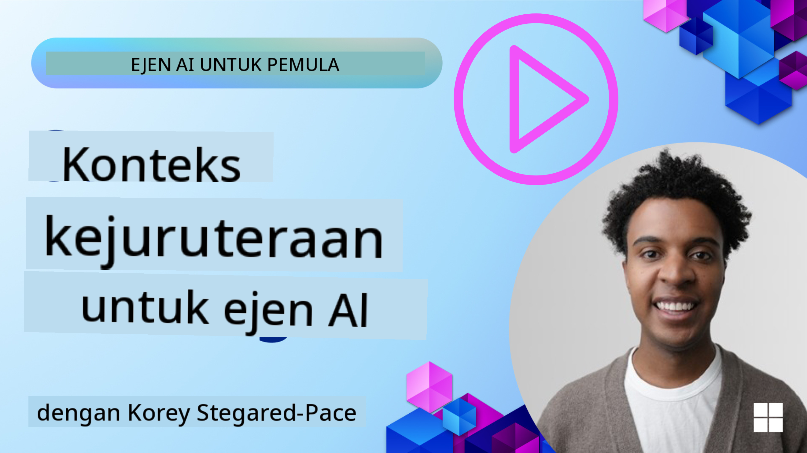
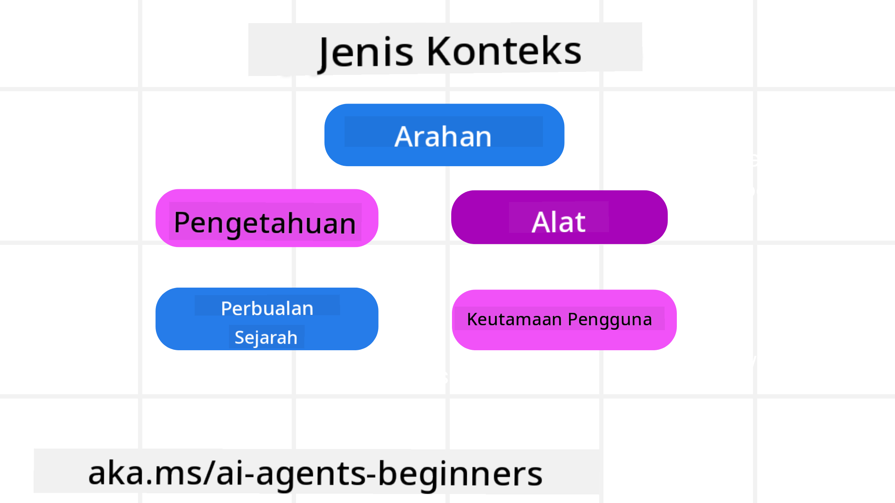
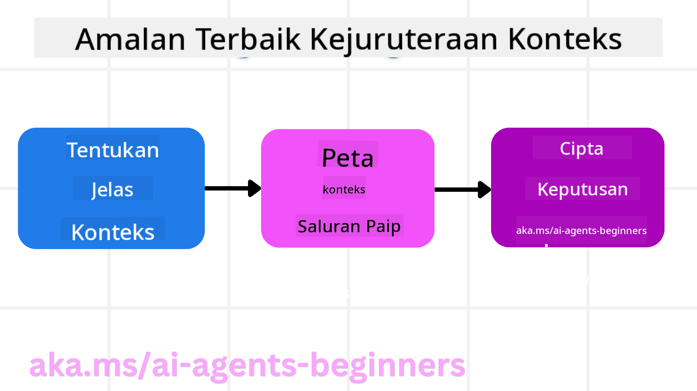

<!--
CO_OP_TRANSLATOR_METADATA:
{
  "original_hash": "cb7e50f471905ce6fdb92a30269a7a98",
  "translation_date": "2025-09-04T10:19:55+00:00",
  "source_file": "12-context-engineering/README.md",
  "language_code": "ms"
}
-->
# Kejuruteraan Konteks untuk Ejen AI

> _(Klik imej di atas untuk menonton video pelajaran ini)_

Memahami kerumitan aplikasi yang anda bina untuk ejen AI adalah penting bagi memastikan ia boleh dipercayai. Kita perlu membina ejen AI yang menguruskan maklumat dengan berkesan untuk memenuhi keperluan kompleks yang melangkaui kejuruteraan arahan.

Dalam pelajaran ini, kita akan melihat apa itu kejuruteraan konteks dan peranannya dalam membina ejen AI.

## Pengenalan

Pelajaran ini akan merangkumi:

• **Apa itu Kejuruteraan Konteks** dan mengapa ia berbeza daripada kejuruteraan arahan.

• **Strategi untuk Kejuruteraan Konteks yang berkesan**, termasuk cara menulis, memilih, memampatkan, dan mengasingkan maklumat.

• **Kegagalan Konteks Biasa** yang boleh mengganggu ejen AI anda dan cara untuk membetulkannya.

## Matlamat Pembelajaran

Selepas menyelesaikan pelajaran ini, anda akan memahami cara untuk:

• **Mendefinisikan kejuruteraan konteks** dan membezakannya daripada kejuruteraan arahan.

• **Mengenal pasti komponen utama konteks** dalam aplikasi Model Bahasa Besar (LLM).

• **Mengaplikasikan strategi untuk menulis, memilih, memampatkan, dan mengasingkan konteks** bagi meningkatkan prestasi ejen.

• **Mengenali kegagalan konteks biasa** seperti pencemaran, gangguan, kekeliruan, dan konflik, serta melaksanakan teknik mitigasi.

## Apa itu Kejuruteraan Konteks?

Bagi ejen AI, konteks adalah apa yang mendorong perancangan ejen AI untuk mengambil tindakan tertentu. Kejuruteraan Konteks adalah amalan memastikan ejen AI mempunyai maklumat yang betul untuk menyelesaikan langkah seterusnya dalam tugas. Tingkap konteks adalah terhad dalam saiz, jadi sebagai pembina ejen, kita perlu membina sistem dan proses untuk menguruskan penambahan, penyingkiran, dan pemadatan maklumat dalam tingkap konteks.

### Kejuruteraan Arahan vs Kejuruteraan Konteks

Kejuruteraan arahan memberi tumpuan kepada satu set arahan statik untuk membimbing ejen AI dengan berkesan menggunakan satu set peraturan. Kejuruteraan konteks adalah cara untuk menguruskan set maklumat dinamik, termasuk arahan awal, bagi memastikan ejen AI mempunyai apa yang diperlukan dari masa ke masa. Idea utama kejuruteraan konteks adalah menjadikan proses ini boleh diulang dan boleh dipercayai.

### Jenis Konteks

Penting untuk diingat bahawa konteks bukan hanya satu perkara. Maklumat yang diperlukan oleh ejen AI boleh datang dari pelbagai sumber, dan terpulang kepada kita untuk memastikan ejen mempunyai akses kepada sumber-sumber ini:

Jenis konteks yang mungkin perlu diuruskan oleh ejen AI termasuk:

• **Arahan:** Ini seperti "peraturan" ejen – arahan, mesej sistem, contoh few-shot (menunjukkan kepada AI cara melakukan sesuatu), dan penerangan tentang alat yang boleh digunakan. Di sinilah fokus kejuruteraan arahan bergabung dengan kejuruteraan konteks.

• **Pengetahuan:** Ini merangkumi fakta, maklumat yang diambil dari pangkalan data, atau memori jangka panjang yang telah dikumpulkan oleh ejen. Ini termasuk integrasi sistem Retrieval Augmented Generation (RAG) jika ejen memerlukan akses kepada pelbagai stor pengetahuan dan pangkalan data.

• **Alat:** Ini adalah definisi fungsi luaran, API, dan pelayan MCP yang boleh dipanggil oleh ejen, bersama dengan maklum balas (hasil) yang diperoleh daripada penggunaannya.

• **Sejarah Perbualan:** Dialog yang berterusan dengan pengguna. Apabila masa berlalu, perbualan ini menjadi lebih panjang dan kompleks, yang bermaksud ia mengambil ruang dalam tingkap konteks.

• **Keutamaan Pengguna:** Maklumat yang dipelajari tentang kesukaan atau ketidaksukaan pengguna dari masa ke masa. Ini boleh disimpan dan dipanggil semasa membuat keputusan penting untuk membantu pengguna.

## Strategi untuk Kejuruteraan Konteks yang Berkesan

### Strategi Perancangan

Kejuruteraan konteks yang baik bermula dengan perancangan yang baik. Berikut adalah pendekatan yang boleh membantu anda mula memikirkan cara untuk mengaplikasikan konsep kejuruteraan konteks:

1. **Tentukan Hasil yang Jelas** - Hasil tugas yang akan diberikan kepada ejen AI harus ditentukan dengan jelas. Jawab soalan - "Bagaimana dunia akan kelihatan apabila ejen AI selesai dengan tugasnya?" Dalam erti kata lain, apakah perubahan, maklumat, atau respons yang sepatutnya dimiliki oleh pengguna selepas berinteraksi dengan ejen AI.

2. **Peta Konteks** - Setelah anda menentukan hasil ejen AI, anda perlu menjawab soalan "Maklumat apa yang diperlukan oleh ejen AI untuk menyelesaikan tugas ini?". Dengan cara ini, anda boleh mula memetakan konteks di mana maklumat itu boleh ditempatkan.

3. **Bina Saluran Konteks** - Setelah anda tahu di mana maklumat itu berada, anda perlu menjawab soalan "Bagaimana ejen akan mendapatkan maklumat ini?". Ini boleh dilakukan dengan pelbagai cara termasuk RAG, penggunaan pelayan MCP dan alat lain.

### Strategi Praktikal

Perancangan adalah penting tetapi apabila maklumat mula mengalir ke dalam tingkap konteks ejen kita, kita perlu mempunyai strategi praktikal untuk menguruskannya:

#### Menguruskan Konteks

Walaupun sesetengah maklumat akan ditambahkan ke tingkap konteks secara automatik, kejuruteraan konteks adalah tentang mengambil peranan yang lebih aktif terhadap maklumat ini yang boleh dilakukan dengan beberapa strategi:

1. **Scratchpad Ejen**  
Ini membolehkan ejen AI mencatat maklumat yang relevan tentang tugas semasa dan interaksi pengguna semasa satu sesi. Ini sepatutnya wujud di luar tingkap konteks dalam fail atau objek runtime yang boleh diambil oleh ejen kemudian semasa sesi ini jika diperlukan.

2. **Memori**  
Scratchpad bagus untuk menguruskan maklumat di luar tingkap konteks satu sesi. Memori membolehkan ejen menyimpan dan mengambil maklumat yang relevan merentasi pelbagai sesi. Ini boleh termasuk ringkasan, keutamaan pengguna dan maklum balas untuk penambahbaikan di masa depan.

3. **Memampatkan Konteks**  
Apabila tingkap konteks berkembang dan menghampiri hadnya, teknik seperti ringkasan dan pemangkasan boleh digunakan. Ini termasuk sama ada menyimpan hanya maklumat yang paling relevan atau menghapuskan mesej yang lebih lama.

4. **Sistem Multi-Ejen**  
Membangunkan sistem multi-ejen adalah satu bentuk kejuruteraan konteks kerana setiap ejen mempunyai tingkap konteksnya sendiri. Bagaimana konteks itu dikongsi dan disampaikan kepada ejen lain adalah satu lagi perkara untuk dirancang semasa membina sistem ini.

5. **Persekitaran Sandbox**  
Jika ejen perlu menjalankan kod atau memproses sejumlah besar maklumat dalam dokumen, ini boleh mengambil sejumlah besar token untuk memproses hasilnya. Daripada menyimpan semua ini dalam tingkap konteks, ejen boleh menggunakan persekitaran sandbox yang mampu menjalankan kod ini dan hanya membaca hasil dan maklumat lain yang relevan.

6. **Objek Keadaan Runtime**  
Ini dilakukan dengan mencipta bekas maklumat untuk menguruskan situasi apabila ejen perlu mempunyai akses kepada maklumat tertentu. Untuk tugas yang kompleks, ini akan membolehkan ejen menyimpan hasil setiap langkah subtugas satu demi satu, membolehkan konteks kekal terhubung hanya kepada subtugas tertentu.

### Contoh Kejuruteraan Konteks

Katakan kita mahu ejen AI **"Tempah saya perjalanan ke Paris."**

• Ejen mudah yang hanya menggunakan kejuruteraan arahan mungkin hanya menjawab: **"Baiklah, bila anda ingin pergi ke Paris?"**. Ia hanya memproses soalan langsung anda pada masa pengguna bertanya.

• Ejen yang menggunakan strategi kejuruteraan konteks yang dibincangkan akan melakukan lebih banyak lagi. Sebelum menjawab, sistemnya mungkin:

  ◦ **Memeriksa kalendar anda** untuk tarikh yang tersedia (mengambil data masa nyata).

 ◦ **Mengingati keutamaan perjalanan lalu** (daripada memori jangka panjang) seperti syarikat penerbangan pilihan anda, bajet, atau sama ada anda lebih suka penerbangan terus.

 ◦ **Mengenal pasti alat yang tersedia** untuk tempahan penerbangan dan hotel.

- Kemudian, contoh respons boleh jadi: "Hai [Nama Anda]! Saya lihat anda bebas pada minggu pertama Oktober. Bolehkah saya mencari penerbangan terus ke Paris dengan [Syarikat Penerbangan Pilihan] dalam bajet biasa anda sebanyak [Bajet]?" Respons yang lebih kaya dan sedar konteks ini menunjukkan kekuatan kejuruteraan konteks.

## Kegagalan Konteks Biasa

### Pencemaran Konteks

**Apa itu:** Apabila halusinasi (maklumat palsu yang dihasilkan oleh LLM) atau kesilapan memasuki konteks dan dirujuk berulang kali, menyebabkan ejen mengejar matlamat yang mustahil atau membangunkan strategi yang tidak masuk akal.

**Apa yang perlu dilakukan:** Laksanakan **pengesahan konteks** dan **kuarantin**. Sahkan maklumat sebelum ia ditambahkan ke memori jangka panjang. Jika pencemaran yang berpotensi dikesan, mulakan benang konteks baru untuk mengelakkan maklumat buruk daripada tersebar.

**Contoh Tempahan Perjalanan:** Ejen anda berhalusinasi tentang **penerbangan terus dari lapangan terbang tempatan kecil ke bandar antarabangsa jauh** yang sebenarnya tidak menawarkan penerbangan antarabangsa. Butiran penerbangan yang tidak wujud ini disimpan ke dalam konteks. Kemudian, apabila anda meminta ejen untuk menempah, ia terus cuba mencari tiket untuk laluan yang mustahil ini, menyebabkan kesilapan berulang.

**Penyelesaian:** Laksanakan langkah yang **mengesahkan kewujudan penerbangan dan laluan dengan API masa nyata** _sebelum_ menambahkan butiran penerbangan ke konteks kerja ejen. Jika pengesahan gagal, maklumat yang salah itu "dikuarantin" dan tidak digunakan lagi.

### Gangguan Konteks

**Apa itu:** Apabila konteks menjadi terlalu besar sehingga model terlalu fokus pada sejarah terkumpul dan bukannya menggunakan apa yang dipelajari semasa latihan, menyebabkan tindakan berulang atau tidak membantu. Model mungkin mula membuat kesilapan walaupun sebelum tingkap konteks penuh.

**Apa yang perlu dilakukan:** Gunakan **ringkasan konteks**. Secara berkala mampatkan maklumat terkumpul ke dalam ringkasan yang lebih pendek, menyimpan butiran penting sambil menghapuskan sejarah yang berlebihan. Ini membantu "menetapkan semula" fokus.

**Contoh Tempahan Perjalanan:** Anda telah membincangkan pelbagai destinasi impian untuk masa yang lama, termasuk perincian tentang perjalanan backpacking anda dua tahun lalu. Apabila anda akhirnya meminta **"cari saya penerbangan murah untuk bulan depan,"** ejen terperangkap dalam butiran lama yang tidak relevan dan terus bertanya tentang peralatan backpacking atau jadual perjalanan lalu anda, mengabaikan permintaan semasa anda.

**Penyelesaian:** Selepas beberapa giliran atau apabila konteks menjadi terlalu besar, ejen harus **meringkaskan bahagian perbualan yang paling baru dan relevan** – memberi tumpuan kepada tarikh perjalanan dan destinasi semasa anda – dan menggunakan ringkasan yang dipadatkan itu untuk panggilan LLM seterusnya, membuang sejarah perbualan yang kurang relevan.

### Kekeliruan Konteks

**Apa itu:** Apabila konteks yang tidak perlu, sering dalam bentuk terlalu banyak alat yang tersedia, menyebabkan model menghasilkan respons yang buruk atau memanggil alat yang tidak relevan. Model yang lebih kecil terutamanya terdedah kepada ini.

**Apa yang perlu dilakukan:** Laksanakan **pengurusan alat** menggunakan teknik RAG. Simpan penerangan alat dalam pangkalan data vektor dan pilih _hanya_ alat yang paling relevan untuk setiap tugas tertentu. Penyelidikan menunjukkan mengehadkan pilihan alat kepada kurang daripada 30.

**Contoh Tempahan Perjalanan:** Ejen anda mempunyai akses kepada berpuluh-puluh alat: `book_flight`, `book_hotel`, `rent_car`, `find_tours`, `currency_converter`, `weather_forecast`, `restaurant_reservations`, dll. Anda bertanya, **"Apa cara terbaik untuk bergerak di sekitar Paris?"** Disebabkan oleh jumlah alat yang banyak, ejen menjadi keliru dan cuba memanggil `book_flight` _dalam_ Paris, atau `rent_car` walaupun anda lebih suka pengangkutan awam, kerana penerangan alat mungkin bertindih atau ia tidak dapat mengenal pasti yang terbaik.

**Penyelesaian:** Gunakan **RAG ke atas penerangan alat**. Apabila anda bertanya tentang bergerak di sekitar Paris, sistem secara dinamik mengambil _hanya_ alat yang paling relevan seperti `rent_car` atau `public_transport_info` berdasarkan pertanyaan anda, menyajikan "muatan" alat yang fokus kepada LLM.

### Konflik Konteks

**Apa itu:** Apabila maklumat yang bercanggah wujud dalam konteks, menyebabkan penaakulan yang tidak konsisten atau respons akhir yang buruk. Ini sering berlaku apabila maklumat tiba secara berperingkat, dan andaian awal yang salah kekal dalam konteks.

**Apa yang perlu dilakukan:** Gunakan **pemangkasan konteks** dan **pemindahan**. Pemangkasan bermaksud menghapuskan maklumat yang lapuk atau bercanggah apabila butiran baru tiba. Pemindahan memberikan model ruang kerja "scratchpad" yang berasingan untuk memproses maklumat tanpa mengacaukan konteks utama.

**Contoh Tempahan Perjalanan:** Anda pada mulanya memberitahu ejen anda, **"Saya mahu terbang kelas ekonomi."** Kemudian dalam perbualan, anda mengubah fikiran dan berkata, **"Sebenarnya, untuk perjalanan ini, mari pergi kelas perniagaan."** Jika kedua-dua arahan kekal dalam konteks, ejen mungkin menerima hasil carian yang bercanggah atau menjadi keliru tentang keutamaan mana yang harus diutamakan.

**Penyelesaian:** Laksanakan **pemangkasan konteks**. Apabila arahan baru bercanggah dengan yang lama, arahan yang lebih lama dihapuskan atau secara eksplisit digantikan dalam konteks. Sebagai alternatif, ejen boleh menggunakan **scratchpad** untuk menyelesaikan keutamaan yang bercanggah sebelum membuat keputusan, memastikan hanya arahan akhir yang konsisten membimbing tindakannya.

## Ada Lagi Soalan Tentang Kejuruteraan Konteks?

Sertai [Azure AI Foundry Discord](https://aka.ms/ai-agents/discord) untuk bertemu dengan pelajar lain, menghadiri waktu pejabat, dan mendapatkan jawapan kepada soalan ejen AI anda.

---

**Penafian**:  
Dokumen ini telah diterjemahkan menggunakan perkhidmatan terjemahan AI [Co-op Translator](https://github.com/Azure/co-op-translator). Walaupun kami berusaha untuk memastikan ketepatan, sila ambil perhatian bahawa terjemahan automatik mungkin mengandungi kesilapan atau ketidaktepatan. Dokumen asal dalam bahasa asalnya harus dianggap sebagai sumber yang berwibawa. Untuk maklumat yang kritikal, terjemahan manusia profesional adalah disyorkan. Kami tidak bertanggungjawab atas sebarang salah faham atau salah tafsir yang timbul daripada penggunaan terjemahan ini.