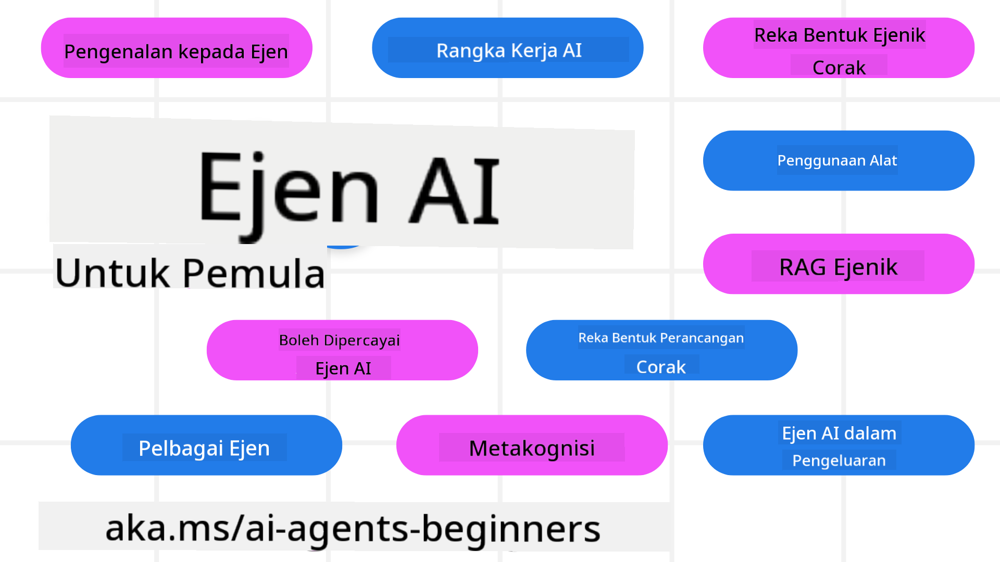

<!--
CO_OP_TRANSLATOR_METADATA:
{
  "original_hash": "6b07046397366e6f6f4524c9ddeba1e1",
  "translation_date": "2025-07-12T14:56:45+00:00",
  "source_file": "README.md",
  "language_code": "ms"
}
-->
# Ejen AI untuk Pemula - Kursus

## 11 Pelajaran yang mengajar segala yang anda perlu tahu untuk mula membina Ejen AI

  
  
  
  

### 🌐 Sokongan Pelbagai Bahasa

#### Disokong melalui GitHub Action (Automatik & Sentiasa Dikemas Kini)

[French](../fr/README.md) | [Spanish](../es/README.md) | [German](../de/README.md) | [Russian](../ru/README.md) | [Arabic](../ar/README.md) | [Persian (Farsi)](../fa/README.md) | [Urdu](../ur/README.md) | [Chinese (Simplified)](../zh/README.md) | [Chinese (Traditional, Macau)](../mo/README.md) | [Chinese (Traditional, Hong Kong)](../hk/README.md) | [Chinese (Traditional, Taiwan)](../tw/README.md) | [Japanese](../ja/README.md) | [Korean](../ko/README.md) | [Hindi](../hi/README.md) | [Bengali](../bn/README.md) | [Marathi](../mr/README.md) | [Nepali](../ne/README.md) | [Punjabi (Gurmukhi)](../pa/README.md) | [Portuguese (Portugal)](../pt/README.md) | [Portuguese (Brazil)](../br/README.md) | [Italian](../it/README.md) | [Polish](../pl/README.md) | [Turkish](../tr/README.md) | [Greek](../el/README.md) | [Thai](../th/README.md) | [Swedish](../sv/README.md) | [Danish](../da/README.md) | [Norwegian](../no/README.md) | [Finnish](../fi/README.md) | [Dutch](../nl/README.md) | [Hebrew](../he/README.md) | [Vietnamese](../vi/README.md) | [Indonesian](../id/README.md) | [Malay](./README.md) | [Tagalog (Filipino)](../tl/README.md) | [Swahili](../sw/README.md) | [Hungarian](../hu/README.md) | [Czech](../cs/README.md) | [Slovak](../sk/README.md) | [Romanian](../ro/README.md) | [Bulgarian](../bg/README.md) | [Serbian (Cyrillic)](../sr/README.md) | [Croatian](../hr/README.md) | [Slovenian](../sl/README.md) | [Ukrainian](../uk/README.md) | [Burmese (Myanmar)](../my/README.md)

**Jika anda ingin bahasa terjemahan tambahan, senarai bahasa yang disokong boleh didapati [di sini](https://github.com/Azure/co-op-translator/blob/main/getting_started/supported-languages.md)**

  
  

## 🌱 Mula Bermula

Kursus ini mempunyai 11 pelajaran yang merangkumi asas-asas membina Ejen AI. Setiap pelajaran membincangkan topik tersendiri jadi mulakan di mana sahaja yang anda suka!

Terdapat sokongan pelbagai bahasa untuk kursus ini. Lawati [bahasa yang tersedia di sini](../..).

Jika ini kali pertama anda membina dengan model Generative AI, lihat kursus kami [Generative AI For Beginners](https://aka.ms/genai-beginners) yang merangkumi 21 pelajaran tentang membina dengan GenAI.

Jangan lupa untuk [berikan bintang (🌟) pada repo ini](https://docs.github.com/en/get-started/exploring-projects-on-github/saving-repositories-with-stars?WT.mc_id=academic-105485-koreyst) dan [fork repo ini](https://github.com/microsoft/ai-agents-for-beginners/fork) untuk menjalankan kod.

### Apa Yang Anda Perlukan

Setiap pelajaran dalam kursus ini termasuk contoh kod, yang boleh didapati dalam folder code_samples. Anda boleh [fork repo ini](https://github.com/microsoft/ai-agents-for-beginners/fork) untuk membuat salinan anda sendiri.

Contoh kod dalam latihan ini menggunakan Azure AI Foundry dan GitHub Model Catalogs untuk berinteraksi dengan Model Bahasa:

- [Github Models](https://aka.ms/ai-agents-beginners/github-models) - Percuma / Terhad  
- [Azure AI Foundry](https://aka.ms/ai-agents-beginners/ai-foundry) - Memerlukan Akaun Azure

Kursus ini juga menggunakan rangka kerja dan perkhidmatan Ejen AI berikut dari Microsoft:

- [Azure AI Agent Service](https://aka.ms/ai-agents-beginners/ai-agent-service)  
- [Semantic Kernel](https://aka.ms/ai-agents-beginners/semantic-kernel)  
- [AutoGen](https://aka.ms/ai-agents/autogen)

Untuk maklumat lanjut tentang menjalankan kod untuk kursus ini, lawati [Persediaan Kursus](./00-course-setup/README.md).

## 🙏 Mahu membantu?

Adakah anda mempunyai cadangan atau menemui kesalahan ejaan atau kod? [Buat isu](https://github.com/microsoft/ai-agents-for-beginners/issues?WT.mc_id=academic-105485-koreyst) atau [Buat permintaan tarik](https://github.com/microsoft/ai-agents-for-beginners/pulls?WT.mc_id=academic-105485-koreyst)

Jika anda tersekat atau mempunyai sebarang soalan tentang membina Ejen AI, sertai [Azure AI Foundry Community Discord](https://discord.gg/kzRShWzttr)

Jika anda mempunyai maklum balas produk atau menemui ralat semasa membina, lawati [Azure AI Foundry Developer Forum](https://aka.ms/azureaifoundry/forum)

## 📂 Setiap pelajaran termasuk

- Pelajaran bertulis yang terletak dalam README dan video pendek  
- Contoh kod Python yang menyokong Azure AI Foundry dan Github Models (Percuma)  
- Pautan ke sumber tambahan untuk meneruskan pembelajaran anda  

## 🗃️ Pelajaran

| **Pelajaran**                             | **Teks & Kod**                                      | **Video**                                                  | **Pembelajaran Tambahan**                                                              |
|------------------------------------------|----------------------------------------------------|------------------------------------------------------------|----------------------------------------------------------------------------------------|
| Pengenalan kepada Ejen AI dan Kes Penggunaan Ejen | [Pautan](./01-intro-to-ai-agents/README.md)          | [Video](https://youtu.be/3zgm60bXmQk?si=z8QygFvYQv-9WtO1)  | [Pautan](https://aka.ms/ai-agents-beginners/collection?WT.mc_id=academic-105485-koreyst) |
| Meneroka Rangka Kerja Agentic             | [Pautan](./02-explore-agentic-frameworks/README.md)  | [Video](https://youtu.be/ODwF-EZo_O8?si=Vawth4hzVaHv-u0H)  | [Pautan](https://aka.ms/ai-agents-beginners/collection?WT.mc_id=academic-105485-koreyst) |
| Memahami Corak Reka Bentuk Agentic        | [Pautan](./03-agentic-design-patterns/README.md)     | [Video](https://youtu.be/m9lM8qqoOEA?si=BIzHwzstTPL8o9GF)  | [Pautan](https://aka.ms/ai-agents-beginners/collection?WT.mc_id=academic-105485-koreyst) |
| Corak Reka Bentuk Penggunaan Alat         | [Pautan](./04-tool-use/README.md)                    | [Video](https://youtu.be/vieRiPRx-gI?si=2z6O2Xu2cu_Jz46N)  | [Pautan](https://aka.ms/ai-agents-beginners/collection?WT.mc_id=academic-105485-koreyst) |
| Agentic RAG                              | [Pautan](./05-agentic-rag/README.md)                 | [Video](https://youtu.be/WcjAARvdL7I?si=gKPWsQpKiIlDH9A3)  | [Pautan](https://aka.ms/ai-agents-beginners/collection?WT.mc_id=academic-105485-koreyst) |
| Membina Ejen AI yang Boleh Dipercayai     | [Pautan](./06-building-trustworthy-agents/README.md) | [Video](https://youtu.be/iZKkMEGBCUQ?si=jZjpiMnGFOE9L8OK ) | [Pautan](https://aka.ms/ai-agents-beginners/collection?WT.mc_id=academic-105485-koreyst) |
| Corak Reka Bentuk Perancangan              | [Pautan](./07-planning-design/README.md)             | [Video](https://youtu.be/kPfJ2BrBCMY?si=6SC_iv_E5-mzucnC)  | [Pautan](https://aka.ms/ai-agents-beginners/collection?WT.mc_id=academic-105485-koreyst) |
| Corak Reka Bentuk Multi-Ejen                | [Pautan](./08-multi-agent/README.md)                 | [Video](https://youtu.be/V6HpE9hZEx0?si=rMgDhEu7wXo2uo6g)  | [Pautan](https://aka.ms/ai-agents-beginners/collection?WT.mc_id=academic-105485-koreyst) |
| Corak Reka Bentuk Metakognisi               | [Pautan](./09-metacognition/README.md)               | [Video](https://youtu.be/His9R6gw6Ec?si=8gck6vvdSNCt6OcF)  | [Pautan](https://aka.ms/ai-agents-beginners/collection?WT.mc_id=academic-105485-koreyst) |
| Ejen AI dalam Pengeluaran                   | [Pautan](./10-ai-agents-production/README.md)        | [Video](https://youtu.be/l4TP6IyJxmQ?si=31dnhexRo6yLRJDl)  | [Pautan](https://aka.ms/ai-agents-beginners/collection?WT.mc_id=academic-105485-koreyst) |
| Ejen AI dengan MCP                          | [Pautan](./11-mcp/README.md)                         |                                                            | [Pautan](https://aka.ms/mcp-for-beginners)                                               |

## 🎒 Kursus Lain

Pasukan kami menghasilkan kursus lain! Lihat:
- [**BARU** Protokol Konteks Model (MCP) Untuk Pemula](https://github.com/microsoft/mcp-for-beginners?WT.mc_id=academic-105485-koreyst)
- [AI Generatif untuk Pemula menggunakan .NET](https://github.com/microsoft/Generative-AI-for-beginners-dotnet?WT.mc_id=academic-105485-koreyst)
- [AI Generatif untuk Pemula](https://github.com/microsoft/generative-ai-for-beginners?WT.mc_id=academic-105485-koreyst)
- [ML untuk Pemula](https://aka.ms/ml-beginners?WT.mc_id=academic-105485-koreyst)
- [Sains Data untuk Pemula](https://aka.ms/datascience-beginners?WT.mc_id=academic-105485-koreyst)
- [AI untuk Pemula](https://aka.ms/ai-beginners?WT.mc_id=academic-105485-koreyst)
- [Keselamatan Siber untuk Pemula](https://github.com/microsoft/Security-101??WT.mc_id=academic-96948-sayoung)
- [Pembangunan Web untuk Pemula](https://aka.ms/webdev-beginners?WT.mc_id=academic-105485-koreyst)
- [IoT untuk Pemula](https://aka.ms/iot-beginners?WT.mc_id=academic-105485-koreyst)
- [Pembangunan XR untuk Pemula](https://github.com/microsoft/xr-development-for-beginners?WT.mc_id=academic-105485-koreyst)
- [Menguasai GitHub Copilot untuk Pengaturcaraan Berpasangan AI](https://aka.ms/GitHubCopilotAI?WT.mc_id=academic-105485-koreyst)
- [Menguasai GitHub Copilot untuk Pembangun C#/.NET](https://github.com/microsoft/mastering-github-copilot-for-dotnet-csharp-developers?WT.mc_id=academic-105485-koreyst)
- [Pilih Pengembaraan Copilot Anda Sendiri](https://github.com/microsoft/CopilotAdventures?WT.mc_id=academic-105485-koreyst)

## 🌟 Terima Kasih Komuniti

Terima kasih kepada [Shivam Goyal](https://www.linkedin.com/in/shivam2003/) kerana menyumbang contoh kod penting yang menunjukkan Agentic RAG.

## Menyumbang

Projek ini mengalu-alukan sumbangan dan cadangan. Kebanyakan sumbangan memerlukan anda bersetuju dengan
Perjanjian Lesen Penyumbang (CLA) yang menyatakan bahawa anda mempunyai hak, dan benar-benar memberi kami
hak untuk menggunakan sumbangan anda. Untuk maklumat lanjut, lawati
<https://cla.opensource.microsoft.com>.

Apabila anda menghantar permintaan tarik, bot CLA akan secara automatik menentukan sama ada anda perlu menyediakan
CLA dan menghias PR dengan sewajarnya (contohnya, pemeriksaan status, komen). Ikuti sahaja arahan
yang diberikan oleh bot. Anda hanya perlu melakukan ini sekali sahaja untuk semua repositori yang menggunakan CLA kami.

Projek ini telah mengamalkan [Kod Etika Sumber Terbuka Microsoft](https://opensource.microsoft.com/codeofconduct/).
Untuk maklumat lanjut, lihat [Soalan Lazim Kod Etika](https://opensource.microsoft.com/codeofconduct/faq/) atau
hubungi [opencode@microsoft.com](mailto:opencode@microsoft.com) untuk sebarang soalan atau komen tambahan.

## Tanda Dagangan

Projek ini mungkin mengandungi tanda dagangan atau logo untuk projek, produk, atau perkhidmatan. Penggunaan sah tanda dagangan atau logo Microsoft tertakluk kepada dan mesti mematuhi
[Garisan Panduan Tanda Dagangan & Jenama Microsoft](https://www.microsoft.com/legal/intellectualproperty/trademarks/usage/general).
Penggunaan tanda dagangan atau logo Microsoft dalam versi projek yang diubah suai tidak boleh menyebabkan kekeliruan atau memberi gambaran bahawa Microsoft menaja.
Sebarang penggunaan tanda dagangan atau logo pihak ketiga tertakluk kepada polisi pihak ketiga tersebut.

**Penafian**:  
Dokumen ini telah diterjemahkan menggunakan perkhidmatan terjemahan AI [Co-op Translator](https://github.com/Azure/co-op-translator). Walaupun kami berusaha untuk ketepatan, sila ambil maklum bahawa terjemahan automatik mungkin mengandungi kesilapan atau ketidaktepatan. Dokumen asal dalam bahasa asalnya harus dianggap sebagai sumber yang sahih. Untuk maklumat penting, terjemahan profesional oleh manusia adalah disyorkan. Kami tidak bertanggungjawab atas sebarang salah faham atau salah tafsir yang timbul daripada penggunaan terjemahan ini.