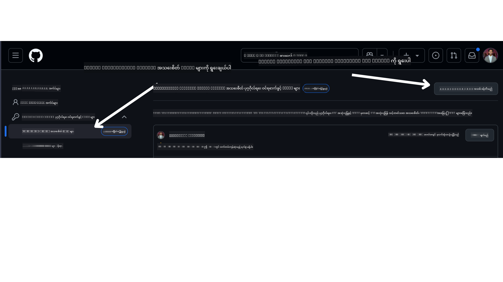

<!--
CO_OP_TRANSLATOR_METADATA:
{
  "original_hash": "76945069b52a49cd0432ae3e0b0ba22e",
  "translation_date": "2025-07-12T07:59:05+00:00",
  "source_file": "00-course-setup/README.md",
  "language_code": "my"
}
-->
သင်၏ GitHub အကောင့်တွင်ရှိသော သင်၏ ကိုယ်ပိုင် fork လုပ်ထားသော ဤသင်တန်း၏ ဗားရှင်းကို အောက်ပါလင့်ခ်တွင် ရရှိထားပြီဖြစ်သည်။


## ကုဒ်များကို လည်ပတ်ခြင်း

ဤသင်တန်းတွင် Jupyter Notebooks များစွာ ပါဝင်ပြီး၊ AI Agent များ တည်ဆောက်ရာတွင် လက်တွေ့ကျကျ လေ့လာနိုင်ရန် အတွက် အသုံးပြုနိုင်ပါသည်။

ကုဒ်နမူနာများသည် အောက်ပါအတိုင်း အသုံးပြုသည် -

**GitHub အကောင့် လိုအပ်သည် - အခမဲ့**:

1) Semantic Kernel Agent Framework + GitHub Models Marketplace။ (semantic-kernel.ipynb) ဟု အမည်ပေးထားသည်။
2) AutoGen Framework + GitHub Models Marketplace။ (autogen.ipynb) ဟု အမည်ပေးထားသည်။

**Azure Subscription လိုအပ်သည်**:
3) Azure AI Foundry + Azure AI Agent Service။ (azureaiagent.ipynb) ဟု အမည်ပေးထားသည်။

သင်အကြံပြုလိုသည်မှာ ဤနမူနာသုံးမျိုးအားလုံးကို စမ်းသပ်ကြည့်ပြီး သင့်အတွက် အကောင်းဆုံးဖြစ်သော နည်းလမ်းကို ရွေးချယ်ရန် ဖြစ်သည်။

သင်ရွေးချယ်သည့် နည်းလမ်းအပေါ် မူတည်၍ အောက်ပါ စတင်ဆောင်ရွက်ရန် အဆင့်များကို လိုက်နာရမည်ဖြစ်သည်။

## လိုအပ်ချက်များ

- Python 3.12+
  - **NOTE**: Python3.12 မရှိသေးပါက ထည့်သွင်းပါ။ ထို့နောက် python3.12 ဖြင့် venv ကို ဖန်တီး၍ requirements.txt ဖိုင်မှ လိုအပ်သော ဗားရှင်းများကို တိကျစွာ ထည့်သွင်းနိုင်ပါစေ။
- GitHub အကောင့် - GitHub Models Marketplace သို့ ဝင်ရောက်ရန်
- Azure Subscription - Azure AI Foundry သို့ ဝင်ရောက်ရန်
- Azure AI Foundry အကောင့် - Azure AI Agent Service သို့ ဝင်ရောက်ရန်

ဤ repository ၏ root တွင် `requirements.txt` ဖိုင်ပါဝင်ပြီး ကုဒ်နမူနာများ လည်ပတ်ရန် လိုအပ်သော Python package များအားလုံး ပါဝင်သည်။

repository ၏ root တွင် terminal ဖြင့် အောက်ပါ command ကို အသုံးပြု၍ ထည့်သွင်းနိုင်ပါသည်။

```bash
pip install -r requirements.txt
```

ပြဿနာများနှင့် မတည့်မှုများ ရှောင်ရှားရန် Python virtual environment တစ်ခု ဖန်တီးရန် အကြံပြုပါသည်။

## VSCode ကို စတင်ပြင်ဆင်ခြင်း

VSCode တွင် သင့်အသုံးပြုမည့် Python ဗားရှင်းမှန်ကန်ကြောင်း သေချာစေပါ။


## GitHub Models အသုံးပြု၍ နမူနာများ ပြင်ဆင်ခြင်း

### အဆင့် ၁: GitHub Personal Access Token (PAT) ရယူခြင်း

ယခုသင်တန်းတွင် GitHub Models Marketplace ကို အသုံးပြု၍ AI Agent များ ဖန်တီးရာတွင် အသုံးပြုမည့် Large Language Models (LLMs) များ အခမဲ့ ဝင်ရောက်အသုံးပြုနိုင်ပါသည်။

ဤဝန်ဆောင်မှုကို အသုံးပြုရန် GitHub Personal Access Token တစ်ခု ဖန်တီးရမည်ဖြစ်သည်။

GitHub အကောင့်တွင် သွား၍

`Fine-grained tokens` ကို မျက်နှာပြင် ဘယ်ဘက်တွင် ရွေးချယ်ပါ။

ထို့နောက် `Generate new token` ကို ရွေးချယ်ပါ။



Token အမည်၊ သက်တမ်းကုန်ဆုံးရက် (အကြံပြုချက် - ၃၀ ရက်) နှင့် token ၏ scopes (Public Repositories) များကို ထည့်သွင်းရန် တောင်းဆိုပါမည်။

ထို့အပြင် token ၏ ခွင့်ပြုချက်များကို ပြင်ဆင်ရန် လိုအပ်သည်။ Permissions -> Models -> GitHub Models သို့ ဝင်ရောက်ခွင့် ပေးပါ။

သင်ဖန်တီးထားသော token ကို ကူးယူပါ။ ဤ token ကို သင်တန်းတွင် ပါဝင်သော `.env` ဖိုင်တွင် ထည့်သွင်းရမည်ဖြစ်သည်။

### အဆင့် ၂: `.env` ဖိုင် ဖန်တီးခြင်း

Terminal တွင် အောက်ပါ command ကို အသုံးပြု၍ `.env` ဖိုင်ကို ဖန်တီးပါ။

```bash
cp .env.example .env
```

ဤ command သည် နမူနာဖိုင်ကို ကူးယူပြီး သင့် directory တွင် `.env` ဖိုင်ကို ဖန်တီးပေးမည်ဖြစ်ပြီး environment variable များအတွက် တန်ဖိုးများကို ဖြည့်စွက်နိုင်ပါသည်။

Token ကို ကူးယူပြီး `.env` ဖိုင်ကို သင်နှစ်သက်ရာ စာတည်းရေးဆော့ဖ်ဝဲဖြင့် ဖွင့်ကာ `GITHUB_TOKEN` အကွက်တွင် ထည့်သွင်းပါ။

ယခု သင်တန်း၏ ကုဒ်နမူနာများကို လည်ပတ်နိုင်ပါပြီ။

## Azure AI Foundry နှင့် Azure AI Agent Service အသုံးပြု၍ နမူနာများ ပြင်ဆင်ခြင်း

### အဆင့် ၁: Azure Project Endpoint ရယူခြင်း

Azure AI Foundry တွင် hub နှင့် project တည်ဆောက်ခြင်းဆိုင်ရာ လမ်းညွှန်ချက်များကို ဒီနေရာတွင် ကြည့်ရှုနိုင်ပါသည် - [Hub resources overview](https://learn.microsoft.com/en-us/azure/ai-foundry/concepts/ai-resources)

Project ဖန်တီးပြီးပါက project ၏ connection string ကို ရယူရမည်ဖြစ်သည်။

Azure AI Foundry portal တွင် သင့် project ၏ **Overview** စာမျက်နှာသို့ သွားပါ။


### အဆင့် ၂: `.env` ဖိုင် ဖန်တီးခြင်း

Terminal တွင် အောက်ပါ command ကို အသုံးပြု၍ `.env` ဖိုင်ကို ဖန်တီးပါ။

```bash
cp .env.example .env
```

နမူနာဖိုင်ကို ကူးယူပြီး သင့် directory တွင် `.env` ဖိုင်ကို ဖန်တီးပေးမည်ဖြစ်ပြီး environment variable များအတွက် တန်ဖိုးများကို ဖြည့်စွက်နိုင်ပါသည်။

Token ကို ကူးယူပြီး `.env` ဖိုင်ကို သင်နှစ်သက်ရာ စာတည်းရေးဆော့ဖ်ဝဲဖြင့် ဖွင့်ကာ `PROJECT_ENDPOINT` အကွက်တွင် ထည့်သွင်းပါ။

### အဆင့် ၃: Azure သို့ လက်မှတ်ထိုးဝင်ရောက်ခြင်း

လုံခြုံရေးအတွက် [keyless authentication](https://learn.microsoft.com/azure/developer/ai/keyless-connections?tabs=csharp%2Cazure-cli?WT.mc_id=academic-105485-koreyst) ကို အသုံးပြုကာ Microsoft Entra ID ဖြင့် Azure OpenAI သို့ လက်မှတ်ထိုးဝင်မည်ဖြစ်သည်။ ၎င်းကို အသုံးပြုရန် မတိုင်မီ သင့် OS အတွက် **Azure CLI** ကို [installation instructions](https://learn.microsoft.com/cli/azure/install-azure-cli?WT.mc_id=academic-105485-koreyst) အတိုင်း ထည့်သွင်းရမည်ဖြစ်သည်။

ထို့နောက် terminal ကို ဖွင့်ကာ `az login --use-device-code` ကို ရိုက်ထည့်၍ Azure အကောင့်သို့ လက်မှတ်ထိုးဝင်ပါ။

ဝင်ရောက်ပြီးပါက terminal တွင် သင့် subscription ကို ရွေးချယ်ပါ။

## Azure Search နှင့် Azure OpenAI အသုံးပြုသော အပိုဆောင်း Environment Variables

Agentic RAG သင်ခန်းစာ - သင်ခန်းစာ ၅ တွင် Azure Search နှင့် Azure OpenAI ကို အသုံးပြုသည့် နမူနာများ ပါဝင်သည်။

ဤနမူနာများကို လည်ပတ်လိုပါက `.env` ဖိုင်တွင် အောက်ပါ environment variables များ ထည့်သွင်းရမည်ဖြစ်သည်။

### Overview စာမျက်နှာ (Project)

- `AZURE_SUBSCRIPTION_ID` - Project ၏ **Overview** စာမျက်နှာတွင် **Project details** တွင် စစ်ဆေးပါ။
- `AZURE_AI_PROJECT_NAME` - Project ၏ **Overview** စာမျက်နှာ အပေါ်ဆုံးတွင် ကြည့်ရှုနိုင်သည်။
- `AZURE_OPENAI_SERVICE` - **Overview** စာမျက်နှာတွင် **Included capabilities** tab အောက်ရှိ **Azure OpenAI Service** တွင် ရှာဖွေပါ။

### Management Center

- `AZURE_OPENAI_RESOURCE_GROUP` - **Management Center** ၏ **Overview** စာမျက်နှာတွင် **Project properties** တွင် ရှာဖွေပါ။
- `GLOBAL_LLM_SERVICE` - **Connected resources** အောက်တွင် **Azure AI Services** ချိတ်ဆက်မှုအမည်ကို ရှာဖွေပါ။ မတွေ့ပါက Azure portal တွင် သင့် resource group အောက်ရှိ AI Services resource အမည်ကို စစ်ဆေးပါ။

### Models + Endpoints စာမျက်နှာ

- `AZURE_OPENAI_EMBEDDING_DEPLOYMENT_NAME` - embedding model (ဥပမာ - `text-embedding-ada-002`) ကို ရွေးချယ်ပြီး model အသေးစိတ်မှ **Deployment name** ကို မှတ်သားပါ။
- `AZURE_OPENAI_CHAT_DEPLOYMENT_NAME` - chat model (ဥပမာ - `gpt-4o-mini`) ကို ရွေးချယ်ပြီး model အသေးစိတ်မှ **Deployment name** ကို မှတ်သားပါ။

### Azure Portal

- `AZURE_OPENAI_ENDPOINT` - **Azure AI services** ကို ရှာဖွေပြီး နှိပ်ပါ၊ ထို့နောက် **Resource Management**, **Keys and Endpoint** သို့ သွားပါ၊ "Azure OpenAI endpoints" အောက်မှ "Language APIs" ဟု ဆိုသော endpoint ကို ကူးယူပါ။
- `AZURE_OPENAI_API_KEY` - အဆိုပါ စာမျက်နှာမှ KEY 1 သို့ KEY 2 ကို ကူးယူပါ။
- `AZURE_SEARCH_SERVICE_ENDPOINT` - သင့် **Azure AI Search** resource ကို ရှာဖွေပြီး နှိပ်ပါ၊ **Overview** ကို ကြည့်ပါ။
- `AZURE_SEARCH_API_KEY` - ထို့နောက် **Settings** > **Keys** သို့ သွား၍ primary သို့ secondary admin key ကို ကူးယူပါ။

### အပြင်ဘက် ဝက်ဘ်စာမျက်နှာ

- `AZURE_OPENAI_API_VERSION` - [API version lifecycle](https://learn.microsoft.com/en-us/azure/ai-services/openai/api-version-deprecation#latest-ga-api-release) စာမျက်နှာတွင် **Latest GA API release** အောက်မှ ကြည့်ရှုနိုင်ပါသည်။

### keyless authentication ကို စတင်ပြင်ဆင်ခြင်း

သင့်လက်မှတ်များကို hardcode မလုပ်ဘဲ Azure OpenAI နှင့် keyless connection ကို အသုံးပြုမည်ဖြစ်သည်။ ၎င်းအတွက် `DefaultAzureCredential` ကို import ပြုလုပ်ပြီး နောက်ပိုင်း `DefaultAzureCredential` function ကို ခေါ်ယူကာ လက်မှတ်ရယူပါမည်။

```python
from azure.identity import DefaultAzureCredential, InteractiveBrowserCredential
```

## ပြဿနာတက်နေပါသလား?

ဤ setup ကို လည်ပတ်ရာတွင် ပြဿနာများရှိပါက ကျွန်ုပ်တို့၏

or

## နောက်တစ်ခန်း

ယခု သင်တန်း၏ ကုဒ်များကို လည်ပတ်ရန် အသင့်ဖြစ်ပြီ ဖြစ်သည်။ AI Agent များ၏ ကမ္ဘာကြီးအကြောင်း ပိုမိုလေ့လာရန် ပျော်ရွှင်စွာ သင်ယူပါ။

[Introduction to AI Agents and Agent Use Cases](../01-intro-to-ai-agents/README.md)

**အကြောင်းကြားချက်**  
ဤစာတမ်းကို AI ဘာသာပြန်ဝန်ဆောင်မှု [Co-op Translator](https://github.com/Azure/co-op-translator) ဖြင့် ဘာသာပြန်ထားပါသည်။ ကျွန်ုပ်တို့သည် တိကျမှန်ကန်မှုအတွက် ကြိုးစားသော်လည်း၊ အလိုအလျောက် ဘာသာပြန်ခြင်းတွင် အမှားများ သို့မဟုတ် မှားယွင်းမှုများ ပါဝင်နိုင်ကြောင်း သတိပြုပါရန် မေတ္တာရပ်ခံအပ်ပါသည်။ မူရင်းစာတမ်းကို မူလဘာသာဖြင့်သာ တရားဝင်အချက်အလက်အဖြစ် ယူဆသင့်ပါသည်။ အရေးကြီးသော အချက်အလက်များအတွက် လူ့ဘာသာပြန်ပညာရှင်မှ ဘာသာပြန်ခြင်းကို အကြံပြုပါသည်။ ဤဘာသာပြန်ချက်ကို အသုံးပြုရာမှ ဖြစ်ပေါ်လာနိုင်သည့် နားလည်မှုမှားယွင်းမှုများအတွက် ကျွန်ုပ်တို့ တာဝန်မယူပါ။