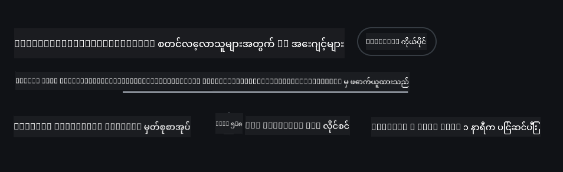
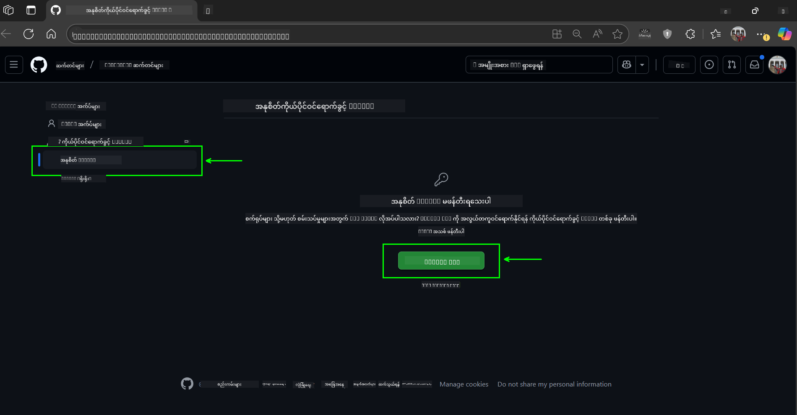
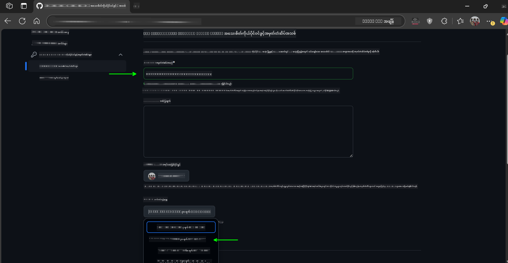
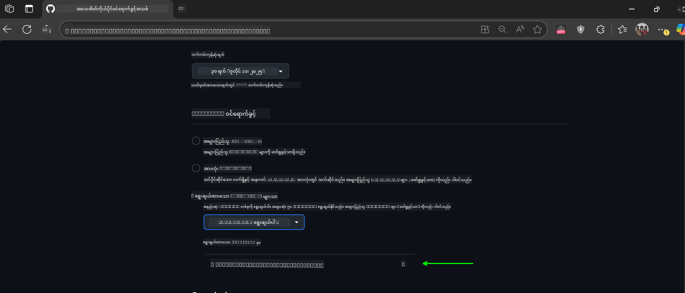
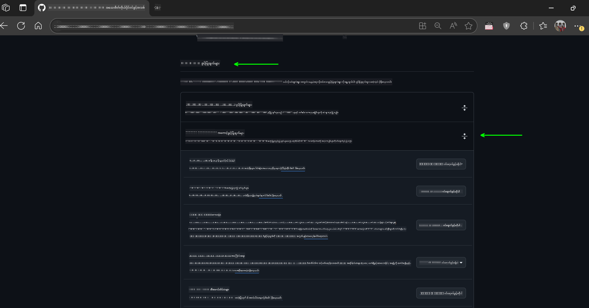
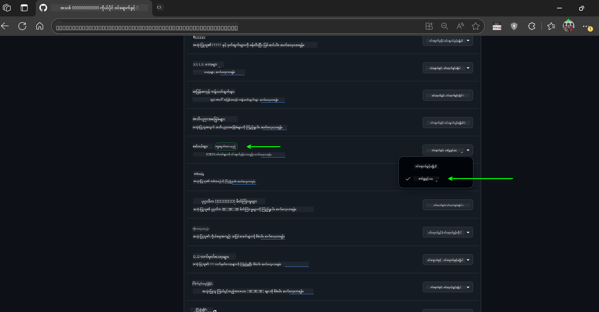
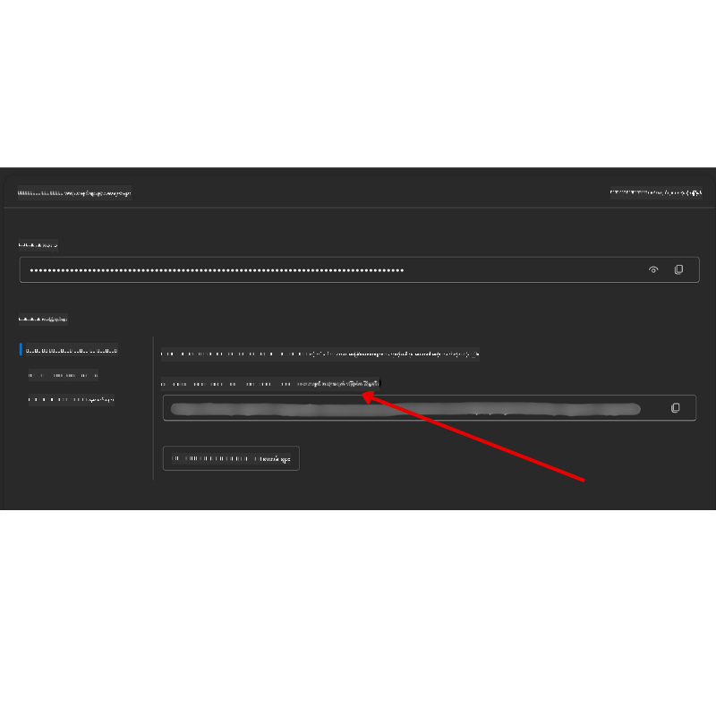

<!--
CO_OP_TRANSLATOR_METADATA:
{
  "original_hash": "c6a79c8f2b56a80370ff7e447765524f",
  "translation_date": "2025-07-23T09:20:35+00:00",
  "source_file": "00-course-setup/README.md",
  "language_code": "my"
}
-->
# သင်ခန်းစာ စတင်ခြင်း

## မိတ်ဆက်

ဒီသင်ခန်းစာမှာ သင်ခန်းစာရဲ့ ကုဒ်နမူနာတွေကို ဘယ်လို run လုပ်ရမယ်ဆိုတာကို ဖော်ပြပေးမှာပါ။

## ဒီ Repo ကို Clone လုပ်မယ် ဒါမှမဟုတ် Fork လုပ်မယ်

စတင်ရန်အတွက် GitHub Repository ကို Clone လုပ်ပါ ဒါမှမဟုတ် Fork လုပ်ပါ။ ဒါက သင့်ကိုယ်ပိုင် သင်ခန်းစာအကြောင်းအရာကို ရရှိစေပြီး ကုဒ်ကို run လုပ်နိုင်၊ စမ်းသပ်နိုင်၊ ပြင်ဆင်နိုင်စေမှာပါ။

ဒီအဆင့်ကို GitHub Link ကို နှိပ်ပြီး ပြုလုပ်နိုင်ပါတယ်။



## ကုဒ်ကို Run လုပ်ခြင်း

ဒီသင်ခန်းစာမှာ AI Agents တည်ဆောက်ဖို့ လက်တွေ့အတွေ့အကြုံရရှိစေမယ့် Jupyter Notebooks တွေ ပါဝင်ပါတယ်။

ကုဒ်နမူနာတွေမှာ အောက်ပါ Framework တွေကို အသုံးပြုထားပါတယ်-

**GitHub အကောင့်လိုအပ်သည် - အခမဲ့**:

1) Semantic Kernel Agent Framework + GitHub Models Marketplace. (semantic-kernel.ipynb) အဖြစ် Label လုပ်ထားသည်။
2) AutoGen Framework + GitHub Models Marketplace. (autogen.ipynb) အဖြစ် Label လုပ်ထားသည်။

**Azure Subscription လိုအပ်သည်**:
3) Azure AI Foundry + Azure AI Agent Service. (azureaiagent.ipynb) အဖြစ် Label လုပ်ထားသည်။

Framework သုံးမျိုးလုံးကို စမ်းသပ်ဖို့ အကြံပြုပါတယ်၊ သင့်အတွက် အကောင်းဆုံးဖြစ်မယ့် Framework ကို ရှာဖွေဖို့ အထောက်အကူဖြစ်စေမှာပါ။

သင်ရွေးချယ်တဲ့ Framework အပေါ်မူတည်ပြီး အောက်ပါ Setup အဆင့်တွေကို လိုက်နာရပါမယ်-

## လိုအပ်ချက်များ

- Python 3.12+
  - **NOTE**: Python3.12 မရှိပါက Python3.12 ကို Install လုပ်ပါ။ ပြီးရင် requirements.txt ဖိုင်ထဲက version တွေကို သေချာစွာ Install လုပ်ဖို့ python3.12 ကို အသုံးပြုပြီး venv တည်ဆောက်ပါ။
- GitHub အကောင့် - GitHub Models Marketplace ကို အသုံးပြုရန်
- Azure Subscription - Azure AI Foundry ကို အသုံးပြုရန်
- Azure AI Foundry အကောင့် - Azure AI Agent Service ကို အသုံးပြုရန်

ဒီ Repository ရဲ့ root မှာ Python packages တွေကို Install လုပ်ဖို့ `requirements.txt` ဖိုင်ကို ထည့်သွင်းထားပါတယ်။

Terminal မှာ root directory မှာ အောက်ပါ command ကို run လုပ်ပြီး Install လုပ်နိုင်ပါတယ်-

```bash
pip install -r requirements.txt
```
Python virtual environment တည်ဆောက်ခြင်းကို အကြံပြုပါတယ်၊ conflicts တွေကို ရှောင်ရှားနိုင်စေမှာပါ။

## VSCode Setup
VSCode မှာ Python ရဲ့ version မှန်ကန်မှုကို သေချာစွာ အသုံးပြုပါ။


## GitHub Models ကို အသုံးပြုရန် Setup

### အဆင့် ၁: GitHub Personal Access Token (PAT) ကို ရယူပါ

ဒီသင်ခန်းစာမှာ GitHub Models Marketplace ကို အသုံးပြုထားပြီး သင် AI Agents တည်ဆောက်ဖို့ အသုံးပြုမယ့် Large Language Models (LLMs) တွေကို အခမဲ့ရယူနိုင်ပါတယ်။

GitHub Models ကို အသုံးပြုဖို့ [GitHub Personal Access Token](https://docs.github.com/en/authentication/keeping-your-account-and-data-secure/managing-your-personal-access-tokens) တစ်ခုကို ဖန်တီးရပါမယ်။

GitHub အကောင့်မှာ အောက်ပါအဆင့်တွေကို လိုက်နာပါ-

[Principle of Least Privilege](https://docs.github.com/en/get-started/learning-to-code/storing-your-secrets-safely) ကို လိုက်နာပါ။ Token ကို သင့်အတွက် လိုအပ်တဲ့ permission တွေကိုသာပေးပါ။

1. `Fine-grained tokens` ကို ရွေးချယ်ပါ။

    ပြီးရင် `Generate new token` ကို နှိပ်ပါ။

    

1. Token ရဲ့ ရည်ရွယ်ချက်ကို ဖော်ပြတဲ့ နာမည်တစ်ခုကို ထည့်သွင်းပါ။ Expiration date ကို သတ်မှတ်ပါ (အကြံပြုချက်: 30 ရက်; သင့်လုံခြုံမှုအတွက် 7 ရက်လိုချင်ရင်လည်း ရပါတယ်။)

    

1. Token ရဲ့ scope ကို သင် Fork လုပ်ထားတဲ့ Repository အတွက်သာ ကန့်သတ်ပါ။

    

1. Token ရဲ့ permission တွေကို ကန့်သတ်ပါ။ **Permissions** အောက်မှာ **Account Permissions** ကို toggle လုပ်ပြီး **Models** ကို traverse လုပ်ပြီး GitHub Models အတွက် လိုအပ်တဲ့ read-access ကိုသာ enable လုပ်ပါ။

    

    

သင်ဖန်တီးထားတဲ့ token ကို copy လုပ်ပါ။ ဒီသင်ခန်းစာမှာ ပါဝင်တဲ့ `.env` ဖိုင်ထဲကို ထည့်သွင်းပါ။

### အဆင့် ၂: `.env` ဖိုင်ကို ဖန်တီးပါ

Terminal မှာ အောက်ပါ command ကို run လုပ်ပါ-

```bash
cp .env.example .env
```

ဒီ command က `.env` ဖိုင်ကို သင့် directory မှာ ဖန်တီးပေးပြီး environment variables တွေကို ထည့်သွင်းနိုင်ပါတယ်။

Token ကို copy လုပ်ပြီး `.env` ဖိုင်ကို သင်နှစ်သက်တဲ့ text editor မှာ ဖွင့်ပါ။ `GITHUB_TOKEN` field ထဲကို သင့် token ကို paste လုပ်ပါ။

အခု သင် ဒီသင်ခန်းစာရဲ့ ကုဒ်နမူနာတွေကို run လုပ်နိုင်ပါပြီ။

## Azure AI Foundry နှင့် Azure AI Agent Service ကို အသုံးပြုရန် Setup

### အဆင့် ၁: Azure Project Endpoint ကို ရယူပါ

Azure AI Foundry မှ hub နှင့် project တစ်ခုကို ဖန်တီးရန် အဆင့်တွေကို [Hub resources overview](https://learn.microsoft.com/en-us/azure/ai-foundry/concepts/ai-resources) မှာ ကြည့်ပါ။

Project တစ်ခုကို ဖန်တီးပြီးရင် connection string ကို ရယူရပါမယ်။

ဒီအဆင့်ကို Azure AI Foundry portal ရဲ့ **Overview** စာမျက်နှာမှာ ပြုလုပ်နိုင်ပါတယ်။



### အဆင့် ၂: `.env` ဖိုင်ကို ဖန်တီးပါ

Terminal မှာ အောက်ပါ command ကို run လုပ်ပါ-

```bash
cp .env.example .env
```

ဒီ command က `.env` ဖိုင်ကို သင့် directory မှာ ဖန်တီးပေးပြီး environment variables တွေကို ထည့်သွင်းနိုင်ပါတယ်။

Token ကို copy လုပ်ပြီး `.env` ဖိုင်ကို သင်နှစ်သက်တဲ့ text editor မှာ ဖွင့်ပါ။ `PROJECT_ENDPOINT` field ထဲကို သင့် token ကို paste လုပ်ပါ။

### အဆင့် ၃: Azure မှာ Sign in လုပ်ပါ

လုံခြုံရေးအတွက် [keyless authentication](https://learn.microsoft.com/azure/developer/ai/keyless-connections?tabs=csharp%2Cazure-cli?WT.mc_id=academic-105485-koreyst) ကို အသုံးပြုပါ။

Terminal ကို ဖွင့်ပြီး `az login --use-device-code` command ကို run လုပ်ပါ။ Azure အကောင့်မှာ login လုပ်ပါ။

Login လုပ်ပြီးရင် Terminal မှာ subscription ကို ရွေးချယ်ပါ။

## အပိုသော Environment Variables - Azure Search နှင့် Azure OpenAI

Agentic RAG Lesson - Lesson 5 မှာ Azure Search နှင့် Azure OpenAI ကို အသုံးပြုထားတဲ့ နမူနာတွေ ပါဝင်ပါတယ်။

ဒီနမူနာတွေကို run လုပ်ချင်ရင် `.env` ဖိုင်ထဲမှာ အောက်ပါ environment variables တွေကို ထည့်သွင်းရပါမယ်-

### Overview Page (Project)

- `AZURE_SUBSCRIPTION_ID` - **Overview** စာမျက်နှာရဲ့ **Project details** မှာ ရှာပါ။

- `AZURE_AI_PROJECT_NAME` - **Overview** စာမျက်နှာရဲ့ အပေါ်မှာ ရှာပါ။

- `AZURE_OPENAI_SERVICE` - **Overview** စာမျက်နှာရဲ့ **Included capabilities** tab မှာ **Azure OpenAI Service** ကို ရှာပါ။

### Management Center

- `AZURE_OPENAI_RESOURCE_GROUP` - **Management Center** ရဲ့ **Overview** စာမျက်နှာမှာ **Project properties** ကို သွားပါ။

- `GLOBAL_LLM_SERVICE` - **Connected resources** အောက်မှာ **Azure AI Services** connection name ကို ရှာပါ။ မရှိပါက **Azure portal** မှာ သင့် resource group အောက်မှာ AI Services resource name ကို ရှာပါ။

### Models + Endpoints Page

- `AZURE_OPENAI_EMBEDDING_DEPLOYMENT_NAME` - Embedding model (ဥပမာ `text-embedding-ada-002`) ကို ရွေးချယ်ပြီး model details မှ **Deployment name** ကို မှတ်သားပါ။

- `AZURE_OPENAI_CHAT_DEPLOYMENT_NAME` - Chat model (ဥပမာ `gpt-4o-mini`) ကို ရွေးချယ်ပြီး model details မှ **Deployment name** ကို မှတ်သားပါ။

### Azure Portal

- `AZURE_OPENAI_ENDPOINT` - **Azure AI services** ကို ရှာပြီး **Resource Management**, **Keys and Endpoint** ကို သွားပါ။ "Azure OpenAI endpoints" မှ "Language APIs" ကို copy လုပ်ပါ။

- `AZURE_OPENAI_API_KEY` - အတူတူသော screen မှာ KEY 1 ဒါမှမဟုတ် KEY 2 ကို copy လုပ်ပါ။

- `AZURE_SEARCH_SERVICE_ENDPOINT` - **Azure AI Search** resource ကို ရှာပြီး **Overview** ကို သွားပါ။

- `AZURE_SEARCH_API_KEY` - **Settings** မှာ **Keys** ကို သွားပြီး primary ဒါမှမဟုတ် secondary admin key ကို copy လုပ်ပါ။

### External Webpage

- `AZURE_OPENAI_API_VERSION` - [API version lifecycle](https://learn.microsoft.com/en-us/azure/ai-services/openai/api-version-deprecation#latest-ga-api-release) စာမျက်နှာရဲ့ **Latest GA API release** ကို သွားပါ။

### Keyless Authentication Setup

Credentials တွေကို hardcode မလုပ်ဘဲ Azure OpenAI နဲ့ keyless connection ကို အသုံးပြုပါ။ `DefaultAzureCredential` ကို Import လုပ်ပြီး `DefaultAzureCredential` function ကို later call လုပ်ပါ။

```python
from azure.identity import DefaultAzureCredential, InteractiveBrowserCredential
```

## အခက်အခဲရှိပါသလား?

ဒီ setup ကို run လုပ်ရာမှာ အခက်အခဲရှိပါက...

## နောက်သင်ခန်းစာ

အခု သင် ဒီသင်ခန်းစာရဲ့ ကုဒ်ကို run လုပ်ဖို့ ပြင်ဆင်ပြီးပါပြီ။ AI Agents ရဲ့ ကမ္ဘာကို ပိုမိုလေ့လာဖို့ အဆင်ပြေပါစေ!

[AI Agents နှင့် Agent Use Cases မိတ်ဆက်](../01-intro-to-ai-agents/README.md)

**အကြောင်းကြားချက်**:  
ဤစာရွက်စာတမ်းကို AI ဘာသာပြန်ဝန်ဆောင်မှု [Co-op Translator](https://github.com/Azure/co-op-translator) ကို အသုံးပြု၍ ဘာသာပြန်ထားပါသည်။ ကျွန်ုပ်တို့သည် တိကျမှုအတွက် ကြိုးစားနေသော်လည်း၊ အလိုအလျောက် ဘာသာပြန်မှုများတွင် အမှားများ သို့မဟုတ် မမှန်ကန်မှုများ ပါဝင်နိုင်သည်ကို သတိပြုပါ။ မူရင်းဘာသာစကားဖြင့် ရေးသားထားသော စာရွက်စာတမ်းကို အာဏာတရ အရင်းအမြစ်အဖြစ် သတ်မှတ်သင့်ပါသည်။ အရေးကြီးသော အချက်အလက်များအတွက် လူ့ဘာသာပြန်ပညာရှင်များမှ ပရော်ဖက်ရှင်နယ် ဘာသာပြန်မှုကို အကြံပြုပါသည်။ ဤဘာသာပြန်မှုကို အသုံးပြုခြင်းမှ ဖြစ်ပေါ်လာသော အလွဲအလွတ်များ သို့မဟုတ် အနားလွဲမှုများအတွက် ကျွန်ုပ်တို့သည် တာဝန်မယူပါ။