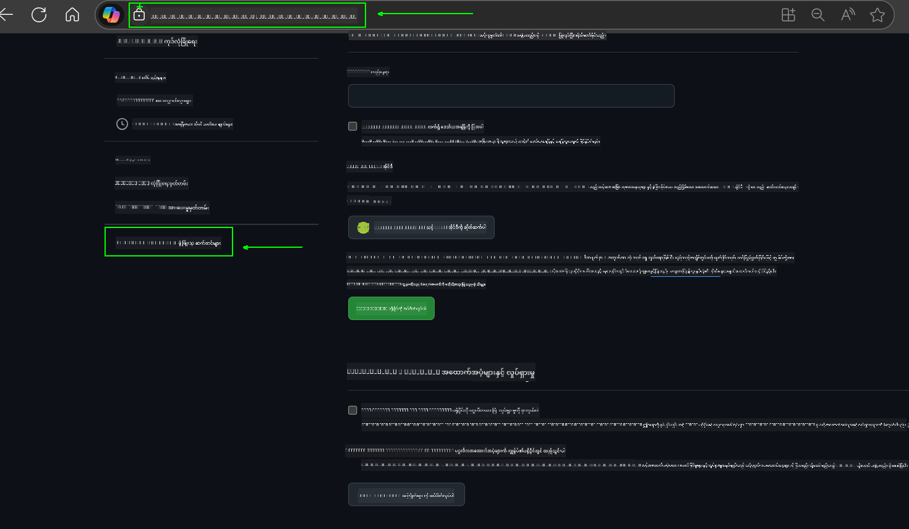
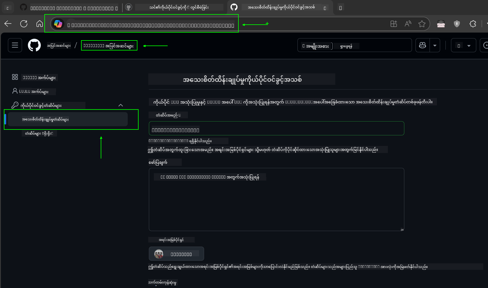
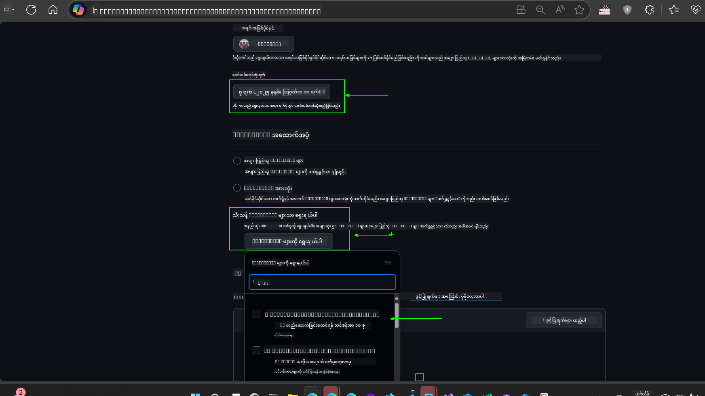
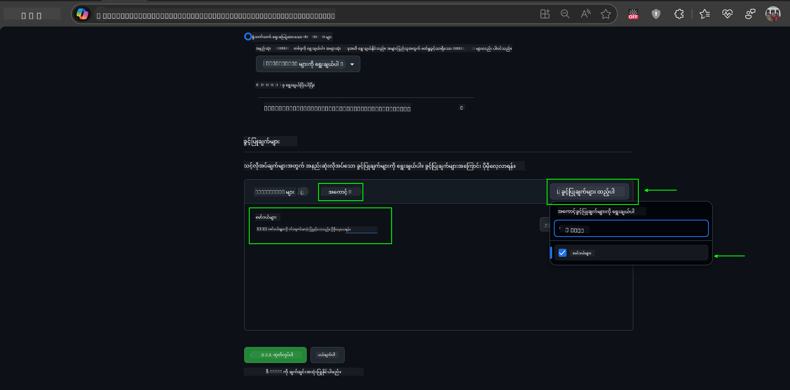
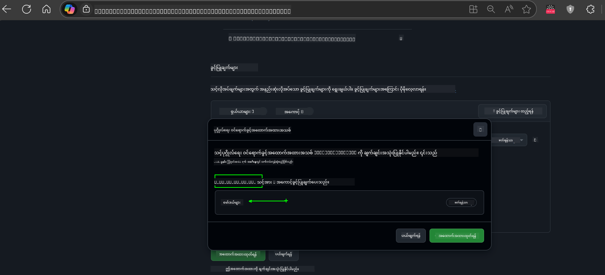
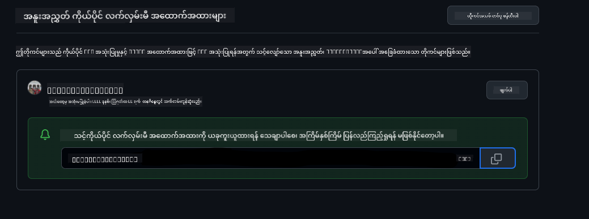
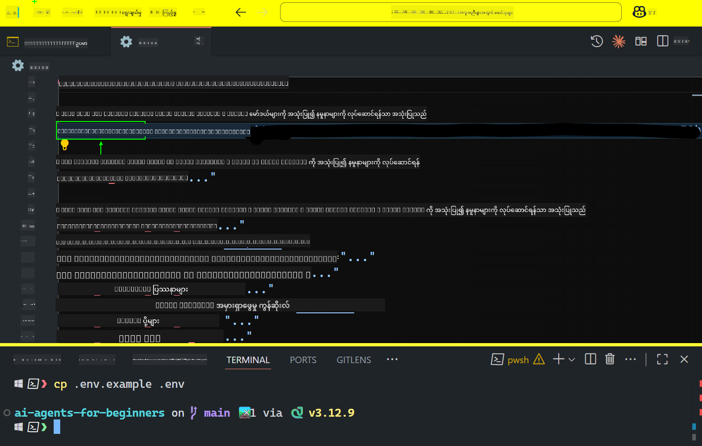

<!--
CO_OP_TRANSLATOR_METADATA:
{
  "original_hash": "c55b973b1562abf5aadf6a4028265ac5",
  "translation_date": "2025-08-29T23:58:16+00:00",
  "source_file": "00-course-setup/README.md",
  "language_code": "my"
}
-->
# သင်တန်း စတင်ခြင်း

## နိဒါန်း

ဒီသင်ခန်းစာမှာ သင်တန်းရဲ့ ကုဒ်နမူနာတွေကို ဘယ်လို run လုပ်ရမယ်ဆိုတာကို ဖော်ပြပေးမှာပါ။

## အခြား သင်ယူသူတွေနဲ့ ပူးပေါင်းပြီး အကူအညီရယူပါ

သင့်ရဲ့ repo ကို clone လုပ်ဖို့မစခင်မှာ [AI Agents For Beginners Discord channel](https://aka.ms/ai-agents/discord) ကို join ဝင်ပါ။ ဒီမှာ သင်တန်းဆိုင်ရာ အကူအညီရယူနိုင်သလို၊ သင်တန်းနဲ့ပတ်သက်တဲ့ မေးခွန်းတွေကို မေးနိုင်ပြီး အခြား သင်ယူသူတွေနဲ့ ဆက်သွယ်နိုင်ပါတယ်။

## ဒီ Repo ကို Clone သို့မဟုတ် Fork လုပ်ပါ

စတင်ရန်အတွက် GitHub Repository ကို clone သို့မဟုတ် fork လုပ်ပါ။ ဒီလိုလုပ်ခြင်းဖြင့် သင့်ကိုယ်ပိုင် သင်တန်းအကြောင်းအရာကို ရရှိပြီး ကုဒ်တွေကို run, test, နှင့် ပြင်ဆင်နိုင်ပါမယ်။

ဒီအဆင့်ကို လုပ်ရန်အတွက် အောက်ပါလင့်ခ်ကို နှိပ်ပါ။


## ကုဒ်ကို Run လုပ်ခြင်း

ဒီသင်တန်းမှာ AI Agents တည်ဆောက်ဖို့ လက်တွေ့ကျကျ လေ့လာနိုင်ဖို့ Jupyter Notebooks အစီအစဉ်တစ်ခုကို ပေးထားပါတယ်။

ကုဒ်နမူနာတွေမှာ အောက်ပါအတိုင်း အသုံးပြုထားပါတယ် -

**GitHub Account လိုအပ်သည် - အခမဲ့**:

1) Semantic Kernel Agent Framework + GitHub Models Marketplace (semantic-kernel.ipynb) ဟု အမည်ပေးထားသည်။
2) AutoGen Framework + GitHub Models Marketplace (autogen.ipynb) ဟု အမည်ပေးထားသည်။

**Azure Subscription လိုအပ်သည်**:
3) Azure AI Foundry + Azure AI Agent Service (azureaiagent.ipynb) ဟု အမည်ပေးထားသည်။

သင့်အတွက် အကောင်းဆုံးဖြစ်မယ့် နမူနာကို ရွေးချယ်နိုင်ဖို့ အားလုံးကို စမ်းသပ်ကြည့်ဖို့ အကြံပြုပါတယ်။

သင်ရွေးချယ်မယ့် နမူနာအလိုက် အောက်ပါ setup အဆင့်တွေကို လိုက်နာရပါမယ် -

## လိုအပ်ချက်များ

- Python 3.12+
  - **NOTE**: Python3.12 မရှိသေးရင် အရင်တင်သွင်းပါ။ ပြီးရင် python3.12 ကို အသုံးပြုပြီး venv တစ်ခု ဖန်တီးပါ။ requirements.txt ဖိုင်ထဲက version တွေကို မှန်ကန်စွာ တင်သွင်းနိုင်ဖို့ပါ။
- GitHub Account - GitHub Models Marketplace ကို အသုံးပြုရန်
- Azure Subscription - Azure AI Foundry ကို အသုံးပြုရန်
- Azure AI Foundry Account - Azure AI Agent Service ကို အသုံးပြုရန်

ဒီ repository ရဲ့ root မှာ `requirements.txt` ဖိုင်ကို ထည့်သွင်းထားပြီး Python packages အားလုံးကို တင်သွင်းနိုင်ဖို့ပါ။

Terminal မှာ အောက်ပါ command ကို run လုပ်ပြီး တင်သွင်းနိုင်ပါတယ် -

```bash
pip install -r requirements.txt
```

Python virtual environment တစ်ခု ဖန်တီးပြီး conflicts နှင့် ပြဿနာတွေကို ရှောင်ရှားဖို့ အကြံပြုပါတယ်။

## VSCode ကို Setup လုပ်ပါ
VSCode မှာ Python ရဲ့ မှန်ကန်တဲ့ version ကို အသုံးပြုနေကြောင်း သေချာပါစေ။


## GitHub Models ကို အသုံးပြုတဲ့ နမူနာများအတွက် Setup

### အဆင့် ၁: GitHub Personal Access Token (PAT) ကို ရယူပါ

ဒီသင်တန်းမှာ GitHub Models Marketplace ကို အသုံးပြုထားပြီး သင် AI Agents တည်ဆောက်ဖို့ အသုံးပြုမယ့် Large Language Models (LLMs) တွေကို အခမဲ့ရယူနိုင်ပါတယ်။

GitHub Models ကို အသုံးပြုဖို့ [GitHub Personal Access Token](https://docs.github.com/en/authentication/keeping-your-account-and-data-secure/managing-your-personal-access-tokens) တစ်ခု ဖန်တီးရပါမယ်။

ဒီအဆင့်ကို သင့် GitHub Account မှာ လုပ်နိုင်ပါတယ်။

[Principle of Least Privilege](https://docs.github.com/en/get-started/learning-to-code/storing-your-secrets-safely) ကို လိုက်နာပြီး token ကို လိုအပ်တဲ့ permission များသာပေးပါ။

1. **Developer settings** ကို သွားပြီး ဘယ်ဘက်ဘက်က `Fine-grained tokens` ကို ရွေးပါ။
   

    ပြီးရင် `Generate new token` ကို နှိပ်ပါ။

    

2. Token ရဲ့ ရည်ရွယ်ချက်ကို ဖော်ပြတဲ့ အမည်တစ်ခု ထည့်သွင်းပါ။

    🔐 Token Duration Recommendation

    အကြံပြုထားတဲ့ ကြာချိန်: 30 ရက်
    ပိုမိုလုံခြုံမှုအတွက် 7 ရက်လိုမျိုး ပိုမိုတိုတောင်းတဲ့ ကြာချိန်ကို ရွေးချယ်နိုင်ပါတယ် 🛡️
    သင့်ရဲ့ သင်ယူမှု momentum ကို ထိန်းသိမ်းထားနိုင်ဖို့ အကောင်းဆုံးနည်းလမ်းတစ်ခုပါ 🚀။

    

3. Token ရဲ့ scope ကို သင့် repo fork အတွက်သာ ကန့်သတ်ပါ။

    

4. Token ရဲ့ permission တွေကို ကန့်သတ်ပါ - **Permissions** အောက်မှာ **Account** tab ကို နှိပ်ပြီး "+ Add permissions" button ကို နှိပ်ပါ။ Dropdown menu မှာ **Models** ကို ရှာပြီး checkbox ကို အမှန်ခြစ်ပါ။
    

5. Token ကို ဖန်တီးမည့်အခါမှာ လိုအပ်တဲ့ permission တွေကို ပြန်လည်စစ်ဆေးပါ။ 

6. Token ကို ဖန်တီးမည့်အခါမှာ password manager vault လိုမျိုး လုံခြုံတဲ့နေရာမှာ သိမ်းဆည်းဖို့ ပြင်ဆင်ထားပါ။ Token ကို ဖန်တီးပြီးနောက် ပြန်လည်ကြည့်ရှုလို့ မရတော့ပါဘူး။ 

သင်ဖန်တီးထားတဲ့ token ကို copy လုပ်ပါ။ ဒီသင်တန်းမှာ ပါဝင်တဲ့ `.env` ဖိုင်ထဲမှာ ထည့်သွင်းပါ။

### အဆင့် ၂: `.env` ဖိုင်ကို ဖန်တီးပါ

Terminal မှာ အောက်ပါ command ကို run လုပ်ပါ။

```bash
cp .env.example .env
```

ဒီလိုလုပ်ပြီးနောက် `.env` ဖိုင်ကို သင့် directory ထဲမှာ ဖန်တီးပြီး environment variables တွေကို ထည့်သွင်းနိုင်ပါမယ်။

သင့် token ကို copy လုပ်ပြီး `.env` ဖိုင်ကို သင်နှစ်သက်တဲ့ text editor နဲ့ ဖွင့်ပါ။ `GITHUB_TOKEN` field ထဲမှာ သင့် token ကို paste လုပ်ပါ။


ဒီအဆင့်နောက်ပိုင်းမှာ သင့်ရဲ့ သင်တန်းကုဒ်နမူနာတွေကို run လုပ်နိုင်ပါပြီ။

## Azure AI Foundry နှင့် Azure AI Agent Service ကို အသုံးပြုတဲ့ နမူနာများအတွက် Setup

### အဆင့် ၁: Azure Project Endpoint ကို ရယူပါ

Azure AI Foundry မှာ hub နှင့် project တစ်ခု ဖန်တီးရန် အဆင့်တွေကို [Hub resources overview](https://learn.microsoft.com/en-us/azure/ai-foundry/concepts/ai-resources) မှာ ကြည့်ရှုနိုင်ပါတယ်။

Project တစ်ခု ဖန်တီးပြီးနောက် သင့် project ရဲ့ connection string ကို ရယူရပါမယ်။

ဒီအဆင့်ကို Azure AI Foundry portal ရဲ့ **Overview** စာမျက်နှာမှာ လုပ်နိုင်ပါတယ်။


### အဆင့် ၂: `.env` ဖိုင်ကို ဖန်တီးပါ

Terminal မှာ အောက်ပါ command ကို run လုပ်ပါ။

```bash
cp .env.example .env
```

ဒီလိုလုပ်ပြီးနောက် `.env` ဖိုင်ကို သင့် directory ထဲမှာ ဖန်တီးပြီး environment variables တွေကို ထည့်သွင်းနိုင်ပါမယ်။

သင့် token ကို copy လုပ်ပြီး `.env` ဖိုင်ကို သင်နှစ်သက်တဲ့ text editor နဲ့ ဖွင့်ပါ။ `PROJECT_ENDPOINT` field ထဲမှာ သင့် token ကို paste လုပ်ပါ။

### အဆင့် ၃: Azure ကို Sign in လုပ်ပါ

လုံခြုံရေးအတွက် [keyless authentication](https://learn.microsoft.com/azure/developer/ai/keyless-connections?tabs=csharp%2Cazure-cli?WT.mc_id=academic-105485-koreyst) ကို အသုံးပြုပါ။

Terminal ကို ဖွင့်ပြီး `az login --use-device-code` command ကို run လုပ်ပြီး သင့် Azure account ကို sign in လုပ်ပါ။

Sign in ပြီးနောက် Terminal မှာ သင့် subscription ကို ရွေးချယ်ပါ။

## အပိုဆောင်း Environment Variables - Azure Search နှင့် Azure OpenAI

Agentic RAG သင်ခန်းစာ - Lesson 5 - မှာ Azure Search နှင့် Azure OpenAI ကို အသုံးပြုတဲ့ နမူနာတွေ ပါဝင်ပါတယ်။

ဒီနမူနာတွေကို run လုပ်ချင်ရင် `.env` ဖိုင်ထဲမှာ အောက်ပါ environment variables တွေကို ထည့်သွင်းရပါမယ် -

### Overview Page (Project)

- `AZURE_SUBSCRIPTION_ID` - **Overview** စာမျက်နှာရဲ့ **Project details** မှာ ကြည့်ပါ။

- `AZURE_AI_PROJECT_NAME` - **Overview** စာမျက်နှာရဲ့ အပေါ်ဆုံးမှာ ကြည့်ပါ။

- `AZURE_OPENAI_SERVICE` - **Overview** စာမျက်နှာရဲ့ **Included capabilities** tab မှာ **Azure OpenAI Service** ကို ကြည့်ပါ။

### Management Center

- `AZURE_OPENAI_RESOURCE_GROUP` - **Management Center** ရဲ့ **Overview** စာမျက်နှာမှာ **Project properties** ကို သွားပါ။

- `GLOBAL_LLM_SERVICE` - **Connected resources** အောက်မှာ **Azure AI Services** connection name ကို ရှာပါ။ မရှိပါက **Azure portal** မှာ သင့် resource group အောက်မှာ AI Services resource name ကို ကြည့်ပါ။

### Models + Endpoints Page

- `AZURE_OPENAI_EMBEDDING_DEPLOYMENT_NAME` - သင့် embedding model (ဥပမာ - `text-embedding-ada-002`) ကို ရွေးပြီး model details မှာ **Deployment name** ကို မှတ်သားပါ။

- `AZURE_OPENAI_CHAT_DEPLOYMENT_NAME` - သင့် chat model (ဥပမာ - `gpt-4o-mini`) ကို ရွေးပြီး model details မှာ **Deployment name** ကို မှတ်သားပါ။

### Azure Portal

- `AZURE_OPENAI_ENDPOINT` - **Azure AI services** ကို ရှာပြီး **Resource Management**, **Keys and Endpoint** ကို သွားပါ။ "Azure OpenAI endpoints" အောက်မှာ "Language APIs" ဆိုတာကို copy လုပ်ပါ။

- `AZURE_OPENAI_API_KEY` - အဲဒီအပေါ်မှာ KEY 1 သို့မဟုတ် KEY 2 ကို copy လုပ်ပါ။

- `AZURE_SEARCH_SERVICE_ENDPOINT` - **Azure AI Search** resource ကို ရှာပြီး **Overview** ကို ကြည့်ပါ။

- `AZURE_SEARCH_API_KEY` - **Settings** > **Keys** ကို သွားပြီး primary သို့မဟုတ် secondary admin key ကို copy လုပ်ပါ။

### External Webpage

- `AZURE_OPENAI_API_VERSION` - [API version lifecycle](https://learn.microsoft.com/en-us/azure/ai-services/openai/api-version-deprecation#latest-ga-api-release) စာမျက်နှာရဲ့ **Latest GA API release** အောက်မှာ ကြည့်ပါ။

### Keyless Authentication ကို Setup လုပ်ပါ

သင့် credentials တွေကို hardcode မလုပ်ဘဲ Azure OpenAI နဲ့ keyless connection ကို အသုံးပြုပါ။ ဒီအတွက် `DefaultAzureCredential` ကို import လုပ်ပြီးနောက် `DefaultAzureCredential` function ကို အသုံးပြုပါ။

```python
from azure.identity import DefaultAzureCredential, InteractiveBrowserCredential
```

## တစ်နေရာရာမှာ ပိတ်မိနေပါသလား?

ဒီ setup ကို run လုပ်ရာမှာ ပြဿနာတစ်ခုခုရှိရင်, ကျွန်ုပ်တို့ရဲ့ Discord channel ကို join ဝင်ပြီး အကူအညီရယူပါ။

## နောက်သင်ခန်းစာ

သင့်ရဲ့ သင်တန်းကုဒ်တွေကို run လုပ်ဖို့ အဆင်သင့်ဖြစ်ပါပြီ။ AI Agents ရဲ့ ကမ္ဘာကြီးကို ပိုမိုလေ့လာရင်း ပျော်ရွှင်ပါစေ! 

[Introduction to AI Agents and Agent Use Cases](../01-intro-to-ai-agents/README.md)

---

**အကြောင်းကြားချက်**:  
ဤစာရွက်စာတမ်းကို AI ဘာသာပြန်ဝန်ဆောင်မှု [Co-op Translator](https://github.com/Azure/co-op-translator) ကို အသုံးပြု၍ ဘာသာပြန်ထားပါသည်။ ကျွန်ုပ်တို့သည် တိကျမှုအတွက် ကြိုးစားနေသော်လည်း၊ အလိုအလျောက် ဘာသာပြန်ခြင်းတွင် အမှားများ သို့မဟုတ် မတိကျမှုများ ပါရှိနိုင်သည်ကို သတိပြုပါ။ မူရင်းဘာသာစကားဖြင့် ရေးသားထားသော စာရွက်စာတမ်းကို အာဏာရှိသော ရင်းမြစ်အဖြစ် သတ်မှတ်သင့်ပါသည်။ အရေးကြီးသော အချက်အလက်များအတွက် လူ့ဘာသာပြန်ပညာရှင်များမှ ပရော်ဖက်ရှင်နယ် ဘာသာပြန်ခြင်းကို အကြံပြုပါသည်။ ဤဘာသာပြန်ကို အသုံးပြုခြင်းမှ ဖြစ်ပေါ်လာသော အလွဲအလွဲအချော်အချော်များ သို့မဟုတ် အနားလွဲမှုများအတွက် ကျွန်ုပ်တို့သည် တာဝန်မယူပါ။