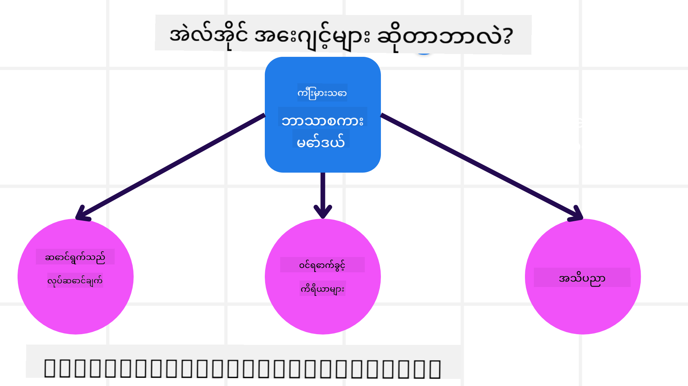
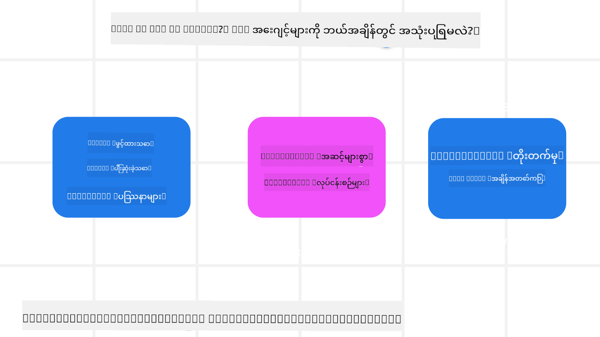

<!--
CO_OP_TRANSLATOR_METADATA:
{
  "original_hash": "d84943abc8f001ad4670418d32c2d899",
  "translation_date": "2025-07-12T08:13:40+00:00",
  "source_file": "01-intro-to-ai-agents/README.md",
  "language_code": "my"
}
-->
ဒီသင်ခန်းစာကို စတင်ရန်၊ AI Agents ဆိုတာဘာလဲ၊ ကျွန်တော်တို့ တည်ဆောက်မယ့် အက်ပလီကေးရှင်းနဲ့ လုပ်ငန်းစဉ်တွေမှာ ဘယ်လိုအသုံးပြုနိုင်မလဲ ဆိုတာကို ပိုမိုနားလည်ဖို့ စတင်ကြမယ်။

## နိဒါန်း

ဒီသင်ခန်းစာမှာ ပါဝင်တာတွေက -

- AI Agents ဆိုတာဘာလဲ၊ Agent အမျိုးအစားမျိုးစုံက ဘာတွေလဲ?
- AI Agents အတွက် အသုံးပြုမှုကိစ္စတွေ ဘယ်လိုတွေကောင်းပြီး ကျွန်တော်တို့ကို ဘယ်လိုကူညီနိုင်မလဲ?
- Agentic Solutions ဒီဇိုင်းဆွဲရာမှာ အခြေခံအဆောက်အအုံတွေက ဘာတွေလဲ?

## သင်ယူရမယ့် ရည်မှန်းချက်များ
ဒီသင်ခန်းစာပြီးဆုံးတဲ့အခါမှာ -

- AI Agent အကြောင်းအရာနဲ့ အခြား AI ဖြေရှင်းချက်တွေနဲ့ ဘယ်လိုကွာခြားချက်ရှိတယ်ဆိုတာ နားလည်နိုင်မယ်။
- AI Agents ကို အကျိုးရှိဆုံး အသုံးချနိုင်မယ်။
- အသုံးပြုသူနဲ့ ဖောက်သည်အတွက် အကျိုးရှိစွာ Agentic Solutions ဒီဇိုင်းဆွဲနိုင်မယ်။

## AI Agents ကို သတ်မှတ်ခြင်းနဲ့ AI Agents အမျိုးအစားများ

### AI Agents ဆိုတာဘာလဲ?

AI Agents ဆိုတာက **စနစ်များ**ဖြစ်ပြီး **ကြီးမားတဲ့ဘာသာစကားမော်ဒယ်များ(LLMs)** ကို **လုပ်ဆောင်ချက်များ ပြုလုပ်နိုင်စေဖို့** ၎င်းတို့ရဲ့စွမ်းရည်တွေကို တိုးချဲ့ပေးပြီး LLMs ကို **ကိရိယာများ**နဲ့ **အသိပညာ** အသုံးပြုခွင့်ပေးခြင်းဖြစ်ပါတယ်။

ဒီအဓိပ္ပါယ်ကို အပိုင်းသေးသေးလေးတွေဖြင့် ခွဲခြမ်းကြည့်ရအောင် -

- **စနစ်** - Agent ကို တစ်ခုတည်းသော အစိတ်အပိုင်းတစ်ခုအဖြစ်မဟုတ်ဘဲ အစိတ်အပိုင်းများစွာပါဝင်တဲ့ စနစ်တစ်ခုအဖြစ် တွေးကြည့်ဖို့ အရေးကြီးပါတယ်။ အခြေခံအဆင့်မှာ AI Agent ရဲ့ အစိတ်အပိုင်းတွေက -
  - **ပတ်ဝန်းကျင်** - AI Agent လည်ပတ်နေတဲ့ သတ်မှတ်ထားတဲ့ နေရာ။ ဥပမာ၊ ခရီးသွားဘွတ်ကင် AI Agent ရှိရင်၊ ပတ်ဝန်းကျင်က ခရီးသွားဘွတ်ကင်စနစ်ဖြစ်ပြီး AI Agent က အလုပ်လုပ်ဖို့ ဒီစနစ်ကို အသုံးပြုပါတယ်။
  - **ဆင်ဆာများ** - ပတ်ဝန်းကျင်မှာ သတင်းအချက်အလက်တွေရှိပြီး တုံ့ပြန်ချက်ပေးပါတယ်။ AI Agents က ဆင်ဆာတွေကို အသုံးပြုပြီး ပတ်ဝန်းကျင်ရဲ့ လက်ရှိအခြေအနေကို စုဆောင်းနားလည်ပါတယ်။ ခရီးသွားဘွတ်ကင် Agent ဥပမာမှာ၊ ဘွတ်ကင်စနစ်က ဟိုတယ်ရရှိနိုင်မှု သို့မဟုတ် လေယာဉ်ဈေးနှုန်းတွေကို ပေးနိုင်ပါတယ်။
  - **အက်တူအေးတာများ** - AI Agent က ပတ်ဝန်းကျင်ရဲ့ လက်ရှိအခြေအနေကို လက်ခံရရှိပြီး လုပ်ဆောင်ရန် လိုအပ်တဲ့ အရေးယူမှုကို သတ်မှတ်ပါတယ်။ ခရီးသွားဘွတ်ကင် Agent အတွက်တော့ အသုံးပြုသူအတွက် ရရှိနိုင်တဲ့ အခန်းတစ်ခန်းကို ဘွတ်ကင်လုပ်ခြင်း ဖြစ်နိုင်ပါတယ်။

**ကြီးမားတဲ့ဘာသာစကားမော်ဒယ်များ** - Agent အကြောင်းအရာက LLMs ဖန်တီးမတိုင်မီကတည်းက ရှိခဲ့ပါတယ်။ LLMs နဲ့ AI Agents တည်ဆောက်ခြင်းရဲ့ အားသာချက်က လူဘာသာစကားနဲ့ ဒေတာကို နားလည်နိုင်ခြင်း ဖြစ်ပါတယ်။ ဒီစွမ်းရည်က LLMs ကို ပတ်ဝန်းကျင်သတင်းအချက်အလက်ကို နားလည်ပြီး ပတ်ဝန်းကျင်ကို ပြောင်းလဲဖို့ အစီအစဉ်ရေးဆွဲနိုင်စေပါတယ်။

**လုပ်ဆောင်ချက်များ ပြုလုပ်ခြင်း** - AI Agent စနစ်အပြင်မှာ LLMs က အသုံးပြုသူရဲ့ တောင်းဆိုချက်အပေါ် မူတည်ပြီး အကြောင်းအရာ သို့မဟုတ် သတင်းအချက်အလက် ထုတ်ပေးခြင်းအထိ ကန့်သတ်ထားပါတယ်။ AI Agent စနစ်အတွင်းမှာတော့ LLMs က အသုံးပြုသူရဲ့ တောင်းဆိုချက်ကို နားလည်ပြီး ပတ်ဝန်းကျင်ထဲမှာ ရရှိနိုင်တဲ့ ကိရိယာတွေကို အသုံးပြုပြီး တာဝန်များ ပြီးမြောက်စေပါတယ်။

**ကိရိယာများ အသုံးပြုခွင့်** - LLMs ရဲ့ ကိရိယာအသုံးပြုခွင့်ကို ၁) လည်ပတ်နေတဲ့ ပတ်ဝန်းကျင်နဲ့ ၂) AI Agent ကို ဖန်တီးသူ သတ်မှတ်ပါတယ်။ ခရီးသွား Agent ဥပမာမှာ Agent ရဲ့ ကိရိယာတွေက ဘွတ်ကင်စနစ်ထဲမှာ ရနိုင်တဲ့ လုပ်ဆောင်ချက်တွေနဲ့ ကန့်သတ်ထားပြီး၊ ဖန်တီးသူကလည်း Agent ရဲ့ ကိရိယာအသုံးပြုခွင့်ကို လေယာဉ်ခရီးစဉ်တွေကိုသာ ကန့်သတ်နိုင်ပါတယ်။

**မှတ်ဉာဏ်+အသိပညာ** - မှတ်ဉာဏ်က အသုံးပြုသူနဲ့ Agent ကြား စကားပြောဆိုမှုအတွင်း အချိန်တိုအတွင်း ဖြစ်နိုင်ပါတယ်။ ရေရှည်မှာတော့ ပတ်ဝန်းကျင်က ပေးတဲ့ သတင်းအချက်အလက်အပြင် AI Agents က အခြားစနစ်များ၊ ဝန်ဆောင်မှုများ၊ ကိရိယာများနဲ့ အခြား Agent များထံမှ အသိပညာ ရယူနိုင်ပါတယ်။ ခရီးသွား Agent ဥပမာမှာ အသုံးပြုသူရဲ့ ခရီးသွားစိတ်ကြိုက်ချက်တွေကို ဖောက်သည် ဒေတာဘေ့စ်ထဲကနေ ရယူနိုင်ပါတယ်။

### Agent အမျိုးအစားများ

AI Agents ရဲ့ အထွေထွေသတ်မှတ်ချက် ရရှိပြီးနောက် ခရီးသွားဘွတ်ကင် AI Agent အတွက် အမျိုးအစားအချို့ကို ကြည့်ကြမယ်။

| **Agent အမျိုးအစား**           | **ဖော်ပြချက်**                                                                                                                       | **ဥပမာ**                                                                                                                                                                                                                   |
| ----------------------------- | ------------------------------------------------------------------------------------------------------------------------------------- | ----------------------------------------------------------------------------------------------------------------------------------------------------------------------------------------------------------------------------- |
| **ရိုးရှင်းတဲ့ Reflex Agents**      | ကြိုတင်သတ်မှတ်ထားတဲ့ စည်းမျဉ်းအပေါ် မူတည်ပြီး ချက်ချင်း လုပ်ဆောင်ချက်များ ပြုလုပ်သည်။                                                                                  | ခရီးသွား Agent က အီးမေးလ်အကြောင်းအရာကို နားလည်ပြီး ခရီးသွားဆိုင်ရာ ပြဿနာများကို ဖောက်သည်ဝန်ဆောင်မှုဆီ ပို့သည်။                                                                                                                          |
| **Model-Based Reflex Agents** | ကမ္ဘာ့ပုံစံတစ်ခုအပေါ် မူတည်ပြီး အဲဒီပုံစံကို ပြောင်းလဲမှုအပေါ် အခြေခံ၍ လုပ်ဆောင်ချက်များ ပြုလုပ်သည်။                                                              | ခရီးသွား Agent က သမိုင်းဝင်ဈေးနှုန်းဒေတာကို အသုံးပြုပြီး ဈေးနှုန်းပြောင်းလဲမှုများ အလေးပေး၍ လမ်းကြောင်းများကို ဦးစားပေးသည်။                                                                                                             |
| **Goal-Based Agents**         | ရည်မှန်းချက်တစ်ခုကို ရရှိရန် အစီအစဉ်များ ဖန်တီးပြီး ရည်မှန်းချက်ကို နားလည်ကာ ရောက်ရှိရန် လုပ်ဆောင်ချက်များ သတ်မှတ်သည်။                                  | ခရီးသွား Agent က လက်ရှိနေရာမှ သွားမည့်နေရာအထိ လိုအပ်သော ခရီးစဉ်စီစဉ်မှုများ (ကား၊ ပြည်သူ့သယ်ယူပို့ဆောင်ရေး၊ လေယာဉ်) ကို သတ်မှတ်ပြီး ခရီးစဉ်ကို ဘွတ်ကင်လုပ်သည်။                                                                                |
| **Utility-Based Agents**      | စိတ်ကြိုက်မှုများကို စဉ်းစားကာ ရည်မှန်းချက်များ ရရှိရန် အတွက် အကျိုးအမြတ်ကို ဂဏန်းဖြင့် ချိန်ညှိသည်။                                               | ခရီးသွား Agent က ခရီးစဉ်ဘွတ်ကင်လုပ်ရာတွင် အဆင်ပြေမှုနဲ့ ကုန်ကျစရိတ်ကို ချိန်ညှိကာ အကျိုးအမြတ်အများဆုံး ရရှိစေသည်။                                                                                                                                          |
| **Learning Agents**           | တုံ့ပြန်ချက်များကို လက်ခံပြီး လုပ်ဆောင်ချက်များကို ပြင်ဆင်ကာ အချိန်အလိုက် တိုးတက်တတ်သည်။                                                        | ခရီးသွား Agent က ခရီးပြီးနောက် စစ်တမ်းမှ ဖောက်သည်တုံ့ပြန်ချက်များကို အသုံးပြုပြီး နောက်ထပ် ဘွတ်ကင်များအတွက် ပြင်ဆင်မှုများ ပြုလုပ်သည်။                                                                                                               |
| **Hierarchical Agents**       | အဆင့်အတန်းများစွာပါဝင်သော Agent များဖြင့် ဖွဲ့စည်းထားပြီး အဆင့်မြင့် Agent က တာဝန်များကို အဆင့်နိမ့် Agent များအတွက် အပိုတာဝန်များ ခွဲဝေသည်။ | ခရီးသွား Agent က ခရီးစဉ်ကို ပယ်ဖျက်ရာတွင် တာဝန်ကို အပိုတာဝန်များ (ဥပမာ၊ သတ်မှတ်ထားသော ဘွတ်ကင်များ ပယ်ဖျက်ခြင်း) အဖြစ် ခွဲပြီး အဆင့်နိမ့် Agent များကို ပြီးမြောက်စေပြီး အဆင့်မြင့် Agent ထံ ပြန်လည်အစီရင်ခံသည်။                                     |
| **Multi-Agent Systems (MAS)** | Agent များက တာဝန်များကို ကိုယ်ပိုင်အလိုက် လုပ်ဆောင်ပြီး ပူးပေါင်း သို့မဟုတ် ယှဉ်ပြိုင်နိုင်သည်။                                                           | ပူးပေါင်းမှု - Agent များစွာက ဟိုတယ်၊ လေယာဉ်၊ ဖျော်ဖြေရေး စသည့် ခရီးသွားဝန်ဆောင်မှုများကို ဘွတ်ကင်လုပ်သည်။ ယှဉ်ပြိုင်မှု - Agent များစွာက ဟိုတယ်ဘွတ်ကင် ပြက္ခဒိန်တစ်ခုကို စီမံပြီး ဖောက်သည်များကို ဟိုတယ်ထဲ ဘွတ်ကင်လုပ်ရန် ယှဉ်ပြိုင်သည်။ |

## AI Agents ကို ဘယ်အချိန် အသုံးပြုမလဲ

အထက်ပါ အပိုင်းမှာ ခရီးသွား Agent ကို အသုံးပြုပြီး Agent အမျိုးအစားတွေကို ခရီးသွားဘွတ်ကင် အခြေအနေမျိုးစုံမှာ ဘယ်လိုအသုံးပြုနိုင်မလဲ ဆိုတာ ရှင်းပြခဲ့ပါတယ်။ ဒီအက်ပလီကေးရှင်းကို သင်တန်းတစ်လျှောက်လုံး အသုံးပြုသွားမှာ ဖြစ်ပါတယ်။

AI Agents အတွက် အကောင်းဆုံး အသုံးပြုမှုကိစ္စအမျိုးအစားတွေကို ကြည့်ကြမယ် -

- **ဖွင့်လှစ်ထားသော ပြဿနာများ** - လုပ်ဆောင်ချက်များ ပြီးမြောက်ရန် လိုအပ်သော အဆင့်များကို LLM က သတ်မှတ်ခွင့်ရှိစေခြင်း၊ အလုပ်စဉ်ထဲမှာ အမြဲတမ်း စနစ်တကျ မသတ်မှတ်နိုင်သောအတွက်။
- **အဆင့်များစွာ လုပ်ငန်းစဉ်များ** - AI Agent က တစ်ခါတည်း ရယူခြင်းမဟုတ်ဘဲ ကိရိယာများ သို့မဟုတ် သတင်းအချက်အလက်များကို အဆင့်များစွာ အသုံးပြုရသော ရှုပ်ထွေးမှုရှိသော တာဝန်များ။
- **အချိန်အလိုက် တိုးတက်မှု** - Agent က ပတ်ဝန်းကျင် သို့မဟုတ် အသုံးပြုသူများထံမှ တုံ့ပြန်ချက်များ လက်ခံရရှိခြင်းအားဖြင့် အချိန်အလိုက် တိုးတက်မှု ရရှိနိုင်သော တာဝန်များ။

AI Agents အသုံးပြုရာမှာ ထပ်မံစဉ်းစားရမည့် အချက်များကို Building Trustworthy AI Agents သင်ခန်းစာမှာ ဆက်လက်ဖော်ပြပါမယ်။

## Agentic Solutions အခြေခံများ

### Agent ဖန်တီးခြင်း

AI Agent စနစ် ဒီဇိုင်းဆွဲရာမှာ ပထမဆုံး အဆင့်က ကိရိယာများ၊ လုပ်ဆောင်ချက်များနဲ့ အပြုအမူများကို သတ်မှတ်ခြင်းဖြစ်ပါတယ်။ ဒီသင်တန်းမှာ ကျွန်တော်တို့ **Azure AI Agent Service** ကို အသုံးပြုပြီး Agent များကို သတ်မှတ်မှာ ဖြစ်ပါတယ်။ ၎င်းမှာ ပါဝင်တဲ့ အင်္ဂါရပ်တွေက -

- OpenAI, Mistral, Llama စတဲ့ Open Models ရွေးချယ်နိုင်ခြင်း
- Tripadvisor ကဲ့သို့သော ပေးသွင်းသူများမှ လိုင်စင်ရ ဒေတာ အသုံးပြုခွင့်
- OpenAPI 3.0 ကိရိယာများကို စံပြအတိုင်း အသုံးပြုနိုင်ခြင်း

### Agentic ပုံစံများ

LLMs နဲ့ ဆက်သွယ်မှုက prompt များဖြင့် ဖြစ်ပါတယ်။ AI Agents ရဲ့ အချို့ကိုယ်ပိုင် လွတ်လပ်မှုကြောင့် ပတ်ဝန်းကျင်ပြောင်းလဲမှုအပြီးမှာ LLM ကို လက်ဖြင့် ပြန်လည် prompt မပေးရဘဲ ဖြစ်နိုင်ခြေရှိပါတယ်။ ဒီလိုအခြေအနေမှာ ကျွန်တော်တို့ **Agentic Patterns** ကို အသုံးပြုပြီး LLM ကို အဆင့်များစွာ prompt ပေးနိုင်စေပါတယ်။

ဒီသင်တန်းကို လက်ရှိ လူကြိုက်များတဲ့ Agentic patterns အချို့အလိုက် ခွဲခြားထားပါတယ်။

### Agentic Frameworks

Agentic Frameworks တွေက developer တွေကို agentic patterns ကို ကုဒ်ဖြင့် အကောင်အထည်ဖော်နိုင်စေပါတယ်။ ဒီ framework တွေက template, plugin, ကိရိယာများ ပေးပြီး AI Agent တွေ ပိုမိုကောင်းမွန်စွာ ပူးပေါင်းဆောင်ရွက်နိုင်စေပါတယ်။ ဒီအကျိုးကျေးဇူးတွေက AI Agent စနစ်တွေကို ပိုမိုမြင်သာစေပြီး ပြဿနာရှာဖွေရန် အထောက်အကူဖြစ်စေပါတယ်။

ဒီသင်တန်းမှာ ကျွန်တော်တို့ သုတေသနအခြေပြု AutoGen framework နဲ့ ထုတ်လုပ်မှုအဆင်သင့် Semantic Kernel ရဲ့ Agent framework ကို လေ့လာသွားမှာ ဖြစ်ပါတယ်။

## ယခင်သင်ခန်းစာ

[Course Setup](../00-course-setup/README.md)

## နောက်တစ်ခန်း

[Exploring Agentic Frameworks](../02-explore-agentic-frameworks/README.md)

**အကြောင်းကြားချက်**  
ဤစာတမ်းကို AI ဘာသာပြန်ဝန်ဆောင်မှု [Co-op Translator](https://github.com/Azure/co-op-translator) ဖြင့် ဘာသာပြန်ထားပါသည်။ ကျွန်ုပ်တို့သည် တိကျမှန်ကန်မှုအတွက် ကြိုးစားသော်လည်း၊ အလိုအလျောက် ဘာသာပြန်ခြင်းတွင် အမှားများ သို့မဟုတ် မှားယွင်းချက်များ ပါဝင်နိုင်ကြောင်း သတိပြုပါရန် မေတ္တာရပ်ခံအပ်ပါသည်။ မူရင်းစာတမ်းကို မိမိဘာသာစကားဖြင့်သာ တရားဝင်အချက်အလက်အဖြစ် ယူဆသင့်ပါသည်။ အရေးကြီးသော အချက်အလက်များအတွက် လူ့ဘာသာပြန်ပညာရှင်မှ ဘာသာပြန်ခြင်းကို အကြံပြုပါသည်။ ဤဘာသာပြန်ချက်ကို အသုံးပြုရာမှ ဖြစ်ပေါ်လာနိုင်သည့် နားလည်မှုမှားယွင်းမှုများအတွက် ကျွန်ုပ်တို့သည် တာဝန်မယူပါ။