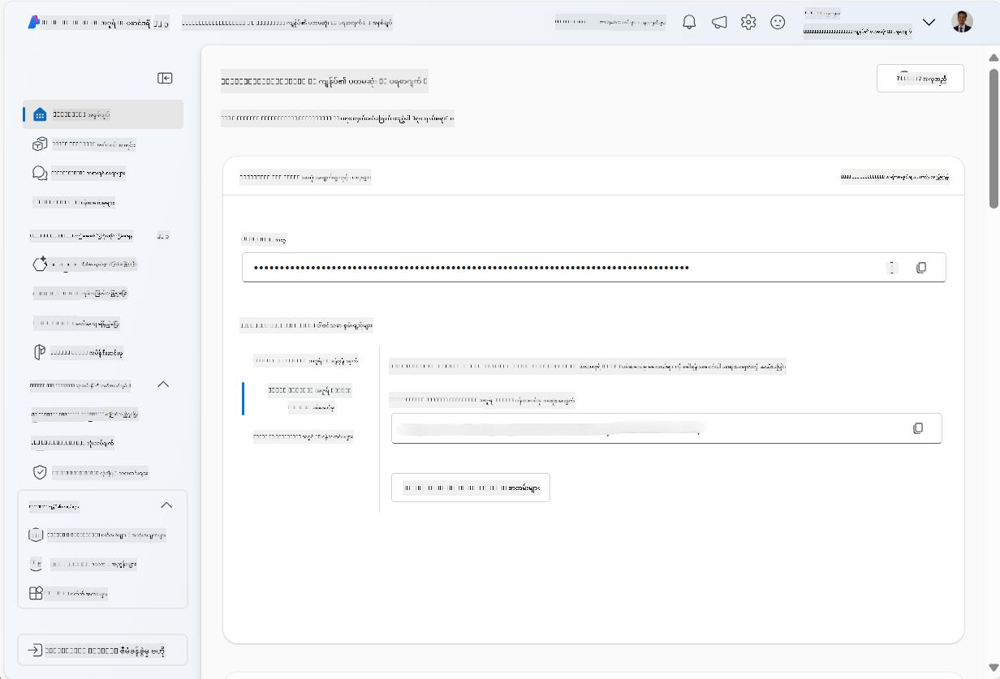
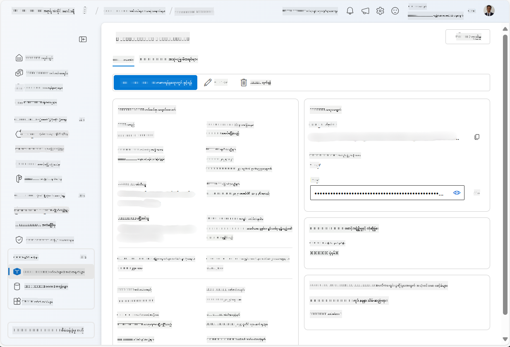
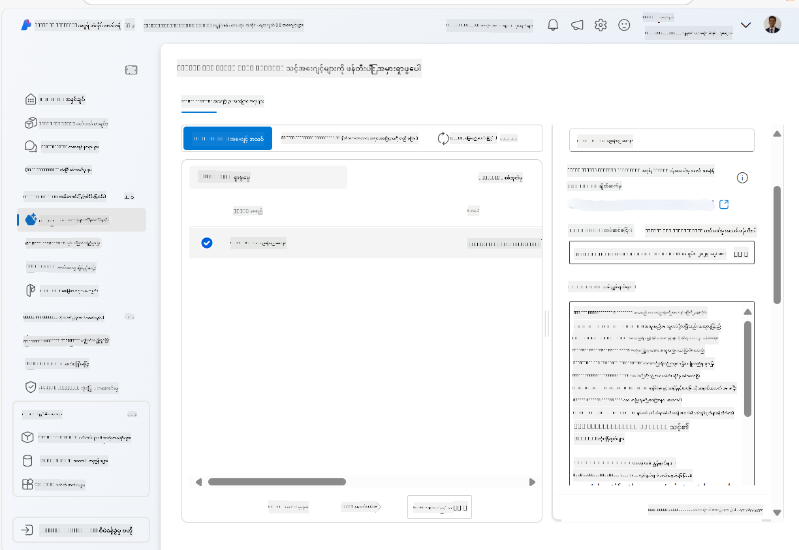
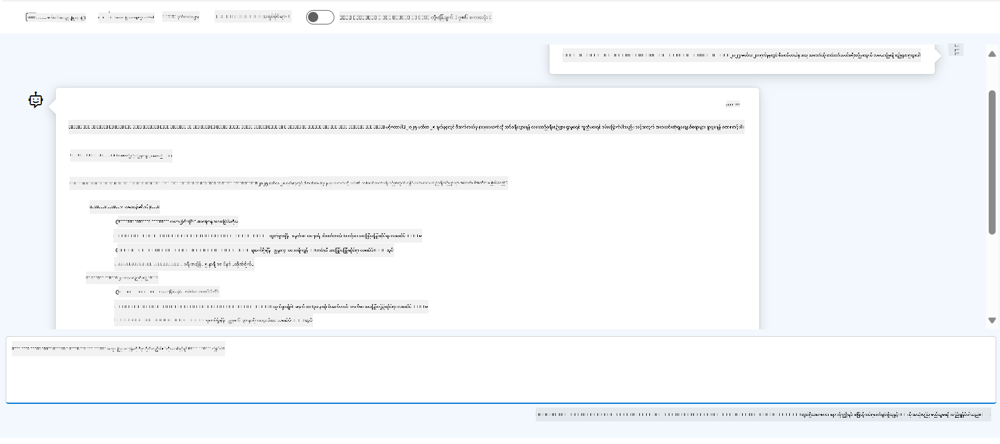

<!--
CO_OP_TRANSLATOR_METADATA:
{
  "original_hash": "7e92870dc0843e13d4dabc620c09d2d9",
  "translation_date": "2025-07-12T08:23:27+00:00",
  "source_file": "02-explore-agentic-frameworks/azure-ai-foundry-agent-creation.md",
  "language_code": "my"
}
-->
# Azure AI Agent Service Development

ဒီလေ့ကျင့်ခန်းမှာတော့ [Azure AI Foundry portal](https://ai.azure.com/?WT.mc_id=academic-105485-koreyst) ထဲက Azure AI Agent service tools တွေကို အသုံးပြုပြီး Flight Booking အတွက် agent တစ်ခု ဖန်တီးမှာဖြစ်ပါတယ်။ ဒီ agent က အသုံးပြုသူတွေနဲ့ ဆက်သွယ်ပြီး လေယာဉ်ခရီးစဉ်အကြောင်း အချက်အလက်တွေ ပေးနိုင်မှာ ဖြစ်ပါတယ်။

## Prerequisites

ဒီလေ့ကျင့်ခန်းကို ပြီးမြောက်ဖို့အတွက် လိုအပ်တာတွေကတော့ -
1. Active subscription ပါတဲ့ Azure အကောင့်တစ်ခု။ [အခမဲ့အကောင့်ဖန်တီးရန်](https://azure.microsoft.com/free/?WT.mc_id=academic-105485-koreyst)။
2. Azure AI Foundry hub တစ်ခု ဖန်တီးခွင့်ရှိရမည်၊ ဒါမှမဟုတ် သင့်အတွက် ဖန်တီးပေးထားရမည်။
    - သင့် role က Contributor သို့မဟုတ် Owner ဖြစ်ရင် ဒီ tutorial ရဲ့ အဆင့်တွေကို လိုက်နာနိုင်ပါသည်။

## Create an Azure AI Foundry hub

> **Note:** Azure AI Foundry ကို ယခင်က Azure AI Studio လို့ ခေါ်ကြပါတယ်။

1. Azure AI Foundry hub ဖန်တီးဖို့အတွက် [Azure AI Foundry](https://learn.microsoft.com/en-us/azure/ai-studio/?WT.mc_id=academic-105485-koreyst) ဘလော့ဂ်ပို့စ်ထဲက လမ်းညွှန်ချက်တွေကို လိုက်နာပါ။
2. သင့် project ဖန်တီးပြီးသွားရင် ပြသနေတဲ့ အကြံပြုချက်တွေကို ပိတ်ပြီး Azure AI Foundry portal ထဲက project စာမျက်နှာကို ပြန်လည်ကြည့်ရှုပါ၊ အောက်ပါပုံနှင့် ဆင်တူပါလိမ့်မယ်။

    

## Deploy a model

1. သင့် project ရဲ့ ဘယ်ဘက် panel မှာ **My assets** အပိုင်းအတွင်း **Models + endpoints** စာမျက်နှာကို ရွေးချယ်ပါ။
2. **Models + endpoints** စာမျက်နှာမှာ **Model deployments** tab ကိုသွားပြီး **+ Deploy model** မီနူးထဲက **Deploy base model** ကို ရွေးပါ။
3. စာရင်းထဲက `gpt-4o-mini` model ကို ရှာပြီး ရွေးချယ်ပြီး အတည်ပြုပါ။

    > **Note**: TPM ကို လျော့ချခြင်းက သင့် subscription မှာ ရရှိနိုင်တဲ့ quota ကို မကျော်လွန်စေရန် ကူညီပေးပါတယ်။

    

## Create an agent

Model တစ်ခု deploy လုပ်ပြီးသွားပြီဆိုရင် agent တစ်ခု ဖန်တီးနိုင်ပါပြီ။ Agent ဆိုတာက အသုံးပြုသူတွေနဲ့ စကားပြောနိုင်တဲ့ conversational AI model တစ်ခု ဖြစ်ပါတယ်။

1. သင့် project ရဲ့ ဘယ်ဘက် panel မှာ **Build & Customize** အပိုင်းအတွင်း **Agents** စာမျက်နှာကို ရွေးချယ်ပါ။
2. **+ Create agent** ကို နှိပ်ပြီး agent အသစ်တစ်ခု ဖန်တီးပါ။ **Agent Setup** dialog box ထဲမှာ -
    - Agent အမည်တစ်ခု ထည့်ပါ၊ ဥပမာ `FlightAgent`။
    - ယခင်က ဖန်တီးထားတဲ့ `gpt-4o-mini` model deployment ကို ရွေးချယ်ထားပါ။
    - Agent ကို လိုက်နာစေချင်တဲ့ prompt အတိုင်း **Instructions** ကို သတ်မှတ်ပါ။ ဥပမာ -
    ```
    You are FlightAgent, a virtual assistant specialized in handling flight-related queries. Your role includes assisting users with searching for flights, retrieving flight details, checking seat availability, and providing real-time flight status. Follow the instructions below to ensure clarity and effectiveness in your responses:

    ### Task Instructions:
    1. **Recognizing Intent**:
       - Identify the user's intent based on their request, focusing on one of the following categories:
         - Searching for flights
         - Retrieving flight details using a flight ID
         - Checking seat availability for a specified flight
         - Providing real-time flight status using a flight number
       - If the intent is unclear, politely ask users to clarify or provide more details.
        
    2. **Processing Requests**:
        - Depending on the identified intent, perform the required task:
        - For flight searches: Request details such as origin, destination, departure date, and optionally return date.
        - For flight details: Request a valid flight ID.
        - For seat availability: Request the flight ID and date and validate inputs.
        - For flight status: Request a valid flight number.
        - Perform validations on provided data (e.g., formats of dates, flight numbers, or IDs). If the information is incomplete or invalid, return a friendly request for clarification.

    3. **Generating Responses**:
    - Use a tone that is friendly, concise, and supportive.
    - Provide clear and actionable suggestions based on the output of each task.
    - If no data is found or an error occurs, explain it to the user gently and offer alternative actions (e.g., refine search, try another query).
    
    ```
> [!NOTE]
> အသေးစိတ် prompt အတွက် [ဒီ repository](https://github.com/ShivamGoyal03/RoamMind) ကို ကြည့်ရှုနိုင်ပါတယ်။
    
> ထို့အပြင် **Knowledge Base** နဲ့ **Actions** တွေ ထည့်သွင်းပြီး agent ရဲ့ စွမ်းရည်တွေကို တိုးမြှင့်နိုင်ပါတယ်။ ဒီလေ့ကျင့်ခန်းအတွက်တော့ ဒီအဆင့်တွေကို ကျော်လွှားနိုင်ပါတယ်။
    


3. Multi-AI agent အသစ်တစ်ခု ဖန်တီးချင်ရင် **New Agent** ကို နှိပ်ပါ။ ဖန်တီးပြီးတဲ့ agent ကို Agents စာမျက်နှာမှာ ပြသပါလိမ့်မယ်။

## Test the agent

Agent ဖန်တီးပြီးသွားရင် Azure AI Foundry portal playground မှာ အသုံးပြုသူမေးခွန်းတွေကို agent က ဘယ်လိုတုံ့ပြန်မလဲ စမ်းသပ်နိုင်ပါတယ်။

1. သင့် agent ရဲ့ **Setup** pane အပေါ်ဆုံးမှာ **Try in playground** ကို ရွေးချယ်ပါ။
2. **Playground** pane ထဲမှာ chat ပြတင်းပေါ်မှာ မေးခွန်းတွေ ရိုက်ထည့်ပြီး agent နဲ့ ဆက်သွယ်နိုင်ပါတယ်။ ဥပမာ၊ Seattle မှ New York သို့ ၂၈ ရက်နေ့ လေယာဉ်ခရီးရှာဖွေဖို့ agent ကို မေးနိုင်ပါတယ်။

    > **Note**: ဒီလေ့ကျင့်ခန်းမှာ အချိန်နဲ့တပြေးညီ ဒေတာ မသုံးထားလို့ agent ရဲ့ တုံ့ပြန်ချက်တွေ မှန်ကန်မှုနည်းနည်းရှိနိုင်ပါတယ်။ ရည်ရွယ်ချက်ကတော့ agent ရဲ့ အသုံးပြုသူမေးခွန်းတွေကို နားလည်ပြီး တုံ့ပြန်နိုင်မှုကို စမ်းသပ်ခြင်း ဖြစ်ပါတယ်။

    

3. Agent ကို စမ်းသပ်ပြီးနောက်မှာ intents, training data, actions တွေ ပိုထည့်သွင်းပြီး စွမ်းရည်ပိုမိုတိုးမြှင့်နိုင်ပါတယ်။

## Clean up resources

Agent စမ်းသပ်ပြီးဆုံးရင် အပိုကုန်ကျစရိတ် မဖြစ်အောင် ဖျက်ပစ်နိုင်ပါတယ်။
1. [Azure portal](https://portal.azure.com) ကို ဖွင့်ပြီး ဒီလေ့ကျင့်ခန်းမှာ အသုံးပြုထားတဲ့ hub resources တွေရှိတဲ့ resource group ကို ကြည့်ရှုပါ။
2. Toolbar မှာ **Delete resource group** ကို ရွေးချယ်ပါ။
3. Resource group အမည်ကို ထည့်ပြီး ဖျက်ပစ်ချင်ကြောင်း အတည်ပြုပါ။

## Resources

- [Azure AI Foundry documentation](https://learn.microsoft.com/en-us/azure/ai-studio/?WT.mc_id=academic-105485-koreyst)
- [Azure AI Foundry portal](https://ai.azure.com/?WT.mc_id=academic-105485-koreyst)
- [Getting Started with Azure AI Studio](https://techcommunity.microsoft.com/blog/educatordeveloperblog/getting-started-with-azure-ai-studio/4095602?WT.mc_id=academic-105485-koreyst)
- [Fundamentals of AI agents on Azure](https://learn.microsoft.com/en-us/training/modules/ai-agent-fundamentals/?WT.mc_id=academic-105485-koreyst)
- [Azure AI Discord](https://aka.ms/AzureAI/Discord)

**အကြောင်းကြားချက်**  
ဤစာတမ်းကို AI ဘာသာပြန်ဝန်ဆောင်မှု [Co-op Translator](https://github.com/Azure/co-op-translator) ဖြင့် ဘာသာပြန်ထားပါသည်။ ကျွန်ုပ်တို့သည် တိကျမှန်ကန်မှုအတွက် ကြိုးစားသော်လည်း အလိုအလျောက် ဘာသာပြန်ခြင်းတွင် အမှားများ သို့မဟုတ် မှားယွင်းချက်များ ပါဝင်နိုင်ကြောင်း သတိပြုပါရန် မေတ္တာရပ်ခံအပ်ပါသည်။ မူရင်းစာတမ်းကို မိမိဘာသာစကားဖြင့်သာ တရားဝင်အချက်အလက်အဖြစ် ယူဆသင့်ပါသည်။ အရေးကြီးသော အချက်အလက်များအတွက် လူ့ဘာသာပြန်ပညာရှင်မှ ဘာသာပြန်ခြင်းကို အကြံပြုပါသည်။ ဤဘာသာပြန်ချက်ကို အသုံးပြုရာမှ ဖြစ်ပေါ်လာနိုင်သည့် နားလည်မှုမှားယွင်းမှုများအတွက် ကျွန်ုပ်တို့သည် တာဝန်မယူပါ။