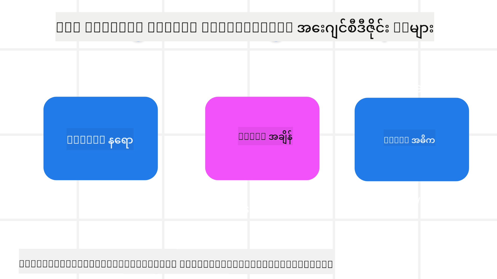

<!--
CO_OP_TRANSLATOR_METADATA:
{
  "original_hash": "4c46e4ff9e349c521e2b0b17f51afa64",
  "translation_date": "2025-08-30T00:05:09+00:00",
  "source_file": "03-agentic-design-patterns/README.md",
  "language_code": "my"
}
-->

> _(အထက်ပါပုံကိုနှိပ်ပြီး ဒီသင်ခန်းစာရဲ့ ဗီဒီယိုကို ကြည့်ပါ)_
# AI Agentic Design Principles

## အကျဉ်းချုပ်

AI Agentic Systems တည်ဆောက်ရာမှာ အမျိုးမျိုးသော အတွေးအခေါ်နည်းလမ်းများ ရှိပါတယ်။ Generative AI ဒီဇိုင်းမှာ မရေရာမှုဟာ အားသာချက်ဖြစ်ပြီး အားနည်းချက်မဟုတ်တဲ့အတွက် အင်ဂျင်နီယာများအနေဖြင့် ဘယ်နေရာက စတင်ရမလဲဆိုတာ ရှင်းလင်းဖို့ ခက်ခဲတတ်ပါတယ်။ ဒါကြောင့် လူအခြေပြု UX Design Principles တစ်စုံတစ်ခုကို ဖန်တီးထားပြီး developer များအနေဖြင့် customer အခြေပြု agentic systems များကို သူတို့ရဲ့ စီးပွားရေးလိုအပ်ချက်များ ဖြေရှင်းရန် တည်ဆောက်နိုင်အောင် အထောက်အကူပြုပါတယ်။ ဒီဒီဇိုင်းအခြေခံချက်များဟာ architecture ကို တိတိကျကျ သတ်မှတ်ထားတာမဟုတ်ဘဲ agent experience များကို သတ်မှတ်ပြီး တည်ဆောက်နေတဲ့ အဖွဲ့များအတွက် စတင်ရာအနေဖြင့် ရည်ရွယ်ထားတာဖြစ်ပါတယ်။

အထွေထွေအားဖြင့် agent များသည် -

- လူသားများ၏ စွမ်းရည်များကို ကျယ်ပြန့်စေပြီး (စိတ်ကူးယဉ်ခြင်း၊ ပြဿနာများကို ဖြေရှင်းခြင်း၊ အလိုအလျောက်လုပ်ဆောင်ခြင်း စသည်တို့) အတိုင်းအတာတစ်ခုအထိ တိုးတက်စေသည်။
- အသိပညာလွှာများကို ဖြည့်ဆည်းပေးသည် (အသိပညာနယ်ပယ်များကို အမြန်လေ့လာရန်၊ ဘာသာပြန်ခြင်း စသည်တို့)။
- လူသားများအနေဖြင့် အခြားသူများနှင့် ပူးပေါင်းလုပ်ဆောင်ရန် နှစ်သက်သော နည်းလမ်းများကို အထောက်အကူပြုသည်။
- ကျွန်ုပ်တို့ကို ပိုမိုကောင်းမွန်သော မိမိကိုယ်ကို ဖြစ်စေသည် (ဥပမာ- ဘဝကိုယ့်ကိုယ်ကိုယ်လမ်းညွှန်/အလုပ်အကိုင်စီမံခန့်ခွဲသူ၊ စိတ်ခံစားမှုကို ထိန်းချုပ်ခြင်းနှင့် mindfulness ကျွမ်းကျင်မှုများကို သင်ကြားပေးခြင်း၊ ခွန်အားတိုးပေးခြင်း စသည်တို့)။

## ဒီသင်ခန်းစာတွင် ပါဝင်မည့်အကြောင်းအရာများ

- Agentic Design Principles ဆိုတာဘာလဲ
- ဒီဒီဇိုင်းအခြေခံချက်များကို အကောင်အထည်ဖော်ရာတွင် လိုက်နာရန် လမ်းညွှန်ချက်များ
- ဒီဒီဇိုင်းအခြေခံချက်များကို အသုံးပြုထားသော ဥပမာများ

## သင်ယူရမည့်ရည်မှန်းချက်များ

ဒီသင်ခန်းစာကို ပြီးမြောက်ပြီးနောက်တွင်-

1. Agentic Design Principles ဆိုတာဘာလဲဆိုတာ ရှင်းပြနိုင်မည်။
2. Agentic Design Principles ကို အသုံးပြုရန် လမ်းညွှန်ချက်များကို ရှင်းပြနိုင်မည်။
3. Agentic Design Principles ကို အသုံးပြုပြီး agent တစ်ခုကို တည်ဆောက်နည်းကို နားလည်နိုင်မည်။

## Agentic Design Principles

### Agent (Space)

Agent လုပ်ဆောင်နေသော ပတ်ဝန်းကျင်ဖြစ်သည်။ ဒီအခြေခံချက်များသည် physical နှင့် digital ကမ္ဘာများတွင် agent များကို ဒီဇိုင်းဆွဲရာတွင် အထောက်အကူပြုသည်။

- **ချိတ်ဆက်ခြင်း၊ မပျက်စီးစေခြင်း** – လူများကို အခြားသူများ၊ အဖြစ်အပျက်များနှင့် လုပ်ဆောင်နိုင်သော အသိပညာများနှင့် ချိတ်ဆက်ပေးပြီး ပူးပေါင်းဆောင်ရွက်မှုနှင့် ချိတ်ဆက်မှုကို အထောက်အကူပြုပါ။
- Agent များသည် အဖြစ်အပျက်များ၊ အသိပညာများနှင့် လူများကို ချိတ်ဆက်ပေးသည်။
- Agent များသည် လူများကို ပိုမိုနီးကပ်စေသည်။ လူများကို အစားထိုးရန် သို့မဟုတ် အထောက်အထားမရှိစေရန် ရည်ရွယ်ထားခြင်းမဟုတ်ပါ။
- **ရလွယ်ရလွယ်ဖြစ်စေခြင်း၊ အခါအားလျော်စွာ မမြင်ရစေခြင်း** – agent သည် အဓိကအားဖြင့် နောက်ခံတွင် လုပ်ဆောင်ပြီး သက်ဆိုင်သောအခါနှင့် သင့်လျော်သောအခါတွင်သာ ကျွန်ုပ်တို့ကို အနည်းငယ် သတိပေးသည်။
  - Agent သည် အတည်ပြုထားသော အသုံးပြုသူများအတွက် မည်သည့် device သို့မဟုတ် platform တွင်မဆို ရှာဖွေဖို့လွယ်ကူပြီး အသုံးပြုနိုင်သည်။
  - Agent သည် အသံ၊ စကား၊ စာသား စသည်တို့အပါအဝင် မျိုးစုံသော input နှင့် output များကို ပံ့ပိုးပေးသည်။
  - Agent သည် foreground နှင့် background အကြား၊ proactive နှင့် reactive အကြား seamless transition လုပ်နိုင်ပြီး အသုံးပြုသူ၏ လိုအပ်ချက်များကို ခံစားနိုင်သည်။
  - Agent သည် မမြင်ရသောပုံစံဖြင့် လုပ်ဆောင်နိုင်သော်လည်း နောက်ခံလုပ်ဆောင်မှုလမ်းကြောင်းနှင့် အခြား Agent များနှင့် ပူးပေါင်းဆောင်ရွက်မှုသည် အသုံးပြုသူအတွက် ထင်ရှားပြီး ထိန်းချုပ်နိုင်သည်။

### Agent (Time)

Agent သည် အချိန်အတွင်း လုပ်ဆောင်ပုံဖြစ်သည်။ ဒီအခြေခံချက်များသည် အတိတ်၊ ပစ္စုပ္ပန်နှင့် အနာဂတ်အတွင်း agent များကို ဒီဇိုင်းဆွဲရာတွင် အထောက်အကူပြုသည်။

- **အတိတ်**: အခြေအနေနှင့် context ပါဝင်သော သမိုင်းကို ပြန်လည်သုံးသပ်ခြင်း။
  - Agent သည် အဖြစ်အပျက်၊ လူများ သို့မဟုတ် အခြေအနေများကိုသာမက ပိုမိုချောမွေ့သော သမိုင်းအချက်အလက်များကို ချီးချွန်မှုအပေါ် အခြေခံပြီး ပိုမိုသက်ဆိုင်သော ရလဒ်များကို ပေးသည်။
  - Agent သည် အတိတ်အဖြစ်အပျက်များမှ ချိတ်ဆက်မှုများကို ဖန်တီးပြီး လက်ရှိအခြေအနေများနှင့် ပူးပေါင်းဆောင်ရွက်ရန် memory ကို တက်ကြွစွာ ပြန်လည်သုံးသပ်သည်။
- **ပစ္စုပ္ပန်**: သတိပေးမှုထက် အနည်းငယ် nudging လုပ်ခြင်း။
  - Agent သည် လူများနှင့် အပြန်အလှန်ဆက်သွယ်မှုအတွက် comprehensive approach ကို embody လုပ်ထားသည်။ အဖြစ်အပျက်တစ်ခုဖြစ်ပျက်သောအခါ Agent သည် static notification သို့မဟုတ် အခြား static formality ထက် ကျော်လွှားသည်။ Agent သည် flow များကို ရိုးရှင်းစေသို့မဟုတ် အသုံးပြုသူ၏ အာရုံကို အချိန်မှန်မှန်တွင် ဦးတည်စေသော cues များကို dynamic generate လုပ်နိုင်သည်။
  - Agent သည် contextual environment၊ လူမှုရေးနှင့် ယဉ်ကျေးမှုအပြောင်းအလဲများအပေါ် အခြေခံပြီး အသုံးပြုသူရဲ့ ရည်ရွယ်ချက်ကို ထိန်းညှိထားသော အချက်အလက်များကို ပေးသည်။
  - Agent interaction သည် gradual ဖြစ်ပြီး အချိန်ကြာလာသည်နှင့်အမျှ အသုံးပြုသူများကို အာဏာပေးရန် အဆင့်မြှင့်တင်ခြင်း/တိုးတက်မှုရှိသည်။
- **အနာဂတ်**: အလျင်အမြန်နှင့် တိုးတက်မှုရှိခြင်း။
  - Agent သည် မျိုးစုံသော device များ၊ platform များနှင့် modality များကို အလျင်အမြန် လိုက်လျောညီထွေဖြစ်သည်။
  - Agent သည် အသုံးပြုသူ၏ အပြုအမူ၊ accessibility လိုအပ်ချက်များနှင့် လွတ်လပ်စွာ customize လုပ်နိုင်သည်။
  - Agent သည် အသုံးပြုသူနှင့် ဆက်သွယ်မှုများကို အဆက်မပြတ်လုပ်ဆောင်ခြင်းမှတစ်ဆင့် ဖွဲ့စည်းပြီး တိုးတက်လာသည်။

### Agent (Core)

Agent တစ်ခု၏ ဒီဇိုင်း၏ အဓိကအချက်များဖြစ်သည်။

- **မရေရာမှုကို လက်ခံပြီး ယုံကြည်မှုကို တည်ဆောက်ပါ**။
  - Agent မရေရာမှုတစ်ခုကို မျှော်လင့်ရမည်။ မရေရာမှုသည် agent ဒီဇိုင်း၏ အဓိကအချက်တစ်ခုဖြစ်သည်။
  - ယုံကြည်မှုနှင့် transparency သည် Agent ဒီဇိုင်း၏ အခြေခံအလွှာများဖြစ်သည်။
  - Agent သည် အချိန်မရွေး on/off ဖြစ်စေခြင်းကို လူသားများက ထိန်းချုပ်နိုင်ပြီး Agent status သည် အချိန်မရွေး ထင်ရှားနေသည်။

## ဒီအခြေခံချက်များကို အကောင်အထည်ဖော်ရန် လမ်းညွှန်ချက်များ

အထက်ပါ ဒီဇိုင်းအခြေခံချက်များကို အသုံးပြုသောအခါ အောက်ပါ လမ်းညွှန်ချက်များကို အသုံးပြုပါ-

1. **Transparency**: AI ပါဝင်နေသည်၊ အလုပ်လုပ်ပုံ (အတိတ်လုပ်ဆောင်မှုများအပါအဝင်) နှင့် feedback ပေးခြင်းနှင့် စနစ်ကို ပြင်ဆင်ပုံကို အသုံးပြုသူကို အသိပေးပါ။
2. **Control**: အသုံးပြုသူအနေဖြင့် စနစ်နှင့် attributes များကို customize လုပ်နိုင်ရန်၊ စိတ်ကြိုက်ရွေးချယ်နိုင်ရန်နှင့် ထိန်းချုပ်နိုင်ရန် (ဥပမာ- မေ့ပစ်နိုင်ရန်) အခွင့်အရေးပေးပါ။
3. **Consistency**: device များနှင့် endpoint များအကြား consistent ဖြစ်သော multi-modal အတွေ့အကြုံများကို ရှိစေရန် ကြိုးစားပါ။ မျှော်လင့်ရသော UI/UX elements များကို အသုံးပြုပါ (ဥပမာ- voice interaction အတွက် microphone icon) နှင့် customer ၏ cognitive load ကို အနည်းဆုံးဖြစ်စေရန် ကြိုးစားပါ (ဥပမာ- concise response များ၊ visual aids နှင့် ‘Learn More’ content များကို ရည်ရွယ်ပါ)။

## ဒီအခြေခံချက်များနှင့် လမ်းညွှန်ချက်များကို အသုံးပြု၍ Travel Agent တစ်ခုကို ဒီဇိုင်းဆွဲနည်း

Travel Agent တစ်ခုကို ဒီဇိုင်းဆွဲနေသည်ဟု စဉ်းစားပါက ဒီဒီဇိုင်းအခြေခံချက်များနှင့် လမ်းညွှန်ချက်များကို အသုံးပြုရန်အတွက် အောက်ပါအတိုင်း စဉ်းစားနိုင်ပါသည်-

1. **Transparency** – Travel Agent သည် AI-enabled Agent ဖြစ်သည်ဟု အသုံးပြုသူကို အသိပေးပါ။ စတင်အသုံးပြုရန်အတွက် အခြေခံညွှန်ကြားချက်များကို ပေးပါ (ဥပမာ- “Hello” message၊ sample prompts များ)။ ဒါကို product page တွင် ရှင်းလင်းစွာ မှတ်တမ်းတင်ပါ။ အသုံးပြုသူက အတိတ်တွင် မေးမြန်းခဲ့သော prompts များကို ပြပါ။ feedback ပေးပုံကို ရှင်းလင်းစွာ ဖော်ပြပါ (thumbs up နှင့် down၊ Send Feedback button စသည်တို့)။ Agent သည် အသုံးပြုမှု သို့မဟုတ် topic အကန့်အသတ်များရှိပါက ရှင်းလင်းစွာ ဖော်ပြပါ။
2. **Control** – Agent ကို ဖန်တီးပြီးနောက် အသုံးပြုသူက ပြင်ဆင်နိုင်ပုံကို ရှင်းလင်းစွာ ဖော်ပြပါ။ Agent ၏ verbosity၊ writing style နှင့် Agent မပြောသင့်သောအကြောင်းအရာများကို အသုံးပြုသူက ရွေးချယ်နိုင်ရန် အခွင့်အရေးပေးပါ။ ပတ်သက်သော files သို့မဟုတ် data၊ prompts နှင့် အတိတ်စကားဝိုင်းများကို ကြည့်ရှုနိုင်ရန်နှင့် ဖျက်နိုင်ရန် အသုံးပြုသူကို ခွင့်ပြုပါ။
3. **Consistency** – Share Prompt၊ file သို့မဟုတ် photo တစ်ခုကို ထည့်သွင်းရန်နှင့် တစ်စုံတစ်ခုကို tag လုပ်ရန် icon များကို စံနှင့် အသိအမှတ်ပြုနိုင်သော ပုံစံဖြစ်စေရန် သေချာပါ။ Agent နှင့် file upload/sharing ကို paperclip icon ဖြင့် ဖော်ပြပါ၊ graphics upload ကို image icon ဖြင့် ဖော်ပြပါ။

### AI Agentic Design Patterns အကြောင်း ပိုမိုမေးမြန်းလိုပါသလား?

[Azure AI Foundry Discord](https://aka.ms/ai-agents/discord) ကို join လုပ်ပြီး အခြားသော သင်ယူသူများနှင့် တွေ့ဆုံပါ၊ office hours တွင် ပါဝင်ပါ၊ AI Agents အကြောင်း မေးမြန်းပြီး အဖြေများရယူပါ။

## အပိုဆောင်းအရင်းအမြစ်များ

- 

## အရင်သင်ခန်းစာ

[Exploring Agentic Frameworks](../02-explore-agentic-frameworks/README.md)

## နောက်သင်ခန်းစာ

[Tool Use Design Pattern](../04-tool-use/README.md)

---

**အကြောင်းကြားချက်**:  
ဤစာရွက်စာတမ်းကို AI ဘာသာပြန်ဝန်ဆောင်မှု [Co-op Translator](https://github.com/Azure/co-op-translator) ကို အသုံးပြု၍ ဘာသာပြန်ထားပါသည်။ ကျွန်ုပ်တို့သည် တိကျမှုအတွက် ကြိုးစားနေသော်လည်း၊ အလိုအလျောက် ဘာသာပြန်ခြင်းတွင် အမှားများ သို့မဟုတ် မတိကျမှုများ ပါဝင်နိုင်သည်ကို သတိပြုပါ။ မူရင်းစာရွက်စာတမ်းကို ၎င်း၏ မူရင်းဘာသာစကားဖြင့် အာဏာတရားရှိသော အရင်းအမြစ်အဖြစ် သတ်မှတ်သင့်ပါသည်။ အရေးကြီးသော အချက်အလက်များအတွက် လူ့ဘာသာပြန်ပညာရှင်များမှ ပရော်ဖက်ရှင်နယ် ဘာသာပြန်ခြင်းကို အကြံပြုပါသည်။ ဤဘာသာပြန်ကို အသုံးပြုခြင်းမှ ဖြစ်ပေါ်လာသော အလွဲအလွတ်များ သို့မဟုတ် အနားယူမှုများအတွက် ကျွန်ုပ်တို့သည် တာဝန်မယူပါ။