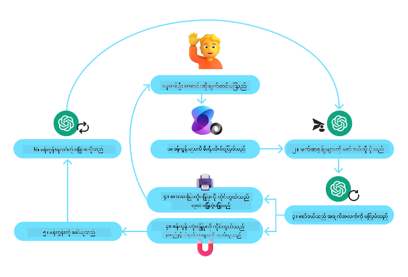

<!--
CO_OP_TRANSLATOR_METADATA:
{
  "original_hash": "4a5ccc4ad1dba85fbc2087cf3b986544",
  "translation_date": "2025-08-29T23:59:27+00:00",
  "source_file": "04-tool-use/README.md",
  "language_code": "my"
}
-->
[](https://youtu.be/vieRiPRx-gI?si=cEZ8ApnT6Sus9rhn)

> _(ဤပုံကိုနှိပ်ပြီး ဤသင်ခန်းစာ၏ ဗီဒီယိုကို ကြည့်ရှုပါ)_

# Tool Use Design Pattern

Tools တွေက စိတ်ဝင်စားစရာကောင်းပါတယ်၊ အကြောင်းကတော့ AI အေးဂျင့်တွေကို ပိုမိုကျယ်ပြန့်တဲ့ စွမ်းရည်တွေ ပေးနိုင်လို့ပါ။ အေးဂျင့်ဟာ လုပ်ဆောင်နိုင်တဲ့ လှုပ်ရှားမှု အကန့်အသတ်ရှိတဲ့အစား tool တစ်ခု ထည့်သွင်းလိုက်တာနဲ့ အေးဂျင့်ဟာ အမျိုးမျိုးသော လှုပ်ရှားမှုတွေ လုပ်ဆောင်နိုင်ပါပြီ။ ဤအခန်းမှာတော့ AI အေးဂျင့်တွေက သူတို့ရဲ့ ရည်မှန်းချက်တွေကို ရောက်ရှိအောင် အထူး tools တွေကို ဘယ်လိုအသုံးပြုနိုင်မလဲဆိုတာ ဖော်ပြထားတဲ့ Tool Use Design Pattern ကို လေ့လာပါမယ်။

## အကျဉ်းချုပ်

ဤသင်ခန်းစာမှာ ကျွန်တော်တို့ အောက်ပါမေးခွန်းတွေကို ဖြေရှင်းဖို့ ကြိုးစားပါမယ်-

- Tool Use Design Pattern ဆိုတာဘာလဲ?
- ဘယ်လိုအခြေအနေတွေမှာ အသုံးချနိုင်မလဲ?
- ဒီ design pattern ကို အကောင်အထည်ဖော်ဖို့ လိုအပ်တဲ့ အစိတ်အပိုင်း/အခြေခံအဆောက်အအုံတွေက ဘာတွေလဲ?
- Tool Use Design Pattern ကို အသုံးပြုပြီး ယုံကြည်ရတဲ့ AI အေးဂျင့်တွေ တည်ဆောက်ဖို့ အထူးစဉ်းစားရမယ့်အချက်တွေက ဘာတွေလဲ?

## သင်ယူရမယ့် ရည်မှန်းချက်များ

ဤသင်ခန်းစာပြီးဆုံးပြီးနောက်မှာ သင်-

- Tool Use Design Pattern ရဲ့ အဓိပ္ပါယ်နဲ့ ရည်ရွယ်ချက်ကို သတ်မှတ်နိုင်မယ်။
- Tool Use Design Pattern ကို အသုံးချနိုင်တဲ့ အခြေအနေတွေကို ဖော်ထုတ်နိုင်မယ်။
- ဒီ design pattern ကို အကောင်အထည်ဖော်ဖို့ လိုအပ်တဲ့ အဓိက အစိတ်အပိုင်းတွေကို နားလည်နိုင်မယ်။
- Tool Use Design Pattern ကို အသုံးပြုတဲ့ AI အေးဂျင့်တွေမှာ ယုံကြည်မှုရှိအောင် စဉ်းစားရမယ့်အချက်တွေကို သိရှိနိုင်မယ်။

## Tool Use Design Pattern ဆိုတာဘာလဲ?

**Tool Use Design Pattern** ဟာ LLMs တွေကို အပြင်ပ tools တွေနဲ့ အပြန်အလှန် လုပ်ဆောင်နိုင်စွမ်း ပေးဖို့ အဓိကထားပါတယ်။ Tools တွေဟာ အေးဂျင့်က လှုပ်ရှားမှုတွေ လုပ်ဆောင်ဖို့ ရေးသားထားတဲ့ code တွေ ဖြစ်ပါတယ်။ Tool တစ်ခုဟာ calculator လို ရိုးရှင်းတဲ့ function တစ်ခုဖြစ်နိုင်သလို၊ stock price ကို ရှာဖွေဖို့ API call လို third-party service တစ်ခုလည်း ဖြစ်နိုင်ပါတယ်။ AI အေးဂျင့်တွေရဲ့ အနေအထားမှာတော့ tools တွေဟာ **model-generated function calls** တွေကို ဖြေရှင်းဖို့ ရည်ရွယ်ပြီး တည်ဆောက်ထားပါတယ်။

## ဘယ်လိုအခြေအနေတွေမှာ အသုံးချနိုင်မလဲ?

AI အေးဂျင့်တွေဟာ tools တွေကို အသုံးပြုပြီး ရှုပ်ထွေးတဲ့ task တွေကို ပြီးမြောက်စေခြင်း၊ အချက်အလက်တွေ ရှာဖွေခြင်း၊ သို့မဟုတ် ဆုံးဖြတ်ချက်ချခြင်းတို့ကို လုပ်ဆောင်နိုင်ပါတယ်။ Tool Use Design Pattern ဟာ database, web services, code interpreters စတဲ့ အပြင်ပစနစ်တွေနဲ့ အပြန်အလှန် လုပ်ဆောင်ဖို့ လိုအပ်တဲ့ အခြေအနေတွေမှာ အသုံးပြုလေ့ရှိပါတယ်။ ဒီစွမ်းရည်ဟာ အောက်ပါအခြေအနေတွေမှာ အသုံးဝင်ပါတယ်-

- **Dynamic Information Retrieval:** Agents တွေဟာ SQLite database ကို query လုပ်ပြီး data analysis လုပ်ခြင်း၊ stock price သို့မဟုတ် မိုးလေဝသ အချက်အလက်တွေ ရှာဖွေခြင်းလို အချက်အလက်တွေကို query လုပ်နိုင်ပါတယ်။
- **Code Execution and Interpretation:** Agents တွေဟာ code သို့မဟုတ် script တွေကို run လုပ်ပြီး သင်္ချာပြဿနာတွေကို ဖြေရှင်းခြင်း၊ report တွေ ဖန်တီးခြင်း၊ သို့မဟုတ် simulation တွေ လုပ်ဆောင်နိုင်ပါတယ်။
- **Workflow Automation:** Task scheduler, email service, data pipeline လို tools တွေကို ပေါင်းစပ်ပြီး အလုပ်လုပ်စဉ်တွေကို အလိုအလျောက်လုပ်ဆောင်နိုင်ပါတယ်။
- **Customer Support:** CRM system, ticketing platform, knowledge base တွေနဲ့ အပြန်အလှန် လုပ်ဆောင်ပြီး user query တွေကို ဖြေရှင်းနိုင်ပါတယ်။
- **Content Generation and Editing:** Grammar checker, text summarizer, content safety evaluator လို tools တွေကို အသုံးပြုပြီး content ဖန်တီးမှု task တွေကို ကူညီနိုင်ပါတယ်။

## Tool Use Design Pattern ကို အကောင်အထည်ဖော်ဖို့ လိုအပ်တဲ့ အစိတ်အပိုင်း/အခြေခံအဆောက်အအုံတွေက ဘာတွေလဲ?

AI အေးဂျင့်တွေကို အမျိုးမျိုးသော task တွေ လုပ်ဆောင်နိုင်စွမ်း ပေးဖို့ ဒီအစိတ်အပိုင်းတွေ လိုအပ်ပါတယ်။ Tool Use Design Pattern ကို အကောင်အထည်ဖော်ဖို့ လိုအပ်တဲ့ အဓိက အစိတ်အပိုင်းတွေကို ကြည့်ကြပါစို့-

- **Function/Tool Schemas**: Function name, ရည်ရွယ်ချက်, လိုအပ်တဲ့ parameters, မျှော်မှန်းထားတဲ့ output တွေကို ဖော်ပြထားတဲ့ tool တွေရဲ့ အသေးစိတ်အချက်အလက်တွေ။ ဒီ schemas တွေက LLM ကို tool တွေ ဘာတွေလဲ၊ valid request တွေကို ဘယ်လိုတည်ဆောက်ရမလဲဆိုတာ နားလည်စေပါတယ်။
- **Function Execution Logic**: User ရဲ့ ရည်ရွယ်ချက်နဲ့ စကားဝိုင်း context အပေါ်မူတည်ပြီး tool တွေကို ဘယ်လိုနှင့် ဘယ်အချိန်မှာ invoke လုပ်မလဲဆိုတာကို စီမံခန့်ခွဲတဲ့ logic။
- **Message Handling System**: User input, LLM response, tool call, tool output တွေကြား စကားဝိုင်းလှည့်ပတ်မှုကို စီမံခန့်ခွဲတဲ့ components တွေ။
- **Tool Integration Framework**: ရိုးရှင်းတဲ့ function တွေဖြစ်စေ၊ ရှုပ်ထွေးတဲ့ external service တွေဖြစ်စေ အေးဂျင့်ကို tool တွေနဲ့ ချိတ်ဆက်ပေးတဲ့ infrastructure။
- **Error Handling & Validation**: Tool execution မှာ fail ဖြစ်တာတွေကို handle လုပ်ခြင်း၊ parameters တွေကို validate လုပ်ခြင်း၊ မမျှော်လင့်ထားတဲ့ response တွေကို စီမံခန့်ခွဲခြင်း။
- **State Management**: စကားဝိုင်း context, အရင် tool interaction တွေ, multi-turn interaction တွေမှာ တိကျမှုရှိအောင် data တွေကို track လုပ်ခြင်း။

## Function/Tool Calling

Function calling ဟာ Large Language Models (LLMs) တွေကို tools တွေနဲ့ အပြန်အလှန် လုပ်ဆောင်စေဖို့ အဓိကနည်းလမ်းဖြစ်ပါတယ်။ 'Function' နဲ့ 'Tool' ဆိုတာ အတူတူအသုံးပြုလေ့ရှိပါတယ်၊ အကြောင်းကတော့ 'functions' (ပြန်အသုံးပြုနိုင်တဲ့ code blocks) တွေဟာ အေးဂျင့်တွေ task တွေကို လုပ်ဆောင်ဖို့ အသုံးပြုတဲ့ 'tools' တွေဖြစ်လို့ပါ။ Function ရဲ့ code ကို invoke လုပ်ဖို့ LLM ဟာ user ရဲ့ request ကို function ရဲ့ description နဲ့ နှိုင်းယှဉ်ရပါမယ်။ Function တွေရဲ့ description တွေပါဝင်တဲ့ schema ကို LLM ကို ပေးပို့ပြီးနောက်မှာ LLM ဟာ task အတွက် အကောင်းဆုံး function ကို ရွေးချယ်ပြီး function name နဲ့ arguments ကို ပြန်ပေးပါမယ်။ ရွေးချယ်ထားတဲ့ function ကို invoke လုပ်ပြီး response ကို LLM ကို ပြန်ပေးပြီးနောက်မှာ user ရဲ့ request ကို ဖြေရှင်းဖို့ LLM response ကို အသုံးပြုပါမယ်။

Function calling ကို အေးဂျင့်တွေအတွက် အကောင်အထည်ဖော်ဖို့ developer တွေ လိုအပ်တာတွေက:

1. Function calling ကို support လုပ်တဲ့ LLM model
2. Function descriptions ပါဝင်တဲ့ schema
3. ဖော်ပြထားတဲ့ function တစ်ခုချင်းစီရဲ့ code

ဉပမာအနေနဲ့ မြို့တစ်မြို့ရဲ့ လက်ရှိအချိန်ကို ရယူဖို့ function calling ကို အသုံးပြုတဲ့နည်းလမ်းကို ကြည့်ကြပါစို့:

1. **Function calling ကို support လုပ်တဲ့ LLM ကို initialize လုပ်ပါ:**

    Function calling ကို support လုပ်တဲ့ model ဖြစ်မဖြစ် စစ်ဆေးဖို့ လိုအပ်ပါတယ်။ <a href="https://learn.microsoft.com/azure/ai-services/openai/how-to/function-calling" target="_blank">Azure OpenAI</a> ဟာ function calling ကို support လုပ်ပါတယ်။ Azure OpenAI client ကို initialize လုပ်နိုင်ပါတယ်။

    ```python
    # Initialize the Azure OpenAI client
    client = AzureOpenAI(
        azure_endpoint = os.getenv("AZURE_OPENAI_ENDPOINT"), 
        api_key=os.getenv("AZURE_OPENAI_API_KEY"),  
        api_version="2024-05-01-preview"
    )
    ```

1. **Function Schema တစ်ခု ဖန်တီးပါ:**

    JSON schema တစ်ခုကို ဖန်တီးပြီး function name, function ရဲ့ ရည်ရွယ်ချက်, function parameters တွေရဲ့ name နဲ့ description တွေကို ဖော်ပြပါမယ်။ Schema ကို client နဲ့ user request (ဥပမာ- San Francisco ရဲ့ အချိန်ကို ရှာဖွေခြင်း) ကို ပေးပို့ပါမယ်။ အရေးကြီးတာက tool call ကို return လုပ်တာဖြစ်ပြီး၊ **မေးခွန်းရဲ့ အဆုံးသတ်ဖြေရှင်းချက်ကို return မလုပ်ပါ**။ အရင်က ပြောခဲ့သလို LLM ဟာ task အတွက် ရွေးချယ်ထားတဲ့ function name နဲ့ arguments ကို return လုပ်ပါမယ်။

    ```python
    # Function description for the model to read
    tools = [
        {
            "type": "function",
            "function": {
                "name": "get_current_time",
                "description": "Get the current time in a given location",
                "parameters": {
                    "type": "object",
                    "properties": {
                        "location": {
                            "type": "string",
                            "description": "The city name, e.g. San Francisco",
                        },
                    },
                    "required": ["location"],
                },
            }
        }
    ]
    ```
   
    ```python
  
    # Initial user message
    messages = [{"role": "user", "content": "What's the current time in San Francisco"}] 
  
    # First API call: Ask the model to use the function
      response = client.chat.completions.create(
          model=deployment_name,
          messages=messages,
          tools=tools,
          tool_choice="auto",
      )
  
      # Process the model's response
      response_message = response.choices[0].message
      messages.append(response_message)
  
      print("Model's response:")  

      print(response_message)
  
    ```

    ```bash
    Model's response:
    ChatCompletionMessage(content=None, role='assistant', function_call=None, tool_calls=[ChatCompletionMessageToolCall(id='call_pOsKdUlqvdyttYB67MOj434b', function=Function(arguments='{"location":"San Francisco"}', name='get_current_time'), type='function')])
    ```
  
1. **Task ကို လုပ်ဆောင်ဖို့ လိုအပ်တဲ့ function code:**

    LLM က ဘယ် function ကို run လုပ်ရမလဲဆိုတာ ရွေးချယ်ပြီး function code ကို implement လုပ်ပြီး execute လုပ်ဖို့ လိုအပ်ပါတယ်။ Python ကို အသုံးပြုပြီး လက်ရှိအချိန်ကို ရယူဖို့ code ကို implement လုပ်နိုင်ပါတယ်။ response_message ကနေ function name နဲ့ arguments ကို extract လုပ်ပြီး အဆုံးသတ်ရလဒ်ကို ရယူဖို့ code ကို ရေးသားဖို့ လိုအပ်ပါတယ်။

    ```python
      def get_current_time(location):
        """Get the current time for a given location"""
        print(f"get_current_time called with location: {location}")  
        location_lower = location.lower()
        
        for key, timezone in TIMEZONE_DATA.items():
            if key in location_lower:
                print(f"Timezone found for {key}")  
                current_time = datetime.now(ZoneInfo(timezone)).strftime("%I:%M %p")
                return json.dumps({
                    "location": location,
                    "current_time": current_time
                })
      
        print(f"No timezone data found for {location_lower}")  
        return json.dumps({"location": location, "current_time": "unknown"})
    ```

     ```python
     # Handle function calls
      if response_message.tool_calls:
          for tool_call in response_message.tool_calls:
              if tool_call.function.name == "get_current_time":
     
                  function_args = json.loads(tool_call.function.arguments)
     
                  time_response = get_current_time(
                      location=function_args.get("location")
                  )
     
                  messages.append({
                      "tool_call_id": tool_call.id,
                      "role": "tool",
                      "name": "get_current_time",
                      "content": time_response,
                  })
      else:
          print("No tool calls were made by the model.")  
  
      # Second API call: Get the final response from the model
      final_response = client.chat.completions.create(
          model=deployment_name,
          messages=messages,
      )
  
      return final_response.choices[0].message.content
     ```

     ```bash
      get_current_time called with location: San Francisco
      Timezone found for san francisco
      The current time in San Francisco is 09:24 AM.
     ```

Function Calling ဟာ အေးဂျင့် tool use design ရဲ့ အဓိကအချက်ဖြစ်ပြီး၊ အစမှစပြီး implement လုပ်ဖို့ အခက်အခဲရှိနိုင်ပါတယ်။ [Lesson 2](../../../02-explore-agentic-frameworks) မှာ လေ့လာခဲ့သလို agentic frameworks တွေက tool use ကို implement လုပ်ဖို့ pre-built building blocks တွေ ပေးပါတယ်။

## Agentic Frameworks နဲ့ Tool Use Examples

Agentic frameworks တွေကို အသုံးပြုပြီး Tool Use Design Pattern ကို implement လုပ်နိုင်တဲ့ ဥပမာတွေကို ကြည့်ကြပါစို့:

### Semantic Kernel

<a href="https://learn.microsoft.com/azure/ai-services/agents/overview" target="_blank">Semantic Kernel</a> ဟာ Large Language Models (LLMs) တွေနဲ့ အလုပ်လုပ်တဲ့ .NET, Python, Java developer တွေအတွက် open-source AI framework ဖြစ်ပါတယ်။ Function calling ကို အသုံးပြုတဲ့ process ကို <a href="https://learn.microsoft.com/semantic-kernel/concepts/ai-services/chat-completion/function-calling/?pivots=programming-language-python#1-serializing-the-functions" target="_blank">serializing</a> လုပ်ခြင်းအားဖြင့် function တွေကို model ကို auto-describe လုပ်ပေးပြီး လွယ်ကူစေပါတယ်။ Model နဲ့ code ကြား back-and-forth communication ကို handle လုပ်ပေးပါတယ်။ Semantic Kernel လို agentic framework ကို အသုံးပြုခြင်းရဲ့ အခြားအကျိုးကျေးဇူးကတော့ <a href="https://github.com/microsoft/semantic-kernel/blob/main/python/samples/getting_started_with_agents/openai_assistant/step4_assistant_tool_file_search.py" target="_blank">File Search</a> နဲ့ <a href="https://github.com/microsoft/semantic-kernel/blob/main/python/samples/getting_started_with_agents/openai_assistant/step3_assistant_tool_code_interpreter.py" target="_blank">Code Interpreter</a> လို pre-built tools တွေကို access လုပ်နိုင်ခြင်းပါ။

Semantic Kernel နဲ့ function calling process ကို အောက်ပါ diagram မှာ ဖော်ပြထားပါတယ်:



Semantic Kernel မှာ functions/tools တွေကို <a href="https://learn.microsoft.com/semantic-kernel/concepts/plugins/?pivots=programming-language-python" target="_blank">Plugins</a> လို့ခေါ်ပါတယ်။ အရင်က ကြည့်ခဲ့တဲ့ `get_current_time` function ကို plugin အဖြစ် ပြောင်းလဲဖို့ class အနေနဲ့ function ကို ထည့်သွင်းနိုင်ပါတယ်။ `kernel_function` decorator ကို import လုပ်ပြီး function ရဲ့ description ကို ထည့်သွင်းနိုင်ပါတယ်။ GetCurrentTimePlugin နဲ့ kernel ကို ဖန်တီးတဲ့အခါ kernel ဟာ function နဲ့ parameters တွေကို auto-serialize လုပ်ပြီး schema ကို LLM ကို ပေးပို့ဖို့ process ကို ဖန်တီးပေးပါတယ်။

```python
from semantic_kernel.functions import kernel_function

class GetCurrentTimePlugin:
    async def __init__(self, location):
        self.location = location

    @kernel_function(
        description="Get the current time for a given location"
    )
    def get_current_time(location: str = ""):
        ...

```

```python 
from semantic_kernel import Kernel

# Create the kernel
kernel = Kernel()

# Create the plugin
get_current_time_plugin = GetCurrentTimePlugin(location)

# Add the plugin to the kernel
kernel.add_plugin(get_current_time_plugin)
```
  
### Azure AI Agent Service

<a href="https://learn.microsoft.com/azure/ai-services/agents/overview" target="_blank">Azure AI Agent Service</a> ဟာ developer တွေကို အရည်အသွေးမြင့်ပြီး extensible AI agents တွေကို securely build, deploy, scale လုပ်နိုင်စေဖို့ ရည်ရွယ်ထားတဲ့ agentic framework ဖြစ်ပါတယ်။ Compute နဲ့ storage resources တွေကို စီမံခန့်ခွဲဖို့ မလိုအပ်ဘဲ အလုပ်လုပ်နိုင်စေပါတယ်။ Enterprise application တွေအတွက် အထူးအသုံးဝင်ပြီး enterprise grade security ပါဝင်တဲ့ fully managed service ဖြစ်ပါတယ်။

LLM API ကို တိုက်ရိုက် အသုံးပြုခြင်းနဲ့ နှိုင်းယှဉ်ကြည့်ပါက Azure AI Agent Service ဟာ အောက်ပါအကျိုးကျေးဇူးတွေ ပေးပါတယ်-

- Automatic tool calling – tool call ကို parse လုပ်ခြင်း၊ tool ကို invoke လုပ်ခြင်း၊ response ကို handle လုပ်ခြင်းတို့ကို server-side မှာ auto-handle လုပ်ပေးပါတယ်။
- Securely managed data – conversation state ကို ကိုယ်တိုင် စီမံခန့်ခွဲဖို့ မလိုအပ်ဘဲ threads ကို အသုံးပြုပြီး လိုအပ်တဲ့ အချက်အလက်တွေကို သိမ်းဆည်းနိုင်ပါတယ်။
- Out-of-the-box tools – Bing, Azure AI Search, Azure Functions လို data sources တွေနဲ့ အပြန်အလှန် လုပ်ဆောင်ဖို့ tools တွေကို အသုံးပြုနိုင်ပါတယ်။

Azure AI Agent Service မှာ tools တွေကို `toolset` အနေနဲ့ ပေါင်းစပ်အသုံးပြုနိုင်ပါတယ်။ `threads` တွေကို conversation history ကို track လုပ်ဖို့ အသုံးပြုပါတယ်။

Contoso ဆိုတဲ့ ကုမ္ပဏီရဲ့ sales agent အနေနဲ့ သင့်ရဲ့ sales data ကို analyze လုပ်နိုင်တဲ့ conversational agent တစ်ခု ဖန်တီးချင်တယ်လို့ စဉ်းစားပါ။

Azure AI Agent Service ကို အသုံးပြုပြီး သင့်ရဲ့ sales data ကို analyze လုပ်နိုင်တဲ့ နည်းလမ်းကို အောက်ပါပုံမှာ ဖော်ပြထားပါတယ်:


Service နဲ့ tools တွေကို အသုံးပြုဖို့ client တစ်ခုကို ဖန်တီးပြီး tool သို့မဟုတ် toolset ကို သတ်မှတ်နိုင်ပါတယ်။ Practical အနေနဲ့ Python code ကို အသုံးပြုပြီး အောက်ပါနည်းလမ်းကို implement လုပ်နိုင်ပါတယ်။ LLM ဟာ toolset ကို ကြည့်ပြီး user ရဲ့ request အပေါ်မူတည်ပြီး user ဖန်တီးထားတဲ့ function `fetch_sales_data_using_sqlite_query` ကို သုံးမလား၊ pre-built Code Interpreter ကို သုံးမလား ဆုံးဖြတ်နိုင်ပါတယ်။

```python 
import os
from azure.ai.projects import AIProjectClient
from azure.identity import DefaultAzureCredential
from fetch_sales_data_functions import fetch_sales_data_using_sqlite_query # fetch_sales_data_using_sqlite_query function which can be found in a fetch_sales_data_functions.py file.
from azure.ai.projects.models import ToolSet, FunctionTool, CodeInterpreterTool

project_client = AIProjectClient.from_connection_string(
    credential=DefaultAzureCredential(),
    conn_str=os.environ["PROJECT_CONNECTION_STRING"],
)

# Initialize function calling agent with the fetch_sales_data_using_sqlite_query function and adding it to the toolset
fetch_data_function = FunctionTool(fetch_sales_data_using_sqlite_query)
toolset = ToolSet()
toolset.add(fetch_data_function)

# Initialize Code Interpreter tool and adding it to the toolset. 
code_interpreter = code_interpreter = CodeInterpreterTool()
toolset = ToolSet()
toolset.add(code_interpreter)

agent = project_client.agents.create_agent(
    model="gpt-4o-mini", name="my-agent", instructions="You are helpful agent", 
    toolset=toolset
)
```

## Tool Use Design Pattern ကို အသုံးပြုပြီး ယုံကြည်ရတဲ့ AI အေးဂျင့်တွေ တည်ဆောက်ဖို့ အထူးစဉ်းစားရမယ့်အချက်တွေက ဘာတွေလဲ?

LLMs က dynamically generate လုပ်တဲ့ SQL တွေမှာ security အပေါ် စိုးရိမ်ရတဲ့အချက်တွေ ရှိပါတယ်၊ အထူးသဖြင့် SQL injection သို့မဟုတ် malicious actions (ဥပမာ- database ကို drop လုပ်ခြင်း သို့မဟုတ် tamper လုပ်ခြင်း) စတဲ့ အန္တရာယ်တွေ ဖြစ်နိုင်ပါတယ်။ ဒီစိုးရိမ်ရတဲ့အချက်တွေဟာ database access permissions ကို သေချာစွာ configure လုပ်ခြင်းအားဖြင့် ထိထ
Azure AI Foundry Discord ကို [ဒီမှာ](https://aka.ms/ai-agents/discord) ဝင်ရောက်ပြီး အခြားသော သင်ယူသူများနှင့် တွေ့ဆုံပါ၊ Office hours တွင် ပါဝင်ပါ၊ AI Agents ဆိုင်ရာ မေးခွန်းများကို ဖြေရှင်းနိုင်ပါ။

## အပိုဆောင်း အရင်းအမြစ်များ

## ယခင် သင်ခန်းစာ

[Agentic Design Patterns ကို နားလည်ခြင်း](../03-agentic-design-patterns/README.md)

## နောက် သင်ခန်းစာ

[Agentic RAG](../05-agentic-rag/README.md)

---

**ဝက်ဘ်ဆိုက်မှတ်ချက်**:  
ဤစာရွက်စာတမ်းကို AI ဘာသာပြန်ဝန်ဆောင်မှု [Co-op Translator](https://github.com/Azure/co-op-translator) ကို အသုံးပြု၍ ဘာသာပြန်ထားပါသည်။ ကျွန်ုပ်တို့သည် တိကျမှန်ကန်မှုအတွက် ကြိုးစားနေပါသော်လည်း၊ အလိုအလျောက်ဘာသာပြန်မှုများတွင် အမှားများ သို့မဟုတ် မတိကျမှုများ ပါဝင်နိုင်သည်ကို ကျေးဇူးပြု၍ သတိပြုပါ။ မူရင်းစာရွက်စာတမ်းကို ၎င်း၏ မူလဘာသာစကားဖြင့် အာဏာတည်သောရင်းမြစ်အဖြစ် သတ်မှတ်သင့်ပါသည်။ အရေးကြီးသော အချက်အလက်များအတွက် လူ့ဘာသာပြန်ပညာရှင်များမှ အတည်ပြုထားသော ဘာသာပြန်မှုကို အသုံးပြုရန် အကြံပြုပါသည်။ ဤဘာသာပြန်မှုကို အသုံးပြုခြင်းမှ ဖြစ်ပေါ်လာသော နားလည်မှုမှားများ သို့မဟုတ် အဓိပ္ပာယ်မှားများအတွက် ကျွန်ုပ်တို့သည် တာဝန်မယူပါ။