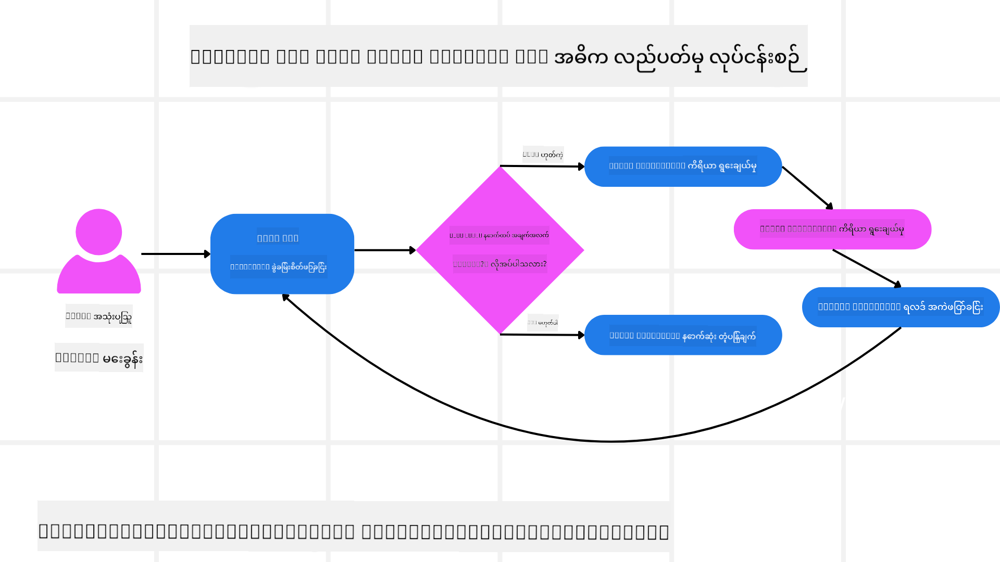
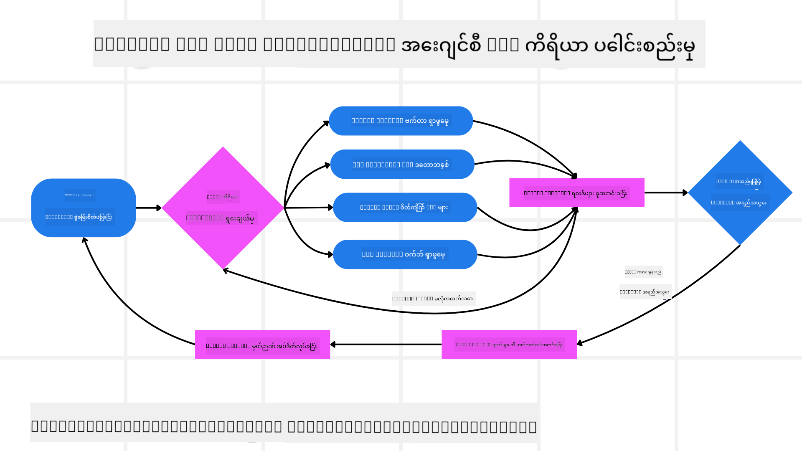

<!--
CO_OP_TRANSLATOR_METADATA:
{
  "original_hash": "7622aa72f9e676e593339f5f694ecd7d",
  "translation_date": "2025-07-12T10:15:52+00:00",
  "source_file": "05-agentic-rag/README.md",
  "language_code": "my"
}
-->

> _(ဓာတ်ပုံကိုနှိပ်၍ ဤသင်ခန်းစာ၏ ဗီဒီယိုကိုကြည့်ရှုနိုင်ပါသည်)_

# Agentic RAG

ဤသင်ခန်းစာတွင် Agentic Retrieval-Augmented Generation (Agentic RAG) အကြောင်းကို အပြည့်အစုံရှင်းလင်းပေးထားပြီး၊ ၎င်းသည် ကြီးမားသောဘာသာစကားမော်ဒယ်များ (LLMs) が ကိုယ်တိုင် လုပ်ဆောင်ရန်အစီအစဉ်များကို စီမံကိန်းချပြီး ပြင်ပအချက်အလက်များမှ သတင်းအချက်အလက်များကို ဆွဲယူသုံးစွဲသည့် AI နည်းပညာအသစ်တစ်ခုဖြစ်သည်။ ရိုးရိုးရှင်းရှင်း retrieval-then-read ပုံစံများနှင့် မတူဘဲ Agentic RAG သည် LLM ကို အကြိမ်ကြိမ်ခေါ်ယူခြင်း၊ ကိရိယာများ သို့မဟုတ် function များကို ခေါ်ယူခြင်းနှင့် ဖွဲ့စည်းထားသော output များဖြင့် အတူတကွ လုပ်ဆောင်သည်။ စနစ်သည် ရလဒ်များကို သုံးသပ်ပြီး မေးခွန်းများကို ပြန်လည်တိုးတက်စေကာ လိုအပ်ပါက ကိရိယာများကို ထပ်ခေါ်ယူပြီး စနစ်တကျဖြေရှင်းချက်တစ်ခုရရှိသည်အထိ ဒီစက်ဝိုင်းကို ဆက်လက်လုပ်ဆောင်သည်။

## နိဒါန်း

ဤသင်ခန်းစာတွင် ပါဝင်သောအကြောင်းအရာများမှာ

- **Agentic RAG ကိုနားလည်ခြင်း:** ကြီးမားသောဘာသာစကားမော်ဒယ်များ (LLMs) が ကိုယ်တိုင် လုပ်ဆောင်ရန်အစီအစဉ်များကို စီမံကိန်းချပြီး ပြင်ပဒေတာအရင်းအမြစ်များမှ သတင်းအချက်အလက်များကို ဆွဲယူသုံးစွဲသည့် AI နည်းပညာအသစ်အကြောင်း လေ့လာမည်။
- **အကြိမ်ကြိမ် Maker-Checker ပုံစံကို နားလည်ခြင်း:** LLM ကို အကြိမ်ကြိမ်ခေါ်ယူခြင်း၊ ကိရိယာ သို့မဟုတ် function များကို ခေါ်ယူခြင်းနှင့် ဖွဲ့စည်းထားသော output များဖြင့် တိုးတက်မှုနှင့် မမှန်ကန်သော မေးခွန်းများကို ကိုင်တွယ်နိုင်စေရန် ဒီစက်ဝိုင်းကို နားလည်မည်။
- **လက်တွေ့အသုံးချမှုများကို ရှာဖွေခြင်း:** Agentic RAG သည် မှန်ကန်မှုအရ ဦးစားပေးရမည့် ပတ်ဝန်းကျင်များ၊ ရှုပ်ထွေးသော ဒေတာဘေ့စ်ဆက်သွယ်မှုများနှင့် ရှည်လျားသော လုပ်ငန်းစဉ်များတွင် ထူးခြားစွာ အသုံးဝင်သည်ကို သိရှိမည်။

## သင်ယူရမည့် ရည်မှန်းချက်များ

ဤသင်ခန်းစာပြီးဆုံးပြီးနောက် သင်သည် အောက်ပါအချက်များကို သိရှိနားလည်နိုင်မည်-

- **Agentic RAG ကို နားလည်ခြင်း:** ကြီးမားသောဘာသာစကားမော်ဒယ်များ (LLMs) が ကိုယ်တိုင် လုပ်ဆောင်ရန်အစီအစဉ်များကို စီမံကိန်းချပြီး ပြင်ပဒေတာအရင်းအမြစ်များမှ သတင်းအချက်အလက်များကို ဆွဲယူသုံးစွဲသည့် AI နည်းပညာအသစ်အကြောင်း သိရှိမည်။
- **အကြိမ်ကြိမ် Maker-Checker ပုံစံ:** LLM ကို အကြိမ်ကြိမ်ခေါ်ယူခြင်း၊ ကိရိယာ သို့မဟုတ် function များကို ခေါ်ယူခြင်းနှင့် ဖွဲ့စည်းထားသော output များဖြင့် တိုးတက်မှုနှင့် မမှန်ကန်သော မေးခွန်းများကို ကိုင်တွယ်နိုင်စေရန် ဒီစက်ဝိုင်းကို နားလည်မည်။
- **အတွေးအခေါ်လုပ်ငန်းစဉ်ကို ကိုယ်ပိုင်ပိုင်ဆိုင်ခြင်း:** စနစ်သည် မူရင်းလမ်းကြောင်းများမလိုအပ်ဘဲ ပြဿနာများကို မည်သို့ဖြေရှင်းမည်ကို ကိုယ်တိုင်ဆုံးဖြတ်နိုင်မှုကို နားလည်မည်။
- **လုပ်ငန်းစဉ်:** Agentic မော်ဒယ်သည် ကိုယ်တိုင် စျေးကွက်လမ်းကြောင်းအစီအစဉ်များကို ရယူခြင်း၊ ပြိုင်ဘက်ဒေတာများကို ရှာဖွေခြင်း၊ အတွင်းပိုင်းအရောင်းအချက်အလက်များနှင့် ဆက်စပ်ခြင်း၊ ရလဒ်များကို ပေါင်းစပ်ခြင်းနှင့် မဟာဗျူဟာကို သုံးသပ်ခြင်းတို့ကို မည်သို့ ဆောင်ရွက်သည်ကို နားလည်မည်။
- **အကြိမ်ကြိမ် လုပ်ဆောင်မှုများ၊ ကိရိယာ ပေါင်းစည်းခြင်းနှင့် မှတ်ဉာဏ်:** စနစ်သည် အကြိမ်ကြိမ် ဆက်သွယ်မှု ပုံစံကို အခြေခံပြီး အဆင့်ဆင့်တွင် အခြေအနေနှင့် မှတ်ဉာဏ်ကို ထိန်းသိမ်းကာ ထပ်တလဲလဲဖြစ်မှုများကို ရှောင်ရှားပြီး သတင်းအချက်အလက်များအပေါ် အခြေခံ၍ ဆုံးဖြတ်ချက်များ ချနိုင်သည်ကို သင်ယူမည်။
- **အဆင်မပြေမှုများကို ကိုင်တွယ်ခြင်းနှင့် ကိုယ်တိုင်ပြင်ဆင်ခြင်း:** စနစ်၏ ခိုင်မာသော ကိုယ်တိုင်ပြင်ဆင်နိုင်မှုများ၊ ပြန်လည်မေးမြန်းခြင်း၊ ရှာဖွေရေးကိရိယာများ အသုံးပြုခြင်းနှင့် လူ့ကြီးကြပ်မှုကို အားထားခြင်းတို့ကို ရှာဖွေမည်။
- **အေးဂျင်စီ၏ ကန့်သတ်ချက်များ:** Agentic RAG ၏ ကန့်သတ်ချက်များကို နားလည်မည်၊ အထူးသဖြင့် ဒိုမိန်းအလိုက် ကိုယ်ပိုင် လွတ်လပ်မှု၊ အခြေခံအဆောက်အအုံပေါ် မူတည်မှုနှင့် လုံခြုံရေးစည်းကမ်းများကို လေးစားခြင်း။
- **လက်တွေ့အသုံးချမှုများနှင့် တန်ဖိုး:** Agentic RAG သည် မှန်ကန်မှုအရ ဦးစားပေးရမည့် ပတ်ဝန်းကျင်များ၊ ရှုပ်ထွေးသော ဒေတာဘေ့စ်ဆက်သွယ်မှုများနှင့် ရှည်လျားသော လုပ်ငန်းစဉ်များတွင် ထူးခြားစွာ အသုံးဝင်သည်ကို သိရှိမည်။
- **အုပ်ချုပ်မှု၊ ထင်ရှားမှုနှင့် ယုံကြည်မှု:** အုပ်ချုပ်မှုနှင့် ထင်ရှားမှု၏ အရေးပါမှု၊ ရှင်းလင်းသော အတွေးအခေါ်၊ အနုစိတ်ထိန်းချုပ်မှုနှင့် လူ့ကြီးကြပ်မှုတို့ကို သင်ယူမည်။

## Agentic RAG ဆိုတာဘာလဲ?

Agentic Retrieval-Augmented Generation (Agentic RAG) သည် ကြီးမားသောဘာသာစကားမော်ဒယ်များ (LLMs) が ကိုယ်တိုင် လုပ်ဆောင်ရန်အစီအစဉ်များကို စီမံကိန်းချပြီး ပြင်ပအချက်အလက်များမှ သတင်းအချက်အလက်များကို ဆွဲယူသုံးစွဲသည့် AI နည်းပညာအသစ်တစ်ခုဖြစ်သည်။ ရိုးရိုးရှင်းရှင်း retrieval-then-read ပုံစံများနှင့် မတူဘဲ Agentic RAG သည် LLM ကို အကြိမ်ကြိမ်ခေါ်ယူခြင်း၊ ကိရိယာ သို့မဟုတ် function များကို ခေါ်ယူခြင်းနှင့် ဖွဲ့စည်းထားသော output များဖြင့် အတူတကွ လုပ်ဆောင်သည်။ စနစ်သည် ရလဒ်များကို သုံးသပ်ပြီး မေးခွန်းများကို ပြန်လည်တိုးတက်စေကာ လိုအပ်ပါက ကိရိယာများကို ထပ်ခေါ်ယူပြီး စနစ်တကျဖြေရှင်းချက်တစ်ခုရရှိသည်အထိ ဒီစက်ဝိုင်းကို ဆက်လက်လုပ်ဆောင်သည်။ ဒီအကြိမ်ကြိမ် “maker-checker” ပုံစံသည် မှန်ကန်မှုတိုးတက်စေပြီး မမှန်ကန်သော မေးခွန်းများကို ကိုင်တွယ်နိုင်ကာ အရည်အသွေးမြင့် ရလဒ်များကို သေချာစေသည်။

စနစ်သည် ကိုယ်တိုင် အတွေးအခေါ်လုပ်ငန်းစဉ်ကို ပိုင်ဆိုင်ကာ မအောင်မြင်သော မေးခွန်းများကို ပြန်ရေးသားခြင်း၊ retrieval နည်းလမ်းများကို ပြောင်းရွှေ့ခြင်းနှင့် Azure AI Search ၏ vector search၊ SQL ဒေတာဘေ့စ်များ သို့မဟုတ် custom API များကဲ့သို့ ကိရိယာများစွာကို ပေါင်းစည်းသုံးစွဲခြင်းတို့ကို ပြုလုပ်ပြီး နောက်ဆုံးဖြေရှင်းချက်ကို ထုတ်ပေးသည်။ Agentic စနစ်၏ ထူးခြားချက်မှာ ကိုယ်တိုင် အတွေးအခေါ်လုပ်ငန်းစဉ်ကို ပိုင်ဆိုင်နိုင်ခြင်းဖြစ်သည်။ ရိုးရာ RAG များသည် ကြိုတင်သတ်မှတ်ထားသော လမ်းကြောင်းများပေါ် မူတည်သော်လည်း Agentic စနစ်သည် ရရှိသော သတင်းအချက်အလက်အရ အဆင့်ဆင့် လုပ်ဆောင်မှုများကို ကိုယ်တိုင်ဆုံးဖြတ်သည်။

## Agentic Retrieval-Augmented Generation (Agentic RAG) ကို သတ်မှတ်ခြင်း

Agentic Retrieval-Augmented Generation (Agentic RAG) သည် AI ဖွံ့ဖြိုးတိုးတက်မှုတွင် အသစ်တက်လာသော နည်းပညာတစ်ခုဖြစ်ပြီး LLM များသည် ပြင်ပဒေတာအရင်းအမြစ်များမှ သတင်းအချက်အလက်များကို ဆွဲယူသုံးစွဲခြင်းသာမက ကိုယ်တိုင် လုပ်ဆောင်ရန်အစီအစဉ်များကိုလည်း စီမံကိန်းချသည်။ ရိုးရိုးရှင်းရှင်း retrieval-then-read ပုံစံ သို့မဟုတ် ကြိုတင်ရေးသားထားသော prompt စီးရီးများနှင့် မတူဘဲ Agentic RAG သည် LLM ကို အကြိမ်ကြိမ်ခေါ်ယူခြင်း၊ ကိရိယာ သို့မဟုတ် function များကို ခေါ်ယူခြင်းနှင့် ဖွဲ့စည်းထားသော output များဖြင့် အတူတကွ လုပ်ဆောင်သည်။ စနစ်သည် ရရှိထားသော ရလဒ်များကို သုံးသပ်ကာ မေးခွန်းများကို ပြန်လည်တိုးတက်စေမည်ဟု ဆုံးဖြတ်ပြီး လိုအပ်ပါက ကိရိယာများကို ထပ်ခေါ်ယူကာ စနစ်တကျဖြေရှင်းချက်တစ်ခုရရှိသည်အထိ ဒီစက်ဝိုင်းကို ဆက်လက်လုပ်ဆောင်သည်။

ဒီအကြိမ်ကြိမ် “maker-checker” ပုံစံသည် မှန်ကန်မှုတိုးတက်စေပြီး မမှန်ကန်သော မေးခွန်းများကို (ဥပမာ NL2SQL ကဲ့သို့) ကိုင်တွယ်နိုင်ကာ အရည်အသွေးမြင့် ရလဒ်များကို သေချာစေသည်။ ကြိုတင်ရေးသားထားသော prompt စီးရီးများပေါ် မူတည်ခြင်းမဟုတ်ဘဲ စနစ်သည် ကိုယ်တိုင် အတွေးအခေါ်လုပ်ငန်းစဉ်ကို ပိုင်ဆိုင်သည်။ မအောင်မြင်သော မေးခွန်းများကို ပြန်ရေးသားနိုင်ပြီး retrieval နည်းလမ်းများကို ပြောင်းရွှေ့နိုင်ကာ Azure AI Search ၏ vector search၊ SQL ဒေတာဘေ့စ်များ သို့မဟုတ် custom API များကဲ့သို့ ကိရိယာများစွာကို ပေါင်းစည်းသုံးစွဲပြီး နောက်ဆုံးဖြေရှင်းချက်ကို ထုတ်ပေးသည်။ ၎င်းသည် အလွန်ရှုပ်ထွေးသော orchestration framework များလိုအပ်မှုကို ဖယ်ရှားပစ်သည်။ “LLM ခေါ် → ကိရိယာ အသုံးပြု → LLM ခေါ် → …” ဆိုသည့် ရိုးရှင်းသော်လည်း ထိရောက်သော စက်ဝိုင်းတစ်ခုဖြင့် အဆင့်မြင့် output များရရှိနိုင်သည်။

## အတွေးအခေါ်လုပ်ငန်းစဉ်ကို ကိုယ်ပိုင်ပိုင်ဆိုင်ခြင်း

စနစ်တစ်ခုကို “agentic” ဟု ခေါ်ဆိုစေသော ထူးခြားချက်မှာ ၎င်း၏ အတွေးအခေါ်လုပ်ငန်းစဉ်ကို ကိုယ်တိုင် ပိုင်ဆိုင်နိုင်ခြင်းဖြစ်သည်။ ရိုးရာ RAG များတွင် လူသားများက မော်ဒယ်အတွက် ရှာဖွေရန်နှင့် မည်သည့်အချိန်တွင် ရှာဖွေရမည်ကို ကြိုတင်သတ်မှတ်ထားသော chain-of-thought လမ်းကြောင်းများကို အခြေခံသည်။ သို့သော် စနစ်တစ်ခုသည် အမှန်တကယ် agentic ဖြစ်ပါက ပြဿနာကို မည်သို့ ရင်ဆိုင်မည်ကို ကိုယ်တိုင်ဆုံးဖြတ်သည်။ ၎င်းသည် script တစ်ခုကို လုပ်ဆောင်ခြင်းသာမက ရရှိသော သတင်းအချက်အလက်အရ အဆင့်ဆင့် လုပ်ဆောင်မှုများကို ကိုယ်တိုင် သတ်မှတ်သည်။

ဥပမာအားဖြင့် ထုတ်ကုန်စတင်မိတ်ဆက်မည့် မဟာဗျူဟာတစ်ခု ဖန်တီးရန် တောင်းဆိုပါက၊ အပြည့်အစုံ သုတေသနနှင့် ဆုံးဖြတ်ချက်လုပ်ငန်းစဉ်ကို ဖော်ပြထားသော prompt တစ်ခုကိုသာ မူတည်ခြင်းမဟုတ်ဘဲ agentic မော်ဒယ်သည် ကိုယ်တိုင် ဆောင်ရွက်ရန်ဆုံးဖြတ်သည်-

1. Bing Web Grounding ကို အသုံးပြု၍ လက်ရှိ စျေးကွက်လမ်းကြောင်းအစီရင်ခံစာများ ရယူခြင်း
2. Azure AI Search ကို အသုံးပြု၍ သက်ဆိုင်ရာ ပြိုင်ဘက်ဒေတာများ ရှာဖွေခြင်း
3. Azure SQL Database ကို အသုံးပြု၍ အတွင်းပိုင်း အရောင်းသမိုင်းအချက်အလက်များ ဆက်စပ်ခြင်း
4. Azure OpenAI Service မှတဆင့် ရလဒ်များကို ပေါင်းစပ်ပြီး မဟာဗျူဟာတစ်ခု ဖန်တီးခြင်း
5. မဟာဗျူဟာကို ချို့ယွင်းချက်များ သို့မဟုတ် မညီညွတ်မှုများအတွက် သုံးသပ်ပြီး လိုအပ်ပါက ထပ်မံ ရယူခြင်း

ဤအဆင့်များအားလုံးကို မော်ဒယ်သည် ကိုယ်တိုင်ဆုံးဖြတ်ပြီး လူသားက ကြိုတင်ရေးသားထားခြင်း မဟုတ်ပါ။

## အကြိမ်ကြိမ် လုပ်ဆောင်မှုများ၊ ကိရိယာ ပေါင်းစည်းခြင်းနှင့် မှတ်ဉာဏ်

Agentic စနစ်သည် အကြိမ်ကြိမ် ဆက်သွယ်မှု ပုံစံကို အခြေခံသည်-

- **အစပိုင်းခေါ်ယူမှု:** အသုံးပြုသူ၏ ရည်မှန်းချက် (user prompt) ကို LLM သို့ ပေးပို့သည်။
- **ကိရိယာ ခေါ်ယူမှု:** မော်ဒယ်သည် လိုအပ်သော သတင်းအချက်အလက် မရှိခြင်း သို့မဟုတ် မရှင်းလင်းသော ညွှန်ကြားချက်များ ရှိပါက vector database query (ဥပမာ Azure AI Search Hybrid search) သို့မဟုတ် ဖွဲ့စည်းထားသော SQL ခေါ်ယူမှုကဲ့သို့ ကိရိယာ သို့မဟုတ် retrieval နည်းလမ်းတစ်ခုကို ရွေးချယ်ကာ ပိုမိုသိရှိရန် ကြိုးစားသည်။
- **သုံးသပ်ခြင်းနှင့် ပြင်ဆင်ခြင်း:** ပြန်လာသော ဒေတာကို သုံးသပ်ပြီး သတင်းအချက်အလက် လုံလောက်မှုရှိမရှိ ဆုံးဖြတ်သည်။ မလုံလောက်ပါက မေးခွန်းကို ပြန်လည်တိုးတက်စေခြင်း၊ ကိရိယာအသစ်ကို

- <a href="https://learn.microsoft.com/azure/ai-studio/concepts/evaluation-approach-gen-ai" target="_blank">Azure AI Foundry ဖြင့် generative AI အပလီကေးရှင်းများကို အကဲဖြတ်ခြင်း: ဒီဆောင်းပါးမှာ Agentic AI အပလီကေးရှင်းများနဲ့ RAG ဖွဲ့စည်းမှုများအပါအဝင် ပြည်သူလူထုအသုံးပြုနိုင်တဲ့ ဒေတာစနစ်များပေါ်မှာ မော်ဒယ်များကို အကဲဖြတ်နှိုင်းယှဉ်ခြင်းကို ဖော်ပြထားသည်</a>
- <a href="https://weaviate.io/blog/what-is-agentic-rag" target="_blank">Agentic RAG ဆိုတာဘာလဲ | Weaviate</a>
- <a href="https://ragaboutit.com/agentic-rag-a-complete-guide-to-agent-based-retrieval-augmented-generation/" target="_blank">Agentic RAG: Agent အခြေခံ Retrieval Augmented Generation အတွက် ပြည့်စုံသောလမ်းညွှန် – generation RAG မှ သတင်းများ</a>
- <a href="https://huggingface.co/learn/cookbook/agent_rag" target="_blank">Agentic RAG: မေးခွန်းပြန်လည်ဖွဲ့စည်းခြင်းနဲ့ ကိုယ်တိုင်မေးခွန်းမေးခြင်းဖြင့် RAG ကို အရှိန်မြှင့်ပါ! Hugging Face Open-Source AI Cookbook</a>
- <a href="https://youtu.be/aQ4yQXeB1Ss?si=2HUqBzHoeB5tR04U" target="_blank">RAG တွင် Agentic အလွှာများ ထည့်သွင်းခြင်း</a>
- <a href="https://www.youtube.com/watch?v=zeAyuLc_f3Q&t=244s" target="_blank">အသိပညာအကူအညီပေးသူများ၏ အနာဂတ်: Jerry Liu</a>
- <a href="https://www.youtube.com/watch?v=AOSjiXP1jmQ" target="_blank">Agentic RAG စနစ်များကို ဘယ်လို တည်ဆောက်မလဲ</a>
- <a href="https://ignite.microsoft.com/sessions/BRK102?source=sessions" target="_blank">Azure AI Foundry Agent Service ကို အသုံးပြုပြီး သင့် AI agent များကို တိုးချဲ့ခြင်း</a>

### ပညာရေးစာတမ်းများ

- <a href="https://arxiv.org/abs/2303.17651" target="_blank">2303.17651 Self-Refine: ကိုယ်တိုင်တုံ့ပြန်ချက်ဖြင့် အဆင့်ဆင့် ပြုပြင်တိုးတက်မှု</a>
- <a href="https://arxiv.org/abs/2303.11366" target="_blank">2303.11366 Reflexion: စကားပြောအားဖြင့် အားပေးသင်ယူမှုပါ Language Agents</a>
- <a href="https://arxiv.org/abs/2305.11738" target="_blank">2305.11738 CRITIC: ကြီးမားသော ဘာသာစကားမော်ဒယ်များသည် ကိရိယာနှင့် အပြန်အလှန် သုံးသပ်ခြင်းဖြင့် ကိုယ်တိုင်မှားယွင်းချက်များကို ပြင်ဆင်နိုင်သည်</a>
- <a href="https://arxiv.org/abs/2501.09136" target="_blank">2501.09136 Agentic Retrieval-Augmented Generation: Agentic RAG အပေါ် စစ်တမ်းတစ်ခု</a>

## ယခင်သင်ခန်းစာ

[Tool Use Design Pattern](../04-tool-use/README.md)

## နောက်တစ်ခန်း

[Building Trustworthy AI Agents](../06-building-trustworthy-agents/README.md)

**အကြောင်းကြားချက်**  
ဤစာတမ်းကို AI ဘာသာပြန်ဝန်ဆောင်မှု [Co-op Translator](https://github.com/Azure/co-op-translator) ဖြင့် ဘာသာပြန်ထားပါသည်။ ကျွန်ုပ်တို့သည် တိကျမှန်ကန်မှုအတွက် ကြိုးစားသော်လည်း၊ အလိုအလျောက် ဘာသာပြန်ခြင်းသည် အမှားများ သို့မဟုတ် မှားယွင်းချက်များ ပါဝင်နိုင်ကြောင်း သတိပြုပါရန် မေတ္တာရပ်ခံအပ်ပါသည်။ မူရင်းစာတမ်းကို မိမိဘာသာစကားဖြင့်သာ တရားဝင်အချက်အလက်အဖြစ် ယူဆသင့်ပါသည်။ အရေးကြီးသော အချက်အလက်များအတွက် လူ့ဘာသာပြန်သူ ပညာရှင်များ၏ ဘာသာပြန်မှုကို အကြံပြုပါသည်။ ဤဘာသာပြန်ချက်ကို အသုံးပြုမှုကြောင့် ဖြစ်ပေါ်လာနိုင်သည့် နားလည်မှုမှားယွင်းမှုများအတွက် ကျွန်ုပ်တို့ တာဝန်မယူပါ။