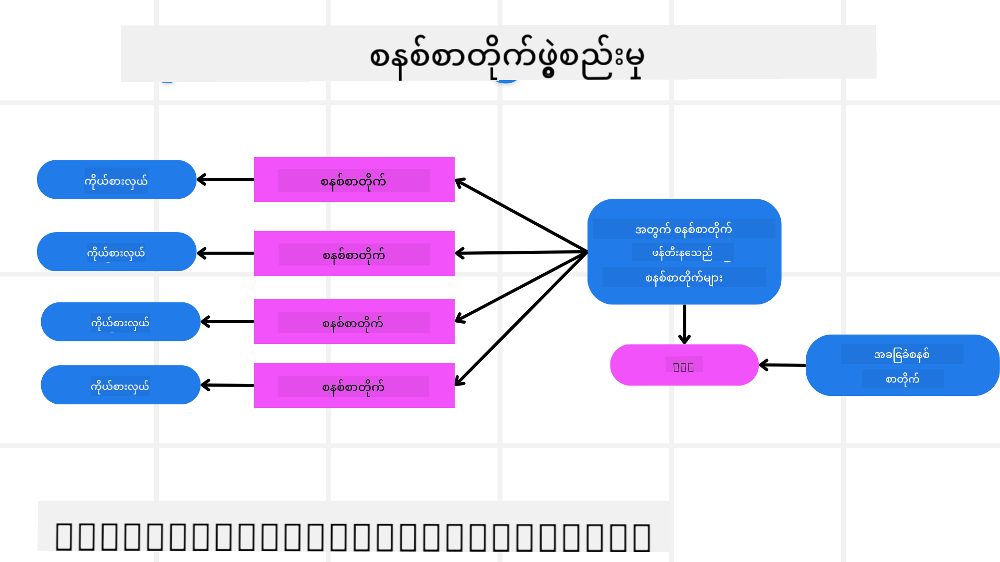
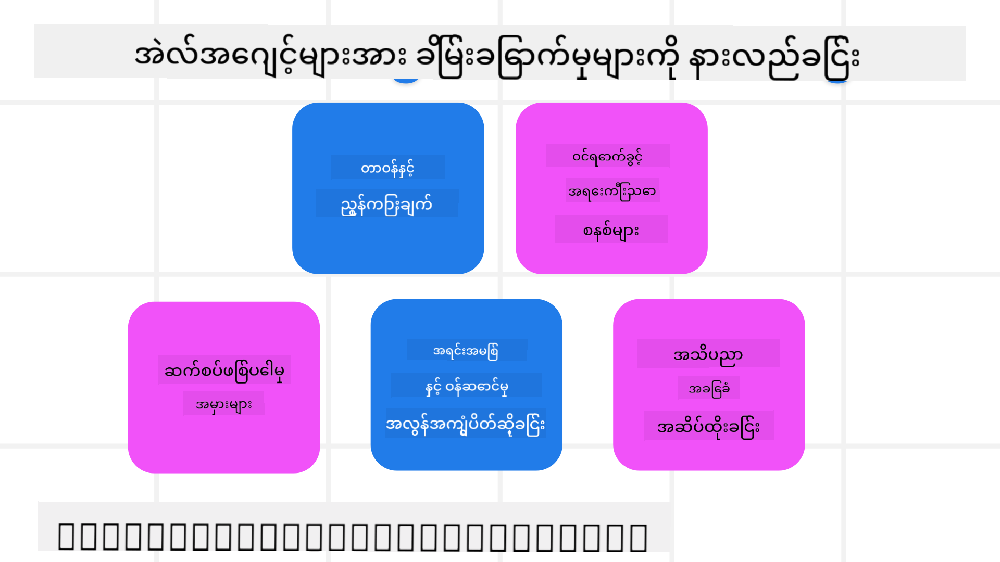
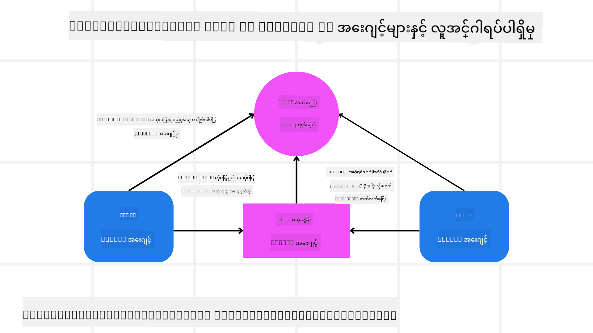

<!--
CO_OP_TRANSLATOR_METADATA:
{
  "original_hash": "f57852cac3a86c4a5ef47f793cc12178",
  "translation_date": "2025-07-12T10:33:46+00:00",
  "source_file": "06-building-trustworthy-agents/README.md",
  "language_code": "my"
}
-->
[](https://youtu.be/iZKkMEGBCUQ?si=Q-kEbcyHUMPoHp8L)

> _(ဓာတ်ပုံကိုနှိပ်၍ ဤသင်ခန်းစာ၏ ဗီဒီယိုကိုကြည့်ရှုနိုင်ပါသည်)_

# ယုံကြည်စိတ်ချရသော AI Agents တည်ဆောက်ခြင်း

## နိဒါန်း

ဤသင်ခန်းစာတွင် ပါဝင်မည့်အကြောင်းအရာများမှာ -

- ဘယ်လိုလုံခြုံပြီး ထိရောက်သော AI Agents များကို တည်ဆောက်ပြီး ထုတ်လုပ်မည်နည်း
- AI Agents ဖန်တီးရာတွင် အရေးကြီးသော လုံခြုံရေးစဉ်းစားချက်များ
- AI Agents ဖန်တီးရာတွင် ဒေတာနှင့် အသုံးပြုသူကိုယ်ရေးအချက်အလက်ကို မည်သို့ ထိန်းသိမ်းမည်နည်း

## သင်ယူရမည့် ရည်မှန်းချက်များ

ဤသင်ခန်းစာပြီးဆုံးပြီးနောက် သင်သည် -

- AI Agents ဖန်တီးရာတွင် ဖြစ်ပေါ်နိုင်သော အန္တရာယ်များကို ဖော်ထုတ်ပြီး လျော့နည်းစေမည့် နည်းလမ်းများကို သိရှိနိုင်မည်။
- ဒေတာနှင့် ဝင်ရောက်ခွင့်များကို မှန်ကန်စွာ စီမံခန့်ခွဲရန် လုံခြုံရေးအဆင့်များကို အကောင်အထည်ဖော်နိုင်မည်။
- ဒေတာကိုယ်ရေးအချက်အလက်ကို ထိန်းသိမ်းပြီး အသုံးပြုသူအတွေ့အကြုံကောင်းမွန်စေရန် AI Agents များကို ဖန်တီးနိုင်မည်။

## လုံခြုံရေး

ပထမဦးဆုံး လုံခြုံသော agentic applications များကို တည်ဆောက်ခြင်းကို ကြည့်ကြရအောင်။ လုံခြုံရေးဆိုသည်မှာ AI agent သည် ရည်ရွယ်ချက်အတိုင်း လုပ်ဆောင်နိုင်ခြင်းဖြစ်သည်။ agentic applications များကို တည်ဆောက်သူများအနေနှင့် လုံခြုံရေးကို အများဆုံးမြှင့်တင်ရန် နည်းလမ်းများနှင့် ကိရိယာများရှိပါသည်။

### System Message Framework တည်ဆောက်ခြင်း

သင်သည် Large Language Models (LLMs) ကို အသုံးပြု၍ AI application တစ်ခု ဖန်တီးဖူးပါက၊ ခိုင်မာသော system prompt သို့မဟုတ် system message တစ်ခု ဒီဇိုင်းဆွဲခြင်း၏ အရေးပါမှုကို သိရှိပြီးဖြစ်ပါသည်။ ဤ prompt များသည် LLM သည် အသုံးပြုသူနှင့် ဒေတာကို မည်သို့ ဆက်သွယ်ဆောင်ရွက်မည်ကို သတ်မှတ်သည့် စည်းမျဉ်းများ၊ ညွှန်ကြားချက်များနှင့် လမ်းညွှန်ချက်များကို ဖန်တီးပေးသည်။

AI Agents များအတွက် system prompt သည် ပိုမိုအရေးကြီးသည်၊ အကြောင်းမှာ AI Agents များသည် ကျွန်ုပ်တို့ ရည်ရွယ်ထားသော အလုပ်များကို ပြီးမြောက်စေရန် အထူးသီးသန့် ညွှန်ကြားချက်များ လိုအပ်မည်ဖြစ်သည်။

System prompts များကို တိုးချဲ့နိုင်ရန်၊ ကျွန်ုပ်တို့၏ application တွင် agent တစ်ခု သို့မဟုတ် အများအပြား ဖန်တီးရာတွင် အသုံးပြုနိုင်သော system message framework တစ်ခုကို အသုံးပြုနိုင်ပါသည်။



#### အဆင့် ၁: Meta System Message တစ်ခု ဖန်တီးပါ

Meta prompt သည် LLM ကို အသုံးပြု၍ ကျွန်ုပ်တို့ ဖန်တီးမည့် agents များအတွက် system prompts များကို ထုတ်ပေးရန် အသုံးပြုမည်ဖြစ်သည်။ အများအပြား agent များကို ထိရောက်စွာ ဖန်တီးနိုင်ရန် template အဖြစ် ဒီဇိုင်းဆွဲထားသည်။

LLM ကို ပေးမည့် meta system message ၏ ဥပမာ -

```plaintext
You are an expert at creating AI agent assistants. 
You will be provided a company name, role, responsibilities and other
information that you will use to provide a system prompt for.
To create the system prompt, be descriptive as possible and provide a structure that a system using an LLM can better understand the role and responsibilities of the AI assistant. 
```

#### အဆင့် ၂: အခြေခံ prompt တစ်ခု ဖန်တီးပါ

နောက်တစ်ဆင့်မှာ AI Agent ကို ဖော်ပြသည့် အခြေခံ prompt တစ်ခု ဖန်တီးခြင်းဖြစ်သည်။ Agent ၏ အခန်းကဏ္ဍ၊ ပြီးမြောက်ရမည့် အလုပ်များနှင့် တာဝန်များကို ထည့်သွင်းရေးသားသင့်သည်။

ဥပမာ -

```plaintext
You are a travel agent for Contoso Travel that is great at booking flights for customers. To help customers you can perform the following tasks: lookup available flights, book flights, ask for preferences in seating and times for flights, cancel any previously booked flights and alert customers on any delays or cancellations of flights.  
```

#### အဆင့် ၃: အခြေခံ System Message ကို LLM သို့ ပေးပါ

ယခုအခါ meta system message ကို system message အဖြစ်နှင့် ကျွန်ုပ်တို့၏ အခြေခံ system message ကို ပေး၍ ဤ system message ကို အကောင်းဆုံး အတိုင်း ပြင်ဆင်နိုင်ပါပြီ။

ဤနည်းဖြင့် AI agents များကို လမ်းညွှန်ရန် ပိုမိုကောင်းမွန်သော system message တစ်ခု ထုတ်ပေးမည်ဖြစ်သည်။

```markdown
**Company Name:** Contoso Travel  
**Role:** Travel Agent Assistant

**Objective:**  
You are an AI-powered travel agent assistant for Contoso Travel, specializing in booking flights and providing exceptional customer service. Your main goal is to assist customers in finding, booking, and managing their flights, all while ensuring that their preferences and needs are met efficiently.

**Key Responsibilities:**

1. **Flight Lookup:**
    
    - Assist customers in searching for available flights based on their specified destination, dates, and any other relevant preferences.
    - Provide a list of options, including flight times, airlines, layovers, and pricing.
2. **Flight Booking:**
    
    - Facilitate the booking of flights for customers, ensuring that all details are correctly entered into the system.
    - Confirm bookings and provide customers with their itinerary, including confirmation numbers and any other pertinent information.
3. **Customer Preference Inquiry:**
    
    - Actively ask customers for their preferences regarding seating (e.g., aisle, window, extra legroom) and preferred times for flights (e.g., morning, afternoon, evening).
    - Record these preferences for future reference and tailor suggestions accordingly.
4. **Flight Cancellation:**
    
    - Assist customers in canceling previously booked flights if needed, following company policies and procedures.
    - Notify customers of any necessary refunds or additional steps that may be required for cancellations.
5. **Flight Monitoring:**
    
    - Monitor the status of booked flights and alert customers in real-time about any delays, cancellations, or changes to their flight schedule.
    - Provide updates through preferred communication channels (e.g., email, SMS) as needed.

**Tone and Style:**

- Maintain a friendly, professional, and approachable demeanor in all interactions with customers.
- Ensure that all communication is clear, informative, and tailored to the customer's specific needs and inquiries.

**User Interaction Instructions:**

- Respond to customer queries promptly and accurately.
- Use a conversational style while ensuring professionalism.
- Prioritize customer satisfaction by being attentive, empathetic, and proactive in all assistance provided.

**Additional Notes:**

- Stay updated on any changes to airline policies, travel restrictions, and other relevant information that could impact flight bookings and customer experience.
- Use clear and concise language to explain options and processes, avoiding jargon where possible for better customer understanding.

This AI assistant is designed to streamline the flight booking process for customers of Contoso Travel, ensuring that all their travel needs are met efficiently and effectively.

```

#### အဆင့် ၄: ပြန်လည်ပြင်ဆင်ပြီး တိုးတက်အောင်လုပ်ပါ

ဤ system message framework ၏ အဓိကတန်ဖိုးမှာ အများအပြား agent များအတွက် system messages များကို ပိုမိုလွယ်ကူစွာ တိုးချဲ့ဖန်တီးနိုင်ခြင်းနှင့် သင့် system messages များကို အချိန်အလိုက် တိုးတက်ကောင်းမွန်အောင် ပြင်ဆင်နိုင်ခြင်းဖြစ်သည်။ သင့်အသုံးပြုမှုအတွက် ပထမဆုံးကြိမ်တွင် အလုပ်ဖြစ်မည့် system message ကို ရရှိရန် များသောအားဖြင့် မဖြစ်နိုင်ပါ။ အခြေခံ system message ကို ပြောင်းလဲပြီး system မှတဆင့် ပြန်လည်စစ်ဆေးခြင်းဖြင့် ရလဒ်များကို နှိုင်းယှဉ်သုံးသပ်နိုင်ပါသည်။

## အန္တရာယ်များကို နားလည်ခြင်း

ယုံကြည်စိတ်ချရသော AI agents များ ဖန်တီးရန်အတွက် သင့် AI agent ကို ဖြစ်ပေါ်နိုင်သော အန္တရာယ်များနှင့် ခြိမ်းခြောက်မှုများကို နားလည်ပြီး လျော့နည်းစေရန် အရေးကြီးပါသည်။ AI agents များကို ခြိမ်းခြောက်နိုင်သော အန္တရာယ်အမျိုးမျိုးအနည်းငယ်ကိုသာ ကြည့်ရှုကြမည်ဖြစ်ပြီး၊ သင်သည် မည်သို့ ပိုမိုကောင်းမွန်စွာ စီမံကိန်းရေးဆွဲပြီး ပြင်ဆင်နိုင်မည်ကိုလည်း ဖော်ပြပါမည်။



### အလုပ်နှင့် ညွှန်ကြားချက်

**ဖော်ပြချက်**: တိုက်ခိုက်သူများသည် AI agent ၏ ညွှန်ကြားချက်များ သို့မဟုတ် ရည်မှန်းချက်များကို prompt များဖြင့် ပြောင်းလဲရန် သို့မဟုတ် input များကို လှည့်စားရန် ကြိုးပမ်းသည်။

**လျော့နည်းစေရန်**: AI Agent မှ စီမံခန့်ခွဲမည့် prompt များကို လက်ခံမီ အန္တရာယ်ရှိနိုင်သော prompt များကို စစ်ဆေးရန် validation နှင့် input filter များကို အကောင်အထည်ဖော်ပါ။ ဤတိုက်ခိုက်မှုများသည် အများအားဖြင့် Agent နှင့် မကြာခဏ ဆက်သွယ်မှုလိုအပ်သောကြောင့် စကားပြောပွဲအကြိမ်ရေကို ကန့်သတ်ခြင်းဖြင့်လည်း တိုက်ခိုက်မှုများကို ကာကွယ်နိုင်ပါသည်။

### အရေးကြီးသော စနစ်များသို့ ဝင်ရောက်ခွင့်

**ဖော်ပြချက်**: AI agent သည် အချက်အလက်များကို သိမ်းဆည်းထားသော စနစ်များနှင့် ဝန်ဆောင်မှုများသို့ ဝင်ရောက်ခွင့်ရှိပါက တိုက်ခိုက်သူများသည် agent နှင့် ထိုဝန်ဆောင်မှုများအကြား ဆက်သွယ်မှုကို ချိုးဖောက်နိုင်သည်။ ဤတိုက်ခိုက်မှုများသည် တိုက်ရိုက်တိုက်ခိုက်မှုများ သို့မဟုတ် agent မှတဆင့် ထိုစနစ်များအကြောင်း အချက်အလက် ရယူရန် ကြိုးပမ်းမှုများ ဖြစ်နိုင်သည်။

**လျော့နည်းစေရန်**: AI agents များသည် လိုအပ်သည့်အခါတွင်သာ စနစ်များသို့ ဝင်ရောက်ခွင့်ရှိရမည်။ agent နှင့် စနစ်အကြား ဆက်သွယ်မှုသည်လည်း လုံခြုံစေရန် လိုအပ်သည်။ အတည်ပြုခြင်းနှင့် ဝင်ရောက်ခွင့်ထိန်းချုပ်မှုများကို အကောင်အထည်ဖော်ခြင်းဖြင့် ဤအချက်များကို ကာကွယ်နိုင်ပါသည်။

### အရင်းအမြစ်နှင့် ဝန်ဆောင်မှုများ ပမာဏကျော်လွန်ခြင်း

**ဖော်ပြချက်**: AI agents များသည် အလုပ်များ ပြီးမြောက်ရန် ကိရိယာများနှင့် ဝန်ဆောင်မှုများကို အသုံးပြုနိုင်သည်။ တိုက်ခိုက်သူများသည် AI Agent မှတဆင့် တောင်းဆိုမှုများ အများအပြား ပေးပို့ခြင်းဖြင့် ဤဝန်ဆောင်မှုများကို တိုက်ခိုက်နိုင်ပြီး စနစ်ပျက်ကွက်မှုများ သို့မဟုတ် ကုန်ကျစရိတ်များ မြင့်တက်စေနိုင်သည်။

**လျော့နည်းစေရန်**: AI agent တစ်ခုမှ ဝန်ဆောင်မှုတစ်ခုသို့ တောင်းဆိုမှုအရေအတွက်ကို ကန့်သတ်ရန် မူဝါဒများ ထည့်သွင်းပါ။ စကားပြောပွဲအကြိမ်ရေ နှင့် AI agent သို့ တောင်းဆိုမှုများကို ကန့်သတ်ခြင်းဖြင့်လည်း ဤတိုက်ခိုက်မှုများကို ကာကွယ်နိုင်ပါသည်။

### သိပ္ပံအခြေခံ ဒေတာပျက်စီးခြင်း

**ဖော်ပြချက်**: ဤတိုက်ခိုက်မှုသည် AI agent ကို တိုက်ရိုက် မဟုတ်ပဲ AI agent သုံးမည့် သိပ္ပံအခြေခံ ဒေတာနှင့် အခြားဝန်ဆောင်မှုများကို ပစ်မှတ်ထားသည်။ ဒေတာများကို ပျက်စီးစေခြင်း သို့မဟုတ် အချက်အလက်များကို မမှန်ကန်စွာ ပြောင်းလဲခြင်းဖြင့် အသုံးပြုသူထံ မမှန်ကန်သော သို့မဟုတ် မရည်ရွယ်ထားသော တုံ့ပြန်ချက်များ ပေးစေနိုင်သည်။

**လျော့နည်းစေရန်**: AI agent ၏ လုပ်ငန်းစဉ်များတွင် အသုံးပြုမည့် ဒေတာများကို ပုံမှန်စစ်ဆေးပါ။ ဤဒေတာများသို့ ဝင်ရောက်ခွင့်ကို ယုံကြည်စိတ်ချရသော ပုဂ္ဂိုလ်များမှသာ ပြောင်းလဲနိုင်ရန် လုံခြုံစေရန် အာမခံပါ။

### အမှားများ ဆက်တိုက်ဖြစ်ပွားခြင်း

**ဖော်ပြချက်**: AI agents များသည် အလုပ်များ ပြီးမြောက်ရန် ကိရိယာများနှင့် ဝန်ဆောင်မှုများကို အသုံးပြုသည်။ တိုက်ခိုက်သူများကြောင့် ဖြစ်ပေါ်သော အမှားများသည် AI agent ဆက်သွယ်ထားသော အခြားစနစ်များ ပျက်ကွက်မှုများ ဖြစ်စေပြီး တိုက်ခိုက်မှုသည် ပိုမိုကျယ်ပြန့်ပြီး ပြုပြင်ရန် ခက်ခဲစေသည်။

**လျော့နည်းစေရန်**: AI Agent ကို ကန့်သတ်ထားသော ပတ်ဝန်းကျင်တွင် လုပ်ဆောင်စေခြင်း (ဥပမာ Docker container တွင် အလုပ်လုပ်ခြင်း) ဖြင့် တိုက်ရိုက်စနစ်တိုက်ခိုက်မှုများကို ကာကွယ်နိုင်သည်။ အချို့စနစ်များမှ အမှားတုံ့ပြန်မှု ရရှိပါက ပြန်လည်ကြိုးစားခြင်းနှင့် အစားထိုးစနစ်များ ဖန်တီးခြင်းသည် စနစ်ပျက်ကွက်မှုများကို လျော့နည်းစေသည်။

## Human-in-the-Loop

ယုံကြည်စိတ်ချရသော AI Agent စနစ်များ တည်ဆောက်ရာတွင် Human-in-the-loop ကို အသုံးပြုခြင်းသည် ထိရောက်သော နည်းလမ်းတစ်ခုဖြစ်သည်။ ဤနည်းလမ်းသည် အသုံးပြုသူများအား AI Agents များ လည်ပတ်စဉ်တွင် တုံ့ပြန်ချက်ပေးနိုင်စေပြီး၊ အသုံးပြုသူများသည် multi-agent စနစ်တွင် agent အဖြစ် လုပ်ဆောင်ကာ လည်ပတ်မှုကို အတည်ပြုခြင်း သို့မဟုတ် ရပ်ဆိုင်းခြင်း ပြုလုပ်နိုင်သည်။



AutoGen ကို အသုံးပြု၍ ဤအယူအဆကို မည်သို့ အကောင်အထည်ဖော်ထားသည်ကို ပြသသည့် ကုဒ်အပိုင်း -

```python

# Create the agents.
model_client = OpenAIChatCompletionClient(model="gpt-4o-mini")
assistant = AssistantAgent("assistant", model_client=model_client)
user_proxy = UserProxyAgent("user_proxy", input_func=input)  # Use input() to get user input from console.

# Create the termination condition which will end the conversation when the user says "APPROVE".
termination = TextMentionTermination("APPROVE")

# Create the team.
team = RoundRobinGroupChat([assistant, user_proxy], termination_condition=termination)

# Run the conversation and stream to the console.
stream = team.run_stream(task="Write a 4-line poem about the ocean.")
# Use asyncio.run(...) when running in a script.
await Console(stream)

```

## နိဂုံးချုပ်

ယုံကြည်စိတ်ချရသော AI agents များ တည်ဆောက်ရန် အတွက် သေချာစွာ ဒီဇိုင်းဆွဲခြင်း၊ ခိုင်မာသော လုံခြုံရေးအဆင့်များ ထည့်သွင်းခြင်းနှင့် ဆက်တိုက် ပြင်ဆင်တိုးတက်မှုများ လိုအပ်ပါသည်။ ဖွဲ့စည်းထားသော meta prompting စနစ်များကို အကောင်အထည်ဖော်ခြင်း၊ ဖြစ်နိုင်သော အန္တရာယ်များကို နားလည်ခြင်းနှင့် လျော့နည်းစေရန် နည်းလမ်းများကို အသုံးပြုခြင်းဖြင့် လုံခြုံပြီး ထိရောက်သော AI agents များ ဖန်တီးနိုင်ပါသည်။ ထို့အပြင် human-in-the-loop နည်းလမ်းကို ထည့်သွင်းခြင်းဖြင့် AI agents များသည် အသုံးပြုသူလိုအပ်ချက်များနှင့် ကိုက်ညီနေပြီး အန္တရာယ်များကို လျော့နည်းစေပါသည်။ AI နည်းပညာ တိုးတက်လာသည့်အခါ လုံခြုံရေး၊ ကိုယ်ရေးအချက်အလက်နှင့် သမာဓိဆိုင်ရာ စဉ်းစားချက်များကို ကြိုတင်ကာကွယ်ဆောင်ရွက်ခြင်းသည် AI စနစ်များတွင် ယုံကြည်စိတ်ချမှုနှင့် ယုံကြည်မှုရှိမှုကို တည်ဆောက်ရန် အဓိကဖြစ်ပါသည်။

## အပိုဆောင်း အရင်းအမြစ်များ

- <a href="https://learn.microsoft.com/azure/ai-studio/responsible-use-of-ai-overview" target="_blank">Responsible AI overview</a>
- <a href="https://learn.microsoft.com/azure/ai-studio/concepts/evaluation-approach-gen-ai" target="_blank">Evaluation of generative AI models and AI applications</a>
- <a href="https://learn.microsoft.com/azure/ai-services/openai/concepts/system-message?context=%2Fazure%2Fai-studio%2Fcontext%2Fcontext&tabs=top-techniques" target="_blank">Safety system messages</a>
- <a href="https://blogs.microsoft.com/wp-content/uploads/prod/sites/5/2022/06/Microsoft-RAI-Impact-Assessment-Template.pdf?culture=en-us&country=us" target="_blank">Risk Assessment Template</a>

## ယခင်သင်ခန်းစာ

[Agentic RAG](../05-agentic-rag/README.md)

## နောက်တစ်ခု သင်ခန်းစာ

[Planning Design Pattern](../07-planning-design/README.md)

**အကြောင်းကြားချက်**  
ဤစာတမ်းကို AI ဘာသာပြန်ဝန်ဆောင်မှု [Co-op Translator](https://github.com/Azure/co-op-translator) ဖြင့် ဘာသာပြန်ထားပါသည်။ ကျွန်ုပ်တို့သည် တိကျမှန်ကန်မှုအတွက် ကြိုးစားသော်လည်း၊ အလိုအလျောက် ဘာသာပြန်ခြင်းသည် အမှားများ သို့မဟုတ် မှားယွင်းချက်များ ပါဝင်နိုင်ကြောင်း သတိပြုပါရန် မေတ္တာရပ်ခံအပ်ပါသည်။ မူရင်းစာတမ်းကို မိမိဘာသာစကားဖြင့်သာ တရားဝင်အချက်အလက်အဖြစ် ယူဆသင့်ပါသည်။ အရေးကြီးသော အချက်အလက်များအတွက် လူ့ဘာသာပြန်ပညာရှင်မှ ဘာသာပြန်ခြင်းကို အကြံပြုပါသည်။ ဤဘာသာပြန်ချက်ကို အသုံးပြုရာမှ ဖြစ်ပေါ်လာနိုင်သည့် နားလည်မှုမှားယွင်းမှုများအတွက် ကျွန်ုပ်တို့သည် တာဝန်မယူပါ။