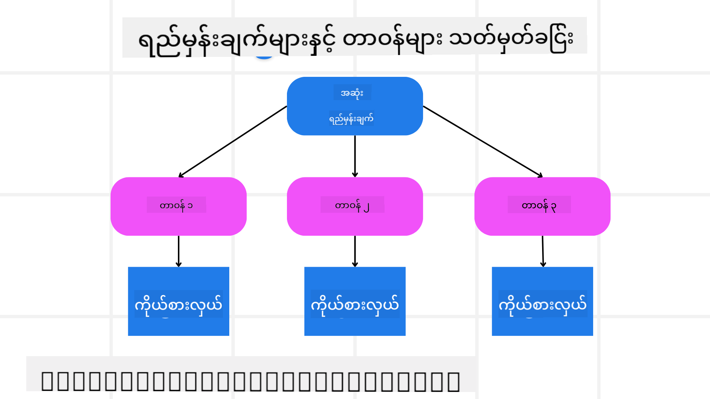

<!--
CO_OP_TRANSLATOR_METADATA:
{
  "original_hash": "a28d30590704ea13b6a08d4793cf9c2b",
  "translation_date": "2025-08-30T00:04:47+00:00",
  "source_file": "07-planning-design/README.md",
  "language_code": "my"
}
-->

> _(ဤရုပ်ပုံကိုနှိပ်၍ ဒီသင်ခန်းစာ၏ ဗီဒီယိုကို ကြည့်ရှုပါ)_

# အစီအစဉ်ရေးဆွဲမှု ဒီဇိုင်း

## နိဒါန်း

ဒီသင်ခန်းစာမှာ အောက်ပါအကြောင်းအရာများကို ဖော်ပြပါမည်-

* ရှင်းလင်းသော အထွေထွေရည်မှန်းချက်ကို သတ်မှတ်ပြီး စိမ်းလန်းသော အလုပ်ကို စီမံနိုင်သော အလုပ်များအဖြစ် ခွဲခြားခြင်း။
* ယုံကြည်စိတ်ချရပြီး စက်ကိရိယာများဖတ်ရှုနိုင်သော အဖြေများအတွက် ဖွဲ့စည်းထားသော အထွက်ကို အသုံးချခြင်း။
* အဖြစ်မှန်အလုပ်များနှင့် မမျှော်လင့်ထားသော အထည့်များကို ကိုင်တွယ်ရန် အဖြစ်အပျက်အခြေခံ လုပ်ဆောင်မှုကို အသုံးပြုခြင်း။

## သင်ယူရမည့် ရည်မှန်းချက်များ

ဒီသင်ခန်းစာကို ပြီးဆုံးပြီးနောက် သင်သည် အောက်ပါအရာများကို နားလည်မည်-

* AI အေးဂျင့်တစ်ယောက်အတွက် ရည်မှန်းချက်တစ်ခုကို သတ်မှတ်ပြီး၊ ဘာကို အောင်မြင်ရမည်ကို ရှင်းလင်းစွာ သိရှိစေရန်။
* စိမ်းလန်းသော အလုပ်တစ်ခုကို စီမံနိုင်သော အလုပ်ငယ်များအဖြစ် ခွဲခြားပြီး၊ အကျိုးရှိစွာ အစီအစဉ်တစ်ခုအဖြစ် စီစဉ်ခြင်း။
* အေးဂျင့်များကို လိုအပ်သော ကိရိယာများ (ဥပမာ- ရှာဖွေမှုကိရိယာများ သို့မဟုတ် ဒေတာခွဲခြမ်းစိတ်ဖြာမှုကိရိယာများ) ဖြင့် ပြည့်စုံစွာ ပြင်ဆင်ပေးပြီး၊ အချိန်နှင့် နည်းလမ်းကို ဆုံးဖြတ်ခြင်းနှင့် မမျှော်လင့်ထားသော အခြေအနေများကို ကိုင်တွယ်ခြင်း။
* အလုပ်ငယ်များ၏ အောင်မြင်မှုကို သုံးသပ်ပြီး၊ လုပ်ဆောင်မှုများကို ပြန်လည်ဆန်းစစ်ကာ နောက်ဆုံးထွက်ရလဒ်ကို တိုးတက်အောင် ပြုလုပ်ခြင်း။

## ရည်မှန်းချက် သတ်မှတ်ခြင်းနှင့် အလုပ်ခွဲခြားခြင်း

အများစုသော အဖြစ်မှန်အလုပ်များသည် တစ်ဆင့်တည်းဖြင့် ဖြေရှင်းရန် အလွန်ရှုပ်ထွေးလွန်းသည်။ AI အေးဂျင့်တစ်ယောက်အတွက် ၎င်း၏ အစီအစဉ်ရေးဆွဲမှုနှင့် လုပ်ဆောင်မှုများကို လမ်းညွှန်ရန် ရှင်းလင်းသော ရည်မှန်းချက်တစ်ခု လိုအပ်သည်။ ဥပမာအားဖြင့်-

    "၃ ရက်ခရီးစဉ် အစီအစဉ်တစ်ခု ဖန်တီးပါ။"

ဤရည်မှန်းချက်သည် ရိုးရှင်းစွာ ဖော်ပြနိုင်သော်လည်း၊ ထို့အပြင် ပိုမိုသေချာစေရန် လိုအပ်သည်။ ရည်မှန်းချက်သည် ပိုရှင်းလင်းလျှင် အေးဂျင့် (နှင့် လူ့ပူးပေါင်းသူများ) သည် မှန်ကန်သော ရလဒ်ကို ရရှိရန် ပိုမိုအာရုံစိုက်နိုင်မည်ဖြစ်သည်။ ဥပမာအားဖြင့် လေယာဉ်ခရီးစဉ်ရွေးချယ်မှုများ၊ ဟိုတယ်အကြံပြုချက်များနှင့် လှုပ်ရှားမှုအကြံပြုချက်များပါဝင်သည့် စုံလင်သော အစီအစဉ်တစ်ခု ဖန်တီးခြင်း။

### အလုပ်ခွဲခြားခြင်း

ကြီးမားသော သို့မဟုတ် ရှုပ်ထွေးသော အလုပ်များကို သေးငယ်သော ရည်မှန်းချက်အလုပ်ငယ်များအဖြစ် ခွဲခြားခြင်းဖြင့် ပိုမိုစီမံနိုင်စေသည်။
ခရီးစဉ်အစီအစဉ် ဥပမာအတွက်၊ ရည်မှန်းချက်ကို အောက်ပါအတိုင်း ခွဲခြားနိုင်သည်-

* လေယာဉ်စာရင်းသွင်းခြင်း
* ဟိုတယ်စာရင်းသွင်းခြင်း
* ကားငှားခြင်း
* ကိုယ်ပိုင်လိုက်လျောမှု

အလုပ်ငယ်တစ်ခုစီကို ထူးခြားသော အေးဂျင့်များ သို့မဟုတ် လုပ်ငန်းစဉ်များဖြင့် ကိုင်တွယ်နိုင်သည်။ ဥပမာအားဖြင့် လေယာဉ်ခရီးစဉ်အကောင်းဆုံးကို ရှာဖွေရာတွင် အထူးပြုသော အေးဂျင့်တစ်ယောက်၊ ဟိုတယ်စာရင်းသွင်းမှုအတွက် အခြားတစ်ယောက် စသဖြင့်။ ထို့နောက် စီမံခန့်ခွဲသည့် သို့မဟုတ် “အောက်ခြေ” အေးဂျင့်တစ်ယောက်က အလုပ်ငယ်များ၏ ရလဒ်များကို စုစည်းပြီး အဆုံးသုံးစွဲသူထံ ပေးပို့နိုင်သည်။

ဤမော်ဂျူးနည်းလမ်းသည် တိုးတက်မှုများကို အဆင့်ဆင့် ပြုလုပ်ရန်လည်း အထောက်အကူပြုသည်။ ဥပမာအားဖြင့် အစားအစာအကြံပြုချက်များ သို့မဟုတ် ဒေသခံလှုပ်ရှားမှုအကြံပြုချက်များအတွက် ထူးခြားသော အေးဂျင့်များ ထည့်သွင်းပြီး အစီအစဉ်ကို အချိန်နှင့်အမျှ တိုးတက်အောင် ပြုလုပ်နိုင်သည်။

### ဖွဲ့စည်းထားသော အထွက်

ကြီးမားသော ဘာသာစကားမော်ဒယ်များ (LLMs) သည် ဖွဲ့စည်းထားသော အထွက် (ဥပမာ- JSON) ကို ဖန်တီးနိုင်ပြီး၊ ၎င်းသည် အောက်ခြေ အေးဂျင့်များ သို့မဟုတ် ဝန်ဆောင်မှုများအတွက် ပိုမိုလွယ်ကူစွာ ဖတ်ရှုနိုင်သည်။ ၎င်းသည် အများအပြားအေးဂျင့်များပါဝင်သော အခြေအနေတွင် အထူးအသုံးဝင်ပြီး၊ အစီအစဉ်ရေးဆွဲမှုအထွက်ကို လက်ခံပြီးနောက် အလုပ်များကို လုပ်ဆောင်နိုင်သည်။ 

ဤအကြောင်းအရာကို အကျဉ်းချုပ်ဖော်ပြရန်-

---

**အကြောင်းကြားချက်**:  
ဤစာရွက်စာတမ်းကို AI ဘာသာပြန်ဝန်ဆောင်မှု [Co-op Translator](https://github.com/Azure/co-op-translator) ကို အသုံးပြု၍ ဘာသာပြန်ထားပါသည်။ ကျွန်ုပ်တို့သည် တိကျမှုအတွက် ကြိုးစားနေသော်လည်း၊ အလိုအလျောက် ဘာသာပြန်ခြင်းတွင် အမှားများ သို့မဟုတ် မတိကျမှုများ ပါရှိနိုင်သည်ကို သတိပြုပါ။ မူရင်းစာရွက်စာတမ်းကို ၎င်း၏ မူရင်းဘာသာစကားဖြင့် အာဏာတရားရှိသော အရင်းအမြစ်အဖြစ် ရှုလေ့လာသင့်ပါသည်။ အရေးကြီးသော အချက်အလက်များအတွက် လူ့ဘာသာပြန်ပညာရှင်များမှ ပရော်ဖက်ရှင်နယ် ဘာသာပြန်ခြင်းကို အကြံပြုပါသည်။ ဤဘာသာပြန်ကို အသုံးပြုခြင်းမှ ဖြစ်ပေါ်လာသော အလွဲအလွတ်များ သို့မဟုတ် အနားယူမှုမှားများအတွက် ကျွန်ုပ်တို့သည် တာဝန်မယူပါ။