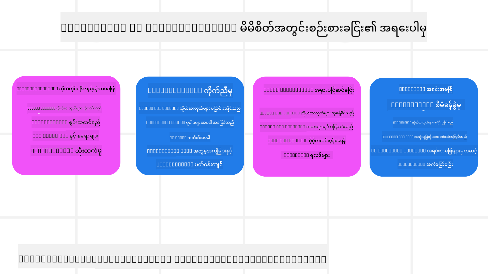

<!--
CO_OP_TRANSLATOR_METADATA:
{
  "original_hash": "8cbf460468c802c7994aa62e0e0779c9",
  "translation_date": "2025-07-12T13:30:16+00:00",
  "source_file": "09-metacognition/README.md",
  "language_code": "my"
}
-->
[](https://youtu.be/His9R6gw6Ec?si=3_RMb8VprNvdLRhX)

> _(အပေါ်က ပုံကို နှိပ်ပြီး ဗီဒီယိုကို ကြည့်ရှုနိုင်ပါသည်)_
# AI Agent များတွင် Metacognition

## နိဒါန်း

AI agent များတွင် metacognition အကြောင်း သင်ခန်းစာသို့ ကြိုဆိုပါသည်။ ဒီအခန်းက AI agent များက သူတို့ရဲ့ စဉ်းစားမှုကို ဘယ်လိုစဉ်းစားနိုင်ကြောင်း စိတ်ဝင်စားသူ စတင်လေ့လာသူများအတွက် ရည်ရွယ်ထားသည်။ ဒီသင်ခန်းစာပြီးဆုံးချိန်မှာ သင်သည် အဓိကအယူအဆများကို နားလည်ပြီး AI agent ဒီဇိုင်းတွင် metacognition ကို အသုံးပြုနိုင်မည့် လက်တွေ့နမူနာများကိုလည်း သိရှိထားမည်ဖြစ်သည်။

## သင်ယူရမည့် ရည်မှန်းချက်များ

ဒီသင်ခန်းစာပြီးဆုံးပြီးနောက် သင်သည် အောက်ပါအရာများကို လုပ်နိုင်မည်ဖြစ်သည်-

1. Agent သတ်မှတ်ချက်များတွင် reasoning loop များ၏ သက်ရောက်မှုများကို နားလည်ခြင်း။
2. ကိုယ်တိုင်ပြင်ဆင်နိုင်သော agent များအတွက် စီမံကိန်းရေးဆွဲခြင်းနှင့် အကဲဖြတ်နည်းများကို အသုံးပြုခြင်း။
3. လုပ်ငန်းများ ပြီးမြောက်စေရန် ကုဒ်ကို ကိုယ်တိုင်ပြောင်းလဲနိုင်သော agent များ ဖန်တီးခြင်း။

## Metacognition အကြောင်း မိတ်ဆက်ခြင်း

Metacognition ဆိုသည်မှာ ကိုယ့်စဉ်းစားမှုကို ကိုယ်တိုင် စဉ်းစားခြင်းနှင့် ပတ်သက်သော အဆင့်မြင့် စိတ်ပိုင်းဆိုင်ရာ လုပ်ငန်းစဉ်များကို ဆိုလိုသည်။ AI agent များအတွက်ဆိုရင်၊ ကိုယ်တိုင်သိမြင်မှုနှင့် အတိတ်အတွေ့အကြုံများအပေါ် အခြေခံ၍ သူတို့၏ လုပ်ဆောင်ချက်များကို အကဲဖြတ်ပြီး ပြင်ဆင်နိုင်ခြင်း ဖြစ်သည်။ "စဉ်းစားခြင်းကို စဉ်းစားခြင်း" ဟူသော metacognition သည် agentic AI စနစ်များ ဖွံ့ဖြိုးတိုးတက်မှုတွင် အရေးကြီးသော အယူအဆတစ်ခုဖြစ်သည်။ AI စနစ်များသည် ကိုယ်ပိုင် အတွင်းစိတ်လုပ်ငန်းစဉ်များကို သိမြင်နိုင်ပြီး၊ သူတို့၏ အပြုအမူကို စောင့်ကြည့်၊ ထိန်းချုပ်၊ နှင့် လိုက်လျောညီထွေ ပြောင်းလဲနိုင်စေရန် ပါဝင်သည်။ လူတွေက ပြဿနာတစ်ခုကို ကြည့်ရှုသလို၊ သဘောထားကို ဖတ်ရှုသလို ဖြစ်သည်။ ဒီကိုယ်တိုင်သိမြင်မှုက AI စနစ်များကို ဆုံးဖြတ်ချက်များ ပိုမိုကောင်းမွန်စေရန်၊ အမှားများကို ရှာဖွေရန်၊ နှင့် အချိန်အလိုက် စွမ်းဆောင်ရည်တိုးတက်စေရန် ကူညီပေးသည်။ ထပ်မံ၍ Turing စမ်းသပ်မှုနှင့် AI ကမ္ဘာကို သိမ်းပိုက်မလားဆိုသော ဆွေးနွေးမှုများနှင့်လည်း ဆက်စပ်နေသည်။

Agentic AI စနစ်များအတွက် metacognition သည် အောက်ပါ စိန်ခေါ်မှုများကို ဖြေရှင်းရာတွင် ကူညီပေးနိုင်သည်-
- Transparency: AI စနစ်များသည် သူတို့၏ စဉ်းစားမှုနှင့် ဆုံးဖြတ်ချက်များကို ရှင်းလင်းရှင်းလင်း ဖော်ပြနိုင်စေရန်။
- Reasoning: AI စနစ်များ၏ သတင်းအချက်အလက်များကို ပေါင်းစပ်၍ မှန်ကန်သော ဆုံးဖြတ်ချက်များ ချနိုင်စေရန် တိုးတက်စေရန်။
- Adaptation: AI စနစ်များသည် ပတ်ဝန်းကျင်အသစ်များနှင့် ပြောင်းလဲနေသော အခြေအနေများကို ကိုက်ညီစေရန်။
- Perception: AI စနစ်များ၏ ပတ်ဝန်းကျင်မှ ဒေတာများကို မှန်ကန်စွာ သိမြင်၊ အဓိပ္ပာယ်ဖွင့်ဆိုနိုင်စေရန် တိုးတက်စေရန်။

### Metacognition ဆိုတာဘာလဲ?

Metacognition သည် "စဉ်းစားခြင်းကို စဉ်းစားခြင်း" ဟုခေါ်ပြီး ကိုယ်တိုင်သိမြင်မှုနှင့် ကိုယ်တိုင်ထိန်းချုပ်မှု ပါဝင်သော အဆင့်မြင့် စိတ်ပိုင်းဆိုင်ရာ လုပ်ငန်းစဉ်တစ်ခုဖြစ်သည်။ AI လောကတွင် metacognition သည် agent များအား သူတို့၏ မဟာဗျူဟာများနှင့် လုပ်ဆောင်ချက်များကို အကဲဖြတ်ပြီး ပြောင်းလဲနိုင်စေပြီး ပြဿနာဖြေရှင်းခြင်းနှင့် ဆုံးဖြတ်ချက်ချခြင်း စွမ်းရည်များ တိုးတက်စေသည်။ Metacognition ကို နားလည်ခြင်းဖြင့် သင်သည် ပိုမိုတိုးတက်ပြီး လိုက်လျောညီထွေ၊ ထိရောက်သော AI agent များကို ဒီဇိုင်းဆွဲနိုင်မည်ဖြစ်သည်။ တကယ့် metacognition တွင် AI သည် သူ့ရဲ့ စဉ်းစားမှုကို တိတိကျကျ စဉ်းစားနေသည်ကို တွေ့ရမည်ဖြစ်သည်။

ဥပမာ- “ငွေသက်သာတဲ့ လေယာဉ်လက်မှတ်တွေကို ဦးစားပေးခဲ့တာပါ… တိုက်ရိုက်လေယာဉ်တွေ ပျောက်နေမယ်ထင်တော့ ပြန်စစ်ကြည့်မယ်”။
ဘယ်လိုလမ်းကြောင်းရွေးချယ်ခဲ့တာလဲ၊ ဘာကြောင့်လဲ မှတ်သားထားခြင်း။
- ယခင်အကြိမ်မှာ အသုံးပြုသူ စိတ်ကြိုက်မှုများကို များစွာအခြေခံခဲ့လို့ အမှားဖြစ်ခဲ့တာကို မှတ်သားပြီး နောက်ဆုံးအကြံပြုချက်မဟုတ်ပဲ ဆုံးဖြတ်ချက်လုပ်နည်းကို ပြောင်းလဲခြင်း။
- “အသုံးပြုသူက ‘လူများနေတယ်’ လို့ ပြောတဲ့အခါ마다 လူကြိုက်များတဲ့နေရာတွေကို ဖယ်ရှားရုံမက၊ လူကြိုက်များမှုအပေါ် အမြဲအခြေခံပြီး ‘ထိပ်တန်းနေရာများ’ ရွေးချယ်တဲ့နည်းလမ်းမှာ ပြဿနာရှိတယ်” ဆိုတဲ့ ပုံစံတွေကို ရှာဖွေခြင်း။

### AI Agent များတွင် Metacognition ၏ အရေးပါမှု

Metacognition သည် AI agent ဒီဇိုင်းတွင် အောက်ပါအကြောင်းများကြောင့် အရေးကြီးသည်-



- ကိုယ်တိုင်ပြန်လည်သုံးသပ်ခြင်း: Agent များသည် သူတို့၏ စွမ်းဆောင်ရည်ကို အကဲဖြတ်ပြီး တိုးတက်စေရန် နေရာများကို ရှာဖွေနိုင်သည်။
- လိုက်လျောညီထွေမှု: Agent များသည် အတိတ်အတွေ့အကြုံများနှင့် ပြောင်းလဲနေသော ပတ်ဝန်းကျင်အခြေအနေများအပေါ် အခြေခံ၍ မဟာဗျူဟာများကို ပြောင်းလဲနိုင်သည်။
- အမှားပြင်ဆင်ခြင်း: Agent များသည် အမှားများကို ကိုယ်တိုင် ရှာဖွေပြီး ပြင်ဆင်နိုင်သည်၊ ထို့ကြောင့် ပိုမိုမှန်ကန်သော ရလဒ်များရရှိစေသည်။
- အရင်းအမြစ် စီမံခန့်ခွဲမှု: Agent များသည် အချိန်နှင့် ကွန်ပျူတာစွမ်းအားကဲ့သို့သော အရင်းအမြစ်များကို စီမံကောင်းစွာ အသုံးပြုနိုင်ရန် စီမံကိန်းရေးဆွဲခြင်းနှင့် အကဲဖြတ်ခြင်း ပြုလုပ်သည်။

## AI Agent ၏ အစိတ်အပိုင်းများ

Metacognitive လုပ်ငန်းစဉ်များသို့ ဝင်ရောက်မတိုင်မီ AI agent ၏ အခြေခံအစိတ်အပိုင်းများကို နားလည်ထားရမည်။ AI agent တစ်ခုမှာ အောက်ပါအရာများ ပါဝင်သည်-

- Persona: Agent ၏ ကိုယ်ရည်ကိုယ်သွေးနှင့် လက္ခဏာများ၊ အသုံးပြုသူများနှင့် မည်သို့ ဆက်ဆံမည်ကို သတ်မှတ်သည်။
- Tools: Agent ၏ လုပ်ဆောင်နိုင်သော စွမ်းရည်များနှင့် လုပ်ဆောင်ချက်များ။
- Skills: Agent ၏ သိမြင်မှုနှင့် ကျွမ်းကျင်မှုများ။

ဒီအစိတ်အပိုင်းများသည် အတူတကွ လုပ်ဆောင်မှုတစ်ခုကို ဖန်တီးပြီး သတ်မှတ်ထားသော လုပ်ငန်းများကို ပြုလုပ်နိုင်စေသည်။

**ဥပမာ**:
ခရီးသွားအေးဂျင့်တစ်ယောက်ကို စဉ်းစားပါ၊ ဒီ agent သည် သင့်အား ခရီးစဉ်စီမံကိန်းရေးဆွဲပေးခြင်းသာမက အချိန်နှင့်အညီ ဒေတာနှင့် ယခင်ဖောက်သည် ခရီးစဉ်အတွေ့အကြုံများအပေါ် အခြေခံ၍ လမ်းကြောင်းကို ပြောင်းလဲပေးနိုင်သည်။

### ဥပမာ- ခရီးသွားအေးဂျင့်ဝန်ဆောင်မှုတွင် Metacognition

သင်သည် AI ဖြင့် အားဖြည့်ထားသော ခရီးသွားအေးဂျင့်ဝန်ဆောင်မှုတစ်ခုကို ဒီဇိုင်းဆွဲနေသည်ဟု စဉ်းစားပါ။ ဒီ agent ကို "Travel Agent" ဟု ခေါ်ပြီး အသုံးပြုသူများအား ခရီးစဉ်စီမံကိန်းရေးဆွဲရာတွင် ကူညီပေးသည်။ Metacognition ကို ထည့်သွင်းရန်အတွက် Travel Agent သည် ကိုယ်တိုင်သိမြင်မှုနှင့် ယခင်အတွေ့အကြုံများအပေါ် အခြေခံ၍ သူ၏ လုပ်ဆောင်ချက်များကို အကဲဖြတ်ပြီး ပြင်ဆင်နိုင်ရမည်။ Metacognition သည် အောက်ပါအတိုင်း ပါဝင်နိုင်သည်-

#### လက်ရှိတာဝန်

အသုံးပြုသူတစ်ဦးအား ပဲရစ်ခရီးစဉ် စီမံကိန်းရေးဆွဲရာတွင် ကူညီခြင်း။

#### တာဝန်ပြီးမြောက်ရန် အဆင့်များ

1. **အသုံးပြုသူ စိတ်ကြိုက်ချက်များ စုဆောင်းခြင်း**: ခရီးသွားရက်များ၊ ဘတ်ဂျက်၊ စိတ်ဝင်စားရာများ (ဥပမာ- ပြတိုက်များ၊ အစားအစာ၊ စျေးဝယ်ခြင်း) နှင့် အထူးလိုအပ်ချက်များကို မေးမြန်းခြင်း။
2. **အချက်အလက် ရယူခြင်း**: အသုံးပြုသူ စိတ်ကြိုက်ချက်များနှင့် ကိုက်ညီသော လေယာဉ်လမ်းကြောင်းများ၊ နေရာထိုင်ခုံများ၊ သွားရောက်လည်ပတ်ရန်နေရာများနှင့် စားသောက်ဆိုင်များကို ရှာဖွေခြင်း။
3. **အကြံပြုချက်များ ဖန်တီးခြင်း**: လေယာဉ်အချက်အလက်၊ ဟိုတယ်မှာကြိုတင်မှာယူမှုများနှင့် အကြံပြုလှုပ်ရှားမှုများပါဝင်သည့် ကိုယ်ပိုင်ခရီးစဉ်အစီအစဉ် တစ်ခု ပေးခြင်း။
4. **တုံ့ပြန်ချက်အပေါ် အခြေခံ၍ ပြင်ဆင်ခြင်း**: အသုံးပြုသူ၏ တုံ့ပြန်ချက်ကို မေးမြန်းပြီး လိုအပ်သလို ပြင်ဆင်ခြင်း။

#### လိုအပ်သော အရင်းအမြစ်များ

- လေယာဉ်နှင့် ဟိုတယ်မှာကြိုတင်မှာယူမှု ဒေတာဘေ့စ်များသို့ ဝင်ရောက်နိုင်မှု။
- ပဲရစ်ရှိ သွားရောက်လည်ပတ်ရန်နေရာများနှင့် စားသောက်ဆိုင်များအကြောင်း အချက်အလက်များ။
- ယခင်ဆက်ဆံမှုများမှ အသုံးပြုသူ တုံ့ပြန်ချက် ဒေတာများ။

#### အတွေ့အကြုံနှင့် ကိုယ်တိုင်ပြန်လည်သုံးသပ်ခြင်း

Travel Agent သည် metacognition ကို အသုံးပြု၍ သူ၏ စွမ်းဆောင်ရည်ကို အကဲဖြတ်ပြီး ယခင်အတွေ့အကြုံများမှ သင်ယူသည်။ ဥပမာ-

1. **အသုံးပြုသူ တုံ့ပြန်ချက်များ ခွဲခြမ်းစိတ်ဖြာခြင်း**: Travel Agent သည် အသုံးပြုသူ တုံ့ပြန်ချက်များကို ပြန်လည်သုံးသပ်ကာ ဘယ်အကြံပြုချက်များက လူကြိုက်များခဲ့ပြီး မကြိုက်ခဲ့ကြောင်း သတ်မှတ်သည်။ နောက်ထပ် အကြံပြုချက်များကို ထိုအတိုင်း ပြင်ဆင်သည်။
2. **လိုက်လျောညီထွေမှု**: အသုံးပြုသူက လူများနေသောနေရာများကို မကြိုက်ကြောင်း ယခင်တစ်ကြိမ် ပြောဆိုခဲ့လျှင် Travel Agent သည် နာရီအများဆုံး လူများသော ခရီးသွားနေရာများကို မအကြံပြုတော့ပါ။
3. **အမှားပြင်ဆင်ခြင်း**: ယခင်မှာကြိုတင်မှာယူမှုတွင် ဟိုတယ်တစ်ခုကို ပြည့်နေပြီးမှ အကြံပြုခဲ့လျှင် Travel Agent သည် နောက်တစ်ကြိမ်မှာ ကြိုတင်မှာယူမှုမပြုမီ ရရှိနိုင်မှုကို ပိုမိုတိကျစွာ စစ်ဆေးသင့်သည်။

#### လက်တွေ့ Developer ဥပမာ

Travel Agent ၏ ကုဒ်တွင် metacognition ထည့်သွင်းထားသည့် ရိုးရှင်းသည့် ဥပမာ-

```python
class Travel_Agent:
    def __init__(self):
        self.user_preferences = {}
        self.experience_data = []

    def gather_preferences(self, preferences):
        self.user_preferences = preferences

    def retrieve_information(self):
        # Search for flights, hotels, and attractions based on preferences
        flights = search_flights(self.user_preferences)
        hotels = search_hotels(self.user_preferences)
        attractions = search_attractions(self.user_preferences)
        return flights, hotels, attractions

    def generate_recommendations(self):
        flights, hotels, attractions = self.retrieve_information()
        itinerary = create_itinerary(flights, hotels, attractions)
        return itinerary

    def adjust_based_on_feedback(self, feedback):
        self.experience_data.append(feedback)
        # Analyze feedback and adjust future recommendations
        self.user_preferences = adjust_preferences(self.user_preferences, feedback)

# Example usage
travel_agent = Travel_Agent()
preferences = {
    "destination": "Paris",
    "dates": "2025-04-01 to 2025-04-10",
    "budget": "moderate",
    "interests": ["museums", "cuisine"]
}
travel_agent.gather_preferences(preferences)
itinerary = travel_agent.generate_recommendations()
print("Suggested Itinerary:", itinerary)
feedback = {"liked": ["Louvre Museum"], "disliked": ["Eiffel Tower (too crowded)"]}
travel_agent.adjust_based_on_feedback(feedback)
```

#### Metacognition အရေးကြီးခြင်း

- **ကိုယ်တိုင်ပြန်လည်သုံးသပ်ခြင်း**: Agent များသည် သူတို့၏ စွမ်းဆောင်ရည်ကို ခွဲခြမ်းစိတ်ဖြာပြီး တိုးတက်စေရန် နေရာများကို ရှာဖွေနိုင်သည်။
- **လိုက်လျောညီထွေမှု**: Agent များသည် တုံ့ပြန်ချက်များနှင့် ပြောင်းလဲနေသော အခြေအနေများအပေါ် အခြေခံ၍ မဟာဗျူဟာများကို ပြောင်းလဲနိုင်သည်။
- **အမှားပြင်ဆင်ခြင်း**: Agent များသည် ကိုယ်တိုင် အမှားများကို ရှာဖွေပြီး ပြင်ဆင်နိုင်သည်။
- **အရင်းအမြစ် စီမံခန့်ခွဲမှု**: Agent များသည် အချိန်နှင့် ကွန်ပျူတာစွမ်းအားကဲ့သို့သော အရင်းအမြစ်များကို ထိရောက်စွာ အသုံးပြုနိုင်သည်။

Metacognition ထည့်သွင်းခြင်းဖြင့် Travel Agent သည် ပိုမိုကိုယ်ပိုင်စိတ်ကြိုက်ပြီး မှန်ကန်သော ခရီးစဉ်အကြံပြုချက်များ ပေးနိုင်ကာ အသုံးပြုသူ အတွေ့အကြုံကို တိုးတက်စေမည်ဖြစ်သည်။

---

## ၂။ Agent များတွင် စီမံကိန်းရေးဆွဲခြင်း

စီမံကိန်းရေးဆွဲခြင်းသည် AI agent ၏ အပြုအမူတွင် အရေးကြီးသော အစိတ်အပိုင်းတစ်ခုဖြစ်သည်။ ၎င်းသည် ရည်မှန်းချက်တစ်ခုကို ရောက်ရှိရန် လိုအပ်သော အဆင့်များကို ရေးဆွဲခြင်းဖြစ်ပြီး လက်ရှိအခြေအနေ၊ အရင်းအမြစ်များနှင့် ဖြစ်နိုင်သော အတားအဆီးများကို ထည့်သွင်းစဉ်းစားသည်။

### စီမံကိန်းရေးဆွဲခြင်း၏ အစိတ်အပိုင်းများ

- **လက်ရှိတာဝန်**: တာဝန်ကို ရှင်းလင်းစွာ သတ်မှတ်ခြင်း။
- **တာဝန်ပြီးမြောက်ရန် အဆင့်များ**: တာဝန်ကို စီမံနိုင်သော အဆင့်များသို့ ခွဲခြမ်းခြင်း။
- **လိုအပ်သော အရင်းအမြစ်များ**: လိုအပ်သော အရင်းအမြစ်များကို သတ်မှတ်ခြင်း။
- **အတွေ
### ကြိုတင်အကြောင်းအရာတင်ခြင်း

ကြိုတင်အကြောင်းအရာတင်ခြင်းဆိုသည်မှာ မေးခွန်းတစ်ခုကို ဆက်လက်လုပ်ဆောင်မည့်အချိန်မတိုင်မီ သက်ဆိုင်ရာအကြောင်းအရာ သို့မဟုတ် နောက်ခံအချက်အလက်များကို မော်ဒယ်ထဲသို့ တင်သွင်းခြင်းဖြစ်သည်။ ၎င်းက မော်ဒယ်ကို စတင်ချိန်မှတစ်ဆင့် အချက်အလက်များကို အသုံးပြုခွင့်ရစေပြီး၊ လုပ်ငန်းစဉ်အတွင်း ထပ်မံအချက်အလက် ရယူရန် မလိုအပ်ဘဲ ပိုမိုသိရှိပြီး တိကျသော ဖြေကြားချက်များ ထုတ်ပေးနိုင်စေသည်။

Python ဖြင့် ခရီးသွားအေးဂျင့်အက်ပလီကေးရှင်းတစ်ခုအတွက် ကြိုတင်အကြောင်းအရာတင်ခြင်းကို ရိုးရှင်းစွာ ဖော်ပြထားသော ဥပမာမှာ အောက်ပါအတိုင်းဖြစ်သည်-

#### ရှင်းလင်းချက်

1. **စတင်သတ်မှတ်ခြင်း (`__init__` method)**: `TravelAgent` class သည် Paris, Tokyo, New York, Sydney ကဲ့သို့ လူကြိုက်များသော ခရီးစဉ်များအကြောင်း အချက်အလက်များပါဝင်သော dictionary ကို ကြိုတင်တင်သွင်းထားသည်။ ၎င်း dictionary တွင် နိုင်ငံ၊ ငွေကြေး၊ ဘာသာစကားနှင့် အဓိကဆွဲဆောင်မှုများအကြောင်း ပါဝင်သည်။

2. **အချက်အလက် ရယူခြင်း (`get_destination_info` method)**: အသုံးပြုသူမှ သတ်မှတ်ထားသော ခရီးစဉ်အကြောင်း မေးမြန်းလာသောအခါ `get_destination_info` method သည် ကြိုတင်တင်သွင်းထားသော dictionary မှ သက်ဆိုင်ရာ အချက်အလက်များကို ရယူပေးသည်။

ကြိုတင်အကြောင်းအရာတင်ခြင်းဖြင့် ခရီးသွားအေးဂျင့်အက်ပလီကေးရှင်းသည် အသုံးပြုသူမေးခွန်းများကို အချိန်နှင့်တပြေးညီ အချက်အလက် ရယူရန် မလိုအပ်ဘဲ မြန်ဆန်စွာ ဖြေကြားနိုင်ပြီး အကျိုးရှိစွာ လုပ်ဆောင်နိုင်သည်။

### ရည်မှန်းချက်ဖြင့် စီမံကိန်းကို စတင်ပြီး ပြန်လည်တိုးတက်အောင်လုပ်ခြင်း

ရည်မှန်းချက်ဖြင့် စီမံကိန်းကို စတင်ခြင်းဆိုသည်မှာ ရှင်းလင်းသော ရည်မှန်းချက် သို့မဟုတ် ရလဒ်တစ်ခုကို အစပိုင်းတွင် သတ်မှတ်ထားခြင်းဖြစ်သည်။ ၎င်းရည်မှန်းချက်ကို အခြေခံ၍ မော်ဒယ်သည် အဆင့်ဆင့် လုပ်ငန်းစဉ်အတွင်း ဦးတည်ချက်အဖြစ် အသုံးပြုနိုင်ပြီး၊ တစ်ဆင့်ချင်းစီသည် ရည်မှန်းချက်အတိုင်း ရောက်ရှိရန် ပိုမိုထိရောက်စေသည်။

Python ဖြင့် ခရီးသွားအေးဂျင့်အတွက် ရည်မှန်းချက်ဖြင့် စီမံကိန်းကို စတင်ပြီး ပြန်လည်တိုးတက်အောင်လုပ်ခြင်း၏ ဥပမာမှာ အောက်ပါအတိုင်းဖြစ်သည်-

### အခြေအနေ

ခရီးသွားအေးဂျင့်တစ်ဦးသည် ဖောက်သည်အတွက် ကိုယ်ပိုင် ခရီးစဉ်တစ်ခု စီစဉ်လိုသည်။ ရည်မှန်းချက်မှာ ဖောက်သည်၏ စိတ်ကျေနပ်မှုကို အများဆုံးဖြစ်စေရန် သူ၏ စိတ်ကြိုက်နှင့် ဘတ်ဂျက်အပေါ် အခြေခံ၍ ခရီးစဉ်တစ်ခု ဖန်တီးခြင်းဖြစ်သည်။

### အဆင့်များ

1. ဖောက်သည်၏ စိတ်ကြိုက်နှင့် ဘတ်ဂျက်ကို သတ်မှတ်ပါ။
2. ၎င်းစိတ်ကြိုက်အပေါ် အခြေခံ၍ စီမံကိန်းအစကို စတင်ပါ။
3. စီမံကိန်းကို ပြန်လည်တိုးတက်အောင် လုပ်ဆောင်ပါ၊ ဖောက်သည်၏ စိတ်ကျေနပ်မှုအတွက် အကောင်းဆုံးဖြစ်အောင် ပြင်ဆင်ပါ။

#### Python ကုဒ်

#### ကုဒ်ရှင်းလင်းချက်

1. **စတင်သတ်မှတ်ခြင်း (`__init__` method)**: `TravelAgent` class သည် ခရီးစဉ်များစာရင်းနှင့် အမည်၊ ကုန်ကျစရိတ်၊ လှုပ်ရှားမှုအမျိုးအစားကဲ့သို့သော attribute များပါဝင်သော အချက်အလက်များဖြင့် စတင်သတ်မှတ်ထားသည်။

2. **စီမံကိန်း စတင်ဖန်တီးခြင်း (`bootstrap_plan` method)**: ဖောက်သည်၏ စိတ်ကြိုက်နှင့် ဘတ်ဂျက်အပေါ် အခြေခံ၍ စီမံကိန်းအစကို ဖန်တီးသည်။ ခရီးစဉ်များစာရင်းကို လှည့်ပတ်ပြီး ဖောက်သည်၏ စိတ်ကြိုက်နှင့် ကိုက်ညီပြီး ဘတ်ဂျက်အတွင်းရှိသော ခရီးစဉ်များကို စီမံကိန်းထဲ ထည့်သွင်းသည်။

3. **စိတ်ကြိုက်ကိုက်ညီမှု စစ်ဆေးခြင်း (`match_preferences` method)**: ခရီးစဉ်တစ်ခုသည် ဖောက်သည်၏ စိတ်ကြိုက်နှင့် ကိုက်ညီမည်ကို စစ်ဆေးသည်။

4. **စီမံကိန်း ပြန်လည်တိုးတက်အောင်လုပ်ခြင်း (`iterate_plan` method)**: စီမံကိန်းအစကို ပြန်လည်တိုးတက်အောင်လုပ်ပြီး ဖောက်သည်၏ စိတ်ကြိုက်နှင့် ဘတ်ဂျက်ကို ထည့်သွင်းစဉ်းစားကာ ပိုမိုသင့်တော်သော ခရီးစဉ်များဖြင့် အစားထိုးရန် ကြိုးပမ်းသည်။

5. **ကုန်ကျစရိတ်တွက်ချက်ခြင်း (`calculate_cost` method)**: လက်ရှိစီမံကိန်း၏ စုစုပေါင်းကုန်ကျစရိတ်ကို (ခန့်မှန်းသည့် ခရီးစဉ်အသစ်ပါဝင်ပါက) တွက်ချက်သည်။

#### ဥပမာအသုံးပြုမှု

- **အစစီမံကိန်း**: ခရီးသွားအေးဂျင့်သည် ဖောက်သည်၏ ရှုခင်းကြည့်ရှုခြင်း စိတ်ကြိုက်နှင့် $2000 ဘတ်ဂျက်အပေါ် အခြေခံ၍ စီမံကိန်းအစကို ဖန်တီးသည်။
- **ပြင်ဆင်ပြီးစီမံကိန်း**: ခရီးသွားအေးဂျင့်သည် စီမံကိန်းကို ပြန်လည်တိုးတက်အောင်လုပ်ပြီး ဖောက်သည်၏ စိတ်ကြိုက်နှင့် ဘတ်ဂျက်အတွက် အကောင်းဆုံးဖြစ်အောင် ပြင်ဆင်သည်။

ရည်မှန်းချက်ရှင်းလင်းစွာဖြင့် စီမံကိန်းကို စတင်ပြီး ပြန်လည်တိုးတက်အောင်လုပ်ခြင်းဖြင့် ခရီးသွားအေးဂျင့်သည် ဖောက်သည်၏ စိတ်ကြိုက်နှင့် ဘတ်ဂျက်နှင့် ကိုက်ညီပြီး အကောင်းဆုံး ခရီးစဉ်တစ်ခုကို ဖန်တီးနိုင်သည်။ ၎င်းနည်းလမ်းသည် စတင်ချိန်မှတစ်ဆင့် ဖောက်သည်လိုအပ်ချက်နှင့် ကိုက်ညီမှုရှိစေပြီး အဆင့်ဆင့် တိုးတက်မှုဖြင့် ပိုမိုကောင်းမွန်လာစေသည်။

### LLM ကို Re-ranking နှင့် Scoring အတွက် အသုံးချခြင်း

ကြီးမားသော ဘာသာစကားမော်ဒယ်များ (LLMs) ကို ရယူထားသော စာရွက်စာတမ်းများ သို့မဟုတ် ထုတ်ပေးထားသော ဖြေကြားချက်များ၏ သက်ဆိုင်မှုနှင့် အရည်အသွေးကို သုံးသပ်၍ Re-ranking နှင့် Scoring အတွက် အသုံးပြုနိုင်သည်။ ၎င်းလုပ်ငန်းစဉ်မှာ အောက်ပါအတိုင်း ဖြစ်သည်-

**ရယူခြင်း**: မေးခွန်းအပေါ် အခြေခံ၍ လျှောက်ထားနိုင်သော စာရွက်စာတမ်းများ သို့မဟုတ် ဖြေကြားချက်များကို ရယူသည်။

**Re-ranking**: LLM သည် ရရှိထားသော စာရွက်စာတမ်းများ သို့မဟုတ် ဖြေကြားချက်များကို သက်ဆိုင်မှုနှင့် အရည်အသွေးအရ ပြန်လည်အဆင့်သတ်မှတ်သည်။ ၎င်းက အချက်အလက်အရည်အသွေးမြင့်ဆုံးများကို ပထမဦးစွာ ပြသရန် အထောက်အကူပြုသည်။

**Scoring**: LLM သည် တစ်ခုချင်းစီကို သက်ဆိုင်မှုနှင့် အရည်အသွေးကို ဖော်ပြသည့် အမှတ်များ ပေးသည်။ ၎င်းက အသုံးပြုသူအတွက် အကောင်းဆုံးဖြေကြားချက် သို့မဟုတ် စာရွက်စာတမ်းကို ရွေးချယ်ရာတွင် အထောက်အကူပြုသည်။

LLM များကို Re-ranking နှင့် Scoring အတွက် အသုံးပြုခြင်းဖြင့် စနစ်သည် ပိုမိုတိကျပြီး သက်ဆိုင်မှုရှိသော အချက်အလက်များကို ပေးနိုင်ပြီး အသုံးပြုသူအတွေ့အကြုံကို တိုးတက်စေသည်။

Python ဖြင့် ခရီးသွားအေးဂျင့်တစ်ဦးသည် အသုံးပြုသူစိတ်ကြိုက်အပေါ် အခြေခံ၍ ခရီးစဉ်များကို Re-ranking နှင့် Scoring ပြုလုပ်ရန် LLM ကို အသုံးပြုသည့် ဥပမာမှာ အောက်ပါအတိုင်းဖြစ်သည်-

#### အခြေအနေ - စိတ်ကြိုက်အပေါ် ခရီးသွားခြင်း

ခရီးသွားအေးဂျင့်သည် ဖောက်သည်၏ စိတ်ကြိုက်အပေါ် အခြေခံ၍ အကောင်းဆုံး ခရီးစဉ်များကို အကြံပြုလိုသည်။ LLM သည် ခရီးစဉ်များကို ပြန်လည်အဆင့်သတ်မှတ်ခြင်းနှင့် အမှတ်ပေးခြင်းများ ပြုလုပ်ကာ သက်ဆိုင်မှုရှိဆုံး ရွေးချယ်စရာများကို ဖော်ပြပေးမည်ဖြစ်သည်။

#### အဆင့်များ

1. အသုံးပြုသူစိတ်ကြိုက်များ စုဆောင်းပါ။
2. ခရီးစဉ်များစာရင်း ရယူပါ။
3. LLM ကို အသုံးပြု၍ ခရီးစဉ်များကို ပြန်လည်အဆင့်သတ်မှတ်ပြီး အမှတ်ပေးပါ။

Azure OpenAI Services ကို အသုံးပြုရန် အောက်ပါအတိုင်း ဥပမာကို ပြင်ဆင်နိုင်သည်-

#### လိုအပ်ချက်များ

1. Azure subscription ရှိရမည်။
2. Azure OpenAI resource တစ်ခု ဖန်တီးပြီး API key ရယူထားရမည်။

#### Python ကုဒ် ဥပမာ

#### ကုဒ်ရှင်းလင်းချက် - Preference Booker

1. **စတင်သတ်မှတ်ခြင်း**: `TravelAgent` class သည် ခရီးစဉ်များစာရင်းနှင့် အမည်၊ ဖော်ပြချက်ကဲ့သို့သော attribute များပါဝင်သော အချက်အလက်များဖြင့် စတင်သတ်မှတ်ထားသည်။

2. **အကြံပြုချက်ရယူခြင်း (`get_recommendations` method)**: အသုံးပြုသူစိတ်ကြိုက်အပေါ် အခြေခံ၍ Azure OpenAI service အတွက် prompt တစ်ခု ဖန်တီးပြီး Azure OpenAI API သို့ HTTP POST request တင်ကာ ပြန်လည်အဆင့်သတ်မှတ်ပြီး အမှတ်ပေးထားသော ခရီးစဉ်များကို ရယူသည်။

3. **Prompt ဖန်တီးခြင်း (`generate_prompt` method)**: အသုံးပြုသူစိတ်ကြိုက်နှင့် ခရီးစဉ်စာရင်းပါဝင်သော prompt ကို Azure OpenAI အတွက် ဖန်တီးသည်။ ၎င်း prompt သည် မော်ဒယ်အား ခရီးစဉ်များကို ပြန်လည်အဆင့်သတ်မှတ်ပြီး အမှတ်ပေးရန် ဦးတည်ချက်ပေးသည်။

4. **API ခေါ်ဆိုမှု**: `requests` library ကို အသုံးပြု၍ Azure OpenAI API endpoint သို့ HTTP POST request တင်သည်။ ပြန်လည်ရရှိသော အချက်အလက်တွင် ပြန်လည်အဆင့်သတ်မှတ်ပြီး အမှတ်ပေးထားသော ခရီးစဉ်များ ပါဝင်သည်။

5. **ဥပမာအသုံးပြုမှု**: ခရီးသွားအေးဂျင့်သည် အသုံးပြုသူစိတ်ကြိုက် (ဥပမာ- ရှုခင်းကြည့်ရှုခြင်းနှင့် ယဉ်ကျေးမှုမျိုးစုံစိတ်ဝင်စားမှု) ကို စုဆောင်းပြီး Azure OpenAI service ကို အသုံးပြုကာ ပြန်လည်အဆင့်သတ်မှတ်ပြီး အမှတ်ပေးထားသော ခရီးစဉ်အကြံပြုချက်များ ရယူသည်။

`your_azure_openai_api_key` ကို သင့်ရဲ့ အမှန်တကယ် Azure OpenAI API key ဖြင့်၊ `https://your-endpoint.com/...` ကို သင့် Azure OpenAI deployment ၏ အမှန်တကယ် endpoint URL ဖြင့် အစားထိုးရန် သတိပြုပါ။

LLM ကို Re-ranking နှင့် Scoring အတွက် အသုံးပြုခြင်းဖြင့် ခရီးသွားအေးဂျင့်သည် ဖောက်သည်များအတွက် ပိုမိုကိုယ်ပိုင်နှင့် သက်ဆိုင်မှုရှိသော ခရီးစဉ်အကြံပြုချက်များ ပေးနိုင်ပြီး အသုံးပြုသူအတွေ့အကြုံကို တိုးတက်စေသည်။

### RAG: Prompting နည်းပညာ vs ကိရိယာ

Retrieval-Augmented Generation (RAG) သည် AI အေးဂျင့်များ ဖန်တီးရာတွင် Prompting နည်းပညာတစ်ခုအဖြစ် သို့မဟုတ် ကိရိယာတစ်ခုအဖြစ် အသုံးပြုနိုင်သည်။ ၎င်းနှစ်ခု၏ ကွာခြားချက်ကို နားလည်ခြင်းဖြင့် RAG ကို ပိုမိုထိရောက်စွာ အသုံးချနိုင်မည်ဖြစ်သည်။

#### RAG ကို Prompting နည်းပညာအဖြစ်

**ဘာလဲ?**

- Prompting နည်းပညာအဖြစ် RAG သည် အကြောင်းအရာကြီးမားသော စာကြောင်းများ သို့မဟုတ် ဒေတာအစုအဝေးမှ သက်ဆိုင်ရာ အချက်အလက်များ ရယူရန် အထူးသတ်မှတ်ထားသော မေးခွန်းများ သို့မဟုတ် prompt များ ဖန်တီးခြင်းဖြစ်သည်။ ၎င်းအချက်အလက်များကို ပြန်လည်ထုတ်ပေးရန် သုံးသည်။

**လုပ်ဆောင်ပုံ**

1. **Prompt များ ဖန်တီးခြင်း**: လုပ်ငန်းတာဝန် သို့မဟုတ် အသုံးပြုသူ၏ အချက်အလက်အပေါ် အခြေခံ၍ ကောင်းမွန်စွာ ဖွဲ့စည်းထားသော prompt များ ဖန်တီးသည်။
2. **အချက်အလက် ရယူခြင်း**: Prompt များကို အသုံးပြု၍ ရှိပြီးသား သိပ္ပံအချက်အလက် သိုလှောင်မှု သို့မဟုတ် ဒေတာအစုအဝေးမှ သက်ဆိုင်ရာ အချက်အလက်များ ရှာဖွေသည်။
3. **ဖြေကြားချက် ထုတ်ပေးခြင်း**: ရရှိထားသော အချက်အလက်များကို Generative AI မော်ဒယ်များနှင့် ပေါင်းစပ်ကာ ပြည့်စုံပြီး သေချာသော ဖြေကြားချက် ထုတ်ပေးသည်။

**ခရီးသွားအေးဂျင့် ဥပမာ**

- အသုံးပြုသူထည့်သွင်းချက်: "Paris တွင် ပြတိုက်များ သွားရောက်ချင်ပါတယ်။"
- Prompt: "Paris တွင် ထိပ်တန်း ပြတိုက်များ ရှာပါ။"
- ရရှိသော အချက်အလက်: Louvre ပြတိုက်၊ Musée d'Orsay စသည်တို့အကြောင်း
- ထုတ်ပေးသော ဖြေကြားချက်: "Paris တွင် ထိပ်တန်း ပြတိုက်များမှာ Louvre ပြတိုက်၊ Musée d'Orsay နှင့် Centre Pompidou တို့ ဖြစ်ပါသည်။"

#### RAG ကို ကိရိယာအဖြစ်

**ဘာလဲ?**

- ကိရိယာအဖြစ် RAG သည် AI အေးဂျင့်၏ ဖွဲ့စည်းပုံအတွင်း ပေါင်းစည်းထားသော စနစ်တစ်ခုဖြစ်ပြီး ရယူခြင်းနှင့် ထုတ်ပေးခြင်း လုပ်ငန်းစဉ်
#### Practical Example: Searching with Intent in Travel Agent

Travel Agent ကို ဥပမာယူပြီး ရည်ရွယ်ချက်အရ ရှာဖွေမှုကို ဘယ်လို အကောင်အထည်ဖော်နိုင်မလဲ ကြည့်ကြမယ်။

1. **အသုံးပြုသူ စိတ်ကြိုက်များ စုဆောင်းခြင်း**

   ```python
   class Travel_Agent:
       def __init__(self):
           self.user_preferences = {}

       def gather_preferences(self, preferences):
           self.user_preferences = preferences
   ```

2. **အသုံးပြုသူ ရည်ရွယ်ချက် နားလည်ခြင်း**

   ```python
   def identify_intent(query):
       if "book" in query or "purchase" in query:
           return "transactional"
       elif "website" in query or "official" in query:
           return "navigational"
       else:
           return "informational"
   ```

3. **Context ကို သိရှိနားလည်ခြင်း**

   ```python
   def analyze_context(query, user_history):
       # Combine current query with user history to understand context
       context = {
           "current_query": query,
           "user_history": user_history
       }
       return context
   ```

4. **ရှာဖွေပြီး ရလဒ်များကို ကိုယ်ပိုင်ပြုလုပ်ခြင်း**

   ```python
   def search_with_intent(query, preferences, user_history):
       intent = identify_intent(query)
       context = analyze_context(query, user_history)
       if intent == "informational":
           search_results = search_information(query, preferences)
       elif intent == "navigational":
           search_results = search_navigation(query)
       elif intent == "transactional":
           search_results = search_transaction(query, preferences)
       personalized_results = personalize_results(search_results, user_history)
       return personalized_results

   def search_information(query, preferences):
       # Example search logic for informational intent
       results = search_web(f"best {preferences['interests']} in {preferences['destination']}")
       return results

   def search_navigation(query):
       # Example search logic for navigational intent
       results = search_web(query)
       return results

   def search_transaction(query, preferences):
       # Example search logic for transactional intent
       results = search_web(f"book {query} to {preferences['destination']}")
       return results

   def personalize_results(results, user_history):
       # Example personalization logic
       personalized = [result for result in results if result not in user_history]
       return personalized[:10]  # Return top 10 personalized results
   ```

5. **အသုံးပြုမှု ဥပမာ**

   ```python
   travel_agent = Travel_Agent()
   preferences = {
       "destination": "Paris",
       "interests": ["museums", "cuisine"]
   }
   travel_agent.gather_preferences(preferences)
   user_history = ["Louvre Museum website", "Book flight to Paris"]
   query = "best museums in Paris"
   results = search_with_intent(query, preferences, user_history)
   print("Search Results:", results)
   ```

---

## 4. ကိရိယာအဖြစ် ကုဒ်ထုတ်လုပ်ခြင်း

ကုဒ်ထုတ်လုပ်သူ AI မော်ဒယ်များကို အသုံးပြုပြီး ကုဒ်ရေးသားခြင်းနှင့် အကောင်အထည်ဖော်ခြင်းဖြင့် ပြဿနာရှုပ်ထွေးများကို ဖြေရှင်းပြီး အလုပ်များကို အလိုအလျောက်လုပ်ဆောင်နိုင်သည်။

### ကုဒ်ထုတ်လုပ်သူ Agent များ

ကုဒ်ထုတ်လုပ်သူ Agent များသည် generative AI မော်ဒယ်များကို အသုံးပြုပြီး ကုဒ်ရေးသားခြင်းနှင့် အကောင်အထည်ဖော်ခြင်းလုပ်ဆောင်ကြသည်။ ဤ Agent များသည် ပြဿနာရှုပ်ထွေးများကို ဖြေရှင်းခြင်း၊ အလုပ်များကို အလိုအလျောက်လုပ်ဆောင်ခြင်းနှင့် ကုဒ်ထုတ်လုပ်ခြင်းဖြင့် အဖိုးတန် အမြင်များပေးနိုင်သည်။

#### လက်တွေ့ အသုံးချမှုများ

1. **အလိုအလျောက် ကုဒ်ထုတ်လုပ်ခြင်း** - ဒေတာခွဲခြမ်းစိတ်ဖြာခြင်း၊ ဝက်ဘ်ဒေတာ ရယူခြင်း သို့မဟုတ် machine learning အတွက် ကုဒ်ပိုင်းများ ထုတ်လုပ်ခြင်း။
2. **SQL ကို RAG အဖြစ် အသုံးပြုခြင်း** - ဒေတာဘေ့စ်မှ ဒေတာ ရယူပြီး ပြင်ဆင်ရန် SQL မေးခွန်းများ အသုံးပြုခြင်း။
3. **ပြဿနာဖြေရှင်းခြင်း** - အထူးပြဿနာများကို ဖြေရှင်းရန် ကုဒ်ရေးသားပြီး အကောင်အထည်ဖော်ခြင်း။

#### ဥပမာ - ဒေတာခွဲခြမ်းစိတ်ဖြာရေးအတွက် ကုဒ်ထုတ်လုပ်သူ Agent

ကုဒ်ထုတ်လုပ်သူ Agent တစ်ခု ဒီဇိုင်းဆွဲနေတယ်ဆိုပါစို့။ အလုပ်လုပ်ပုံက ဒီလိုဖြစ်နိုင်ပါတယ်။

1. **တာဝန်** - ဒေတာစုစည်းမှုကို ခွဲခြမ်းစိတ်ဖြာပြီး လမ်းကြောင်းများနှင့် ပုံစံများ ရှာဖွေခြင်း။
2. **အဆင့်များ**  
   - ဒေတာစုစည်းမှုကို ဒေတာခွဲခြမ်းစိတ်ဖြာရေးကိရိယာထဲသို့ ထည့်သွင်းခြင်း။  
   - ဒေတာကို စစ်ထုတ်ရန် SQL မေးခွန်းများ ထုတ်လုပ်ခြင်း။  
   - မေးခွန်းများကို အကောင်အထည်ဖော်ပြီး ရလဒ်များ ရယူခြင်း။  
   - ရလဒ်များကို အသုံးပြုပြီး ဗျူဟာများနှင့် အမြင်များ ဖန်တီးခြင်း။
3. **လိုအပ်သော အရင်းအမြစ်များ** - ဒေတာစုစည်းမှု၊ ဒေတာခွဲခြမ်းစိတ်ဖြာရေးကိရိယာများနှင့် SQL စွမ်းရည်များ။
4. **အတွေ့အကြုံ** - ယခင်ခွဲခြမ်းစိတ်ဖြာမှုရလဒ်များကို အသုံးပြုပြီး နောက်ထပ်ခွဲခြမ်းစိတ်ဖြာမှုများ၏ တိကျမှုနှင့် သက်ဆိုင်မှု တိုးတက်စေရန်။

### ဥပမာ - Travel Agent အတွက် ကုဒ်ထုတ်လုပ်သူ Agent

ဤဥပမာတွင် Travel Agent အတွက် ကုဒ်ထုတ်လုပ်သူ Agent တစ်ခုကို ဒီဇိုင်းဆွဲမည်ဖြစ်ပြီး အသုံးပြုသူများ၏ ခရီးစဉ်စီမံကိန်းများအတွက် ကုဒ်ထုတ်လုပ်ခြင်းနှင့် အကောင်အထည်ဖော်ခြင်းဖြင့် ကူညီပေးမည်ဖြစ်သည်။ ဤ Agent သည် ခရီးစဉ်ရွေးချယ်မှုများ ရယူခြင်း၊ ရလဒ်များ စစ်ထုတ်ခြင်းနှင့် ခရီးစဉ်အစီအစဉ် တည်းဖြတ်ခြင်းတို့ကို generative AI ဖြင့် ဆောင်ရွက်နိုင်သည်။

#### ကုဒ်ထုတ်လုပ်သူ Agent ၏ အနှစ်ချုပ်

1. **အသုံးပြုသူ စိတ်ကြိုက်များ စုဆောင်းခြင်း** - သွားမည့်နေရာ၊ ခရီးသွားရက်များ၊ ဘတ်ဂျက်နှင့် စိတ်ဝင်စားမှုများကို စုဆောင်းသည်။
2. **ဒေတာ ရယူရန် ကုဒ်ထုတ်လုပ်ခြင်း** - လေယာဉ်၊ ဟိုတယ်နှင့် ဆွဲဆောင်မှုများအကြောင်း ဒေတာ ရယူရန် ကုဒ်ပိုင်းများ ထုတ်လုပ်သည်။
3. **ထုတ်လုပ်ထားသော ကုဒ်များ အကောင်အထည်ဖော်ခြင်း** - အချိန်နှင့်တပြေးညီ သတင်းအချက်အလက်များ ရယူရန် ကုဒ်များကို အကောင်အထည်ဖော်သည်။
4. **ခရီးစဉ်အစီအစဉ် ဖန်တီးခြင်း** - ရရှိထားသော ဒေတာများကို ကိုယ်ပိုင်ခရီးစဉ်အစီအစဉ်အဖြစ် စုစည်းသည်။
5. **တုံ့ပြန်ချက်အရ ပြင်ဆင်ခြင်း** - အသုံးပြုသူတုံ့ပြန်ချက်ကို လက်ခံပြီး လိုအပ်ပါက ကုဒ်များကို ပြန်လည်ထုတ်လုပ်ကာ ရလဒ်များကို တိုးတက်စေသည်။

#### အဆင့်လိုက် အကောင်အထည်ဖော်ခြင်း

1. **အသုံးပြုသူ စိတ်ကြိုက်များ စုဆောင်းခြင်း**

   ```python
   class Travel_Agent:
       def __init__(self):
           self.user_preferences = {}

       def gather_preferences(self, preferences):
           self.user_preferences = preferences
   ```

2. **ဒေတာ ရယူရန် ကုဒ်ထုတ်လုပ်ခြင်း**

   ```python
   def generate_code_to_fetch_data(preferences):
       # Example: Generate code to search for flights based on user preferences
       code = f"""
       def search_flights():
           import requests
           response = requests.get('https://api.example.com/flights', params={preferences})
           return response.json()
       """
       return code

   def generate_code_to_fetch_hotels(preferences):
       # Example: Generate code to search for hotels
       code = f"""
       def search_hotels():
           import requests
           response = requests.get('https://api.example.com/hotels', params={preferences})
           return response.json()
       """
       return code
   ```

3. **ထုတ်လုပ်ထားသော ကုဒ်များ အကောင်အထည်ဖော်ခြင်း**

   ```python
   def execute_code(code):
       # Execute the generated code using exec
       exec(code)
       result = locals()
       return result

   travel_agent = Travel_Agent()
   preferences = {
       "destination": "Paris",
       "dates": "2025-04-01 to 2025-04-10",
       "budget": "moderate",
       "interests": ["museums", "cuisine"]
   }
   travel_agent.gather_preferences(preferences)
   
   flight_code = generate_code_to_fetch_data(preferences)
   hotel_code = generate_code_to_fetch_hotels(preferences)
   
   flights = execute_code(flight_code)
   hotels = execute_code(hotel_code)

   print("Flight Options:", flights)
   print("Hotel Options:", hotels)
   ```

4. **ခရီးစဉ်အစီအစဉ် ဖန်တီးခြင်း**

   ```python
   def generate_itinerary(flights, hotels, attractions):
       itinerary = {
           "flights": flights,
           "hotels": hotels,
           "attractions": attractions
       }
       return itinerary

   attractions = search_attractions(preferences)
   itinerary = generate_itinerary(flights, hotels, attractions)
   print("Suggested Itinerary:", itinerary)
   ```

5. **တုံ့ပြန်ချက်အရ ပြင်ဆင်ခြင်း**

   ```python
   def adjust_based_on_feedback(feedback, preferences):
       # Adjust preferences based on user feedback
       if "liked" in feedback:
           preferences["favorites"] = feedback["liked"]
       if "disliked" in feedback:
           preferences["avoid"] = feedback["disliked"]
       return preferences

   feedback = {"liked": ["Louvre Museum"], "disliked": ["Eiffel Tower (too crowded)"]}
   updated_preferences = adjust_based_on_feedback(feedback, preferences)
   
   # Regenerate and execute code with updated preferences
   updated_flight_code = generate_code_to_fetch_data(updated_preferences)
   updated_hotel_code = generate_code_to_fetch_hotels(updated_preferences)
   
   updated_flights = execute_code(updated_flight_code)
   updated_hotels = execute_code(updated_hotel_code)
   
   updated_itinerary = generate_itinerary(updated_flights, updated_hotels, attractions)
   print("Updated Itinerary:", updated_itinerary)
   ```

### ပတ်ဝန်းကျင်သိရှိမှုနှင့် အကြံဉာဏ်အသုံးချခြင်း

ဇယား schema အပေါ် မူတည်၍ query ထုတ်လုပ်မှုကို ပတ်ဝန်းကျင်သိရှိမှုနှင့် အကြံဉာဏ်အသုံးချခြင်းဖြင့် တိုးတက်စေနိုင်သည်။

ဤနည်းလမ်းကို အောက်ပါအတိုင်း ပြုလုပ်နိုင်သည်-

1. **Schema နားလည်ခြင်း** - စနစ်သည် ဇယား schema ကို နားလည်ပြီး query ထုတ်လုပ်မှုအတွက် အခြေခံအချက်အလက်အဖြစ် အသုံးပြုမည်။
2. **တုံ့ပြန်ချက်အရ ပြင်ဆင်ခြင်း** - အသုံးပြုသူတုံ့ပြန်ချက်အရ စိတ်ကြိုက်များကို ပြင်ဆင်ပြီး schema ထဲရှိ ဘယ်အကွက်များ ပြင်ဆင်ရမည်ကို ဆန်းစစ်မည်။
3. **Query မေးခွန်းများ ထုတ်လုပ်ခြင်းနှင့် အကောင်အထည်ဖော်ခြင်း** - ပြင်ဆင်ပြီး စိတ်ကြိုက်များအပေါ် မူတည်၍ လေယာဉ်နှင့် ဟိုတယ် ဒေတာများ ရယူရန် query မေးခွန်းများ ထုတ်လုပ်ကာ အကောင်အထည်ဖော်မည်။

အောက်တွင် ဤအယူအဆများ ပါဝင်သည့် Python ကုဒ် ဥပမာကို တွေ့နိုင်ပါသည်-

```python
def adjust_based_on_feedback(feedback, preferences, schema):
    # Adjust preferences based on user feedback
    if "liked" in feedback:
        preferences["favorites"] = feedback["liked"]
    if "disliked" in feedback:
        preferences["avoid"] = feedback["disliked"]
    # Reasoning based on schema to adjust other related preferences
    for field in schema:
        if field in preferences:
            preferences[field] = adjust_based_on_environment(feedback, field, schema)
    return preferences

def adjust_based_on_environment(feedback, field, schema):
    # Custom logic to adjust preferences based on schema and feedback
    if field in feedback["liked"]:
        return schema[field]["positive_adjustment"]
    elif field in feedback["disliked"]:
        return schema[field]["negative_adjustment"]
    return schema[field]["default"]

def generate_code_to_fetch_data(preferences):
    # Generate code to fetch flight data based on updated preferences
    return f"fetch_flights(preferences={preferences})"

def generate_code_to_fetch_hotels(preferences):
    # Generate code to fetch hotel data based on updated preferences
    return f"fetch_hotels(preferences={preferences})"

def execute_code(code):
    # Simulate execution of code and return mock data
    return {"data": f"Executed: {code}"}

def generate_itinerary(flights, hotels, attractions):
    # Generate itinerary based on flights, hotels, and attractions
    return {"flights": flights, "hotels": hotels, "attractions": attractions}

# Example schema
schema = {
    "favorites": {"positive_adjustment": "increase", "negative_adjustment": "decrease", "default": "neutral"},
    "avoid": {"positive_adjustment": "decrease", "negative_adjustment": "increase", "default": "neutral"}
}

# Example usage
preferences = {"favorites": "sightseeing", "avoid": "crowded places"}
feedback = {"liked": ["Louvre Museum"], "disliked": ["Eiffel Tower (too crowded)"]}
updated_preferences = adjust_based_on_feedback(feedback, preferences, schema)

# Regenerate and execute code with updated preferences
updated_flight_code = generate_code_to_fetch_data(updated_preferences)
updated_hotel_code = generate_code_to_fetch_hotels(updated_preferences)

updated_flights = execute_code(updated_flight_code)
updated_hotels = execute_code(updated_hotel_code)

updated_itinerary = generate_itinerary(updated_flights, updated_hotels, feedback["liked"])
print("Updated Itinerary:", updated_itinerary)
```

#### ရှင်းလင်းချက် - တုံ့ပြန်ချက်အပေါ် မူတည်၍ Booking ပြုလုပ်ခြင်း

1. **Schema သိရှိမှု** - `schema` dictionary သည် တုံ့ပြန်ချက်အပေါ် မူတည်၍ စိတ်ကြိုက်များကို ပြင်ဆင်ပုံကို သတ်မှတ်ထားသည်။ `favorites` နှင့် `avoid` ကဲ့သို့သော အကွက်များနှင့် ပြင်ဆင်မှုများ ပါဝင်သည်။
2. **စိတ်ကြိုက် ပြင်ဆင်ခြင်း (`adjust_based_on_feedback` method)** - ဤ method သည် အသုံးပြုသူတုံ့ပြန်ချက်နှင့် schema အပေါ် မူတည်၍ စိတ်ကြိုက်များကို ပြင်ဆင်သည်။
3. **ပတ်ဝန်းကျင်အခြေပြု ပြင်ဆင်မှု (`adjust_based_on_environment` method)** - ဤ method သည် schema နှင့် တုံ့ပြန်ချက်အပေါ် မူတည်၍ ပြင်ဆင်မှုများကို ကိုယ်ပိုင်ပြုလုပ်သည်။
4. **Query မေးခွန်းများ ထုတ်လုပ်ခြင်းနှင့် အကောင်အထည်ဖော်ခြင်း** - စိတ်ကြိုက် ပြင်ဆင်ပြီးနောက် လေယာဉ်နှင့် ဟိုတယ် ဒေတာများ ရယူရန် query မေးခွန်းများ ထုတ်လုပ်ကာ အကောင်အထည်ဖော်သည်။
5. **ခရီးစဉ်အစီအစဉ် ဖန်တီးခြင်း** - လေယာဉ်၊ ဟိုတယ်နှင့် ဆွဲဆောင်မှု ဒေတာအသစ်များအပေါ် မူတည်၍ ခရီးစဉ်အစီအစဉ် အသစ် ဖန်တီးသည်။

စနစ်ကို ပတ်ဝန်းကျင်သိရှိမှုနှင့် schema အပေါ် အကြံဉာဏ်အသုံးချမှုဖြင့် တိုးတက်စေခြင်းအားဖြင့် ပိုမိုတိကျပြီး သက်ဆိုင်မှုရှိသော query မေးခွန်းများ ထုတ်လုပ်နိုင်ပြီး ခရီးစဉ်အကြံပြုချက်များကို ပိုမိုကောင်းမွန်စေသည်။

### SQL ကို Retrieval-Augmented Generation (RAG) နည်းလမ်းအဖြစ် အသုံးပြုခြင်း

SQL (Structured Query Language) သည် ဒေတာဘေ့စ်များနှင့် ဆက်သွယ်ရန် အင်အားကြီးသော ကိရိယာဖြစ်သည်။ Retrieval-Augmented Generation (RAG) နည်းလမ်းအဖြစ် အသုံးပြုသောအခါ SQL သည် ဒေတာဘေ့စ်မှ သက်ဆိုင်ရာ ဒေတာများကို ရယူကာ AI Agent များ၏ တုံ့ပြန်ချက်များ သို့မဟုတ် လုပ်ဆောင်ချက်များ ဖန်တီးရာတွင် အသုံးပြုနိုင်သည်။ Travel Agent ၏ အခြေအနေတွင် SQL ကို RAG နည်းလမ်းအဖြစ် ဘယ်လို အသုံးပြုနိုင်သည်ကို လေ့လာကြမယ်။

#### အဓိက အယူအဆများ

1. **ဒေတာဘေ့စ် ဆက်သွယ်မှု**  
   - SQL ကို ဒေတာဘေ့စ်များကို မေးခွန်းမေးရန်၊ သက်ဆိုင်ရာ အချက်အလက် ရယူရန်နှင့် ဒေတာ ပြင်ဆင်ရန် အသုံးပြုသည်။  
   - ဥပမာ - ခရီးသွား ဒေတာဘေ့စ်မှ လေယာဉ်အချက်အလက်၊ ဟိုတယ်အချက်အလက်နှင့် ဆွဲဆောင်မှုများ ရယူခြင်း။

2. **RAG နှင့် ပေါင်းစပ်ခြင်း**  
   - အသုံးပြုသူ၏ အချက်အလက်နှင့် စိတ်ကြိုက်များအပေါ် မူတည်၍ SQL မေးခွန်းများ ထုတ်လုပ်သည်။  
   - ရရှိသော ဒေတာကို ကိုယ်ပိုင် အကြံပြုချက်များ သို့မဟုတ် လုပ်ဆောင်ချက်များ ဖန်တီးရာတွင် အသုံးပြုသည်။

3. **ဒိုင်နမစ် Query ထုတ်လုပ်ခြင်း**  
   - AI Agent သည် context နှင့် အသုံးပြုသူလိုအပ်ချက်များအပေါ် မူတည်၍ ဒိုင်နမစ် SQL မေးခွန်းများ ထုတ်လုပ်သည်။  
   - ဥပမာ - ဘတ်ဂျက်၊ ရက်စွဲများနှင့် စိတ်ဝင်စားမှုများအပေါ် မူတည်၍ SQL မေးခွန်းများ ကိုယ်ပိုင်ပြုလုပ်ခြင်း။

#### အသုံးချမှုများ

- **အလိုအလျောက် ကုဒ်ထုတ်လုပ်ခြင်း** - အထူးတာဝန်များအတွက် ကုဒ်ပိုင်းများ ထုတ်လုပ်ခြင်း။
- **SQL ကို RAG အဖြစ် အသုံးပြုခြင်း** - ဒေတာ ပြင်ဆင်ရန် SQL မေးခွန်းများ အသုံးပြုခြင်း။
- **ပြဿနာဖြေရှင်းခြင်း** - ပြဿနာများကို ဖြေရှင်းရန် ကုဒ်ရေးသားပြီး အကောင်အထည်ဖော်ခြင်း။

**ဥပမာ**  
ဒေတာခွဲခြမ်းစိတ်ဖြာရေး Agent တစ်ခု -

1. **တာဝန်** - ဒေတာစုစည်းမှုကို လမ်းကြောင်းရှာဖွေရန် ခွဲခြမ်းစိတ်ဖြာခြင်း။  
2. **အဆင့်များ**  
   - ဒေတာစုစည်းမှုကို ထည့်သွင်းခြင်း။  
   - ဒေတာစစ်ထုတ်ရန် SQL မေးခွန်းများ ထုတ်လုပ်ခြင်း။  
   - မေးခွန်းများ အကောင်အထည်ဖော်ပြီး ရလဒ်များ ရယူခြင်း။  
   - ဗျူဟာများနှင့် အမြင်များ ဖန်တီးခြင်း။  
3. **အရင်းအမြစ်များ** - ဒေတာစုစည်းမှု လက်လှမ်းမီမှု၊ SQL စွမ်းရည်များ။  
4. **အတွေ့အကြုံ** - ယခင်ရလဒ်များကို အသုံးပြုပြီး နောက်ထပ်ခွဲခြမ်းစိတ်ဖြာမှု တိုးတက်စေရန်။

#### လက်တွေ့ ဥပမာ - Travel Agent တွင် SQL အသုံးပြုခြင်း

1. **အသုံးပြုသူ စိတ်ကြိုက်များ စုဆောင်းခြင်း**

   ```python
   class Travel_Agent:
       def __init__(self):
           self.user_preferences = {}

       def gather_preferences(self, preferences):
           self.user_preferences = preferences
   ```

2. **SQL မေးခွန်းများ ထုတ်လုပ်ခြင်း**

   ```python
   def generate_sql_query(table, preferences):
       query = f"SELECT * FROM {table} WHERE "
       conditions = []
       for key, value in preferences.items():
           conditions.append(f"{key}='{value}'")
       query += " AND ".join(conditions)
       return query
   ```

3. **SQL မေးခွန်းများ အကောင်အထည်ဖော်ခြင်း**

   ```python
   import sqlite3

   def execute_sql_query(query, database="travel.db"):
       connection = sqlite3.connect(database)
       cursor = connection.cursor()
       cursor.execute(query)
       results = cursor.fetchall()
       connection.close()
       return results
   ```

4. **အကြံပြုချက်များ ထုတ်လုပ်ခြင်း**

   ```python
   def generate_recommendations(preferences):
       flight_query = generate_sql_query("flights", preferences)
       hotel_query = generate_sql_query("hotels", preferences)
       attraction_query = generate_sql_query("attractions", preferences)
       
       flights = execute_sql_query(flight_query)
       hotels = execute_sql_query(hotel_query)
       attractions = execute_sql_query(attraction_query)
       
       itinerary = {
           "flights": flights,
           "hotels": hotels,
           "attractions": attractions
       }
       return itinerary

   travel_agent = Travel_Agent()
   preferences = {
       "destination": "Paris",
       "dates": "2025-04-01 to 2025-04-10",
       "budget": "moderate",
       "interests": ["museums", "cuisine"]
   }
   travel_agent.gather_preferences(preferences)
   itinerary = generate_recommendations(preferences)
   print("Suggested Itinerary:", itinerary)
   ```

#### SQL မေးခွန်း ဥပမာများ

1. **လေယာဉ် မေးခွန်း**

   ```sql
   SELECT * FROM flights WHERE destination='Paris' AND dates='2025-04-01 to 2025-04-10' AND budget='moderate';
   ```

2. **ဟိုတယ် မေးခွန်း**

   ```sql
   SELECT * FROM hotels WHERE destination='Paris' AND budget='moderate';
   ```

3. **ဆွဲဆောင်မှု မေးခွန်း**

   ```sql
   SELECT * FROM attractions WHERE destination='Paris' AND interests='museums, cuisine';
   ```

SQL ကို Retrieval-Augmented Generation (RAG) နည်းလမ်းအဖြစ် အသုံးပြုခြင်းအားဖြင့် Travel Agent ကဲ့သို့ AI Agent များသည် သက်ဆိုင်ရာ ဒေတာများကို ဒိုင်နမစ် ရယူကာ တိကျပြီး ကိုယ်ပိုင်ပြု အကြံပြုချက်များ ပေးနိုင်သည်။

### Metacognition ၏ ဥပမာ

Metacognition ကို အကောင်အထည်ဖော်ရန် အတွက် Agent တစ်ခုကို တည်ဆောက်ကြမယ်။ ဤ Agent သည် ပြဿနာဖြေရှင်းစဉ်၌ ကိုယ့်ဆုံးဖြတ်ချက်လုပ်ငန်းစဉ်ကို ပြန်လည်သုံးသပ်ပြီး အမှား သို့မဟုတ် မထိရောက်သော ရွေးချယ်မှုများ ဖြစ်ပေါ်ပါက မိမိရဲ့ မူဝါဒကို ပြင်ဆင်နိုင်သည်။

ဥပမာအနေနဲ့ Agent သည် စျေးနှုန်းနှင့် အရည်အသွေး ပေါင်းစပ်ပြီး ဟိုတယ်ရွေးချယ်မည်ဖြစ်ပြီး၊ ရွေးချယ်မှုများကို ပြန်လည်သုံးသပ်ကာ မိမိရဲ့ အကြံဉာဏ်ကို ပြင်ဆင်သွားမည်ဖြစ်သည်။

#### Metacognition ကို ဘယ်လို ဖော်ပြထားသလဲ

1. **အစောပိုင်းဆုံးဖြတ်ချက်** - Agent သည် အရမ်းစျေးသက်သာတဲ့ ဟိုတယ်ကို ရွေးချယ်မည်၊ အရည်အသွေးကို မသိရှိဘဲ။
2. **ပြန်လည်သုံးသပ်ခြင်းနှင့် အကဲဖြတ်ခြင်း** - ရွေးချယ်ပြီးနောက် အသုံးပြုသူတုံ့ပြန်ချက်အရ ဟိုတယ်အရည်အသွေး မကောင်းဘူးဆိုရင် Agent သည် မိမိရဲ့ အကြံဉာဏ်ကို ပြန်လည်သုံးသပ်မည်။
3. **မူဝ

**အကြောင်းကြားချက်**  
ဤစာတမ်းကို AI ဘာသာပြန်ဝန်ဆောင်မှု [Co-op Translator](https://github.com/Azure/co-op-translator) ဖြင့် ဘာသာပြန်ထားပါသည်။ ကျွန်ုပ်တို့သည် တိကျမှန်ကန်မှုအတွက် ကြိုးစားသော်လည်း အလိုအလျောက် ဘာသာပြန်ခြင်းတွင် အမှားများ သို့မဟုတ် မှားယွင်းချက်များ ပါဝင်နိုင်ကြောင်း သတိပြုပါရန် မေတ္တာရပ်ခံအပ်ပါသည်။ မူရင်းစာတမ်းကို မိမိဘာသာစကားဖြင့်သာ တရားဝင်အချက်အလက်အဖြစ် ယူဆသင့်ပါသည်။ အရေးကြီးသော အချက်အလက်များအတွက် လူ့ဘာသာပြန်ပညာရှင်မှ ဘာသာပြန်ခြင်းကို အကြံပြုပါသည်။ ဤဘာသာပြန်ချက်ကို အသုံးပြုရာမှ ဖြစ်ပေါ်လာနိုင်သည့် နားလည်မှုမှားယွင်းမှုများအတွက် ကျွန်ုပ်တို့သည် တာဝန်မယူပါ။