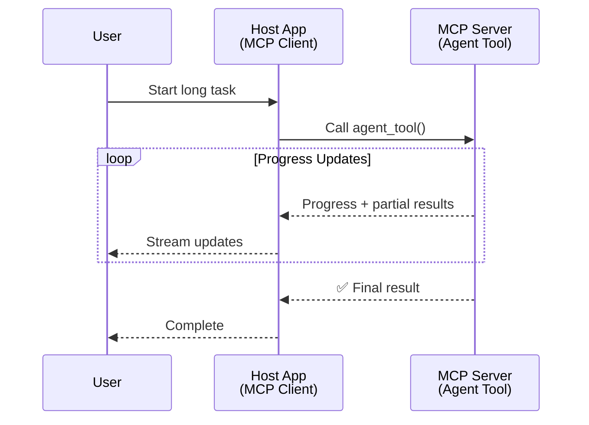
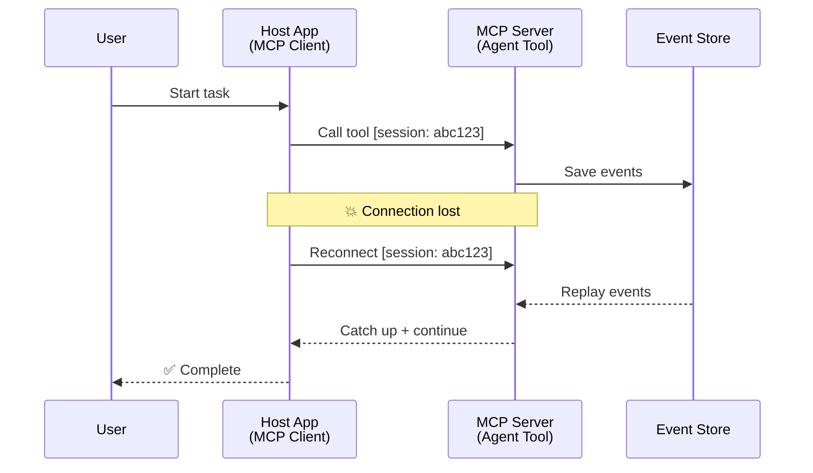
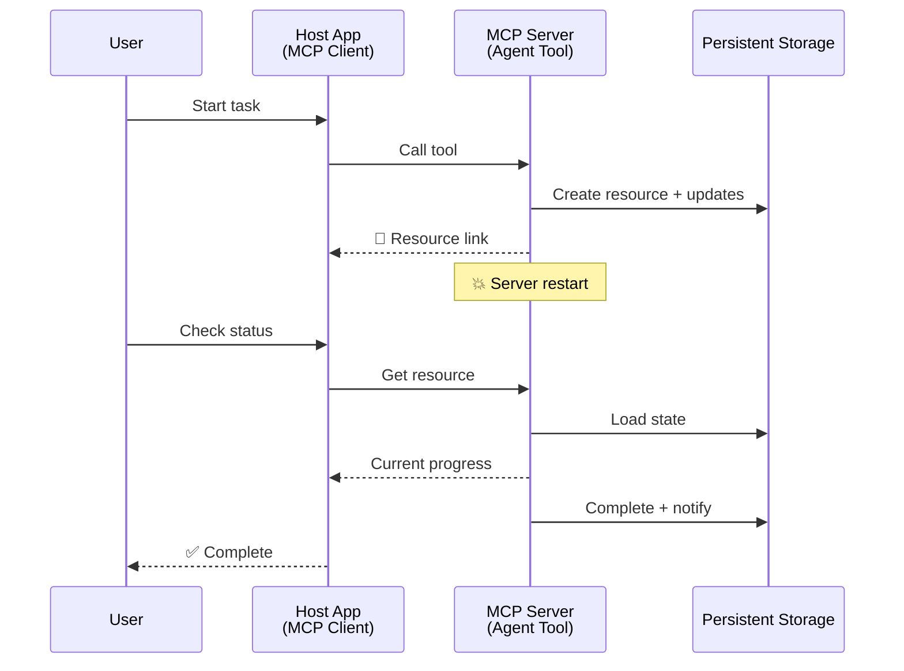
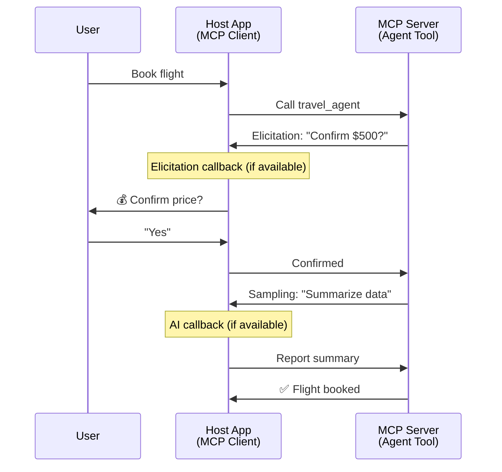

<!--
CO_OP_TRANSLATOR_METADATA:
{
  "original_hash": "5cc6836626047aa055e8960c8484a7d0",
  "translation_date": "2025-08-30T00:17:41+00:00",
  "source_file": "11-agentic-protocols/code_samples/mcp-agents/README.md",
  "language_code": "my"
}
-->
# MCP ဖြင့် အေးဂျင့်-မှ-အေးဂျင့် ဆက်သွယ်မှုစနစ်များ တည်ဆောက်ခြင်း

> TL;DR - MCP ပေါ်တွင် Agent2Agent ဆက်သွယ်မှု တည်ဆောက်နိုင်ပါသလား? ဟုတ်ပါတယ်!

MCP သည် "LLMs များအတွက် အကြောင်းအရာပံ့ပိုးမှု ပေးခြင်း" ဆိုသည့် မူလရည်ရွယ်ချက်ထက် အလွန်တိုးတက်လာပါပြီ။ [resumable streams](https://modelcontextprotocol.io/docs/concepts/transports#resumability-and-redelivery), [elicitation](https://modelcontextprotocol.io/specification/2025-06-18/client/elicitation), [sampling](https://modelcontextprotocol.io/specification/2025-06-18/client/sampling) နှင့် [progress](https://modelcontextprotocol.io/specification/2025-06-18/basic/utilities/progress) နှင့် [resources](https://modelcontextprotocol.io/specification/2025-06-18/schema#resourceupdatednotification) အပါအဝင် အဆင့်မြှင့်တင်မှုများဖြင့် MCP သည် အေးဂျင့်-မှ-အေးဂျင့် ဆက်သွယ်မှုစနစ်များ တည်ဆောက်ရန် အခိုင်အမာသော အခြေခံအုတ်မြစ်တစ်ခုကို ပံ့ပိုးပေးနိုင်ပါပြီ။

## အေးဂျင့်/Tool အထင်မှားမှု

အေးဂျင့်ဆန်သော အပြုအမူများ (ကြာရှည်စွာ လည်ပတ်နိုင်ခြင်း၊ အလယ်အလတ်တွင် ထပ်မံအချက်အလက်လိုအပ်နိုင်ခြင်း စသည်) ပါဝင်သော tools များကို တီထွင်နေသော developer များ များပြားလာသည့်အချိန်တွင် MCP သည် မသင့်တော်ကြောင်း အထင်မှားမှုတစ်ခု ရှိနေပါသည်။ ၎င်းသည် MCP ၏ tools primitive ၏ မူလဥပမာများသည် ရိုးရှင်းသော request-response ပုံစံများကို အဓိကထားခဲ့သောကြောင့် ဖြစ်ပါသည်။

ဤအမြင်သည် ယနေ့တွင် မမှန်တော့ပါ။ MCP specification သည် ကြာရှည်လည်ပတ်နိုင်သော အေးဂျင့်ဆန်သော အပြုအမူများ တည်ဆောက်ရန် လိုအပ်သော စွမ်းရည်များဖြင့် နောက်ဆုံးလများအတွင်း အလွန်တိုးတက်လာခဲ့ပါသည် -

- **Streaming & Partial Results**: လုပ်ဆောင်မှုအတွင်း အချိန်နှင့်တပြေးညီ တိုးတက်မှုများကို အပ်ဒိတ်ပေးခြင်း
- **Resumability**: Client များ disconnect ဖြစ်ပြီးနောက် ပြန်လည်ဆက်သွယ်၍ ဆက်လက်လုပ်ဆောင်နိုင်ခြင်း
- **Durability**: Server ပြန်လည်စတင်မှုများအပြီးတွင် ရလဒ်များ ဆက်လက်တည်ရှိနေခြင်း (ဥပမာ - resource links ဖြင့်)
- **Multi-turn**: လုပ်ဆောင်မှုအတွင်း အပြန်အလှန် အချက်အလက်ရယူခြင်း (elicitation နှင့် sampling)

ဤ features များကို ပေါင်းစပ်၍ MCP protocol ပေါ်တွင် ကြီးမားသော အေးဂျင့်ဆန်သော နှင့် multi-agent application များကို တည်ဆောက်နိုင်ပါသည်။

အညွှန်းအနေဖြင့် MCP server ပေါ်တွင် ရရှိနိုင်သော "tool" တစ်ခုအဖြစ် အေးဂျင့်ကို ရည်ညွှန်းပါမည်။ ၎င်းသည် MCP client တစ်ခုကို အစီအစဉ်တစ်ခုအဖြစ် အကောင်အထည်ဖော်ထားသော host application တစ်ခု ရှိနေသည်ကို ဆိုလိုပါသည်။ ၎င်း client သည် MCP server နှင့် session တစ်ခုကို တည်ဆောက်ပြီး အေးဂျင့်ကို ခေါ်နိုင်ပါသည်။

## MCP Tool တစ်ခုကို "Agentic" ဖြစ်စေသည့် အချက်များ

အကောင်အထည်ဖော်မှုကို စတင်မပြုမီ ကြာရှည်လည်ပတ်နိုင်သော အေးဂျင့်များကို ပံ့ပိုးရန် လိုအပ်သော အခြေခံအဆောက်အအုံ စွမ်းရည်များကို သတ်မှတ်လိုက်ပါမည်။

> အေးဂျင့်ကို ကြာရှည်လည်ပတ်နိုင်သော၊ အချိန်နှင့်တပြေးညီ အချက်အလက်များအပေါ် အခြေခံ၍ ပြန်လည်ညှိနှိုင်းမှုများ လိုအပ်နိုင်သော ရှုပ်ထွေးသော လုပ်ငန်းများကို ကိုင်တွယ်နိုင်သော အလိုအလျောက် လုပ်ဆောင်နိုင်သော entity တစ်ခုအဖြစ် သတ်မှတ်ပါမည်။

### 1. Streaming & Partial Results

ရိုးရှင်းသော request-response ပုံစံများသည် ကြာရှည်လည်ပတ်သော လုပ်ငန်းများအတွက် မသင့်တော်ပါ။ အေးဂျင့်များသည် အောက်ပါအချက်များကို ပံ့ပိုးပေးရန် လိုအပ်ပါသည် -

- အချိန်နှင့်တပြေးညီ တိုးတက်မှု အပ်ဒိတ်များ
- အလယ်အလတ် ရလဒ်များ

**MCP Support**: Resource update notifications သည် streaming partial results များကို ပံ့ပိုးပေးနိုင်ပါသည်။ သို့သော် JSON-RPC ၏ 1:1 request/response ပုံစံနှင့် မတူညီမှုများကို ရှောင်ရှားရန် သေချာစွာ ဒီဇိုင်းဆွဲရန် လိုအပ်ပါသည်။

| Feature                    | Use Case                                                                                                                                                                       | MCP Support                                                                                |
| -------------------------- | ------------------------------------------------------------------------------------------------------------------------------------------------------------------------------ | ------------------------------------------------------------------------------------------ |
| Real-time Progress Updates | အသုံးပြုသူသည် codebase migration လုပ်ငန်းတစ်ခုကို တောင်းဆိုသည်။ အေးဂျင့်သည် တိုးတက်မှုကို stream လုပ်ပေးသည် - "10% - Analyzing dependencies... 25% - Converting TypeScript files... 50% - Updating imports..."          | ✅ Progress notifications                                                                  |
| Partial Results            | "Generate a book" လုပ်ငန်းသည် အလယ်အလတ်ရလဒ်များကို stream လုပ်ပေးသည် - ၁) Story arc outline, ၂) Chapter list, ၃) အချိန်နှင့်တပြေးညီ ပြီးစီးသည့် Chapter များ။ Host သည် အချိန်မရွေး စစ်ဆေး၊ ဖျက်သိမ်း၊ သို့မဟုတ် redirect ပြုလုပ်နိုင်သည်။ | ✅ Notifications can be "extended" to include partial results see proposals on PR 383, 776 |

<div align="center" style="font-style: italic; font-size: 0.95em; margin-bottom: 0.5em;">
<strong>ပုံ ၁:</strong> ဤပုံသည် MCP အေးဂျင့်သည် ကြာရှည်လည်ပတ်သော လုပ်ငန်းတစ်ခုအတွင်း အချိန်နှင့်တပြေးညီ တိုးတက်မှု အပ်ဒိတ်များနှင့် အလယ်အလတ်ရလဒ်များကို host application သို့ stream လုပ်ပေးပုံကို ဖော်ပြထားသည်။
</div>



### 2. Resumability

အေးဂျင့်များသည် network ချိတ်ဆက်မှု ပြတ်တောက်မှုများကို သက်သာစွာ ကိုင်တွယ်နိုင်ရမည် -

- (client) disconnect ဖြစ်ပြီးနောက် ပြန်လည်ဆက်သွယ်နိုင်ခြင်း
- disconnect ဖြစ်သည့်နေရာမှ ဆက်လက်လုပ်ဆောင်နိုင်ခြင်း (message redelivery)

**MCP Support**: MCP StreamableHTTP transport သည် session IDs နှင့် last event IDs ဖြင့် session resumption နှင့် message redelivery ကို ပံ့ပိုးပေးပါသည်။ ဤနေရာတွင် အရေးကြီးသောအချက်မှာ server သည် client ပြန်လည်ဆက်သွယ်မှုအတွင်း event replays များကို ပံ့ပိုးပေးနိုင်ရန် EventStore တစ်ခုကို အကောင်အထည်ဖော်ထားရမည်ဖြစ်သည်။  
Transport-agnostic resumable streams ကို စူးစမ်းထားသော community proposal (PR #975) တစ်ခုလည်း ရှိပါသည်။

| Feature      | Use Case                                                                                                                                                   | MCP Support                                                                |
| ------------ | ---------------------------------------------------------------------------------------------------------------------------------------------------------- | -------------------------------------------------------------------------- |
| Resumability | Client သည် ကြာရှည်လည်ပတ်သော လုပ်ငန်းတစ်ခုအတွင်း disconnect ဖြစ်သည်။ ပြန်လည်ဆက်သွယ်မှုအတွင်း session သည် ပြတ်တောက်သည့်နေရာမှ ဆက်လက်လုပ်ဆောင်နိုင်သည်။ | ✅ StreamableHTTP transport with session IDs, event replay, and EventStore |

<div align="center" style="font-style: italic; font-size: 0.95em; margin-bottom: 0.5em;">
<strong>ပုံ ၂:</strong> ဤပုံသည် MCP ၏ StreamableHTTP transport နှင့် event store သည် seamless session resumption ကို မည်သို့ပံ့ပိုးပေးသည်ကို ဖော်ပြထားသည် - client disconnect ဖြစ်ပါက ပြန်လည်ဆက်သွယ်ပြီး ပြတ်တောက်သည့်နေရာမှ ဆက်လက်လုပ်ဆောင်နိုင်သည်။
</div>



### 3. Durability

ကြာရှည်လည်ပတ်သော အေးဂျင့်များသည် အောက်ပါအချက်များအတွက် အတည်ပြုထားသော အခြေအနေကို လိုအပ်ပါသည် -

- Server ပြန်လည်စတင်မှုများအပြီးတွင် ရလဒ်များ ဆက်လက်တည်ရှိနေခြင်း
- Status ကို out-of-band ဖြင့် ပြန်လည်ရယူနိုင်ခြင်း
- Session များအတွင်း တိုးတက်မှု tracking ပြုလုပ်နိုင်ခြင်း

**MCP Support**: MCP သည် tool calls များအတွက် Resource link return type ကို ပံ့ပိုးပေးပါသည်။ ယနေ့တွင် tool တစ်ခုကို resource တစ်ခု ဖန်တီးပြီး resource link ကို ချက်ချင်းပြန်ပေးသော ပုံစံကို ဒီဇိုင်းဆွဲရန် လက်တွေ့ကျသော နည်းလမ်းတစ်ခုဖြစ်သည်။ tool သည် background တွင် လုပ်ငန်းကို ဆက်လက်လုပ်ဆောင်ပြီး resource ကို update ပြုလုပ်နိုင်သည်။ Client သည် resource ၏ အခြေအနေကို poll လုပ်၍ partial သို့မဟုတ် full results များကို ရယူနိုင်သည် (server ပေးသော resource updates အပေါ်မူတည်၍) သို့မဟုတ် resource update notifications များကို subscribe လုပ်နိုင်သည်။

ဤနေရာတွင် polling resources သို့မဟုတ် updates များကို subscribe လုပ်ခြင်းသည် resource များကို စားသုံးနိုင်ပြီး scale တွင် သက်ရောက်မှုများ ရှိနိုင်သည်။ Webhooks သို့မဟုတ် triggers များကို server သည် client/host application သို့ update များကို အသိပေးရန် ခေါ်နိုင်စေရန် အလားအလာကို စူးစမ်းထားသော community proposal (အပါအဝင် #992) တစ်ခုလည်း ရှိပါသည်။

| Feature    | Use Case                                                                                                                                        | MCP Support                                                        |
| ---------- | ----------------------------------------------------------------------------------------------------------------------------------------------- | ------------------------------------------------------------------ |
| Durability | Server သည် data migration လုပ်ငန်းအတွင်း crash ဖြစ်သည်။ ရလဒ်များနှင့် တိုးတက်မှုများသည် ပြန်လည်စတင်မှုအပြီးတွင် ဆက်လက်တည်ရှိနေသည်။ Client သည် အခြေအနေကို စစ်ဆေးပြီး persistent resource မှ ဆက်လက်လုပ်ဆောင်နိုင်သည်။ | ✅ Resource links with persistent storage and status notifications |

ယနေ့တွင် tool တစ်ခုကို resource တစ်ခု ဖန်တီးပြီး resource link ကို ချက်ချင်းပြန်ပေးသော ပုံစံသည် ရိုးရှင်းသော နည်းလမ်းတစ်ခုဖြစ်သည်။ tool သည် background တွင် လုပ်ငန်းကို ဆက်လက်လုပ်ဆောင်ပြီး resource notifications များကို progress updates အဖြစ် သို့မဟုတ် partial results များအဖြစ် ထုတ်ပေးနိုင်သည်။

<div align="center" style="font-style: italic; font-size: 0.95em; margin-bottom: 0.5em;">
<strong>ပုံ ၃:</strong> ဤပုံသည် MCP အေးဂျင့်များသည် persistent resources နှင့် status notifications များကို အသုံးပြု၍ ကြာရှည်လည်ပတ်သော လုပ်ငန်းများသည် server ပြန်လည်စတင်မှုများအပြီးတွင် ဆက်လက်တည်ရှိနေစေရန် မည်သို့အလုပ်လုပ်သည်ကို ဖော်ပြထားသည်။
</div>



### 4. Multi-Turn Interactions

အေးဂျင့်များသည် လုပ်ဆောင်မှုအတွင်း အောက်ပါအချက်များအတွက် ထပ်မံအချက်အလက်လိုအပ်နိုင်သည် -

- လူ့အတည်ပြုချက် သို့မဟုတ် ရှင်းလင်းချက်
- ရှုပ်ထွေးသော ဆုံးဖြတ်ချက်များအတွက် AI အကူအညီ
- Dynamic parameter ပြင်ဆင်မှု

**MCP Support**: Sampling (AI input အတွက်) နှင့် elicitation (လူ့ input အတွက်) ဖြင့် အပြည့်အဝ ပံ့ပိုးပေးထားသည်။

| Feature                 | Use Case                                                                                                                                     | MCP Support                                           |
| ----------------------- | -------------------------------------------------------------------------------------------------------------------------------------------- | ----------------------------------------------------- |
| Multi-Turn Interactions | ခရီးသွားစာရင်း agent သည် အသုံးပြုသူထံမှ စျေးနှုန်းအတည်ပြုချက်တောင်းဆိုပြီးနောက် AI ကို ခရီးသွားအချက်အလက်များကို အကျဉ်းချုပ်ရန် တောင်းဆိုသည်။ | ✅ Elicitation for human input, sampling for AI input |

<div align="center" style="font-style: italic; font-size: 0.95em; margin-bottom: 0.5em;">
<strong>ပုံ ၄:</strong> ဤပုံသည် MCP အေးဂျင့်များသည် လုပ်ဆောင်မှုအတွင်း လူ့ input သို့မဟုတ် AI အကူအညီကို interactively elicit ပြုလုပ်နိုင်ပုံကို ဖော်ပြထားသည်။ ၎င်းသည် အတည်ပြုချက်များနှင့် dynamic ဆုံးဖြတ်ချက်များလိုအပ်သော ရှုပ်ထွေးသော multi-turn workflows များကို ပံ့ပိုးပေးသည်။
</div>



## MCP ပေါ်တွင် ကြာရှည်လည်ပတ်သော အေးဂျင့်များကို အကောင်အထည်ဖော်ခြင်း - Code အကျဉ်းချုပ်

ဤဆောင်းပါး၏ အစိတ်အပိုင်းအဖြစ် [code repository](https://github.com/victordibia/ai-tutorials/tree/main/MCP%20Agents) တစ်ခုကို ပံ့ပိုးပေးထားပြီး MCP Python SDK နှင့် StreamableHTTP transport ကို အသုံးပြု၍ session resumption နှင့် message redelivery ကို ပြသထားသည်။ ၎င်းသည် MCP ၏ စွမ်းရည်များကို ပေါင်းစပ်၍ အေးဂျင့်ဆန်သော အပြုအမူများကို မည်သို့ဖော်ဆောင်နိုင်သည်ကို ပြသထားသည်။

အထူးသဖြင့် server တွင် အဓိကအေးဂျင့် tools နှစ်ခုကို အကောင်အထည်ဖော်ထားသည် -

- **Travel Agent** - elicitation ဖြင့် စျေးနှုန်းအတည်ပြုချက်ကို simulate ပြုလုပ်သည့် ခရီးသွားစာရင်းဝန်ဆောင်မှု
- **Research Agent** - sampling ဖြင့် AI-assisted အကျဉ်းချုပ်များကို ပြုလုပ်သည့် သုတေသနလုပ်ငန်း

အေးဂျင့်နှစ်ခုစလုံးသည် အချိန်နှင့်တပြေးညီ တိုးတက်မှု အပ်ဒိတ်များ၊ interactive အတည်ပြုချက်များနှင့် session resumption စွမ်းရည်များကို ပြသထားသည်။

### အဓိက အကောင်အထည်ဖော်မှု အယူအဆများ

server-ဘက်အေးဂျင့် အကောင်အထည်ဖော်မှုနှင့် client-ဘက် host handling ကို အောက်ပါအပိုင်းများတွင် ဖော်ပြထားသည် -

#### Streaming & Progress Updates - လုပ်ငန်းအခြေအနေကို အချိန်နှင့်တပြေးညီ ပြသခြင်း

Streaming သည် ကြာရှည်လည်ပတ်သော လုပ်ငန်းများအတွင်း အချိန်နှင့်တပြေးညီ တိုးတက်မှု အပ်ဒိတ်များကို ပေးနိုင်စေပြီး အသုံးပြုသူများကို လုပ်ငန်းအခြေအနေနှင့် အလယ်အလတ်ရလဒ်များကို သိရှိစေသည်။

**Server Implementation (agent သည် progress notifications ပေးပို့သည်):**

```python
# From server/server.py - Travel agent sending progress updates
for i, step in enumerate(steps):
    await ctx.session.send_progress_notification(
        progress_token=ctx.request_id,
        progress=i * 25,
        total=100,
        message=step,
        related_request_id=str(ctx.request_id)
    )
    await anyio.sleep(2)  # Simulate work

# Alternative: Log messages for detailed step-by-step updates
await ctx.session.send_log_message(
    level="info",
    data=f"Processing step {current_step}/{steps} ({progress_percent}%)",
    logger="long_running_agent",
    related_request_id=ctx.request_id,
)
```

**Client Implementation (host သည် progress updates ကို လက်ခံသည်):**

```python
# From client/client.py - Client handling real-time notifications
async def message_handler(message) -> None:
    if isinstance(message, types.ServerNotification):
        if isinstance(message.root, types.LoggingMessageNotification):
            console.print(f"📡 [dim]{message.root.params.data}[/dim]")
        elif isinstance(message.root, types.ProgressNotification):
            progress = message.root.params
            console.print(f"🔄 [yellow]{progress.message} ({progress.progress}/{progress.total})[/yellow]")

# Register message handler when creating session
async with ClientSession(
    read_stream, write_stream,
    message_handler=message_handler
) as session:
```

#### Elicitation - အသုံးပြုသူ input တောင်းဆိုခြင်း

Elicitation သည် လုပ်ဆောင်မှုအတွင်း အသုံးပြုသူ input ကို တောင်းဆိုနိုင်စေသည်။ ၎င်းသည် ကြာရှည်လည်ပတ်သော လုပ်ငန်းများအတွင်း အတည်ပြုချက်များ၊ ရှင်းလင်းချက်များ သို့မဟုတ် အတည်ပြုချက်များအတွက် အရေးကြီးသည်။

**Server Implementation (agent သည် အတည်ပြုချက်တောင်းဆိုသည်):**

```python
# From server/server.py - Travel agent requesting price confirmation
elicit_result = await ctx.session.elicit(
    message=f"Please confirm the estimated price of $1200 for your trip to {destination}",
    requestedSchema=PriceConfirmationSchema.model_json_schema(),
    related_request_id=ctx.request_id,
)

if elicit_result and elicit_result.action == "accept":
    # Continue with booking
    logger.info(f"User confirmed price: {elicit_result.content}")
elif elicit_result and elicit_result.action == "decline":
    # Cancel the booking
    booking_cancelled = True
```

**Client Implementation (host သည် elicitation callback ကို ပံ့ပိုးပေးသည်):**

```python
# From client/client.py - Client handling elicitation requests
async def elicitation_callback(context, params):
    console.print(f"💬 Server is asking for confirmation:")
    console.print(f"   {params.message}")

    response = console.input("Do you accept? (y/n): ").strip().lower()

    if response in ['y', 'yes']:
        return types.ElicitResult(
            action="accept",
            content={"confirm": True, "notes": "Confirmed by user"}
        )
    else:
        return types.ElicitResult(
            action="decline",
            content={"confirm": False, "notes": "Declined by user"}
        )

# Register the callback when creating the session
async with ClientSession(
    read_stream, write_stream,
    elicitation_callback=elicitation_callback
) as session:
```

#### Sampling - AI အကူအညီ တောင်းဆိုခြင်း

Sampling သည် လုပ်ဆောင်မှုအတွင်း

---

**အကြောင်းကြားချက်**:  
ဤစာရွက်စာတမ်းကို AI ဘာသာပြန်ဝန်ဆောင်မှု [Co-op Translator](https://github.com/Azure/co-op-translator) ကို အသုံးပြု၍ ဘာသာပြန်ထားပါသည်။ ကျွန်ုပ်တို့သည် တိကျမှုအတွက် ကြိုးစားနေသော်လည်း၊ အလိုအလျောက် ဘာသာပြန်ခြင်းတွင် အမှားများ သို့မဟုတ် မတိကျမှုများ ပါဝင်နိုင်သည်ကို သတိပြုပါ။ မူရင်းစာရွက်စာတမ်းကို ၎င်း၏ မူရင်းဘာသာစကားဖြင့် အာဏာတရားရှိသော အရင်းအမြစ်အဖြစ် သတ်မှတ်သင့်ပါသည်။ အရေးကြီးသော အချက်အလက်များအတွက် လူ့ဘာသာပြန်ပညာရှင်များမှ ပရော်ဖက်ရှင်နယ် ဘာသာပြန်ခြင်းကို အကြံပြုပါသည်။ ဤဘာသာပြန်ကို အသုံးပြုခြင်းမှ ဖြစ်ပေါ်လာသော အလွဲအလွတ်များ သို့မဟုတ် အနားလွဲမှုများအတွက် ကျွန်ုပ်တို့သည် တာဝန်မယူပါ။