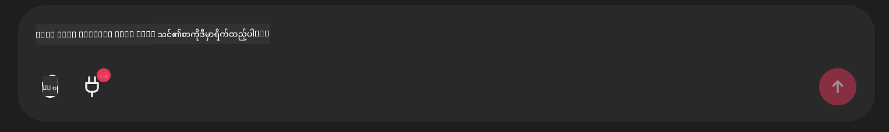

<!--
CO_OP_TRANSLATOR_METADATA:
{
  "original_hash": "9bf0395cbc541ce8db2a9699c8678dfc",
  "translation_date": "2025-07-12T14:25:23+00:00",
  "source_file": "11-mcp/code_samples/github-mcp/README.md",
  "language_code": "my"
}
-->
# Github MCP Server ဥပမာ

## ဖော်ပြချက်

ဤသည်မှာ Microsoft Reactor မှ ကျင်းပသော AI Agents Hackathon အတွက် ပြုလုပ်ထားသော ဒေမိုတစ်ခုဖြစ်သည်။

ဤကိရိယာကို အသုံးပြုသူ၏ Github repos များအပေါ် အခြေခံ၍ hackathon ပရောဂျက်များကို အကြံပြုရန် အသုံးပြုသည်။
လုပ်ဆောင်ပုံမှာ -

1. **Github Agent** - Github MCP Server ကို အသုံးပြု၍ repos များနှင့် အချက်အလက်များကို ရယူသည်။
2. **Hackathon Agent** - Github Agent မှရရှိသော ဒေတာများကို အသုံးပြု၍ အသုံးပြုသူ၏ ပရောဂျက်များ၊ အသုံးပြုသော programming ဘာသာစကားများနှင့် AI Agents hackathon ၏ ပရောဂျက် track များအပေါ် အခြေခံကာ ဖန်တီးမှုရှိသော hackathon ပရောဂျက် အကြံများ ထုတ်ပေးသည်။
3. **Events Agent** - hackathon agent ၏ အကြံပြုချက်အပေါ် အခြေခံကာ AI Agent Hackathon စီးရီးမှ သင့်တော်သော event များကို အကြံပြုပေးသည်။

## ကုဒ်ကို လည်ပတ်ခြင်း

### ပတ်ဝန်းကျင် အပြောင်းအလဲများ

ဤဒေမိုတွင် Azure Open AI Service, Semantic Kernel, Github MCP Server နှင့် Azure AI Search ကို အသုံးပြုသည်။

ဤကိရိယာများကို အသုံးပြုရန် သင့်တွင် သင့်တော်သော ပတ်ဝန်းကျင် အပြောင်းအလဲများ သတ်မှတ်ထားကြောင်း သေချာပါစေ။

```python
AZURE_OPENAI_CHAT_DEPLOYMENT_NAME=""
AZURE_OPENAI_EMBEDDING_DEPLOYMENT_NAME=""
AZURE_OPENAI_ENDPOINT=""
AZURE_OPENAI_API_KEY=""
AZURE_OPENAI_API_VERSION=""
AZURE_SEARCH_SERVICE_ENDPOINT=""
AZURE_SEARCH_API_KEY=""
```

## Chainlit Server ကို လည်ပတ်ခြင်း

MCP server နှင့် ချိတ်ဆက်ရန် ဒီဒေမိုတွင် Chainlit ကို chat interface အဖြစ် အသုံးပြုသည်။

server ကို လည်ပတ်ရန် terminal တွင် အောက်ပါ command ကို အသုံးပြုပါ-

```bash
chainlit run app.py -w
```

ဤကိရိယာသည် `localhost:8000` တွင် သင့် Chainlit server ကို စတင်လည်ပတ်စေပြီး Azure AI Search Index ကို `event-descriptions.md` အကြောင်းအရာဖြင့် ဖြည့်စွက်ပေးပါလိမ့်မည်။

## MCP Server နှင့် ချိတ်ဆက်ခြင်း

Github MCP Server နှင့် ချိတ်ဆက်ရန် "Type your message here.." chat box အောက်ရှိ "plug" အိုင်ကွန်ကို ရွေးချယ်ပါ-



ထိုနေရာမှ "Connect an MCP" ကို နှိပ်၍ Github MCP Server နှင့် ချိတ်ဆက်ရန် command ကို ထည့်ပါ-

```bash
npx -y @modelcontextprotocol/server-github --env GITHUB_PERSONAL_ACCESS_TOKEN=[YOUR PERSONAL ACCESS TOKEN]
```

"[YOUR PERSONAL ACCESS TOKEN]" ကို သင့်ရဲ့ တကယ့် Personal Access Token ဖြင့် အစားထိုးပါ။

ချိတ်ဆက်ပြီးပါက plug အိုင်ကွန်အနားတွင် (1) ကို မြင်ရမည်ဖြစ်ပြီး ချိတ်ဆက်မှု အတည်ပြုပါလိမ့်မည်။ မမြင်ရပါက `chainlit run app.py -w` ဖြင့် chainlit server ကို ပြန်လည်စတင်ကြည့်ပါ။

## ဒေမိုကို အသုံးပြုခြင်း

hackathon ပရောဂျက်များ အကြံပြုရန် agent workflow ကို စတင်ရန် အောက်ပါစာသားကဲ့သို့ ရိုက်ထည့်နိုင်သည်-

"Recommend hackathon projects for the Github user koreyspace"

Router Agent သည် သင့်တောင်းဆိုမှုကို ခွဲခြမ်းစိတ်ဖြာပြီး GitHub, Hackathon, Events agents များထဲမှ သင့်တောင်းဆိုမှုကို အကောင်းဆုံး ဖြေရှင်းနိုင်မည့် ပေါင်းစပ်မှုကို သတ်မှတ်ပေးမည်ဖြစ်သည်။ agents များသည် GitHub repository စစ်တမ်း၊ ပရောဂျက် အကြံပြုခြင်းနှင့် သင့်တော်သော နည်းပညာ event များအပေါ် အခြေခံကာ စုံလင်သော အကြံပြုချက်များ ပေးစွမ်းရန် ပူးပေါင်းဆောင်ရွက်သည်။

**အကြောင်းကြားချက်**  
ဤစာတမ်းကို AI ဘာသာပြန်ဝန်ဆောင်မှု [Co-op Translator](https://github.com/Azure/co-op-translator) ဖြင့် ဘာသာပြန်ထားပါသည်။ ကျွန်ုပ်တို့သည် တိကျမှန်ကန်မှုအတွက် ကြိုးစားသော်လည်း၊ အလိုအလျောက် ဘာသာပြန်ခြင်းများတွင် အမှားများ သို့မဟုတ် မှားယွင်းချက်များ ပါဝင်နိုင်ကြောင်း သတိပြုပါရန် မေတ္တာရပ်ခံအပ်ပါသည်။ မူရင်းစာတမ်းကို မိမိဘာသာစကားဖြင့်သာ တရားဝင်အရင်းအမြစ်အဖြစ် ယူဆသင့်ပါသည်။ အရေးကြီးသော အချက်အလက်များအတွက် လူ့ဘာသာပြန်ပညာရှင်မှ ဘာသာပြန်ခြင်းကို အကြံပြုပါသည်။ ဤဘာသာပြန်ချက်ကို အသုံးပြုရာမှ ဖြစ်ပေါ်လာနိုင်သည့် နားလည်မှုမှားယွင်းမှုများအတွက် ကျွန်ုပ်တို့သည် တာဝန်မယူပါ။