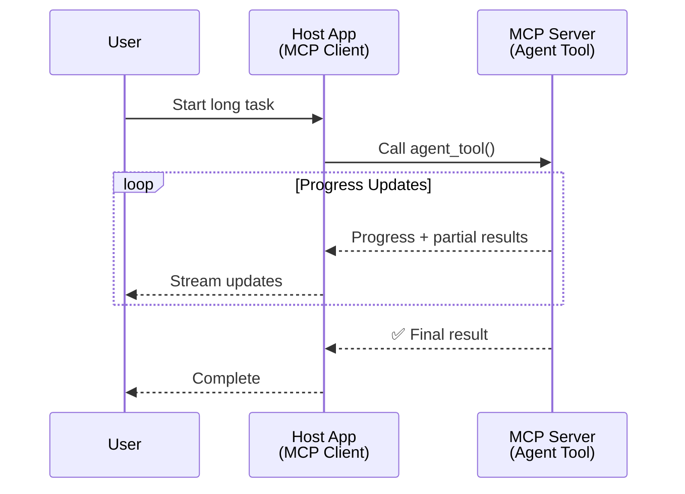
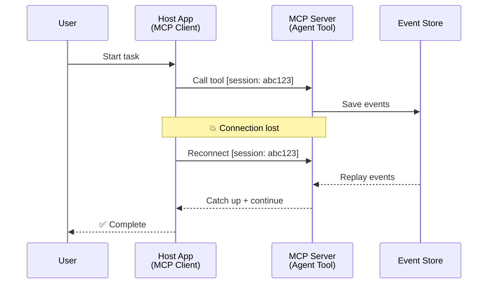
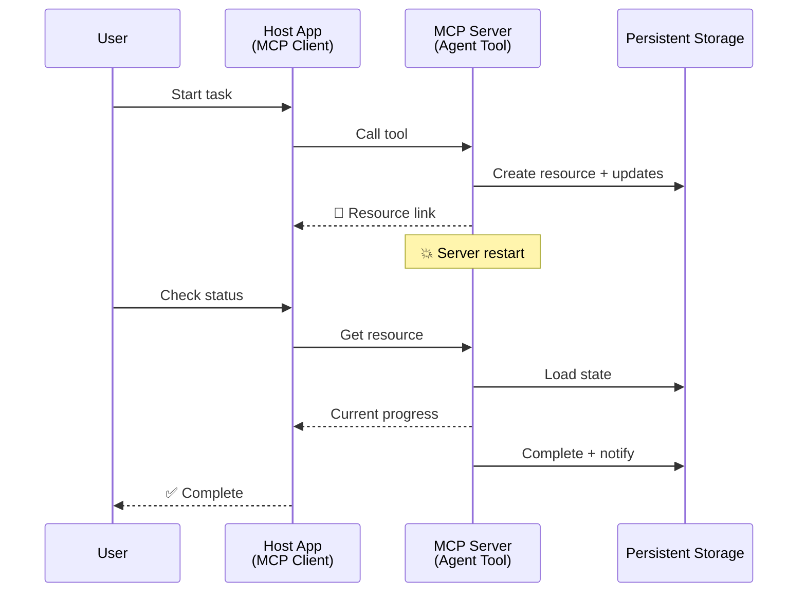
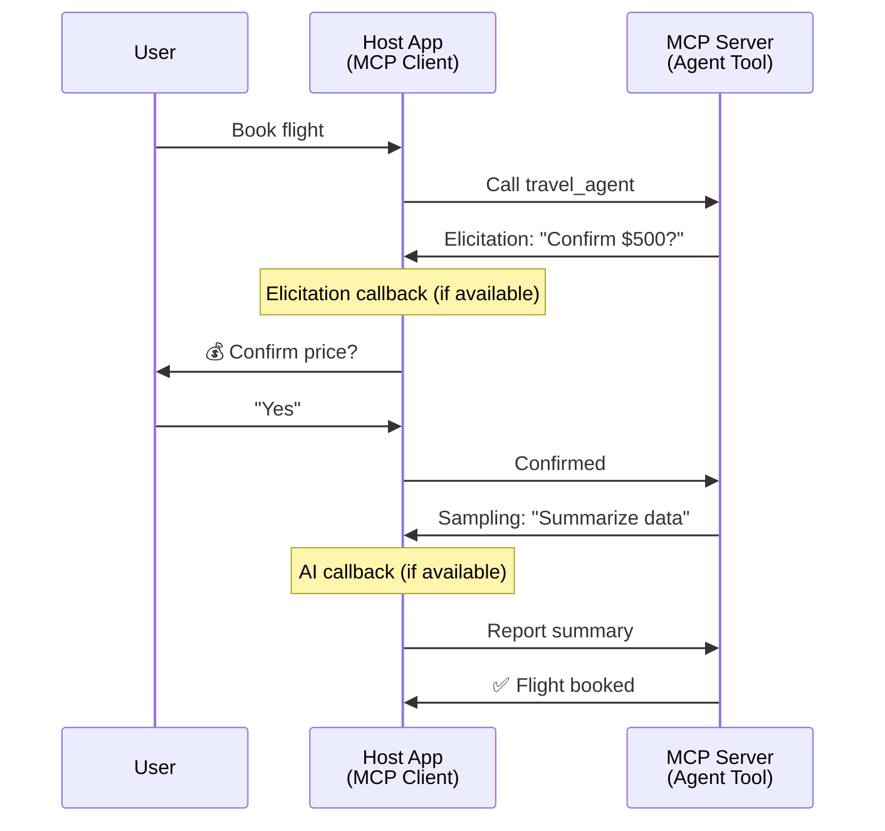
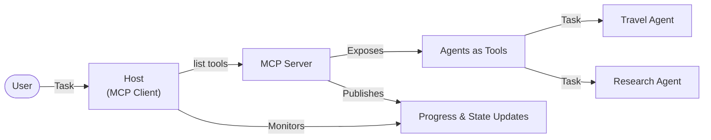

<!--
CO_OP_TRANSLATOR_METADATA:
{
  "original_hash": "5cc6836626047aa055e8960c8484a7d0",
  "translation_date": "2025-08-21T15:01:07+00:00",
  "source_file": "11-mcp/code_samples/mcp-agents/README.md",
  "language_code": "my"
}
-->
# MCP ဖြင့် Agent-to-Agent ဆက်သွယ်မှုစနစ်များ တည်ဆောက်ခြင်း

> TL;DR - MCP တွင် Agent2Agent ဆက်သွယ်မှု တည်ဆောက်နိုင်ပါသလား? ဟုတ်ကဲ့!

MCP သည် "LLMs များအတွက် အကြောင်းအရာပေးခြင်း" ဆိုသည့် မူလရည်ရွယ်ချက်ထက် အလွန်တိုးတက်လာခဲ့ပါသည်။ [resumable streams](https://modelcontextprotocol.io/docs/concepts/transports#resumability-and-redelivery), [elicitation](https://modelcontextprotocol.io/specification/2025-06-18/client/elicitation), [sampling](https://modelcontextprotocol.io/specification/2025-06-18/client/sampling), နှင့် [progress](https://modelcontextprotocol.io/specification/2025-06-18/basic/utilities/progress) နှင့် [resources](https://modelcontextprotocol.io/specification/2025-06-18/schema#resourceupdatednotification) အကြောင်းကြားချက်များအပါအဝင် နောက်ဆုံးတိုးတက်မှုများဖြင့် MCP သည် အဆင့်မြင့် agent-to-agent ဆက်သွယ်မှုစနစ်များ တည်ဆောက်ရန် အခြေခံအုတ်မြစ်အားကောင်းစွာပေးစွမ်းနိုင်ပါသည်။

## Agent/Tool အထင်မှား

Agentic အပြုအမူများ (ကြာရှည်စွာ လုပ်ဆောင်ခြင်း၊ အလုပ်လုပ်နေစဉ်အတွင်း ထပ်မံ input လိုအပ်နိုင်ခြင်း စသည်) ရှိသော tools များကို စမ်းသပ်နေသော developer များအနက် MCP သည် မသင့်တော်ကြောင်း အထင်မှားများ ရှိနေသည်။ အဓိကအကြောင်းရင်းမှာ MCP ၏ tools primitive မူလဥပမာများသည် ရိုးရှင်းသော request-response ပုံစံများကို အာရုံစိုက်ထားသောကြောင့် ဖြစ်ပါသည်။

ဤအမြင်သည် ယနေ့အခါ မမှန်တော့ပါ။ MCP specification သည် နောက်ဆုံးလများအတွင်း အလွန်တိုးတက်လာပြီး ကြာရှည်စွာ agentic အပြုအမူများ တည်ဆောက်ရန် လိုအပ်သော အင်္ဂါရပ်များကို ဖြည့်ဆည်းပေးနိုင်ပါသည်-

- **Streaming & Partial Results**: အလုပ်လုပ်နေစဉ် အချိန်နှင့်တပြေးညီ အခြေအနေများကို update ပေးခြင်း
- **Resumability**: Client များ disconnect ဖြစ်ပြီးနောက် ပြန်လည်ဆက်သွယ်နိုင်ခြင်း
- **Durability**: Server restart ဖြစ်ပါက ရလဒ်များ မပျောက်ဆုံးခြင်း (ဥပမာ- resource links)
- **Multi-turn**: အလုပ်လုပ်နေစဉ်အတွင်း interactive input ပေးနိုင်ခြင်း (elicitation နှင့် sampling)

ဤအင်္ဂါရပ်များကို ပေါင်းစပ်၍ MCP protocol ပေါ်တွင် အဆင့်မြင့် agentic နှင့် multi-agent application များ တည်ဆောက်နိုင်ပါသည်။

အညွှန်းအနေဖြင့် MCP server တွင် ရရှိနိုင်သော "tool" ကို agent အဖြစ် ရည်ညွှန်းပါမည်။ ဤသည်မှာ MCP client ကို implement လုပ်ထားသော host application တစ်ခု ရှိနေပြီး MCP server နှင့် session တစ်ခုကို တည်ဆောက်ကာ agent ကို ခေါ်နိုင်သည်ကို ဆိုလိုပါသည်။

## MCP Tool ကို "Agentic" ဖြစ်စေသော အချက်များ

Implementation ကို စတင်မလုပ်မီ ကြာရှည်စွာ agent များကို ပံ့ပိုးရန် လိုအပ်သော infrastructure အင်္ဂါရပ်များကို သတ်မှတ်လိုက်ပါမည်။

> Agent ကို ကြာရှည်စွာ အလုပ်လုပ်နိုင်သော entity အဖြစ် သတ်မှတ်ပါမည်။ ဤ agent သည် အချိန်နှင့်တပြေးညီ feedback အပေါ် အခြေခံ၍ အလုပ်များကို ပြန်လည်ပြင်ဆင်ခြင်း သို့မဟုတ် အများကြီး interaction လိုအပ်သော အလုပ်များကို လုပ်ဆောင်နိုင်ရမည်။

### 1. Streaming & Partial Results

ရိုးရှင်းသော request-response ပုံစံများသည် ကြာရှည်စွာ အလုပ်လုပ်ရန် မသင့်တော်ပါ။ Agent များသည် အောက်ပါအချက်များကို ပေးနိုင်ရမည်-

- အချိန်နှင့်တပြေးညီ progress update
- အလယ်အလတ်ရလဒ်များ

**MCP Support**: Resource update notifications သည် streaming partial results ကို enable လုပ်ပေးနိုင်သော်လည်း JSON-RPC ၏ 1:1 request/response model နှင့် conflict မဖြစ်စေရန် သေချာစွာ design လုပ်ရန် လိုအပ်ပါသည်။

| အင်္ဂါရပ်                     | အသုံးပြုမှု                                                                                                                                                                       | MCP Support                                                                                |
| -------------------------- | ------------------------------------------------------------------------------------------------------------------------------------------------------------------------------ | ------------------------------------------------------------------------------------------ |
| အချိန်နှင့်တပြေးညီ Progress Updates | User သည် codebase migration task တစ်ခုကို request လုပ်သည်။ Agent သည် progress ကို stream လုပ်ပေးသည်- "10% - Analyzing dependencies... 25% - Converting TypeScript files... 50% - Updating imports..."          | ✅ Progress notifications                                                                  |
| Partial Results            | "Generate a book" task သည် partial results ကို stream လုပ်ပေးသည်- ၁) Story arc outline, ၂) Chapter list, ၃) Chapter တစ်ခုစီကို ပြီးမြောက်သည့်အတိုင်း။ Host သည် inspection, cancellation, သို့မဟုတ် redirect လုပ်နိုင်သည်။ | ✅ Notifications ကို "extended" လုပ်၍ partial results ထည့်သွင်းနိုင်သည်။ PR 383, 776 အပေါ် အဆိုပြုချက်များကို ကြည့်ပါ။ |

<div align="center" style="font-style: italic; font-size: 0.95em; margin-bottom: 0.5em;">
<strong>ပုံ 1:</strong> MCP agent သည် ကြာရှည်စွာ အလုပ်လုပ်နေစဉ် host application သို့ အချိန်နှင့်တပြေးညီ progress updates နှင့် partial results ကို stream လုပ်ပေးသည့်ပုံကို ဖော်ပြထားသည်။
</div>



### 2. Resumability

Agent များသည် network interruption များကို gracefully handle လုပ်နိုင်ရမည်-

- (client) disconnect ဖြစ်ပြီးနောက် ပြန်လည်ဆက်သွယ်နိုင်ခြင်း
- disconnect ဖြစ်သည့်နေရာမှ ဆက်လက်လုပ်ဆောင်နိုင်ခြင်း (message redelivery)

**MCP Support**: MCP StreamableHTTP transport သည် session resumption နှင့် message redelivery ကို session IDs နှင့် last event IDs ဖြင့် ပံ့ပိုးပေးပါသည်။ Server သည် client reconnect ဖြစ်သည့်အခါ event replay များ enable လုပ်ပေးနိုင်သော EventStore ကို implement လုပ်ထားရမည်။  
Transport-agnostic resumable streams အပေါ် အဆိုပြုချက် (PR #975) ကိုလည်း community မှ တင်ပြထားပါသည်။

| အင်္ဂါရပ်      | အသုံးပြုမှု                                                                                                                                                   | MCP Support                                                                |
| ------------ | ---------------------------------------------------------------------------------------------------------------------------------------------------------- | -------------------------------------------------------------------------- |
| Resumability | Client သည် ကြာရှည်စွာ အလုပ်လုပ်နေစဉ် disconnect ဖြစ်သည်။ ပြန်လည်ဆက်သွယ်သည့်အခါ session သည် များလွှဲ replay လုပ်ပြီး seamless အနေဖြင့် ဆက်လက်လုပ်ဆောင်နိုင်သည်။ | ✅ StreamableHTTP transport with session IDs, event replay, and EventStore |

<div align="center" style="font-style: italic; font-size: 0.95em; margin-bottom: 0.5em;">
<strong>ပုံ 2:</strong> MCP ၏ StreamableHTTP transport နှင့် event store သည် seamless session resumption ကို ဘယ်လို enable လုပ်ပေးသလဲဆိုသည်ကို ဖော်ပြထားသည်- client disconnect ဖြစ်ပါက reconnect ပြုလုပ်ပြီး missed events များ replay လုပ်ကာ အလုပ်ကို ဆက်လက်လုပ်ဆောင်နိုင်သည်။
</div>



### 3. Durability

ကြာရှည်စွာ agent များသည် persistent state ရှိရမည်-

- Server restart ဖြစ်ပါက ရလဒ်များ မပျောက်ဆုံးခြင်း
- Status ကို out-of-band မှ retrieve လုပ်နိုင်ခြင်း
- Session များအကြား progress tracking

**MCP Support**: MCP သည် tool calls အတွက် Resource link return type ကို ပံ့ပိုးပေးပါသည်။ ယနေ့အခါ tool တစ်ခုကို design လုပ်၍ resource တစ်ခုကို ဖန်တီးပြီး resource link ကို ချက်ချင်း return ပြန်ပေးသည့် pattern ကို အသုံးပြုနိုင်ပါသည်။ Tool သည် background မှ task ကို ဆက်လက်လုပ်ဆောင်ပြီး resource ကို update လုပ်နိုင်သည်။ Client သည် resource ၏ state ကို poll လုပ်ကာ partial သို့မဟုတ် full results ကို ရယူနိုင်သည် (server ပေးသော resource updates အပေါ်မူတည်၍) သို့မဟုတ် resource ကို subscribe လုပ်ကာ update notifications ရယူနိုင်သည်။

ဤနေရာတွင် limitation တစ်ခုမှာ resource များကို poll လုပ်ခြင်း သို့မဟုတ် update များအတွက် subscribe လုပ်ခြင်းသည် resource များကို စွမ်းအင်များစားစေပြီး scale တွင် အကျိုးသက်ရောက်မှုများရှိနိုင်သည်။ Webhooks သို့မဟုတ် triggers များကို server မှ client/host application သို့ update များအကြောင်းကြားရန် အဆိုပြုချက် (PR #992 အပါအဝင်) ကို community မှ တင်ပြထားပါသည်။

| အင်္ဂါရပ်    | အသုံးပြုမှု                                                                                                                                        | MCP Support                                                        |
| ---------- | ----------------------------------------------------------------------------------------------------------------------------------------------- | ------------------------------------------------------------------ |
| Durability | Server သည် data migration task အတွင်း crash ဖြစ်သည်။ ရလဒ်များနှင့် progress သည် restart ဖြစ်ပြီးနောက် မပျောက်ဆုံးဘဲ client သည် status ကို စစ်ဆေးကာ persistent resource မှ ဆက်လက်လုပ်ဆောင်နိုင်သည်။ | ✅ Resource links with persistent storage and status notifications |

ယနေ့အခါ tool တစ်ခုကို design လုပ်၍ resource တစ်ခုကို ဖန်တီးပြီး resource link ကို ချက်ချင်း return ပြန်ပေးသည့် pattern သည် အများဆုံးအသုံးပြုနေသော pattern ဖြစ်သည်။ Tool သည် background မှ task ကို ဆက်လက်လုပ်ဆောင်ပြီး resource notifications များကို progress updates အဖြစ် သို့မဟုတ် partial results အဖြစ် ထုတ်ပေးနိုင်သည်။ Resource content ကို လိုအပ်သလို update လုပ်နိုင်သည်။

<div align="center" style="font-style: italic; font-size: 0.95em; margin-bottom: 0.5em;">
<strong>ပုံ 3:</strong> MCP agent များသည် persistent resources နှင့် status notifications ကို အသုံးပြုကာ server restart ဖြစ်ပါက ကြာရှည်စွာ task များကို ဆက်လက်လုပ်ဆောင်နိုင်စေရန် ဘယ်လိုအလုပ်လုပ်သလဲဆိုသည်ကို ဖော်ပြထားသည်။
</div>



### 4. Multi-Turn Interactions

Agent များသည် အလုပ်လုပ်နေစဉ်အတွင်း ထပ်မံ input လိုအပ်နိုင်သည်-

- လူ့ clarification သို့မဟုတ် အတည်ပြုချက်
- AI အကူအညီ (complex decisions အတွက်)
- Dynamic parameter ပြင်ဆင်ခြင်း

**MCP Support**: Sampling (AI input အတွက်) နှင့် elicitation (လူ့ input အတွက်) ဖြင့် အပြည့်အဝ ပံ့ပိုးပေးထားသည်။

| အင်္ဂါရပ်                 | အသုံးပြုမှု                                                                                                                                     | MCP Support                                           |
| ----------------------- | -------------------------------------------------------------------------------------------------------------------------------------------- | ----------------------------------------------------- |
| Multi-Turn Interactions | Travel booking agent သည် user မှ price အတည်ပြုချက်ကို တောင်းဆိုပြီးနောက် AI ကို travel data ကို အကျဉ်းချုပ်ပေးရန် တောင်းဆိုကာ booking transaction ကို ပြီးမြောက်စေသည်။ | ✅ Elicitation for human input, sampling for AI input |

<div align="center" style="font-style: italic; font-size: 0.95em; margin-bottom: 0.5em;">
<strong>ပုံ 4:</strong> MCP agent များသည် အလုပ်လုပ်နေစဉ်အတွင်း လူ့ input ကို interactively elicit လုပ်ခြင်း သို့မဟုတ် AI အကူအညီကို request လုပ်ခြင်းဖြင့် complex, multi-turn workflows များကို ဘယ်လိုပံ့ပိုးပေးနိုင်သည်ကို ဖော်ပြထားသည်။
</div>



## MCP တွင် ကြာရှည်စွာ Agent များကို Implement လုပ်ခြင်း - Code အကျဉ်းချုပ်

ဤဆောင်းပါး၏ အစိတ်အပိုင်းအနေဖြင့် [code repository](https://github.com/victordibia/ai-tutorials/tree/main/MCP%20Agents) တစ်ခုကို ပေးထားပြီး MCP Python SDK နှင့် StreamableHTTP transport ကို အသုံးပြုကာ session resumption နှင့် message redelivery ကို implement လုပ်ထားသော ကြာရှည်စွာ agent များ၏ အပြည့်အစုံ implementation ပါဝင်သည်။ Implementation သည် MCP capabilities များကို ပေါင်းစပ်ကာ sophisticated agent-like behaviors များ enable လုပ်ပေးပုံကို ပြသထားသည်။

အထူးသဖြင့် server တွင် အဓိက agent tools နှစ်ခုကို implement လုပ်ထားသည်-

- **Travel Agent** - elicitation ဖြင့် price အတည်ပြုချက်ကို simulate လုပ်သော travel booking service
- **Research Agent** - sampling ဖြင့် AI-assisted summaries ကို ပြုလုပ်သော research tasks

Agent နှစ်ခုစလုံးသည် အချိန်နှင့်တပြေးညီ progress updates, interactive confirmations, နှင့် full session resumption capabilities ကို ပြသထားသည်။

### အဓိက Implementation အကြောင်းအရာများ

အောက်ပါအပိုင်းများတွင် server-side agent implementation နှင့် client-side host handling ကို capability တစ်ခုစီအလိုက် ဖော်ပြထားသည်-

#### Streaming & Progress Updates - အချိန်နှင့်တပြေးညီ Task Status

Streaming သည် agent များကို ကြာရှည်စွာ task များအတွင်း အချိန်နှင့်တပြေးညီ progress updates ပေးနိုင်စေရန် enable လုပ်ပေးသည်။

**Server Implementation (agent progress notifications ပေးပို့သည်):**

```python
# From server/server.py - Travel agent sending progress updates
for i, step in enumerate(steps):
    await ctx.session.send_progress_notification(
        progress_token=ctx.request_id,
        progress=i * 25,
        total=100,
        message=step,
        related_request_id=str(ctx.request_id)
    )
    await anyio.sleep(2)  # Simulate work

# Alternative: Log messages for detailed step-by-step updates
await ctx.session.send_log_message(
    level="info",
    data=f"Processing step {current_step}/{steps} ({progress_percent}%)",
    logger="long_running_agent",
    related_request_id=ctx.request_id,
)
```

**Client Implementation (host progress updates ကို လက်ခံသည်):**

```python
# From client/client.py - Client handling real-time notifications
async def message_handler(message) -> None:
    if isinstance(message, types.ServerNotification):
        if isinstance(message.root, types.LoggingMessageNotification):
            console.print(f"📡 [dim]{message.root.params.data}[/dim]")
        elif isinstance(message.root, types.ProgressNotification):
            progress = message.root.params
            console.print(f"🔄 [yellow]{progress.message} ({progress.progress}/{progress.total})[/yellow]")

# Register message handler when creating session
async with ClientSession(
    read_stream, write_stream,
    message_handler=message_handler
) as session:
```

#### Elicitation - User Input တောင်းဆိုခြင်း

Elicitation သည် agent များကို အလုပ်လုပ်နေစဉ်အတွင်း user input ကို တောင်းဆိုနိုင်စေရန် enable လုပ်ပေးသည်။ ဤသည်သည် confirmations, clarifications, သို့မဟုတ် approvals အတွက် အရေးကြီးသည်။

**Server Implementation (agent confirmation တောင်းဆိုသည်):**

```python
# From server/server.py - Travel agent requesting price confirmation
elicit_result = await ctx.session.elicit(
    message=f"Please confirm the estimated price of $1200 for your trip to {destination}",
    requestedSchema=PriceConfirmationSchema.model_json_schema(),
    related_request_id=ctx.request_id,
)

if elicit_result and elicit_result.action == "accept":
    # Continue with booking
    logger.info(f"User confirmed price: {elicit_result.content}")
elif elicit_result and elicit_result.action == "decline":
    # Cancel the booking
    booking_cancelled = True
```

**Client Implementation (host elicitation callback ကို ပေးသည်):**

```python
# From client/client.py - Client handling elicitation requests
async def elicitation_callback(context, params):
    console.print(f"💬 Server is asking for confirmation:")
    console.print(f"   {params.message}")

    response = console.input("Do you accept? (y/n): ").strip().lower()

    if response in ['y', 'yes']:
        return types.ElicitResult(
            action="accept",
            content={"confirm": True, "notes": "Confirmed by user"}
        )
    else:
        return types.ElicitResult(
            action="decline",
            content={"confirm": False, "notes": "Declined by user"}
        )

# Register the callback when creating the session
async with ClientSession(
    read_stream, write_stream,
    elicitation_callback=elicitation_callback
) as session:
```

#### Sampling - AI အကူအညီ တောင်းဆိုခြင်း

Sampling သည် agent များကို အလုပ်လုပ်နေစဉ်အတွင်း complex decisions သို့မဟုတ် content generation အတွက် LLM အကူအညီကို တောင်းဆိုနိုင်စေရန် enable လုပ်ပေးသည်။ ဤသည်သည် လူ့-AI ပေါင်းစပ် workflows များကို support လုပ်ပေးသည်။

**Server Implementation (agent AI အကူအညီ တောင်းဆိုသည်):**

```python
# From server/server.py - Research agent requesting AI summary
sampling_result = await ctx.session.create_message(
    messages=[
        SamplingMessage(
            role="user",
            content=TextContent(type="text", text=f"Please summarize the key findings for research on: {topic}")
        )
    ],
    max_tokens=100,
    related_request_id=ctx.request_id,
)

if sampling_result and sampling_result.content:
    if sampling_result.content.type == "text":
        sampling_summary = sampling_result.content.text
        logger.info(f"Received sampling summary: {sampling_summary}")
```

**Client Implementation (host sampling callback ကို ပေးသည်):**

```python
# From client/client.py - Client handling sampling requests
async def sampling_callback(context, params):
    message_text = params.messages[0].content.text if params.messages else 'No message'
    console.print(f"🧠 Server requested sampling: {message_text}")

    # In a real application, this could call an LLM API
    # For demo purposes, we provide a mock response
    mock_response = "Based on current research, MCP has evolved significantly..."

    return types.CreateMessageResult(
        role="assistant",
        content=types.TextContent(type="text", text=mock_response),
        model="interactive-client",
        stopReason="endTurn"
    )

# Register the callback when creating the session
async with ClientSession(
    read_stream, write_stream,
    sampling_callback=sampling_callback,
    elicitation_callback=elicitation_callback
) as session:
```

#### Resumability - Disconnections အကြား Session Continuity

Resumability သည် client disconnect ဖြစ်ပါက ကြာရှည်စွာ agent task များကို ဆက်လက်လုပ်ဆောင်နိုင်စေရန် session continuity ကို ensure လုပ်ပေးသည်။ ဤသည်ကို event stores နှင့် resumption tokens ဖြင့် implement လုပ်ထားသည်။

**Event Store Implementation (server session state ကို သိမ်းဆည်းထားသည်):**

```python
# From server/event_store.py - Simple in-memory event store
class SimpleEventStore(EventStore):
    def __init__(self):
        self._events: list[tuple[StreamId, EventId, JSONRPCMessage]] = []
        self._event_id_counter = 0

    async def store_event(self, stream_id: StreamId, message: JSONRPCMessage) -> EventId:
        """Store an event and return its ID."""
        self._event_id_counter += 1
        event_id = str(self._event_id_counter)
        self._events.append((stream_id, event_id, message))
        return event_id

    async def replay_events_after(self, last_event_id: EventId, send_callback: EventCallback) -> StreamId | None:
        """Replay events after the specified ID for resumption."""
        # Find events after the last known event and replay them
        for _, event_id, message in self._events[start_index:]:
            await send_callback(EventMessage(message, event_id))

# From server/server.py - Passing event store to session manager
def create_server_app(event_store: Optional[EventStore] = None) -> Starlette:
    server = ResumableServer()

    # Create session manager with event store for resumption
    session_manager = StreamableHTTPSessionManager(
        app=server,
        event_store=event_store,  # Event store enables session resumption
        json_response=False,
        security_settings=security_settings,
    )

    return Starlette(routes=[Mount("/mcp", app=session_manager.handle_request)])

# Usage: Initialize with event store
event_store = SimpleEventStore()
app = create_server_app(event_store)
```

**Client Metadata with Resumption Token (client stored state ကို အသုံးပြုကာ reconnect ပြုလုပ်သည်):**

```python
# From client/client.py - Client resumption with metadata
if existing_tokens and existing_tokens.get("resumption_token"):
    # Use existing resumption token to continue where we left off
    metadata = ClientMessageMetadata(
        resumption_token=existing_tokens["resumption_token"],
    )
else:
    # Create callback to save resumption token when received
    def enhanced_callback(token: str):
        protocol_version = getattr(session, 'protocol_version', None)
        token_manager.save_tokens(session_id, token, protocol_version, command, args)

    metadata = ClientMessageMetadata(
        on_resumption_token_update=enhanced_callback,
    )

# Send request with resumption metadata
result = await session.send_request(
    types.ClientRequest(
        types.CallToolRequest(
            method="tools/call",
            params=types.CallToolRequestParams(name=command, arguments=args)
        )
    ),
    types.CallToolResult,
    metadata=metadata,
)
```

Host application သည် session IDs နှင့် resumption tokens ကို locally သိမ်းဆည်းထားပြီး reconnect ပြုလုပ်ကာ ရှိပြီးသား session များကို progress သို့မဟုတ် state မပျောက်ဆုံးဘဲ ဆက်လက်လုပ်ဆောင်နိုင်သည်။

### Code Organization

<div align="center" style="font-style: italic; font-size: 0.95em; margin-bottom: 0.5em;">
<strong>ပုံ 5:</strong> MCP-based agent system architecture
</div>



**အဓိက Files:**

- **`server/server.py`** - Travel နှင့် research agents ပါဝင်သော resumable MCP server
- **`client/client.py`** - Resumption support, callback handlers, နှင့် token management ပါဝင်သော interactive host application
- **`server/event_store.py`** - Session resumption နှင့် message redelivery ကို enable လုပ်ပေးသော event store implementation

## MCP တွင် Multi-Agent Communication သို့ တိုးချဲ့ခြင်း

အထက်ပါ implementation ကို multi-agent systems သို့ တိုးချဲ့ရန် host application ၏ intelligence နှင့် scope ကို တိုးမြှင့်နိုင်သည်-

- **Intelligent Task Decomposition**: Host သည် complex user requests များကို analysis ပြုလုပ်ကာ subtasks များကို specialized agents များအတွက် ခွဲခြားပေးသည်။
- **Multi-Server Coordination**: Host သည် MCP servers များစွာနှင့် connection များကို maintain လုပ်ကာ agent capabilities များကို expose လုပ်ပေးသည်။
- **Task State Management**: Host သည် concurrent agent tasks

**ဝက်ဘ်ဆိုက်မှတ်ချက်**:  
ဤစာရွက်စာတမ်းကို AI ဘာသာပြန်ဝန်ဆောင်မှု [Co-op Translator](https://github.com/Azure/co-op-translator) ကို အသုံးပြု၍ ဘာသာပြန်ထားပါသည်။ ကျွန်ုပ်တို့သည် တိကျမှန်ကန်မှုအတွက် ကြိုးစားနေပါသော်လည်း၊ အလိုအလျောက်ဘာသာပြန်ဆိုမှုများတွင် အမှားများ သို့မဟုတ် မမှန်ကန်မှုများ ပါဝင်နိုင်သည်ကို သတိပြုပါ။ မူရင်းစာရွက်စာတမ်းကို ၎င်း၏ မူလဘာသာစကားဖြင့် အာဏာတည်သောရင်းမြစ်အဖြစ် သတ်မှတ်သင့်ပါသည်။ အရေးကြီးသောအချက်အလက်များအတွက် လူပညာရှင်များမှ ပြုလုပ်သည့် လူ့ဘာသာပြန်ဆိုမှုကို အကြံပြုပါသည်။ ဤဘာသာပြန်ဆိုမှုကို အသုံးပြုခြင်းမှ ဖြစ်ပေါ်လာသည့် နားလည်မှုမှားမှုများ သို့မဟုတ် အဓိပ္ပာယ်မှားမှုများအတွက် ကျွန်ုပ်တို့သည် တာဝန်မယူပါ။ 