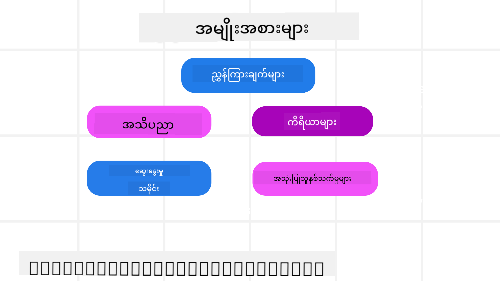
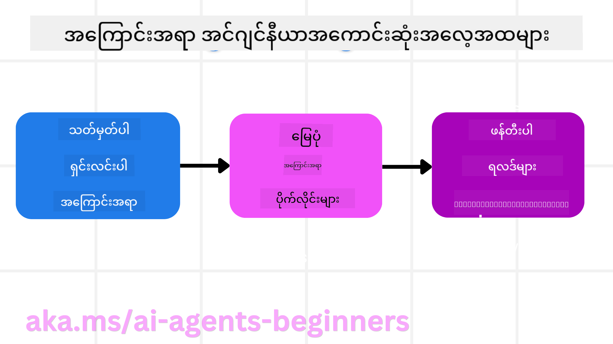

<!--
CO_OP_TRANSLATOR_METADATA:
{
  "original_hash": "cb7e50f471905ce6fdb92a30269a7a98",
  "translation_date": "2025-09-04T10:33:29+00:00",
  "source_file": "12-context-engineering/README.md",
  "language_code": "my"
}
-->
# AI အေးဂျင့်များအတွက် Context Engineering

> _(ဤသင်ခန်းစာ၏ ဗီဒီယိုကို ကြည့်ရန် အထက်ပါ ပုံကို နှိပ်ပါ)_

သင်တည်ဆောက်နေသော AI အေးဂျင့်၏ လျှောက်လွှာ၏ ရှုပ်ထွေးမှုကို နားလည်ခြင်းသည် ယုံကြည်ရသော AI အေးဂျင့်တစ်ခုကို ဖန်တီးရန် အရေးကြီးသည်။ Prompt engineering အထက်ကူးလွန်သော ရှုပ်ထွေးသော လိုအပ်ချက်များကို ဖြေရှင်းရန် သတင်းအချက်အလက်များကို ထိရောက်စွာ စီမံခန့်ခွဲနိုင်သော AI အေးဂျင့်များကို တည်ဆောက်ရန် လိုအပ်သည်။

ဤသင်ခန်းစာတွင် Context Engineering ဆိုတာဘာလဲ၊ AI အေးဂျင့်များတည်ဆောက်ရာတွင် ၎င်း၏ အခန်းကဏ္ဍကို လေ့လာမည်။

## အကျဉ်းချုပ်

ဤသင်ခန်းစာတွင် အောက်ပါအရာများကို လေ့လာမည်-

• **Context Engineering ဆိုတာဘာလဲ**၊ Prompt Engineering နှင့် ဘာကြောင့် ကွဲပြားနေသလဲ။

• **ထိရောက်သော Context Engineering အတွက် မဟာဗျူဟာများ**၊ သတင်းအချက်အလက်များကို ရေးသားခြင်း၊ ရွေးချယ်ခြင်း၊ ဖိနပ်ခြင်းနှင့် သီးခြားထားခြင်းအပေါ် အထူးအာရုံစိုက်ခြင်း။

• **အများဆုံးတွေ့ရသော Context Failures**၊ AI အေးဂျင့်ကို လမ်းပျောက်စေသော အမှားများနှင့် ၎င်းတို့ကို ပြုပြင်ရန် နည်းလမ်းများ။

## သင်ယူရမည့် ရည်မှန်းချက်များ

ဤသင်ခန်းစာပြီးဆုံးသောအခါ၊ သင်သည် အောက်ပါအရာများကို နားလည်နိုင်မည်-

• **Context Engineering ကို အဓိပ္ပာယ်ဖွင့်ဆိုခြင်း**၊ Prompt Engineering နှင့် ကွဲပြားမှုကို ခွဲခြားခြင်း။

• **LLM လျှောက်လွှာများတွင် Context ၏ အဓိကအစိတ်အပိုင်းများ**ကို ဖော်ထုတ်ခြင်း။

• **Context ကို ရေးသားခြင်း၊ ရွေးချယ်ခြင်း၊ ဖိနပ်ခြင်းနှင့် သီးခြားထားခြင်း** မဟာဗျူဟာများကို အသုံးပြု၍ အေးဂျင့်၏ စွမ်းဆောင်ရည်ကို တိုးတက်စေခြင်း။

• **Context Failures တွေ့ရသော အမှားများ** (ဥပမာ- Poisoning, Distraction, Confusion, Clash) ကို ခွဲခြားခြင်းနှင့် ၎င်းတို့ကို ကာကွယ်ရန် နည်းလမ်းများကို အကောင်အထည်ဖော်ခြင်း။

## Context Engineering ဆိုတာဘာလဲ?

AI အေးဂျင့်များအတွက် Context သည် AI အေးဂျင့်ကို တစ်ခုခုလုပ်ဆောင်ရန် စီမံကိန်းချမှတ်စေသော အဓိကအရာဖြစ်သည်။ Context Engineering သည် AI အေးဂျင့်အတွက် လိုအပ်သော အချက်အလက်များကို တစ်ဆင့်ဆင့်လုပ်ဆောင်နိုင်ရန် သေချာစေရန် လုပ်ဆောင်မှုဖြစ်သည်။ Context window သည် အရွယ်အစားကန့်သတ်ထားသောကြောင့် အေးဂျင့်တည်ဆောက်သူများအနေဖြင့် Context window အတွင်းသတင်းအချက်အလက်များကို ထည့်သွင်းခြင်း၊ ဖယ်ရှားခြင်းနှင့် ဖိနပ်ခြင်းစနစ်များကို စီမံခန့်ခွဲရန် လိုအပ်သည်။

### Prompt Engineering နှင့် Context Engineering

Prompt Engineering သည် AI အေးဂျင့်များကို စည်းကမ်းများဖြင့် လမ်းညွှန်ရန် တစ်ခုတည်းသော Static Instruction Set ကို အာရုံစိုက်ထားသည်။ Context Engineering သည် Dynamic သတင်းအချက်အလက်များကို စီမံခန့်ခွဲခြင်းဖြစ်ပြီး၊ အစပိုင်း Prompt ကိုပါ ထည့်သွင်းပြီး အေးဂျင့်အတွက် လိုအပ်သော အချက်အလက်များကို အချိန်ကြာမြင့်စွာ ထိန်းသိမ်းထားရန် အရေးပါသည်။ Context Engineering ၏ အဓိကအယူအဆမှာ ၎င်းကို ထပ်တလဲလဲ ပြုလုပ်နိုင်ပြီး ယုံကြည်စိတ်ချရသော ဖြစ်စဉ်တစ်ခုအဖြစ် ဖန်တီးရန်ဖြစ်သည်။

### Context ၏ အမျိုးအစားများ

Context သည် တစ်ခုတည်းသော အရာမဟုတ်ကြောင်း သတိထားပါ။ AI အေးဂျင့်အတွက် လိုအပ်သော သတင်းအချက်အလက်များသည် အမျိုးမျိုးသော အရင်းအမြစ်များမှ ရရှိနိုင်ပြီး၊ အေးဂျင့်အနေဖြင့် ၎င်းတို့ကို အသုံးပြုနိုင်ရန် သေချာစေရန် ကျွန်ုပ်တို့၏ တာဝန်ဖြစ်သည်-

AI အေးဂျင့်အတွက် စီမံခန့်ခွဲရန် လိုအပ်သော Context အမျိုးအစားများမှာ-

• **အညွှန်းများ:** အေးဂျင့်၏ "စည်းကမ်းများ" ဖြစ်သည်။ Prompt များ၊ System Messages၊ Few-shot Examples (AI ကို တစ်ခုခုလုပ်ဆောင်ရန် သင်ကြားခြင်း) နှင့် အသုံးပြုနိုင်သော Tools များ၏ ဖော်ပြချက်များ ပါဝင်သည်။ Prompt Engineering နှင့် Context Engineering တို့၏ အဓိကအာရုံစိုက်မှုသည် ဤနေရာတွင် ပေါင်းစည်းသည်။

• **အသိပညာ:** အချက်အလက်များ၊ Database များမှ ရယူထားသော သတင်းအချက်အလက်များ၊ သို့မဟုတ် အေးဂျင့်၏ ရေရှည်မှတ်ဉာဏ်များ ပါဝင်သည်။ AI အေးဂျင့်အနေဖြင့် Knowledge Stores နှင့် Databases များကို အသုံးပြုရန် RAG System တစ်ခုကို ပေါင်းစည်းခြင်းပါဝင်သည်။

• **Tools:** အေးဂျင့်အနေဖြင့် ခေါ်ယူနိုင်သော အပြင်ပ Function များ၊ APIs နှင့် MCP Servers များ၏ ဖော်ပြချက်များ၊ ၎င်းတို့ကို အသုံးပြုပြီးရရှိသော Feedback များ ပါဝင်သည်။

• **စကားဝိုင်းသမိုင်း:** အသုံးပြုသူနှင့် ဆက်သွယ်မှုများ။ အချိန်ကြာမြင့်သည့်အခါ၊ ဤစကားဝိုင်းများသည် ပိုရှုပ်ထွေးလာပြီး Context window အတွင်း နေရာယူသည်။

• **အသုံးပြုသူ၏ အကြိုက်အနှစ်များ:** အချိန်ကြာမြင့်သည့်အခါ အသုံးပြုသူ၏ အကြိုက်အနှစ်များကို သင်ယူထားသော သတင်းအချက်အလက်များ။ ၎င်းတို့ကို အရေးကြီးဆုံး ဆုံးဖြတ်ချက်များကို လုပ်ဆောင်ရာတွင် အသုံးပြုနိုင်သည်။

## ထိရောက်သော Context Engineering အတွက် မဟာဗျူဟာများ

### စီမံကိန်းချမှတ်မှု မဟာဗျူဟာများ

ထိရောက်သော Context Engineering သည် ကောင်းမွန်သော စီမံကိန်းချမှတ်မှုမှ စတင်သည်။ Context Engineering ကို အကောင်အထည်ဖော်ရန် အောက်ပါနည်းလမ်းများကို စဉ်းစားရန် ကူညီမည်-

1. **ရလဒ်များကို ရှင်းလင်းစွာ သတ်မှတ်ပါ** - AI အေးဂျင့်များကို ပေးအပ်မည့် Task များ၏ ရလဒ်များကို ရှင်းလင်းစွာ သတ်မှတ်ထားရမည်။ "AI အေးဂျင့်သည် ၎င်း၏ Task ကို ပြီးဆုံးသောအခါ ကမ္ဘာသည် ဘယ်လိုပုံစံရှိမည်နည်း?" ဆိုသည့် မေးခွန်းကို ဖြေဆိုပါ။ အခြားနည်းဖြင့်၊ အသုံးပြုသူသည် AI အေးဂျင့်နှင့် ဆက်သွယ်ပြီးနောက် ရရှိသင့်သော အပြောင်းအလဲ၊ သတင်းအချက်အလက် သို့မဟုတ် တုံ့ပြန်မှုကို သတ်မှတ်ပါ။

2. **Context ကို Map လုပ်ပါ** - AI အေးဂျင့်၏ ရလဒ်များကို သတ်မှတ်ပြီးနောက်၊ "AI အေးဂျင့်သည် ဤ Task ကို ပြီးမြောက်စေရန် ဘာသတင်းအချက်အလက်များ လိုအပ်မည်နည်း?" ဆိုသည့် မေးခွန်းကို ဖြေဆိုပါ။ ဤနည်းဖြင့် သတင်းအချက်အလက်များ ရှိနေသောနေရာကို Map လုပ်နိုင်မည်။

3. **Context Pipelines ဖန်တီးပါ** - သတင်းအချက်အလက်များ ရှိနေသောနေရာကို သိပြီးနောက်၊ "AI အေးဂျင့်သည် ဤသတင်းအချက်အလက်များကို ဘယ်လိုရယူမည်နည်း?" ဆိုသည့် မေးခွန်းကို ဖြေဆိုပါ။ RAG၊ MCP Servers အသုံးပြုခြင်းနှင့် အခြား Tools များကို အသုံးပြု၍ ၎င်းကို ပြုလုပ်နိုင်သည်။

### လက်တွေ့ကျသော မဟာဗျူဟာများ

စီမံကိန်းချမှတ်မှုသည် အရေးကြီးသော်လည်း သတင်းအချက်အလက်များသည် AI အေးဂျင့်၏ Context window အတွင်း စတင်ဝင်လာသောအခါ၊ ၎င်းကို စီမံခန့်ခွဲရန် လက်တွေ့ကျသော မဟာဗျူဟာများ လိုအပ်သည်-

#### Context ကို စီမံခန့်ခွဲခြင်း

သတင်းအချက်အလက်များအနည်းငယ်သည် Context window အတွင်း အလိုအလျောက် ထည့်သွင်းမည်ဖြစ်သော်လည်း၊ Context Engineering သည် ဤသတင်းအချက်အလက်များကို ပိုမိုတက်ကြွစွာ စီမံခန့်ခွဲခြင်းဖြစ်သည်။ ဤလုပ်ဆောင်မှုကို အောက်ပါနည်းလမ်းများဖြင့် ပြုလုပ်နိုင်သည်-

1. **Agent Scratchpad**
AI အေးဂျင့်သည် တစ် session အတွင်း လက်ရှိ Task နှင့် အသုံးပြုသူနှင့် ဆက်သွယ်မှုများအပေါ် သက်ဆိုင်သော သတင်းအချက်အလက်များကို မှတ်စုတစ်ခုအဖြစ် ရေးသားနိုင်သည်။ ၎င်းသည် Context window အပြင်ရှိ File သို့မဟုတ် Runtime Object တစ်ခုအဖြစ် ရှိသင့်ပြီး၊ လိုအပ်ပါက session အတွင်း ပြန်လည်ရယူနိုင်သည်။

2. **Memories**
Scratchpad များသည် တစ် session အတွင်း Context window အပြင်ရှိ သတင်းအချက်အလက်များကို စီမံခန့်ခွဲရန် ကောင်းမွန်သည်။ Memories များသည် အေးဂျင့်များကို အများစွာသော session များအတွင်း သက်ဆိုင်သော သတင်းအချက်အလက်များကို သိမ်းဆည်းပြီး ပြန်လည်ရယူနိုင်စေသည်။ ဤအချက်အလက်များတွင် အကျဉ်းချုပ်များ၊ အသုံးပြုသူ၏ အကြိုက်အနှစ်များနှင့် အနာဂတ်အတွက် တိုးတက်မှုအကြံပြုချက်များ ပါဝင်နိုင်သည်။

3. **Context ကို ဖိနပ်ခြင်း**
Context window သည် ကြီးထွားလာပြီး ၎င်း၏ အကန့်အသတ်ကို ရောက်ရှိနေသောအခါ၊ အကျဉ်းချုပ်ရေးခြင်းနှင့် အဟောင်းဆုံး Messages များကို ဖယ်ရှားခြင်းကဲ့သို့သော နည်းလမ်းများကို အသုံးပြုနိုင်သည်။

4. **Multi-Agent Systems**
Multi-Agent Systems တည်ဆောက်ခြင်းသည် Context Engineering ၏ အမျိုးအစားတစ်ခုဖြစ်သည်။ အေးဂျင့်တစ်ခုစီတွင် ၎င်း၏ Context window ရှိပြီး၊ Context ကို အေးဂျင့်များအကြား မျှဝေခြင်းနှင့် လွှဲပြောင်းခြင်းကို စီမံခန့်ခွဲရန် လိုအပ်သည်။

5. **Sandbox Environments**
AI အေးဂျင့်သည် Code တစ်ခုကို run လုပ်ရန် သို့မဟုတ် Document တစ်ခုအတွင်း သတင်းအချက်အလက်များကို အများအပြား စစ်ဆေးရန် လိုအပ်ပါက၊ ၎င်းသည် Context window အတွင်း Token များကို အများအပြား အသုံးပြုနိုင်သည်။ Context window အတွင်းသိုလှောင်ခြင်းအစား၊ အေးဂျင့်သည် Sandbox Environment ကို အသုံးပြု၍ Code ကို run လုပ်ပြီး ရလဒ်များနှင့် သက်ဆိုင်သော သတင်းအချက်အလက်များကိုသာ ဖတ်ရှုနိုင်သည်။

6. **Runtime State Objects**
AI အေးဂျင့်သည် သတ်မှတ်ထားသော သတင်းအချက်အလက်များကို ရယူရန် လိုအပ်သောအခါ၊ သတင်းအချက်အလက်များကို စီမံခန့်ခွဲရန် Containers တစ်ခုကို ဖန်တီးခြင်းဖြစ်သည်။ ရှုပ်ထွေးသော Task တစ်ခုအတွက်၊ ၎င်းသည် Subtask တစ်ခုစီ၏ ရလဒ်များကို အဆင့်ဆင့် သိမ်းဆည်းရန် အေးဂျင့်ကို ခွင့်ပြုပြီး၊ Context ကို ထို Subtask သို့သာ ဆက်စပ်ထားနိုင်သည်။

### Context Engineering ၏ နမူနာ

ဥပမာအားဖြင့် AI အေးဂျင့်ကို **"ပဲရစ်သို့ ခရီးသွားရန် စီစဉ်ပေးပါ။"** ဟု မေးမြန်းလိုက်ပါစေ။

• Prompt Engineering ကိုသာ အသုံးပြုသော အေးဂျင့်တစ်ခုသည် **"အိုကေ၊ သင် ဘယ်အချိန်မှာ ပဲရစ်သို့ သွားချင်ပါသလဲ?"** ဟု တုံ့ပြန်နိုင်သည်။ ၎င်းသည် အသုံးပြုသူ၏ မေးခွန်းကို တိုက်ရိုက် ဖြေရှင်းသည့်အခါတွင်သာ အလုပ်လုပ်သည်။

• Context Engineering မဟာဗျူဟာများကို အသုံးပြုသော အေးဂျင့်တစ်ခုသည် ပိုမိုလုပ်ဆောင်နိုင်သည်။ တုံ့ပြန်မီ၎င်း၏စနစ်သည်-

  ◦ **သင့်ရက်အချိန်ဇယားကို စစ်ဆေးသည်** (Real-time Data ကို ရယူခြင်း)။

 ◦ **အတိတ်ခရီးသွားအကြိုက်အနှစ်များကို မှတ်မိသည်** (ရေရှည်မှတ်ဉာဏ်မှ)၊ သင့်အကြိုက်ဆုံး လေကြောင်းလိုင်း၊ ဘတ်ဂျက် သို့မဟုတ် သင့်အကြိုက် Direct Flights များကို မှတ်မိသည်။

 ◦ **Flight နှင့် Hotel Booking အတွက် အသုံးပြုနိုင်သော Tools များကို ဖော်ထုတ်သည်**။

- ထို့နောက်၊ တုံ့ပြန်မှုဥပမာမှာ- "ဟေး [သင့်နာမည်]! သင့်ရက်အချိန်ဇယားအရ သင် အောက်တိုဘာပထမအပတ်တွင် အားလပ်နေသည်ကို တွေ့ရသည်။ သင့်အကြိုက်ဆုံး လေကြောင်းလိုင်းဖြင့် Direct Flights များကို သင့်ဘတ်ဂျက်အတွင်း ရှာဖွေပါမလား?" ဖြစ်နိုင်သည်။ Context Engineering ၏ အားသာချက်ကို ပြသသည့် Context-aware Response တစ်ခုဖြစ်သည်။

## အများဆုံးတွေ့ရသော Context Failures

### Context Poisoning

**ဘာလဲ:** LLM မှ ဖန်တီးထားသော အမှား (Hallucination) သို့မဟုတ် Error တစ်ခု Context အတွင်း ဝင်ရောက်ပြီး၊ ၎င်းကို ထပ်တလဲလဲ ရည်ညွှန်းခြင်းကြောင့် အေးဂျင့်သည် မဖြစ်နိုင်သော ရည်မှန်းချက်များကို လိုက်နာရန် သို့မဟုတ် အဓိပ္ပာယ်မရှိသော မဟာဗျူဟာများကို ဖွံ့ဖြိုးစေသည်။

**ဘာလုပ်မလဲ:** **Context Validation** နှင့် **Quarantine** ကို အကောင်အထည်ဖော်ပါ။ ရေရှည်မှတ်ဉာဏ်ထဲသို့ ထည့်သွင်းမည့် သတင်းအချက်အလက်များကို Validate လုပ်ပါ။ Poisoning ဖြစ်နိုင်မှုကို တွေ့ရှိပါက၊ အမှားအချက်အလက်များကို ပျံ့နှံ့မှုကို ကာကွယ်ရန် Context Threads အသစ်များကို စတင်ပါ။

**Travel Booking Example:**

---

**ဝက်ဘ်ဆိုက်မှတ်ချက်**:  
ဤစာရွက်စာတမ်းကို AI ဘာသာပြန်ဝန်ဆောင်မှု [Co-op Translator](https://github.com/Azure/co-op-translator) ကို အသုံးပြု၍ ဘာသာပြန်ထားပါသည်။ ကျွန်ုပ်တို့သည် တိကျမှန်ကန်မှုအတွက် ကြိုးစားနေပါသော်လည်း၊ အလိုအလျောက်ဘာသာပြန်မှုများတွင် အမှားများ သို့မဟုတ် မမှန်ကန်မှုများ ပါဝင်နိုင်သည်ကို ကျေးဇူးပြု၍ သတိပြုပါ။ မူရင်းစာရွက်စာတမ်းကို ၎င်း၏ မူလဘာသာစကားဖြင့် အာဏာတည်သောရင်းမြစ်အဖြစ် သတ်မှတ်ရန် လိုအပ်ပါသည်။ အရေးကြီးသော အချက်အလက်များအတွက် လူကောင်းမွန်သော ပရော်ဖက်ရှင်နယ်ဘာသာပြန်ဝန်ဆောင်မှုကို အကြံပြုပါသည်။ ဤဘာသာပြန်မှုကို အသုံးပြုခြင်းမှ ဖြစ်ပေါ်လာသော နားလည်မှုမှားများ သို့မဟုတ် အဓိပ္ပါယ်မှားများအတွက် ကျွန်ုပ်တို့သည် တာဝန်မယူပါ။