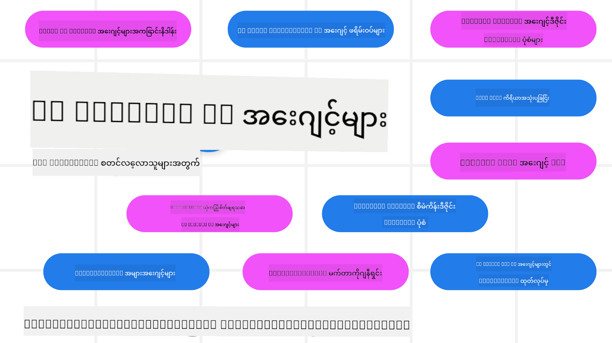

<!--
CO_OP_TRANSLATOR_METADATA:
{
  "original_hash": "6b07046397366e6f6f4524c9ddeba1e1",
  "translation_date": "2025-07-12T15:02:37+00:00",
  "source_file": "README.md",
  "language_code": "my"
}
-->
# AI Agents for Beginners - သင်တန်း

## AI Agents တည်ဆောက်ဖို့ လိုအပ်တဲ့ အချက်အားလုံးကို သင်ကြားပေးမယ့် ၁၁ ပုဒ်မ

### 🌐 ဘာသာစကားစုံကို ထောက်ပံ့မှု

#### GitHub Action ဖြင့် ထောက်ပံ့ထားပြီး (အလိုအလျောက်နဲ့ အမြဲတမ်းအသစ်)

[French](../fr/README.md) | [Spanish](../es/README.md) | [German](../de/README.md) | [Russian](../ru/README.md) | [Arabic](../ar/README.md) | [Persian (Farsi)](../fa/README.md) | [Urdu](../ur/README.md) | [Chinese (Simplified)](../zh/README.md) | [Chinese (Traditional, Macau)](../mo/README.md) | [Chinese (Traditional, Hong Kong)](../hk/README.md) | [Chinese (Traditional, Taiwan)](../tw/README.md) | [Japanese](../ja/README.md) | [Korean](../ko/README.md) | [Hindi](../hi/README.md) | [Bengali](../bn/README.md) | [Marathi](../mr/README.md) | [Nepali](../ne/README.md) | [Punjabi (Gurmukhi)](../pa/README.md) | [Portuguese (Portugal)](../pt/README.md) | [Portuguese (Brazil)](../br/README.md) | [Italian](../it/README.md) | [Polish](../pl/README.md) | [Turkish](../tr/README.md) | [Greek](../el/README.md) | [Thai](../th/README.md) | [Swedish](../sv/README.md) | [Danish](../da/README.md) | [Norwegian](../no/README.md) | [Finnish](../fi/README.md) | [Dutch](../nl/README.md) | [Hebrew](../he/README.md) | [Vietnamese](../vi/README.md) | [Indonesian](../id/README.md) | [Malay](../ms/README.md) | [Tagalog (Filipino)](../tl/README.md) | [Swahili](../sw/README.md) | [Hungarian](../hu/README.md) | [Czech](../cs/README.md) | [Slovak](../sk/README.md) | [Romanian](../ro/README.md) | [Bulgarian](../bg/README.md) | [Serbian (Cyrillic)](../sr/README.md) | [Croatian](../hr/README.md) | [Slovenian](../sl/README.md) | [Ukrainian](../uk/README.md) | [Burmese (Myanmar)](./README.md)

**အကယ်၍ သင်အပို ဘာသာစကားများ ထည့်သွင်းလိုပါက [ဒီနေရာမှာ](https://github.com/Azure/co-op-translator/blob/main/getting_started/supported-languages.md) စာရင်းရှိပါတယ်**

## 🌱 စတင်လိုက်ပါ

ဒီသင်တန်းမှာ AI Agents တည်ဆောက်ခြင်းအခြေခံတွေကို ၁၁ ပုဒ်မနဲ့ ဖော်ပြထားပါတယ်။ ပုဒ်မတိုင်းမှာ ကိုယ်ပိုင်ခေါင်းစဉ်ရှိတာကြောင့် သင်ကြိုက်သလို စတင်လေ့လာနိုင်ပါတယ်။

ဒီသင်တန်းအတွက် ဘာသာစကားစုံကို ထောက်ပံ့ထားပါတယ်။ [ဒီနေရာမှာ](../..) သွားကြည့်နိုင်ပါတယ်။

Generative AI မော်ဒယ်တွေနဲ့ ပထမဆုံးတည်ဆောက်မယ်ဆိုရင်တော့ [Generative AI For Beginners](https://aka.ms/genai-beginners) သင်တန်းကို ကြည့်ပါ၊ GenAI နဲ့ တည်ဆောက်ခြင်းအတွက် ၂၁ ပုဒ်မ ပါဝင်ပါတယ်။

ဒီ repo ကို [ကြယ် (🌟) ပေးဖို့](https://docs.github.com/en/get-started/exploring-projects-on-github/saving-repositories-with-stars?WT.mc_id=academic-105485-koreyst) မမေ့ပါနဲ့၊ နဲ့ [fork လုပ်ပြီး](https://github.com/microsoft/ai-agents-for-beginners/fork) ကိုယ်ပိုင် ကုဒ်ကို လည်ပတ်နိုင်ပါတယ်။

### လိုအပ်တာတွေ

ဒီသင်တန်းရဲ့ ပုဒ်မတိုင်းမှာ ကုဒ်နမူနာတွေ ပါဝင်ပြီး၊ code_samples ဖိုလ်ဒါထဲမှာတွေ့နိုင်ပါတယ်။ ကိုယ်ပိုင်ကူးယူဖို့ [repo ကို fork လုပ်ပါ](https://github.com/microsoft/ai-agents-for-beginners/fork)။

ဒီလေ့ကျင့်ခန်းတွေမှာ Azure AI Foundry နဲ့ GitHub Model Catalogs ကို အသုံးပြုပြီး Language Models တွေနဲ့ ဆက်သွယ်ပါတယ်။

- [Github Models](https://aka.ms/ai-agents-beginners/github-models) - အခမဲ့ / ကန့်သတ်ထားသည်
- [Azure AI Foundry](https://aka.ms/ai-agents-beginners/ai-foundry) - Azure အကောင့် လိုအပ်သည်

ဒီသင်တန်းမှာ Microsoft ရဲ့ အောက်ပါ AI Agent frameworks နဲ့ ဝန်ဆောင်မှုတွေကိုလည်း အသုံးပြုထားပါတယ်။

- [Azure AI Agent Service](https://aka.ms/ai-agents-beginners/ai-agent-service)
- [Semantic Kernel](https://aka.ms/ai-agents-beginners/semantic-kernel)
- [AutoGen](https://aka.ms/ai-agents/autogen)

ဒီသင်တန်းအတွက် ကုဒ်ကို ဘယ်လို လည်ပတ်ရမလဲဆိုတာကို [Course Setup](./00-course-setup/README.md) မှာ ဖတ်ရှုနိုင်ပါတယ်။

## 🙏 ကူညီချင်ပါသလား?

အကြံပြုချက်များရှိပါသလား၊ စာလုံးပေါင်းမှားနေသလား၊ ကုဒ်အမှားတွေတွေ့ပါသလား? [Issue တင်ပါ](https://github.com/microsoft/ai-agents-for-beginners/issues?WT.mc_id=academic-105485-koreyst) သို့မဟုတ် [Pull request တင်ပါ](https://github.com/microsoft/ai-agents-for-beginners/pulls?WT.mc_id=academic-105485-koreyst)

AI Agents တည်ဆောက်ရာမှာ အခက်အခဲရှိရင် သို့မဟုတ် မေးခွန်းရှိရင် [Azure AI Foundry Community Discord](https://discord.gg/kzRShWzttr) ကို ဝင်ပါ။

ထုတ်ကုန်အကြံပြုချက်များ သို့မဟုတ် အမှားတွေရှိရင် [Azure AI Foundry Developer Forum](https://aka.ms/azureaifoundry/forum) ကို သွားကြည့်ပါ။

## 📂 ပုဒ်မတိုင်းမှာ ပါဝင်တာတွေ

- README မှာ ရေးသားထားတဲ့ သင်ခန်းစာနဲ့ ဗီဒီယိုတိုတောင်း
- Azure AI Foundry နဲ့ Github Models (အခမဲ့) ကို ထောက်ပံ့တဲ့ Python ကုဒ်နမူနာများ
- သင်ယူမှုကို ဆက်လက်တိုးချဲ့ဖို့ အပိုအရင်းအမြစ်များ လင့်ခ်များ

## 🗃️ ပုဒ်မများ

| **ပုဒ်မ**                               | **စာသား & ကုဒ်**                                  | **ဗီဒီယို**                                                | **အပိုသင်ယူမှု**                                                                       |
|------------------------------------------|----------------------------------------------------|------------------------------------------------------------|----------------------------------------------------------------------------------------|
| AI Agents နဲ့ Agent အသုံးပြုမှု မိတ်ဆက် | [Link](./01-intro-to-ai-agents/README.md)          | [Video](https://youtu.be/3zgm60bXmQk?si=z8QygFvYQv-9WtO1)  | [Link](https://aka.ms/ai-agents-beginners/collection?WT.mc_id=academic-105485-koreyst) |
| AI Agentic Frameworks ရှာဖွေခြင်း       | [Link](./02-explore-agentic-frameworks/README.md)  | [Video](https://youtu.be/ODwF-EZo_O8?si=Vawth4hzVaHv-u0H)  | [Link](https://aka.ms/ai-agents-beginners/collection?WT.mc_id=academic-105485-koreyst) |
| AI Agentic Design Patterns နားလည်ခြင်း  | [Link](./03-agentic-design-patterns/README.md)     | [Video](https://youtu.be/m9lM8qqoOEA?si=BIzHwzstTPL8o9GF)  | [Link](https://aka.ms/ai-agents-beginners/collection?WT.mc_id=academic-105485-koreyst) |
| Tool Use Design Pattern                   | [Link](./04-tool-use/README.md)                    | [Video](https://youtu.be/vieRiPRx-gI?si=2z6O2Xu2cu_Jz46N)  | [Link](https://aka.ms/ai-agents-beginners/collection?WT.mc_id=academic-105485-koreyst) |
| Agentic RAG                              | [Link](./05-agentic-rag/README.md)                 | [Video](https://youtu.be/WcjAARvdL7I?si=gKPWsQpKiIlDH9A3)  | [Link](https://aka.ms/ai-agents-beginners/collection?WT.mc_id=academic-105485-koreyst) |
| ယုံကြည်စိတ်ချရတဲ့ AI Agents တည်ဆောက်ခြင်း | [Link](./06-building-trustworthy-agents/README.md) | [Video](https://youtu.be/iZKkMEGBCUQ?si=jZjpiMnGFOE9L8OK ) | [Link](https://aka.ms/ai-agents-beginners/collection?WT.mc_id=academic-105485-koreyst) |
| Planning Design Pattern                   | [Link](./07-planning-design/README.md)             | [Video](https://youtu.be/kPfJ2BrBCMY?si=6SC_iv_E5-mzucnC)  | [Link](https://aka.ms/ai-agents-beginners/collection?WT.mc_id=academic-105485-koreyst) |
| Multi-Agent Design Pattern                | [Link](./08-multi-agent/README.md)                 | [Video](https://youtu.be/V6HpE9hZEx0?si=rMgDhEu7wXo2uo6g)  | [Link](https://aka.ms/ai-agents-beginners/collection?WT.mc_id=academic-105485-koreyst) |
| Metacognition Design Pattern              | [Link](./09-metacognition/README.md)               | [Video](https://youtu.be/His9R6gw6Ec?si=8gck6vvdSNCt6OcF)  | [Link](https://aka.ms/ai-agents-beginners/collection?WT.mc_id=academic-105485-koreyst) |
| AI Agents ကို ထုတ်လုပ်မှုမှာ အသုံးပြုခြင်း | [Link](./10-ai-agents-production/README.md)        | [Video](https://youtu.be/l4TP6IyJxmQ?si=31dnhexRo6yLRJDl)  | [Link](https://aka.ms/ai-agents-beginners/collection?WT.mc_id=academic-105485-koreyst) |
| MCP နဲ့ AI Agents                        | [Link](./11-mcp/README.md)                         |                                                            | [Link](https://aka.ms/mcp-for-beginners)                                               |

## 🎒 အခြားသင်တန်းများ

ကျွန်တော်တို့အဖွဲ့က အခြားသင်တန်းတွေကိုလည်း ထုတ်လုပ်ပါတယ်! ကြည့်ရှုပါ။
- [**အသစ်** မော်ဒယ် Context Protocol (MCP) အတွက် စတင်လေ့လာသူများ](https://github.com/microsoft/mcp-for-beginners?WT.mc_id=academic-105485-koreyst)
- [.NET အသုံးပြု၍ စတင်လေ့လာသူများအတွက် Generative AI](https://github.com/microsoft/Generative-AI-for-beginners-dotnet?WT.mc_id=academic-105485-koreyst)
- [စတင်လေ့လာသူများအတွက် Generative AI](https://github.com/microsoft/generative-ai-for-beginners?WT.mc_id=academic-105485-koreyst)
- [စတင်လေ့လာသူများအတွက် ML](https://aka.ms/ml-beginners?WT.mc_id=academic-105485-koreyst)
- [စတင်လေ့လာသူများအတွက် ဒေတာသိပ္ပံ](https://aka.ms/datascience-beginners?WT.mc_id=academic-105485-koreyst)
- [စတင်လေ့လာသူများအတွက် AI](https://aka.ms/ai-beginners?WT.mc_id=academic-105485-koreyst)
- [စတင်လေ့လာသူများအတွက် စိုင်ဘာလုံခြုံရေး](https://github.com/microsoft/Security-101??WT.mc_id=academic-96948-sayoung)
- [စတင်လေ့လာသူများအတွက် ဝက်ဘ်ဖွံ့ဖြိုးတိုးတက်မှု](https://aka.ms/webdev-beginners?WT.mc_id=academic-105485-koreyst)
- [စတင်လေ့လာသူများအတွက် IoT](https://aka.ms/iot-beginners?WT.mc_id=academic-105485-koreyst)
- [စတင်လေ့လာသူများအတွက် XR ဖွံ့ဖြိုးတိုးတက်မှု](https://github.com/microsoft/xr-development-for-beginners?WT.mc_id=academic-105485-koreyst)
- [AI တွဲဖက်ပရိုဂရမ်မင်းအတွက် GitHub Copilot ကျွမ်းကျင်မှု](https://aka.ms/GitHubCopilotAI?WT.mc_id=academic-105485-koreyst)
- [C#/.NET Developer များအတွက် GitHub Copilot ကျွမ်းကျင်မှု](https://github.com/microsoft/mastering-github-copilot-for-dotnet-csharp-developers?WT.mc_id=academic-105485-koreyst)
- [သင့်ကိုယ်ပိုင် Copilot စွန့်စားခန်းကို ရွေးချယ်ပါ](https://github.com/microsoft/CopilotAdventures?WT.mc_id=academic-105485-koreyst)

## 🌟 အသိုင်းအဝိုင်းမှ ကျေးဇူးတင်ခြင်း

Agentic RAG ကို ဖော်ပြသည့် အရေးကြီးသော ကုဒ်နမူနာများ ပံ့ပိုးပေးသော [Shivam Goyal](https://www.linkedin.com/in/shivam2003/) ကို ကျေးဇူးတင်ပါသည်။

## ပံ့ပိုးမှု

ဤပရောဂျက်သည် ပံ့ပိုးမှုများနှင့် အကြံပြုချက်များကို ကြိုဆိုပါသည်။ ပံ့ပိုးမှုအများစုတွင် သင်သည် Contributor License Agreement (CLA) တစ်ခုကို သဘောတူရမည်ဖြစ်ပြီး သင်၏ ပံ့ပိုးမှုကို အသုံးပြုခွင့်ရှိကြောင်း သက်သေပြရမည်ဖြစ်သည်။ အသေးစိတ်အချက်အလက်များအတွက် <https://cla.opensource.microsoft.com> ကို ကြည့်ရှုပါ။

သင် pull request တင်သည့်အခါ CLA bot သည် သင် CLA တင်ရန် လိုအပ်မလား၊ PR ကို သင့်တော်စွာ အမှတ်အသားပြုရန် (ဥပမာ - status check, comment) ကို အလိုအလျောက် ဆုံးဖြတ်ပေးပါမည်။ bot မှ ပေးသော ညွှန်ကြားချက်များကို လိုက်နာပါ။ ဤလုပ်ဆောင်ချက်ကို CLA ကို အသုံးပြုသည့် repository များအားလုံးတွင် တစ်ကြိမ်သာ ပြုလုပ်ရမည်ဖြစ်သည်။

ဤပရောဂျက်သည် [Microsoft Open Source Code of Conduct](https://opensource.microsoft.com/codeofconduct/) ကို လက်ခံအသုံးပြုထားပါသည်။ ပိုမိုသိရှိလိုပါက [Code of Conduct FAQ](https://opensource.microsoft.com/codeofconduct/faq/) ကို ကြည့်ရှုပါ သို့မဟုတ် မေးခွန်းများ သို့မဟုတ် မှတ်ချက်များရှိပါက [opencode@microsoft.com](mailto:opencode@microsoft.com) သို့ ဆက်သွယ်နိုင်ပါသည်။

## ကုန်အမှတ်တံဆိပ်များ

ဤပရောဂျက်တွင် ပရောဂျက်များ၊ ထုတ်ကုန်များ သို့မဟုတ် ဝန်ဆောင်မှုများအတွက် ကုန်အမှတ်တံဆိပ်များ သို့မဟုတ် အမှတ်တံဆိပ်လိုဂိုများ ပါဝင်နိုင်သည်။ Microsoft ၏ ကုန်အမှတ်တံဆိပ်များ သို့မဟုတ် လိုဂိုများကို အသုံးပြုခြင်းသည် [Microsoft ၏ ကုန်အမှတ်တံဆိပ်နှင့် အမှတ်တံဆိပ်လမ်းညွှန်ချက်များ](https://www.microsoft.com/legal/intellectualproperty/trademarks/usage/general) ကို လိုက်နာရမည်ဖြစ်သည်။ ဤပရောဂျက်၏ ပြင်ဆင်ထားသော ဗားရှင်းများတွင် Microsoft ကုန်အမှတ်တံဆိပ်များ သို့မဟုတ် လိုဂိုများကို အသုံးပြုခြင်းသည် ရောထွေးမှု ဖြစ်စေခြင်း သို့မဟုတ် Microsoft ၏ ပံ့ပိုးမှု ရှိသည်ဟု သဘောပေါက်စေခြင်း မဖြစ်စေရန် လိုအပ်ပါသည်။ တတိယပါတီ ကုန်အမှတ်တံဆိပ်များ သို့မဟုတ် လိုဂိုများကို အသုံးပြုခြင်းသည် ထိုတတိယပါတီများ၏ မူဝါဒများအရ ဖြစ်ပါသည်။

**အကြောင်းကြားချက်**  
ဤစာတမ်းကို AI ဘာသာပြန်ဝန်ဆောင်မှု [Co-op Translator](https://github.com/Azure/co-op-translator) ဖြင့် ဘာသာပြန်ထားပါသည်။ ကျွန်ုပ်တို့သည် တိကျမှန်ကန်မှုအတွက် ကြိုးစားသော်လည်း၊ အလိုအလျောက် ဘာသာပြန်ခြင်းတွင် အမှားများ သို့မဟုတ် မှားယွင်းချက်များ ပါဝင်နိုင်ကြောင်း သတိပြုပါရန် မေတ္တာရပ်ခံအပ်ပါသည်။ မူရင်းစာတမ်းကို မိမိဘာသာစကားဖြင့်သာ တရားဝင်အချက်အလက်အဖြစ် ယူဆသင့်ပါသည်။ အရေးကြီးသော အချက်အလက်များအတွက် လူ့ဘာသာပြန်ပညာရှင်မှ ဘာသာပြန်ခြင်းကို အကြံပြုပါသည်။ ဤဘာသာပြန်ချက်ကို အသုံးပြုရာမှ ဖြစ်ပေါ်လာနိုင်သည့် နားလည်မှုမှားယွင်းမှုများအတွက် ကျွန်ုပ်တို့ တာဝန်မယူပါ။