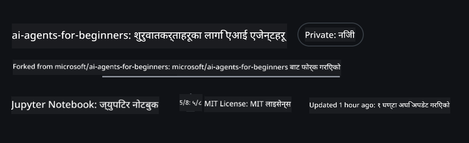
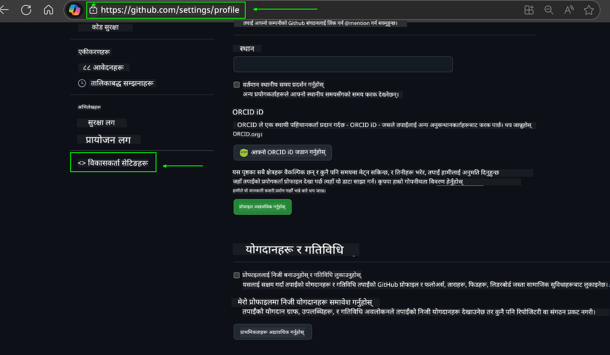
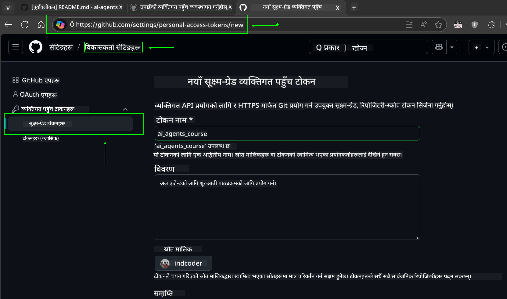
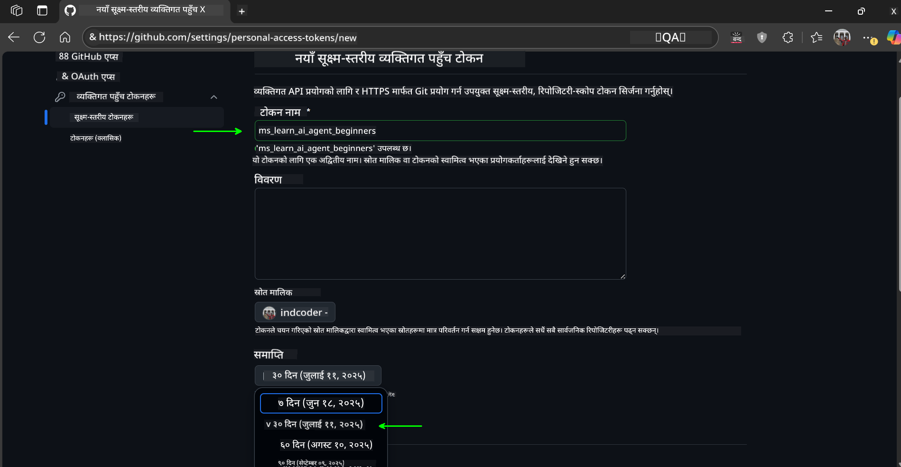
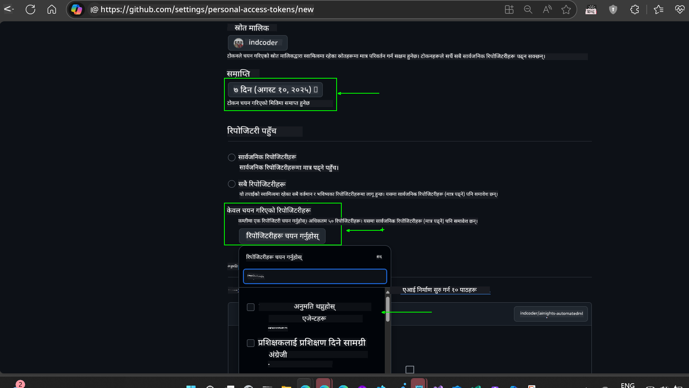
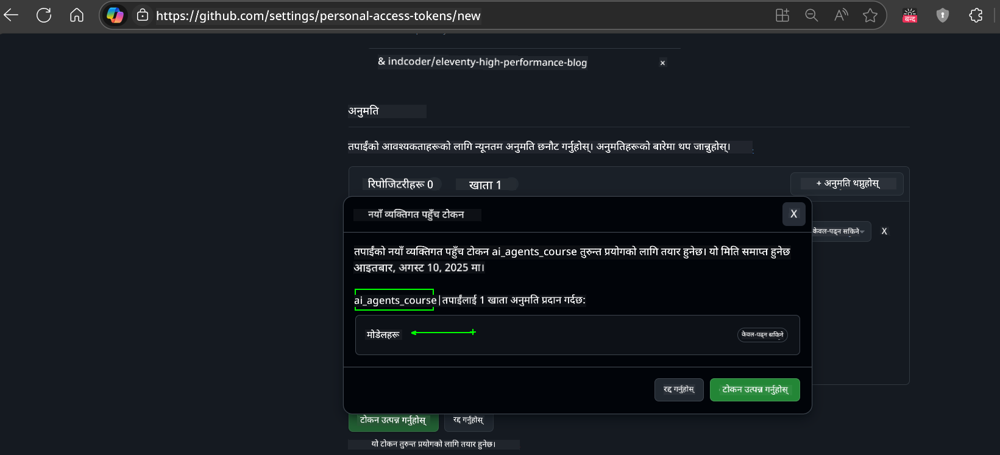
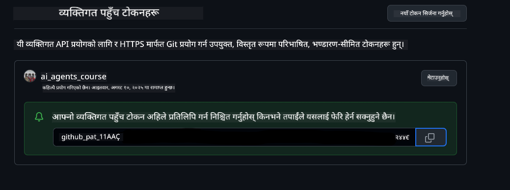
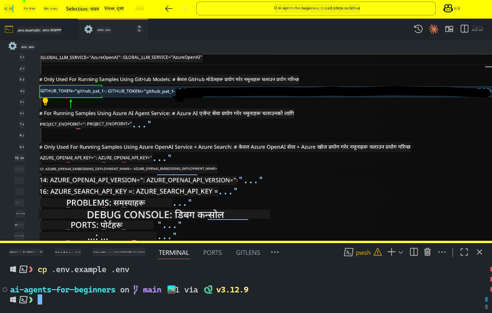
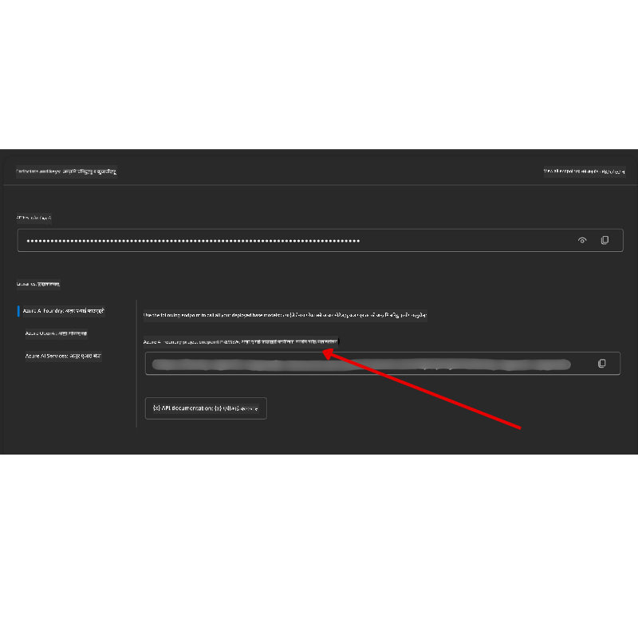

<!--
CO_OP_TRANSLATOR_METADATA:
{
  "original_hash": "c55b973b1562abf5aadf6a4028265ac5",
  "translation_date": "2025-08-29T10:18:13+00:00",
  "source_file": "00-course-setup/README.md",
  "language_code": "ne"
}
-->
# कोर्स सेटअप

## परिचय

यस पाठले तपाईंलाई यो कोर्सका कोड नमूनाहरू कसरी चलाउने भनेर सिकाउनेछ।

## अन्य सिक्नेहरूसँग जोडिनुहोस् र सहयोग प्राप्त गर्नुहोस्

आफ्नो रिपो क्लोन गर्न सुरु गर्नु अघि, [AI Agents For Beginners Discord channel](https://aka.ms/ai-agents/discord) मा सामेल हुनुहोस्। यहाँ तपाईं सेटअपमा सहयोग लिन, कोर्ससँग सम्बन्धित कुनै पनि प्रश्न सोध्न, वा अन्य सिक्नेहरूसँग जोडिन सक्नुहुन्छ।

## यो रिपो क्लोन वा फोर्क गर्नुहोस्

सुरु गर्न, कृपया GitHub Repository क्लोन वा फोर्क गर्नुहोस्। यसले तपाईंलाई कोर्स सामग्रीको आफ्नै संस्करण बनाउने अनुमति दिनेछ ताकि तपाईं कोड चलाउन, परीक्षण गर्न, र परिमार्जन गर्न सक्नुहुन्छ।

यो तलको लिंकमा क्लिक गरेर गर्न सकिन्छ:



## कोड चलाउनुहोस्

यो कोर्सले Jupyter Notebooks को श्रृंखला प्रदान गर्दछ जसले तपाईंलाई AI Agents निर्माण गर्नका लागि व्यावहारिक अनुभव दिन्छ।

कोड नमूनाहरू निम्नमा आधारित छन्:

**GitHub खाता आवश्यक - निःशुल्क**:

1) Semantic Kernel Agent Framework + GitHub Models Marketplace। (semantic-kernel.ipynb) लेबल गरिएको।
2) AutoGen Framework + GitHub Models Marketplace। (autogen.ipynb) लेबल गरिएको।

**Azure सदस्यता आवश्यक**:
3) Azure AI Foundry + Azure AI Agent Service। (azureaiagent.ipynb) लेबल गरिएको।

हामी तपाईंलाई यी तीन प्रकारका उदाहरणहरू प्रयास गर्न प्रोत्साहित गर्दछौं ताकि कुन तपाईंका लागि उपयुक्त छ भनेर पत्ता लगाउन सक्नुहुन्छ।

तपाईंले जुन विकल्प चयन गर्नुहुन्छ, त्यसले तलका सेटअप चरणहरू निर्धारण गर्नेछ:

## आवश्यकताहरू

- Python 3.12+
  - **NOTE**: यदि तपाईंले Python3.12 स्थापना गर्नुभएको छैन भने, कृपया यसलाई स्थापना गर्नुहोस्। त्यसपछि python3.12 प्रयोग गरेर आफ्नो venv सिर्जना गर्नुहोस् ताकि requirements.txt फाइलबाट सही संस्करणहरू स्थापना गरियोस्।
- GitHub खाता - GitHub Models Marketplace पहुँचको लागि।
- Azure सदस्यता - Azure AI Foundry पहुँचको लागि।
- Azure AI Foundry खाता - Azure AI Agent Service पहुँचको लागि।

हामीले यस रिपोजिटरीको मूल फोल्डरमा `requirements.txt` फाइल समावेश गरेका छौं जसमा कोड नमूनाहरू चलाउन आवश्यक पर्ने सबै Python प्याकेजहरू छन्।

तपाईं यसलाई आफ्नो टर्मिनलमा निम्न आदेश चलाएर स्थापना गर्न सक्नुहुन्छ:

```bash
pip install -r requirements.txt
```
हामी कुनै पनि द्वन्द्व र समस्याहरू टार्न Python भर्चुअल वातावरण सिर्जना गर्न सिफारिस गर्छौं।

## VSCode सेटअप गर्नुहोस्
VSCode मा तपाईंले सही संस्करणको Python प्रयोग गरिरहनुभएको छ भनेर सुनिश्चित गर्नुहोस्।


## GitHub Models प्रयोग गरेर नमूनाहरूको सेटअप गर्नुहोस्

### चरण १: आफ्नो GitHub Personal Access Token (PAT) प्राप्त गर्नुहोस्

यो कोर्सले GitHub Models Marketplace प्रयोग गर्दछ, जसले तपाईंलाई AI Agents निर्माण गर्न प्रयोग गरिने Large Language Models (LLMs) को निःशुल्क पहुँच प्रदान गर्दछ।

GitHub Models प्रयोग गर्न, तपाईंले [GitHub Personal Access Token](https://docs.github.com/en/authentication/keeping-your-account-and-data-secure/managing-your-personal-access-tokens) सिर्जना गर्नुपर्नेछ।

यो तपाईंको GitHub खातामा गएर गर्न सकिन्छ।

कृपया [Principle of Least Privilege](https://docs.github.com/en/get-started/learning-to-code/storing-your-secrets-safely) अनुसरण गर्नुहोस्। यसको मतलब तपाईंले टोकनलाई यस कोर्सका कोड नमूनाहरू चलाउन आवश्यक पर्ने अनुमति मात्र दिनुपर्छ।

1. आफ्नो स्क्रिनको बायाँपट्टि रहेको **Developer settings** मा गएर `Fine-grained tokens` विकल्प चयन गर्नुहोस्।
   

    त्यसपछि `Generate new token` चयन गर्नुहोस्।

    

2. आफ्नो टोकनको लागि यसको उद्देश्यलाई प्रतिबिम्बित गर्ने वर्णनात्मक नाम प्रविष्ट गर्नुहोस् ताकि पछि यसलाई सजिलैसँग पहिचान गर्न सकियोस्।

    🔐 टोकन अवधि सिफारिस

    सिफारिस गरिएको अवधि: ३० दिन
    थप सुरक्षित दृष्टिकोणका लागि, तपाईं छोटो अवधि चयन गर्न सक्नुहुन्छ—जस्तै ७ दिन 🛡️। 
    यो तपाईंलाई व्यक्तिगत लक्ष्य सेट गर्न र आफ्नो सिकाइको गति उच्च राख्दै कोर्स पूरा गर्न प्रेरित गर्ने राम्रो तरिका हो 🚀।

    

3. टोकनको स्कोपलाई यस रिपोजिटरीको फोर्कमा सीमित गर्नुहोस्।

    

4. टोकनको अनुमतिहरू सीमित गर्नुहोस्: **Permissions** अन्तर्गत, **Account** ट्याबमा क्लिक गर्नुहोस्, र "+ Add permissions" बटनमा क्लिक गर्नुहोस्। ड्रपडाउन देखा पर्नेछ। कृपया **Models** खोज्नुहोस् र यसलाई चयन गर्नुहोस्।
    

5. टोकन सिर्जना गर्नु अघि आवश्यक अनुमतिहरू प्रमाणित गर्नुहोस्। 

6. टोकन सिर्जना गर्नु अघि, यो सुरक्षित ठाउँमा जस्तै पासवर्ड म्यानेजर भल्टमा भण्डारण गर्न तयार हुनुहोस्, किनभने यो टोकन फेरि देखाइने छैन। 

तपाईंले अहिले सिर्जना गर्नुभएको नयाँ टोकन प्रतिलिपि गर्नुहोस्। अब तपाईंले यसलाई यस कोर्समा समावेश गरिएको `.env` फाइलमा थप्नु पर्नेछ।

### चरण २: आफ्नो `.env` फाइल सिर्जना गर्नुहोस्

आफ्नो `.env` फाइल सिर्जना गर्न, आफ्नो टर्मिनलमा निम्न आदेश चलाउनुहोस्।

```bash
cp .env.example .env
```

यसले उदाहरण फाइललाई प्रतिलिपि गर्नेछ र तपाईंको डाइरेक्टरीमा `.env` फाइल सिर्जना गर्नेछ, जहाँ तपाईं वातावरण चरहरूको मानहरू भर्न सक्नुहुन्छ।

तपाईंको टोकन प्रतिलिपि गरेर, आफ्नो मनपर्ने टेक्स्ट एडिटरमा `.env` फाइल खोल्नुहोस् र `GITHUB_TOKEN` फिल्डमा टोकन पेस्ट गर्नुहोस्।


अब तपाईं यस कोर्सका कोड नमूनाहरू चलाउन सक्षम हुनुहुनेछ।

## Azure AI Foundry र Azure AI Agent Service प्रयोग गरेर नमूनाहरूको सेटअप गर्नुहोस्

### चरण १: आफ्नो Azure प्रोजेक्ट Endpoint प्राप्त गर्नुहोस्

Azure AI Foundry मा हब र प्रोजेक्ट सिर्जना गर्ने चरणहरू यहाँ पत्ता लगाउनुहोस्: [Hub resources overview](https://learn.microsoft.com/en-us/azure/ai-foundry/concepts/ai-resources)

एक पटक तपाईंले आफ्नो प्रोजेक्ट सिर्जना गर्नुभयो भने, तपाईंले आफ्नो प्रोजेक्टको लागि कनेक्शन स्ट्रिङ प्राप्त गर्नुपर्नेछ।

यो Azure AI Foundry पोर्टलमा आफ्नो प्रोजेक्टको **Overview** पृष्ठमा गएर गर्न सकिन्छ।



### चरण २: आफ्नो `.env` फाइल सिर्जना गर्नुहोस्

आफ्नो `.env` फाइल सिर्जना गर्न, आफ्नो टर्मिनलमा निम्न आदेश चलाउनुहोस्।

```bash
cp .env.example .env
```

यसले उदाहरण फाइललाई प्रतिलिपि गर्नेछ र तपाईंको डाइरेक्टरीमा `.env` फाइल सिर्जना गर्नेछ, जहाँ तपाईं वातावरण चरहरूको मानहरू भर्न सक्नुहुन्छ।

तपाईंको टोकन प्रतिलिपि गरेर, आफ्नो मनपर्ने टेक्स्ट एडिटरमा `.env` फाइल खोल्नुहोस् र `PROJECT_ENDPOINT` फिल्डमा टोकन पेस्ट गर्नुहोस्।

### चरण ३: Azure मा साइन इन गर्नुहोस्

सुरक्षा उत्तम अभ्यासको रूपमा, हामी [keyless authentication](https://learn.microsoft.com/azure/developer/ai/keyless-connections?tabs=csharp%2Cazure-cli?WT.mc_id=academic-105485-koreyst) प्रयोग गर्नेछौं Microsoft Entra ID को साथ Azure OpenAI मा प्रमाणित गर्न।

अर्को, टर्मिनल खोल्नुहोस् र `az login --use-device-code` चलाएर आफ्नो Azure खातामा साइन इन गर्नुहोस्।

एक पटक तपाईंले साइन इन गर्नुभयो भने, टर्मिनलमा आफ्नो सदस्यता चयन गर्नुहोस्।

## थप वातावरण चरहरू - Azure Search र Azure OpenAI

Agentic RAG पाठ - पाठ ५ - का लागि, त्यहाँ Azure Search र Azure OpenAI प्रयोग गर्ने नमूनाहरू छन्।

यदि तपाईं यी नमूनाहरू चलाउन चाहनुहुन्छ भने, तपाईंले आफ्नो `.env` फाइलमा निम्न वातावरण चरहरू थप्नुपर्नेछ:

### Overview पृष्ठ (प्रोजेक्ट)

- `AZURE_SUBSCRIPTION_ID` - आफ्नो प्रोजेक्टको **Overview** पृष्ठमा **Project details** जाँच गर्नुहोस्।

- `AZURE_AI_PROJECT_NAME` - आफ्नो प्रोजेक्टको **Overview** पृष्ठको शीर्षमा हेर्नुहोस्।

- `AZURE_OPENAI_SERVICE` - **Overview** पृष्ठमा **Azure OpenAI Service** को लागि **Included capabilities** ट्याबमा फेला पार्नुहोस्।

### व्यवस्थापन केन्द्र

- `AZURE_OPENAI_RESOURCE_GROUP` - **Management Center** को **Overview** पृष्ठमा **Project properties** मा जानुहोस्।

- `GLOBAL_LLM_SERVICE` - **Connected resources** अन्तर्गत, **Azure AI Services** कनेक्शन नाम फेला पार्नुहोस्। यदि सूचीबद्ध छैन भने, आफ्नो स्रोत समूह अन्तर्गत Azure पोर्टलमा AI Services स्रोत नाम जाँच गर्नुहोस्।

### Models + Endpoints पृष्ठ

- `AZURE_OPENAI_EMBEDDING_DEPLOYMENT_NAME` - आफ्नो embedding मोडेल (जस्तै, `text-embedding-ada-002`) चयन गर्नुहोस् र मोडेल विवरणबाट **Deployment name** नोट गर्नुहोस्।

- `AZURE_OPENAI_CHAT_DEPLOYMENT_NAME` - आफ्नो chat मोडेल (जस्तै, `gpt-4o-mini`) चयन गर्नुहोस् र मोडेल विवरणबाट **Deployment name** नोट गर्नुहोस्।

### Azure पोर्टल

- `AZURE_OPENAI_ENDPOINT` - **Azure AI services** खोज्नुहोस्, यसमा क्लिक गर्नुहोस्, त्यसपछि **Resource Management**, **Keys and Endpoint** मा जानुहोस्, "Azure OpenAI endpoints" मा स्क्रोल गर्नुहोस्, र "Language APIs" भन्ने एक प्रतिलिपि गर्नुहोस्।

- `AZURE_OPENAI_API_KEY` - त्यही स्क्रिनबाट, KEY 1 वा KEY 2 प्रतिलिपि गर्नुहोस्।

- `AZURE_SEARCH_SERVICE_ENDPOINT` - आफ्नो **Azure AI Search** स्रोत फेला पार्नुहोस्, यसमा क्लिक गर्नुहोस्, र **Overview** हेर्नुहोस्।

- `AZURE_SEARCH_API_KEY` - त्यसपछि **Settings** मा जानुहोस् र **Keys** मा गएर प्राथमिक वा द्वितीयक प्रशासक कुञ्जी प्रतिलिपि गर्नुहोस्।

### बाह्य वेबपृष्ठ

- `AZURE_OPENAI_API_VERSION` - [API version lifecycle](https://learn.microsoft.com/en-us/azure/ai-services/openai/api-version-deprecation#latest-ga-api-release) पृष्ठमा **Latest GA API release** अन्तर्गत जानुहोस्।

### Keyless Authentication सेटअप गर्नुहोस्

आफ्नो प्रमाणहरू हार्डकोड गर्ने सट्टा, हामी Azure OpenAI सँग keyless कनेक्शन प्रयोग गर्नेछौं। यसका लागि, हामी `DefaultAzureCredential` आयात गर्नेछौं र पछि `DefaultAzureCredential` फंक्शनलाई प्रमाण प्राप्त गर्न कल गर्नेछौं।

```python
from azure.identity import DefaultAzureCredential, InteractiveBrowserCredential
```

## कतै अड्किनुभयो?

यदि तपाईंलाई यो सेटअप चलाउन कुनै समस्या छ भने, हाम्रो 

## अर्को पाठ

अब तपाईं यो कोर्सका कोडहरू चलाउन तयार हुनुहुन्छ। AI Agents को संसारबारे थप जान्नको लागि शुभकामना!

[AI Agents र Agent Use Cases को परिचय](../01-intro-to-ai-agents/README.md)

---

**अस्वीकरण**:  
यो दस्तावेज़ AI अनुवाद सेवा [Co-op Translator](https://github.com/Azure/co-op-translator) प्रयोग गरी अनुवाद गरिएको हो। हामी यथासम्भव सटीकता सुनिश्चित गर्न प्रयास गर्छौं, तर कृपया ध्यान दिनुहोस् कि स्वचालित अनुवादहरूमा त्रुटि वा अशुद्धता हुन सक्छ। यसको मूल भाषामा रहेको मूल दस्तावेज़लाई आधिकारिक स्रोत मानिनुपर्छ। महत्त्वपूर्ण जानकारीका लागि, व्यावसायिक मानव अनुवाद सिफारिस गरिन्छ। यस अनुवादको प्रयोगबाट उत्पन्न हुने कुनै पनि गलतफहमी वा गलत व्याख्याका लागि हामी जिम्मेवार हुने छैनौं।