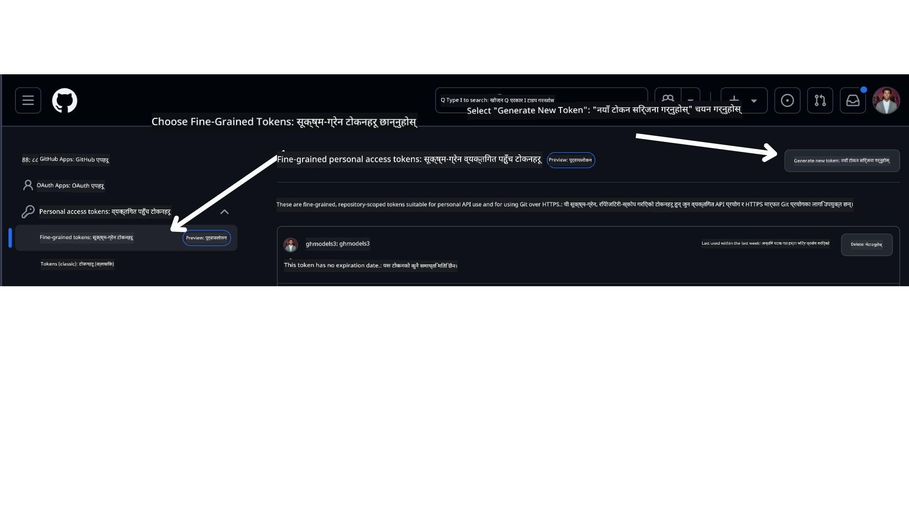

<!--
CO_OP_TRANSLATOR_METADATA:
{
  "original_hash": "76945069b52a49cd0432ae3e0b0ba22e",
  "translation_date": "2025-07-12T07:47:46+00:00",
  "source_file": "00-course-setup/README.md",
  "language_code": "ne"
}
-->
तपाईंले अब तलको लिंकमा यो कोर्सको आफ्नो फोर्क गरिएको संस्करण पाउनुभएको छ:


## कोड चलाउने तरिका

यस कोर्सले तपाईंलाई AI एजेन्टहरू निर्माण गर्ने व्यावहारिक अनुभव प्राप्त गर्नका लागि चलाउन सकिने Jupyter Notebooks को श्रृंखला प्रदान गर्दछ।

कोड नमूनाहरूले निम्न मध्ये कुनै एक प्रयोग गर्छन्:

**GitHub खाता आवश्यक - निःशुल्क**:

1) Semantic Kernel Agent Framework + GitHub Models Marketplace। (semantic-kernel.ipynb) भनेर चिनिन्छ  
2) AutoGen Framework + GitHub Models Marketplace। (autogen.ipynb) भनेर चिनिन्छ

**Azure सदस्यता आवश्यक**:  
3) Azure AI Foundry + Azure AI Agent Service। (azureaiagent.ipynb) भनेर चिनिन्छ

हामी तपाईंलाई सबै तीन प्रकारका उदाहरणहरू प्रयास गर्न प्रोत्साहित गर्छौं ताकि कुन तपाईंका लागि सबैभन्दा उपयुक्त छ भनेर थाहा पाउन सक्नुहोस्।

तपाईंले जुन विकल्प रोज्नुहुन्छ, त्यसले तलका सेटअप चरणहरू निर्धारण गर्नेछ जुन तपाईंले पालना गर्नुपर्नेछ:

## आवश्यकताहरू

- Python 3.12+  
  - **NOTE**: यदि तपाईंको कम्प्युटरमा Python3.12 छैन भने, कृपया यसलाई स्थापना गर्नुहोस्। त्यसपछि python3.12 प्रयोग गरेर आफ्नो venv सिर्जना गर्नुहोस् ताकि requirements.txt फाइलबाट सही संस्करणहरू स्थापना होस्।  
- GitHub खाता - GitHub Models Marketplace पहुँचका लागि  
- Azure सदस्यता - Azure AI Foundry पहुँचका लागि  
- Azure AI Foundry खाता - Azure AI Agent Service पहुँचका लागि  

यस रिपोजिटोरीको मूल फोल्डरमा `requirements.txt` फाइल समावेश गरिएको छ जसमा कोड नमूनाहरू चलाउन आवश्यक सबै Python प्याकेजहरू छन्।

तपाईंले तलको आदेश टर्मिनलमा चलाएर यी प्याकेजहरू स्थापना गर्न सक्नुहुन्छ:

```bash
pip install -r requirements.txt
```

कुनै पनि द्वन्द्व र समस्या टार्नका लागि Python भर्चुअल वातावरण सिर्जना गर्न सल्लाह दिइन्छ।

## VSCode सेटअप  
VSCode मा सही Python संस्करण प्रयोग गरिरहेको सुनिश्चित गर्नुहोस्।


## GitHub Models प्रयोग गरेर नमूनाहरूको लागि सेटअप

### चरण १: आफ्नो GitHub Personal Access Token (PAT) प्राप्त गर्नुहोस्

हाल, यो कोर्सले GitHub Models Marketplace प्रयोग गरेर निःशुल्क ठूलो भाषा मोडेलहरू (LLMs) पहुँच प्रदान गर्दछ जुन AI एजेन्टहरू सिर्जना गर्न प्रयोग गरिन्छ।

यस सेवामा पहुँचका लागि तपाईंले GitHub Personal Access Token सिर्जना गर्नुपर्नेछ।

यो तपाईंको GitHub खातामा गएर गर्न सकिन्छ।

तपाईंको स्क्रिनको बाँया पट्टि रहेको `Fine-grained tokens` विकल्प छान्नुहोस्।

त्यसपछि `Generate new token` चयन गर्नुहोस्।



तपाईंलाई टोकनको नाम प्रविष्ट गर्न, समाप्ति मिति चयन गर्न (सिफारिस: ३० दिन), र टोकनका लागि स्कोपहरू चयन गर्न भनिनेछ (Public Repositories)।

यस टोकनको अनुमति पनि सम्पादन गर्न आवश्यक छ: Permissions -> Models -> GitHub Models पहुँच अनुमति दिनुहोस्।

तपाईंले भर्खर सिर्जना गरेको टोकन कपी गर्नुहोस्। अब यसलाई यस कोर्समा समावेश गरिएको `.env` फाइलमा थप्नु पर्नेछ।


### चरण २: आफ्नो `.env` फाइल सिर्जना गर्नुहोस्

टर्मिनलमा तलको आदेश चलाएर `.env` फाइल सिर्जना गर्नुहोस्।

```bash
cp .env.example .env
```

यसले उदाहरण फाइल कपी गरी तपाईंको डाइरेक्टरीमा `.env` फाइल बनाउनेछ जहाँ तपाईंले वातावरण चरहरूको मानहरू भर्न सक्नुहुन्छ।

टोकन कपी गरेपछि, आफ्नो मनपर्ने टेक्स्ट सम्पादकमा `.env` फाइल खोल्नुहोस् र `GITHUB_TOKEN` फिल्डमा टोकन पेस्ट गर्नुहोस्।

अब तपाईं यस कोर्सका कोड नमूनाहरू चलाउन सक्षम हुनुहुनेछ।

## Azure AI Foundry र Azure AI Agent Service प्रयोग गरेर नमूनाहरूको लागि सेटअप

### चरण १: आफ्नो Azure प्रोजेक्ट Endpoint प्राप्त गर्नुहोस्

Azure AI Foundry मा हब र प्रोजेक्ट सिर्जना गर्ने चरणहरू यहाँ भेट्न सकिन्छ: [Hub resources overview](https://learn.microsoft.com/en-us/azure/ai-foundry/concepts/ai-resources)

प्रोजेक्ट सिर्जना गरेपछि, तपाईंले आफ्नो प्रोजेक्टको कनेक्शन स्ट्रिङ प्राप्त गर्नुपर्नेछ।

यो Azure AI Foundry पोर्टलमा आफ्नो प्रोजेक्टको **Overview** पृष्ठमा गएर गर्न सकिन्छ।


### चरण २: आफ्नो `.env` फाइल सिर्जना गर्नुहोस्

टर्मिनलमा तलको आदेश चलाएर `.env` फाइल सिर्जना गर्नुहोस्।

```bash
cp .env.example .env
```

यसले उदाहरण फाइल कपी गरी तपाईंको डाइरेक्टरीमा `.env` फाइल बनाउनेछ जहाँ तपाईंले वातावरण चरहरूको मानहरू भर्न सक्नुहुन्छ।

टोकन कपी गरेपछि, आफ्नो मनपर्ने टेक्स्ट सम्पादकमा `.env` फाइल खोल्नुहोस् र `PROJECT_ENDPOINT` फिल्डमा टोकन पेस्ट गर्नुहोस्।

### चरण ३: Azure मा साइन इन गर्नुहोस्

सुरक्षा अभ्यासको रूपमा, हामी Microsoft Entra ID सँग Azure OpenAI प्रमाणिकरणका लागि [keyless authentication](https://learn.microsoft.com/azure/developer/ai/keyless-connections?tabs=csharp%2Cazure-cli?WT.mc_id=academic-105485-koreyst) प्रयोग गर्नेछौं। यसका लागि, तपाईंले पहिले आफ्नो अपरेटिङ सिस्टमका लागि **Azure CLI** स्थापना गर्नुपर्नेछ, [स्थापना निर्देशनहरू](https://learn.microsoft.com/cli/azure/install-azure-cli?WT.mc_id=academic-105485-koreyst) अनुसार।

त्यसपछि, टर्मिनल खोल्नुहोस् र `az login --use-device-code` चलाएर Azure खातामा साइन इन गर्नुहोस्।

साइन इन भएपछि, टर्मिनलमा आफ्नो सदस्यता चयन गर्नुहोस्।

## अतिरिक्त वातावरण चरहरू - Azure Search र Azure OpenAI

Agentic RAG पाठ - पाठ ५ मा Azure Search र Azure OpenAI प्रयोग गर्ने नमूनाहरू छन्।

यी नमूनाहरू चलाउन चाहनुहुन्छ भने, तलका वातावरण चरहरू आफ्नो `.env` फाइलमा थप्नुहोस्:

### Overview पृष्ठ (प्रोजेक्ट)

- `AZURE_SUBSCRIPTION_ID` - आफ्नो प्रोजेक्टको **Overview** पृष्ठमा **Project details** हेर्नुहोस्।  
- `AZURE_AI_PROJECT_NAME` - प्रोजेक्टको **Overview** पृष्ठको माथिल्लो भागमा हेर्नुहोस्।  
- `AZURE_OPENAI_SERVICE` - **Overview** पृष्ठको **Included capabilities** ट्याबमा **Azure OpenAI Service** अन्तर्गत हेर्नुहोस्।  

### Management Center

- `AZURE_OPENAI_RESOURCE_GROUP` - **Management Center** को **Overview** पृष्ठमा **Project properties** मा जानुहोस्।  
- `GLOBAL_LLM_SERVICE` - **Connected resources** अन्तर्गत Azure AI Services कनेक्शन नाम खोज्नुहोस्। यदि छैन भने, Azure पोर्टलमा आफ्नो रिसोर्स समूहमा AI Services रिसोर्स नाम जाँच गर्नुहोस्।  

### Models + Endpoints पृष्ठ

- `AZURE_OPENAI_EMBEDDING_DEPLOYMENT_NAME` - आफ्नो embedding मोडेल (जस्तै, `text-embedding-ada-002`) चयन गरी मोडेल विवरणबाट **Deployment name** नोट गर्नुहोस्।  
- `AZURE_OPENAI_CHAT_DEPLOYMENT_NAME` - आफ्नो chat मोडेल (जस्तै, `gpt-4o-mini`) चयन गरी मोडेल विवरणबाट **Deployment name** नोट गर्नुहोस्।  

### Azure पोर्टल

- `AZURE_OPENAI_ENDPOINT` - **Azure AI services** खोज्नुहोस्, त्यसमा क्लिक गर्नुहोस्, **Resource Management**, **Keys and Endpoint** मा जानुहोस्, तल स्क्रोल गरी "Azure OpenAI endpoints" बाट "Language APIs" को URL कपी गर्नुहोस्।  
- `AZURE_OPENAI_API_KEY` - त्यही स्क्रिनबाट KEY 1 वा KEY 2 कपी गर्नुहोस्।  
- `AZURE_SEARCH_SERVICE_ENDPOINT` - आफ्नो **Azure AI Search** रिसोर्स खोज्नुहोस्, क्लिक गर्नुहोस्, र **Overview** हेर्नुहोस्।  
- `AZURE_SEARCH_API_KEY` - त्यसपछि **Settings** मा गएर **Keys** बाट प्राथमिक वा द्वितीयक एडमिन की कपी गर्नुहोस्।  

### बाह्य वेबपेज

- `AZURE_OPENAI_API_VERSION` - [API version lifecycle](https://learn.microsoft.com/en-us/azure/ai-services/openai/api-version-deprecation#latest-ga-api-release) पृष्ठमा **Latest GA API release** अन्तर्गत हेर्नुहोस्।  

### keyless authentication सेटअप गर्नुहोस्

तपाईंका प्रमाणपत्रहरू हार्डकोड नगरी, Azure OpenAI सँग keyless कनेक्शन प्रयोग गर्नेछौं। यसका लागि, हामी `DefaultAzureCredential` आयात गर्नेछौं र पछि `DefaultAzureCredential` फंक्शन कल गरेर प्रमाणपत्र प्राप्त गर्नेछौं।

```python
from azure.identity import DefaultAzureCredential, InteractiveBrowserCredential
```

## कतै अड्किनुभयो?

यदि तपाईंलाई यो सेटअप चलाउन कुनै समस्या छ भने, हाम्रो

or

.

## अर्को पाठ

अब तपाईं यस कोर्सको कोड चलाउन तयार हुनुहुन्छ। AI एजेन्टहरूको संसारबारे थप सिक्न शुभकामना!

[Introduction to AI Agents and Agent Use Cases](../01-intro-to-ai-agents/README.md)

**अस्वीकरण**:  
यो दस्तावेज AI अनुवाद सेवा [Co-op Translator](https://github.com/Azure/co-op-translator) प्रयोग गरी अनुवाद गरिएको हो। हामी शुद्धताका लागि प्रयासरत छौं, तर कृपया ध्यान दिनुहोस् कि स्वचालित अनुवादमा त्रुटि वा अशुद्धता हुन सक्छ। मूल दस्तावेज यसको मूल भाषामा नै अधिकारिक स्रोत मानिनुपर्छ। महत्वपूर्ण जानकारीका लागि व्यावसायिक मानव अनुवाद सिफारिस गरिन्छ। यस अनुवादको प्रयोगबाट उत्पन्न कुनै पनि गलतफहमी वा गलत व्याख्याका लागि हामी जिम्मेवार छैनौं।