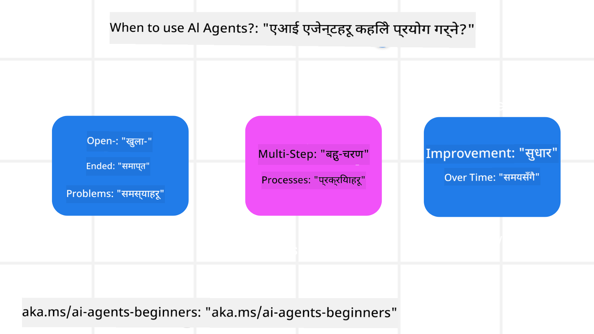

<!--
CO_OP_TRANSLATOR_METADATA:
{
  "original_hash": "d84943abc8f001ad4670418d32c2d899",
  "translation_date": "2025-07-12T08:04:47+00:00",
  "source_file": "01-intro-to-ai-agents/README.md",
  "language_code": "ne"
}
-->
यस कोर्सका अन्य सिक्नेहरू र AI Agent निर्माताहरूसँग भेटघाट गर्न र यस कोर्स सम्बन्धी कुनै पनि प्रश्न सोध्न यहाँ सामेल हुनुहोस्।

यस कोर्स सुरु गर्नका लागि, हामी पहिले AI Agents के हुन् र हामीले तिनीहरूलाई हाम्रो बनाउने एप्लिकेसन र कार्यप्रवाहहरूमा कसरी प्रयोग गर्न सक्छौं भन्ने कुरा राम्रोसँग बुझ्न सुरु गर्छौं।

## परिचय

यस पाठले समेट्छ:

- AI Agents के हुन् र विभिन्न प्रकारका एजेन्टहरू के-के छन्?
- AI Agents का लागि कुन-कुन प्रयोग केसहरू उपयुक्त छन् र तिनीहरूले हामीलाई कसरी मद्दत गर्न सक्छन्?
- Agentic समाधानहरू डिजाइन गर्दा के-के आधारभूत निर्माण ब्लकहरू हुन्छन्?

## सिकाइ लक्ष्यहरू
यस पाठ पूरा गरेपछि, तपाईंले सक्षम हुनु पर्नेछ:

- AI Agent का अवधारणाहरू बुझ्न र तिनीहरू अन्य AI समाधानहरूबाट कसरी फरक छन् भन्ने बुझ्न।
- AI Agents लाई सबैभन्दा प्रभावकारी रूपमा प्रयोग गर्न।
- प्रयोगकर्ता र ग्राहक दुवैका लागि उत्पादक रूपमा Agentic समाधानहरू डिजाइन गर्न।

## AI Agents को परिभाषा र AI Agents का प्रकारहरू

### AI Agents के हुन्?

AI Agents ती **प्रणालीहरू** हुन् जसले **ठूला भाषा मोडेलहरू (LLMs)** लाई **कार्यहरू गर्न सक्षम बनाउँछन्**। यसले LLMs लाई **उपकरणहरू** र **ज्ञान** मा पहुँच दिई तिनीहरूको क्षमता विस्तार गर्छ।

अब यस परिभाषालाई साना भागहरूमा विभाजन गरौं:

- **प्रणाली** - एजेन्टहरूलाई केवल एक कम्पोनेन्टको रूपमा होइन, धेरै कम्पोनेन्टहरूको प्रणालीको रूपमा सोच्नु महत्त्वपूर्ण छ। आधारभूत तहमा, AI Agent का कम्पोनेन्टहरू हुन्:
  - **परिवेश** - त्यो परिभाषित क्षेत्र जहाँ AI Agent काम गरिरहेको हुन्छ। उदाहरणका लागि, यदि हामीसँग यात्रा बुकिङ AI Agent छ भने, त्यो परिवेश यात्रा बुकिङ प्रणाली हुन सक्छ जुन AI Agent ले कार्यहरू पूरा गर्न प्रयोग गर्छ।
  - **सेन्सरहरू** - परिवेशसँग जानकारी हुन्छ र प्रतिक्रिया दिन्छ। AI Agents ले सेन्सरहरू प्रयोग गरेर परिवेशको वर्तमान अवस्थाबारे जानकारी सङ्कलन र व्याख्या गर्छ। यात्रा बुकिङ एजेन्टको उदाहरणमा, यात्रा बुकिङ प्रणालीले होटल उपलब्धता वा उडान मूल्य जस्ता जानकारी दिन सक्छ।
  - **एक्चुएटरहरू** - AI Agent ले परिवेशको वर्तमान अवस्था प्राप्त गरेपछि, हालको कार्यका लागि परिवेश परिवर्तन गर्न के कार्य गर्ने निर्णय गर्छ। यात्रा बुकिङ एजेन्टको लागि, यो प्रयोगकर्ताको लागि उपलब्ध कोठा बुक गर्नु हुन सक्छ।

**ठूला भाषा मोडेलहरू** - एजेन्टहरूको अवधारणा LLMs को सिर्जना हुनु अघि पनि अस्तित्वमा थियो। LLMs सँग AI Agents निर्माण गर्दा फाइदा भनेको तिनीहरूले मानव भाषा र डाटालाई व्याख्या गर्न सक्ने क्षमता हो। यसले LLMs लाई परिवेशीय जानकारी व्याख्या गर्न र परिवेश परिवर्तन गर्ने योजना बनाउन सक्षम बनाउँछ।

**कार्यहरू गर्नु** - AI Agent प्रणाली बाहिर, LLMs केवल प्रयोगकर्ताको प्रॉम्प्टमा आधारित सामग्री वा जानकारी सिर्जना गर्ने कार्यमा सीमित हुन्छन्। AI Agent प्रणाली भित्र, LLMs प्रयोगकर्ताको अनुरोध व्याख्या गरेर र उपलब्ध उपकरणहरू प्रयोग गरेर कार्यहरू पूरा गर्न सक्छन्।

**उपकरणहरूमा पहुँच** - LLM लाई कुन उपकरणहरूमा पहुँच छ भन्ने कुरा १) तिनी काम गरिरहेको परिवेश र २) AI Agent को विकासकर्ताले निर्धारण गर्छ। हाम्रो यात्रा एजेन्ट उदाहरणमा, एजेन्टका उपकरणहरू बुकिङ प्रणालीमा उपलब्ध अपरेसनहरूद्वारा सीमित छन्, र/वा विकासकर्ताले एजेन्टको उपकरण पहुँच उडानहरूमा सीमित गर्न सक्छ।

**स्मृति+ज्ञान** - स्मृति छोटो अवधिको हुन सक्छ, प्रयोगकर्ता र एजेन्ट बीचको संवाद सन्दर्भमा। लामो अवधिमा, परिवेशले दिएको जानकारी बाहेक, AI Agents अन्य प्रणालीहरू, सेवाहरू, उपकरणहरू, र अन्य एजेन्टहरूबाट पनि ज्ञान प्राप्त गर्न सक्छन्। यात्रा एजेन्ट उदाहरणमा, यो ज्ञान प्रयोगकर्ताको यात्रा प्राथमिकताहरूको जानकारी हुन सक्छ जुन ग्राहक डेटाबेसमा राखिएको छ।

### AI Agents का विभिन्न प्रकारहरू

अब हामीसँग AI Agents को सामान्य परिभाषा छ, आउनुहोस् केही विशिष्ट एजेन्ट प्रकारहरू हेरौं र तिनीहरूलाई यात्रा बुकिङ AI एजेन्टमा कसरी लागू गर्न सकिन्छ हेर्नुहोस्।

| **एजेन्ट प्रकार**             | **विवरण**                                                                                                                           | **उदाहरण**                                                                                                                                                                                                                   |
| ----------------------------- | ----------------------------------------------------------------------------------------------------------------------------------- | ----------------------------------------------------------------------------------------------------------------------------------------------------------------------------------------------------------------------------- |
| **साधारण रिफ्लेक्स एजेन्टहरू** | पूर्वनिर्धारित नियमहरूमा आधारित तुरुन्त कार्यहरू गर्छन्।                                                                             | यात्रा एजेन्टले इमेलको सन्दर्भ व्याख्या गरेर यात्रा सम्बन्धी गुनासोहरू ग्राहक सेवा विभागमा अग्रेषित गर्छ।                                                                                                                        |
| **मोडेल-आधारित रिफ्लेक्स एजेन्टहरू** | संसारको मोडेल र त्यस मोडेलमा भएका परिवर्तनहरूमा आधारित कार्यहरू गर्छन्।                                                               | यात्रा एजेन्टले ऐतिहासिक मूल्य डेटा पहुँचको आधारमा महत्वपूर्ण मूल्य परिवर्तन भएका मार्गहरूलाई प्राथमिकता दिन्छ।                                                                                                             |
| **लक्ष्य-आधारित एजेन्टहरू**    | लक्ष्य व्याख्या गरेर र त्यसलाई प्राप्त गर्न आवश्यक कार्यहरू निर्धारण गरेर योजना बनाउँछन्।                                              | यात्रा एजेन्टले हालको स्थानबाट गन्तव्यसम्मको यात्रा व्यवस्था (कार, सार्वजनिक यातायात, उडानहरू) निर्धारण गरेर यात्रा बुक गर्छ।                                                                                                    |
| **उपयोगिता-आधारित एजेन्टहरू** | प्राथमिकताहरू विचार गरेर र व्यापारिक गणनाहरू गरेर लक्ष्य प्राप्त गर्ने तरिका निर्धारण गर्छन्।                                         | यात्रा एजेन्टले यात्रा बुक गर्दा सुविधा र लागतको तुलनात्मक मूल्याङ्कन गरेर अधिकतम उपयोगिता प्राप्त गर्छ।                                                                                                                        |
| **शिक्षण एजेन्टहरू**          | प्रतिक्रिया अनुसार समयसँगै सुधार गर्छन् र कार्यहरू समायोजन गर्छन्।                                                                   | यात्रा एजेन्टले यात्रापछि सर्वेक्षणबाट प्राप्त ग्राहक प्रतिक्रियालाई प्रयोग गरेर भविष्यका बुकिङहरूमा सुधार गर्छ।                                                                                                               |
| **हाइरार्किकल एजेन्टहरू**    | धेरै एजेन्टहरूलाई स्तरबद्ध प्रणालीमा राख्छन्, उच्च तहका एजेन्टहरूले कार्यहरूलाई साना उपकार्यहरूमा विभाजन गरेर तल्लो तहका एजेन्टहरूलाई पूरा गर्न दिन्छन्। | यात्रा एजेन्टले यात्रा रद्द गर्दा कार्यलाई उपकार्यहरूमा विभाजन गर्छ (जस्तै, विशेष बुकिङहरू रद्द गर्नु) र तल्लो तहका एजेन्टहरूले ती पूरा गर्छन्, र उच्च तहका एजेन्टलाई रिपोर्ट गर्छन्।                                               |
| **बहु-एजेन्ट प्रणालीहरू (MAS)** | एजेन्टहरूले स्वतन्त्र रूपमा कार्यहरू पूरा गर्छन्, सहकार्य वा प्रतिस्पर्धात्मक रूपमा।                                                | सहकार्यात्मक: धेरै एजेन्टहरूले होटल, उडान, मनोरञ्जन जस्ता विशिष्ट यात्रा सेवाहरू बुक गर्छन्। प्रतिस्पर्धात्मक: धेरै एजेन्टहरूले साझा होटल बुकिङ क्यालेन्डरमा प्रतिस्पर्धा गर्दै ग्राहकहरूलाई होटलमा बुक गर्छन्।               |

## कहिले AI Agents प्रयोग गर्ने

पहिलेको भागमा, हामीले यात्रा एजेन्ट प्रयोग केस प्रयोग गरेर विभिन्न प्रकारका एजेन्टहरूलाई यात्रा बुकिङका विभिन्न परिदृश्यहरूमा कसरी प्रयोग गर्न सकिन्छ भनेर व्याख्या गर्यौं। हामी यो एप्लिकेसनलाई कोर्सभरि प्रयोग गर्नेछौं।

अब हेरौं AI Agents सबैभन्दा राम्रो प्रयोग हुने प्रकारका केसहरू:

- **खुला अन्त्य समस्या** - LLM लाई कार्य पूरा गर्न आवश्यक कदमहरू निर्धारण गर्न दिनु, किनभने यो सधैं कार्यप्रवाहमा हार्डकोड गर्न सकिँदैन।
- **बहु-चरण प्रक्रिया** - त्यस्ता कार्यहरू जसमा जटिलता हुन्छ र AI Agent ले उपकरण वा जानकारी धेरै चरणहरूमा प्रयोग गर्नुपर्छ, एकै पटक जानकारी ल्याउने होइन।
- **समयसँग सुधार** - त्यस्ता कार्यहरू जहाँ एजेन्टले आफ्नो परिवेश वा प्रयोगकर्ताबाट प्रतिक्रिया प्राप्त गरेर समयसँगै सुधार गर्न सक्छ र राम्रो उपयोगिता प्रदान गर्न सक्छ।

हामी AI Agents प्रयोग गर्दा थप विचारहरू "Building Trustworthy AI Agents" पाठमा समेट्नेछौं।

## Agentic समाधानहरूको आधारभूत कुरा

### एजेन्ट विकास

AI Agent प्रणाली डिजाइन गर्ने पहिलो कदम भनेको उपकरणहरू, कार्यहरू, र व्यवहारहरू परिभाषित गर्नु हो। यस कोर्समा, हामी **Azure AI Agent Service** प्रयोग गरेर एजेन्टहरू परिभाषित गर्न केन्द्रित छौं। यसले निम्न सुविधाहरू प्रदान गर्छ:

- OpenAI, Mistral, र Llama जस्ता खुला मोडेलहरूको चयन
- Tripadvisor जस्ता प्रदायकहरू मार्फत लाइसेन्स प्राप्त डाटा प्रयोग
- मानकीकृत OpenAPI 3.0 उपकरणहरूको प्रयोग

### Agentic ढाँचाहरू

LLM सँग संवाद प्रॉम्प्टहरू मार्फत हुन्छ। AI Agents को अर्ध-स्वायत्त प्रकृतिका कारण, परिवेशमा परिवर्तन आएपछि LLM लाई म्यानुअली पुनःप्रॉम्प्ट गर्नु सधैं सम्भव वा आवश्यक हुँदैन। हामी **Agentic ढाँचाहरू** प्रयोग गर्छौं जसले हामीलाई LLM लाई धेरै चरणहरूमा बढी स्केलेबल तरिकाले प्रॉम्प्ट गर्न अनुमति दिन्छ।

यस कोर्सलाई केही लोकप्रिय Agentic ढाँचाहरूमा विभाजन गरिएको छ।

### Agentic फ्रेमवर्कहरू

Agentic फ्रेमवर्कहरूले विकासकर्ताहरूलाई कोड मार्फत agentic ढाँचाहरू लागू गर्न अनुमति दिन्छ। यी फ्रेमवर्कहरूले टेम्प्लेटहरू, प्लगइनहरू, र उपकरणहरू प्रदान गर्छन् जसले AI Agent सहकार्यलाई सुधार गर्छ। यी सुविधाहरूले AI Agent प्रणालीहरूको राम्रो अवलोकन र समस्या समाधान क्षमताहरू प्रदान गर्छ।

यस कोर्समा, हामी अनुसन्धान-आधारित AutoGen फ्रेमवर्क र उत्पादन-तयार Semantic Kernel को Agent फ्रेमवर्क अन्वेषण गर्नेछौं।

## अघिल्लो पाठ

[Course Setup](../00-course-setup/README.md)

## अर्को पाठ

[Exploring Agentic Frameworks](../02-explore-agentic-frameworks/README.md)

**अस्वीकरण**:  
यो दस्तावेज AI अनुवाद सेवा [Co-op Translator](https://github.com/Azure/co-op-translator) प्रयोग गरी अनुवाद गरिएको हो। हामी शुद्धताका लागि प्रयासरत छौं, तर कृपया ध्यान दिनुहोस् कि स्वचालित अनुवादमा त्रुटि वा अशुद्धता हुनसक्छ। मूल दस्तावेज यसको मूल भाषामा नै अधिकारिक स्रोत मानिनुपर्छ। महत्वपूर्ण जानकारीका लागि व्यावसायिक मानव अनुवाद सिफारिस गरिन्छ। यस अनुवादको प्रयोगबाट उत्पन्न कुनै पनि गलतफहमी वा गलत व्याख्याका लागि हामी जिम्मेवार छैनौं।