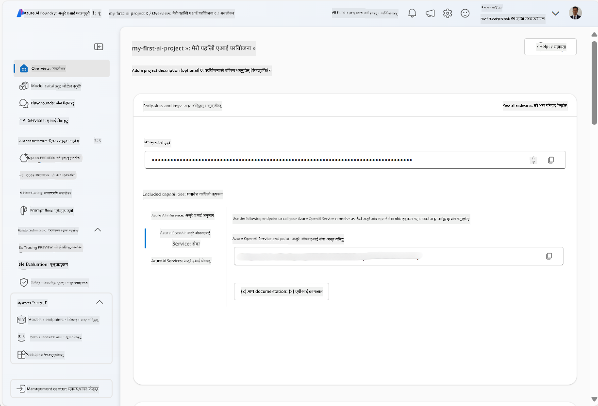
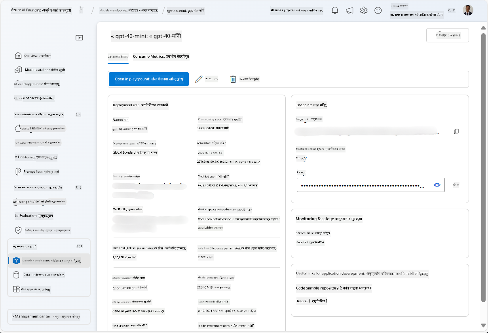
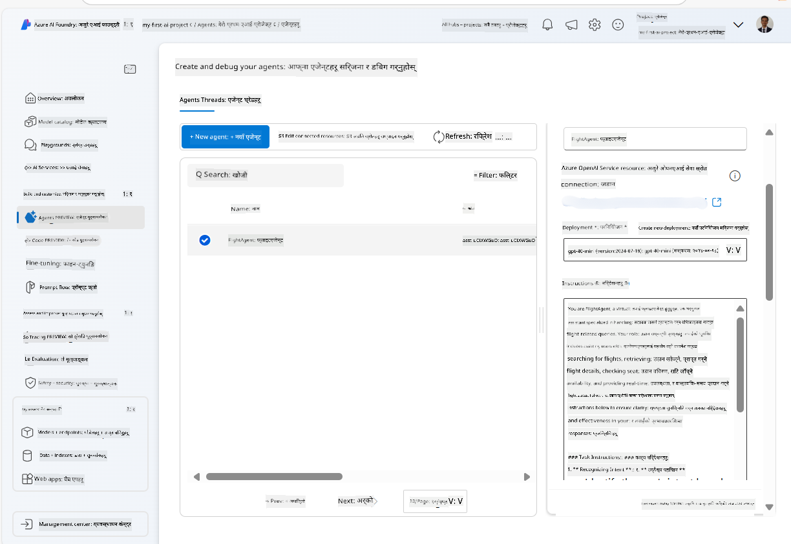
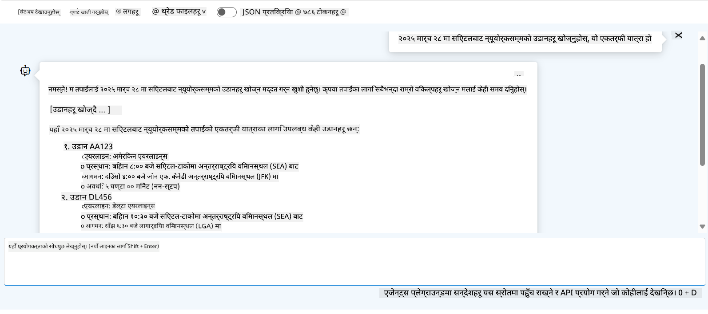

<!--
CO_OP_TRANSLATOR_METADATA:
{
  "original_hash": "7e92870dc0843e13d4dabc620c09d2d9",
  "translation_date": "2025-07-12T08:17:46+00:00",
  "source_file": "02-explore-agentic-frameworks/azure-ai-foundry-agent-creation.md",
  "language_code": "ne"
}
-->
# Azure AI Agent सेवा विकास

यस अभ्यासमा, तपाईंले [Azure AI Foundry पोर्टल](https://ai.azure.com/?WT.mc_id=academic-105485-koreyst) मा Azure AI Agent सेवा उपकरणहरू प्रयोग गरेर Flight Booking को लागि एक एजेन्ट सिर्जना गर्नुहुन्छ। एजेन्टले प्रयोगकर्तासँग अन्तरक्रिया गर्न र उडानहरूको बारेमा जानकारी प्रदान गर्न सक्षम हुनेछ।

## पूर्वआवश्यकताहरू

यस अभ्यास पूरा गर्न तपाईंलाई निम्न आवश्यक छ:
1. सक्रिय सदस्यता भएको Azure खाता। [निःशुल्क खाता सिर्जना गर्नुहोस्](https://azure.microsoft.com/free/?WT.mc_id=academic-105485-koreyst)।
2. Azure AI Foundry हब सिर्जना गर्ने अनुमति वा तपाईंको लागि पहिले नै सिर्जना गरिएको हब।
    - यदि तपाईंको भूमिका Contributor वा Owner हो भने, तपाईं यस ट्युटोरियलका चरणहरू अनुसरण गर्न सक्नुहुन्छ।

## Azure AI Foundry हब सिर्जना गर्नुहोस्

> **Note:** Azure AI Foundry पहिले Azure AI Studio भनेर चिनिन्थ्यो।

1. Azure AI Foundry हब सिर्जना गर्न [Azure AI Foundry](https://learn.microsoft.com/en-us/azure/ai-studio/?WT.mc_id=academic-105485-koreyst) ब्लग पोस्टका निर्देशनहरू पालना गर्नुहोस्।
2. तपाईंको प्रोजेक्ट सिर्जना भएपछि, देखाइएका कुनै पनि सुझावहरू बन्द गर्नुहोस् र Azure AI Foundry पोर्टलमा प्रोजेक्ट पृष्ठ समीक्षा गर्नुहोस्, जुन तलको तस्वीर जस्तै देखिनुपर्छ:

    

## मोडेल तैनाथ गर्नुहोस्

1. तपाईंको प्रोजेक्टको बाँया पट्टि रहेको प्यानमा, **My assets** सेक्सनमा, **Models + endpoints** पृष्ठ चयन गर्नुहोस्।
2. **Models + endpoints** पृष्ठमा, **Model deployments** ट्याबमा, **+ Deploy model** मेनुमा जानुहोस् र **Deploy base model** चयन गर्नुहोस्।
3. सूचीमा `gpt-4o-mini` मोडेल खोज्नुहोस्, त्यसपछि चयन गरी पुष्टि गर्नुहोस्।

    > **Note**: TPM घटाउँदा तपाईंले प्रयोग गरिरहेको सदस्यतामा उपलब्ध कोटा अत्यधिक प्रयोग हुनबाट बच्न मद्दत गर्छ।

    

## एजेन्ट सिर्जना गर्नुहोस्

अब जब तपाईंले मोडेल तैनाथ गर्नुभयो, तपाईं एजेन्ट सिर्जना गर्न सक्नुहुन्छ। एजेन्ट भनेको प्रयोगकर्तासँग अन्तरक्रिया गर्न सक्ने संवादात्मक AI मोडेल हो।

1. तपाईंको प्रोजेक्टको बाँया पट्टि रहेको प्यानमा, **Build & Customize** सेक्सनमा, **Agents** पृष्ठ चयन गर्नुहोस्।
2. नयाँ एजेन्ट सिर्जना गर्न **+ Create agent** क्लिक गर्नुहोस्। **Agent Setup** संवाद बक्समा:
    - एजेन्टको नाम प्रविष्ट गर्नुहोस्, जस्तै `FlightAgent`।
    - पहिले सिर्जना गरेको `gpt-4o-mini` मोडेल तैनाथ चयन गरिएको छ भनी सुनिश्चित गर्नुहोस्।
    - एजेन्टले पालना गर्नुपर्ने निर्देशनहरू सेट गर्नुहोस्। यहाँ एउटा उदाहरण छ:
    ```
    You are FlightAgent, a virtual assistant specialized in handling flight-related queries. Your role includes assisting users with searching for flights, retrieving flight details, checking seat availability, and providing real-time flight status. Follow the instructions below to ensure clarity and effectiveness in your responses:

    ### Task Instructions:
    1. **Recognizing Intent**:
       - Identify the user's intent based on their request, focusing on one of the following categories:
         - Searching for flights
         - Retrieving flight details using a flight ID
         - Checking seat availability for a specified flight
         - Providing real-time flight status using a flight number
       - If the intent is unclear, politely ask users to clarify or provide more details.
        
    2. **Processing Requests**:
        - Depending on the identified intent, perform the required task:
        - For flight searches: Request details such as origin, destination, departure date, and optionally return date.
        - For flight details: Request a valid flight ID.
        - For seat availability: Request the flight ID and date and validate inputs.
        - For flight status: Request a valid flight number.
        - Perform validations on provided data (e.g., formats of dates, flight numbers, or IDs). If the information is incomplete or invalid, return a friendly request for clarification.

    3. **Generating Responses**:
    - Use a tone that is friendly, concise, and supportive.
    - Provide clear and actionable suggestions based on the output of each task.
    - If no data is found or an error occurs, explain it to the user gently and offer alternative actions (e.g., refine search, try another query).
    
    ```
> [!NOTE]
> विस्तृत प्रॉम्प्टका लागि, तपाईं [यो रिपोजिटरी](https://github.com/ShivamGoyal03/RoamMind) मा थप जानकारी हेर्न सक्नुहुन्छ।
    
> थप रूपमा, तपाईं एजेन्टको क्षमता बढाउन **Knowledge Base** र **Actions** थप्न सक्नुहुन्छ जसले प्रयोगकर्ताका अनुरोधहरूमा आधारित थप जानकारी र स्वचालित कार्यहरू गर्न मद्दत गर्छ। यस अभ्यासका लागि, यी चरणहरू छोड्न सकिन्छ।
    


3. नयाँ बहु-AI एजेन्ट सिर्जना गर्न, केवल **New Agent** क्लिक गर्नुहोस्। नयाँ सिर्जना गरिएको एजेन्ट Agents पृष्ठमा देखिनेछ।

## एजेन्ट परीक्षण गर्नुहोस्

एजेन्ट सिर्जना गरेपछि, तपाईं यसलाई Azure AI Foundry पोर्टलको प्लेग्राउन्डमा प्रयोगकर्ताका प्रश्नहरूमा कसरी प्रतिक्रिया दिन्छ भनी परीक्षण गर्न सक्नुहुन्छ।

1. तपाईंको एजेन्टको **Setup** प्यानको माथि, **Try in playground** चयन गर्नुहोस्।
2. **Playground** प्यानमा, तपाईं च्याट विन्डोमा प्रश्नहरू टाइप गरेर एजेन्टसँग अन्तरक्रिया गर्न सक्नुहुन्छ। उदाहरणका लागि, तपाईं एजेन्टलाई २८ तारिखमा सिएटलबाट न्यूयोर्कसम्मको उडान खोज्न भन्न सक्नुहुन्छ।

    > **Note**: एजेन्टले सटीक उत्तर नदिन सक्छ, किनभने यस अभ्यासमा कुनै वास्तविक-समय डेटा प्रयोग गरिएको छैन। उद्देश्य भनेको एजेन्टले दिइएका निर्देशनहरूका आधारमा प्रयोगकर्ताका प्रश्नहरू बुझ्न र जवाफ दिन सक्ने क्षमता परीक्षण गर्नु हो।

    

3. एजेन्ट परीक्षण गरेपछि, तपाईं यसलाई थप उद्देश्यहरू, प्रशिक्षण डेटा, र कार्यहरू थपेर यसको क्षमता बढाउन सक्नुहुन्छ।

## स्रोतहरू सफा गर्नुहोस्

एजेन्ट परीक्षण सकिएपछि, थप खर्च हुन नदिन यसलाई मेटाउन सक्नुहुन्छ।
1. [Azure portal](https://portal.azure.com) खोल्नुहोस् र तपाईंले यस अभ्यासमा प्रयोग गरेको हब स्रोतहरू रहेको resource group को सामग्री हेर्नुहोस्।
2. टूलबारमा, **Delete resource group** चयन गर्नुहोस्।
3. resource group को नाम प्रविष्ट गरी मेटाउन पुष्टि गर्नुहोस्।

## स्रोतहरू

- [Azure AI Foundry कागजात](https://learn.microsoft.com/en-us/azure/ai-studio/?WT.mc_id=academic-105485-koreyst)
- [Azure AI Foundry पोर्टल](https://ai.azure.com/?WT.mc_id=academic-105485-koreyst)
- [Azure AI Studio सँग सुरु गर्ने तरिका](https://techcommunity.microsoft.com/blog/educatordeveloperblog/getting-started-with-azure-ai-studio/4095602?WT.mc_id=academic-105485-koreyst)
- [Azure मा AI एजेन्टहरूको आधारभूत ज्ञान](https://learn.microsoft.com/en-us/training/modules/ai-agent-fundamentals/?WT.mc_id=academic-105485-koreyst)
- [Azure AI Discord](https://aka.ms/AzureAI/Discord)

**अस्वीकरण**:  
यो दस्तावेज AI अनुवाद सेवा [Co-op Translator](https://github.com/Azure/co-op-translator) प्रयोग गरी अनुवाद गरिएको हो। हामी शुद्धताका लागि प्रयासरत छौं, तर कृपया ध्यान दिनुहोस् कि स्वचालित अनुवादमा त्रुटि वा अशुद्धता हुन सक्छ। मूल दस्तावेज यसको मूल भाषामा आधिकारिक स्रोत मानिनुपर्छ। महत्वपूर्ण जानकारीका लागि व्यावसायिक मानव अनुवाद सिफारिस गरिन्छ। यस अनुवादको प्रयोगबाट उत्पन्न कुनै पनि गलतफहमी वा गलत व्याख्याका लागि हामी जिम्मेवार छैनौं।