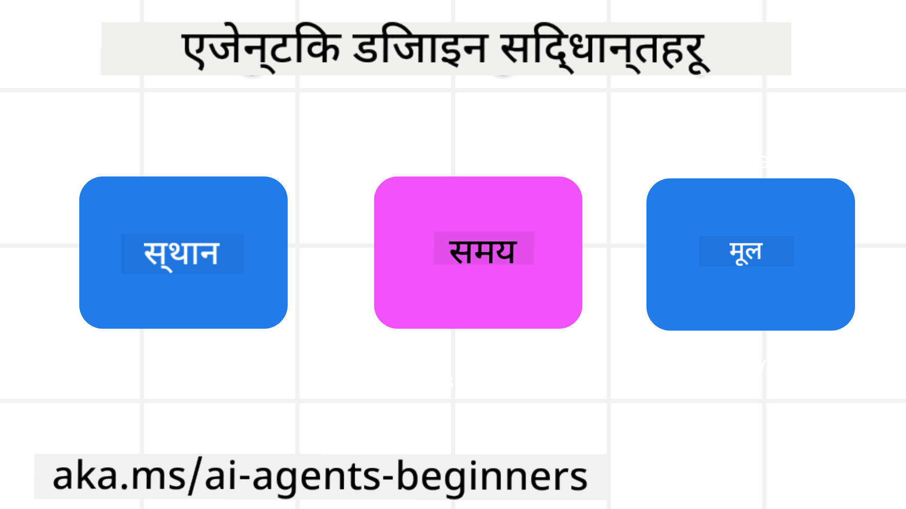

<!--
CO_OP_TRANSLATOR_METADATA:
{
  "original_hash": "4c46e4ff9e349c521e2b0b17f51afa64",
  "translation_date": "2025-08-29T10:23:42+00:00",
  "source_file": "03-agentic-design-patterns/README.md",
  "language_code": "ne"
}
-->

> _(माथिको चित्रमा क्लिक गरेर यो पाठको भिडियो हेर्नुहोस्)_
# AI एजेन्टिक डिजाइन सिद्धान्तहरू

## परिचय

AI एजेन्टिक प्रणाली निर्माण गर्ने धेरै तरिकाहरू छन्। जेनेरेटिभ AI डिजाइनमा अस्पष्टता एक विशेषता हो, बग होइन, यसले इन्जिनियरहरूलाई कहाँबाट सुरु गर्ने भन्ने कुरा कहिलेकाहीं गाह्रो बनाउँछ। हामीले विकासकर्ताहरूलाई ग्राहक-केंद्रित एजेन्टिक प्रणालीहरू निर्माण गर्न सक्षम बनाउन मानव-केंद्रित UX डिजाइन सिद्धान्तहरूको सेट सिर्जना गरेका छौं जसले उनीहरूको व्यापारिक आवश्यकताहरू समाधान गर्न सक्छ। यी डिजाइन सिद्धान्तहरू एक अनिवार्य आर्किटेक्चर होइनन् तर एजेन्ट अनुभवहरू परिभाषित र निर्माण गर्ने टोलीहरूको लागि एक सुरुवात बिन्दु हुन्।

सामान्यतया, एजेन्टहरूले निम्न कार्य गर्नुपर्छ:

- मानव क्षमताहरूलाई विस्तार र मापन गर्नुहोस् (ब्रेनस्टर्मिङ, समस्या समाधान, स्वचालन, आदि)
- ज्ञानको खाडलहरू भर्नुहोस् (ज्ञान डोमेनहरूमा गति दिनुहोस्, अनुवाद, आदि)
- हामी व्यक्तिहरूले अरूसँग काम गर्न रुचाउने तरिकामा सहयोग र समर्थनको सुविधा दिनुहोस्
- हामीलाई हाम्रो राम्रो संस्करण बनाउनुहोस् (जस्तै, जीवन प्रशिक्षक/कार्य मास्टर, हामीलाई भावनात्मक नियमन र ध्यान कौशल सिक्न मद्दत गर्दै, लचिलोपन निर्माण गर्दै, आदि)

## यो पाठले समेट्नेछ

- एजेन्टिक डिजाइन सिद्धान्तहरू के हुन्
- यी डिजाइन सिद्धान्तहरू कार्यान्वयन गर्दा पालना गर्नुपर्ने केही दिशानिर्देशहरू के हुन्
- डिजाइन सिद्धान्तहरूको प्रयोगका केही उदाहरणहरू के हुन्

## सिक्ने लक्ष्यहरू

यो पाठ पूरा गरेपछि, तपाईं सक्षम हुनुहुनेछ:

1. एजेन्टिक डिजाइन सिद्धान्तहरू के हुन् भनेर व्याख्या गर्नुहोस्
2. एजेन्टिक डिजाइन सिद्धान्तहरूको प्रयोगका लागि दिशानिर्देशहरू व्याख्या गर्नुहोस्
3. एजेन्टिक डिजाइन सिद्धान्तहरूको प्रयोग गरेर एजेन्ट निर्माण गर्ने तरिका बुझ्नुहोस्

## एजेन्टिक डिजाइन सिद्धान्तहरू

### एजेन्ट (स्पेस)

यो एजेन्ट सञ्चालन गर्ने वातावरण हो। यी सिद्धान्तहरूले भौतिक र डिजिटल संसारहरूमा संलग्न हुन एजेन्टहरू डिजाइन गर्ने तरिका सूचित गर्छन्।

- **जोड्ने, नत घटाउने** – सहयोग र जडान सक्षम गर्न मानिसहरूलाई अन्य मानिसहरू, घटनाहरू, र कार्यात्मक ज्ञानसँग जोड्न मद्दत गर्नुहोस्।
  - एजेन्टहरूले घटनाहरू, ज्ञान, र मानिसहरूलाई जोड्न मद्दत गर्छन्।
  - एजेन्टहरूले मानिसहरूलाई नजिक ल्याउँछन्। तिनीहरू मानिसहरूलाई प्रतिस्थापन वा सानो बनाउने उद्देश्यले डिजाइन गरिएको छैन।
- **सजिलै पहुँचयोग्य तर कहिलेकाहीं अदृश्य** – एजेन्ट मुख्यतया पृष्ठभूमिमा सञ्चालन गर्दछ र केवल जब यो सान्दर्भिक र उपयुक्त हुन्छ तब हामीलाई संकेत गर्दछ।
  - एजेन्ट कुनै पनि उपकरण वा प्लेटफर्ममा अधिकृत प्रयोगकर्ताहरूको लागि सजिलै पत्ता लगाउन सकिने र पहुँचयोग्य छ।
  - एजेन्टले मल्टिमोडल इनपुट र आउटपुट (ध्वनि, आवाज, पाठ, आदि) समर्थन गर्दछ।
  - एजेन्टले प्रयोगकर्ताको आवश्यकताको संवेदनको आधारमा अग्रभूमि र पृष्ठभूमि बीच सहज रूपमा संक्रमण गर्न सक्छ; सक्रिय र प्रतिक्रियात्मक बीच।
  - एजेन्ट अदृश्य रूपमा सञ्चालन गर्न सक्छ, तर यसको पृष्ठभूमि प्रक्रिया मार्ग र अन्य एजेन्टहरूसँगको सहयोग प्रयोगकर्ताको लागि पारदर्शी र नियन्त्रणयोग्य छ।

### एजेन्ट (समय)

यो एजेन्ट समयको साथ कसरी सञ्चालन गर्दछ भन्ने हो। यी सिद्धान्तहरूले विगत, वर्तमान, र भविष्यमा अन्तरक्रिया गर्ने एजेन्टहरू डिजाइन गर्ने तरिका सूचित गर्छन्।

- **विगत**: राज्य र सन्दर्भ समावेश गर्ने इतिहासमा प्रतिबिम्बित।
  - एजेन्टले घटनाहरू, मानिसहरू, वा राज्यहरू मात्र नभई समृद्ध ऐतिहासिक डाटाको विश्लेषणको आधारमा थप सान्दर्भिक परिणामहरू प्रदान गर्दछ।
  - एजेन्टले विगतका घटनाहरूबाट जडानहरू सिर्जना गर्दछ र हालको परिस्थितिहरूसँग संलग्न हुन सक्रिय रूपमा स्मृतिमा प्रतिबिम्बित गर्दछ।
- **अहिले**: सूचित गर्नेभन्दा संकेत गर्ने।
  - एजेन्टले मानिसहरूसँग अन्तरक्रिया गर्ने व्यापक दृष्टिकोणलाई समेट्छ। जब कुनै घटना हुन्छ, एजेन्ट स्थिर सूचनाहरू वा अन्य स्थिर औपचारिकताहरू भन्दा पर जान्छ। एजेन्टले प्रवाहलाई सरल बनाउन वा प्रयोगकर्ताको ध्यान सही समयमा निर्देशित गर्न गतिशील रूपमा संकेतहरू उत्पन्न गर्न सक्छ।
  - एजेन्टले सान्दर्भिक वातावरण, सामाजिक र सांस्कृतिक परिवर्तनहरू, र प्रयोगकर्ताको उद्देश्यलाई अनुकूलित गरेर जानकारी प्रदान गर्दछ।
  - एजेन्ट अन्तरक्रिया क्रमिक हुन सक्छ, जटिलतामा विकसित/वृद्धि हुँदै प्रयोगकर्ताहरूलाई दीर्घकालीन सशक्त बनाउँछ।
- **भविष्य**: अनुकूलन र विकास।
  - एजेन्ट विभिन्न उपकरणहरू, प्लेटफर्महरू, र मोडालिटीहरूमा अनुकूलन गर्दछ।
  - एजेन्ट प्रयोगकर्ताको व्यवहार, पहुँच आवश्यकताहरूमा अनुकूलन गर्दछ, र स्वतन्त्र रूपमा अनुकूलन योग्य छ।
  - एजेन्ट निरन्तर प्रयोगकर्ता अन्तरक्रियाको माध्यमबाट आकार लिन्छ र विकसित हुन्छ।

### एजेन्ट (कोर)

यी एजेन्टको डिजाइनको कोरमा प्रमुख तत्वहरू हुन्।

- **अनिश्चिततालाई स्वीकार गर्नुहोस् तर विश्वास स्थापना गर्नुहोस्**।
  - एजेन्ट डिजाइनको प्रमुख तत्वको रूपमा अनिश्चितताको निश्चित स्तर अपेक्षित छ।
  - विश्वास र पारदर्शिता एजेन्ट डिजाइनको आधारभूत तहहरू हुन्।
  - मानिसहरूले एजेन्ट कहिले अन/अफ छ भन्ने नियन्त्रण गर्छन् र एजेन्टको स्थिति सबै समयमा स्पष्ट रूपमा देखिने छ।

## यी सिद्धान्तहरू कार्यान्वयन गर्ने दिशानिर्देशहरू

पछिल्लो डिजाइन सिद्धान्तहरू प्रयोग गर्दा, निम्न दिशानिर्देशहरू प्रयोग गर्नुहोस्:

1. **पारदर्शिता**: प्रयोगकर्तालाई AI संलग्न छ, यसले कसरी काम गर्छ (विगतका कार्यहरू सहित), र प्रणालीलाई प्रतिक्रिया दिन र संशोधन गर्ने तरिका सूचित गर्नुहोस्।
2. **नियन्त्रण**: प्रयोगकर्तालाई अनुकूलन गर्न, प्राथमिकताहरू निर्दिष्ट गर्न र व्यक्तिगत बनाउन सक्षम गर्नुहोस्, र प्रणाली र यसको विशेषताहरूमा नियन्त्रण राख्नुहोस् (भुल्नको क्षमता सहित)।
3. **संगतता**: उपकरणहरू र अन्त बिन्दुहरूमा स्थिर, बहु-मोडल अनुभवहरूको लक्ष्य राख्नुहोस्। सम्भव भएमा परिचित UI/UX तत्वहरू प्रयोग गर्नुहोस् (जस्तै, आवाज अन्तरक्रियाको लागि माइक्रोफोन आइकन) र ग्राहकको संज्ञानात्मक भारलाई सकेसम्म कम गर्नुहोस् (जस्तै, संक्षिप्त प्रतिक्रियाहरू, दृश्य सहयोग, र 'थप जान्नुहोस्' सामग्रीको लक्ष्य राख्नुहोस्)।

## यी सिद्धान्तहरू र दिशानिर्देशहरू प्रयोग गरेर यात्रा एजेन्ट डिजाइन गर्ने तरिका

कल्पना गर्नुहोस् तपाईं यात्रा एजेन्ट डिजाइन गर्दै हुनुहुन्छ, यहाँ तपाईंले डिजाइन सिद्धान्तहरू र दिशानिर्देशहरू प्रयोग गर्ने तरिका सोच्न सक्नुहुन्छ:

1. **पारदर्शिता** – प्रयोगकर्तालाई यात्रा एजेन्ट AI-सक्षम एजेन्ट हो भनेर थाहा दिनुहोस्। कसरी सुरु गर्ने भन्ने बारे केही आधारभूत निर्देशनहरू प्रदान गर्नुहोस् (जस्तै, "नमस्ते" सन्देश, नमूना प्रम्प्टहरू)। यो उत्पादन पृष्ठमा स्पष्ट रूपमा दस्तावेज गर्नुहोस्। प्रयोगकर्ताले विगतमा सोधेका प्रम्प्टहरूको सूची देखाउनुहोस्। प्रतिक्रिया दिन कसरी स्पष्ट बनाउनुहोस् (थम्ब्स अप र डाउन, प्रतिक्रिया पठाउने बटन, आदि)। यदि एजेन्टसँग प्रयोग वा विषय प्रतिबन्धहरू छन् भने स्पष्ट रूपमा उल्लेख गर्नुहोस्।
2. **नियन्त्रण** – सुनिश्चित गर्नुहोस् कि प्रयोगकर्ताले प्रणाली प्रम्प्ट जस्ता चीजहरूसँग एजेन्टलाई परिमार्जन गर्न सक्ने तरिका स्पष्ट छ। प्रयोगकर्तालाई एजेन्ट कति विस्तृत छ, यसको लेखन शैली, र एजेन्टले के कुरा गर्नु हुँदैन भन्ने कुनै पनि चेतावनीहरू छनोट गर्न सक्षम बनाउनुहोस्। प्रयोगकर्तालाई कुनै पनि सम्बन्धित फाइलहरू वा डाटा, प्रम्प्टहरू, र विगतका कुराकानीहरू हेर्न र मेटाउन अनुमति दिनुहोस्।
3. **संगतता** – सुनिश्चित गर्नुहोस् कि प्रम्प्ट साझा गर्ने, फाइल वा फोटो थप्ने, र कसैलाई वा केहि ट्याग गर्ने आइकनहरू मानक र चिनिने छन्। एजेन्टसँग फाइल अपलोड/शेयर गर्न कागजको क्लिप आइकन प्रयोग गर्नुहोस्, र ग्राफिक्स अपलोड गर्न छवि आइकन प्रयोग गर्नुहोस्।

### AI एजेन्टिक डिजाइन ढाँचाहरूको बारेमा थप प्रश्नहरू छन्?

अन्य सिक्नेहरू भेट्न, कार्यालय समयमा भाग लिन र तपाईंको AI एजेन्टहरूको प्रश्नहरूको उत्तर पाउन [Azure AI Foundry Discord](https://aka.ms/ai-agents/discord) मा सामेल हुनुहोस्।

## थप स्रोतहरू

- ## अघिल्लो पाठ

[एजेन्टिक फ्रेमवर्कहरू अन्वेषण गर्दै](../02-explore-agentic-frameworks/README.md)

## अर्को पाठ

[टूल प्रयोग डिजाइन ढाँचा](../04-tool-use/README.md)

---

**अस्वीकरण**:  
यो दस्तावेज़ AI अनुवाद सेवा [Co-op Translator](https://github.com/Azure/co-op-translator) प्रयोग गरी अनुवाद गरिएको हो। हामी यथासम्भव सटीकता सुनिश्चित गर्न प्रयास गर्छौं, तर कृपया ध्यान दिनुहोस् कि स्वचालित अनुवादहरूमा त्रुटि वा अशुद्धता हुन सक्छ। यसको मूल भाषामा रहेको मूल दस्तावेज़लाई आधिकारिक स्रोत मानिनुपर्छ। महत्त्वपूर्ण जानकारीका लागि, व्यावसायिक मानव अनुवाद सिफारिस गरिन्छ। यस अनुवादको प्रयोगबाट उत्पन्न हुने कुनै पनि गलतफहमी वा गलत व्याख्याका लागि हामी जिम्मेवार हुने छैनौं।