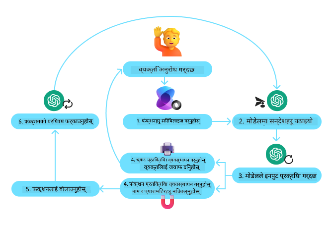
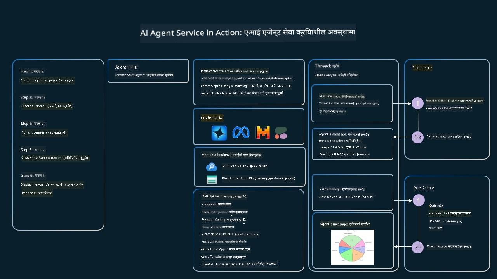

<!--
CO_OP_TRANSLATOR_METADATA:
{
  "original_hash": "88258b03f2893aa2e69eb8fb24baabbc",
  "translation_date": "2025-07-12T09:30:10+00:00",
  "source_file": "04-tool-use/README.md",
  "language_code": "ne"
}
-->
[](https://youtu.be/vieRiPRx-gI?si=cEZ8ApnT6Sus9rhn)

> _(यो पाठको भिडियो हेर्न माथिको तस्बिरमा क्लिक गर्नुहोस्)_

# उपकरण प्रयोग डिजाइन ढाँचा

उपकरणहरू रोचक हुन्छन् किनभने तिनीहरूले AI एजेन्टहरूलाई फराकिलो क्षमता प्रदान गर्छन्। एजेन्टसँग सीमित क्रियाकलापहरूको सेट हुनुको सट्टा, उपकरण थप्दा एजेन्टले धेरै प्रकारका क्रियाकलापहरू गर्न सक्छ। यस अध्यायमा, हामी उपकरण प्रयोग डिजाइन ढाँचालाई हेर्नेछौं, जसले AI एजेन्टहरूले कसरी विशेष उपकरणहरू प्रयोग गरेर आफ्नो लक्ष्यहरू प्राप्त गर्न सक्छन् भन्ने वर्णन गर्छ।

## परिचय

यस पाठमा, हामी निम्न प्रश्नहरूको उत्तर खोज्नेछौं:

- उपकरण प्रयोग डिजाइन ढाँचा के हो?
- यसलाई कुन-कुन प्रयोग केसहरूमा लागू गर्न सकिन्छ?
- डिजाइन ढाँचा कार्यान्वयन गर्न के-के तत्व/निर्माण ब्लकहरू आवश्यक छन्?
- विश्वसनीय AI एजेन्टहरू बनाउन उपकरण प्रयोग डिजाइन ढाँचा प्रयोग गर्दा के विशेष कुराहरू ध्यान दिनुपर्छ?

## सिकाइ लक्ष्यहरू

यस पाठ पूरा गरेपछि, तपाईं सक्षम हुनुहुनेछ:

- उपकरण प्रयोग डिजाइन ढाँचाको परिभाषा र यसको उद्देश्य बताउन।
- उपकरण प्रयोग डिजाइन ढाँचा लागू गर्न सकिने प्रयोग केसहरू पहिचान गर्न।
- डिजाइन ढाँचा कार्यान्वयन गर्न आवश्यक मुख्य तत्वहरू बुझ्न।
- यस डिजाइन ढाँचा प्रयोग गर्ने AI एजेन्टहरूमा विश्वसनीयता सुनिश्चित गर्न ध्यान दिनुपर्ने कुराहरू चिन्न।

## उपकरण प्रयोग डिजाइन ढाँचा के हो?

**उपकरण प्रयोग डिजाइन ढाँचा** ले LLM हरूलाई बाह्य उपकरणहरूसँग अन्तरक्रिया गर्ने क्षमता दिनमा केन्द्रित छ ताकि विशेष लक्ष्यहरू प्राप्त गर्न सकियोस्। उपकरणहरू कोड हुन् जुन एजेन्टले क्रियाकलाप गर्नका लागि चलाउन सक्छ। उपकरण एउटा साधारण फंक्शन जस्तै क्याल्कुलेटर हुन सक्छ, वा तेस्रो पक्षको सेवा जस्तै स्टक मूल्य खोज वा मौसम पूर्वानुमानको API कल हुन सक्छ। AI एजेन्टहरूको सन्दर्भमा, उपकरणहरू **मोडेल-जनित फंक्शन कलहरू** को प्रतिक्रियामा एजेन्टहरूले चलाउन डिजाइन गरिएका हुन्छन्।

## यसलाई कुन-कुन प्रयोग केसहरूमा लागू गर्न सकिन्छ?

AI एजेन्टहरूले जटिल कार्यहरू पूरा गर्न, जानकारी प्राप्त गर्न, वा निर्णय लिन उपकरणहरू प्रयोग गर्न सक्छन्। उपकरण प्रयोग डिजाइन ढाँचा प्रायः यस्तो अवस्थामा प्रयोग गरिन्छ जहाँ बाह्य प्रणालीहरूसँग गतिशील अन्तरक्रिया आवश्यक हुन्छ, जस्तै डेटाबेस, वेब सेवा, वा कोड इन्टरप्रेटरहरू। यसले विभिन्न प्रयोग केसहरूमा उपयोगी हुन्छ, जस्तै:

- **गतिशील जानकारी प्राप्ति:** एजेन्टहरूले बाह्य API वा डेटाबेसहरूमा सोधपुछ गरेर अद्यावधिक डेटा ल्याउन सक्छन् (जस्तै, SQLite डेटाबेसमा डेटा विश्लेषणका लागि सोधपुछ, स्टक मूल्य वा मौसम जानकारी प्राप्ति)।
- **कोड कार्यान्वयन र व्याख्या:** एजेन्टहरूले गणितीय समस्या समाधान गर्न, रिपोर्टहरू बनाउन, वा सिमुलेशन गर्न कोड वा स्क्रिप्टहरू चलाउन सक्छन्।
- **कार्यप्रवाह स्वचालन:** कार्य तालिका, इमेल सेवा, वा डेटा पाइपलाइन जस्ता उपकरणहरू समावेश गरेर दोहोरिने वा बहु-चरण कार्यहरू स्वचालित गर्न।
- **ग्राहक समर्थन:** एजेन्टहरूले CRM प्रणाली, टिकटिङ प्लेटफर्म, वा ज्ञान आधारसँग अन्तरक्रिया गरेर प्रयोगकर्ताका प्रश्नहरू समाधान गर्न सक्छन्।
- **सामग्री सिर्जना र सम्पादन:** एजेन्टहरूले व्याकरण जाँच्ने, पाठ सारांश गर्ने, वा सामग्री सुरक्षा मूल्याङ्कन गर्ने उपकरणहरू प्रयोग गरेर सामग्री सिर्जनामा सहयोग गर्न सक्छन्।

## उपकरण प्रयोग डिजाइन ढाँचा कार्यान्वयन गर्न के-के तत्व/निर्माण ब्लकहरू आवश्यक छन्?

यी निर्माण ब्लकहरूले AI एजेन्टलाई फराकिलो कार्यहरू गर्न सक्षम बनाउँछन्। उपकरण प्रयोग डिजाइन ढाँचा कार्यान्वयन गर्न आवश्यक मुख्य तत्वहरू यसप्रकार छन्:

- **फंक्शन/उपकरण स्किमाहरू**: उपलब्ध उपकरणहरूको विस्तृत परिभाषा, जसमा फंक्शन नाम, उद्देश्य, आवश्यक प्यारामिटरहरू, र अपेक्षित आउटपुटहरू समावेश हुन्छन्। यी स्किमाहरूले LLM लाई उपलब्ध उपकरणहरू बुझ्न र मान्य अनुरोधहरू बनाउन मद्दत गर्छन्।

- **फंक्शन कार्यान्वयन तर्क**: प्रयोगकर्ताको उद्देश्य र संवाद सन्दर्भ अनुसार उपकरणहरू कहिले र कसरी कल गर्ने भन्ने नियम। यसमा योजना बनाउने मोड्युलहरू, राउटिङ मेकानिजमहरू, वा सशर्त प्रवाहहरू समावेश हुन सक्छन् जसले उपकरण प्रयोगलाई गतिशील रूपमा निर्धारण गर्छ।

- **सन्देश व्यवस्थापन प्रणाली**: प्रयोगकर्ता इनपुट, LLM प्रतिक्रिया, उपकरण कलहरू, र उपकरण आउटपुटहरू बीचको संवाद प्रवाह व्यवस्थापन गर्ने कम्पोनेन्टहरू।

- **उपकरण एकीकरण फ्रेमवर्क**: एजेन्टलाई विभिन्न उपकरणहरूसँग जडान गर्ने पूर्वाधार, चाहे ती साधारण फंक्शनहरू हुन् वा जटिल बाह्य सेवाहरू।

- **त्रुटि व्यवस्थापन र प्रमाणीकरण**: उपकरण कार्यान्वयनमा असफलता, प्यारामिटरहरूको प्रमाणीकरण, र अप्रत्याशित प्रतिक्रियाहरू व्यवस्थापन गर्ने संयन्त्रहरू।

- **स्थिति व्यवस्थापन**: संवाद सन्दर्भ, अघिल्लो उपकरण अन्तरक्रियाहरू, र स्थायी डेटा ट्र्याक गर्ने जसले बहु-चरण अन्तरक्रियाहरूमा स्थिरता सुनिश्चित गर्छ।

अब, फंक्शन/उपकरण कललाई विस्तारमा हेरौं।

### फंक्शन/उपकरण कल

फंक्शन कल नै मुख्य तरिका हो जसले LLM हरूलाई उपकरणहरूसँग अन्तरक्रिया गर्न सक्षम बनाउँछ। तपाईंले प्रायः 'फंक्शन' र 'उपकरण' शब्दहरू साटासाट प्रयोग भएको देख्नुहुनेछ किनभने 'फंक्शन' (पुन: प्रयोग गर्न मिल्ने कोड ब्लकहरू) नै एजेन्टहरूले कार्यहरू गर्न प्रयोग गर्ने 'उपकरण' हुन्। कुनै फंक्शनको कोड चलाउन LLM ले प्रयोगकर्ताको अनुरोधलाई फंक्शनको विवरणसँग तुलना गर्नुपर्छ। यसका लागि सबै उपलब्ध फंक्शनहरूको विवरण भएको स्किमा LLM लाई पठाइन्छ। LLM ले त्यसपछि कार्यका लागि सबैभन्दा उपयुक्त फंक्शन चयन गरी यसको नाम र आर्गुमेन्टहरू फर्काउँछ। चयनित फंक्शन चलाइन्छ, यसको प्रतिक्रिया LLM लाई पठाइन्छ, जसले त्यो जानकारी प्रयोगकर्ताको अनुरोधको जवाफ दिन प्रयोग गर्छ।

डेभलपरहरूले एजेन्टहरूको लागि फंक्शन कल कार्यान्वयन गर्नका लागि आवश्यक हुन्छ:

1. फंक्शन कल समर्थन गर्ने LLM मोडेल
2. फंक्शन विवरण भएको स्किमा
3. प्रत्येक फंक्शनको कोड

सहरको वर्तमान समय प्राप्त गर्ने उदाहरण प्रयोग गरौं:

1. **फंक्शन कल समर्थन गर्ने LLM सुरु गर्नुहोस्:**

    सबै मोडेलहरूले फंक्शन कल समर्थन गर्दैनन्, त्यसैले तपाईंले प्रयोग गरिरहेको LLM ले गर्छ कि गर्दैन जाँच्न आवश्यक छ। <a href="https://learn.microsoft.com/azure/ai-services/openai/how-to/function-calling" target="_blank">Azure OpenAI</a> ले फंक्शन कल समर्थन गर्छ। हामी Azure OpenAI क्लाइन्ट सुरु गरेर सुरु गर्न सक्छौं।

    ```python
    # Initialize the Azure OpenAI client
    client = AzureOpenAI(
        azure_endpoint = os.getenv("AZURE_OPENAI_ENDPOINT"), 
        api_key=os.getenv("AZURE_OPENAI_API_KEY"),  
        api_version="2024-05-01-preview"
    )
    ```

1. **फंक्शन स्किमा बनाउनुहोस्:**

    अब हामी JSON स्किमा परिभाषित गर्नेछौं जसमा फंक्शन नाम, फंक्शनले के गर्छ भन्ने विवरण, र फंक्शन प्यारामिटरहरूको नाम र विवरण समावेश हुन्छ। त्यसपछि यो स्किमा र प्रयोगकर्ताको अनुरोध (स्यान फ्रान्सिस्कोको समय खोज्ने) क्लाइन्टलाई पठाइन्छ। ध्यान दिनु पर्ने कुरा के हो भने **उपकरण कल** फर्काइन्छ, प्रश्नको अन्तिम उत्तर होइन। पहिले भनिएझैं, LLM ले कार्यका लागि चयन गरेको फंक्शनको नाम र त्यसमा पठाइने आर्गुमेन्टहरू फर्काउँछ।

    ```python
    # Function description for the model to read
    tools = [
        {
            "type": "function",
            "function": {
                "name": "get_current_time",
                "description": "Get the current time in a given location",
                "parameters": {
                    "type": "object",
                    "properties": {
                        "location": {
                            "type": "string",
                            "description": "The city name, e.g. San Francisco",
                        },
                    },
                    "required": ["location"],
                },
            }
        }
    ]
    ```
   
    ```python
  
    # Initial user message
    messages = [{"role": "user", "content": "What's the current time in San Francisco"}] 
  
    # First API call: Ask the model to use the function
      response = client.chat.completions.create(
          model=deployment_name,
          messages=messages,
          tools=tools,
          tool_choice="auto",
      )
  
      # Process the model's response
      response_message = response.choices[0].message
      messages.append(response_message)
  
      print("Model's response:")  

      print(response_message)
  
    ```

    ```bash
    Model's response:
    ChatCompletionMessage(content=None, role='assistant', function_call=None, tool_calls=[ChatCompletionMessageToolCall(id='call_pOsKdUlqvdyttYB67MOj434b', function=Function(arguments='{"location":"San Francisco"}', name='get_current_time'), type='function')])
    ```
  
1. **कार्य सम्पन्न गर्न आवश्यक फंक्शन कोड:**

    अब LLM ले कुन फंक्शन चलाउनुपर्ने छ भनेर चयन गरिसकेको छ, त्यस कार्यलाई सम्पन्न गर्ने कोड कार्यान्वयन र चलाउनुपर्छ। हामी Python मा वर्तमान समय प्राप्त गर्ने कोड लेख्न सक्छौं। साथै, प्रतिक्रिया सन्देशबाट नाम र आर्गुमेन्टहरू निकाल्ने कोड पनि लेख्नुपर्छ ताकि अन्तिम परिणाम प्राप्त होस्।

    ```python
      def get_current_time(location):
        """Get the current time for a given location"""
        print(f"get_current_time called with location: {location}")  
        location_lower = location.lower()
        
        for key, timezone in TIMEZONE_DATA.items():
            if key in location_lower:
                print(f"Timezone found for {key}")  
                current_time = datetime.now(ZoneInfo(timezone)).strftime("%I:%M %p")
                return json.dumps({
                    "location": location,
                    "current_time": current_time
                })
      
        print(f"No timezone data found for {location_lower}")  
        return json.dumps({"location": location, "current_time": "unknown"})
    ```

    ```python
     # Handle function calls
      if response_message.tool_calls:
          for tool_call in response_message.tool_calls:
              if tool_call.function.name == "get_current_time":
     
                  function_args = json.loads(tool_call.function.arguments)
     
                  time_response = get_current_time(
                      location=function_args.get("location")
                  )
     
                  messages.append({
                      "tool_call_id": tool_call.id,
                      "role": "tool",
                      "name": "get_current_time",
                      "content": time_response,
                  })
      else:
          print("No tool calls were made by the model.")  
  
      # Second API call: Get the final response from the model
      final_response = client.chat.completions.create(
          model=deployment_name,
          messages=messages,
      )
  
      return final_response.choices[0].message.content
     ```

    ```bash
      get_current_time called with location: San Francisco
      Timezone found for san francisco
      The current time in San Francisco is 09:24 AM.
     ```

फंक्शन कल अधिकांश, यदि सबै होइन भने, एजेन्ट उपकरण प्रयोग डिजाइनको मुटु हो, तर यसलाई शून्यबाट कार्यान्वयन गर्नु कहिलेकाहीं चुनौतीपूर्ण हुन सक्छ। हामीले [पाठ २](../../../02-explore-agentic-frameworks) मा सिक्यौं कि एजेन्टिक फ्रेमवर्कहरूले उपकरण प्रयोग कार्यान्वयनका लागि पूर्वनिर्मित निर्माण ब्लकहरू प्रदान गर्छन्।

## एजेन्टिक फ्रेमवर्कहरूसँग उपकरण प्रयोगका उदाहरणहरू

यहाँ विभिन्न एजेन्टिक फ्रेमवर्कहरू प्रयोग गरेर उपकरण प्रयोग डिजाइन ढाँचा कसरी कार्यान्वयन गर्ने केही उदाहरणहरू छन्:

### Semantic Kernel

<a href="https://learn.microsoft.com/azure/ai-services/agents/overview" target="_blank">Semantic Kernel</a> .NET, Python, र Java डेभलपरहरूका लागि खुला स्रोत AI फ्रेमवर्क हो जुन LLM हरूसँग काम गर्छ। यसले फंक्शन कल प्रक्रियालाई सजिलो बनाउँछ किनभने यो स्वचालित रूपमा तपाईंका फंक्शनहरू र तिनका प्यारामिटरहरूलाई मोडेललाई वर्णन गर्छ, जसलाई <a href="https://learn.microsoft.com/semantic-kernel/concepts/ai-services/chat-completion/function-calling/?pivots=programming-language-python#1-serializing-the-functions" target="_blank">सिरियलाइजिङ</a> भनिन्छ। यसले मोडेल र तपाईंको कोडबीचको संवाद पनि व्यवस्थापन गर्छ। Semantic Kernel जस्तो एजेन्टिक फ्रेमवर्क प्रयोग गर्दा अर्को फाइदा के हो भने यसले पूर्वनिर्मित उपकरणहरू जस्तै <a href="https://github.com/microsoft/semantic-kernel/blob/main/python/samples/getting_started_with_agents/openai_assistant/step4_assistant_tool_file_search.py" target="_blank">File Search</a> र <a href="https://github.com/microsoft/semantic-kernel/blob/main/python/samples/getting_started_with_agents/openai_assistant/step3_assistant_tool_code_interpreter.py" target="_blank">Code Interpreter</a> पहुँच दिन्छ।

तलको चित्रले Semantic Kernel सँग फंक्शन कल प्रक्रियालाई देखाउँछ:



Semantic Kernel मा फंक्शन/उपकरणहरूलाई <a href="https://learn.microsoft.com/semantic-kernel/concepts/plugins/?pivots=programming-language-python" target="_blank">Plugins</a> भनिन्छ। हामीले पहिले देखेको `get_current_time` फंक्शनलाई प्लगइनमा परिणत गर्न सक्छौं जसमा त्यो फंक्शन भएको क्लास बनाउने। हामी `kernel_function` डेकोरेटर पनि आयात गर्न सक्छौं, जसले फंक्शनको विवरण लिन्छ। त्यसपछि GetCurrentTimePlugin सँग कर्नेल बनाउँदा, कर्नेलले स्वचालित रूपमा फंक्शन र यसको प्यारामिटरहरू सिरियलाइज गरी LLM लाई पठाउन स्किमा बनाउँछ।

```python
from semantic_kernel.functions import kernel_function

class GetCurrentTimePlugin:
    async def __init__(self, location):
        self.location = location

    @kernel_function(
        description="Get the current time for a given location"
    )
    def get_current_time(location: str = ""):
        ...

```

```python 
from semantic_kernel import Kernel

# Create the kernel
kernel = Kernel()

# Create the plugin
get_current_time_plugin = GetCurrentTimePlugin(location)

# Add the plugin to the kernel
kernel.add_plugin(get_current_time_plugin)
```
  
### Azure AI Agent Service

<a href="https://learn.microsoft.com/azure/ai-services/agents/overview" target="_blank">Azure AI Agent Service</a> नयाँ एजेन्टिक फ्रेमवर्क हो जसले डेभलपरहरूलाई सुरक्षित रूपमा उच्च गुणस्तर र विस्तारयोग्य AI एजेन्टहरू निर्माण, तैनाथ, र स्केल गर्न सक्षम बनाउँछ, बिना आधारभूत कम्प्युट र स्टोरेज स्रोतहरू व्यवस्थापन गर्नुपर्ने। यो विशेष गरी उद्यम अनुप्रयोगहरूका लागि उपयोगी छ किनभने यो पूर्ण रूपमा व्यवस्थापन गरिएको सेवा हो र उद्यम स्तरको सुरक्षा प्रदान गर्छ।

LLM API सिधै प्रयोग गर्ने तुलनामा, Azure AI Agent Service ले केही फाइदाहरू दिन्छ, जस्तै:

- स्वचालित उपकरण कल – उपकरण कल पार्स गर्न, उपकरण चलाउन, र प्रतिक्रिया व्यवस्थापन गर्न आवश्यक छैन; यी सबै अब सर्भर-साइडमा हुन्छन्
- सुरक्षित रूपमा व्यवस्थापन गरिएको डेटा – आफ्नै संवाद स्थिति व्यवस्थापन गर्ने सट्टा, थ्रेडहरूमा सबै जानकारी सुरक्षित राख्न सकिन्छ
- तयार उपकरणहरू – Bing, Azure AI Search, र Azure Functions जस्ता डेटा स्रोतहरूसँग अन्तरक्रिया गर्न प्रयोग गर्न सकिने उपकरणहरू

Azure AI Agent Service मा उपलब्ध उपकरणहरू दुई वर्गमा विभाजित छन्:

1. ज्ञान उपकरणहरू:
    - <a href="https://learn.microsoft.com/azure/ai-services/agents/how-to/tools/bing-grounding?tabs=python&pivots=overview" target="_blank">Bing Search सँग ग्राउन्डिङ</a>
    - <a href="https://learn.microsoft.com/azure/ai-services/agents/how-to/tools/file-search?tabs=python&pivots=overview" target="_blank">File Search</a>
    - <a href="https://learn.microsoft.com/azure/ai-services/agents/how-to/tools/azure-ai-search?tabs=azurecli%2Cpython&pivots=overview-azure-ai-search" target="_blank">Azure AI Search</a>

2. कार्य उपकरणहरू:
    - <a href="https://learn.microsoft.com/azure/ai-services/agents/how-to/tools/function-calling?tabs=python&pivots=overview" target="_blank">Function Calling</a>
    - <a href="https://learn.microsoft.com/azure/ai-services/agents/how-to/tools/code-interpreter?tabs=python&pivots=overview" target="_blank">Code Interpreter</a>
    - <a href="https://learn.microsoft.com/azure/ai-services/agents/how-to/tools/openapi-spec?tabs=python&pivots=overview" target="_blank">OpenAI परिभाषित उपकरणहरू</a>
    - <a href="https://learn.microsoft.com/azure/ai-services/agents/how-to/tools/azure-functions?pivots=overview" target="_blank">Azure Functions</a>

एजेन्ट सेवा हामीलाई यी उपकरणहरूलाई `toolset` को रूपमा सँगै प्रयोग गर्न अनुमति दिन्छ। यसले `threads` पनि प्रयोग गर्छ जसले विशेष संवादको सन्देश इतिहास ट्र्याक गर्छ।

कल्पना गर्नुहोस् तपाईं Contoso नामक कम्पनीमा बिक्री एजेन्ट हुनुहुन्छ। तपाईं यस्तो संवादात्मक एजेन्ट विकास गर्न चाहनुहुन्छ जसले तपाईंको बिक्री डाटाबारे प्रश्नहरूको उत्तर दिन सकोस्।

तलको चित्रले Azure AI Agent Service प्रयोग गरेर तपाईंले कसरी बिक्री डेटा विश्लेषण गर्न सक्नुहुन्छ देखाउँछ:



यी उपकरणहरू सेवा सँग प्रयोग गर्न हामी क्लाइन्ट बनाउने र उपकरण वा उपकरण सेट परिभाषित गर्नेछौं। व्यावहारिक रूपमा कार्यान्वयन गर्न हामी तलको Python कोड प्रयोग गर्न सक्छौं। LLM ले उपकरण सेट हेरेर प्रयोगकर्ताको अनुरोध अनुसार प्रयोगकर्ताले बनाएको फंक्शन `fetch_sales_data_using_sqlite_query` वा पूर्वनिर्मित Code Interpreter प्रयोग गर्ने निर्णय गर्नेछ।

```python 
import os
from azure.ai.projects import AIProjectClient
from azure.identity import DefaultAzureCredential
from fecth_sales_data_functions import fetch_sales_data_using_sqlite_query # fetch_sales_data_using_sqlite_query function which can be found in a fetch_sales_data_functions.py file.
from azure.ai.projects.models import ToolSet, FunctionTool, CodeInterpreterTool

project_client = AIProjectClient.from_connection_string(
    credential=DefaultAzureCredential(),
    conn_str=os.environ["PROJECT_CONNECTION_STRING"],
)

# Initialize function calling agent with the fetch_sales_data_using_sqlite_query function and adding it to the toolset
fetch_data_function = FunctionTool(fetch_sales_data_using_sqlite_query)
toolset = ToolSet()
toolset.add(fetch_data_function)

# Initialize Code Interpreter tool and adding it to the toolset. 
code_interpreter = code_interpreter = CodeInterpreterTool()
toolset = ToolSet()
toolset.add(code_interpreter)

agent = project_client.agents.create_agent(
    model="gpt-4o-mini", name="my-agent", instructions="You are helpful agent", 
    toolset=toolset
)
```

## विश्वसनीय AI एजेन्टहरू बनाउन उपकरण प्रयोग डिजाइन ढाँचा प्रयोग गर्दा के विशेष कुराहरू ध्यान दिनुपर्छ?

LLM हरूले गतिशील रूपमा सिर्जना गरेको SQL सँग सम्बन्धित सामान्य चिन्ता सुरक्षा हो, विशेष गरी SQL इन्जेक्शन वा दुर्भावनापूर्ण क्रियाकलापहरूको जोखिम, जस्तै डेटाबेस ड्रप गर्ने वा छेउछाउ गर्ने। यी चिन्ताहरू सही रूपमा डेटाबेस पहुँच अनुमति सेट गरेर प्रभावकारी रूपमा कम गर्न सकिन्छ। अधिकांश डेटाबेसहरूका लागि यो डेटाबेसलाई रिड-ओनली बनाउने समावेश हुन्छ। PostgreSQL वा Azure SQL जस्ता डेटाबेस सेवाहरूमा, एप्लिकेशनलाई रिड-ओनली (SELECT) भूमिका दिनुपर्छ।

एप्लिकेशनलाई सुरक्षित वातावरणमा चलाउनु थप सुरक्षा प्रदान गर्छ। उद्यम परिदृश्यहरूमा, डेटा प्रायः सञ्चालन प्रणालीहरूबाट निकालेर रिड-ओनली डेटाबेस वा डेटा वेयरहाउसमा रूपान्तरण गरिन्छ जसमा प्रयोगकर्ता मैत्री स्किमा हुन्छ। यसले डेटा सुरक्षित, प्रदर्शन र पहुँचयोग्य बनाउँछ र एप्लिकेशनलाई सीमित, रिड-ओनली पहुँच दिन्छ।

## थप स्रोतहरू

-

Azure AI Agents Service Workshop</a>
- <a href="https://github.com/Azure-Samples/contoso-creative-writer/tree/main/docs/workshop" target="_blank">Contoso Creative Writer Multi-Agent Workshop</a>
- <a href="https://learn.microsoft.com/semantic-kernel/concepts/ai-services/chat-completion/function-calling/?pivots=programming-language-python#1-serializing-the-functions" target="_blank">Semantic Kernel Function Calling Tutorial</a>
- <a href="https://github.com/microsoft/semantic-kernel/blob/main/python/samples/getting_started_with_agents/openai_assistant/step3_assistant_tool_code_interpreter.py" target="_blank">Semantic Kernel Code Interpreter</a>
- <a href="https://microsoft.github.io/autogen/dev/user-guide/core-user-guide/components/tools.html" target="_blank">Autogen Tools</a>

## अघिल्लो पाठ

[Agentic Design Patterns को बुझाइ](../03-agentic-design-patterns/README.md)

## अर्को पाठ

[Agentic RAG](../05-agentic-rag/README.md)

**अस्वीकरण**:  
यो दस्तावेज AI अनुवाद सेवा [Co-op Translator](https://github.com/Azure/co-op-translator) प्रयोग गरी अनुवाद गरिएको हो। हामी शुद्धताका लागि प्रयासरत छौं, तर कृपया ध्यान दिनुहोस् कि स्वचालित अनुवादमा त्रुटि वा अशुद्धता हुन सक्छ। मूल दस्तावेज यसको मूल भाषामा नै अधिकारिक स्रोत मानिनु पर्छ। महत्वपूर्ण जानकारीका लागि व्यावसायिक मानव अनुवाद सिफारिस गरिन्छ। यस अनुवादको प्रयोगबाट उत्पन्न कुनै पनि गलतफहमी वा गलत व्याख्याका लागि हामी जिम्मेवार छैनौं।