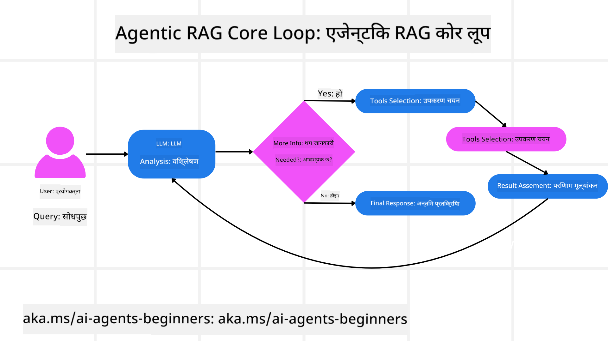
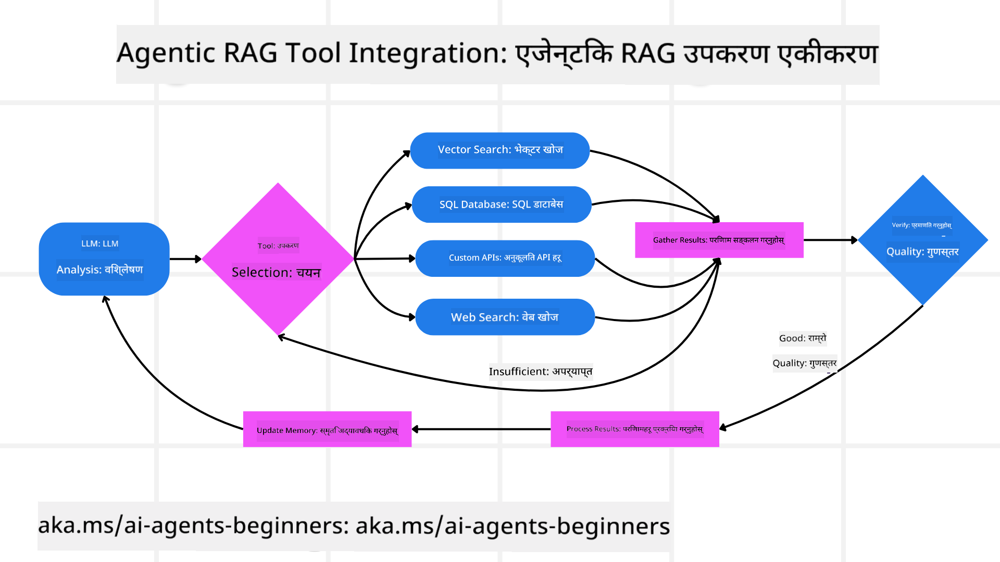
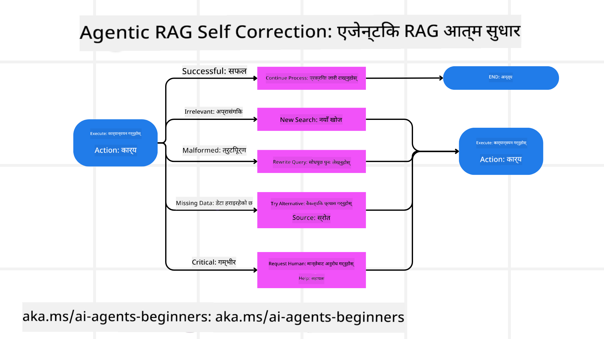
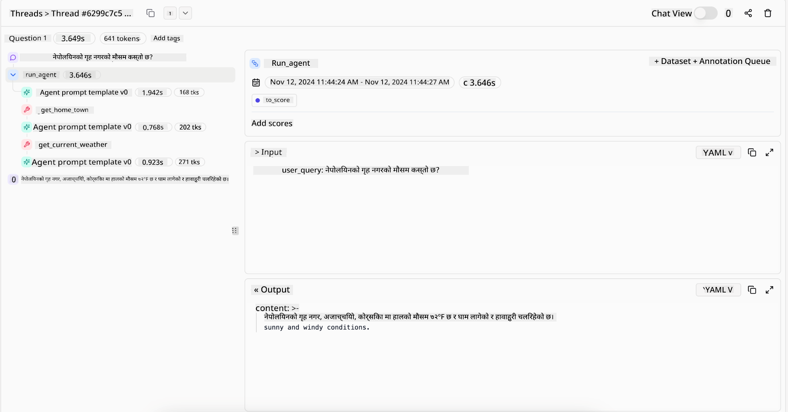
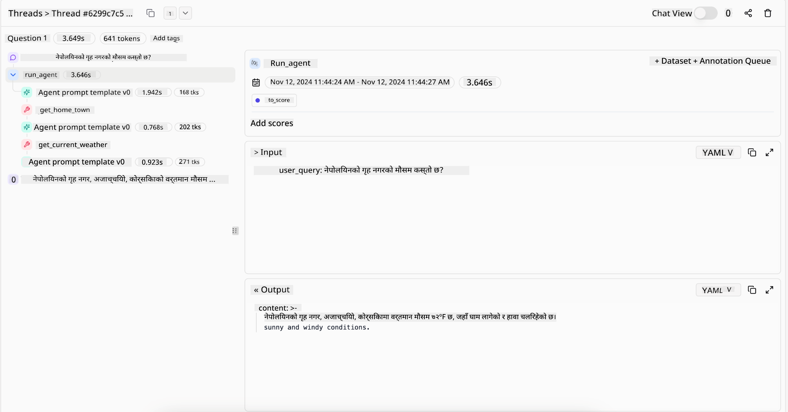

<!--
CO_OP_TRANSLATOR_METADATA:
{
  "original_hash": "7622aa72f9e676e593339f5f694ecd7d",
  "translation_date": "2025-07-12T09:57:55+00:00",
  "source_file": "05-agentic-rag/README.md",
  "language_code": "ne"
}
-->

> _(यो पाठको भिडियो हेर्न माथिको तस्बिरमा क्लिक गर्नुहोस्)_

# Agentic RAG

यो पाठले Agentic Retrieval-Augmented Generation (Agentic RAG) को व्यापक परिचय दिन्छ, जुन एक नयाँ AI मोडेल हो जहाँ ठूला भाषा मोडेलहरू (LLLs) स्वतन्त्र रूपमा आफ्नो अर्को कदम योजना बनाउँछन् र बाह्य स्रोतहरूबाट जानकारी सङ्कलन गर्छन्। स्थिर retrieval-then-read ढाँचाबाट फरक, Agentic RAG मा LLM लाई पुनरावृत्त रूपमा कल गरिन्छ, जसमा उपकरण वा फंक्शन कलहरू र संरचित आउटपुटहरू समावेश हुन्छन्। प्रणालीले नतिजाहरू मूल्याङ्कन गर्छ, सोधपुछहरू सुधार गर्छ, आवश्यक परे थप उपकरणहरू प्रयोग गर्छ, र सन्तोषजनक समाधान प्राप्त नभएसम्म यो चक्र जारी राख्छ।

## परिचय

यस पाठमा समेटिने विषयहरू:

- **Agentic RAG बुझ्नुहोस्:** AI मा उदाउँदै गरेको यो मोडेल जहाँ ठूला भाषा मोडेलहरूले स्वतन्त्र रूपमा आफ्नो अर्को कदम योजना बनाउँछन् र बाह्य डाटा स्रोतहरूबाट जानकारी सङ्कलन गर्छन्।
- **पुनरावृत्त Maker-Checker शैली बुझ्नुहोस्:** LLM लाई पुनरावृत्त रूपमा कल गर्ने लूप, जसमा उपकरण वा फंक्शन कलहरू र संरचित आउटपुटहरू समावेश हुन्छन्, जसले शुद्धता सुधार गर्न र गलत सोधपुछहरूलाई व्यवस्थापन गर्न मद्दत गर्छ।
- **व्यावहारिक प्रयोगहरू अन्वेषण गर्नुहोस्:** Agentic RAG जहाँ उत्कृष्ट हुन्छ, जस्तै शुद्धता-प्रथम वातावरणहरू, जटिल डाटाबेस अन्तरक्रियाहरू, र लामो कार्यप्रवाहहरू।

## सिकाइ लक्ष्यहरू

यस पाठ पूरा गरेपछि, तपाईंले जान्नुहुनेछ/बुझ्नुहुनेछ:

- **Agentic RAG बुझ्न:** AI मा उदाउँदै गरेको मोडेल जहाँ LLM हरूले स्वतन्त्र रूपमा आफ्नो अर्को कदम योजना बनाउँछन् र बाह्य डाटा स्रोतहरूबाट जानकारी सङ्कलन गर्छन्।
- **पुनरावृत्त Maker-Checker शैली:** LLM लाई पुनरावृत्त रूपमा कल गर्ने लूप, उपकरण वा फंक्शन कलहरू र संरचित आउटपुटहरूसँग, जसले शुद्धता सुधार गर्न र गलत सोधपुछहरूलाई व्यवस्थापन गर्न मद्दत गर्छ।
- **तर्क प्रक्रिया आफैंले नियन्त्रण गर्ने:** प्रणालीले आफ्नो तर्क प्रक्रिया आफैंले नियन्त्रण गर्ने क्षमता बुझ्नुहोस्, जसले पूर्वनिर्धारित मार्गहरूमा निर्भर नहुने गरी समस्या समाधान गर्ने निर्णय गर्छ।
- **कार्यप्रवाह:** कसरी एक agentic मोडेलले स्वतन्त्र रूपमा बजार प्रवृत्ति रिपोर्टहरू सङ्कलन गर्ने, प्रतिस्पर्धी डाटा पहिचान गर्ने, आन्तरिक बिक्री मेट्रिक्ससँग सम्बन्धित गर्ने, निष्कर्षहरू संश्लेषण गर्ने, र रणनीति मूल्याङ्कन गर्ने बुझ्नुहोस्।
- **पुनरावृत्त लूपहरू, उपकरण एकीकरण, र स्मृति:** प्रणालीले लूप गरिएको अन्तरक्रिया ढाँचामा निर्भर रहन्छ, जसले चरणहरूमा अवस्था र स्मृति कायम राख्छ ताकि दोहोरिने लूपहरूबाट बच्न र सूचित निर्णय लिन सकियोस्।
- **असफलता मोडहरू र आत्म-सुधार व्यवस्थापन:** प्रणालीका बलियो आत्म-सुधार संयन्त्रहरू अन्वेषण गर्नुहोस्, जसमा पुनरावृत्ति र पुनः सोधपुछ, डायग्नोस्टिक उपकरणहरूको प्रयोग, र मानव निरीक्षणमा फिर्ता जानु समावेश छ।
- **एजेन्सीका सीमाहरू:** Agentic RAG का सीमाहरू बुझ्नुहोस्, जसमा डोमेन-विशिष्ट स्वतन्त्रता, पूर्वाधारमा निर्भरता, र सुरक्षा मापदण्डहरूको सम्मान समावेश छ।
- **व्यावहारिक प्रयोग र मूल्य:** Agentic RAG जहाँ उत्कृष्ट हुन्छ, जस्तै शुद्धता-प्रथम वातावरणहरू, जटिल डाटाबेस अन्तरक्रियाहरू, र लामो कार्यप्रवाहहरू।
- **शासन, पारदर्शिता, र विश्वास:** शासन र पारदर्शिताको महत्त्व बुझ्नुहोस्, जसमा व्याख्यायोग्य तर्क, पूर्वाग्रह नियन्त्रण, र मानव निरीक्षण समावेश छ।

## Agentic RAG के हो?

Agentic Retrieval-Augmented Generation (Agentic RAG) एक नयाँ AI मोडेल हो जहाँ ठूला भाषा मोडेलहरूले (LLLs) स्वतन्त्र रूपमा आफ्नो अर्को कदम योजना बनाउँछन् र बाह्य स्रोतहरूबाट जानकारी सङ्कलन गर्छन्। स्थिर retrieval-then-read ढाँचाबाट फरक, Agentic RAG मा LLM लाई पुनरावृत्त रूपमा कल गरिन्छ, जसमा उपकरण वा फंक्शन कलहरू र संरचित आउटपुटहरू समावेश हुन्छन्। प्रणालीले नतिजाहरू मूल्याङ्कन गर्छ, सोधपुछहरू सुधार गर्छ, आवश्यक परे थप उपकरणहरू प्रयोग गर्छ, र सन्तोषजनक समाधान प्राप्त नभएसम्म यो चक्र जारी राख्छ। यो पुनरावृत्त “maker-checker” शैलीले शुद्धता सुधार गर्छ, गलत सोधपुछहरूलाई व्यवस्थापन गर्छ, र उच्च गुणस्तरका नतिजाहरू सुनिश्चित गर्छ।

प्रणालीले सक्रिय रूपमा आफ्नो तर्क प्रक्रिया नियन्त्रण गर्छ, असफल सोधपुछहरू पुनः लेख्छ, फरक retrieval विधिहरू छनौट गर्छ, र धेरै उपकरणहरू—जस्तै Azure AI Search मा भेक्टर खोज, SQL डाटाबेस, वा कस्टम API हरू—एकीकृत गर्छ, अन्तिम उत्तर तयार गर्नु अघि। एक agentic प्रणालीको विशेषता यसको तर्क प्रक्रिया आफैंले नियन्त्रण गर्ने क्षमता हो। परम्परागत RAG कार्यान्वयनहरू पूर्वनिर्धारित मार्गहरूमा निर्भर हुन्छन्, तर agentic प्रणालीले पाएको जानकारीको गुणस्तरका आधारमा स्वतन्त्र रूपमा कदमहरूको अनुक्रम निर्धारण गर्छ।

## Agentic Retrieval-Augmented Generation (Agentic RAG) को परिभाषा

Agentic Retrieval-Augmented Generation (Agentic RAG) AI विकासमा उदाउँदै गरेको मोडेल हो जहाँ LLM हरूले बाह्य डाटा स्रोतहरूबाट मात्र जानकारी सङ्कलन गर्दैनन्, तर आफ्ना अर्को कदमहरू पनि स्वतन्त्र रूपमा योजना बनाउँछन्। स्थिर retrieval-then-read ढाँचाहरू वा सावधानीपूर्वक स्क्रिप्ट गरिएको प्रॉम्प्ट अनुक्रमहरू भन्दा फरक, Agentic RAG मा LLM लाई पुनरावृत्त रूपमा कल गरिन्छ, जसमा उपकरण वा फंक्शन कलहरू र संरचित आउटपुटहरू समावेश हुन्छन्। प्रत्येक चरणमा, प्रणालीले प्राप्त नतिजाहरू मूल्याङ्कन गर्छ, सोधपुछहरू सुधार गर्ने निर्णय गर्छ, आवश्यक परे थप उपकरणहरू प्रयोग गर्छ, र सन्तोषजनक समाधान प्राप्त नभएसम्म यो चक्र जारी राख्छ।

यो पुनरावृत्त “maker-checker” शैलीले शुद्धता सुधार गर्न, संरचित डाटाबेसहरूमा गलत सोधपुछहरू (जस्तै NL2SQL) व्यवस्थापन गर्न, र सन्तुलित, उच्च गुणस्तरका नतिजाहरू सुनिश्चित गर्न डिजाइन गरिएको हो। सावधानीपूर्वक डिजाइन गरिएको प्रॉम्प्ट चेनहरूमा मात्र निर्भर नहुने, प्रणालीले सक्रिय रूपमा आफ्नो तर्क प्रक्रिया नियन्त्रण गर्छ। असफल सोधपुछहरू पुनः लेख्न सक्छ, फरक retrieval विधिहरू छनौट गर्न सक्छ, र धेरै उपकरणहरू—जस्तै Azure AI Search मा भेक्टर खोज, SQL डाटाबेस, वा कस्टम API हरू—एकीकृत गर्न सक्छ, अन्तिम उत्तर तयार गर्नु अघि। यसले अत्यधिक जटिल व्यवस्थापन फ्रेमवर्कहरूको आवश्यकता हटाउँछ। यसको सट्टा, “LLM कल → उपकरण प्रयोग → LLM कल → …” को सरल लूपले परिष्कृत र राम्रो आधारभूत आउटपुटहरू दिन सक्छ।

## तर्क प्रक्रिया आफैंले नियन्त्रण गर्ने

एउटा प्रणालीलाई “agentic” बनाउने विशेषता यसको तर्क प्रक्रिया आफैंले नियन्त्रण गर्ने क्षमता हो। परम्परागत RAG कार्यान्वयनहरू प्रायः मानवहरूले मोडेलका लागि पूर्वनिर्धारित मार्गमा निर्भर हुन्छन्: के प्राप्त गर्ने र कहिले गर्ने भन्ने सोचको श्रृंखला।
तर जब प्रणाली साँच्चिकै agentic हुन्छ, तब यसले आन्तरिक रूपमा समस्या कसरी समाधान गर्ने निर्णय गर्छ। यो केवल स्क्रिप्ट कार्यान्वयन मात्र होइन; यो पाएको जानकारीको गुणस्तरका आधारमा स्वतन्त्र रूपमा कदमहरूको अनुक्रम निर्धारण गर्छ।
उदाहरणका लागि, यदि यसलाई उत्पादन प्रक्षेपण रणनीति बनाउन भनिएको छ भने, यो केवल सम्पूर्ण अनुसन्धान र निर्णय-निर्माण कार्यप्रवाहलाई स्पष्ट पार्ने प्रॉम्प्टमा निर्भर हुँदैन। यसको सट्टा, agentic मोडेलले स्वतन्त्र रूपमा निर्णय गर्छ:

1. Bing Web Grounding प्रयोग गरी वर्तमान बजार प्रवृत्ति रिपोर्टहरू सङ्कलन गर्ने
2. Azure AI Search प्रयोग गरी सम्बन्धित प्रतिस्पर्धी डाटा पहिचान गर्ने
3. Azure SQL Database प्रयोग गरी ऐतिहासिक आन्तरिक बिक्री मेट्रिक्ससँग सम्बन्धित गर्ने
4. Azure OpenAI Service मार्फत निष्कर्षहरू एकीकृत गरी समग्र रणनीति तयार गर्ने
5. रणनीतिमा कमजोरी वा असंगतिहरूको मूल्याङ्कन गर्ने, आवश्यक परे अर्को retrieval चरण सुरु गर्ने
यी सबै चरणहरू—सोधपुछ सुधार गर्ने, स्रोतहरू छनौट गर्ने, उत्तरसँग “खुसी” नभएसम्म पुनरावृत्ति गर्ने—मोडेलले निर्णय गर्छ, मानवले पूर्वनिर्धारित गर्दैन।

## पुनरावृत्त लूपहरू, उपकरण एकीकरण, र स्मृति

एउटा agentic प्रणाली लूप गरिएको अन्तरक्रिया ढाँचामा निर्भर रहन्छ:

- **प्रारम्भिक कल:** प्रयोगकर्ताको लक्ष्य (प्रयोगकर्ता प्रॉम्प्ट) LLM लाई प्रस्तुत गरिन्छ।
- **उपकरण कल:** यदि मोडेलले अभाव वा अस्पष्ट निर्देशनहरू पत्ता लगाउँछ भने, यो उपकरण वा retrieval विधि चयन गर्छ—जस्तै भेक्टर डाटाबेस क्वेरी (जस्तै Azure AI Search Hybrid search निजी डाटामा) वा संरचित SQL कल—अधिक सन्दर्भ सङ्कलन गर्न।
- **मूल्याङ्कन र सुधार:** प्राप्त डाटालाई समीक्षा गरेपछि, मोडेल निर्णय गर्छ कि जानकारी पर्याप्त छ कि छैन। यदि छैन भने, सोधपुछ सुधार गर्छ, फरक उपकरण प्रयोग गर्छ, वा आफ्नो दृष्टिकोण समायोजन गर्छ।
- **सन्तुष्ट नभएसम्म दोहोर्याउने:** यो चक्र तबसम्म जारी रहन्छ जबसम्म मोडेलले अन्तिम, राम्रो तर्कसहितको उत्तर दिन पर्याप्त स्पष्टता र प्रमाण पाउँदैन।
- **स्मृति र अवस्था:** प्रणालीले चरणहरूमा अवस्था र स्मृति कायम राख्ने भएकाले, यसले अघिल्ला प्रयासहरू र तिनका नतिजाहरू सम्झन सक्छ, दोहोरिने लूपहरूबाट बच्छ र अघि बढ्दा सूचित निर्णय गर्छ।

समयसँगै, यसले विकासशील बुझाइको अनुभूति सिर्जना गर्छ, जसले मोडेललाई जटिल, बहु-चरण कार्यहरूमा मानवले निरन्तर हस्तक्षेप नगरी वा प्रॉम्प्ट पुनःरूपान्तरण नगरी नेभिगेट गर्न सक्षम बनाउँछ।

## असफलता मोडहरू र आत्म-सुधार व्यवस्थापन

Agentic RAG को स्वतन्त्रतामा बलियो आत्म-सुधार संयन्त्रहरू पनि समावेश छन्। जब प्रणालीले अड्चनहरू—जस्तै अप्रासंगिक कागजातहरू प्राप्त गर्ने वा गलत सोधपुछहरू सामना गर्ने—भोग्छ, तब यसले:

- **पुनरावृत्ति र पुनः सोधपुछ:** कम मूल्यका प्रतिक्रियाहरू फर्काउने सट्टा, मोडेल नयाँ खोज रणनीतिहरू प्रयास गर्छ, डाटाबेस सोधपुछहरू पुनः लेख्छ, वा वैकल्पिक डाटा सेटहरू हेर्छ।
- **डायग्नोस्टिक उपकरणहरूको प्रयोग:** प्रणालीले आफ्नो तर्क चरणहरू डिबग गर्न वा प्राप्त डाटाको शुद्धता पुष्टि गर्न थप फंक्शनहरू कल गर्न सक्छ। Azure AI Tracing जस्ता उपकरणहरूले बलियो अवलोकन र अनुगमन सक्षम पार्नेछन्।
- **मानव निरीक्षणमा फिर्ता जानु:** उच्च जोखिम वा बारम्बार असफल हुने अवस्थाहरूमा, मोडेलले अनिश्चितता जनाउन सक्छ र मानव मार्गदर्शन माग्न सक्छ। मानवले सुधारात्मक प्रतिक्रिया दिएपछि, मोडेलले त्यो पाठ सिकेर अगाडि बढ्न सक्छ।

यो पुनरावृत्त र गतिशील दृष्टिकोणले मोडेललाई निरन्तर सुधार गर्न अनुमति दिन्छ, जसले यसलाई केवल एक पटकको प्रणाली नभई सत्रको क्रममा आफ्ना गल्तीहरूबाट सिक्ने प्रणाली बनाउँछ।

## एजेन्सीका सीमाहरू

एउटा कार्य भित्र स्वतन्त्र भए तापनि, Agentic RAG कृत्रिम सामान्य बुद्धिमत्तासँग समान छैन। यसको “agentic” क्षमता मानव विकासकर्ताहरूले प्रदान गरेका उपकरणहरू, डाटा स्रोतहरू, र नीतिहरूमा सीमित छन्। यसले आफ्नै उपकरण आविष्कार गर्न वा सेट गरिएका डोमेन सीमाहरू बाहिर जान सक्दैन। बरु, यसले उपलब्ध स्रोतहरूलाई गतिशील रूपमा व्यवस्थापन गर्न उत्कृष्ट प्रदर्शन गर्छ।
अधिक उन्नत AI प्रकारहरूबाट मुख्य भिन्नताहरू:

1. **डोमेन-विशिष्ट स्वतन्त्रता:** Agentic RAG प्रणालीहरू परिचित डोमेन भित्र प्रयोगकर्ताद्वारा परिभाषित लक्ष्यहरू प्राप्त गर्न केन्द्रित हुन्छन्, जसले सोधपुछ पुनःलेखन वा उपकरण छनौट जस्ता रणनीतिहरू प्रयोग गर्छन्।
2. **पूर्वाधारमा निर्भर:** प्रणालीको क्षमता विकासकर्ताहरूले एकीकृत गरेका उपकरण र डाटामा निर्भर हुन्छ। मानव हस्तक्षेप बिना यी सीमाहरू पार गर्न सक्दैन।
3. **सुरक्षा मापदण्डहरूको सम्मान:** नैतिक दिशानिर्देशहरू, अनुपालन नियमहरू, र व्यापार नीतिहरू अत्यन्त महत्त्वपूर्ण रहन्छन्। एजेन्टको स्वतन्त्रता सधैं सुरक्षा उपायहरू र निरीक्षण संयन्त्रहरूले सीमित हुन्छ (आशा गरिन्छ)।

## व्यावहारिक प्रयोग र मूल्य

Agentic RAG पुनरावृत्त सुधार र शुद्धता आवश्यक पर्ने परिदृश्यहरूमा उत्कृष्ट हुन्छ:

1. **शुद्धता-प्रथम वातावरणहरू:** अनुपालन जाँच, नियामक विश्लेषण, वा कानुनी अनुसन्धानमा, agentic मोडेलले बारम्बार तथ्यहरू पुष्टि गर्न, धेरै स्रोतहरू परामर्श गर्न, र सोधपुछहरू पुनः लेख्न सक्छ जबसम्म पूर्ण रूपमा जाँचिएको उत्तर प्राप्त हुँदैन।
2. **जटिल डाटाबेस अन्तरक्रियाहरू:** संरचित डाटासँग व्यवहार गर्दा जहाँ सोधपुछहरू प्रायः असफल हुन सक्छन् वा समायोजन आवश्यक पर्छ, प्रणालीले स्वतन्त्र रूपमा Azure SQL वा Microsoft Fabric OneLake प्रयोग गरी सोधपुछहरू सुधार गर्न सक्छ, अन्तिम retrieval प्रयोगकर्ताको उद्देश्यसँग मेल खान्छ।
3. **लामो कार्यप्रवाहहरू:** लामो सत्रहरू नयाँ जानकारी आउँदा विकास हुन सक्छन्। Agentic RAG निरन्तर नयाँ डाटा समावेश गर्न सक्छ, समस्या क्षेत्रबारे थप सिक्दै रणनीतिहरू परिवर्तन गर्न सक्छ।

## शासन, पारदर्शिता, र विश्वास

यी प्रणालीहरू आफ्नो तर्कमा बढी स्वतन्त्र हुँदै जाँदा, शासन र पारदर्शिता अत्यन्त आवश्यक हुन्छ:

- **व्याख्यायोग्य तर्क:** मोडेलले गरेको सोधपुछहरूको अडिट ट्रेल प्रदान गर्न सक्छ, परामर्श गरिएका स्रोतहरू, र आफ्नो निष्कर्षमा पुग्न प्रयोग गरेको तर्कका चरणहरू। Azure AI Content Safety र Azure AI Tracing / GenAIOps जस्ता उपकरणहरूले पारदर्शिता कायम राख्न र जोखिमहरू कम गर्न मद्दत गर्छन्।
- **पूर्वाग्रह नियन्त्रण र सन्तुलित retrieval:** विकासकर्ताहरूले retrieval रणनीतिहरू समायोजन गर्न सक्छन् ताकि सन्तुलित, प्रतिनिधि डाटा स्रोतहरू विचारमा ल्याइए, र नियमित रूपमा आउटपुटहरू अडिट गरेर पूर्वाग्रह वा विकृत ढाँचाहरू पत्ता लगाउन सक्छन्, Azure Machine Learning प्रयोग गर्ने उन्नत डाटा विज्ञान संगठनहरूका लागि कस्टम मोडेलहरूसहित।
- **मानव निरीक्षण र अनुपालन:** संवेदनशील कार्यहरूका लागि, मानव समीक्षा आवश्यक रहन्छ। Agentic RAG उच्च जोखिम निर्णयहरूमा मानव निर्णयलाई प्रतिस्थापन गर्दैन—यसले थप जाँचिएको विकल्पहरू प्रदान गरेर त्यसलाई पूरक बनाउँछ।

कार्यहरूका स्पष्ट अभिलेख प्रदान गर्ने उपकरणहरू हुनु आवश्यक छ। ती बिना, बहु-चरण प्रक्रियाको डिबगिङ्ग धेरै कठिन हुन सक्छ। Literal AI (Chainlit पछाडि कम्पनी) बाट Agent रनको निम्न उदाहरण हेर्नुहोस्:

## निष्कर्ष

Agentic RAG ले AI प्रणालीहरूले जटिल, डाटा-गहन कार्यहरू कसरी व्यवस्थापन गर्छन् भन्नेमा प्राकृतिक विकास प्रतिनिधित्व गर्छ। लूप गरिएको अन्तरक्रिया ढाँचा अपनाएर, स्वतन्त्र रूपमा उपकरणहरू चयन गरेर, र उच्च गुणस्तरको नतिजा प्राप्त नभएसम्म सोधपुछहरू सुधार गरेर, प्रणाली स्थिर प्रॉम्प्ट-अनुगमनबाट बाहिर निस्केर बढी अनुकूल, सन्दर्भ-चेतन निर्णयकर्ता बन्छ। यद्यपि मानव-परिभाषित पूर्वाधार र नैतिक दिशानिर्देशहरूले सीमित भए तापनि, यी agentic क्षमताहरूले उद्यम र अन्तिम प्रयोगकर्ताहरूका लागि धनी, गतिशील, र अन्ततः उपयोगी AI अन्तरक्रियाहरू सक्षम पार्छन्।

## थप स्रोतहरू

- <a href="https://learn.microsoft.com/training/modules/use-own-data-azure-openai" target="_blank">Azure OpenAI Service सँग Retrieval Augmented Generation (RAG) कार्यान्वयन गर्नुहोस्: Azure OpenAI Service सँग आफ्नो डाटा कसरी प्रयोग गर्ने सिक्नुहोस्। यो

- <a href="https://learn.microsoft.com/azure/ai-studio/concepts/evaluation-approach-gen-ai" target="_blank">Azure AI Foundry सँग जनरेटिभ AI अनुप्रयोगहरूको मूल्याङ्कन: यो लेखले सार्वजनिक रूपमा उपलब्ध डेटासेटहरूमा मोडेलहरूको मूल्याङ्कन र तुलना समेट्छ, जसमा Agentic AI अनुप्रयोगहरू र RAG आर्किटेक्चरहरू समावेश छन्</a>
- <a href="https://weaviate.io/blog/what-is-agentic-rag" target="_blank">Agentic RAG के हो | Weaviate</a>
- <a href="https://ragaboutit.com/agentic-rag-a-complete-guide-to-agent-based-retrieval-augmented-generation/" target="_blank">Agentic RAG: एजेन्ट-आधारित रिट्रिभल अग्मेन्टेड जेनेरेशनको पूर्ण मार्गदर्शन – जनरेशन RAG बाट समाचार</a>
- <a href="https://huggingface.co/learn/cookbook/agent_rag" target="_blank">Agentic RAG: क्वेरी पुनःरूपान्तरण र आत्म-प्रश्नसँग आफ्नो RAG लाई टर्बोचार्ज गर्नुहोस्! Hugging Face Open-Source AI Cookbook</a>
- <a href="https://youtu.be/aQ4yQXeB1Ss?si=2HUqBzHoeB5tR04U" target="_blank">RAG मा Agentic लेयर्स थप्दै</a>
- <a href="https://www.youtube.com/watch?v=zeAyuLc_f3Q&t=244s" target="_blank">ज्ञान सहायकहरूको भविष्य: जेरी लियू</a>
- <a href="https://www.youtube.com/watch?v=AOSjiXP1jmQ" target="_blank">Agentic RAG प्रणालीहरू कसरी बनाउने</a>
- <a href="https://ignite.microsoft.com/sessions/BRK102?source=sessions" target="_blank">Azure AI Foundry Agent सेवा प्रयोग गरेर आफ्नो AI एजेन्टहरूलाई स्केल गर्नुहोस्</a>

### शैक्षिक कागजातहरू

- <a href="https://arxiv.org/abs/2303.17651" target="_blank">2303.17651 Self-Refine: आत्म-प्रतिक्रियासँग पुनरावृत्त सुधार</a>
- <a href="https://arxiv.org/abs/2303.11366" target="_blank">2303.11366 Reflexion: मौखिक सुदृढीकरण सिकाइसहित भाषा एजेन्टहरू</a>
- <a href="https://arxiv.org/abs/2305.11738" target="_blank">2305.11738 CRITIC: ठूलो भाषा मोडेलहरूले उपकरण-इंटरएक्टिभ समालोचनासँग आफैं सुधार गर्न सक्छन्</a>
- <a href="https://arxiv.org/abs/2501.09136" target="_blank">2501.09136 Agentic Retrieval-Augmented Generation: Agentic RAG मा सर्वेक्षण</a>

## अघिल्लो पाठ

[Tool Use Design Pattern](../04-tool-use/README.md)

## अर्को पाठ

[Building Trustworthy AI Agents](../06-building-trustworthy-agents/README.md)

**अस्वीकरण**:  
यो दस्तावेज AI अनुवाद सेवा [Co-op Translator](https://github.com/Azure/co-op-translator) प्रयोग गरी अनुवाद गरिएको हो। हामी शुद्धताका लागि प्रयासरत छौं, तर कृपया ध्यान दिनुहोस् कि स्वचालित अनुवादमा त्रुटि वा अशुद्धता हुनसक्छ। मूल दस्तावेज यसको मूल भाषामा नै अधिकारिक स्रोत मानिनुपर्छ। महत्वपूर्ण जानकारीका लागि व्यावसायिक मानव अनुवाद सिफारिस गरिन्छ। यस अनुवादको प्रयोगबाट उत्पन्न कुनै पनि गलतफहमी वा गलत व्याख्याका लागि हामी जिम्मेवार छैनौं।